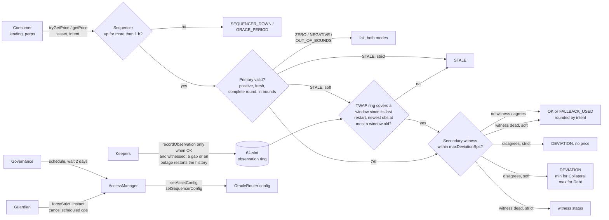

# Resilient Oracle Router

Solidity middleware that turns Chainlink-style feeds into one hardened, 1e18-normalized price per asset: heartbeat
staleness, L2 sequencer uptime with a grace period, answer bounds, a primary/secondary deviation breaker, a bounded
TWAP fallback, intent-directed rounding, and a non-reverting status API so consumers are never bricked by a dead feed.

[](https://github.com/monzon1985/blockchain/actions/workflows/01-resilient-oracle-router.yml)


## What's interesting here

- **The documentation is executable.** The two failure tables below hold **40 cells** (7 failure modes x strict/soft,
  plus 13 feed-death scenarios x strict/soft). [`FailureMatrix.t.sol`](test/matrix/FailureMatrix.t.sol) reads this
  README, replays every cell against an independent reference model, and calls the test each cell names, by selector.
  Five kinds of README drift (wrong status, wrong error, missing test, dropped row, false fallback claim) each fail the
  build; CI re-checks it on every push that touches this project.
- **One property suite, two engines, measured to be non-vacuous.** Ten stateful properties, including "never `OK`
  with a stale, zero or out-of-bounds price" and "a `FALLBACK_USED` price is the exact TWAP of validated answers",
  live in one contract ([`OracleSystem.sol`](test/invariant/OracleSystem.sol)) that Foundry (64 x 100 locally,
  256 x 100 in CI) and Medusa both drive. The handler is shaped so the fallback properties actually run: every
  full-depth Foundry run must evaluate them in at least one `FALLBACK_USED` state (`afterInvariant`), and in the CI
  campaign every run evaluated P7 in at least 3 such states (median 28 per 100-call run). A fixed 600-step walk
  checks all ten properties after every step, reaches all nine statuses and evaluates P7 in 185 `FALLBACK_USED`
  states.
- **Every injected bug is caught.** A mutation spot-check injects 17 realistic oracle bugs (one-second grace
  off-by-one, one-basis-point breaker slack, TWAP that never expires, TWAP carried across a recording gap or a
  sequencer outage, collateral rounded up, ...) into a copy of the code: **17/17 killed**, plus **5/5** README-drift
  mutants killed by the executable matrix.
- **100 % coverage of `src/`** (273/273 lines, 102/102 branches, 33/33 functions), gated at 95 % lines in CI;
  **0 Slither findings** at `--fail-pedantic`; 183 Foundry tests, 10,000 fuzz runs per fuzz test in CI.
- **Hardening has a price, and it is measured:** a full quote (sequencer + primary + secondary) costs 67,509 gas
  against 22,378 for the usual hand-rolled staleness check (+45,131); a TWAP fallback over a full 64-slot ring costs
  79,543.

## Overview

Chainlink-style push feeds are the default price source of lending markets, perps engines and stablecoins, and
using them naively is a named vulnerability class (OWASP SC03:2026, price oracle manipulation). The raw
`latestRoundData()` call returns an answer that can be stale, zero, negative, carried over from an earlier round,
timestamped in the future, pinned at the aggregator's own circuit-breaker floor (the LUNA crash of May 2022), or
reported while an L2 sequencer is down and users cannot react. Each consumer re-implementing these checks is how
they end up missing.

The hard part is not the checks, it is the policy when a check fails:

- **Reverting** is safe but bricks the consumer: repayments and liquidations stop while bad debt grows.
- **Falling back** keeps it alive but can serve a wrong price at the worst possible moment.

The router makes that policy explicit, per asset, with two modes. **Strict** fails closed on every anomaly. **Soft**
serves a bounded, conservative answer where one exists (the TWAP of validated observations while the primary is
silent, the conservative side of a disagreement, the primary alone when the witness is dead) and fails closed
everywhere else. Every combination of failure and mode is a documented, tested cell. Consumers pick the API that fits:
`tryGetPrice` never reverts on feed state and returns `(price, Status)`; `getPrice` returns the same price or reverts
with a custom error that carries the offending values.

Rounding is part of the public API: `Intent.Collateral` rounds down and takes the lower side of a disagreement,
`Intent.Debt` rounds up and takes the higher side, so a consumer can never overvalue collateral or undervalue debt.
The lending engine of this repository (project 22, `projects/22-isolated-lending-engine`) prices collateral
through a vendored copy of `IPriceOracle` that is ABI-identical to this one today; nothing yet checks that the two
copies stay identical.

## Architecture



| Component | Responsibility | Key external calls |
|---|---|---|
| [`OracleRouter`](src/OracleRouter.sol) | Pricing pipeline, both APIs, observation recording (`OK` answers only, cross-checked whenever a witness is configured; gap limit `min(heartbeat, twapWindow, sequencer uptime)`), delayed configuration, router-side delay floor | `latestRoundData()` on the sequencer, primary and secondary feeds (return-data-bounded `staticcall`); `canCall` / `consumeScheduledOp` on the AccessManager |
| [`FeedReader`](src/libraries/FeedReader.sol) | Reads a feed without ever reverting: raw `staticcall`, copies at most 160 bytes | the feed |
| [`ObservationRing`](src/libraries/ObservationRing.sol) | 64-slot ring of `(uint32 timestamp, uint224 cumulative)`; exact TWAP with interpolation; restarts instead of carrying an answer across a gap longer than `maxGap`; wrap-tolerant `unchecked` arithmetic | none |
| [`PriceMath`](src/libraries/PriceMath.sol) | 0-36 decimals to 1e18 with intent rounding; single-rounding TWAP normalization; deviation in basis points (rounded up, saturating) | none |
| [`IPriceOracle`](src/interfaces/IPriceOracle.sol) | The consumer surface: `Intent`, `Status`, `tryGetPrice` | none |
| [`OracleRouterGovernance`](script/OracleRouterGovernance.sol) | Production permission layout (roles, delays, guardian) | AccessManager admin functions |
| [`MockAggregatorV3`](test/mocks/MockAggregatorV3.sol), [`MockSequencerFeed`](test/mocks/MockSequencerFeed.sol) | Scriptable feeds with round history: stale, zero, negative, future timestamp, incomplete rounds, round regressions (`answeredInRound < roundId`), reverting and malformed responses | none |

### Failure-mode matrix

Notation of each cell: what `getPrice` does, then `(price, status)` returned by `tryGetPrice` (for both intents),
then the test that proves it. `SPOT` is the primary's answer, `TWAP` the time-weighted mean of validated observations,
`CONSERVATIVE` the lower of primary side and witness for `Collateral` and the higher for `Debt`. Scenario world: the
primary moves from 2,000 to 2,090 USD in 10-minute steps, keepers record every update, the TWAP window is 1 h
(2,080 USD at the time of the stale scenarios), the breaker threshold is 3 %.

<!-- failure-matrix:begin -->
| # | Key | Failure | Strict mode | Soft mode |
|---|---|---|---|---|
| 1 | `STALE` | Primary silent: `updatedAt` older than its heartbeat | reverts `StalePrice` → `(0, STALE)` · `test_Matrix_Stale_Strict` | returns `TWAP` → `(TWAP, FALLBACK_USED)` · `test_Matrix_Stale_Soft` |
| 2 | `ZERO` | Primary answers `0` | reverts `ZeroAnswer` → `(0, ZERO)` · `test_Matrix_Zero_Strict` | reverts `ZeroAnswer` → `(0, ZERO)` · `test_Matrix_Zero_Soft` |
| 3 | `NEGATIVE` | Primary answers a negative value | reverts `NegativeAnswer` → `(0, NEGATIVE)` · `test_Matrix_Negative_Strict` | reverts `NegativeAnswer` → `(0, NEGATIVE)` · `test_Matrix_Negative_Soft` |
| 4 | `OUT_OF_BOUNDS` | Primary answer below `minAnswer` (a LUNA-style floor break) | reverts `AnswerOutOfBounds` → `(0, OUT_OF_BOUNDS)` · `test_Matrix_OutOfBounds_Strict` | reverts `AnswerOutOfBounds` → `(0, OUT_OF_BOUNDS)` · `test_Matrix_OutOfBounds_Soft` |
| 5 | `SEQUENCER_DOWN` | L2 sequencer-uptime feed reports down | reverts `SequencerDown` → `(0, SEQUENCER_DOWN)` · `test_Matrix_SequencerDown_Strict` | reverts `SequencerDown` → `(0, SEQUENCER_DOWN)` · `test_Matrix_SequencerDown_Soft` |
| 6 | `GRACE_PERIOD` | Sequencer back up for less than `GRACE_PERIOD` (1 h) | reverts `GracePeriodNotOver` → `(0, GRACE_PERIOD)` · `test_Matrix_GracePeriod_Strict` | reverts `GracePeriodNotOver` → `(0, GRACE_PERIOD)` · `test_Matrix_GracePeriod_Soft` |
| 7 | `DEVIATION` | Secondary 10 % below the primary (threshold 3 %) | reverts `DeviationTooHigh` → `(0, DEVIATION)` · `test_Matrix_Deviation_Strict` | returns `CONSERVATIVE` → `(CONSERVATIVE, DEVIATION)` · `test_Matrix_Deviation_Soft` |
<!-- failure-matrix:end -->

### When each feed dies

<!-- feed-death-matrix:begin -->
| # | Key | Failure | Strict mode | Soft mode |
|---|---|---|---|---|
| 8 | `SECONDARY_DEAD` | Secondary feed reverts | reverts `FeedUnavailable` → `(0, STALE)` · `test_Death_SecondaryDead_Strict` | returns `SPOT` → `(SPOT, OK)` · `test_Death_SecondaryDead_Soft` |
| 9 | `SECONDARY_STALE` | Secondary older than its 24 h heartbeat | reverts `StalePrice` → `(0, STALE)` · `test_Death_SecondaryStale_Strict` | returns `SPOT` → `(SPOT, OK)` · `test_Death_SecondaryStale_Soft` |
| 10 | `PRIMARY_REVERTS` | Primary feed reverts (paused or access-controlled proxy) | reverts `FeedUnavailable` → `(0, STALE)` · `test_Death_PrimaryReverts_Strict` | returns `TWAP` → `(TWAP, FALLBACK_USED)` · `test_Death_PrimaryReverts_Soft` |
| 11 | `PRIMARY_MALFORMED` | Primary returns 32 bytes instead of 160 | reverts `FeedUnavailable` → `(0, STALE)` · `test_Death_PrimaryMalformed_Strict` | returns `TWAP` → `(TWAP, FALLBACK_USED)` · `test_Death_PrimaryMalformed_Soft` |
| 12 | `MISSING_TIMESTAMP` | Primary round never completed (`updatedAt == 0`) | reverts `MissingTimestamp` → `(0, STALE)` · `test_Death_MissingTimestamp_Strict` | returns `TWAP` → `(TWAP, FALLBACK_USED)` · `test_Death_MissingTimestamp_Soft` |
| 13 | `FUTURE_TIMESTAMP` | Primary `updatedAt` in the future | reverts `FutureTimestamp` → `(0, STALE)` · `test_Death_FutureTimestamp_Strict` | returns `TWAP` → `(TWAP, FALLBACK_USED)` · `test_Death_FutureTimestamp_Soft` |
| 14 | `CARRIED_OVER_ROUND` | Primary `answeredInRound < roundId` | reverts `StaleRound` → `(0, STALE)` · `test_Death_CarriedOverRound_Strict` | returns `TWAP` → `(TWAP, FALLBACK_USED)` · `test_Death_CarriedOverRound_Soft` |
| 15 | `TWAP_TOO_SHORT` | Primary stale, observations cover 20 min of a 60 min window | reverts `StalePrice` → `(0, STALE)` · `test_Death_TwapTooShort_Strict` | reverts `StalePrice` → `(0, STALE)` · `test_Death_TwapTooShort_Soft` |
| 16 | `TWAP_EXPIRED` | Primary stale, newest observation older than one window | reverts `StalePrice` → `(0, STALE)` · `test_Death_TwapExpired_Strict` | reverts `StalePrice` → `(0, STALE)` · `test_Death_TwapExpired_Soft` |
| 17 | `TWAP_GAP` | Primary stale, keepers were idle for 2 h (while the market fell to 1,900 USD) before the newest observation | reverts `StalePrice` → `(0, STALE)` · `test_Death_TwapGap_Strict` | reverts `StalePrice` → `(0, STALE)` · `test_Death_TwapGap_Soft` |
| 18 | `TWAP_DEVIATES` | Primary stale, live secondary 10 % below the TWAP | reverts `StalePrice` → `(0, STALE)` · `test_Death_TwapDeviates_Strict` | returns `CONSERVATIVE` → `(CONSERVATIVE, DEVIATION)` · `test_Death_TwapDeviates_Soft` |
| 19 | `SEQUENCER_UNREADABLE` | Sequencer-uptime feed reverts | reverts `FeedUnavailable` → `(0, SEQUENCER_DOWN)` · `test_Death_SequencerUnreadable_Strict` | reverts `FeedUnavailable` → `(0, SEQUENCER_DOWN)` · `test_Death_SequencerUnreadable_Soft` |
| 20 | `SEQUENCER_UNINITIALIZED` | Sequencer-uptime feed reports `startedAt == 0` | reverts `SequencerDown` → `(0, SEQUENCER_DOWN)` · `test_Death_SequencerUninitialized_Strict` | reverts `SequencerDown` → `(0, SEQUENCER_DOWN)` · `test_Death_SequencerUninitialized_Soft` |
<!-- feed-death-matrix:end -->

How the tables are enforced: `test_ReadmeFailureMatrixIsExecutable` and `test_ReadmeFeedDeathMatrixIsExecutable`
parse the rows between the HTML markers, rebuild each scenario, check the status, the price (against a reference model
that recomputes `SPOT`, `TWAP` and `CONSERVATIVE` from the mocks and a ghost log of observations), the `getPrice`
revert selector or value, and finally run the named test. They also require the first table to list exactly the seven
failure statuses of the `Status` enum, in order. The reference `TWAP` applies the gap rule on its own (it scans the
ghost log for silences longer than one heartbeat or window, and for sequencer recoveries), so a cell can only claim a
TWAP that exists. The 40 named tests check the same cells with hand-derived, typed expectations (exact custom-error
arguments, exact prices).

## Roles and trust assumptions

| Role | Holder (production layout) | Can do | If compromised |
|---|---|---|---|
| `CONFIG_ROLE` | Governance multisig, 2-day execution delay (router-enforced floor) | `setAssetConfig`, `setSequencerConfig` | Can repoint an asset to a malicious feed, but only after the change has been public for 2 days, during which the guardian can cancel it. |
| `GUARDIAN_ROLE` | Fast-response account, no delay | `forceStrict(asset)`; cancel scheduled `CONFIG_ROLE` operations | Can make soft assets strict (less liveness, never a wrong price) and veto configuration changes (governance DoS). Cannot move a price. |
| AccessManager `ADMIN_ROLE` | Governance, 2-day delay; the deployer renounces it | Roles, delays, target functions, the router's authority | Root of trust: can, after 2 days, grant roles or move the router to another authority. |
| Keeper | Anyone | `recordObservation` when the router would serve `OK` (and, for a soft asset with a witness, the witness can confirm it), at most once per `twapWindow / 32` | Can choose sampling times: the bias is bounded by the price movement within one interval, and an interval never exceeds `min(heartbeat, twapWindow)`, because a longer silence restarts the history. Can stop recording: one window after the last observation the fallback expires and soft behaves like strict on a stale primary. Cannot inject a price. |
| Feed operators | Chainlink-style networks | Publish answers | Bounded by every check above; the witness and the bounds limit a single bad feed. |

The router trusts the sequencer-uptime feed to be honest and the AccessManager to be the one configured at deployment.

## Invariants and properties

Stateful properties, checked after every call by Foundry ([`OracleRouter.invariant.t.sol`](test/invariant/OracleRouter.invariant.t.sol))
and Medusa ([`medusa.json`](medusa.json)) on the same [`OracleSystem`](test/invariant/OracleSystem.sol): three assets
with 8/18, 36/0 and 18/none decimals (heartbeat/window 1 h/30 min, 2 h/1 h and 30 min/45 min, so gap limits are set by
the window and by the heartbeat), a strict and a soft router over the same feeds with a 10-minute sequencer grace
period (so an outage can be shorter than a gap limit), and seven actions. Time passes (healthy feeds keep publishing
and keepers record every asset on both routers; some steps are 20-75 minute keeper pauses around the gap limits, one in
twenty is up to 6 hours of silence); feeds are updated, corrupted and healed; a primary publishes for one window and
then goes silent while keepers keep recording until it is stale (the scenario the fallback exists for); the sequencer
flips (rarely: each outage restarts every history); keepers run an extra round. The reference model (spot, TWAP,
statuses) is written independently from the router and applies the gap rule by itself.

| # | Property | Test |
|---|---|---|
| P1 | `OK` is only returned for a fresh, positive, in-bounds primary behind a healthy sequencer, and equals the primary normalized in the caller's rounding. | `invariant_okMeansHealthyInputs` |
| P2 | Never `OK` with a stale, zero, negative or out-of-bounds primary; a broken primary is never quoted by the strict router, and by the soft router only through its TWAP when the primary is merely stale. | `invariant_neverOkWithStaleZeroOrOutOfBounds` |
| P3 | A price is non-zero exactly when it is usable: `OK`, `FALLBACK_USED`, or `DEVIATION` in soft mode. | `invariant_zeroPriceIffUnusable` |
| P4 | `getPrice` returns exactly the non-zero price of `tryGetPrice` and reverts exactly when it is zero. | `invariant_revertingAndNonRevertingApisAgree` |
| P5 | While the sequencer is down or in its grace period, nothing is priced in either mode. | `invariant_sequencerOutageBlocksEverything` |
| P6 | Strict is never looser than soft: whenever strict prices, soft returns the same price and status. | `invariant_strictNeverLooserThanSoft` |
| P7 | `FALLBACK_USED` comes only from the soft router, only for a stale primary, and equals the exact TWAP of the accepted observations since the last gap or outage (recomputed from a ghost log). | `invariant_fallbackIsExactTwapOfValidatedAnswers` |
| P8 | Soft-mode liveness: with a healthy sequencer, a stale primary and a full, fresh window, the soft router always quotes. | `invariant_softBridgesWheneverItCan` |
| P9 | The status never depends on the intent; debt is never priced below collateral, and they differ by at most one wei for `OK` and `FALLBACK_USED`. | `invariant_debtNeverBelowCollateral` |
| P10 | Every usable price lies within the normalized bounds of the feeds it can come from. | `invariant_usablePricesWithinBounds` |

The properties are checked after every call, so a state counts as an evaluation. `OracleSystem` counts, after every
action, the states in which P7 and P8 have something to check, and the suite fails if they are vacuous:
`afterInvariant` requires every full-depth Foundry run to contain at least one `FALLBACK_USED` state and one state
where P8's premise holds (shrink attempts and replays of a persisted counterexample are shorter and exempt), and the
600-step walk (`OracleSystemReachabilityTest`, all ten properties checked after every step) asserts floors well below
its measured counts, history restarts included. Measured with the fixed seed `0x01`:

| Campaign | States checked | `FALLBACK_USED` (P7) | TWAP vs witness `DEVIATION` | P8 premise held | Fallback refused (soft `STALE`) | History restarts |
|---|---:|---:|---:|---:|---:|---:|
| Walk, 600 steps (`forge test --match-test test_WalkReachesEveryStatus -vv`) | 600 | 185 | 59 | 239 | 420 | 130 |
| Foundry default, 64 x 100: per run, minimum / median | 100 per run | 2 / 28 | 0 / 4 | 11 / 32 | 31 / 65 | 4 / 14 |
| Foundry CI, 256 x 100: per run, minimum / median | 100 per run | 3 / 28 | 0 / 5 | 5 / 34 | 17 / 63 | 4 / 14 |

The per-run rows come from `ORACLE_CAMPAIGN_STATS=true` (one line per full-depth run; Foundry called `afterInvariant`
on 65 and 257 full-depth runs for its reported 64 and 256). A TWAP-vs-witness disagreement occurred in 56 of the 65
default runs and 220 of the 257 CI runs.

Additional properties checked by fuzzing: normalization equals `mulDiv(answer, 1e18, 10^decimals)` rounded by intent
for every decimals value 0-36, with round-trip error below one unit ([`Normalization.fuzz.t.sol`](test/fuzz/Normalization.fuzz.t.sol));
the ring equals a naive unbounded reference for random histories of up to 150 observations, with random gap limits
(so histories restart) and across the 2^32 timestamp wrap ([`Twap.fuzz.t.sol`](test/fuzz/Twap.fuzz.t.sol)); the
breaker equals the real-valued comparison ([`Breaker.fuzz.t.sol`](test/fuzz/Breaker.fuzz.t.sol)).

## Security considerations and threat model

The full threat model (assets, actors, 14 attack vectors with their mitigation and evidence, behavior when each feed
dies) is in [`docs/threat-model.md`](docs/threat-model.md); static-analysis triage is in
[`docs/static-analysis.md`](docs/static-analysis.md). Highlights:

- **Fail closed where a degraded answer would be exploitable.** Zero, negative and out-of-bounds answers are never
  bridged: when an aggregator is pinned at its floor during a crash, a lagging TWAP would overvalue the collateral
  exactly like the pinned feed did.
- **Sequencer outages are never bridged**, and a sequencer feed that is unreadable, uninitialized (`startedAt == 0`)
  or reports anything but `0` counts as down. No TWAP averages across an outage either: the first observation after
  the sequencer recovers restarts the history.
- **The fallback cannot serve ancient data:** the TWAP only averages answers the router itself served as `OK` (and,
  when the asset has a witness, that the witness confirmed); it never carries an answer across a silence longer than
  `min(heartbeat, twapWindow)`, so every second it averages lies within the last two windows and is priced by an
  answer validated at most that long before; its window ends at the newest observation, it expires one window later,
  and it still faces the deviation breaker.
- **`consultTwap` is a diagnostic view, not a price:** it ignores the breaker and the mode, and returns nothing while
  the sequencer is down or in its grace period. `tryGetPrice` and `getPrice` are the only pricing entry points.
- **Feeds cannot make `tryGetPrice` revert** by reverting, returning short data or return-bombing.
- **Configuration is slow and public; tightening is instant.** The 2-day delay is enforced by the router itself, not
  only by the AccessManager's configuration.

Known limitations: the AccessManager admin is the root of trust; the TWAP adds no information the primary did not
already publish (with `twapWindow <= heartbeat / 2` it collapses to the last validated answer); keepers choose
sampling times; feed decimals are cached at configuration; a soft asset serves its primary without a cross-check while
its witness is dead (but stops recording it); after a long keeper silence or a sequencer outage the fallback needs a
full new window; a feed that burns all forwarded gas can make the caller run out of gas. Each is discussed in the
threat model.
**Nothing in this repository has been professionally audited, and the router is not deployed anywhere.**

## Design decisions and trade-offs

- **One pipeline, two APIs.** `_quote` computes the price, the status and a typed failure record; `getPrice` reverts
  with the failure as a custom error, `tryGetPrice` drops it. They cannot drift apart (P4), and the fallback can be
  tried before deciding to revert.
- **Per-asset strict/soft instead of per-call flags.** Degradation policy is a risk decision of the market, not of the
  caller. Strict is provably never looser than soft (P6), which is what makes an instant, guardian-only `forceStrict`
  safe.
- **TWAP only for the stale family.** A silent feed's last answers are trustworthy until they age; a feed that says
  zero, a negative number or something outside its bounds is actively wrong for an unknown reason.
- **The secondary is a witness, not a substitute.** Promoting it to sole source would silently change the trust
  assumptions (a witness is often a cheaper or slower network). Protocols that want source failover compose two
  `IPriceOracle` sources; the oracle adapter of project 22 (`src/oracles/RouterOracleAdapter.sol` there) does this.
- **Breaker metric:** gap relative to the lower price (symmetric, the stricter of the two relative measures, as in
  Liquity's price feed), computed on rounded-down prices so both intents see the same decision, and rounded up so
  "more than N bps" is exact (a 1-wei test proves it).
- **Bounds per feed in raw units**, mirroring Chainlink's own `minAnswer` / `maxAnswer`, capped at `2^192 - 1`
  (Chainlink answers are `int192`) and at least one wei once normalized, so a validated price is never zero.
- **Accumulate raw answers, round once.** The ring sums raw answers (not normalized ones), so a TWAP of a 36-decimal
  feed is rounded exactly once, in the caller's direction.
- **Spacing `twapWindow / 32` with 64 slots:** the ring always spans at least 63/32 windows, so recording as fast as
  allowed cannot evict the history a TWAP needs.
- **A gap limit, not just a spacing rule.** Carrying an answer forward is only sound while it could still be the
  answer in force: never longer than one primary heartbeat (by then the feed must have published again), never longer
  than one window (a single interval would fill it), and never across a sequencer outage. An observation after a longer
  silence restarts the ring (as cheap as a first observation) rather than trying to average around a hole; the
  trade-off is liveness right after the silence, which is when an old average is least trustworthy anyway.
- **Only witnessed answers are stored.** A soft asset still serves its primary alone while the witness is dead, but
  keepers cannot record it, so the TWAP never contains an answer the breaker did not see. The keeper pays one extra
  feed read for it.
- **Router-enforced delay floor.** Overriding `AccessManaged._checkCanCall` makes the 2-day delay a property of the
  router. Trade-off: `AccessManager.execute` hides the caller's delay, so governance must call the router directly
  after scheduling.
- **Unconfigured assets revert even in `tryGetPrice`:** that is a deployment bug, not a feed state, and a silent zero
  would hide it.
- **Gas is spent on reads, not packing tricks.** Three storage slots per feed keep the bounds in full `uint192`
  precision; see the gas table for what that costs.

## Testing

```bash
forge soldeer install
forge fmt --check && forge build && forge lint
forge test                                   # default profile: 1,000 fuzz runs, 64 x 100 invariant runs
FOUNDRY_PROFILE=ci forge test                # CI profile: 10,000 fuzz runs, 256 x 100 invariant runs, fixed seed
forge coverage --report lcov --no-match-coverage '(test|script)' && node scripts/check-coverage.mjs lcov.info --min-lines 95
medusa fuzz --config medusa.json --timeout 180
slither . --config-file slither.config.json --fail-medium
# Optional: per-run statistics of the invariant campaign (one line per run, in demo-out/)
ORACLE_CAMPAIGN_STATS=true FOUNDRY_PROFILE=ci forge test --match-contract OracleRouterInvariantTest
node --test scripts/check-coverage.test.mjs scripts/mutation-spot-check.test.mjs   # the scripts' own tests
node scripts/mutation-spot-check.mjs         # 17 code mutants + 5 README mutants (about 16 minutes)
bash script/local-demo.sh                    # end-to-end demo on anvil (free port)
```

| Kind | Suite ([`test/`](test)) | Tests |
|---|---|---:|
| Unit, table-driven | `ValidationTest` ([`Validation.t.sol`](test/unit/Validation.t.sol)): Foundry table tests (10 failure rows, run once on the primary and once on the secondary) plus exact custom-error arguments | 20 |
| Unit | `SequencerTest` ([`Sequencer.t.sol`](test/unit/Sequencer.t.sol)): down, unreadable, uninitialized, grace-period boundaries | 9 |
| Unit | `DeviationTest` ([`Deviation.t.sol`](test/unit/Deviation.t.sol)): breaker threshold to the wei, conservative side per intent | 10 |
| Unit | `TwapFallbackTest` ([`TwapFallback.t.sol`](test/unit/TwapFallback.t.sol)): window coverage, expiry, ring rollover, history restarts after keeper gaps and sequencer outages (the review's three proofs of concept), witness rule, `consultTwap` during outages, observation rules | 31 |
| Unit, table-driven | `ConfigTest` ([`Config.t.sol`](test/unit/Config.t.sol)): a 14-row table of invalid configurations, constructor, events, reconfiguration | 10 |
| Unit | `GovernanceTest` ([`Governance.t.sol`](test/unit/Governance.t.sol)): 2-day delay, router-side floor, guardian veto and `forceStrict` | 11 |
| Unit | `ObservationRingTest`, `PriceMathTest`, `FeedReaderTest` ([`Libraries.t.sol`](test/unit/Libraries.t.sol)): gap rule boundaries, wrap-around, rounding, short and oversized return data | 12 + 5 + 5 |
| Unit | `MocksTest` ([`Mocks.t.sol`](test/unit/Mocks.t.sol)) and `DeployScriptTest` ([`DeployScript.t.sol`](test/unit/DeployScript.t.sol)) | 6 + 4 |
| Executable docs | `FailureMatrixTest` ([`FailureMatrix.t.sol`](test/matrix/FailureMatrix.t.sol)): 40 typed cell tests + 2 README parsers | 42 |
| Fuzz | `NormalizationFuzzTest`, `BreakerFuzzTest`, `TwapFuzzTest` ([`test/fuzz/`](test/fuzz)) | 4 + 2 + 1 |
| Invariant | `OracleRouterInvariantTest` (the ten properties, with per-run non-vacuity checks) and `OracleSystemReachabilityTest` (600-step walk, all ten properties after every step, all nine statuses) | 1 + 1 |
| Gas | `GasBench`, `GasBenchFallback`, `GasBenchSequencerDown` ([`GasBench.t.sol`](test/gas/GasBench.t.sol)) | 9 |
| **Total** | **20 suites** (`forge test`: 183 passed, 0 failed, 0 skipped) | **183** |

Outside Foundry: Medusa checks the same ten properties (10 property tests; its assertion mode is off, because the
handler carries no `assert` post-conditions and every check is a property). A local 180 s run (2026-10-01) made
25,560 calls in 254 sequences with 0 failures. A second 180 s run with lcov coverage (25,384 calls) executed the
success path of `OracleRouter._fallback` 14,120 times and the ring's restart branch 4,312 times; before the handler was
reshaped, a 150 s run reached that success path 9 times. The coverage gate and the mutation script's helpers have
7 + 4 `node:test` tests, and the local demo asserts the status of every step against a real anvil node.

Settings: fuzz seed `0x01` in both profiles, 1,000 fuzz runs locally and 10,000 in CI; invariants 64 x 100 locally and
256 x 100 in CI (25,600 calls, 0 reverts), with `fail_on_revert = true` (handler actions never revert). Medusa:
4 workers, sequences of 100 calls, all ten properties checked after every call, 30 M gas per call (one
`silencePrimary` call simulates up to 3.5 hours of publishing and recording; it measured at most 10.1 M gas).

**Coverage of `src/`** (from `node scripts/check-coverage.mjs lcov.info --min-lines 95`):

| File | Lines | Branches | Functions |
|---|---:|---:|---:|
| [`src/OracleRouter.sol`](src/OracleRouter.sol) | 198/198 | 85/85 | 25/25 |
| [`src/libraries/FeedReader.sol`](src/libraries/FeedReader.sol) | 12/12 | 2/2 | 1/1 |
| [`src/libraries/ObservationRing.sol`](src/libraries/ObservationRing.sol) | 50/50 | 12/12 | 4/4 |
| [`src/libraries/PriceMath.sol`](src/libraries/PriceMath.sol) | 13/13 | 3/3 | 3/3 |
| **Total** | **273/273 (100 %)** | **102/102 (100 %)** | **33/33 (100 %)** |

**Mutation spot-check** ([`scripts/mutation-spot-check.mjs`](scripts/mutation-spot-check.mjs)): each mutant is
applied to a temporary copy, must still compile under `deny = "warnings"`, and must make at least one test fail.

| Mutant | Injected bug | Failing tests | Caught by (first failures) |
|---|---|---:|---|
| `stale-slack` | staleness check tolerates one extra minute | 33 | `test_AgeOneSecondOverHeartbeat_IsStale`, `test_StalePrice_CarriesUpdatedAtAgeAndHeartbeat`, `test_Death_SecondaryStale_Strict`, ... |
| `fallback-any-failure` | soft mode bridges every failure, not only `STALE` | 10 | `test_PrimaryFailureWinsOverSecondaryFailure`, `tableValidationTest`, `test_Matrix_Negative_Soft`, ... |
| `collateral-rounds-up` | collateral normalization rounds up | 6 | `test_ToWad_RoundsByIntentAbove18Decimals`, `test_DecisionIsIntentIndependent_ForHighDecimalFeeds`, `testFuzz_RoundTripErrorBounds`, ... |
| `grace-exclusive` | grace period ends one second early | 1 | `test_GracePeriod_StartsWhenSequencerComesBack` |
| `breaker-slack` | deviation breaker tolerates one extra basis point | 4 | `test_DecisionIsIntentIndependent_ForHighDecimalFeeds`, `test_GapMeasuredAgainstLowerPrice`, `test_GapOneWeiOverThreshold_Trips`, ... |
| `conservative-swapped` | soft deviation quotes the higher price for collateral | 10 | `test_DecisionIsIntentIndependent_ForHighDecimalFeeds`, `test_Soft_CollateralTakesTheLowerSide`, `test_Soft_DebtTakesTheHigherSide`, ... |
| `twap-never-expires` | TWAP fallback never expires | 7 | `testFuzz_RingMatchesNaiveReference`, `test_Consult_UnavailableWhenTooShortOrExpired`, `test_NewestObservationOlderThanWindow_Expires`, ... |
| `twap-no-interpolation` | TWAP window start not interpolated | 9 | `test_Consult_ExactWindowAndInterpolation`, `test_CumulativeWrap_IsTolerated`, `test_TimestampWrap_IsTolerated`, ... |
| `no-delay-floor` | router trusts the AccessManager's delay configuration | 2 | `test_Config_RelayedThroughExecuteIsRefused`, `test_Config_ShortDelayRoleIsRefusedByRouter` |
| `no-round-check` | `answeredInRound < roundId` accepted | 11 | `test_Death_CarriedOverRound_Soft`, `test_Death_CarriedOverRound_Strict`, `test_ReadmeFeedDeathMatrixIsExecutable`, ... |
| `sequencer-uninitialized-ok` | uninitialized sequencer feed (`startedAt == 0`) treated as up | 4 | `test_UninitializedFeed_CountsAsDown`, `test_Death_SequencerUninitialized_Soft`, `test_Death_SequencerUninitialized_Strict`, ... |
| `record-deviating` | observations recorded while the breaker is tripped | 12 | `test_Record_RejectsAnythingButOk`, `test_WalkReachesEveryStatus`, `invariant_debtNeverBelowCollateral`, ... |
| `twap-carries-across-gaps` | an answer is carried across any recording gap (the bug the review found) | 14 | `testFuzz_RingMatchesNaiveReference`, `test_AncientAnswer_IsNeverCarriedIntoTheWindow`, `test_GapOfExactlyMaxGap_IsCarried_OneSecondMoreRestarts`, ... |
| `gap-limit-ignores-heartbeat` | the gap limit is the window even when the heartbeat is shorter | 1 | `test_MaxGap_IsTheShorterOfHeartbeatAndWindow` |
| `outage-carried-over` | observations carried across a sequencer outage shorter than the gap limit | 2 | `test_WalkReachesEveryStatus`, `test_SequencerOutage_RestartsHistoryEvenWithinMaxGap` |
| `record-without-witness` | a soft asset records its primary while the witness is dead | 2 | `test_Record_SoftAssetWithDeadWitness_IsRefused`, `test_Record_SoftAssetWithUnhealthyWitness_IsRefused` |
| `consult-ignores-sequencer` | `consultTwap` reports a TWAP during a sequencer outage | 1 | `test_ConsultTwap_IsUnavailableWhileTheSequencerIsUnhealthy` |
| `doc-wrong-status` | README: soft `STALE` cell claims status `OK` | 1 | `test_ReadmeFailureMatrixIsExecutable` |
| `doc-missing-test` | README: cell names a test that does not exist | 1 | `test_ReadmeFailureMatrixIsExecutable` |
| `doc-wrong-error` | README: strict `ZERO` cell names the wrong custom error | 1 | `test_ReadmeFailureMatrixIsExecutable` |
| `doc-dropped-row` | README: `GRACE_PERIOD` row removed | 1 | `test_ReadmeFailureMatrixIsExecutable` |
| `doc-false-fallback` | README: soft `OUT_OF_BOUNDS` cell claims a TWAP fallback | 1 | `test_ReadmeFailureMatrixIsExecutable` |

Result: **22/22 mutants killed** (`node scripts/mutation-spot-check.mjs`, 16 min 9 s on a 16-core machine with 256 fuzz
runs, 32 invariant runs and no shrinking per mutant; Foundry's persisted counterexamples are cleared between mutants so
each one is judged on its own). CI runs the code and README mutants as two parallel jobs.

The stateful suite alone (`forge test --match-path 'test/invariant/*'`) kills `twap-carries-across-gaps` (P7 in the
walk and in `invariant_fallbackIsExactTwapOfValidatedAnswers`), `outage-carried-over` (P7 in the walk) and
`record-deviating`; before this handler was reshaped, no stateful property could see a TWAP-freshness bug.
`gap-limit-ignores-heartbeat` is only caught by its unit test: the handler's silence scenario always builds a fresh
window, which never straddles an earlier pause.

## Gas

`forge snapshot --match-contract GasBench` (committed in [`.gas-snapshot`](.gas-snapshot), checked in CI). One
measured call per test, starting cold; the baselines read the same mock feed.

| Path | Gas | vs hand-rolled check |
|---|---:|---:|
| Baseline: unchecked `latestRoundData()` read | 22,198 | -180 |
| Baseline: hand-rolled "positive and not older than the heartbeat" check | 22,378 | 0 |
| `getPrice`, primary only, L1 (no sequencer feed) | 34,318 | +11,940 |
| `getPrice`, primary only, L2 (sequencer check) | 44,536 | +22,158 |
| `getPrice`, primary + secondary, L2 (full pipeline) | 67,509 | +45,131 |
| `tryGetPrice`, primary + secondary, L2 (`Debt` intent) | 67,551 | +45,173 |
| `tryGetPrice`, TWAP fallback (primary reverts; binary search over a full 64-slot ring; secondary cross-check) | 79,543 | +57,165 |
| `tryGetPrice`, sequencer down (cheapest failure: one feed read) | 21,063 | -1,315 |
| `recordObservation` (keeper: full quote + witness check + one ring slot + header) | 128,832 | n/a |

Where the gas goes: each configured feed costs three cold storage slots (6,300 gas) plus a cold external call, and the
L2 sequencer check adds one more feed read. That is the price of keeping the bounds in full `uint192` precision and
of reading every feed through the non-reverting `staticcall` path.

The mock feed's `latestRoundData()` is more expensive than a production proxy, so absolute numbers are indicative;
the deltas between rows are what the router adds.

## Getting started

Prerequisites: Foundry 1.8.3, Node 24 (coverage gate and mutation script), Python 3.12 with `uv` for Slither 0.11.6
and crytic-compile 0.4.2, Medusa 1.5.1. Everything runs offline against local chains; no RPC endpoint or API key.
The analyzers install the way CI installs them (transitive Python dependencies pinned in
[`ci/slither-constraints.txt`](ci/slither-constraints.txt)):

```bash
cd projects/01-resilient-oracle-router
uv tool install --python 3.12 slither-analyzer==0.11.6 --with crytic-compile==0.4.2 -c ci/slither-constraints.txt
uv tool install --python 3.12 crytic-compile==0.4.2 -c ci/slither-constraints.txt    # Medusa compiles through it
go install github.com/crytic/medusa@v1.5.1     # or the v1.5.1 release binary (CI verifies its SHA-256)
```

```bash
cd projects/01-resilient-oracle-router
forge soldeer install          # locked by soldeer.lock: forge-std 1.16.2, OpenZeppelin Contracts 5.7.0
forge build
forge test
bash script/local-demo.sh      # anvil on a free port: deploy, TWAP fallback, breaker, sequencer and history restart,
                               # 2-day governance; every step asserts its expected status and exits non-zero otherwise
```

Deploying for real uses a keystore (no private key in the environment):

```bash
GOVERNANCE=0x... GUARDIAN=0x... SEQUENCER_FEED=0x... ROUTER_CONFIG=script/config/assets.example.json \
  forge script script/DeployOracleRouter.s.sol --rpc-url <rpc> --account <keystore> --sender <address> --broadcast
```

`script/config/assets.example.json` shows the schema with placeholder addresses. Consumers integrate through
[`IPriceOracle`](src/interfaces/IPriceOracle.sol):

```solidity
(uint256 price, IPriceOracle.Status status) = oracle.tryGetPrice(asset, IPriceOracle.Intent.Collateral);
if (price == 0) { /* no usable price: pause borrows, keep repayments open */ }
```

## Project structure

```
src/
  OracleRouter.sol                 pipeline, APIs, observations, configuration, delay floor
  interfaces/                      IPriceOracle (consumer), IOracleRouter (full), AggregatorV3Interface
  libraries/                       FeedReader, ObservationRing, PriceMath
test/
  unit/                            validation (table-driven), sequencer, deviation, TWAP, config, governance, libraries, mocks, deploy script
  matrix/FailureMatrix.t.sol       executable README tables
  fuzz/                            normalization, TWAP differential, breaker
  invariant/                       OracleSystem (shared with Medusa) + Foundry invariant suite
  gas/GasBench.t.sol               snapshot benchmarks
  mocks/, utils/                   scriptable feeds, fixture, harnesses
script/                            deployment, governance wiring, local demo
scripts/                           coverage gate, mutation spot-check (+ their tests)
ci/                                pinned Python constraints for the analyzers CI installs
docs/                              threat model, static-analysis triage
```

## Scope notes and future work

- Push feeds only (Chainlink-style `AggregatorV3Interface`). Pull oracles (Pyth, RedStone) and DEX TWAPs as sources
  are out of scope; a DEX spot must never be a witness in soft mode, since the conservative side would then be
  manipulable.
- Assets can be reconfigured but not removed.
- The Medusa campaign is short (180 s locally, 300 s in CI) because every call re-checks ten properties over twelve
  quotes; the Foundry campaign and the 600-step walk carry most of the stateful coverage.
- Project 22 vendors its own copy of `IPriceOracle`. A repository-level CI check that the two copies stay
  ABI-identical (for example comparing `forge inspect IPriceOracle abi` in both projects) would belong at the root,
  outside this project.
- The project specification wrote the Slither gate as `slither ... --fail-on medium`. Slither 0.11.6 has no
  `--fail-on` option (it exits with "unrecognized arguments"), so the gate is `--fail-medium`, its documented
  equivalent; CI additionally runs `--fail-pedantic`.
- Future work: Halmos proofs of `PriceMath` and of the ring's wrap-around arithmetic; per-asset guardian roles; an
  optional "last good price" mode for assets that prefer Liquity-style shutdown semantics.

## References

- Chainlink documentation: [Data Feeds API](https://docs.chain.link/data-feeds/api-reference),
  [L2 Sequencer Uptime Feeds](https://docs.chain.link/data-feeds/l2-sequencer-feeds) (the 1 h grace period and the
  `startedAt` semantics), and the [Data Feeds overview](https://docs.chain.link/data-feeds) on checking answers
  against reasonable limits and on the aggregators' own `minAnswer` / `maxAnswer`.
- Uniswap v2 price accumulators and Uniswap v3 `Oracle.sol`: cumulative observations, wrap-tolerant arithmetic and
  binary search over a ring.
- Liquity v1 `PriceFeed`: Chainlink validation (zero, future timestamp, round checks) and a primary/fallback deviation
  check measured against the lower price.
- Aave v3 `PriceOracleSentinel`: sequencer uptime plus grace period before liquidations resume.
- OpenZeppelin Contracts 5.7 `AccessManager` / `AccessManaged`: scheduled, delayed, guardian-cancellable operations.
- The May 2022 LUNA crash, where lending markets priced collateral at an aggregator's `minAnswer` floor while the
  market traded far below it: the motivation for router-side bounds that are never bridged.
- [OWASP Smart Contract Top 10 (2026)](https://scs.owasp.org/sctop10/): SC01 access control, SC03 price oracle
  manipulation, SC05 lack of input validation, SC06 unchecked external calls, SC07 arithmetic errors (rounding and
  precision), SC09 integer overflow and underflow.
