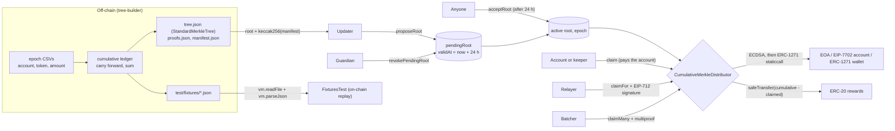

# Cumulative Merkle Distributor

A multi-token, multi-epoch rewards distributor in the style of Morpho's URD. Leaves commit *cumulative* amounts, so one
root update tops up every account; roots go live only after a 24-hour, guardian-vetoable timelock; anyone can claim on
a holder's behalf with an EIP-712 signature that works for EOAs, ERC-1271 wallets and EIP-7702 accounts. A
property-tested TypeScript builder produces the trees, and shared fixtures prove that builder and contract agree.

[](https://github.com/monzon1985/blockchain/actions/workflows/02-cumulative-merkle-distributor.yml?query=branch%3Amain)


## What's interesting here

- **O(1) state per (account, token), any number of epochs.** An account that skipped four epochs collects all of them in
  one claim for **89,869 gas**, against **308,180 gas** (four transactions, **3.43x**) for the classic per-epoch airdrop
  with claimed flags. The study is reproducible ([`GasBench.t.sol`](test/gas/GasBench.t.sol)), has CI gates that
  regenerate it and fail on any difference, and is honest about where the cumulative design loses: in a one-shot
  airdrop a claim costs 89,851 gas on average against 73,058 with a Solady bitmap, whose claims share one storage word
  per 256 leaves.
- **Smart-account-native signatures, proven both ways.** `claimFor` accepts EOAs, ERC-1271 wallets and EIP-7702
  accounts (`vm.signAndAttachDelegation`), including a 7702 account whose delegate has *no* ERC-1271 hook. A test shows
  OpenZeppelin's stock `SignatureChecker.isValidSignatureNow` rejecting that account's own signature while the
  distributor accepts it.
- **The TypeScript builder and the contract are tested against each other.** 23 fast-check properties cover the
  builder, 7 of them against `@openzeppelin/merkle-tree` as an oracle (byte-identical `StandardMerkleTree` dumps,
  identical proofs and multiproofs); the others cover the ledger, CSV round trips, EIP-712, tampering, determinism and
  proofs-file verification. The builder writes fixtures (240 leaves over 6 epochs, 6 multiproofs, one viem-signed
  EIP-712 authorization) that Foundry replays on-chain; `npm run fixtures -- --check` fails CI if they drift.
- **All 25 injected bugs are caught.** A mutation spot-check injects a curated set of 25 realistic bugs (timelock off
  by one second, veto that does not clear, payout of the full cumulative amount, replayable signatures, stock
  `SignatureChecker` routing, unbound recipient, reentrancy guard dropped from any entry point, ECDSA recovery errors
  ignored, ...): **25/25 killed**. It is a sample, not a proof: three of these bugs survived the suite until a review
  found them and tests were added. **100 % line and branch coverage** of `src/` (96/96 lines, 33/33 branches), **0
  Slither findings** at `--fail-pedantic`, 8 stateful invariants over a handler that also issues corrective roots,
  tries `acceptRoot` at arbitrary times and attempts four hostile actions (16,384 calls per CI campaign, plus a fixed
  walk proving the handler reaches all 11 actions).
- **One command shows the whole lifecycle on a real node.** `npm run demo` starts anvil on a free port, deploys with
  the production script, builds two epochs from CSV, has the guardian veto a faulty root, and claims directly, via an
  EOA signature, via an ERC-1271 wallet and in one multiproof batch, ending with every leaf paid and the vault empty.

## Overview

Every protocol that streams incentives ships a rewards distributor, and the textbook version (one Merkle root, one
`claimed` bit per leaf) does not survive contact with production:

- **Rewards accrue over time.** With one root per epoch, every epoch needs its own claimed flags, every account pays one
  transaction per epoch, and old roots must stay on-chain forever. Committing *cumulative* amounts instead makes the
  only per-user state `claimed[account][token]`: a claim pays `cumulative - claimed`, and a new root tops everybody up
  at once.
- **A root is a blank cheque.** Whoever sets it can allocate the whole vault to themselves. Here a root waits 24 hours
  in public before anyone can activate it, an independent guardian can veto it, and there is no admin path around the
  delay (no direct `setRoot`, no sweep).
- **Holders are increasingly smart accounts.** Gasless claims through a relayer need signatures that work for EOAs,
  ERC-1271 wallets and, since Pectra, EIP-7702 delegated EOAs, whose code makes naive "has code, so ask ERC-1271"
  routing reject their own key.
- **The tree is built off-chain.** The leaf encoding, the sort order and the proof format must match the verifier
  exactly; a builder bug is a payout bug. Second-preimage attacks on naive leaf encodings are a known class of bug.

## Architecture



| Component | Responsibility | Key external calls |
|---|---|---|
| [`src/CumulativeMerkleDistributor.sol`](src/CumulativeMerkleDistributor.sol) | Root lifecycle (propose, veto, accept), `claim`, `claimFor`, `claimMany`, nonces, EIP-712 domain | `IERC20.safeTransfer`; `IERC1271.isValidSignature` (static call, `claimFor` only) |
| [`src/interfaces/ICumulativeMerkleDistributor.sol`](src/interfaces/ICumulativeMerkleDistributor.sol) | Public API, events and custom errors (with the offending values), NatSpec | - |
| [`script/Deploy.s.sol`](script/Deploy.s.sol) | Keystore-based deployment; refuses zero or shared roles; post-deployment checks | - |
| [`tree-builder/src/cumulative.ts`](tree-builder/src/cumulative.ts) | Ledger across epochs, manifests (input hash, per-token totals), proofs files | - |
| [`tree-builder/src/tree.ts`](tree-builder/src/tree.ts), [`merkle.ts`](tree-builder/src/merkle.ts) | `StandardMerkleTree`-compatible tree, proofs and multiproofs, re-implemented on viem | viem `keccak256`, `encodeAbiParameters` |
| [`tree-builder/src/claim-authorization.ts`](tree-builder/src/claim-authorization.ts) | EIP-712 types, digest and signing for `claimFor` | viem `hashTypedData`, `signTypedData` |
| [`tree-builder/src/cli.ts`](tree-builder/src/cli.ts) | `build` (CSVs in, per-epoch tree/proofs/manifest out) and `verify` | - |
| [`tree-builder/scripts/`](tree-builder/scripts) | Differential fixtures, README gas tables, anvil demo, mutation spot-check | `forge`, `anvil` |
| [`test/gas/`](test/gas) | Gas study, with benchmark-only per-epoch baselines (Solady `LibBitmap` and `mapping(bool)`) | - |

## Roles and trust assumptions

| Role | Can | Cannot | If compromised |
|---|---|---|---|
| Owner (`Ownable2Step`) | Set the updater and the guardian; transfer ownership in two steps | Set a root, skip the timelock, move tokens | Installs its own updater and removes the guardian; any root still waits 24 h in public. Put the owner behind a timelock longer than 24 h. |
| Updater | `proposeRoot(root, metadataHash)`; a new proposal displaces the pending one and restarts the 24 h timer | Activate a root, shorten the veto window, move tokens | Proposes a malicious root; the guardian vetoes it. Can grief by re-proposing. |
| Guardian | `revokePendingRoot` until the root is accepted | Propose, accept or speed up anything | Freezes new epochs; already-accepted allocations remain claimable; the owner replaces it. |
| Anyone | `acceptRoot` after the delay; `claim` / `claimMany` for any account (paid to that account); relay `claimFor` | Redirect a payout or change a signed amount | - |

Trust assumptions: the updater publishes roots whose cumulative amounts never decrease (the contract tolerates a
decrease safely: nothing is clawed back); the vault is funded for the allocations it commits (an under-funded claim
reverts atomically); reward tokens are standard ERC-20s. The full threat model, including what each combination of
compromised roles can do, is in [`docs/threat-model.md`](docs/threat-model.md).

## Invariants and properties

Stateful invariants ([`DistributorInvariants.t.sol`](test/invariant/DistributorInvariants.t.sol)), driven by a handler
([`DistributorHandler.sol`](test/invariant/DistributorHandler.sol)) that proposes cumulative roots and funds them (one
proposal in four is a corrective root that may lower pairs, below what they already claimed included), revokes them,
tries to accept them at arbitrary times (now, one second before the deadline, exactly at it, or later; the call must
succeed exactly when 24 h have passed since the proposal), warps time, claims directly, via `claimFor` (seven EOAs and
one ERC-1271 wallet) and in multiproof batches, consumes nonces, and attempts four hostile actions that must revert
with a specific error (inflated amount, stale proof from the previous root, replayed signature, accept inside the
timelock):

1. **Exact solvency.** Per token, the vault balance equals funded minus claimed.
   [`invariant_balanceEqualsFundedMinusClaimed`](test/invariant/DistributorInvariants.t.sol)
2. **No over-distribution.** Per token, the sum of `claimed` never exceeds what was funded.
   [`invariant_claimedNeverExceedsFunded`](test/invariant/DistributorInvariants.t.sol)
3. **Claims stay inside the active root.** Since the active root went live, no pair has been paid beyond its leaf:
   `claimed <= max(leaf, claimed when the root was accepted)`, per pair and summed per token. With monotonic roots (what
   the builder produces) this is simply `claimed <= leaf`; a corrective root that lowers a pair below what it already
   claimed pays that pair nothing, and its `claimed` stays above the new leaf.
   [`invariant_claimedWithinActiveRoot`](test/invariant/DistributorInvariants.t.sol)
4. **`claimed` only increases**, across claims and root rotations, lowering roots included (also asserted after every
   handler action). [`invariant_claimedOnlyIncreases`](test/invariant/DistributorInvariants.t.sol)
5. **No silent accounting.** Every unit recorded as claimed was paid by a call that returned it, and every payout equals
   `cumulative - claimed` at the time. [`invariant_claimedEqualsReportedPayouts`](test/invariant/DistributorInvariants.t.sol)
6. **Roots only through the timelock.** The active root changes only via `acceptRoot`, at least 24 h after its proposal
   (measured over the acceptances the contract allowed, at times the handler did not force); `epoch` counts accepted
   roots. [`invariant_rootOnlyThroughTimelock`](test/invariant/DistributorInvariants.t.sol)
7. **The pending root is the last live proposal**, with `validAt = proposedAt + 24 h`, or nothing after a veto or an
   acceptance. [`invariant_pendingRootMatchesModel`](test/invariant/DistributorInvariants.t.sol)
8. **One signature, one use.** Nonces advance by exactly one per successful `claimFor` or `invalidateNonce`.
   [`invariant_noncesCountAuthorizations`](test/invariant/DistributorInvariants.t.sol)

Builder properties (fast-check, [`tree-builder/test/`](tree-builder/test)):

- Every leaf of every tree verifies, with the builder's verifier and with `StandardMerkleTree.verify`
  ([`tree.test.ts`](tree-builder/test/tree.test.ts), [`cumulative.test.ts`](tree-builder/test/cumulative.test.ts)).
- A tampered amount, account, token or proof element never verifies ([`tree.test.ts`](tree-builder/test/tree.test.ts),
  [`merkle.test.ts`](tree-builder/test/merkle.test.ts)).
- Output is deterministic: shuffling rows or allocations leaves the root, `tree.json` and `proofs.json` byte-identical,
  and every `manifest.json` field but one. That field is `inputHash`, the keccak256 of the exact input bytes, so the
  manifest (and the on-chain `metadataHash`) commits to the CSV as written, row order included
  ([`cumulative.test.ts`](tree-builder/test/cumulative.test.ts), [`tree.test.ts`](tree-builder/test/tree.test.ts)).
- `verify` accepts a proofs file only if it holds exactly one entry per leaf: keys are normalized, so a re-cased
  duplicate cannot stand in for a missing entry; each stored leaf hash is recomputed; amounts must be canonical decimals
  ([`cumulative.test.ts`](tree-builder/test/cumulative.test.ts), [`cli.test.ts`](tree-builder/test/cli.test.ts)).
- Cumulative amounts are monotonic across epochs, pairs are carried forward, and each amount equals the sum of that
  pair's rows so far ([`cumulative.test.ts`](tree-builder/test/cumulative.test.ts)).
- Trees, proofs and multiproofs are identical to `@openzeppelin/merkle-tree`'s, and dumps are byte-identical to
  `StandardMerkleTree.of(...).dump()` ([`merkle.test.ts`](tree-builder/test/merkle.test.ts),
  [`tree.test.ts`](tree-builder/test/tree.test.ts)).
- The viem EIP-712 digest equals a hand-rolled encoding of the Solidity type string, and signatures recover to the
  signer ([`claim-authorization.test.ts`](tree-builder/test/claim-authorization.test.ts)).

## Security considerations

Vulnerability classes follow the [OWASP Smart Contract Top 10 (2026)](https://scs.owasp.org/sctop10/). The main
mitigations (details and evidence per vector in [`docs/threat-model.md`](docs/threat-model.md)):

- **Access control (SC01).** No path changes the claimable allocation without a public 24 h delay; the guardian can
  only veto; the owner can only re-assign roles. Role changes are instant, which is why the owner should itself be
  timelocked.
- **Second-preimage forgery.** Leaves are double-hashed 96-byte encodings; inner nodes hash 64 bytes, so no leaf
  preimage can be an inner node's. A fuzz test pins the encoding (`leafHash` is the double keccak256 of the 96-byte ABI
  encoding, for any input; mutant M01). A separate illustration builds the forged inner-node leaf and shows a naive
  64-byte single-hash verifier accepting it.
- **Business logic (SC02).** State is written before the transfer; stale proofs die with their root; a lowered leaf
  cannot claw anything back; `claimMany` skips (instead of reverting on) leaves with nothing left, so a front-runner
  cannot break a batch.
- **Signatures.** EIP-712 with nonce, deadline and a chain-id-aware cached domain separator (`vm.chainId` test);
  malleable (high-s) and malformed signatures are rejected; a failed recovery (which yields `address(0)`) never
  authorizes, even for a leaf whose account is `address(0)`; ERC-1271 runs as a static call.
- **Reentrancy (SC08).** `ReentrancyGuardTransient` on all three claim entry points. A hostile token re-enters each of
  them from inside the payout of each of them (nine cases), and each re-entry fails on the guard, while the same call
  made from outside a payout succeeds (mutants M13, M23, M24).
- **Static analysis.** Slither and `forge lint` report nothing; the seven silenced Slither findings and four `forge lint`
  suppressions are justified line by line in [`docs/static-analysis.md`](docs/static-analysis.md).

Known limitations: no sweep (unallocated funds are recovered by allocating them in a later root); instant role changes;
fee-on-transfer, rebasing and blocklisting tokens are out of scope; a third party can front-run a `claimFor` with a
plain `claim`, which pays the account itself instead of the signed recipient; sequential nonces allow one outstanding
authorization per account. **Nothing in this repository has been professionally audited.**

## Design decisions and trade-offs

| Decision | Why | Cost |
|---|---|---|
| Cumulative leaves, one `uint256` per (account, token) | O(1) state for any number of epochs; one claim catches up everything; old roots never need storing; a later epoch's claim rewrites a non-zero slot (55,625 gas vs 72,736) | Every pair's first claim writes a fresh slot, while a bitmap shares one word per 256 leaves (89,851 vs 73,058 gas on average in a one-shot airdrop) |
| Multi-token roots (`token` is in the leaf) | One root and one timelock per epoch for every reward token | One more 32-byte word hashed per leaf than a single-token design |
| `StandardMerkleTree` leaf encoding (double hash) | Trees load in any `@openzeppelin/merkle-tree` tooling. Second-preimage safe: the 96-byte leaf preimage can never be a 64-byte inner node (the double hash is the library's convention, which also protects 64-byte leaf types) | One extra `keccak256` per claim |
| Timelock + guardian veto, no direct `setRoot` | A root is a blank cheque; every one is public for 24 h and vetoable. Stricter than Morpho's URD, whose owner can set a root instantly | New epochs take at least 24 h to go live; emergency corrections too |
| A re-proposal restarts the timer | A correction never shortens the veto window | An updater can delay epochs by re-proposing (liveness only) |
| Permissionless `acceptRoot`, `claim`, `claimMany` | No keeper is trusted; anyone can push rewards to holders | `claim` always pays the account, which lets a third party pre-empt a `claimFor` (no loss) |
| ECDSA first, ERC-1271 second | EIP-7702 accounts keep working whatever their delegate; a contract without a key cannot be impersonated by ECDSA | Diverges from `SignatureChecker.isValidSignatureNow`, deliberately and with a test |
| Signature binds amount and recipient, not the root | A holder approves "pay X of token T to R", which stays meaningful across roots | The authorization dies if the leaf changes before it is used |
| `claimMany` with one multiproof, skipping finished leaves | 59 % fewer proof hashes and 4.7 % less gas than 100 single proofs in one transaction; front-running cannot revert a batch | Below a few dozen leaves it costs slightly more than single proofs (+1.5 % at 10); leaves must be passed in multiproof order (the builder returns it) |
| No pause, no sweep, no upgradeability | Minimal admin surface; no lever to censor or drain | Recovery of unallocated funds goes through a future root; a migration means a new deployment |
| Builder re-implements the tree on viem | `@openzeppelin/merkle-tree` stays an independent oracle for the differential tests (dev dependency only) | ~200 lines of tree code to maintain, guarded by the properties above |
| `isolate = true`, `bytecode_hash = "none"`, `cbor_metadata = false` | Gas numbers are whole transactions; bytecode (and so gas) is designed to be identical on every OS, since no metadata hash or CBOR trailer is embedded. The committed numbers come from Windows; the CI gates will confirm them on Linux on the workflow's first run | If Linux ever differed, the snapshots would be regenerated from CI and the tables re-rendered |

## Testing

```bash
forge soldeer install && forge fmt --check && forge build && forge test
forge snapshot --check --match-contract GasBench
cd tree-builder && npm ci && npm run typecheck && npm run lint && npm test && npm run fixtures -- --check
```

| Suite | Location | Tests | What it covers |
|---|---|--:|---|
| Root lifecycle | [`test/unit/RootLifecycle.t.sol`](test/unit/RootLifecycle.t.sol) | 26 (1 fuzz) | Propose, displace, veto, accept, timelock edges, roles, two-step ownership, every revert |
| `claim` | [`test/unit/Claim.t.sol`](test/unit/Claim.t.sol) | 23 (4 fuzz) | Payouts, top-ups, skipped epochs, claw-back roots, under-funding, leaf encoding (fuzzed) and a second-preimage illustration, reentrancy |
| `claimFor` | [`test/unit/ClaimFor.t.sol`](test/unit/ClaimFor.t.sol) | 25 (2 fuzz) | EOA, ERC-1271 (valid, revoked, wrong magic, reverting, no hook), four EIP-7702 cases, replay, redirect, malleability, recovery failures against an `address(0)` leaf, chain id |
| `claimMany` | [`test/unit/ClaimMany.t.sol`](test/unit/ClaimMany.t.sol) | 13 (1 fuzz) | Multiproof batches, whole tree, skips, tampering, reordering, foreign leaves, any subset |
| Reentrancy | [`test/unit/Reentrancy.t.sol`](test/unit/Reentrancy.t.sol) | 3 | A hostile token re-enters `claim`, `claimFor` and `claimMany` from inside the payout of each (nine cases); every re-entry fails on the guard, and the same call succeeds from outside |
| Differential | [`test/differential/Fixtures.t.sol`](test/differential/Fixtures.t.sol) | 7 | Every builder leaf, proof, multiproof and the viem signature replayed on-chain |
| Invariants | [`test/invariant/`](test/invariant) | 8 invariants + 1 | See the list above; plus a fixed 400-step walk proving the handler reaches every action, rejects early accepts and puts a lowering root live |
| Gas study | [`test/gas/GasBench.t.sol`](test/gas/GasBench.t.sol) | 8 | Tables below (snapshot-checked) |
| Deployment script | [`test/script/Deploy.t.sol`](test/script/Deploy.t.sol) | 3 | Role wiring from the environment, zero and shared roles refused |
| Merkle core | [`tree-builder/test/merkle.test.ts`](tree-builder/test/merkle.test.ts) | 9 (7 properties) | Against `@openzeppelin/merkle-tree`'s core; hash ordering; tampering; malformed input |
| Tree | [`tree-builder/test/tree.test.ts`](tree-builder/test/tree.test.ts) | 9 (6 properties) | Against `StandardMerkleTree`; dump loading and corruption |
| Ledger | [`tree-builder/test/cumulative.test.ts`](tree-builder/test/cumulative.test.ts) | 10 (6 properties) | Monotonicity, sums, row-order independence (all but `inputHash`), manifests, proofs-file verification, overflow |
| CSV parser | [`tree-builder/test/csv.test.ts`](tree-builder/test/csv.test.ts) | 15 (1 property) | Round trip; 12 rejected inputs with line numbers |
| CLI | [`tree-builder/test/cli.test.ts`](tree-builder/test/cli.test.ts) | 6 | `build`/`verify` end to end; tampered, partial, duplicated (re-cased key), wrong-leaf, foreign and non-canonical proofs files; entry-point detection; plain `node src/cli.ts` binary |
| EIP-712 | [`tree-builder/test/claim-authorization.test.ts`](tree-builder/test/claim-authorization.test.ts) | 4 (3 properties) | viem digest vs hand-rolled encoding; domain separation; recovery |
| Anvil demo | [`tree-builder/scripts/demo.ts`](tree-builder/scripts/demo.ts) | 1 run | Deployment script, CLI, veto, every claim path on a live node |
| Mutation spot-check | [`tree-builder/scripts/mutation.ts`](tree-builder/scripts/mutation.ts) | 25 mutants | 25/25 killed |

Totals: **110 Foundry tests** (Foundry counts the 8 invariants as one) and **53 TypeScript tests** (23 fast-check
properties, 7 of them against `@openzeppelin/merkle-tree`).

- **Fuzzing.** Inputs are constrained with `bound()`; `vm.assume` only rules out vanishingly rare values (the one
  correct amount, the signer's own key, a derived address that already holds code). 1,000 runs per fuzz test locally,
  5,000 in CI. Every CI job that fuzzes uses the fixed seed `0x02c0ffee` (`[profile.ci]` for the tests, the coverage
  profile, and `FOUNDRY_FUZZ_SEED` in the mutation check). Checked locally at the mutation check's 32 x 32 setting:
  two seeded invariant campaigns made identical per-action call counts, while an unseeded one did not.
- **Invariants.** 128 runs x 64 calls locally, 256 x 64 in CI, `fail_on_revert = true`: every handler call must
  succeed, so hostile actions are asserted inside the handler rather than discarded. The handler checks the timelock
  against its own model rather than enforcing it: dropping the `>=` boundary or the 24 h delay fails the invariant suite
  on its own.
- **Properties.** 200 runs per property (50-100 for the heaviest), seeded from `FC_SEED` in CI.
- **Coverage.** `src/`: 100 % lines (96/96), statements (94/94), branches (33/33) and functions (23/23), gated at 95 %
  lines in CI (`FOUNDRY_PROFILE=coverage forge coverage --no-match-coverage '(test|script)'`; the coverage profile sets
  `gas_snapshot_emit = false`, so its instrumented build cannot overwrite the gas study). tree-builder `src/`:
  99.30 % lines, 96.86 % statements, 89.56 % branches, 97.59 % functions (`npm run coverage`, gated at 90 % lines,
  statements and functions).
- **Mutation.** `npm run mutation` (in `tree-builder/`) copies the project, injects each bug as an exact text
  substitution (which must match exactly once, so a refactor cannot silently disarm a mutant), and requires
  `forge test --fail-fast` to fail; the unmutated copy must pass first. It runs with the CI fuzz seed and with
  `FOUNDRY_DENY=never`, because some mutants leave a variable unused and the question is whether a test catches them,
  not the compiler. Result of the last run: 25/25 killed. The catalogue grew from its misses: the first run let M20
  survive (skipping a finished leaf had no test for its side effects, so
  `test_claimMany_skipsClaimedAndLoweredLeavesWithoutSideEffects` was added), and a later review showed that dropping
  the guard from `claimFor` or `claimMany`, or the ECDSA error check, passed the whole suite; `ReentrancyTest` and
  `test_claimFor_zeroAddressAccountRejectsRecoveryFailures` were added and those bugs became M23-M25. Suites run in
  parallel and a run stops at its first failure, so the test named in the table below can change from one run to the
  next; whether the mutant dies does not.

| Mutant | Injected bug | First failing test (one run) |
|---|---|---|
| M01 | Single-hashed leaf (no longer StandardMerkleTree-compatible) | `ReentrancyTest.test_reentrancy_duringClaimForPayout` |
| M02 | Timelock off by one second (`>` instead of `>=`) | `ReentrancyTest.test_reentrancy_duringClaimForPayout` |
| M03 | No timelock at all: proposals are acceptable immediately | `RootLifecycleTest.testFuzz_acceptRoot_respectsTimelock` |
| M04 | A replacement proposal inherits the displaced deadline (shortens the veto window) | `DistributorInvariants.test_handlerWalkReachesEveryAction` |
| M05 | Guardian veto does not clear the pending root | `RootLifecycleTest.test_revokePendingRoot_clearsPendingAndEmits` |
| M06 | acceptRoot leaves the pending root in place (re-acceptable, epoch inflates) | `RootLifecycleTest.test_acceptRoot_activatesAfterTimelock` |
| M07 | Updater can also veto (role confusion in onlyGuardian) | `RootLifecycleTest.test_revokePendingRoot_revertsForNonGuardian` |
| M08 | Zero root accepted by proposeRoot | `RootLifecycleTest.test_proposeRoot_revertsOnZeroRoot` |
| M09 | Epoch counter not incremented | `ClaimTest.test_claim_skippedEpochsAreClaimedAtOnce` |
| M10 | Claim pays the whole cumulative amount instead of the delta | `ClaimTest.test_claim_topUpAfterNewRootPaysOnlyTheDelta` |
| M11 | Claimed total not recorded | `ReentrancyTest.test_reentrancy_duringClaimForPayout` |
| M12 | Permissionless claim pays the caller instead of the account | `ClaimManyTest.test_claimMany_skipsAlreadyClaimedLeaves` |
| M13 | Reentrancy guard dropped from claim | `ReentrancyTest.test_reentrancy_duringClaimForPayout` |
| M14 | claimFor deadline off by one second (`<` instead of `<=`) | `ClaimForTest.test_claimFor_deadlineIsInclusive` |
| M15 | claimFor reads the nonce without consuming it (signatures replayable) | `FixturesTest.test_claimAuthorization_signedByViem` |
| M16 | Any valid ECDSA signature accepted, whoever signed it | `FixturesTest.test_claimAuthorization_signedByViem` |
| M17 | Stock SignatureChecker routing: ECDSA only for code-less accounts (breaks EIP-7702 accounts) | `ClaimForTest.test_claimFor_7702AccountWithoutErc1271Delegate` |
| M18 | claimFor recipient not validated (tokens can be burnt to address(0) or locked in the vault) | `ClaimForTest.test_claimFor_revertsOnInvalidRecipient` |
| M19 | claimMany accepts an empty batch | `ClaimManyTest.test_claimMany_revertsOnEmptyBatch` |
| M20 | claimMany drops its skip guard (zero payouts for claimed leaves, underflow for lowered ones) | `DistributorInvariants.test_handlerWalkReachesEveryAction` |
| M21 | claimMany pays the caller instead of each leaf account | `ReentrancyTest.test_reentrancy_duringClaimManyPayout` |
| M22 | claimFor signature does not bind the recipient (a relayer can redirect the payout) | `FixturesTest.test_claimAuthorization_signedByViem` |
| M23 | Reentrancy guard dropped from claimFor | `ReentrancyTest.test_reentrancy_duringClaimForPayout` |
| M24 | Reentrancy guard dropped from claimMany | `ReentrancyTest.test_reentrancy_duringClaimForPayout` |
| M25 | ECDSA recovery error ignored (a garbage signature "recovers" to address(0) and authorizes its leaf) | `ClaimForTest.test_claimFor_zeroAddressAccountRejectsRecoveryFailures` |

## Gas

All figures are whole-transaction gas, net of refunds (`isolate = true`: 21,000 base, calldata with the EIP-7623 floor,
cold storage), with the optimizer at 10,000 runs. They are written by `forge test --match-contract GasBench` to
[`snapshots/GasBench.json`](snapshots/GasBench.json) and rendered here by `npm run gas-table`. The workflow fails if
either drifts (`forge snapshot --check`, `git diff --exit-code -- snapshots/`, `npm run gas-table -- --check`). The
committed numbers were measured on Windows; bytecode carries no metadata hash or CBOR trailer, so Linux CI should
reproduce them exactly, which its first run will confirm.

<!-- gas-table:begin -->
**Claimed-flag storage.** 256-leaf trees, one ERC-20, fresh recipients. Transaction gas, net of refunds.

| Design | 1st claim | 2nd claim, same epoch | Mean of 100 claims, same epoch | Claim in the next epoch |
|---|--:|--:|--:|--:|
| Per-epoch roots, `mapping(uint256 => bool)` flags | 89,836 | 89,870 | 89,856 | 72,736 |
| Per-epoch roots, Solady `LibBitmap` flags | 89,976 | 72,899 | 73,058 | 72,876 |
| **Cumulative root (this contract)** | 89,835 | 89,869 | 89,851 | 55,625 |

**Catch-up.** One account collects four epochs of rewards it never claimed.

| Design | Transactions | Total gas | vs. cumulative |
|---|--:|--:|--:|
| Per-epoch roots, `mapping(uint256 => bool)` | 4 | 308,180 | 3.43x |
| Per-epoch roots, `LibBitmap` | 4 | 308,696 | 3.43x |
| **Cumulative root** | 1 | 89,869 | 1.00x |

**Single proofs vs. multiproof.** Leaves spread pseudo-randomly over a 4,096-leaf tree (12 hashes per single proof).

| Claims | Separate `claim` txs | Single proofs, one tx | One `claimMany` (multiproof) | Multiproof vs. single proofs in one tx | Proof hashes sent (single → multi) |
|--:|--:|--:|--:|--:|--:|
| 1 | 92,833 | 98,377 | 103,753 | +5.5 % | 12 → 12 |
| 10 | 928,714 | 673,091 | 683,221 | +1.5 % | 120 → 79 |
| 100 | 9,286,708 | 6,419,168 | 6,120,277 | −4.7 % | 1,200 → 488 |

**Entry points.** 256-leaf tree; each claim pays a recipient that holds no tokens yet.

| Call | Gas |
|---|--:|
| `claim` | 89,849 |
| `claimFor`, EOA signature | 120,604 |
| `claimFor`, ERC-1271 wallet | 130,094 |
| `proposeRoot` | 93,125 |
| `acceptRoot` | 73,591 |
| `revokePendingRoot` | 29,949 |
<!-- gas-table:end -->

Reading the tables:

- **Bitmaps win one-shot airdrops.** After the first claim in a 256-leaf word, a bitmap claim flips a bit in a non-zero
  slot (73,058 gas on average), where the cumulative design writes a fresh slot per pair (89,851). Plain
  `mapping(bool)` flags get none of that benefit.
- **Cumulative roots win recurring rewards.** A claim in a later epoch rewrites a non-zero slot (55,625 gas, against
  72,736 for a per-epoch design that needs a new flag every epoch), and catching up four epochs is one proof instead of
  four transactions (89,869 against 308,180).
- **Multiproofs only pay off in large batches.** One `claimMany` sends far fewer proof hashes (488 instead of 1,200 at
  100 leaves) but pays for the queue bookkeeping, so it is 1.5 % more expensive than single proofs at 10 leaves and
  4.7 % cheaper at 100. Batching into one transaction is the big win either way (9.29M gas for 100 separate claims,
  6.12M in one `claimMany`).

## Getting started

Prerequisites: [Foundry](https://getfoundry.sh) 1.8.3 (`forge`, `anvil`), Node.js 24 with npm 11 (developed and run in
CI on 24.11.1; the CLI does not rely on `import.meta.main`, which only exists from 24.2). Optional: Slither 0.11.6
(`uv tool install slither-analyzer==0.11.6 --with crytic-compile==0.4.2 -c ci/slither-constraints.txt`).

```bash
cd projects/02-cumulative-merkle-distributor
forge soldeer install          # locked dependencies (soldeer.lock), no git submodules
forge build
forge test                     # 110 tests, about a minute (the invariant campaign dominates)

cd tree-builder
npm ci
npm test                       # 53 tests
npm run demo                   # anvil on a free port: deploy, build epochs, veto, accept, claim every way
```

Build a distribution from your own epoch files (`account,token,amount` per line, amounts in base units; each epoch adds
to the previous ones):

```bash
cd tree-builder
node src/cli.ts build --out out examples/epochs/epoch-1.csv examples/epochs/epoch-2.csv examples/epochs/epoch-3.csv
node src/cli.ts verify out/epoch-003/tree.json out/epoch-003/proofs.json
```

`tree.json` loads with `StandardMerkleTree.load`; `proofs.json` holds every account's cumulative amount and proof per
token; the keccak256 of `manifest.json` (printed by `build`) is the `metadataHash` to propose with the root. The
manifest records the keccak256 of each input CSV as written, so reordering a CSV's rows leaves the root and proofs
unchanged but yields a different `metadataHash`.

Deploy (keystore-based, no raw keys) and propose the first root:

```bash
DISTRIBUTOR_OWNER=0x... DISTRIBUTOR_UPDATER=0x... DISTRIBUTOR_GUARDIAN=0x... \
  forge script script/Deploy.s.sol --rpc-url "$RPC_URL" --account deployer --broadcast
cast send "$DISTRIBUTOR" "proposeRoot(bytes32,bytes32)" "$ROOT" "$METADATA_HASH" --account updater --rpc-url "$RPC_URL"
# 24 hours later, from any account:
cast send "$DISTRIBUTOR" "acceptRoot()" --account keeper --rpc-url "$RPC_URL"
```

Other commands: `npm run lint`, `npm run format:check`, `npm run coverage`, `npm run fixtures` (regenerate fixtures),
`npm run gas-table` (re-render the gas tables), `npm run mutation`; `forge lint`;
`FOUNDRY_PROFILE=slither slither . --config-file slither.config.json`.

## Project structure

```
02-cumulative-merkle-distributor/
├── src/
│   ├── CumulativeMerkleDistributor.sol      # the distributor
│   └── interfaces/ICumulativeMerkleDistributor.sol
├── script/Deploy.s.sol                      # keystore-based deployment with role checks
├── test/
│   ├── unit/                                # root lifecycle, claim, claimFor, claimMany, reentrancy
│   ├── invariant/                           # handler + 8 invariants
│   ├── differential/Fixtures.t.sol          # replays tree-builder fixtures on-chain
│   ├── fixtures/                            # written by `npm run fixtures`, checked in CI
│   ├── gas/                                 # GasBench + per-epoch baselines (benchmark only)
│   ├── script/Deploy.t.sol
│   ├── mocks/                               # ERC-20s, ERC-1271 wallets, EIP-7702 delegates, reentrant token
│   └── utils/                               # in-EVM StandardMerkleTree port, shared fixture
├── snapshots/GasBench.json                  # gas study values (vm.snapshotGas*)
├── .gas-snapshot                            # per-test totals (forge snapshot)
├── docs/                                    # threat model, static-analysis triage
├── ci/slither-constraints.txt               # pinned transitive Python dependencies of Slither (CI)
└── tree-builder/
    ├── src/                                 # ledger, tree, proofs, EIP-712, CLI
    ├── scripts/                             # fixtures, gas table, anvil demo, mutation spot-check
    ├── test/                                # vitest + fast-check
    └── examples/epochs/                     # three sample epochs
```

## Scope notes and future work

- **Signature routing.** The brief calls for verification "by SignatureChecker". The distributor uses OpenZeppelin's
  `ECDSA.tryRecoverCalldata` first and `SignatureChecker.isValidERC1271SignatureNowCalldata` second, because the stock
  `isValidSignatureNow` rejects an EIP-7702 account's own signature when its delegate has no ERC-1271 hook. Both
  behaviours are pinned by `test_claimFor_7702AccountWithoutErc1271Delegate`.
- **EIP-7702 on a live node.** The anvil demo covers EOA and ERC-1271 signatures; EIP-7702 delegation is exercised in
  Foundry with `vm.signAndAttachDelegation` (four cases), not in the demo, which deliberately holds no private keys.
- **Token types.** Fee-on-transfer, rebasing and blocklisting tokens are not supported.
- **Nonces.** Unordered (bitmap) nonces would allow several outstanding authorizations per account.
- **Builder scale.** The builder holds a whole epoch in memory and hashes with pure-JavaScript keccak (viem). A
  100,000-leaf epoch built and proved in about three minutes on a busy development machine (a one-off measurement, not
  a benchmark); epochs in the millions would want native hashing and streaming output.
- **Further hardening.** A Medusa or Halmos campaign over the same properties, and a dispute bond for the guardian role
  (as in Merkl), are natural next steps.

## References

- [Morpho Universal Rewards Distributor](https://github.com/morpho-org/universal-rewards-distributor): cumulative
  `(account, reward, claimable)` leaves with the same double-hash encoding, pending roots behind a timelock; the main
  inspiration (and the `pendingRoot` / `acceptRoot` / `revokePendingRoot` vocabulary).
- [1inch CumulativeMerkleDrop](https://github.com/1inch/merkle-distribution): cumulative amounts under a single root.
- [Merkl by Angle Labs](https://github.com/AngleProtocol/merkl-contracts): cumulative per-token rewards with a dispute
  period before a root takes effect.
- [Uniswap MerkleDistributor](https://github.com/Uniswap/merkle-distributor): the classic single-root, index-bitmap
  airdrop used as the baseline of the gas study.
- [OpenZeppelin Contracts 5.7](https://github.com/OpenZeppelin/openzeppelin-contracts) (`MerkleProof` multiproofs,
  `EIP712`, `SignatureChecker`, `Nonces`, `ReentrancyGuardTransient`, `Ownable2Step`) and
  [`@openzeppelin/merkle-tree`](https://github.com/OpenZeppelin/merkle-tree) (`StandardMerkleTree`, the differential
  oracle); [Solady `LibBitmap`](https://github.com/Vectorized/solady).
- [EIP-712](https://eips.ethereum.org/EIPS/eip-712) typed data, [ERC-1271](https://eips.ethereum.org/EIPS/eip-1271)
  contract signatures, [EIP-7702](https://eips.ethereum.org/EIPS/eip-7702) set-code transactions,
  [ERC-5267](https://eips.ethereum.org/EIPS/eip-5267) domain retrieval,
  [EIP-2612](https://eips.ethereum.org/EIPS/eip-2612) (the nonce and deadline pattern),
  [EIP-7623](https://eips.ethereum.org/EIPS/eip-7623) (calldata floor in the gas figures).
- [viem](https://viem.sh) and [fast-check](https://fast-check.dev).
