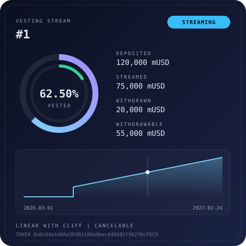
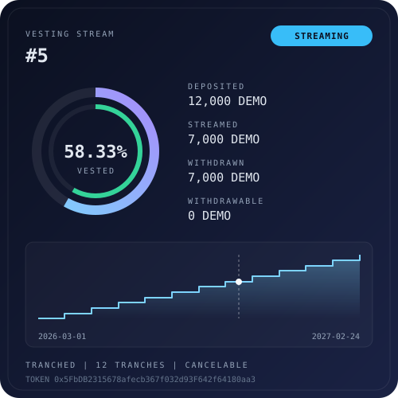
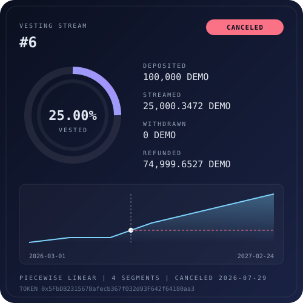
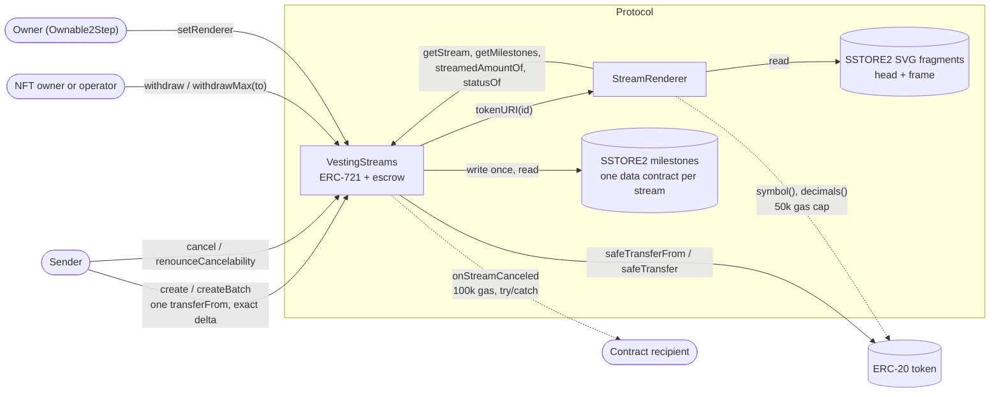
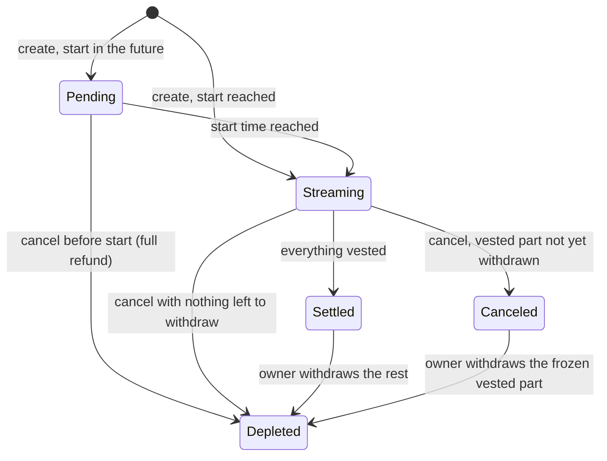

# Vesting Streams as On-Chain SVG NFTs (Hardhat 3 + viem)

A Sablier-style token vesting protocol built entirely on Hardhat 3. Every linear-cliff, tranched or piecewise-linear
stream is an ERC-721 with a live, fully on-chain SVG, and stateful invariants check that no token is ever created,
lost or stranded.

[](https://github.com/monzon1985/blockchain/actions/workflows/03-vesting-stream-nfts-hardhat3.yml)


<p>
  
  
  
</p>

<sub>Three of the eleven golden files: the exact bytes `tokenURI` returns for the deterministic test scenario.</sub>

## What's interesting here

- **Value conservation is checked, not assumed.** Eight stateful invariants, including
  `deposited == withdrawn + refunded + remaining` per stream and `balance == Σ remaining + donations` per token, run
  against random sequences of create, batch-create, withdraw, operator withdraw, cancel, renounce, NFT transfer,
  donation and time warps (256 runs x 128 calls in CI, `failOnRevert` on). Streams use hostile tokens on purpose
  (USDT-style no-return-value, ERC-777-style callbacks), and from every reachable state the handler also tries to
  create streams of a fee-on-transfer and of an stETH-style share-rounding token, which must be rejected. The actors
  are hostile too (a re-entrant contract, reverting and gas-burning hooks). Every run ends by draining all streams and
  requiring the contract to hold exactly the donations.
- **The NFT art is a tested rendering pipeline.** 11 byte-exact golden SVG and JSON fixtures, dust amounts included;
  166 hostile token symbols (16 hand-picked payloads plus 150 seeded random byte strings) rendered and checked with
  an XML well-formedness check (fast-xml-validator plus entity-reference and character-range scans) and `JSON.parse`.
  A rendering stress case (32 tranches, 39-digit amounts, withdrawn and canceled, a 16-character symbol that grows
  six-fold under XML escaping) costs **1,218,147 gas** in `eth_estimateGas` against a 3,000,000 budget, pinned in the
  gas table; 24 seeded random streams stay under the budget too.
- **SSTORE2 instead of storage slots for milestones.** Writing 16 milestones costs **163,502 gas instead of 418,462
  (-61 %)**, 32 milestones **245,401 instead of 788,254 (-69 %)**, and reading 16 back costs 35,285 instead of
  63,997 (-45 %), all measured by the committed gas table. The static SVG fragments live in SSTORE2 too.
- **`createBatch` pulls tokens once and checks the exact balance delta.** 115,358 gas per stream in a batch of ten
  versus 160,991 for a single `create` (-28 %); fee-on-transfer and short-delivering rebasing tokens are rejected with
  `UnsupportedToken(token, expected, received)`.
- **158 tests (117 Solidity tests run by Hardhat 3's EDR runner, 41 `node:test` + viem), 100.00 % line coverage of the
  production contracts (455/455), 24/24 injected bugs killed by the suite, 0 Slither findings at pedantic level**
  (3 detectors excluded and 7 inline suppressions, each justified in
  [`docs/static-analysis.md`](docs/static-analysis.md)).

## Overview

Vesting contracts escrow tokens for employees, investors and grantees and release them over time. The arithmetic is
simple; the edge cases are not:

- **Three unlock curves** (linear with a cliff, step-wise tranches, piecewise-linear segments) must agree on rounding,
  reach exactly the deposit at the end, and never decrease over time, including across a cancellation.
- **Withdrawal rights are transferable.** Each stream is an ERC-721, so the right to withdraw moves with the NFT and can
  be delegated to an operator. The sender can cancel (if the stream is cancelable) and gets the unvested part back.
- **Cancellation calls untrusted code.** Contract recipients get an `onStreamCanceled` hook, which must never be able
  to block the cancellation, re-enter, or make the sender pay for a revert-data bomb, and which the sender must not be
  able to starve of gas on purpose.
- **Tokens are untrusted.** The sender chooses the token. Fee-on-transfer and rebasing tokens break naive accounting;
  callback tokens hand control flow to third parties in the middle of an operation.
- **The art is untrusted input turned into markup.** The SVG embeds the token symbol, which the token deployer controls,
  so it must be sanitized and escaped for two different grammars (XML and JSON), read with a gas cap, and rendered
  within a gas budget that RPC providers accept for `eth_call`.

## Architecture



| Component | Responsibility | Key external calls |
|---|---|---|
| [`VestingStreams`](contracts/VestingStreams.sol) | Escrow, schedule validation, ERC-721 withdrawal rights, cancel and renounce, ERC-4906 events | `token.safeTransferFrom` / `safeTransfer` / `balanceOf`, `SSTORE2.write` / `read`, `renderer.tokenURI` (view), `IStreamRecipient.onStreamCanceled` |
| [`StreamRenderer`](contracts/StreamRenderer.sol) | SVG card (progress rings, amounts, schedule chart, status pill) and Base64 JSON metadata | `VestingStreams` views, `symbol()` / `decimals()` through Solady `MetadataReaderLib`, `SSTORE2.read` |
| [`StreamMath`](contracts/libraries/StreamMath.sol) | The three vesting curves, all rounding down | none |
| [`MilestoneCodec`](contracts/libraries/MilestoneCodec.sol) | Packs milestones into 21 bytes each (16-byte amount, 5-byte timestamp) for SSTORE2 | none |
| [`SafeText`](contracts/libraries/SafeText.sol) | Reduces untrusted strings to at most 16 printable ASCII characters, then escapes for XML or JSON | Solady `LibString` |
| [`DecimalFormat`](contracts/libraries/DecimalFormat.sol) | Token amounts with thousands separators and four truncated decimals; percentages | Solady `LibString` |
| [`ignition/modules`](ignition/modules) | `VestingStreamsModule` (renderer + vesting, `owner` parameter) and `DemoModule` (plus a pre-approved demo token) | none |

### Stream shapes

| Shape | Parameters | Vested amount at time `t` | Limits |
|---|---|---|---|
| `LinearCliff` | `startTime`, optional `cliffTime`, `endTime` | `0` before the cliff, then `floor(deposit * (t - start) / (end - start))`, `deposit` from `end` | `start < end`, `start < cliff < end` |
| `Tranched` | `startTime`, tranches `(amount, timestamp)` | sum of the tranches whose timestamp is `<= t` | 1 to 32 tranches, strictly increasing, sum == deposit |
| `Segmented` | `startTime`, segment end-points `(amount, timestamp)` | completed segments in full, plus `floor(amount_i * elapsed / duration_i)` for the active one | 1 to 16 segments, strictly increasing, sum == deposit |

The start may be in the past (backdated grants); the end must be in the future. A zero-amount segment is a plateau.

### Lifecycle

`statusOf` derives the status from stored state and `block.timestamp`; nothing is stored for it.



`create`, `withdraw`, `cancel` and `renounceCancelability` each emit their own event plus ERC-4906
`MetadataUpdate(id)`; NFT transfers emit the standard ERC-721 `Transfer`; `setRenderer` emits `RendererUpdated` and
`BatchMetadataUpdate(1, lastId)`.

## Roles and trust assumptions

| Role | Can | Cannot | If compromised |
|---|---|---|---|
| Stream sender | Create streams with any token; cancel its own cancelable streams; renounce cancelability | Touch the vested part, other senders' streams, or a stream after renouncing or full vesting | Cancels every stream it can: recipients keep everything vested so far, the rest returns to the sender |
| NFT owner or approved operator | Withdraw vested tokens of that stream to any address; transfer or approve the NFT | Withdraw more than has vested; cancel | The attacker withdraws what has vested and can transfer the NFT |
| Contract owner (`Ownable2Step`) | Replace the renderer; transfer (two-step) or renounce ownership | Move, freeze or redirect any token; block `withdraw` or `cancel` | Misleading or reverting art. Balances, withdrawals and cancellations are unaffected because they never read the renderer |
| Token (chosen by the sender) | Anything its code does | Affect streams of any other token: accounting is per stream, and every stream holds one token | Only streams of that token are at risk |

## Invariants and properties

Stateful invariants live in [`VestingInvariants.t.sol`](test/solidity/invariant/VestingInvariants.t.sol), driven by
[`VestingHandler.sol`](test/solidity/invariant/VestingHandler.sol). The handler measures every token movement with
balance deltas and keeps its own ghost accounting, independently of the contract's.

| # | Invariant (plain English) | Test |
|---|---|---|
| INV-1 | Per stream, the recorded deposit, withdrawals and refund equal the tokens that actually moved, and `deposited == withdrawn + refunded + remaining` with `remaining >= 0`. | `invariant_perStreamConservation` |
| INV-2 | Per token, the contract's balance equals the sum of what every stream still holds plus plain donations: no token is created, lost or silently kept (strictly stronger than `Σ remaining <= balance`). | `invariant_solvencyPerToken` |
| INV-3 | `withdrawn <= streamed <= deposit`, `withdrawable == streamed - withdrawn`, a canceled stream's streamed amount is frozen at `deposit - refunded`, and a refund exists only after a cancel. | `invariant_streamedBounds` |
| INV-4 | The streamed amount of every stream never decreases as time moves forward, across cancellations. | `invariant_streamedNonDecreasing` |
| INV-5 | No stream is credited with more tokens than the contract received. Every creation measures the balance delta, and from every reachable state the handler tries a fee-on-transfer and a share-rounding rebasing token (inside a snapshot that is rolled back, so their balances never drift into the other invariants); a short delivery must always be rejected. | `invariant_noShortDeliveryAccepted` |
| INV-6 | Only the NFT owner or an approved operator can withdraw; the right moves with the NFT. | `invariant_noUnauthorizedWithdrawal` |
| INV-7 | No re-entrant call from a token callback or a cancel hook ever succeeds. | `invariant_noReentrancy` |
| INV-8 | Nothing is ever stranded: after the last schedule ends, the NFT owners drain every stream, every stream is `Depleted`, and the contract holds exactly the donations. | `afterInvariant` |

Stateless properties (fuzzed with `bound()`, 256 runs locally, 5,000 in CI):

| Property | Test |
|---|---|
| Linear curve: bounded by the deposit, non-decreasing, exactly the floor of the ideal value between cliff and end | [`testFuzz_linear_boundedMonotonicFloor`](test/solidity/unit/StreamMath.t.sol) |
| Tranched curve: exactly the sum of the past tranches | [`testFuzz_tranched_exactSumOfPastTranches`](test/solidity/unit/StreamMath.t.sol) |
| Segmented curve: bounded, non-decreasing, equal to the cumulative sum at every milestone, floor of the interpolation inside a segment | [`testFuzz_segmented_properties`](test/solidity/unit/StreamMath.t.sol) |
| Withdrawing in arbitrary chunks never takes more than what vested | [`testFuzz_withdraw_chunksNeverExceedStreamed`](test/solidity/unit/Withdraw.t.sol) |
| Rendering never reverts and produces well-formed markup (dust amounts included) for any shape, schedule, amount, decimals, time or cancel state | [`testFuzz_renderingNeverReverts`](test/solidity/unit/Renderer.t.sol) |
| Sanitized symbols are 1 to 16 printable ASCII characters; XML and JSON escaping leave no raw markup or quote and round-trip | [`testFuzz_sanitize_*`, `testFuzz_xml_*`, `testFuzz_json_*`](test/solidity/unit/Libraries.t.sol) |
| The milestone codec round-trips | [`testFuzz_codec_roundTrip`](test/solidity/unit/Libraries.t.sol) |

### Rounding direction

Every division rounds toward zero. The recipient's side is always floored, so the vested amount is never overstated and
the sender's refund (`deposit - streamed`) absorbs the remainder.

| Function | Formula | Rounds | Favours |
|---|---|---|---|
| `StreamMath.linear` | `floor(deposit * (t - start) / (end - start))` | down | sender |
| `StreamMath.tranched` | sum of tranches with `timestamp <= t` | exact | n/a |
| `StreamMath.segmented` | completed segments + `floor(amount_i * (t - prev) / (ts_i - prev))` | down (active segment only) | sender |
| `cancel` / `refundableAmountOf` | `deposit - streamed(now)` | up, by less than one base unit | sender |
| `withdrawableAmountOf` | `streamed - withdrawn` | exact | n/a |
| `_validateMilestones`, `createBatch` totals | sums in `uint256` | exact | n/a |
| `DecimalFormat.formatUnits` (art, JSON) | truncated to 4 decimals; `<0.0001` for dust | down | the display never shows more than exists |
| `StreamRenderer._ring` (percent, arcs) | `floor(x * 10,000 / deposit)` bps, `floor(bps * circumference / 10,000)` | down | display |
| `StreamRenderer._xOf` / `_yOf` (chart) | `floor((t - start) * 404 / duration)`; `400 - floor(amount * 80 / deposit)` | toward the start / the baseline | display |
| JSON `Vested` attribute | `floor(streamed * 100 / deposit)` | down | display |

Proved by `test_cancel_roundingFavoursTheRefund` (10 tokens over 3 seconds, cancel after 1: recipient keeps 3, sender
gets 7), the fuzzed floor properties above, and the differential tests against exact `bigint` references.

## Security considerations and threat model

The full threat model, with every threat mapped to the OWASP Smart Contract Top 10 (2026) and to the tests that
enforce its mitigation, is in [`docs/threat-model.md`](docs/threat-model.md). Static analysis triage is in
[`docs/static-analysis.md`](docs/static-analysis.md). Highlights:

- **Re-entrancy (SC08):** `ReentrancyGuardTransient` on every entry point that moves tokens or changes stream state
  (`create`, `createBatch`, `withdraw`, `withdrawMax`, `cancel`, `renounceCancelability`), effects before interactions,
  `_mint` instead of `_safeMint` so creation hands no control flow to the recipient.
- **Hook griefing (SC06):** the hook runs inside `try/catch` with exactly 100,000 gas; `catch {}` copies no revert data
  (a hook reverting with 150 kB of data is never copied into the caller's memory); `cancel` reverts with
  `InsufficientGasForHook` unless
  `100,000 * 64 / 63 + 5,000` gas is left, so the sender cannot starve the hook through the 63/64 rule. A test
  binary-searches the smallest gas limit with which `cancel` succeeds and requires the hook to get its full stipend
  there.
- **Hostile tokens (SC02, SC07):** exact balance-delta check on every deposit; `SafeERC20` for no-return tokens;
  symbol and decimals read with a 50,000 gas cap and a 64-byte limit, then sanitized and escaped per context.
- **Input validation (SC05):** 23 custom errors, carrying the offending values where there are any, each with a
  revert test.

Known limitations (details in the threat model):

- Rebasing tokens are only rejected when the creating transfer is short; do not stream them (wrap them first).
- Blocklisting tokens can make a refund revert, which makes the stream uncancelable in practice.
- A seller can withdraw, and a sender can cancel, in the same block as a secondary-market sale of the NFT.
- The owner controls the art (not the money); time-based changes of the art emit no event, as ERC-4906 cannot express
  them, so marketplaces may show a cached image.
- Amounts are `uint128` per stream, timestamps `uint40`. No `permit` flow.
- **Nothing in this repository has been professionally audited, and it has never been deployed with real funds.**

## Design decisions and trade-offs

- **SSTORE2 for milestones.** Milestones never change after creation, so they are written once into the bytecode of a
  data contract (21 bytes each) instead of one storage slot each: -61 % to -69 % gas at creation and -45 % to -58 % on
  reads. The trade-off is one extra contract deployment per milestone stream and an `EXTCODECOPY` on every read of a
  milestone stream; linear streams skip it entirely, and milestone streams skip it outside `(start, end)`.
- **The renderer is a separate contract.** It keeps `VestingStreams` at 18,341 bytes of runtime code (the renderer is
  16,686; both under the 24,576-byte limit), lets the art evolve without touching escrow, and limits the owner's power
  to metadata. The static SVG fragments are written to SSTORE2 by the renderer's constructor, so they live in two data
  contracts instead of in its runtime bytecode.
- **Exact-delta deposits instead of a token allowlist.** Any standard ERC-20 works permissionlessly; tokens that
  deliver less than requested fail loudly at creation. The limitation (tokens that misbehave only later) is documented
  instead of hidden.
- **Pull-based withdrawals with an explicit `to`.** The NFT owner (or an operator) chooses where tokens go, so a
  contract owner without token-handling logic, or an owner whose address is blocklisted by the token, can still route
  funds elsewhere. Nobody can push tokens to a recipient that did not ask for them.
- **Status is derived, not stored.** `Pending`, `Streaming` and `Settled` depend on time; storing them would need
  keepers. Only `canceled`, the amounts and the cancel time are stored, in four packed slots per stream.
- **`Ownable2Step` rather than `AccessManager`.** There is exactly one privileged action (`setRenderer`) and it cannot
  touch funds; a role system would add surface without adding safety.
- **`_mint`, not `_safeMint`.** `onERC721Received` would hand control flow to the recipient during creation and let a
  recipient block a batch. The trade-off: a contract recipient that cannot call `withdraw` would leave its stream
  unclaimed, which is the sender's choice of recipient.
- **Hardhat 3 only.** Solidity unit, fuzz and invariant tests run in Hardhat 3's EDR runner (forge-std from npm), the
  integration layer is `node:test` + viem, deployment is Ignition. No Foundry project files.

## Testing

```bash
npx hardhat test                               # 117 Solidity + 41 node:test (default profile)
npx hardhat test solidity --test-profile ci    # 5,000 fuzz runs, 256 x 128 invariant calls
npx hardhat test solidity --snapshot-check     # .gas-snapshot of every unit and fuzz test
npx hardhat test --coverage && npm run coverage:check   # gate: 100 % of lines, as in CI
npm run gas:check                              # deterministic gas table vs gas-table.json
npm run mutation                               # 24 injected bugs, each must fail the suite
npm run slither                                # needs slither 0.11.6 + solc 0.8.37 on PATH
```

| Suite | Runner | Tests | What it covers |
|---|---|---:|---|
| [`Create.t.sol`](test/solidity/unit/Create.t.sol) | Hardhat Solidity | 23 | All three shapes, `createBatch` with one transfer, every validation error, fee-on-transfer, rebasing and no-return tokens |
| [`Withdraw.t.sol`](test/solidity/unit/Withdraw.t.sol) | Hardhat Solidity | 14 | Owner, approved and operator withdrawals, the right following the NFT, every revert, chunked-withdrawal fuzz |
| [`Cancel.t.sol`](test/solidity/unit/Cancel.t.sol) | Hardhat Solidity | 20 | Refund and freeze, rounding, renounce, six hostile-hook tests, gas starvation and the gas reservation at its boundary, re-entrancy from hooks and token callbacks |
| [`ViewsAndAdmin.t.sol`](test/solidity/unit/ViewsAndAdmin.t.sol) | Hardhat Solidity | 15 | Status lifecycle, schedule views, ERC-165, renderer replacement, two-step ownership |
| [`StreamMath.t.sol`](test/solidity/unit/StreamMath.t.sol) | Hardhat Solidity | 12 | Curve edge cases, 3 fuzzed curve properties, and a check that the milestone generator spans the `uint128` range |
| [`Libraries.t.sol`](test/solidity/unit/Libraries.t.sol) | Hardhat Solidity | 11 | Formatting, sanitizing, escaping, codec; 4 fuzz properties |
| [`Renderer.t.sol`](test/solidity/unit/Renderer.t.sol) | Hardhat Solidity | 12 | SSTORE2 fragments, hostile `symbol()` / `decimals()`, escaped dust amounts, rendering fuzz (never reverts, markup always well-formed) and its markup checker |
| [`DemoToken.t.sol`](test/solidity/unit/DemoToken.t.sol) | Hardhat Solidity | 3 | The Ignition demo token |
| [`VestingInvariants.t.sol`](test/solidity/invariant/VestingInvariants.t.sol) | Hardhat Solidity | 7 (+ `afterInvariant`) | INV-1 to INV-8 |
| [`golden.test.ts`](test/integration/golden.test.ts) | node:test + viem | 15 | 11 byte-exact SVG + JSON fixtures, statuses, decimals, dust amounts, hostile symbol |
| [`escaping.test.ts`](test/integration/escaping.test.ts) | node:test + viem | 5 | 16 corpus + 150 seeded random symbols through the XML well-formedness check and `JSON.parse`; the oracle itself rejects 12 malformed documents (undefined entities and forbidden character references included) |
| [`gas-budget.test.ts`](test/integration/gas-budget.test.ts) | node:test + viem | 5 | `tokenURI` under 3,000,000 gas in `eth_estimateGas` for the two stress cases and 24 seeded random streams, and in a capped `eth_call` (also with a gas-burning `symbol()`) |
| [`differential.test.ts`](test/integration/differential.test.ts) | node:test + viem | 4 | `DecimalFormat.formatUnits` against viem's `formatUnits` on 219 inputs, the three curves against exact `bigint` references on 300 seeded random schedules spread over the whole `uint40` time range |
| [`lifecycle.test.ts`](test/integration/lifecycle.test.ts) | node:test + viem | 4 | Events, one-transfer batches, `networkHelpers` time travel, NFT transfer, cancel, hooks |
| [`ignition.test.ts`](test/integration/ignition.test.ts) | node:test + viem | 2 | Both Ignition modules on the EDR simulated network |
| [`prng.test.ts`](test/integration/prng.test.ts) | node:test | 6 | The seeded generator behind the property tests: ranges wider than 2^32, bounds, determinism |
| **Total** | | **158** | |

Settings and determinism:

| | Local (`default` profile) | CI (`ci` profile) |
|---|---|---|
| Fuzz runs per fuzz test (9 tests) | 256 | 5,000 |
| Invariant runs x depth (7 invariants) | 64 x 64 | 256 x 128 |
| Fuzz seed | `0x3e57ed` | `0x3e57ed` |
| `failOnRevert` | on | on |
| node:test property seeds | SplitMix32, fixed per suite (`PROPERTY_SEED` / `PROPERTY_RUNS` override) | same |

The simulated chain starts at a pinned genesis date and every scenario transaction is pinned to an explicit
timestamp, so golden files and the gas table are byte-for-byte reproducible on any machine.

**Coverage** (`npx hardhat test --coverage`, production contracts, `contracts/mocks/` excluded): 100.00 % of lines
(455/455) and 100.00 % of statements, gated at 100 % by `npm run coverage:check`, locally and in CI. Hardhat's
coverage reports lines and statements, not branches; every custom error has a dedicated revert test.

**Mutation spot-check** ([`scripts/mutation.ts`](scripts/mutation.ts)): 24 realistic bugs injected one at a time
(cliff ignored, rounding up, off-by-one tranche unlock, missing cancel freeze, missing authorization, accumulator bug
in `createBatch`, missing re-entrancy guard, hook without stipend, a missing or weakened hook gas reservation, missing
XML or JSON escaping of the symbol, unescaped dust amounts, control characters let through, ...): **24/24 killed**, 22
by the Solidity suites, 1 (unescaped JSON) by the `node:test` metadata checks, and 1 (a deposit check that accepts
short deliveries) by the invariant suite on its own: that mutant names the invariant suite as its guard, so INV-5 is
proven not to be vacuous. A baseline run with the same commands must pass first, and a mutant that does not compile
fails the campaign instead of counting as killed. It takes 8 to 13 minutes locally and runs as its own CI job.

## Gas

From [`gas-table.json`](gas-table.json), produced by [`scripts/gas-check.ts`](scripts/gas-check.ts) on a fresh EDR chain
(solc 0.8.37, optimizer 10,000 runs, EVM osaka). Transactions report `gasUsed`; views report `eth_estimateGas`
(which includes the 21,000 base cost). `npm run gas:check` fails on any difference.

| Operation | Gas |
|---|---:|
| `create`: linear | 160,991 |
| `create`: linear with cliff | 161,107 |
| `create`: tranched x12 | 288,896 |
| `create`: tranched x32 | 409,006 |
| `create`: segmented x4 | 240,859 |
| `create`: segmented x16 | 312,828 |
| `createBatch`: 10 x linear (total) | 1,153,581 |
| `createBatch`: 10 x linear (per stream) | 115,358 |
| `withdraw`: linear (first / second) | 72,746 / 55,646 |
| `withdrawMax`: linear with cliff | 55,359 |
| `withdrawMax`: tranched x32 | 75,490 |
| `withdrawMax`: segmented x16 | 68,999 |
| `cancel`: EOA recipient | 93,278 |
| `cancel`: contract recipient (hook) | 151,164 |
| `renounceCancelability` | 29,745 |
| `transferFrom` (stream NFT) | 42,822 |
| `tokenURI`: linear with cliff | 631,305 |
| `tokenURI`: tranched x32 | 965,112 |
| `tokenURI`: segmented x16 | 736,675 |
| `tokenURI`: canceled tranched x12 | 736,119 |
| `tokenURI`: stress case, canceled tranched x32 ([`stress.ts`](test/support/stress.ts)) | 1,218,147 |
| `tokenURI`: stress case, canceled segmented x16 | 979,659 |
| Runtime size: `VestingStreams` / `StreamRenderer` (bytes) | 18,341 / 16,686 |

Baseline comparison (same milestones, [`MilestoneStorageBench`](contracts/mocks/MilestoneStorageBench.sol)):

| Milestone storage | One slot per milestone | SSTORE2 (21 bytes each) | Delta |
|---|---:|---:|---:|
| Store 16 | 418,462 | 163,502 | -60.9 % |
| Store 32 | 788,254 | 245,401 | -68.9 % |
| Read 16 (`eth_estimateGas`) | 63,997 | 35,285 | -44.9 % |
| Read 32 (`eth_estimateGas`) | 104,269 | 43,814 | -58.0 % |

The per-test gas of every Solidity unit and fuzz test (invariants excluded) is also committed in
[`.gas-snapshot`](.gas-snapshot) and checked with `npx hardhat test solidity --snapshot-check`.

## Getting started

Prerequisites: Node.js 24 and npm 11. Optional: Slither 0.11.6 with solc 0.8.37 (`solc-select`) for static analysis,
Foundry 1.8.3 for `forge fmt`. No RPC endpoint, API key or fork is needed: everything runs on Hardhat's in-process EDR
chain.

```bash
cd projects/03-vesting-stream-nfts-hardhat3
npm ci
npx hardhat build
npx hardhat test
npx hardhat test --coverage && npm run coverage:check
npm run gas:check
npx tsc --noEmit
npm run lint && npm run format:check
```

Local demo: `npm run demo` deploys with the Ignition `DemoModule`, creates one stream of each shape with a single
`createBatch`, travels through the schedule while the employee withdraws and the sender cancels one stream, and writes
the art at months 4, 7 and 13 to `demo-out/`.

Deploying elsewhere: `hardhat.config.ts` declares an optional `sepolia` network whose RPC URL and key come from the
encrypted Hardhat keystore (`npx hardhat keystore set SEPOLIA_RPC_URL`, `npx hardhat keystore set
SEPOLIA_PRIVATE_KEY`), then `npx hardhat ignition deploy ignition/modules/VestingStreams.ts --network sepolia`. Nothing
has been deployed to any public network.

Maintenance: `npm run golden:update` rewrites the golden files and `npm run gas:update` the gas table, both after a
deliberate change; `npm run snapshot` rewrites `.gas-snapshot`.

## Project structure

```
03-vesting-stream-nfts-hardhat3/
├── contracts/
│   ├── VestingStreams.sol          # escrow + ERC-721 + schedules
│   ├── StreamRenderer.sol          # on-chain SVG + JSON metadata
│   ├── interfaces/                 # IVestingStreams, IStreamRenderer, IStreamRecipient
│   ├── libraries/                  # StreamMath, MilestoneCodec, SafeText, DecimalFormat
│   ├── types/StreamTypes.sol       # Shape, Status, Milestone, CreateParams, Stream
│   ├── demo/DemoToken.sol          # token for the Ignition demo
│   └── mocks/                      # hostile tokens and recipients, harness, storage bench (test-only)
├── ignition/modules/               # VestingStreamsModule, DemoModule
├── scripts/                        # gas-check, check-coverage, mutation, demo
├── test/
│   ├── solidity/                   # unit, fuzz and invariant tests (Hardhat 3 Solidity tests)
│   ├── integration/                # node:test + viem suites
│   ├── golden/                     # 11 committed SVG + JSON fixtures
│   └── support/                    # scenario, stress case, params, metadata decoding, seeded PRNG
├── docs/                           # threat model, static analysis triage
├── gas-table.json  .gas-snapshot   # committed gas baselines
└── hardhat.config.ts  package.json  slither.config.json  eslint.config.js
```

## Scope notes and future work

- **Toolchain.** The project is Hardhat-only, as the brief requires, so it deviates from the monorepo's Foundry
  defaults: forge-std comes from npm (a GitHub dependency pinned to v1.16.2 in `package-lock.json`) instead of
  Soldeer, the gas snapshot is Hardhat's `--snapshot-check` instead of `forge snapshot --check`, and Foundry is used
  only for `forge fmt`. Slither compiles the contracts with plain `solc` because crytic-compile 0.4.2 cannot read
  Hardhat 3 build-info files.
- **Coverage** is reported for lines and statements only (Hardhat 3 does not report branches).
- **No external fuzzer (out of scope).** The stateful suite runs in Hardhat's own runner. The handler is a forge-std
  `Test` built on forge-std helpers and cheatcodes (`vm.snapshotState` / `vm.revertToState`, `makeAddr`, `bound`), so
  a Medusa or Echidna campaign would need a separate harness written against what those fuzzers support; it is listed
  as future work.
- **Not deployed.** The Ignition modules have only been exercised on the in-process EDR network.
- Future work: an EIP-2612 / Permit2 creation path; stream creation from a Merkle root; a formal proof of the curve
  properties (e.g. Halmos on `StreamMath`); a Medusa campaign on a dedicated harness; an optional allowlist mode for
  regulated issuers.

## References

- [Sablier Lockup](https://github.com/sablier-labs/lockup): the reference design for linear, tranched and dynamic
  (segmented) streams represented as ERC-721s, including on-chain NFT descriptors. This project reimplements the idea
  from scratch with its own storage layout, hook and rendering pipeline.
- [Uniswap v3 `NonfungibleTokenPositionDescriptor`](https://github.com/Uniswap/v3-periphery): the pattern of a
  replaceable on-chain SVG descriptor for position NFTs.
- [OpenZeppelin `VestingWallet`](https://docs.openzeppelin.com/contracts/5.x/api/finance#VestingWallet): the canonical
  single-beneficiary linear vesting contract.
- [Solady](https://github.com/Vectorized/solady) `SSTORE2`, `MetadataReaderLib`, `LibString`, `Base64`,
  `DynamicBufferLib`, `DateTimeLib`; SSTORE2 originated in [0xsequence/sstore2](https://github.com/0xsequence/sstore2).
- [OpenZeppelin Contracts 5.7](https://github.com/OpenZeppelin/openzeppelin-contracts): ERC721, SafeERC20,
  Ownable2Step, ReentrancyGuardTransient.
- [EIP-721](https://eips.ethereum.org/EIPS/eip-721), [EIP-4906](https://eips.ethereum.org/EIPS/eip-4906) (metadata
  update events), [EIP-165](https://eips.ethereum.org/EIPS/eip-165), [EIP-150](https://eips.ethereum.org/EIPS/eip-150)
  (63/64 gas rule), [EIP-1153](https://eips.ethereum.org/EIPS/eip-1153) (transient storage).
- [Hardhat 3](https://hardhat.org/docs): Solidity tests, `node:test` runner, viem toolbox, Ignition, coverage.
- [fast-xml-parser](https://github.com/NaturalIntelligence/fast-xml-parser) and
  [fast-xml-validator](https://github.com/NaturalIntelligence/fast-xml-validator) for the SVG checks.
- [OWASP Smart Contract Top 10 (2026)](https://scs.owasp.org/sctop10/).

## License

MIT. See the SPDX header of each source file.
