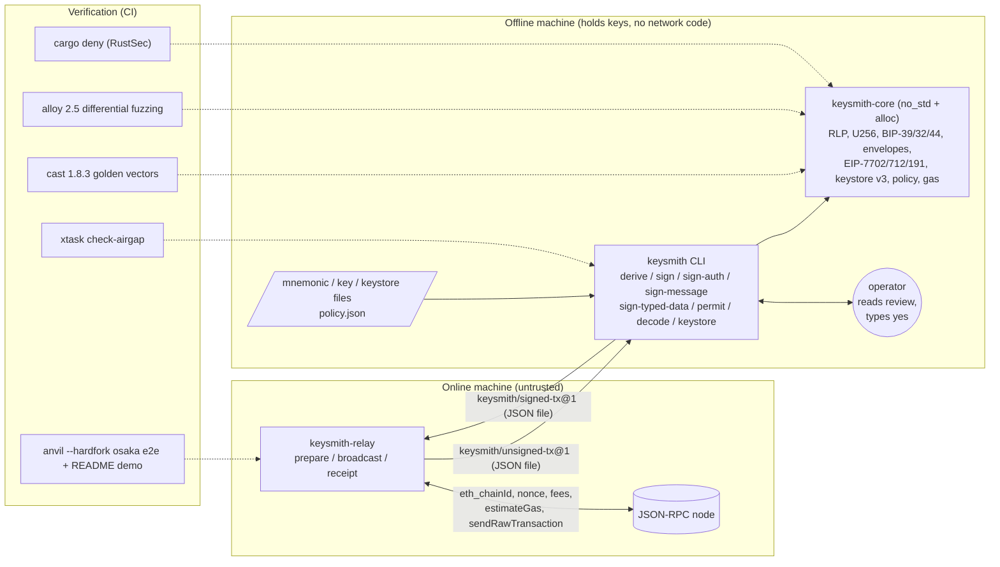

# Keysmith: Air-Gapped HD Wallet and Typed-Transaction Signer in Rust

A Rust library and CLI that derives BIP-39/32/44 keys and encodes and signs every Ethereum transaction type (legacy/EIP-155, 2930, 1559, 7702 set-code) plus EIP-712 and EIP-191 messages. It is built on a hand-written RLP core, and its output is byte-identical to Foundry's `cast`.

[](https://github.com/monzon1985/blockchain/actions/workflows/04-keysmith-offline-signer-rs.yml)
[](../../LICENSE)


## What's interesting here

- **Byte-identical to `cast`, proven rather than claimed.** 44 golden vectors were produced by Foundry `cast` 1.8.3: 11 transactions covering all four envelope types (3 of them EIP-7702), 4 authorizations, 5 `personal_sign` messages, 4 EIP-712 documents, 8 HD paths, 11 RLP values and 1 keystore. Keysmith reproduces all 44 byte for byte as a library, and the 33 transaction, authorization, message, typed-data, HD-path and keystore vectors also through the CLI (RLP has no CLI command). In CI, `cargo xtask regen-golden --check` requires cast 1.8.3, re-runs it and proves the committed file is current.
- **Differential fuzzing against alloy 2.5.** 8 property tests run 512 cases each (256 for EIP-712) on every `cargo test`. They compare signing payloads, hashes, signed encodings and signer recovery for all four transaction types, plus RLP, U256 (vs `ruint`), EIP-191, EIP-7702 authorizations, BIP-39/32 derivation (vs `coins-bip39`) and EIP-712 (vs `alloy-dyn-abi`). One property corrupts signed transactions and requires that keysmith's strict decoder never accepts bytes alloy rejects. A local campaign of **20,000 cases per property** also passed.
- **Mined on a local anvil node, gas included.** The `anvil --hardfork osaka` end-to-end suite runs prepare (online), then sign (offline binary), then broadcast for every type, including pre-EIP-155 legacy and EIP-7702 self-executed (one and two delegations in a transaction), sponsored and revoked delegations. The gas the node charges equals keysmith's intrinsic-gas math exactly: 27,200 for an EIP-2930 transfer with 1 address and 2 storage keys, and 25,000 (the EIP-7623 floor) for 100 non-zero calldata bytes. Message, typed-data and permit signatures are checked by the EVM's `ecrecover` precompile.
- **Reviewed, then confirmed, then signed.** Every signing command prints a review before it signs the transaction, message or typed data: for a transaction the full calldata (ERC-20 `transfer` / `approve` / `transferFrom` decoded), the access list and every EIP-7702 tuple with its recovered authority; for EIP-712 every hashed domain and message leaf. It signs and outputs only after the operator types `yes` (EIP-7702 self-authorizations are signed in memory first, because they are part of what is reviewed, and are discarded unless confirmed). EIP-7702 tuples that a node would silently skip are refused, and the deny-by-default policy applies even when no policy file is given.
- **An air gap you can verify, and 161 tests.** `cargo xtask check-airgap` walks the full normal + build dependency graph of the signer with every feature enabled (52 crates for `keysmith-core`, 76 for `keysmith-cli`, all targets) and scans its 30 source files for socket APIs, process spawning and FFI. The online `keysmith-relay` must be flagged through its transitive ureq and rustls as a positive control. The core builds for `thumbv7em-none-eabihf` with no `std`. 161 tests (162 on Unix) and **96.0 % line coverage of production code**, inline unit-test modules excluded (measured with `cargo-llvm-cov`).

## Overview

Signing an Ethereum transaction looks simple: RLP-encode some fields, hash them, sign the hash. The
hard parts show up in custody and audit work:

- **Encoding.** There are five envelope formats with different field orders, an EIP-155 `v` that
  folds in the chain id, typed payloads prefixed by a type byte, and EIP-7702 authorization lists
  with their own signing domain (`0x05`). Byte-level mistakes produce valid-looking signatures
  over the wrong data.
- **Canonicality.** RLP admits several encodings of one value unless the decoder is strict.
  A signer that accepts non-canonical input signs something other than what was reviewed.
- **Semantics.** EIP-7702 authorizations with `chainId = 0` are valid on every chain. A
  self-executed delegation must carry `nonce + 1`, a second one `nonce + 2`, and a node silently
  skips a tuple with the wrong nonce while still charging for it. EIP-7623 raised the gas floor
  for calldata. An EIP-712 message can contain fields the type never hashes.
- **Key hygiene.** Secrets must not reach argv, logs, error messages or world-readable files.
  Hostile keystore files can exhaust memory through their KDF parameters.

Keysmith implements the encoding layer itself (RLP, U256, envelopes, BIP-32/39, EIP-712, keystore v3)
on top of RustCrypto primitives. It then proves agreement with the reference implementations
instead of depending on them: Foundry's `cast` for golden vectors, alloy for differential
fuzzing, and anvil for consensus behaviour.

## Architecture



| Component | Responsibility | Key external calls |
|---|---|---|
| [`keysmith-core`](crates/keysmith-core) | Strict RLP, checked U256, BIP-39/32/44, typed envelopes (legacy/EIP-155, 2930, 1559, 7702), EIP-7702 authorizations and their skip rules, EIP-712 / EIP-191 / ERC-2612, Web3 Secret Storage v3, intrinsic gas and fee math, signing policy (transactions, authorizations, typed data), ERC-20 calldata recognition, decode reports | none: no I/O, no RNG, no networking (`#![no_std]`) |
| [`keysmith`](crates/keysmith-cli) (CLI) | The offline half: reads secrets from files or a TTY prompt, applies the policy, prints a review, asks for confirmation, then signs and writes envelopes | filesystem, terminal, OS RNG (`getrandom`, for mnemonics and keystore salts only) |
| [`keysmith-relay`](crates/keysmith-relay) | The online half: builds unsigned envelopes from chain state, verifies signed envelopes offline before broadcasting, polls receipts | `eth_chainId`, `eth_getTransactionCount`, `eth_gasPrice`, `eth_maxPriorityFeePerGas`, `eth_getBlockByNumber`, `eth_estimateGas`, `eth_sendRawTransaction`, `eth_getTransactionReceipt` |
| [`xtask`](xtask) | `check-airgap` (dependency graph + source scan + positive control), `regen-golden [--check]`, `coverage` (production-only line coverage from lcov) | `cargo tree`, `cast` |

The file formats that cross the gap, the policy schema, the confirmation step and the exit codes
are specified in [docs/formats.md](docs/formats.md).

## Roles and trust assumptions

There are no on-chain roles. The trust boundary is between machines. The **offline** machine and
the **operator** are trusted. The **online** machine, the **RPC node** and whoever **authored the
envelope or typed-data file** are not, so everything they provide is re-derived or re-checked,
and the operator confirms a field-by-field review before anything is signed. The full analysis
(assets, actors, 20 threats with their mitigations, known limitations) is in
[docs/threat-model.md](docs/threat-model.md).

## Invariants and properties

1. **Canonical RLP.** `decode(encode(v)) == v` for any nested value, encodings equal alloy-rlp's, and
   the decoder accepts exactly what alloy-rlp's strict header decoder accepts, including on
   mutated input. Tests: [`rlp_round_trip`](crates/keysmith-core/tests/properties.rs),
   [`rlp_matches_alloy`](crates/keysmith-core/tests/differential_alloy.rs),
   [`rlp_matches_cast_to_rlp`](crates/keysmith-core/tests/golden_cast.rs).
2. **Encodings equal the reference.** For all four transaction types, the signing payload, signing
   hash and signed EIP-2718 encoding are byte-identical to alloy-consensus, and each side decodes
   the other's bytes to the same transaction and signer. Test:
   [`transactions_match_alloy`](crates/keysmith-core/tests/differential_alloy.rs).
3. **No malleable acceptance.** Whatever keysmith decodes from corrupted bytes (flips, insertions,
   deletions, truncation, trailing bytes, swapped type bytes), alloy decodes too, and both
   re-encode it to the same bytes and hash. The only accepted asymmetry is EIP-4844, which is out
   of scope. Tests:
   [`corrupted_transactions_never_split_the_decoders`](crates/keysmith-core/tests/differential_alloy.rs),
   [`signed_transactions_are_strict`](crates/keysmith-core/tests/properties.rs).
4. **Sign-then-recover.** Every signature is low-s (`s <= n/2`) and recovers the signing key's
   address. High-s twins are rejected. Tests:
   [`sign_then_recover`](crates/keysmith-core/tests/properties.rs),
   [`sign_recover_and_malleability`](crates/keysmith-core/src/keys.rs).
5. **Byte equality with `cast`.** All 44 golden vectors reproduce byte for byte as a library; the
   33 that are not RLP values also reproduce through the CLI. Tests:
   [`golden_cast.rs`](crates/keysmith-core/tests/golden_cast.rs),
   [`sign_reproduces_cast_mktx_byte_for_byte`](crates/keysmith-cli/tests/cli.rs).
6. **HD derivation.** BIP-32 vectors 1-4 (17 chains) derive and serialize exactly. Vector 5 (16
   invalid keys) is rejected for the documented reason. The 26 BIP-39 vectors match: 24 from
   Trezor's python-mnemonic set plus the 15- and 21-word cases the coins-bip39 suite adds.
   `CKDpub(N(k), i) == N(CKDpriv(k, i))`, and derivation equals coins-bip39/bip32. Tests:
   [`official_vectors.rs`](crates/keysmith-core/tests/official_vectors.rs),
   [`public_and_private_derivation_commute`](crates/keysmith-core/tests/properties.rs),
   [`hd_derivation_matches_alloy_mnemonic_builder`](crates/keysmith-core/tests/differential_alloy.rs).
7. **EIP-7702.** Authorization hashing, encoding and recovery equal alloy-eips. Self-executed
   authorizations carry consecutive nonces `tx.nonce + 1`, `+ 2`, ..., and on anvil every one
   of them applies. A tuple that a node would silently skip (wrong chain, stale or mismatched
   nonce, unrecoverable signature, nonce `2^64 - 1`) is refused before signing. Tests:
   [`authorizations_match_alloy`](crates/keysmith-core/tests/differential_alloy.rs),
   [`self_authorization_uses_nonce_plus_one`](crates/keysmith-core/src/envelope.rs),
   [`several_self_authorizations_get_consecutive_nonces`](crates/keysmith-core/src/envelope.rs),
   [`sender_authorizations_must_follow_the_bumped_nonce`](crates/keysmith-core/src/gas.rs),
   [`several_self_authorizations_all_apply_and_skippable_tuples_are_refused`](crates/keysmith-cli/tests/anvil_e2e.rs).
8. **EIP-712.** The digest equals alloy-dyn-abi's for random schemas (every atomic width, dynamic
   types, struct arrays, domain subsets). The ERC-2612 helper equals the generic engine.
   Undeclared fields, malformed type names (`uint+8`, `bytes01`) and non-identifier member names
   are refused. Tests:
   [`eip712_matches_alloy`](crates/keysmith-core/tests/differential_alloy.rs),
   [`permit_direct_equals_generic`](crates/keysmith-core/tests/properties.rs),
   [`type_names_follow_the_solidity_grammar_exactly`](crates/keysmith-core/src/eip712.rs),
   [`typed_data_and_permit_match_cast`](crates/keysmith-cli/tests/cli.rs).
9. **Intrinsic gas is consensus-exact.** For calls to an EOA, the gas anvil charges equals
   `max(intrinsic, EIP-7623 floor)` as computed by keysmith. Test:
   [`every_transaction_type_is_mined_through_the_air_gap`](crates/keysmith-cli/tests/anvil_e2e.rs).
10. **Keystores interoperate.** Encrypt/decrypt round-trips. Files written by keysmith decrypt in
    eth-keystore and `cast wallet decrypt-keystore`, and files written by eth-keystore,
    `cast wallet import` and `cast wallet new` load in keysmith. Tests:
    [`keystore_round_trip`](crates/keysmith-core/tests/properties.rs),
    [`keystore_round_trips_with_eth_keystore`](crates/keysmith-core/tests/differential_alloy.rs),
    [`keystores_interoperate_with_cast_wallet`](crates/keysmith-cli/tests/anvil_e2e.rs).
11. **Refusals leave no trace.** An invalid or out-of-policy request exits with code 3, writes
    nothing, and nothing is mined. A tampered or wrong-chain signed envelope is never sent. Tests:
    [`refusals_exit_with_code_3_and_produce_nothing`](crates/keysmith-cli/tests/cli.rs),
    [`refusals_never_reach_the_chain`](crates/keysmith-cli/tests/anvil_e2e.rs),
    [`broadcast_refusals_send_nothing`](crates/keysmith-relay/tests/cli.rs).
12. **The signer has no network code.** No networking crate appears in the normal + build graph of
    `keysmith-core` or `keysmith-cli` with all features enabled, and their sources name no socket
    API, no `std::process` item other than `ExitCode` / `exit`, and no FFI declaration. Check:
    [`cargo xtask check-airgap`](xtask/src/airgap.rs).
13. **Nothing is signed before the operator confirms a complete review.** The review shows every
    signed field and is printed before the transaction, message or typed data is signed; nothing
    is output unless the operator confirms. Without a terminal and without
    `--yes`, nothing is signed. Untrusted text (the envelope note, EIP-712 strings) is escaped,
    so it cannot fake review lines. Tests:
    [`signing_waits_for_confirmation_and_never_signs_unattended`](crates/keysmith-cli/tests/cli.rs),
    [`the_review_shows_calldata_authorities_and_the_untrusted_note`](crates/keysmith-cli/tests/cli.rs),
    [`typed_data_is_reviewed_and_policy_checked_before_signing`](crates/keysmith-cli/tests/cli.rs).
14. **Hostile inputs are bounded before any work.** Keystore KDF cost is checked by arithmetic
    before scrypt allocates, and EIP-712 type shapes are bounded and validated without recursion.
    Tests:
    [`small_n_large_r_and_p_cannot_bypass_the_memory_bound`](crates/keysmith-core/src/keystore.rs),
    [`hostile_type_shapes_are_errors_not_stack_overflows`](crates/keysmith-core/src/eip712.rs).

## Security considerations

The threat model is in [docs/threat-model.md](docs/threat-model.md). Highlights:

- **What is signed is rebuilt, never trusted.** The signer receives typed fields, not a hash or an
  encoding. It re-validates consensus rules (intrinsic gas with the EIP-7623 floor, tip <= fee cap,
  initcode size, EIP-2681 nonce, a non-empty type-4 authorization list) and refuses any EIP-7702
  tuple a node would silently skip. It warns when the gas limit exceeds the EIP-7825 cap. It then
  applies a local policy whose booleans default to deny and whose unknown keys are errors. Without
  `--policy` the empty default policy applies, so creations, pre-EIP-155 legacy transactions and
  chainId-0 delegations are refused unless a policy file allows them (`--no-policy` is the
  explicit escape hatch).
- **Reviewed, then confirmed, then signed.** `sign`, `sign-auth`, `sign-message`,
  `sign-typed-data` and `permit` print a review to stderr, then ask for `yes` on the terminal.
  Without a terminal they refuse unless `--yes` is passed. Typed data and permits also take
  `--policy` (`allowedChainIds`, `allowedVerifyingContracts`, `allowedSpenders`,
  `maxPermitValue`), and the review warns on unlimited amounts and far-future deadlines.
- **Secrets never touch argv.** Keys, mnemonics, passphrases and passwords come from files or a
  TTY prompt. Errors report positions and lengths, never content. Every secret type has a
  redacted `Debug` and is zeroised on drop (best effort; see the limitations). On Unix,
  mnemonic and keystore files are created with mode `0600`.
- **Hostile inputs are bounded.** RLP nesting is capped at 64 levels. EIP-712 allows at most 64
  array dimensions per type, 256 declared types and 64 levels of value nesting. scrypt's true
  memory footprint `128·r·(N + p + 2)` is capped at 1 GiB + 1 MiB, with `r <= 32`, `p <= 16` and
  work `N·r·p <= 2^24`. All of these are checked before any work is done.
- **Supply chain.** CI runs `cargo deny` against the RustSec advisory database, allows crates.io
  as the only source, and allows permissive licences only. One advisory is triaged in
  [`deny.toml`](deny.toml) with its justification: `paste` is unmaintained and reached only at
  compile time through the alloy dev-dependency.
- **Known limitations.** The policy does not inspect calldata: the review shows it in full and
  decodes the three ERC-20 calls, but an ERC-20 recipient inside `transfer` data is not
  constrained by any rule. Typed-data rules follow schema conventions (a top-level `spender`, the
  `value` of a `Permit`). `--yes` removes the human from the loop. Parsing is not constant-time.
  Memory is not locked. The air-gap check is static, not a sandbox. Blob transactions are out of
  scope. Details are in the threat model.
- **Nothing here has been audited.** This is a technical portfolio project. Never use the anvil
  test mnemonic that appears throughout the tests on a real network.

## Design decisions and trade-offs

| Decision | Why | Cost |
|---|---|---|
| Hand-written RLP, U256 and envelopes instead of alloy | Small, auditable surface with strictness chosen deliberately; a `no_std` core whose 52-crate dependency graph is mostly RustCrypto | Must be proven equivalent, hence the cast vectors, the alloy differential suite and the anvil e2e |
| alloy only as a **dev**-dependency | The signer ships no provider or transport code, and alloy serves purely as an oracle | Two implementations to keep in sync (the differential tests are that sync) |
| Three crates: `core` (no I/O), `cli` (offline), `relay` (online) | The air gap becomes a property of the dependency graph that CI can check | `prepare` and `broadcast` are a separate binary, not `keysmith` subcommands |
| Envelopes carry fields, never hashes | A transaction is never signed blind: the online side cannot smuggle in a digest, and the review shows every signed field, calldata included | Unsigned envelopes are larger than a hash; the operator still has to read the review |
| Review first, then a typed `yes` on the terminal | The operator decides before the transaction, message or typed data is signed, and a script that forgot `--yes` signs nothing | Scripts and tests must pass `--yes` explicitly |
| A built-in default policy | Its deny-by-default booleans hold even when the operator writes no policy file | Creations, unprotected legacy and chainId-0 delegations need a policy file or `--no-policy` |
| RFC 6979 deterministic signatures with low-s normalisation | Reproducible output (byte equality with `cast`), and EIP-2 compliance | None in practice |
| EIP-7702 gas limit is explicit (no estimate) | The delegation does not exist until the offline step, so `eth_estimateGas` would measure the wrong code | The operator has to choose the limit (the signer still enforces the intrinsic minimum) |
| Decimal strings for integers in JSON | No precision loss above 2^53 in other tooling | Slightly verbose |
| Exit code 3 for refusals | Scripts can tell "refused by policy or by the operator" apart from "broken" | One more code to document |

## Testing

```sh
cargo fmt --all --check
cargo clippy --workspace --all-targets -- -D warnings
cargo test --workspace                       # 156 tests (157 on Unix): unit, properties, differential, golden, CLI, relay, xtask
cargo xtask check-airgap                     # dependency graph (all features) + source scan + positive control
cargo test -p keysmith-cli --features anvil-e2e -- --test-threads=1   # 5 e2e tests (plus the CLI suites again), needs anvil + cast
bash scripts/demo.sh                         # the README demo below, against a fresh anvil (port 0)
cargo xtask regen-golden --check             # requires cast 1.8.3 (Foundry)
cargo deny --locked check advisories bans sources licenses   # needs cargo-deny 0.20.2
cargo build -p keysmith-core --no-default-features --target thumbv7em-none-eabihf   # no_std proof
```

| Suite | Location | Tests | What it covers |
|---|---|---:|---|
| Core unit tests | `crates/keysmith-core/src/**` | 72 | RLP edge cases, Yellow Paper / EIP-155 / EIP-55 / EIP-712 spec examples, keystore spec vectors and KDF bounds, EIP-7702 skip rules, typed-data grammar, bounds and review fields, ERC-20 calldata, policy, gas, report |
| Official vectors | `crates/keysmith-core/tests/official_vectors.rs` | 6 | BIP-32 vectors 1-5 (17 chains, 16 invalid keys), 26 BIP-39 vectors (24 Trezor + 2 coins-bip39), NFKD passphrases, anvil accounts |
| Golden (cast) | `crates/keysmith-core/tests/golden_cast.rs` | 8 | 44 vectors from `cast` 1.8.3 |
| Differential (alloy) | `crates/keysmith-core/tests/differential_alloy.rs` | 9 | 8 properties vs alloy 2.5 + eth-keystore interop |
| Properties | `crates/keysmith-core/tests/properties.rs` | 9 | round trips, sign-then-recover, strictness, BIP-32 commutation |
| CLI unit | `crates/keysmith-cli/src/**` | 3 | confirmation answers, escaping of untrusted text, calldata layout |
| CLI | `crates/keysmith-cli/tests/cli.rs` | 20 (+1 on Unix) | every command, byte equality with cast, review contents, confirmation gate, default policy, typed-data policy, refusals, secret hygiene, 0600 secret files (Unix), 17 insta snapshots |
| anvil e2e (feature `anvil-e2e`) | `crates/keysmith-cli/tests/anvil_e2e.rs` | 5 | all tx types mined, 7702 self (one and two delegations) / sponsored / revoke, skipped tuples refused, refusals, ecrecover, cast keystore interop |
| Relay unit | `crates/keysmith-relay/src/**` | 15 | RPC parsing, prepare defaults and guards, broadcast verification |
| Relay CLI | `crates/keysmith-relay/tests/cli.rs` | 5 | the binary against an in-process mock node (port 0) |
| xtask | `xtask/src/**` | 9 | `cargo tree` parsing, network-crate detection, transitive positive control, source scan (sockets, process spawning, FFI), cast release check, coverage exclusion of test modules |

**Coverage.** 96.0 % of production lines (4,553 / 4,743 lcov line records in 32 files of
`keysmith-core`, `keysmith-cli` and `keysmith-relay`). `tests/` directories, xtask and the 1,935
lines of inline `#[cfg(test)]` modules are excluded. cargo-llvm-cov on stable instruments those
modules like production code, so `cargo xtask coverage` drops them from the lcov export before
computing the figure. Counting them, the same data gives 97.1 %. CI gates the production figure
at 90 %:

```sh
cargo llvm-cov --workspace --no-report
cargo llvm-cov report --lcov --output-path lcov.info --ignore-filename-regex '(xtask|[\\/]tests[\\/])'
cargo xtask coverage lcov.info --fail-under 90
```

**Property and fuzz settings.** By default each property runs 512 cases (256 for EIP-712 and 24
for the scrypt keystore round trip). `PROPTEST_CASES` overrides every count; CI pins
`PROPTEST_RNG_SEED=4` for reproducibility and additionally runs the differential and property
suites at 5,000 cases per property. A local run with `PROPTEST_CASES=20000` passed for all 18
tests of those two suites.

## Getting started

**Prerequisites:** Rust 1.98.1 (pinned in `rust-toolchain.toml`; on Windows the MSVC toolchain with
VS 2022 Build Tools). Foundry 1.8.3 (`anvil`, `cast`) is needed only for the e2e suite, the demo
and golden-vector regeneration.

```sh
cd projects/04-keysmith-offline-signer-rs
cargo build --release
cargo test --workspace
export PATH="$PWD/target/release:$PATH"   # puts keysmith and keysmith-relay on PATH
```

**Local demo** (anvil's public test mnemonic; never fund these keys anywhere else). It runs in a
temporary directory so nothing is written into the repository, and `--out` never overwrites, so
each run starts fresh. [`scripts/demo.sh`](scripts/demo.sh) runs exactly these commands (with
`--yes` in place of typing `yes`), and CI runs it on every change.

```sh
cd "$(mktemp -d)"
anvil --hardfork osaka --port 0     # in another terminal; prints "Listening on 127.0.0.1:<port>"
export RPC=http://127.0.0.1:<port>
echo "test test test test test test test test test test test junk" > mnemonic.txt
echo '{"allowedChainIds":[31337],"maxValueWei":"2000000000000000000"}' > policy.json

# online: build the unsigned envelope from chain state
keysmith-relay --rpc-url $RPC prepare --type eip1559 \
  --from 0xf39Fd6e51aad88F6F4ce6aB8827279cffFb92266 \
  --to 0x70997970C51812dc3A010C7d01b50e0d17dc79C8 --value 1ether --out unsigned.json

# offline: read the review, type "yes", and the envelope is signed under the policy
keysmith sign --envelope unsigned.json --mnemonic-file mnemonic.txt --policy policy.json --out signed.json
keysmith decode --file signed.json

# online: verify and broadcast
keysmith-relay --rpc-url $RPC broadcast --envelope signed.json --wait

# EIP-7702: delegate the sender's own account (authorization nonce = tx nonce + 1)
keysmith-relay --rpc-url $RPC prepare --type eip7702 \
  --from 0xf39Fd6e51aad88F6F4ce6aB8827279cffFb92266 --to 0xf39Fd6e51aad88F6F4ce6aB8827279cffFb92266 \
  --gas-limit 100000 --self-auth 31337:0x5FbDB2315678afecb367f032d93F642f64180aa3 --out u7702.json
keysmith sign --envelope u7702.json --mnemonic-file mnemonic.txt --out s7702.json
keysmith-relay --rpc-url $RPC broadcast --envelope s7702.json --wait
cast code 0xf39Fd6e51aad88F6F4ce6aB8827279cffFb92266 --rpc-url $RPC   # 0xef0100 || delegate
```

The second `keysmith sign` has no `--policy`, so the built-in default policy applies (it allows
this delegation: chain 31337, not chain 0). Other commands: `keysmith mnemonic new|validate`,
`derive --count N --xpub`, `keystore export|inspect`, `sign-auth --executor sponsor|self`,
`sign-message`, `verify-message`, `sign-typed-data`, `hash-typed-data`, `permit`. Run
`keysmith --help` for details.

## Project structure

```
04-keysmith-offline-signer-rs/
├── crates/
│   ├── keysmith-core/        # no_std + alloc library (all encoding, crypto glue, policy, gas)
│   │   ├── src/              # rlp, u256, bip39, bip32, keys, tx, authorization, eip712, calldata, ...
│   │   └── tests/            # official vectors, cast golden, alloy differential, properties
│   ├── keysmith-cli/         # `keysmith`, the offline binary (review, confirmation, signing)
│   │   └── tests/            # assert_cmd + insta CLI tests, anvil e2e (feature anvil-e2e)
│   └── keysmith-relay/       # `keysmith-relay`, the online binary + library
├── xtask/                    # cargo xtask check-airgap | regen-golden [--check] | coverage
├── scripts/demo.sh           # the README demo against a fresh anvil (run in CI)
├── test-vectors/
│   ├── official/             # BIP-32 vectors 1-5, BIP-39 Trezor vectors
│   └── cast/                 # golden.json, typed-data inputs, cast-written keystore
├── deny.toml                 # cargo-deny: advisories, bans, sources, licences
└── docs/                     # threat model, file formats
```

## Scope notes and future work

- **`prepare` and `broadcast` live in `keysmith-relay`, not in `keysmith`.** The specification
  describes a `prepare` -> `sign` -> `broadcast` workflow. Keeping the two online steps in a
  separate binary is what lets `check-airgap` prove that the signing binary contains no network
  code.
- **EIP-7702 gas is not estimated** (see the design decisions). For 7702, `prepare` requires
  `--gas-limit`.
- **Official EIP-2930 / 1559 / 7702 vectors are not vendored.** The specification asks for
  official BIP-32/39 and EIP-155/1559/7702 vectors. The BIP-32 and BIP-39 vectors and EIP-155's
  own example are official and are tested. For the typed envelopes, the ethereum/tests
  `ttEIP2930` / `ttEIP1559` transaction tests and the EEST set-code fixtures were not vendored.
  Three independent implementations stand in for them: Foundry's `cast` (golden vectors),
  alloy (differential fuzzing) and anvil/revm (every type mined, gas compared).
- **Out of scope:** EIP-4844 blob transactions, ERC-1271/6492 contract signatures, hardware
  wallets, QR (UR) transport, and general ABI decoding of calldata in the review (only ERC-20
  `transfer`, `approve` and `transferFrom` are decoded).
- **Future work:** vendor the ethereum/tests and EEST transaction fixtures; calldata-aware
  policy rules (ERC-20 `transfer` / `approve` recipients and amounts); an ABI-decoded review
  from a local ABI file; `mlock`-backed secret buffers; and a constant-time hex and Base58 path
  for secret parsing.

## References

- Ethereum Yellow Paper, Appendix B (RLP); [EIP-155](https://eips.ethereum.org/EIPS/eip-155),
  [EIP-2](https://eips.ethereum.org/EIPS/eip-2) (low-s),
  [EIP-2718](https://eips.ethereum.org/EIPS/eip-2718), [EIP-2930](https://eips.ethereum.org/EIPS/eip-2930),
  [EIP-1559](https://eips.ethereum.org/EIPS/eip-1559), [EIP-7702](https://eips.ethereum.org/EIPS/eip-7702),
  [EIP-3860](https://eips.ethereum.org/EIPS/eip-3860), [EIP-7623](https://eips.ethereum.org/EIPS/eip-7623),
  [EIP-7825](https://eips.ethereum.org/EIPS/eip-7825), [EIP-2681](https://eips.ethereum.org/EIPS/eip-2681).
- [EIP-712](https://eips.ethereum.org/EIPS/eip-712), [EIP-191](https://eips.ethereum.org/EIPS/eip-191),
  [ERC-2612](https://eips.ethereum.org/EIPS/eip-2612), [EIP-55](https://eips.ethereum.org/EIPS/eip-55).
- [BIP-32](https://github.com/bitcoin/bips/blob/master/bip-0032.mediawiki) (test vectors 1-5),
  [BIP-39](https://github.com/bitcoin/bips/blob/master/bip-0039.mediawiki) (English wordlist; test
  vectors from [trezor/python-mnemonic](https://github.com/trezor/python-mnemonic), extended by
  the coins-bip39 suite), [BIP-44](https://github.com/bitcoin/bips/blob/master/bip-0044.mediawiki), RFC 6979.
- [Web3 Secret Storage Definition](https://ethereum.org/developers/docs/data-structures-and-encoding/web3-secret-storage/).
  Its scrypt test vector does not match its stated parameters: scrypt over the published salt with
  N = 2^18, r = 8, p = 1 gives `b4130dc8...` (OpenSSL agrees), not the listed `7446f59e...`, and
  `cast wallet decrypt-keystore` reports "Mac Mismatch" on it. Keysmith therefore uses the PBKDF2
  vector plus a scrypt known-answer test and documents the discrepancy in `keystore.rs`.
- [RustSec advisory database](https://rustsec.org/) and [cargo-deny](https://github.com/EmbarkStudios/cargo-deny)
  for the supply-chain gate.
- Prior art and oracles: Foundry's `cast` (`mktx`, `wallet sign`, `wallet sign-auth`,
  `wallet import`, `to-rlp`, `decode-tx`), [alloy](https://github.com/alloy-rs/alloy)
  (consensus, eips, rlp, dyn-abi, signer-local), [eth-keystore](https://github.com/roynalnaruto/eth-keystore-rs),
  [coins-bip39/bip32](https://github.com/summa-tx/coins), MetaMask's `eth-sig-util` (EIP-712
  conventions such as domain-only digests), and the RustCrypto crates
  (`k256`, `sha3`, `sha2`, `hmac`, `pbkdf2`, `scrypt`, `aes`, `ctr`, `ripemd`) that provide every primitive.
