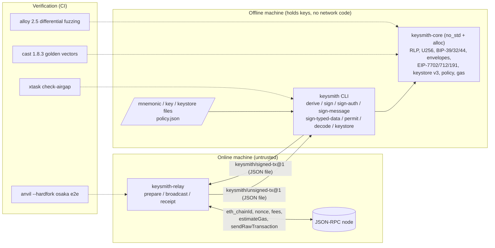

# Keysmith: Air-Gapped HD Wallet and Typed-Transaction Signer in Rust

A Rust library and CLI that derives BIP-39/32/44 keys and encodes and signs every Ethereum transaction type (legacy/EIP-155, 2930, 1559, 7702 set-code) plus EIP-712 and EIP-191 messages. It is built on a hand-written RLP core, and its output is byte-identical to Foundry's `cast`.

[](https://github.com/monzon1985/blockchain/actions/workflows/04-keysmith-offline-signer-rs.yml)
[](../../LICENSE)


## What's interesting here

- **Byte-identical to `cast`, proven rather than claimed.** 44 golden vectors were produced by Foundry `cast` 1.8.3: 11 transactions covering all four envelope types (3 of them EIP-7702), 4 authorizations, 5 `personal_sign` messages, 4 EIP-712 documents, 8 HD paths, 11 RLP values and 1 keystore. Keysmith reproduces every one byte for byte, both as a library and through the CLI. `cargo xtask regen-golden --check` re-runs `cast` in CI to prove the committed file is current.
- **Differential fuzzing against alloy 2.5.** 8 property tests run 512 cases each (256 for EIP-712) on every `cargo test`. They compare signing payloads, hashes, signed encodings and signer recovery for all four transaction types, plus RLP, U256 (vs `ruint`), EIP-191, EIP-7702 authorizations, BIP-39/32 derivation (vs `coins-bip39`) and EIP-712 (vs `alloy-dyn-abi`). One property corrupts signed transactions and requires that keysmith's strict decoder never accepts bytes alloy rejects. A local campaign of **20,000 cases per property** also passed.
- **Mined on a live chain, gas included.** The `anvil --hardfork osaka` end-to-end suite runs prepare (online), then sign (offline binary), then broadcast for every type, including pre-EIP-155 legacy and EIP-7702 self-executed, sponsored and revoked delegations. The gas the node charges equals keysmith's intrinsic-gas math exactly: 25,300 for an EIP-2930 transfer with 1 address and 2 storage keys, and 25,000 (the EIP-7623 floor) for 100 non-zero calldata bytes. Message, typed-data and permit signatures are checked by the EVM's `ecrecover` precompile.
- **An air gap you can verify.** `cargo xtask check-airgap` walks the full normal + build dependency graph of the signer (52 crates for `keysmith-core`, 76 for `keysmith-cli`, all targets) and scans its sources for socket APIs. It must also flag the online `keysmith-relay` (ureq, rustls) as a positive control. The core builds for `thumbv7em-none-eabihf` with no `std`.
- **136 tests and 95.9 % line coverage** of the production crates (measured with `cargo-llvm-cov`). Refusals are first-class: an invalid or out-of-policy request exits with code 3 and produces nothing.

## Overview

Signing an Ethereum transaction looks simple: RLP-encode some fields, hash them, sign the hash. The
hard parts show up in custody and audit work:

- **Encoding.** There are five envelope formats with different field orders, an EIP-155 `v` that
  folds in the chain id, typed payloads prefixed by a type byte, and EIP-7702 authorization lists
  with their own signing domain (`0x05`). Byte-level mistakes produce valid-looking signatures
  over the wrong data.
- **Canonicality.** RLP admits several encodings of one value unless the decoder is strict.
  A signer that accepts non-canonical input signs something other than what was reviewed.
- **Semantics.** EIP-7702 authorizations with `chainId = 0` are valid on every chain. A
  self-executed delegation must carry `nonce + 1`. EIP-7623 raised the gas floor for calldata.
  An EIP-712 message can contain fields the type never hashes.
- **Key hygiene.** Secrets must not reach argv, logs or error messages. Hostile keystore files can
  exhaust memory through their KDF parameters.

Keysmith implements the encoding layer itself (RLP, U256, envelopes, BIP-32/39, EIP-712, keystore v3)
on top of RustCrypto primitives. It then proves agreement with the reference implementations
instead of depending on them: Foundry's `cast` for golden vectors, alloy for differential
fuzzing, and anvil for consensus behaviour.

## Architecture



| Component | Responsibility | Key external calls |
|---|---|---|
| [`keysmith-core`](crates/keysmith-core) | Strict RLP, checked U256, BIP-39/32/44, typed envelopes (legacy/EIP-155, 2930, 1559, 7702), EIP-7702 authorizations, EIP-712 / EIP-191 / ERC-2612, Web3 Secret Storage v3, intrinsic gas and fee math, signing policy, decode reports | none: no I/O, no RNG, no networking (`#![no_std]`) |
| [`keysmith`](crates/keysmith-cli) (CLI) | The offline half: reads secrets from files or a TTY prompt, prints a review, signs, writes envelopes | filesystem, OS RNG (`getrandom`, for mnemonics and keystore salts only) |
| [`keysmith-relay`](crates/keysmith-relay) | The online half: builds unsigned envelopes from chain state, verifies signed envelopes offline before broadcasting, polls receipts | `eth_chainId`, `eth_getTransactionCount`, `eth_gasPrice`, `eth_maxPriorityFeePerGas`, `eth_getBlockByNumber`, `eth_estimateGas`, `eth_sendRawTransaction`, `eth_getTransactionReceipt` |
| [`xtask`](xtask) | `check-airgap` (dependency graph + source scan + positive control), `regen-golden [--check]` | `cargo tree`, `cast` |

The file formats that cross the gap, the policy schema and the exit codes are specified in
[docs/formats.md](docs/formats.md).

## Roles and trust assumptions

There are no on-chain roles. The trust boundary is between machines. The **offline** machine and
the **operator** are trusted. The **online** machine, the **RPC node** and whoever **authored the
envelope** are not, so everything they provide is re-derived or re-checked. The full analysis
(assets, actors, 15 threats with their mitigations, known limitations) is in
[docs/threat-model.md](docs/threat-model.md).

## Invariants and properties

1. **Canonical RLP.** `decode(encode(v)) == v` for any nested value, encodings equal alloy-rlp's, and
   the decoder accepts exactly what alloy-rlp's strict header decoder accepts, including on
   mutated input. Tests: [`rlp_round_trip`](crates/keysmith-core/tests/properties.rs),
   [`rlp_matches_alloy`](crates/keysmith-core/tests/differential_alloy.rs),
   [`rlp_matches_cast_to_rlp`](crates/keysmith-core/tests/golden_cast.rs).
2. **Encodings equal the reference.** For all four transaction types, the signing payload, signing
   hash and signed EIP-2718 encoding are byte-identical to alloy-consensus, and each side decodes
   the other's bytes to the same transaction and signer. Test:
   [`transactions_match_alloy`](crates/keysmith-core/tests/differential_alloy.rs).
3. **No malleable acceptance.** Whatever keysmith decodes from corrupted bytes (flips, insertions,
   deletions, truncation, trailing bytes, swapped type bytes), alloy decodes too, and both
   re-encode it to the same bytes and hash. The only accepted asymmetry is EIP-4844, which is out
   of scope. Tests:
   [`corrupted_transactions_never_split_the_decoders`](crates/keysmith-core/tests/differential_alloy.rs),
   [`signed_transactions_are_strict`](crates/keysmith-core/tests/properties.rs).
4. **Sign-then-recover.** Every signature is low-s (`s <= n/2`) and recovers the signing key's
   address. High-s twins are rejected. Tests:
   [`sign_then_recover`](crates/keysmith-core/tests/properties.rs),
   [`sign_recover_and_malleability`](crates/keysmith-core/src/keys.rs).
5. **Byte equality with `cast`.** All 44 golden vectors reproduce byte for byte, as a library and
   through the CLI. Tests: [`golden_cast.rs`](crates/keysmith-core/tests/golden_cast.rs),
   [`sign_reproduces_cast_mktx_byte_for_byte`](crates/keysmith-cli/tests/cli.rs).
6. **HD derivation.** BIP-32 vectors 1-4 (17 chains) derive and serialize exactly. Vector 5 (16
   invalid keys) is rejected for the documented reason. The 26 BIP-39 Trezor vectors match.
   `CKDpub(N(k), i) == N(CKDpriv(k, i))`, and derivation equals coins-bip39/bip32. Tests:
   [`official_vectors.rs`](crates/keysmith-core/tests/official_vectors.rs),
   [`public_and_private_derivation_commute`](crates/keysmith-core/tests/properties.rs),
   [`hd_derivation_matches_alloy_mnemonic_builder`](crates/keysmith-core/tests/differential_alloy.rs).
7. **EIP-7702.** Authorization hashing, encoding and recovery equal alloy-eips. A self-executed
   authorization carries `tx.nonce + 1` and the resulting delegation is live on anvil. Tests:
   [`authorizations_match_alloy`](crates/keysmith-core/tests/differential_alloy.rs),
   [`self_authorization_uses_nonce_plus_one`](crates/keysmith-core/src/envelope.rs),
   [`every_transaction_type_is_mined_through_the_air_gap`](crates/keysmith-cli/tests/anvil_e2e.rs).
8. **EIP-712.** The digest equals alloy-dyn-abi's for random schemas (every atomic width, dynamic
   types, struct arrays, domain subsets). The ERC-2612 helper equals the generic engine.
   Undeclared fields are refused. Tests:
   [`eip712_matches_alloy`](crates/keysmith-core/tests/differential_alloy.rs),
   [`permit_direct_equals_generic`](crates/keysmith-core/tests/properties.rs),
   [`typed_data_and_permit_match_cast`](crates/keysmith-cli/tests/cli.rs).
9. **Intrinsic gas is consensus-exact.** For calls to an EOA, the gas anvil charges equals
   `max(intrinsic, EIP-7623 floor)` as computed by keysmith. Test:
   [`every_transaction_type_is_mined_through_the_air_gap`](crates/keysmith-cli/tests/anvil_e2e.rs).
10. **Keystores interoperate.** Encrypt/decrypt round-trips. Files written by keysmith decrypt in
    eth-keystore and `cast wallet decrypt-keystore`, and files written by eth-keystore,
    `cast wallet import` and `cast wallet new` load in keysmith. Tests:
    [`keystore_round_trip`](crates/keysmith-core/tests/properties.rs),
    [`keystore_round_trips_with_eth_keystore`](crates/keysmith-core/tests/differential_alloy.rs),
    [`keystores_interoperate_with_cast_wallet`](crates/keysmith-cli/tests/anvil_e2e.rs).
11. **Refusals leave no trace.** An invalid or out-of-policy request exits with code 3, writes
    nothing, and nothing is mined. A tampered or wrong-chain signed envelope is never sent. Tests:
    [`refusals_exit_with_code_3_and_produce_nothing`](crates/keysmith-cli/tests/cli.rs),
    [`refusals_never_reach_the_chain`](crates/keysmith-cli/tests/anvil_e2e.rs),
    [`broadcast_refusals_send_nothing`](crates/keysmith-relay/tests/cli.rs).
12. **The signer has no network code.** No networking crate appears in the normal + build graph of
    `keysmith-core` or `keysmith-cli`, and no socket API appears in their sources. Check:
    [`cargo xtask check-airgap`](xtask/src/airgap.rs).

## Security considerations

The threat model is in [docs/threat-model.md](docs/threat-model.md). Highlights:

- **What is signed is rebuilt, never trusted.** The signer receives typed fields, not a hash or an
  encoding. It re-validates consensus rules: intrinsic gas with the EIP-7623 floor, the EIP-7825
  cap, tip <= fee cap, initcode size, EIP-2681 nonce, and a non-empty type-4 authorization list.
  It then applies a local policy whose booleans default to deny and whose unknown keys are errors.
- **Secrets never touch argv.** Keys, mnemonics, passphrases and passwords come from files or a
  TTY prompt. Errors report positions and lengths, never content. Every secret type has a
  redacted `Debug` and is zeroised on drop (best effort; see the limitations).
- **Hostile inputs are bounded.** RLP nesting is capped at 64 levels, EIP-712 depth at 64, and
  keystore KDF cost at 1 GiB of scrypt memory, all checked before any work is done.
- **Known limitations.** The policy does not inspect calldata (an ERC-20 recipient inside
  `transfer` data is not constrained). Parsing is not constant-time. Memory is not locked. The
  air-gap check is static, not a sandbox. Blob transactions are out of scope. Details in the
  threat model.
- **Nothing here has been audited.** This is a technical portfolio project. Never use the anvil
  test mnemonic that appears throughout the tests on a real network.

## Design decisions and trade-offs

| Decision | Why | Cost |
|---|---|---|
| Hand-written RLP, U256 and envelopes instead of alloy | Small, auditable surface with strictness chosen deliberately; a `no_std` core whose 52-crate dependency graph is mostly RustCrypto | Must be proven equivalent, hence the cast vectors, the alloy differential suite and the anvil e2e |
| alloy only as a **dev**-dependency | The signer ships no provider or transport code, and alloy serves purely as an oracle | Two implementations to keep in sync (the differential tests are that sync) |
| Three crates: `core` (no I/O), `cli` (offline), `relay` (online) | The air gap becomes a property of the dependency graph that CI can check | `prepare` and `broadcast` are a separate binary, not `keysmith` subcommands |
| Envelopes carry fields, never hashes | Blind signing is impossible: the online side cannot smuggle in a digest | Unsigned envelopes are larger than a hash |
| RFC 6979 deterministic signatures with low-s normalisation | Reproducible output (byte equality with `cast`), and EIP-2 compliance | None in practice |
| EIP-7702 gas limit is explicit (no estimate) | The delegation does not exist until the offline step, so `eth_estimateGas` would measure the wrong code | The operator has to choose the limit (the signer still enforces the intrinsic minimum) |
| Decimal strings for integers in JSON | No precision loss above 2^53 in other tooling | Slightly verbose |
| Exit code 3 for refusals | Scripts can tell "refused by policy" apart from "broken" | One more code to document |

## Testing

```sh
cargo fmt --all --check
cargo clippy --workspace --all-targets -- -D warnings
cargo test --workspace                       # 132 tests: unit, properties, differential, golden, CLI
cargo xtask check-airgap                     # dependency graph + source scan + positive control
cargo test -p keysmith-cli --features anvil-e2e -- --test-threads=1   # 4 tests, needs anvil + cast
cargo xtask regen-golden --check             # re-runs cast 1.8.3, needs Foundry
cargo build -p keysmith-core --no-default-features --target thumbv7em-none-eabihf   # no_std proof
```

| Suite | Location | Tests | What it covers |
|---|---|---:|---|
| Core unit tests | `crates/keysmith-core/src/**` | 62 | RLP edge cases, Yellow Paper / EIP-155 / EIP-55 / EIP-712 spec examples, keystore spec vectors, policy, gas, report |
| Official vectors | `crates/keysmith-core/tests/official_vectors.rs` | 6 | BIP-32 vectors 1-5 (17 chains, 16 invalid keys), 26 BIP-39 Trezor vectors, NFKD passphrases, anvil accounts |
| Golden (cast) | `crates/keysmith-core/tests/golden_cast.rs` | 8 | 44 vectors from `cast` 1.8.3 |
| Differential (alloy) | `crates/keysmith-core/tests/differential_alloy.rs` | 9 | 8 properties vs alloy 2.5 + eth-keystore interop |
| Properties | `crates/keysmith-core/tests/properties.rs` | 9 | round trips, sign-then-recover, strictness, BIP-32 commutation |
| CLI | `crates/keysmith-cli/tests/cli.rs` | 15 | every command, byte equality with cast, refusals, secret hygiene, 15 insta snapshots |
| anvil e2e (feature `anvil-e2e`) | `crates/keysmith-cli/tests/anvil_e2e.rs` | 4 | all tx types mined, 7702 self/sponsored/revoke, refusals, ecrecover, cast keystore interop |
| Relay unit | `crates/keysmith-relay/src/**` | 15 | RPC parsing, prepare defaults and guards, broadcast verification |
| Relay CLI | `crates/keysmith-relay/tests/cli.rs` | 5 | the binary against an in-process mock node (port 0) |
| xtask | `xtask/src/airgap.rs` | 3 | `cargo tree` parsing, network-crate detection, source scan |

**Coverage.** 95.9 % of lines (5,527 / 5,763) in `keysmith-core`, `keysmith-cli` and
`keysmith-relay` are covered, with test files and xtask excluded:
`cargo llvm-cov --workspace --summary-only --ignore-filename-regex '(xtask|[\\/]tests[\\/])'`.
CI gates this at 90 %.

**Property and fuzz settings.** By default each property runs 512 cases (256 for EIP-712 and 24
for the scrypt keystore round trip). `PROPTEST_CASES` overrides every count; CI pins
`PROPTEST_RNG_SEED=4` for reproducibility and additionally runs the differential and property
suites at 5,000 cases per property. A local run with `PROPTEST_CASES=20000` passed for all 17
property tests.

## Getting started

**Prerequisites:** Rust 1.98.1 (pinned in `rust-toolchain.toml`; on Windows the MSVC toolchain with
VS 2022 Build Tools). Foundry 1.8.3 (`anvil`, `cast`) is needed only for the e2e suite and for
golden-vector regeneration.

```sh
cd projects/04-keysmith-offline-signer-rs
cargo build --release
cargo test --workspace
```

**Local demo** (anvil's public test mnemonic; never fund these keys anywhere else):

```sh
anvil --hardfork osaka              # prints "Listening on 127.0.0.1:<port>"
export RPC=http://127.0.0.1:<port>
echo "test test test test test test test test test test test junk" > mnemonic.txt
echo '{"allowedChainIds":[31337],"maxValueWei":"2000000000000000000"}' > policy.json

# online: build the unsigned envelope from chain state
keysmith-relay --rpc-url $RPC prepare --type eip1559 \
  --from 0xf39Fd6e51aad88F6F4ce6aB8827279cffFb92266 \
  --to 0x70997970C51812dc3A010C7d01b50e0d17dc79C8 --value 1ether --out unsigned.json

# offline: review and sign under the policy
keysmith sign --envelope unsigned.json --mnemonic-file mnemonic.txt --policy policy.json --out signed.json
keysmith decode --file signed.json

# online: verify and broadcast
keysmith-relay --rpc-url $RPC broadcast --envelope signed.json --wait

# EIP-7702: delegate the sender's own account (authorization nonce = tx nonce + 1)
keysmith-relay --rpc-url $RPC prepare --type eip7702 \
  --from 0xf39Fd6e51aad88F6F4ce6aB8827279cffFb92266 --to 0xf39Fd6e51aad88F6F4ce6aB8827279cffFb92266 \
  --gas-limit 100000 --self-auth 31337:0x5FbDB2315678afecb367f032d93F642f64180aa3 --out u7702.json
keysmith sign --envelope u7702.json --mnemonic-file mnemonic.txt --out s7702.json
keysmith-relay --rpc-url $RPC broadcast --envelope s7702.json --wait
cast code 0xf39Fd6e51aad88F6F4ce6aB8827279cffFb92266 --rpc-url $RPC   # 0xef0100 || delegate
```

Other commands: `keysmith mnemonic new|validate`, `derive --count N --xpub`,
`keystore export|inspect`, `sign-auth --executor sponsor|self`, `sign-message`, `verify-message`,
`sign-typed-data`, `hash-typed-data`, `permit`. Run `keysmith --help` for details.

## Project structure

```
04-keysmith-offline-signer-rs/
├── crates/
│   ├── keysmith-core/        # no_std + alloc library (all encoding, crypto glue, policy, gas)
│   │   ├── src/              # rlp, u256, bip39, bip32, keys, tx, authorization, eip712, ...
│   │   └── tests/            # official vectors, cast golden, alloy differential, properties
│   ├── keysmith-cli/         # `keysmith`, the offline binary
│   │   └── tests/            # assert_cmd + insta CLI tests, anvil e2e (feature anvil-e2e)
│   └── keysmith-relay/       # `keysmith-relay`, the online binary + library
├── xtask/                    # cargo xtask check-airgap | regen-golden [--check]
├── test-vectors/
│   ├── official/             # BIP-32 vectors 1-5, BIP-39 Trezor vectors
│   └── cast/                 # golden.json, typed-data inputs, cast-written keystore
└── docs/                     # threat model, file formats
```

## Scope notes and future work

- **`prepare` and `broadcast` live in `keysmith-relay`, not in `keysmith`.** The specification
  describes a `prepare` -> `sign` -> `broadcast` workflow. Keeping the two online steps in a
  separate binary is what lets `check-airgap` prove that the signing binary contains no network
  code.
- **EIP-7702 gas is not estimated** (see the design decisions). For 7702, `prepare` requires
  `--gas-limit`.
- **Out of scope:** EIP-4844 blob transactions, ERC-1271/6492 contract signatures, hardware
  wallets, QR (UR) transport, and ABI-decoding calldata in the review.
- **Future work:** calldata-aware policy rules (ERC-20 `transfer` / `approve` recipients and
  amounts), an ABI-decoded review from a local ABI file, `mlock`-backed secret buffers, and a
  constant-time hex and Base58 path for secret parsing.

## References

- Ethereum Yellow Paper, Appendix B (RLP); [EIP-155](https://eips.ethereum.org/EIPS/eip-155),
  [EIP-2](https://eips.ethereum.org/EIPS/eip-2) (low-s),
  [EIP-2718](https://eips.ethereum.org/EIPS/eip-2718), [EIP-2930](https://eips.ethereum.org/EIPS/eip-2930),
  [EIP-1559](https://eips.ethereum.org/EIPS/eip-1559), [EIP-7702](https://eips.ethereum.org/EIPS/eip-7702),
  [EIP-3860](https://eips.ethereum.org/EIPS/eip-3860), [EIP-7623](https://eips.ethereum.org/EIPS/eip-7623),
  [EIP-7825](https://eips.ethereum.org/EIPS/eip-7825), [EIP-2681](https://eips.ethereum.org/EIPS/eip-2681).
- [EIP-712](https://eips.ethereum.org/EIPS/eip-712), [EIP-191](https://eips.ethereum.org/EIPS/eip-191),
  [ERC-2612](https://eips.ethereum.org/EIPS/eip-2612), [EIP-55](https://eips.ethereum.org/EIPS/eip-55).
- [BIP-32](https://github.com/bitcoin/bips/blob/master/bip-0032.mediawiki) (test vectors 1-5),
  [BIP-39](https://github.com/bitcoin/bips/blob/master/bip-0039.mediawiki) (English wordlist; test
  vectors from [trezor/python-mnemonic](https://github.com/trezor/python-mnemonic)),
  [BIP-44](https://github.com/bitcoin/bips/blob/master/bip-0044.mediawiki), RFC 6979.
- [Web3 Secret Storage Definition](https://ethereum.org/developers/docs/data-structures-and-encoding/web3-secret-storage/).
  Its scrypt test vector does not match its stated parameters: scrypt over the published salt with
  N = 2^18, r = 8, p = 1 gives `b4130dc8...` (OpenSSL agrees), not the listed `7446f59e...`, and
  `cast wallet decrypt-keystore` reports "Mac Mismatch" on it. Keysmith therefore uses the PBKDF2
  vector plus a scrypt known-answer test and documents the discrepancy in `keystore.rs`.
- Prior art and oracles: Foundry's `cast` (`mktx`, `wallet sign`, `wallet sign-auth`,
  `wallet import`, `to-rlp`, `decode-tx`), [alloy](https://github.com/alloy-rs/alloy)
  (consensus, eips, rlp, dyn-abi, signer-local), [eth-keystore](https://github.com/roynalnaruto/eth-keystore-rs),
  [coins-bip39/bip32](https://github.com/summa-tx/coins), MetaMask's `eth-sig-util` (EIP-712
  conventions such as domain-only digests), and the RustCrypto crates
  (`k256`, `sha3`, `sha2`, `hmac`, `pbkdf2`, `scrypt`, `aes`, `ctr`, `ripemd`) that provide every primitive.
