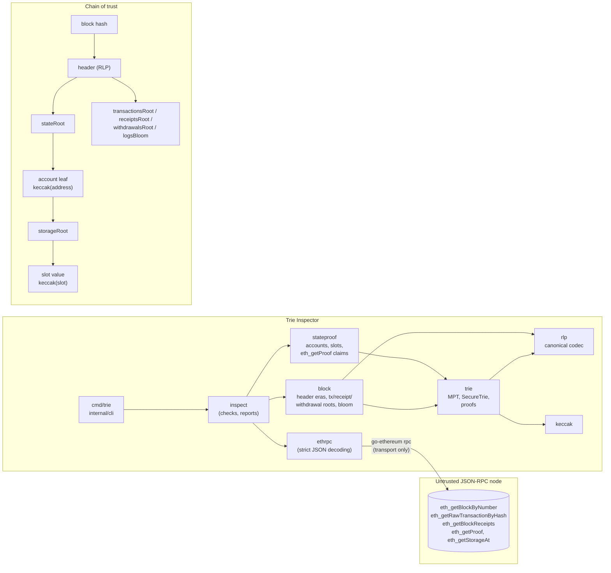

# Trie Inspector: RLP, Merkle-Patricia Tries and State Proofs from Scratch in Go

A from-scratch Go implementation of RLP, the secure Merkle-Patricia Trie and block-header hashing. Against a live anvil chain it recomputes `transactionsRoot`, `receiptsRoot`, block hashes and whole contract storage roots, and verifies every `eth_getProof` account and storage proof.

[](https://github.com/monzon1985/blockchain/actions/workflows/05-mpt-state-proofs-go.yml)
[](../../LICENSE)


## What's interesting here

- **The core is written from scratch, and a test enforces it.** RLP, the trie, header hashing, receipts, blooms and state proofs depend only on the Go standard library and `x/crypto/sha3` (plus its `x/sys/cpu` dependency). `internal/archtest` fails the build if go-ethereum appears in their transitive dependencies. go-ethereum 1.17.6 serves only as the RPC transport and as a **differential oracle in tests**, where every root, encoding and proof is cross-checked against it: random tries, 5,000 random RLP trees, 48,000 mutated encodings, 1,700 random headers across six eras and transactions of all five envelope types.
- **The checks run against a live chain, not just test vectors.** The integration suite runs anvil on **6 hardforks (Berlin to Osaka)**. For every block it recomputes the block hash, `transactionsRoot`, `receiptsRoot`, receipt blooms, `logsBloom`, `gasUsed`, `withdrawalsRoot`, `blobGasUsed`, `requestsHash` and `ommersHash` from raw data. The blocks cover all **5 transaction types**: legacy, EIP-2930, EIP-1559, EIP-4844 blob transactions (sidecar versions 0 and 1) and EIP-7702 set-code, whose delegation shows up in the authority's proven code hash.
- **Whole-storage reconstruction.** A fixture contract writes **200 pseudo-random slots**. The test rebuilds the storage trie from the seed alone, and its root must equal `eth_getProof`'s `storageHash` before and after clearing 50 slots, including historical state. Proofs built locally from that trie are **byte-identical to anvil's** for all 205 slots checked.
- **A lying node does not get a pass.** A proxy injects **14 distinct lies**: altered raw transactions, receipts from another block, dropped logs, a failed transaction reported as successful, altered header fields and hashes, false balances and slot values, corrupted or truncated proofs. The hardest case forges a storage trie *and* a matching `storageHash`. Each lie produces a specific failed check. 17 golden CLI outputs (10 recorded sessions, 6 tampered variants, 1 offline command) replay a recorded anvil session, and the recording reproduces byte for byte.
- **It found real anvil 1.8.3 behaviour.** (1) On pre-Cancun hardforks, anvil's **genesis** header carries `blobGasUsed`/`excessBlobGas`, so it mixes fork eras. On Berlin and London its hash is only reproducible by skipping the absent fields (go-ethereum would encode them as empty strings). (2) The genesis `stateRoot` is the empty root even though the dev accounts are funded, so no genesis account proof verifies. (3) For an empty trie, anvil's proof is `[0x80]` where go-ethereum's is `[]`. All three are pinned by tests and reported, not hidden.

**Numbers** (from `go test -json`, `script/coverage.sh` and `forge test`): 112 Go test functions with 259 subtests, 13 integration tests with 27 subtests, 5 native fuzz targets, 9 Foundry tests, and **99.8 % line coverage** of the production packages (unit and integration suites merged).

## Overview

Bridges, light clients, indexers and cross-chain intent protocols all accept data from RPC nodes they don't control. The only defence is to check that data against a hash you already trust. That means re-deriving every commitment in an Ethereum block header from raw bytes, and verifying Merkle-Patricia proofs against roots inside verified headers.

This sounds mechanical, but it is easy to get subtly wrong:

- **RLP must be decoded canonically.** Ethereum commits to hashes of encodings. A decoder that accepts two encodings of the same value lets an attacker change a hash without changing the data.
- **The trie has three node kinds, a hex-prefix path encoding, and the 32-byte inlining rule.** Deletions must also collapse nodes back into the one canonical shape, or roots depend on history.
- **Header layouts change at every fork.** London added `baseFeePerGas`, Shanghai `withdrawalsRoot`, Cancun three blob and beacon fields, Prague `requestsHash`. Clients disagree on edge cases, as the anvil findings above show.
- **Receipts commit to consensus fields only.** They are typed envelopes, and a status of 0 is the empty string, not `0x00`.
- **Proofs need strict verification.** A proof verifier that is merely permissive accepts padded or non-canonical proofs. One that trusts the node's `storageHash` claim can be fed a forged storage trie.

## Architecture



| Component | Responsibility | Key external calls |
|---|---|---|
| `keccak` | Keccak-256, the `Hash` and `Address` types, well-known roots | `x/crypto/sha3` |
| `rlp` | Canonical encoder/decoder: rejects wrapped single bytes, non-minimal lengths, leading zeros, trailing bytes, nesting > 1024 | none |
| `trie` | MPT with insert/get/delete, inline nodes, collapse on delete, `SecureTrie`, inclusion/exclusion proofs, strict `VerifyProof` with a walk trace | none |
| `block` | Header RLP for every era (Frontier to Amsterdam) with explicit layouts; transaction/receipt/withdrawal roots; logs bloom; blob counting; ommers hash | none |
| `stateproof` | Account and storage-value codecs, `VerifyAccount`, `VerifyStorage`, storage-root rebuild, `CheckGetProof` (claims vs proofs) | none |
| `ethrpc` | Fetches blocks, raw transactions (batched), receipts, proofs, storage; strict hex decoding into this module's types | go-ethereum `rpc` client |
| `inspect` | `VerifyBlock`, `VerifyProof`, `RebuildStorage`: named checks, text and JSON reports | through the `Source` interface |
| `internal/cli`, `cmd/trie` | The `trie` command, exit codes, `slog` logging, context-aware shutdown | |
| `internal/devnet`, `internal/rpcreplay`, `internal/tools` | Test infrastructure: anvil on a free port, scenario builder, record/replay/rewrite proxy, fixture recorder, demo | anvil |
| `fixtures/` | `SlotWriter.sol`: writes and clears pseudo-random slots (Foundry project, 9 tests) | |

## Roles and trust assumptions

There are no on-chain roles. The trust model is in [docs/THREAT_MODEL.md](docs/THREAT_MODEL.md). In short:

- **The node is untrusted.** Every answer is checked against a commitment.
- **The trust anchor is a block hash.** The tool proves consistency *with that hash*. It does not prove the block is canonical or finalized; that needs a consensus-layer light client or a trusted checkpoint. The CLI prints the hash so you can compare it with a source you trust.
- **Keccak-256 collision resistance** is assumed.

## Invariants and properties

Each property is enforced by the tests linked to it.

1. **Canonical RLP.** `decode` accepts an input only if `encode(decode(x)) == x`, and accepts exactly the inputs go-ethereum accepts (up to the documented nesting limit). Tests: [`FuzzRLPRoundTrip`](rlp/fuzz_test.go), [`TestDifferentialDecodeMutations`](rlp/differential_test.go), [`TestEthereumInvalidVectors`](rlp/vectors_test.go).
2. **Order independence.** A trie's root depends only on its final key/value set, not on the order or history of insertions and deletions, and it equals go-ethereum's root. Tests: [`FuzzTrieOrderIndependence`](trie/fuzz_test.go), [`TestEthereumTrieTestsAnyOrder`](trie/vectors_test.go), [`TestRandomOrderIndependence`](trie/trie_test.go).
3. **Canonical shape after deletion.** Deleting keys leaves exactly the trie a fresh build of the remaining keys produces. Test: [`TestDeleteCollapses`](trie/trie_test.go).
4. **Proof soundness.** A proof that verifies gives the true value or true absence. No single-byte mutation, truncation, junk substitution, extra node or duplicate makes a proof verify with a different answer. Tests: [`FuzzVerifyProof`](trie/fuzz_test.go), [`TestProofTamperingIsDetected`](trie/proof_test.go), [`TestNonCanonicalProofsAreRejected`](trie/proof_test.go).
5. **Proof interoperability.** Proofs from this trie and from go-ethereum's trie verify with both verifiers and contain the same node sets. Proofs from anvil verify, and equal locally built ones. Tests: [`TestDifferentialRandomOperations`](trie/differential_test.go), [`TestProofsAreMinimal`](integration/state_test.go).
6. **Header hash fidelity.** For every era and every gap pattern of optional fields, the canonical encoding equals go-ethereum's, and the hash of every anvil block in the matrix is reproduced. Tests: [`TestDifferentialHeaderEveryEra`](block/header_test.go), [`TestDifferentialHeaderGaps`](block/header_test.go), [`TestHardforkMatrix`](integration/blocks_test.go).
7. **Block commitments.** `transactionsRoot`, `receiptsRoot`, `withdrawalsRoot`, `logsBloom`, `gasUsed`, `blobGasUsed` and `ommersHash` recomputed from raw data equal the header's. Tests: [`TestHardforkMatrix`](integration/blocks_test.go), [`TestBlobAndSetCodeTransactions`](integration/txtypes_test.go), the differential tests in [`block`](block/receipt_test.go).
8. **Storage completeness.** The storage trie rebuilt from known slot values equals the proven `storageRoot`, and dropping one live slot breaks equality. Tests: [`TestStorageRootReconstruction`](integration/state_test.go), [`TestCLIEndToEnd`](integration/cli_test.go).
9. **Claims never outrank proofs.** Storage proofs are verified against the storage root inside the *proven* account. Any `eth_getProof` claim that disagrees with the proofs is a failure. Tests: [`TestCheckGetProofInvalidProofs`](stateproof/stateproof_test.go), [`TestLyingNodeIsCaught`](integration/tamper_test.go).
10. **Decoders never panic.** Arbitrary bytes into the JSON-RPC decoders return an error, never a crash. Test: [`FuzzDecodeRPC`](ethrpc/fuzz_test.go).

## Security considerations

The threat model, mitigations and limitations are in [docs/THREAT_MODEL.md](docs/THREAT_MODEL.md). The main limitations:

- **No finality proof.** Verification is relative to a block hash.
- **Not fetched:** EIP-7685 requests (only the empty commitment `sha256("")` is recognized; other values produce a warning), pre-Merge ommers (warning), and blob contents (only the blob count is checked against `blobGasUsed`).
- **`storage-root` verifies `eth_getStorageAt` values collectively**, through the rebuilt root, not one by one.
- **Warnings pass by default.** `--strict` makes layout anomalies and unknown header fields fail.

## Anvil findings

These came out of the integration suite. They are pinned by tests, so a change in anvil's behaviour fails CI instead of being silently absorbed.

| Finding | Evidence | How the tool reports it |
|---|---|---|
| On Berlin, London and Shanghai, the **genesis** header includes `blobGasUsed` and `excessBlobGas` (mined blocks do not) | `TestAnvilGenesisHeaders` pins the five genesis headers and hashes; `TestHardforkMatrix` | `header fields: warn` (mixed eras). On Berlin/London: `block hash: warn`, matching only with the *present-only* layout (absent fields skipped, as alloy encodes); go-ethereum's canonical layout writes `0x80` for the gaps. On Shanghai the canonical hash matches. |
| The genesis `stateRoot` is the empty-trie root, yet the dev accounts are funded at genesis | `TestAnvilGenesisStateRoot` | `verify-proof --block 0` fails (`proofs: INVALID`). Mined blocks verify. |
| The proof of a key in an **empty** trie is `["0x80"]` (the empty node itself); go-ethereum returns `[]` | `TestEmptyTrie`, `TestAccountProofs` | Both are accepted; anything else is rejected. |

## Design decisions and trade-offs

- **Strict over lenient verification.** `VerifyProof` rejects proofs with unused or duplicate nodes, hashed nodes under 32 bytes, inlined nodes of 32 bytes or more, extensions without a branch child, and branches with fewer than two entries. Every decoded node must also re-encode to its input. go-ethereum's verifier is more permissive. Strictness costs nothing with honest nodes (go-ethereum's and anvil's proofs pass) and removes room for malleability.
- **Header layouts are explicit.** `Header.Encode` follows go-ethereum's canonical rule. `EncodeLayout(PresentOnly)` exists only to *explain* the anvil genesis anomaly: the tool never treats a present-only match as a pass.
- **Immutable trie nodes with memoized encodings.** Insert and delete build new nodes along the path and share the rest, so cached encodings and hashes stay valid without invalidation logic. The cost is allocation per update, which is irrelevant at the sizes a verifier handles. The trie is in-memory only; there is no database layer.
- **The verification core is free of go-ethereum; transport and test oracles are not.** Reusing go-ethereum's JSON-RPC client avoids reimplementing batching and HTTP/WebSocket handling, which is not the point of the project. Using go-ethereum as a *test-only* oracle gives an independent reference for every encoding.
- **`--block` defaults to `latest`, then pins the number.** Every later call targets the block number of the first answer, and receipts must carry its hash, so a reorg between calls shows up as a failure instead of a mixed answer.
- **The fixture targets the London EVM, not Osaka.** The same bytecode runs on every hardfork in the matrix: London is the oldest target solc 0.8.37 supports without a deprecation warning, and the fixture uses no London-only opcode, so it also runs on Berlin. This is a documented exception to the repository's `osaka` default ([fixtures/foundry.toml](fixtures/foundry.toml)).
- **Golden tests use recorded sessions, not a live node.** They run offline and deterministically. A fixed genesis timestamp, fixed block timestamps and FIFO ordering make the recording reproducible, and `TestRecordedFixturesAreReproducible` re-records it and requires byte equality.

## Testing

```bash
cd fixtures && forge build && cd ..                                   # the fixture the integration tests deploy
CGO_ENABLED=0 go vet ./...
CGO_ENABLED=0 go test -count=1 ./...                                  # unit, vectors, differential, property, golden
CGO_ENABLED=0 go test -count=1 -tags integration ./integration/...    # anvil, Berlin to Osaka
CGO_ENABLED=0 go test ./rlp  -run '^$' -fuzz=FuzzRLPRoundTrip          -fuzztime=30s
CGO_ENABLED=0 go test ./trie -run '^$' -fuzz=FuzzTrieOrderIndependence -fuzztime=30s
COVERAGE_MIN=90 bash script/coverage.sh                                # merged coverage of the production packages
```

| Suite | Where | Count | What it covers |
|---|---|---|---|
| Spec vectors | `rlp/`, `trie/` | 28 valid + 26 invalid RLP vectors; 25 trie vectors (5 files), each also proven key by key, the any-order ones in every permutation | ethereum/tests `RLPTests` and `TrieTests`, vendored (MIT) |
| Unit and table tests | every package | 112 test functions, 259 subtests in total (including vectors, golden and fuzz seed corpora) | Boundaries, every error path, non-canonical encodings |
| Differential (go-ethereum 1.17.6 as oracle) | `rlp/`, `trie/`, `block/`, `stateproof/` | 5,000 RLP trees; 48,000 mutated encodings; 200 random trie histories with every proof cross-verified; 1,700 headers; 100 transaction and 100 receipt lists; 500 accounts; 30 storage tries | Encodings, roots, proofs and hashes equal the reference |
| Native fuzzing | `rlp/`, `trie/`, `ethrpc/` | 5 targets | Round trip and acceptance parity (RLP), order independence vs go-ethereum, proof soundness under mutation, hex-prefix bijection, JSON decoder robustness |
| CLI golden tests | `internal/cli/` | 10 recorded cases + 6 tampered + 1 offline | Exact text and JSON output, exit codes, usage errors |
| Integration (anvil) | `integration/` | 13 tests, 27 subtests, about 25 s | Hardfork matrix, 5 transaction types, storage reconstruction, account proofs, 14 lies, CLI binary end to end, fixture reproducibility |
| Fixture contract | `fixtures/test/` | 9 Foundry tests (incl. 1 fuzz, 1,000 runs and a fixed seed in the CI profile) | The formulas the Go tests mirror, every revert path |

**Coverage:** 99.8 % of statements in the production packages (`keccak`, `rlp`, `trie`, `block`, `stateproof`, `ethrpc`, `inspect`, `internal/cli`), with the unit and integration suites merged by `script/coverage.sh`. The uncovered lines are defensive guards that the code's own invariants make unreachable: re-encoding a node the strict decoder accepted, an inline-node nesting limit that the 32-byte rule cannot reach, and a branch collapsing with no entries left. Test infrastructure and the three-line `main` are excluded from the denominator. CI enforces at least 90 %.

**Fuzzing:** locally, the two spec targets ran for 30 s each (752,473 and 176,655 executions in the final run on this machine). CI runs them for 60 s each and the other three for 30 s. Go's fuzzer cannot fix a seed. The deterministic counterparts are the seed corpora and the seeded property tests (`math/rand/v2` PCG with fixed seeds), which run on every `go test`.

**Race detector:** CI only (`go test -race` needs cgo; local builds are `CGO_ENABLED=0`).

## Getting started

Prerequisites: Go 1.27, Foundry 1.8.3 (`forge`, `anvil`). Nothing else: no RPC endpoint, no API keys.

```bash
cd projects/05-mpt-state-proofs-go
(cd fixtures && forge build)
go build -o bin/trie ./cmd/trie          # CGO_ENABLED=0 works

# One-command demo: anvil on a free port, a 200-slot contract, three verifications.
go run ./internal/tools/demo
```

Against any node (pass `--rpc`, or set `ETH_RPC_URL`):

```text
trie verify-block  [--rpc URL] [--json] [--strict] <block>
trie verify-proof  [--rpc URL] --address A [--slot S]... [--block B] [--json] [--strict]
trie storage-root  [--rpc URL] --address A --slots-file F [--block B] [--json]
trie rlp <hex>

exit status: 0 verified, 1 verification failed, 2 usage or connection error
```

Output of `trie verify-proof` on the recorded chain ([golden file](internal/cli/testdata/golden/verify-proof-contract.golden)):

```text
account 0x5fbdb2315678afecb367f032d93f642f64180aa3 at block 3 0xc4f194a810194135ef41afa75763204d0d6ba5628a1f4afff8734672e548ef3f
  nonce 1, balance 0 wei
  storageRoot 0xa02e643801b37450d7a22bba538437b07e42ad15a198c82b5af50eac6cd465a3
  codeHash    0xf8955a5a035ad6f94ab90d7a4c45a13e2ce312dae3fb20fffa1a710a64a037cd
  [ok]   header fields             exactly the fields of a prague header
  [ok]   block hash                keccak256(rlp(header))
  [ok]   account proof             account exists under stateRoot 0x7f102a30..43ce (branch > branch > leaf)
  [ok]   storage 0xa3f0af13..f791  = 0x20b16543 (branch > branch > leaf)
  [ok]   storage 0xada50131..9e7d  absent (zero): exclusion proof (branch > branch)
  [ok]   storage 0x00000000..0000  absent (zero): exclusion proof (branch > branch > leaf)
  [ok]   claims                    nonce, balance, codeHash, storageHash and slot values match the proofs
verdict: VERIFIED (7 checks)
```

The same call through a node that lies about one slot value ([golden](internal/cli/testdata/golden/tampered-slot-value.golden)) ends with `[fail] claims  MISMATCH: slot 0xa3f0…: claimed 0x1234, proven 0x20b16543` and exit status 1.

The chain is Osaka, but the header is reported as a Prague header because Osaka added no header fields.

To re-record the golden sessions after an intentional change: `go run ./internal/tools/recordfixtures`, then `go test ./internal/cli -run Golden -update`, then review the diff.

## Project structure

```text
05-mpt-state-proofs-go/
├── keccak/        Keccak-256, Hash, Address
├── rlp/           canonical RLP codec (+ ethereum/tests RLPTests vectors)
├── trie/          Merkle-Patricia trie, SecureTrie, proofs (+ ethereum/tests TrieTests vectors)
├── block/         headers across eras, tx/receipt/withdrawal roots, bloom, blobs, ommers
├── stateproof/    accounts, storage values, eth_getProof verification, storage-root rebuild
├── ethrpc/        JSON-RPC fetching and strict decoding
├── inspect/       VerifyBlock, VerifyProof, RebuildStorage, reports
├── cmd/trie/      the CLI binary
├── internal/
│   ├── cli/       command implementation + golden tests and recorded sessions
│   ├── devnet/    anvil launcher (free port, kill by PID) and the test scenario
│   ├── rpcreplay/ JSON-RPC record / replay / rewrite proxy
│   ├── tools/     recordfixtures (golden sessions), demo
│   └── archtest/  layering rule: no go-ethereum in the core
├── integration/   anvil tests (build tag integration)
├── fixtures/      SlotWriter.sol (Foundry project) and its tests
├── script/        coverage.sh
└── docs/          THREAT_MODEL.md
```

## Scope notes and future work

- **Implemented as specified**, including every feature in the brief. The CLI also has `storage-root` and `rlp`, beyond the two required commands.
- **Not implemented:** fetching ommer headers and EIP-7685 requests, blob/KZG verification, consensus-layer finality (a sync-committee light client would supply the trusted block hash), and range proofs (`eth_getProof` has no range form).
- **Possible extensions:** a persistent node store to inspect real state tries, `debug_storageRangeAt`-based discovery of a contract's slots (so `storage-root` needs no slot list), and an on-chain verifier for these proofs (project #23 in this repository verifies state proofs on-chain).

## References

- Ethereum Yellow Paper (Gavin Wood): Appendix B (RLP), Appendix C (hex-prefix encoding), Appendix D (Modified Merkle-Patricia Trie), section 4.3 (block header).
- [ethereum.org: Merkle Patricia Trie](https://ethereum.org/en/developers/docs/data-structures-and-encoding/patricia-merkle-trie/) and [RLP](https://ethereum.org/en/developers/docs/data-structures-and-encoding/rlp/).
- EIPs: [1186](https://eips.ethereum.org/EIPS/eip-1186) (`eth_getProof`), [2718](https://eips.ethereum.org/EIPS/eip-2718) (typed envelopes), [2930](https://eips.ethereum.org/EIPS/eip-2930), [1559](https://eips.ethereum.org/EIPS/eip-1559), [658](https://eips.ethereum.org/EIPS/eip-658) (receipt status), [4895](https://eips.ethereum.org/EIPS/eip-4895) (withdrawals), [4844](https://eips.ethereum.org/EIPS/eip-4844) (blobs), [4788](https://eips.ethereum.org/EIPS/eip-4788) (beacon root), [7685](https://eips.ethereum.org/EIPS/eip-7685) (requests), [7702](https://eips.ethereum.org/EIPS/eip-7702) (set code), [7594](https://eips.ethereum.org/EIPS/eip-7594) (PeerDAS cell proofs), [7928](https://eips.ethereum.org/EIPS/eip-7928) and [7843](https://eips.ethereum.org/EIPS/eip-7843) (Amsterdam header fields).
- [ethereum/tests](https://github.com/ethereum/tests): `RLPTests` and `TrieTests` vectors, vendored under MIT (see `rlp/testdata` and `trie/testdata`).
- [go-ethereum](https://github.com/ethereum/go-ethereum) 1.17.6: the differential oracle (`rlp`, `trie`, `core/types`) and the JSON-RPC client. Its `trie` package and `rlp` decoder are the reference implementations this project checks itself against.
- [Foundry](https://github.com/foundry-rs/foundry) (anvil) and [alloy](https://github.com/alloy-rs/alloy), whose header encoding explains the present-only layout seen in anvil's genesis blocks.
