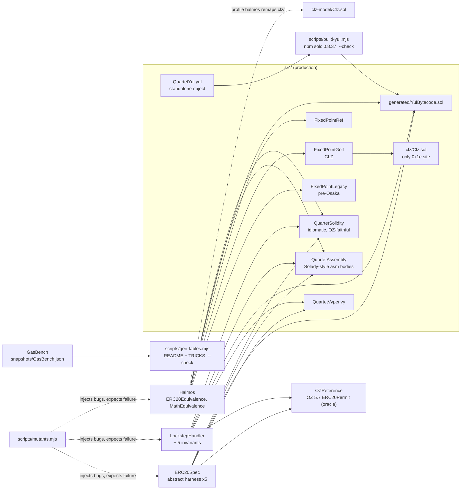

# Gas Golf Quartet: Solidity vs Inline Assembly vs Pure Yul vs Vyper, Proven Equivalent

The same fixed-supply ERC-20 with EIP-2612 `permit`, written four ways (idiomatic Solidity, Solady-style
inline assembly, a standalone Yul object, Vyper 0.4) plus a fixed-point kernel that uses Fusaka's `CLZ`
opcode. Every byte saved comes with evidence: lockstep differential fuzzing against OpenZeppelin, Halmos
equivalence proofs, and a mutation smoke test showing that evidence catches real golfing bugs.

[](https://github.com/monzon1985/blockchain/actions/workflows/06-gas-golf-quartet.yml)
[](../../LICENSE)
-363636)


## What's interesting here

<!-- gen:headline:begin -->
- **Pure Yul vs idiomatic Solidity:** deployment 818,271 → 381,535 gas (−53%), deployed code 3,417 → 1,394 bytes (−59%), and every one of the 6 measured state-changing calls cheaper, from 462 gas off `approve` to 1,276 off `permit`.
- **Fusaka's CLZ opcode (EIP-7939) in a fixed-point kernel:** `log2` costs 29 gas against 156 for the cheapest pre-Osaka code we measured (Legacy and Solady; OpenZeppelin 5.7: 202); a CLZ-seeded `sqrt` costs 205 gas against 312 (Solady, the cheapest pre-Osaka) and 741 (OpenZeppelin).
<!-- gen:headline:end -->
- **Proven, not just tested.** Halmos proves `transfer`, `approve`, `transferFrom` and the view functions
  equivalent across Solidity, assembly and Yul for **every non-zero caller, every ABI-encoded argument and
  symbolic balances and allowances** (unconstrained words written into each implementation's own storage
  layout), and that all three reject **every dirty address word** and `uint8 v` the same way. The golfed
  `mulDiv` and `mulDivUp` equal the reference for **all inputs**; `log2`, `log2Up` and `clz` do too,
  **through a plain-EVM model of CLZ** (halmos 0.3.3 lacks opcode `0x1e`), itself tested against the
  real opcode on every bit length.
- **Lockstep differential fuzzing with an OpenZeppelin oracle.** Every fuzzed call (valid, malformed ABI,
  ten permit modes of which eight are attacks, chain forks, time jumps) hits all five contracts; return
  data, revert class, logs and full state must agree after every call. 8,192 calls per local run, 16,384
  per CI run.
- **The evidence is itself tested.** `scripts/mutants.mjs` injects realistic golfing bugs (an off-by-one
  overflow guard, a dropped Newton step, swapped event topics, a storage-seed collision, a second address
  word left unvalidated, ...) and counts one as caught only when a proof produces a counterexample or a
  test fails on an assertion; CI fails if any is not caught. Production Solidity, every inline-assembly
  block included, has 100% line and branch coverage.

## Overview

Gas golfing is where subtle bugs are born: a check moved "off the hot path", a slot formula shared by two
mappings, a revert that silently becomes a success. Protocol teams that ship Solady-grade assembly pair
every optimization with an equivalence argument. This project makes that argument mechanical:

1. **One specification, four implementations.** The specification is OpenZeppelin 5.7 `ERC20Permit`,
   exactly: check order, ERC-6093 error precedence (`InvalidApprover` vs `InvalidSender` for the zero
   address depends on whether the allowance is infinite), the never-decreased infinite allowance, no
   `Approval` on `transferFrom`, EIP-2 high-`s` rejection, and domain-separator recomputation on forks and
   under `DELEGATECALL`.
2. **Revert data may differ, behaviour may not.** The Solidity version emits ERC-6093 errors with values,
   the golfed versions 4-byte selectors, Vyper `Error(string)`; `RevertClassifier` maps each encoding
   family to one revert class and rejects anything outside the implementation's own family.
3. **A kernel on the newest opcode.** `CLZ` (EIP-7939) went live with the Fusaka upgrade (Osaka EL).
   OpenZeppelin 5.7 and Solady 0.1.26 still emulate it. `FixedPointGolf` uses it for `log2`, `log2Up`,
   `clz` and a `sqrt` seed; `FixedPointLegacy` is the pre-Osaka fallback, benchmarked side by side.

## Architecture



| Component | Responsibility | Key external calls |
|---|---|---|
| `src/solidity/QuartetSolidity.sol` | Readable baseline; OpenZeppelin semantics without inheritance, so it has exactly the shared surface | OZ `ECDSA.recover`, `MessageHashUtils` |
| `src/assembly/QuartetAssembly.sol` | Function bodies in inline assembly; Solidity keeps the dispatcher and ABI decoder | `ecrecover` precompile (`STATICCALL 0x01`) |
| `src/yul/QuartetYul.yul` | Everything by hand: dispatcher, ABI validation, identity-keyed storage, immutables | `ecrecover` precompile |
| `src/generated/YulBytecode.sol` | Creation and runtime bytecode of the Yul object, generated and drift-checked | none |
| `src/vyper/QuartetVyper.vy` | Idiomatic Vyper 0.4.3 with snekmate-style assertions | `ecrecover` builtin |
| `src/math/FixedPointRef.sol` | Reference kernel: 512-bit `mulDiv`, Babylonian `sqrt`, binary-search `log2` | none |
| `src/math/FixedPointGolf.sol` | Golfed kernel: assembly `mulDiv`, CLZ-based `log2`/`log2Up`/`clz`/`sqrt` | `Clz.clz` (the proof seam) |
| `src/math/FixedPointLegacy.sol` | Same CLZ-dependent functions without opcode `0x1e` | none |
| `test/reference/OZReference.sol` | Unmodified OpenZeppelin 5.7 `ERC20Permit`, the differential oracle | none |

## Roles and trust assumptions

There are no privileged roles: no owner, minter, pauser or upgrade path. The whole supply is minted in the
constructor, so a compromised deployer key can do nothing afterwards. Trust assumptions (EVM and compiler
correctness, keccak collision resistance, no state-changing transaction with `msg.sender == address(0)`)
are listed in [docs/THREAT_MODEL.md](docs/THREAT_MODEL.md).

## Invariants and properties

Stateful, differential (all five implementations, after every call of every fuzzed sequence):

1. Every call agrees: same success flag, same return data (each token's `DOMAIN_SEPARATOR` must instead
   equal the EIP-712 formula for its own address), same revert class, same logs from the token itself;
   Solidity and OpenZeppelin agree byte for byte, revert arguments included, whenever the calldata is
   identical and not a `permit`. Enforced in `LockstepHandler._lockstep`.
2. Balances (actors and the zero address), allowances (every ordered pair), nonces and total supply are
   identical across implementations: `invariant_StateIsIdenticalAcrossImplementations`.
3. In every implementation balances sum to the fixed total supply and the zero address holds nothing:
   `invariant_BalancesSumToTotalSupply`.
4. A nonce equals the number of successful permits of its owner: `invariant_NoncesCountSuccessfulPermits`.
5. Every domain separator equals the EIP-712 formula for the current chain id, including after a fork:
   `invariant_DomainSeparatorFollowsChainId`.
6. The oracle never produces a `Panic` or an unclassifiable revert: `invariant_OracleNeverPanics`.

Symbolic (Halmos, [ERC20Equivalence.t.sol](test/halmos/ERC20Equivalence.t.sol) and
[MathEquivalence.t.sol](test/halmos/MathEquivalence.t.sol)). The ERC-20 proofs take every non-zero caller,
every ABI-encoded argument and unconstrained prior balances and allowances; for each call Solidity,
assembly and Yul must return the same data or revert class, and then agree on exactly this post-state:

7. `check_transfer`: the balances of the caller, the recipient and an arbitrary third address, the
   allowances between caller and recipient (both directions) and both nonces. `check_approve`: the
   allowance written, an allowance at an arbitrary (owner, spender) pair, and the balances and nonces of
   caller and spender. `check_transferFrom` (infinite and zero-owner allowances included): the allowance
   spent, the balances of owner, recipient and an arbitrary third address, and the nonces of owner and
   recipient. `check_views`: every getter except the address-dependent `DOMAIN_SEPARATOR`, over symbolic balance,
   allowance and nonce. Not covered: a zero
   caller, where the golfed versions really do differ from OpenZeppelin by design (trick T15).
8. `check_dirtyWordsAreRejected`: an address word with any bit above bit 159, in each of the ten address
   positions of the surface, or a `uint8 v` word above 255, makes all three revert with empty data.
9. `check_mulDiv`, `check_mulDivUp`: golfed == reference, value or revert data, over all 2\*\*768 inputs.
10. `check_log2`, `check_log2Up`, `check_clz`: golfed == legacy == reference over all 2\*\*256 inputs, with
    the golfed kernel's CLZ replaced by the plain-EVM model of
    [test/halmos/clz-model/Clz.sol](test/halmos/clz-model/Clz.sol); the model equals the real opcode on
    every bit length and under fuzzing ([ClzOpcode.t.sol](test/math/ClzOpcode.t.sol)).

Specification (per implementation, [ERC20Spec.sol](test/spec/ERC20Spec.sol)): every success path and every
revert path of the shared surface, ABI strictness (short calldata, every address word and the `uint8` word
dirtied one at a time, unknown selectors and every 1-3 byte selector prefix, ETH sent to non-payable
functions), and the storage slot formulas the proofs rely on
([StorageLayout.t.sol](test/spec/StorageLayout.t.sol)).

## Security considerations

The full threat model, with the OWASP Smart Contract Top 10 (2026) mapping, is in
[docs/THREAT_MODEL.md](docs/THREAT_MODEL.md). The points specific to golfing:

- **Storage aliasing in the Yul layout.** Balances live at slot `owner`, nonces at `owner + 2**160`. An
  allowance slot (`keccak256(owner ‖ spender)`) lands on a balance or nonce slot only if the hash is below
  2\*\*161 (probability 2\*\*-95 per pair). Hitting some unowned account's slot takes about 2\*\*95 hashes,
  an account the attacker controls about 2\*\*128 (meet in the middle over attacker keys and hashes), and a
  chosen victim's balance about 2\*\*256 (the whole 256-bit word is fixed).
- **ABI validation by hand.** The Yul object re-implements Solidity's decoder checks, validating two
  address words with one shift. The specification dirties every address word one at a time, the lockstep
  `malformed`/`raw` actions compare it to four compiler-generated decoders, and a halmos proof covers every
  dirty word in every address position.
- **Selector-only errors** in the golfed versions drop ERC-6093 arguments. Integrators that decode them
  should use the Solidity version.
- **Zero `msg.sender`.** OpenZeppelin (and so the Solidity version) rejects `transfer`, `approve` and
  `transferFrom` from `address(0)`; the golfed versions skip that check (trick T15). No signed transaction
  has that sender, but an `eth_call` simulation without `from` does, and there they succeed where
  OpenZeppelin reverts.
- **CLZ availability.** `FixedPointGolf` requires Osaka; on an older chain opcode `0x1e` is invalid. There,
  use `FixedPointLegacy` for `log2`, `log2Up` and `clz` (it matches Solady 0.1.26, the cheapest pre-Osaka
  code we measured); for `sqrt`, Solady's `FixedPointMathLib.sqrt` is cheaper than `FixedPointLegacy.sqrt`
  (kernel table below). None of the tokens contains the opcode.
- **Signatures are EOA-only.** `permit` recovers an ECDSA signer; contract wallets (ERC-1271) cannot sign
  permits. See Design decisions.

Nothing in this repository has been professionally audited, and nothing is deployed with real funds.

## Design decisions and trade-offs

- **OpenZeppelin as the specification.** "Equivalent" needs a referent. Using OpenZeppelin 5.7's exact
  semantics (not a looser "ERC-20") forces the golfed code to reproduce corner cases such as the
  `InvalidApprover`/`InvalidSender` precedence for `transferFrom(address(0), ...)`, and lets an unmodified
  OpenZeppelin contract act as the fuzzing oracle.
- **Fixed supply.** No mint or burn keeps the surface small enough to prove; `totalSupply` is an immutable
  in all four versions, so it is not a golfing difference.
- **`permit` without ERC-1271 (a stated deviation from the repository standards).** The engineering
  standards ask for contract-wallet signatures through ERC-1271 (`SignatureChecker`). EIP-2612 as specified,
  and OpenZeppelin 5.7's `ERC20Permit` that is this project's specification and oracle, verify ECDSA
  signatures of EOAs only. Adding ERC-1271 would turn `permit` into an external call into arbitrary code in
  four languages and break equivalence with the oracle, so contract-wallet permits are out of scope for the
  quartet. Contract wallets use `approve`.
- **Three layouts on purpose.** Solidity mappings (64-byte keccak), Solady seeds (32/52-byte keccak) and Yul
  identity slots (no keccak for balances) show the whole spectrum, with a measured saving per step
  ([docs/TRICKS.md](docs/TRICKS.md)).
- **A proof seam costs gas, and that is shown.** Halmos 0.3.3 cannot execute `CLZ`, so the opcode sits
  behind a one-function library that the halmos profile remaps to a plain-EVM model. The legacy optimizer
  does not inline the two resulting call levels; row T13 of the tricks table measures what that costs.
- **Legacy pipeline (`via_ir = false`), optimizer runs 1,000,000.** Runtime gas is paid forever. We tried
  the IR pipeline for the kernel probes: it moved the measured code out of the `gasleft()` window (every
  measurement collapsed to 2 gas), so the in-contract measurements would be meaningless under it.
- **Transaction gas for ERC-20 numbers.** `isolate = true` runs each call as its own transaction with cold
  storage, so the tables show what users pay; the 21,000 base and calldata cost are identical across
  implementations.
- **Deterministic bytecode.** `bytecode_hash = "none"` and `cbor_metadata = false` make every artifact
  byte-identical on Windows and Linux, which is what lets CI check the gas snapshot and the size tables.

## Testing

```bash
forge test                                   # every Foundry suite
forge test --match-contract LockstepInvariant # the differential campaign only
FOUNDRY_PROFILE=ci forge test                # CI settings: fixed seed, 5,000 fuzz runs, 256 x 64 invariants
FOUNDRY_PROFILE=halmos halmos --match-contract Equivalence
FOUNDRY_PROFILE=coverage forge coverage --report summary \
  --no-match-contract "LockstepInvariant|YulBytecodeTest" --no-match-coverage "(test|script|dependencies)/"
FOUNDRY_PROFILE=slither slither . --config-file slither.config.json
node scripts/mutants.mjs                     # mutation smoke test; rewrites the results table below
```

An unfiltered `forge test` (no `--match-*` flag) prints one non-fatal parser message,
`error: expected identifier, found <string>`, pointing at `src/yul/QuartetYul.yul`: when it analyses the
whole project, forge 1.8.3's Solidity parser also reads the Yul object, which is not Solidity. It changes
nothing: solc compiles that file as Yul (`YulBytecodeTest` compares the result with the committed
bytecode), every test runs, and the exit code is 0. CI logs show the same line.

The suite table is generated by `node scripts/gen-tables.mjs` from `forge test --list --json`, the
`check_` functions in `test/halmos` and the mutant list, and CI fails if it is stale:

<!-- gen:counts:begin -->
| Suite | File | Tests | What it checks |
|---|---|---:|---|
| Specification x5 | `test/spec/ERC20Spec.t.sol` | 5 x 56 = 280 | Every path of the shared surface on OZ, Solidity, assembly, Yul, Vyper (5 fuzz tests each) |
| Storage layout | `test/spec/StorageLayout.t.sol` | 2 | Slot formulas locate real state; an allowance write touches no balance or nonce |
| Yul bytecode | `test/spec/YulBytecode.t.sol` | 2 | Committed bytecode == forge's native solc build; deployed == emitted outside immutables |
| Lockstep invariants | `test/differential/LockstepInvariant.t.sol` | 1 (5 invariants) | 128 x 64 calls locally, 256 x 64 in CI, state checked after every call |
| Lockstep script | `test/differential/LockstepScripted.t.sol` | 2 | The differential harness reaches every revert class and dirties every strictly typed argument word |
| Math kernel | `test/math/MathKernel.t.sol` | 12 | Fuzz vs reference, OZ, Solady, 512-bit oracle; exhaustive `sqrt` below 2\*\*16; every bit length |
| CLZ opcode | `test/math/ClzOpcode.t.sol` | 4 | Real opcode == halmos model == 4 emulations on every bit length; opcode scan of bytecode |
| Gas bench | `test/gas/GasBench.t.sol` | 10 | Deterministic numbers behind every table |
| **Foundry total** | | **313** | `forge test` |
| Halmos | `test/halmos/*.t.sol` | 10 proofs | Properties 7-10 above |
| Mutants | `scripts/mutants.mjs` | 14 mutants | Each must be caught (results below) |
<!-- gen:counts:end -->

Fuzz and invariant settings: 1,000 fuzz runs and 128 x 64 invariant calls locally (random seed); in CI,
for both the test and the coverage job, the fixed seed `0x6a5e0f60` (5,000 fuzz runs and 256 x 64
invariant calls in the test job). Coverage of production Solidity (`src/`, inline assembly included),
hand-copied from the coverage command above with that seed (CI enforces at least 90% of lines):
**100% lines (367/367), 100% statements (376/376), 100% branches (68/68), 100% functions (43/43)**.
The same 100% holds with every fuzz test excluded (`--no-match-test testFuzz`): each branch is reached by a
fixed test, not by a lucky fuzz input (`mulDivUp`'s rounding overflow and the reference `mulDiv`'s borrow
each have a vector in `test_MulDiv_KnownVectors`). The Yul object and the Vyper contract are outside what
`forge coverage` can instrument; they run through the same specification and the lockstep campaign.

Halmos results, hand-copied from one local run on 2026-10-01 (`FOUNDRY_PROFILE=halmos halmos
--match-contract Equivalence` through `scripts/halmos_nogc.py`, `solver-threads = 4`, yices, on a machine
shared with other builds, so the times depend on the load). CI re-runs every proof; it does not
compare paths or times with this table. Path counts also vary slightly between runs on this machine. Two
more clean runs the same day passed all ten proofs again: one gave 61 paths for `check_transferFrom` and
598 for `check_clz`; the other 59, 595, 609 for `check_log2` and 1,479 for `check_log2Up` (219 s, the
whole run 7 minutes).

| Proof | Paths | Time |
|---|---:|---:|
| `check_transfer` | 24 | 19 s |
| `check_approve` | 16 | 3 s |
| `check_transferFrom` | 58 | 37 s |
| `check_views` | 3 | 1 s |
| `check_dirtyWordsAreRejected` | 2 | 1 s |
| `check_mulDiv` | 30 | 3 s |
| `check_mulDivUp` | 66 | 5 s |
| `check_log2` | 586 | 52 s |
| `check_log2Up` | 1,418 | 116 s |
| `check_clz` | 548 | 40 s |

The path counts come from the reference: its binary-search `log2` branches eight times, so every proof
that calls it enumerates each bit length; the golfed kernels are branchless.

Mutation smoke test: each mutant must make its check fail for the right reason (a valid counterexample,
or a failing test that is neither a setup failure, a harness panic nor a compile error). The table is
written by `node scripts/mutants.mjs`, and the CI job (`--check`) fails if a mutant is not caught or the
table is stale:

<!-- gen:mutants:begin -->
| Mutant | Injected bug | Checked by | Result |
|---|---|---|---|
| M1 | `mulDiv` overflow guard off by one (accepts `d ==` high word) | halmos `check_mulDiv` | caught (counterexample) |
| M2 | `log2` without the `x \| 1` zero guard | halmos `check_log2` | caught (counterexample) |
| M3 | `mulDiv` with five Newton steps instead of six | forge `MathKernelTest.testFuzz_MulDiv` | caught (failing test) |
| M4 | `sqrt` with five Newton steps instead of six | forge `MathKernelTest.test_Sqrt_EveryBitLengthAndSquareBoundary` | caught (failing test) |
| M5 | assembly `transfer` without the zero-receiver check | halmos `check_transfer` | caught (counterexample) |
| M6 | assembly `permit` accepts the malleable high-`s` twin | forge `ERC20SpecAssemblyTest.test_Permit_RevertWhen_SignatureIsMalleableHighS` | caught (failing test) |
| M7 | Yul `approve` logs `Approval(spender, owner)` | forge `LockstepInvariantTest` | caught (failing test) |
| M8 | Yul `transferFrom` also decreases the infinite allowance | halmos `check_transferFrom` | caught (counterexample) |
| M9 | Vyper `transferFrom` checks the approver before the allowance | forge `LockstepInvariantTest` | caught (failing test) |
| M10 | assembly nonce slots share the balance seed (storage collision) | forge `LockstepInvariantTest` | caught (failing test) |
| M11 | Yul `transferFrom` validates `from` only (a dirty `to` becomes a storage slot) | forge `ERC20SpecYulTest.test_RevertWhen_AnyAddressWordHasDirtyUpperBits` | caught (failing test) |
| M12 | Yul `allowance` validates `owner` only | halmos `check_dirtyWordsAreRejected` | caught (counterexample) |
| M13 | Yul `permit` validates `owner` only, not `spender` | forge `LockstepScriptedTest.test_LockstepRejectsEachDirtyStrictWord` | caught (failing test) |
| M14 | assembly `permit` drops `signer != 0` (zero owner + unrecoverable signature passes) | forge `ERC20SpecAssemblyTest.test_Permit_RevertWhen_OwnerIsZero` | caught (failing test) |
<!-- gen:mutants:end -->

The full run took 10 to 12 minutes locally in two runs on 2026-10-01 (hand-noted; about half of it is
halmos finding the `mulDiv` counterexample for M1). `node scripts/mutants.mjs --dry-run` checks in seconds that every mutant still
applies to the current sources.

## Gas

Generated by `node scripts/gen-tables.mjs` from `snapshots/GasBench.json` and `forge inspect`; CI fails if
this section is stale. Bold marks the cheapest golfed implementation. OpenZeppelin is shown for context
only: it also carries ERC-5267 `eip712Domain()` and storage-backed metadata.

### ERC-20 operations

<!-- gen:erc20:begin -->
Transaction gas (21,000 base and calldata included; calldata is identical across implementations).

| Operation | Solidity | Inline assembly | Pure Yul | Vyper 0.4.3 | OZ 5.7 (reference) | Best golfed vs Solidity |
|---|---:|---:|---:|---:|---:|---:|
| `transfer` (new holder) | 51,330 | 51,031 | **50,720** | 51,122 | 51,471 | Pure Yul: −610 (−1.2%) |
| `transfer` (existing holder) | 34,218 | 33,919 | **33,608** | 34,010 | 34,359 | Pure Yul: −610 (−1.8%) |
| `approve` (new allowance) | 46,270 | 45,962 | **45,808** | 45,847 | 46,317 | Pure Yul: −462 (−1.0%) |
| `transferFrom` (finite allowance) | 40,204 | 39,540 | **39,218** | 39,805 | 40,319 | Pure Yul: −986 (−2.5%) |
| `transferFrom` (infinite allowance) | 37,003 | 36,602 | **36,267** | 36,703 | 37,118 | Pure Yul: −736 (−2.0%) |
| `permit` (first permit) | 74,518 | 73,683 | **73,242** | 73,777 | 74,636 | Pure Yul: −1,276 (−1.7%) |

View functions, gas of the call frame as seen by a calling contract (cold storage).

| Operation | Solidity | Inline assembly | Pure Yul | Vyper 0.4.3 | OZ 5.7 (reference) | Best golfed vs Solidity |
|---|---:|---:|---:|---:|---:|---:|
| `balanceOf` | 2,530 | 2,530 | **2,235** | 2,355 | 2,536 | Pure Yul: −295 (−11.7%) |
| `allowance` | 2,731 | 2,674 | **2,374** | 2,442 | 2,774 | Pure Yul: −357 (−13.1%) |
| `DOMAIN_SEPARATOR` | 371 | 364 | 375 | **281** | 371 | Vyper 0.4.3: −90 (−24.3%) |
<!-- gen:erc20:end -->

### Deployment and code size

<!-- gen:deploy:begin -->
|  | Solidity | Inline assembly | Pure Yul | Vyper 0.4.3 | OZ 5.7 (reference) |
|---|---:|---:|---:|---:|---:|
| Deployment transaction gas | 818,271 | 541,608 | 381,535 | 840,003 | 1,123,522 |
| Runtime bytecode, `forge inspect` (bytes) | 3,417 | 2,123 | 1,394 | 3,381 | 4,453 |
| Deployed code (bytes) | 3,417 | 2,123 | 1,394 | 3,509 | 4,453 |
| Deployed code vs Solidity | baseline | −1,294 (−37.9%) | −2,023 (−59.2%) | +92 (+2.7%) | +1,036 (+30.3%) |
<!-- gen:deploy:end -->

Vyper appends its four immutables (128 bytes) after the runtime code at deployment, hence the gap between
its inspected and deployed size.

Two things the ERC-20 numbers show. First, the savings are real but bounded: a transfer is dominated by
the 21,000 base cost and two storage writes, so golfing moves a few hundred gas per call, not thousands;
the deployment and size savings are where the golfed versions pull far ahead. Second, dispatch matters:
the Yul object orders its selectors by expected call frequency, so the rarely used `DOMAIN_SEPARATOR` sits
last in the chain and is its most expensive getter, while Vyper's constant-time jump-table dispatcher wins
that row.

### Fixed-point kernel

<!-- gen:math:begin -->
Execution gas of one library call (a GAS-to-GAS window minus the cost of an empty window). "Golf vs
Legacy" isolates the opcode (same algorithms); "Golf vs best pre-Osaka" compares with the cheapest code
that runs without CLZ: Legacy, OpenZeppelin or Solady, whichever wins the row.

| Function | Reference (Solidity) | **Golf (CLZ)** | Legacy (pre-Osaka) | OZ 5.7 `Math` | Solady 0.1.26 | Golf vs Legacy | Golf vs best pre-Osaka |
|---|---:|---:|---:|---:|---:|---:|---:|
| `mulDiv`, 512-bit product | 571 | 470 | 470 | 532 | 446 | ±0 (±0.0%) | +24 (+5.4%) vs Solady |
| `mulDiv`, product fits 256 bits | 209 | 163 | 163 | 237 | 104 | ±0 (±0.0%) | +59 (+56.7%) vs Solady |
| `mulDivUp`, 512-bit product | 765 | 578 | 578 | 921 | 554 | ±0 (±0.0%) | +24 (+4.3%) vs Solady |
| `sqrt(2^256 - 12346)` | 33,849 | 205 | 389 | 741 | 312 | −184 (−47.3%) | −107 (−34.3%) vs Solady |
| `sqrt(2e18)` | 8,700 | 205 | 389 | 687 | 312 | −184 (−47.3%) | −107 (−34.3%) vs Solady |
| `log2` | 1,007 | 29 | 156 | 202 | 156 | −127 (−81.4%) | −127 (−81.4%) vs Legacy and Solady |
| `log2Up` | 1,148 | 50 | 223 | 485 | 223 | −173 (−77.6%) | −173 (−77.6%) vs Legacy and Solady |
| `clz` | 782 | 45 | 166 | 366 | 166 | −121 (−72.9%) | −121 (−72.9%) vs Legacy and Solady |
<!-- gen:math:end -->

Reading the numbers: the golfed `mulDiv` beats the reference and OpenZeppelin but not Solady's
`fullMulDiv`, which detects the fast path with a division instead of a second `mulmod` and folds the last
Newton step into the final product. It keeps the reference's arithmetic structure on purpose, because
that is what makes the all-inputs Halmos proof tractable. We measured it: with Solady's structure swapped
in, the golfed `mulDiv` still passed the same fuzzing, but `check_mulDiv` timed out (615 s, 300 s per
solver query) instead of closing in seconds. Here a proof you can run was worth more than the gas.

The two right-hand columns answer different questions. "Golf vs Legacy" isolates the opcode: Legacy runs
the same algorithms with an emulated count (Solady's fused `clz`). "Golf vs best pre-Osaka" is what a
chain upgrade buys over the cheapest code available without CLZ, which for `sqrt` is Solady's own
algorithm rather than ours, so that saving is smaller than the opcode-only one.

## Getting started

Prerequisites: Foundry 1.8.3, Node 24, [uv](https://docs.astral.sh/uv/) with Python 3.12,
`uv tool install --constraints tools/constraints.txt vyper==0.4.3` (forge compiles `.vy` with it) and, for
the proofs, `uv tool install --python 3.12 --constraints tools/constraints.txt halmos==0.3.3`. The
constraints file pins every transitive dependency (z3, the yices solver wheel, ...) exactly as CI does.

```bash
cd projects/06-gas-golf-quartet
forge soldeer install          # forge-std 1.16.2, OpenZeppelin 5.7.0, Solady 0.1.26 (soldeer.lock)
npm ci                         # solc 0.8.37 for the Yul build (package-lock.json)
node scripts/build-yul.mjs --check
forge build
forge test
forge snapshot --check --match-contract GasBench
node scripts/gen-tables.mjs --check
FOUNDRY_PROFILE=halmos halmos --match-contract Equivalence
```

Local demo, deploying all four implementations to anvil without any private key (the same commands CI
runs; `broadcast/` is git-ignored):

```bash
(
  # A free port picked by the OS, never a hard-coded one.
  PORT=$(node -e 'const s = require("net").createServer().listen(0, "127.0.0.1", () => { console.log(s.address().port); s.close(); })')
  anvil --port "$PORT" --silent &
  ANVIL_PID=$!
  trap 'kill "$ANVIL_PID"' EXIT  # stops this anvil (by PID) when the demo ends, even on failure
  until cast chain-id --rpc-url "http://127.0.0.1:$PORT" > /dev/null 2>&1; do sleep 0.2; done
  forge script script/DeployQuartet.s.sol --rpc-url "http://127.0.0.1:$PORT" --broadcast \
    --unlocked --sender 0xf39Fd6e51aad88F6F4ce6aB8827279cffFb92266   # anvil's first unlocked account
)
```

For a real network, use a keystore: `--account <name> --sender <address>` instead of `--unlocked`.

After changing `src/yul/QuartetYul.yul` run `node scripts/build-yul.mjs`; after any change that moves gas,
`forge snapshot --match-contract GasBench && node scripts/gen-tables.mjs`.

**Windows note.** halmos 0.3.3 can abort on Windows with a heap-corruption fault (0xc0000374) when CPython's
cyclic GC frees z3 objects on a solver thread. `scripts/halmos_nogc.py` runs the same halmos entry point
with the cyclic GC disabled:
`FOUNDRY_PROFILE=halmos "$(uv tool dir)/halmos/Scripts/python.exe" scripts/halmos_nogc.py --match-contract Equivalence`.

## Project structure

```
06-gas-golf-quartet/
├── src/
│   ├── interfaces/IQuartetToken.sol     shared surface + golfed error ABI
│   ├── solidity/QuartetSolidity.sol     idiomatic baseline
│   ├── assembly/QuartetAssembly.sol     Solady-style inline assembly
│   ├── yul/QuartetYul.yul               standalone Yul object
│   ├── generated/YulBytecode.sol        its bytecode (generated, drift-checked)
│   ├── vyper/QuartetVyper.vy            Vyper 0.4.3
│   └── math/                            FixedPointRef, FixedPointGolf, FixedPointLegacy, clz/Clz.sol
├── test/
│   ├── spec/                            ERC20Spec harness x5, storage layout, Yul bytecode integrity
│   ├── differential/                    lockstep handler, invariants, scripted coverage
│   ├── halmos/                          equivalence proofs + CLZ model
│   ├── math/                            kernel fuzzing, exhaustive checks, CLZ opcode tests
│   ├── gas/                             GasBench + probes
│   ├── reference/OZReference.sol        OpenZeppelin 5.7 oracle
│   └── utils/                           deployer, revert classifier, storage layout, harnesses
├── script/DeployQuartet.s.sol           keyless local demo / keystore deployment
├── scripts/                             build-yul, gen-tables, mutants (Node), halmos_nogc (Windows)
├── tools/                               constraints.txt: every Python tool dependency, locked (uv)
├── docs/                                TRICKS.md, THREAT_MODEL.md
├── snapshots/GasBench.json, .gas-snapshot
└── foundry.toml, halmos.toml, slither.config.json, soldeer.lock, package-lock.json
```

## Scope notes and future work

- **Vyper is fuzzed, not proven.** Halmos cannot execute Vyper artifacts through forge, so the halmos
  profile skips `.vy` files (as the specification asked) and Vyper is covered by the specification suite
  and the lockstep campaign.
- **`permit` is fuzzed, not proven.** Each token has its own EIP-712 domain, so the recovered signer is a
  different uninterpreted value per implementation for the solver. Ten permit modes run in lockstep instead.
- **`sqrt` is not proven** (data-dependent loop in the reference); it is tested exhaustively below 2\*\*16,
  at both ends of every bit length and around every perfect square `k**2` with `k = 2**j - 1, 2**j,
  2**j + 1`, and fuzzed against OpenZeppelin and Solady.
- **The golfed `CLZ` kernel is proven through a model of the opcode.** Halmos 0.3.3 does not implement
  `0x1e`, so `check_log2`, `check_log2Up` and `check_clz` prove model == reference == legacy, not anything
  about opcode `0x1e` itself. The production path through the real opcode is tested on every bit length
  (both ends and the middle) and fuzzed against the model, the reference, Legacy, OpenZeppelin and Solady
  ([ClzOpcode.t.sol](test/math/ClzOpcode.t.sol)).
- **No ERC-1271 permits.** Contract wallets cannot sign `permit` (see Design decisions).
- **A zero caller is outside the proofs** (trick T15): with `msg.sender == address(0)` the golfed versions
  succeed where OpenZeppelin reverts.
- **Events are fuzzed, not proven** (halmos 0.3.3 has no `recordLogs`).
- **Constructor arguments are outside the shared surface.** With the last argument word missing, Vyper 0.4.3
  deploys a zero-supply token while the other three refuse (`test_Constructor_TruncatedArguments`).
- Future work: prove `permit` by deploying the three bytecodes at one address in turn; fixed-point `ln`/`exp`
  on top of the CLZ `log2`; an EOF variant once an EOF-enabled fork ships.

## References

- [EIP-20](https://eips.ethereum.org/EIPS/eip-20), [EIP-2612](https://eips.ethereum.org/EIPS/eip-2612),
  [EIP-712](https://eips.ethereum.org/EIPS/eip-712), [ERC-6093](https://eips.ethereum.org/EIPS/eip-6093),
  [EIP-2](https://eips.ethereum.org/EIPS/eip-2) (low-`s` signatures),
  [EIP-7939](https://eips.ethereum.org/EIPS/eip-7939) (CLZ), [EIP-7623](https://eips.ethereum.org/EIPS/eip-7623)
  (calldata floor, which hides revert-path savings in whole transactions).
- [OpenZeppelin Contracts 5.7](https://github.com/OpenZeppelin/openzeppelin-contracts): the specification and
  the oracle (`ERC20`, `ERC20Permit`, `ECDSA`, `Math`).
- [Solady](https://github.com/Vectorized/solady) by Vectorized: the seeded storage layout and style of
  `QuartetAssembly`, the branchless `log2` in `FixedPointLegacy`, and the `FullMulDivFailed()` error ABI.
- Remco Bloemen, [Mathemagic: full multiply](https://xn--2-umb.com/21/muldiv/): the 512-bit `mulDiv`.
- Uniswap v2 `Math.sqrt`: the Babylonian reference.
- [snekmate](https://github.com/pcaversaccio/snekmate): Vyper style and assertion messages.
- [Halmos](https://github.com/a16z/halmos) (a16z), [Slither](https://github.com/crytic/slither) (Trail of Bits),
  [Foundry](https://github.com/foundry-rs/foundry).
- [OWASP Smart Contract Top 10 (2026)](https://scs.owasp.org/sctop10/).
