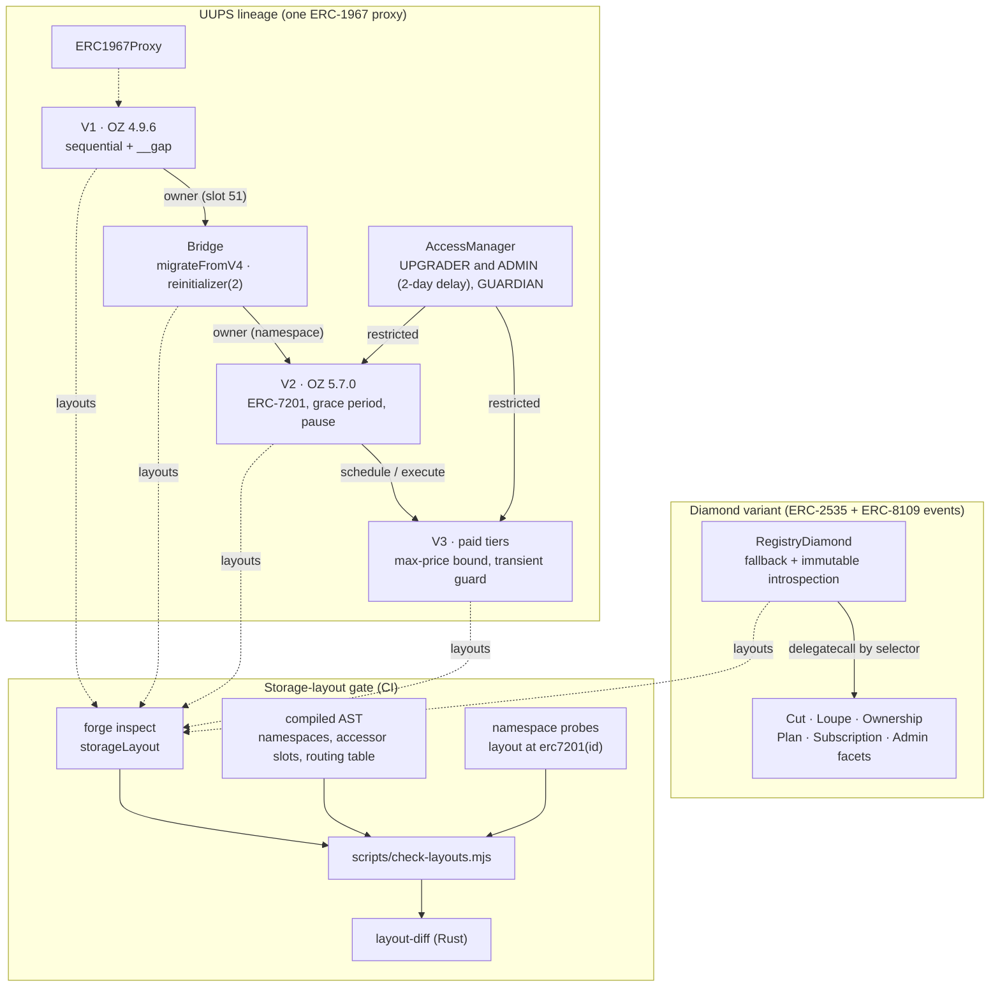

# Upgrade Safety Lab: UUPS v1 to v3, a Diamond Variant and a Rust Storage-Layout Gate

One subscription-registry app taken through three UUPS versions (OpenZeppelin 4.9.6 sequential storage, then
OpenZeppelin 5.7.0 ERC-7201 namespaces, then paid tiers) and rebuilt as an ERC-2535 diamond. It reproduces a
variant of a real OpenZeppelin migration failure and ships the escape hatch, gates every upgrade with a self-built
Rust storage-layout checker, and differential-fuzzes the two architectures against each other.

[](https://github.com/monzon1985/blockchain/actions/workflows/07-upgrade-safety-lab.yml)
[](../../LICENSE)
-363636)


## What's interesting here

- **A variant of a real OpenZeppelin migration failure, reproduced and fixed.** Upgrading this lab's V1
  (OZ 4.9.6) straight to V2 (OZ 5.7.0) strands the owner in slot 51 and the initialized version in slot 0, the
  failure class of [OpenZeppelin issue #6362](https://github.com/OpenZeppelin/openzeppelin-contracts/issues/6362).
  Six tests show every owner-gated and upgrade path rejecting every caller, and `initialize` open to whoever calls
  first. In #6362 `initialize` also panicked, which made the deadlock total; here it does not, so the lockout
  becomes a race that a front-runner wins. The escape hatch is a 4,478-byte bridge implementation whose
  `migrateFromV4` (a `reinitializer(2)`) moves both values into the ERC-7201 namespaces inside the upgrade
  transaction, for 90,342 gas.
- **A Rust storage-layout gate that sees namespaces and the code that addresses them.** `layout-diff` reads
  `forge inspect <C> storageLayout --json`; probe contracts compiled with Solidity's `layout at erc7201(...)`
  expose namespaced structs at their absolute slots, and the driver reads from the compiled AST the slot every
  accessor really assigns (`$.slot := ...`; 27 accessor placements across the 25 analysed contracts,
  OpenZeppelin's private constants included), following libraries as well as inheritance. The gate rejects all 12 unsafe pairs (11 deliberately broken fixtures, among
  them a wrong accessor behind a correct probe and a colliding namespace held by a library, plus the naive V1 to V2
  migration), passes the real lineage with exactly 3 reviewed allowances, and checks the diamond's real routing
  table for selector clashes; a genuine 4-byte collision planted in a fixture
  (`burn(uint256)` vs `collate_propagate_storage(bytes16)`) is rejected. 62 Rust tests, including 20 golden tests
  over 21 insta snapshots.
- **Two upgrade architectures, one behaviour.** UUPS V3 and the diamond expose the same 28-function API, revert
  with byte-identical data and emit identical event logs. They are driven with identical fuzzed programs
  (512 runs of 32 operations locally, 4,000 in CI) and a stateful campaign of 8,192 calls (128 runs x 64); a
  mutation smoke test injects 15 bugs into either side, two of them visible only in events, and all 15 are caught.
- **Every path to new code waits 2 days in public.** From V2 on, upgrades are UPGRADER-only behind a 2-day
  AccessManager delay, and so is the manager's own ADMIN: re-granting roles or re-pointing the proxy is scheduled
  like an upgrade and the guardian can veto it (`UpgradeGovernance`, applied identically by the scripts and the
  tests). A ghost-model campaign interleaves random traffic, payments and ownership transfers with every upgrade
  sub-step (scheduled, cancelled, too early, expired, executed but unconfigured), and a keystore-signed anvil demo
  verifies each stage on-chain, the intermediate bridge included.
- **Measured costs.** 226 Foundry tests, 100% line and branch coverage of `src/` (568/568 lines, 73/73
  branches). A fresh diamond layout is 4,310 gas cheaper per `subscribe` than the UUPS proxy, which pays two extra
  cold reads: the price lives in a namespace mapping (the V1 region is frozen by policy) and the pause flag in
  OpenZeppelin's own `Pausable` namespace.

## Overview

OpenZeppelin Contracts 5.x moved every upgradeable parent from sequential storage (with `__gap` arrays) to
ERC-7201 namespaced storage. The two layouts are incompatible: a proxy that upgrades from a 4.x-based
implementation to a 5.x-based one keeps its data, but the new code looks for the owner and the initialized
version in namespaces that are empty. Nothing reverts during the upgrade; the damage appears afterwards.

Proxy and upgradeability bugs are now their own OWASP category (SC10:2026). They are hard because the compiler
checks nothing across versions, storage mistakes are silent, and the failure often surfaces only when the owner
tries to act. This lab treats upgrade safety as an engineering problem with evidence at three levels:

1. **Code.** The same registry is written four times along one proxy (V1, bridge, V2, V3) and once as a
   diamond. V1 is plain OZ 4.9.6 code, as a pre-5.x codebase would have it; V2 and V3 are idiomatic OZ 5.7.0
   with ERC-7201 storage computed by the Solidity 0.8.35+ `erc7201` builtin, AccessManager-gated upgrades and a
   guardian cancel path.
2. **Tests.** Storage sentinels across the lineage, reproductions of the #6362 failure class and of the
   uninitialized-implementation takeover (with its `_disableInitializers()` fix), stateful upgrade fuzzing,
   and UUPS-versus-diamond differential fuzzing.
3. **Tooling.** A Rust CLI, golden-tested on deliberately broken layouts, runs over every version pair in CI and
   refuses any upgrade that reorders, retypes, removes, strands or collides storage, or that places a namespace
   anywhere but its ERC-7201 slot.

## Architecture



| Component | Responsibility | Key external calls |
|---|---|---|
| `SubscriptionRegistryV1` | Legacy registry on OZ 4.9.6 (`Ownable`, `UUPS`), sequential storage | none |
| `RegistryStorageV1` | V1 application storage (slots 201-250), frozen and inherited by every later version | none |
| `SubscriptionRegistryBridge` | Moves owner and initialized version from slots 0/51 into OZ 5.x namespaces, zeroes the legacy slots, serves the V1 read API (writes have no selector) | none |
| `LegacyOzV4Slots` | Typed view of the 201 slots the OZ 4.9.6 parents occupied | none |
| `SubscriptionRegistryV2` | OZ 5.7.0 (`Ownable2Step`, `Pausable`, `AccessManaged`, `UUPS`), grace period and renewal counters in `upgradelab.storage.SubscriptionRegistry` | AccessManager (`canCall`, `consumeScheduledOp`) |
| `SubscriptionRegistryV3` | V2 plus paid tiers (`subscribeWithMaxPrice`), members appended to the same namespace | payment token (`safeTransferFrom`), AccessManager |
| `RegistryDiamond` + `LibDiamond` | ERC-2535 cut semantics, ERC-8109 per-function events and `functionFacetPairs`, `FunctionNotFound` fallback | facets (`delegatecall`), `_init` (`delegatecall`) |
| Facets | Same API, revert data and events as V3 over three diamond namespaces | payment token (`safeTransferFrom`) |
| `script/UpgradeGovernance.sol` | The AccessManager configuration (roles, delays, guardian) shared by the scripts and the tests | AccessManager |
| `script/DiamondSelectors.sol` | The diamond's routing table, shared by the deployment script, the tests and the gate | none |
| `layout-diff` | Layout diff, ERC-7201 and accessor checks, selector-clash detection (Rust) | none (reads JSON) |
| `scripts/check-layouts.mjs` | Builds layout snapshots (forge inspect + probes + AST), runs the gate over every pair | `forge`, `cargo`, `layout-diff` |
| `scripts/demo-anvil.mjs` | Keystore-signed lineage on anvil with on-chain verification after each step | `anvil`, `cast`, `forge script` |

## Roles and trust assumptions

| Role | Holder (production intent) | Can | A compromised holder can |
|---|---|---|---|
| Owner, V1 and bridge | operations multisig | authorize upgrades (until V2), trigger `migrateFromV4` | upgrade to arbitrary logic before the AccessManager is wired |
| Owner, V2/V3/diamond | operations multisig | create/close/price plans, grace period, pause, treasury, `initializeV3` once | reprice plans (a paying subscriber is still bounded by its `maxPrice`), pause new subscriptions, redirect future payments; not upgrade a UUPS proxy, nor reopen an upgrade-path initializer on a fresh proxy |
| AccessManager ADMIN | governance multisig | grant roles, set delays, `updateAuthority`, all with a 2-day execution delay | schedule a role grant or an authority move that becomes executable 2 days later, in public, unless the guardian cancels it |
| UPGRADER | upgrade multisig, 2-day execution delay | `schedule` then `execute` `upgradeToAndCall` (or `diamondCut`) | ship malicious logic, but only after a public 2-day window |
| GUARDIAN | security council | cancel a scheduled upgrade or ADMIN operation | block upgrades and governance changes (liveness only) |
| Diamond owner | multisig, or an AccessManager (`DiamondTimelock.t.sol`) | `diamondCut` and plan administration | replace any facet (instantly, unless the owner is an AccessManager configured like the UUPS one) |

The local demo gives every role to one throwaway keystore; `OwnerIsAdminTimelockTest` shows that even then the
owner cannot upgrade faster than the delay. The full analysis is in [`docs/THREAT_MODEL.md`](docs/THREAT_MODEL.md).

## Invariants and properties

1. Every value V1 wrote (plans, subscriptions, packed counters) reads back identically, through the current API
   and as raw slots, after the bridge, V2 and V3.
   [`test_fullLineagePreservesEverySentinel`](test/uups/UpgradeSequence.t.sol),
   [`testFuzz_stateSurvivesEveryUpgrade`](test/uups/UpgradeSequence.t.sol),
   [`invariant_stateSurvivesEveryUpgrade`](test/invariant/UpgradeChainInvariant.t.sol)
2. Under arbitrary interleavings of free and paid traffic, pricing, pausing, ownership transfers and the upgrade
   sub-steps (bridge, V2, scheduling, cancelling, too-early and expired executions, V3 before and after
   `initializeV3`), every call succeeds or fails exactly as a ghost model predicts.
   [`invariant_everyOutcomeMatchesTheModel`](test/invariant/UpgradeChainInvariant.t.sol),
   [`test_scriptedWalkThroughEverySubStage`](test/invariant/UpgradeChainInvariant.t.sol)
3. The proxy always runs the implementation of its stage, owner and pending owner follow the model, and the OZ 5.x
   `Initializable` namespace holds version 0, 2, 3, 3, 3, 4 at V1, bridge, V2, V3 pending, V3 unconfigured and V3;
   a pending upgrade is visible on the manager until it expires.
   [`invariant_implementationOwnerAndVersionTrackTheStage`](test/invariant/UpgradeChainInvariant.t.sol)
4. After the bridge, legacy slots 0 and 51 are zero forever, no ERC-1967 admin ever exists, and no function of
   the V2 or V3 API reads or writes slots 0-200.
   [`invariant_retiredSlotsStayZeroAndNoAdmin`](test/invariant/UpgradeChainInvariant.t.sol),
   [`RetiredSlots.t.sol`](test/uups/RetiredSlots.t.sol)
5. For every call, UUPS V3 and the diamond return the same success flag, the same return or revert data and the
   same event logs (registry and token addresses normalized).
   [`invariant_sameOutcomeForEveryCall`](test/differential/UupsVsDiamond.t.sol),
   [`invariant_sameEventsForEveryCall`](test/differential/UupsVsDiamond.t.sol)
6. Both architectures always expose the same observable state: owner, pending owner, pause, grace period,
   plans and prices, every subscription, `isActive`, renewals, counters, revenue and every token balance.
   [`invariant_sameObservableState`](test/differential/UupsVsDiamond.t.sol),
   [`testFuzz_identicalCallSequencesEndInIdenticalState`](test/differential/UupsVsDiamond.t.sol)
7. Neither registry ever holds payment tokens, and every payment reaches the treasury of its time.
   Part of property 6 and [`invariant_paymentsMatchTheModel`](test/invariant/UpgradeChainInvariant.t.sol).
8. A subscriber never pays more than the bound it signed, and the one-argument `subscribe` never moves tokens.
   [`testFuzz_subscribeWithMaxPrice_paysThePriceOnlyWithinTheBound`](test/RegistryBehaviour.t.sol),
   [`test_subscribeWithMaxPrice_rejectsARepricingThatLandsFirst`](test/RegistryBehaviour.t.sol)
9. No path to new code (an UPGRADER upgrade, an ADMIN role grant, an authority move, handing the diamond to a new
   owner) can run sooner than 2 days after it is scheduled, and the guardian can cancel each one.
   [`AdminDelayTest`](test/uups/TimelockUpgrade.t.sol), [`OwnerIsAdminTimelockTest`](test/uups/TimelockUpgrade.t.sol),
   [`DiamondTimelock.t.sol`](test/diamond/DiamondTimelock.t.sol)
10. A freshly initialized proxy and a migrated one end at the same `Initializable` version (3 for V2, 4 for V3),
    so no upgrade-path re-initializer is ever left open. [`Initializers.t.sol`](test/uups/Initializers.t.sol)
11. The diamond's selector table stays consistent under any sequence of Add, Replace and Remove steps, and the
    routing table that is really cut serves the whole API.
    [`testFuzz_cutSequencesKeepTheTableConsistent`](test/diamond/DiamondLoupe.t.sol),
    [`DiamondRouting.t.sol`](test/diamond/DiamondRouting.t.sol)
12. No implementation contract can be initialized or upgraded directly.
    [`Initializers.t.sol`](test/uups/Initializers.t.sol), [`test_implementation_isLocked`](test/uups/SubscriptionRegistryV1.t.sol),
    [`test_bridge_implementationIsLocked`](test/uups/SubscriptionRegistryBridge.t.sol)
13. `layout-diff` properties over random solc-packed layouts: identical layouts are safe, appending is always
    safe, removing any variable is always unsafe, inserting is unsafe exactly when it moves a variable, swapping
    neighbours is always unsafe, ERC-7201 bases are 256-slot aligned.
    [`layout-diff/tests/properties.rs`](layout-diff/tests/properties.rs)

## Security considerations and threat model

The threat model ([`docs/THREAT_MODEL.md`](docs/THREAT_MODEL.md)) maps each threat to the OWASP Smart Contract
Top 10 (2026) and to the test that covers it. The headline items:

- **SC10:2026, the #6362 failure class.** A direct 4.x to 5.x upgrade leaves `owner() == address(0)` and an open
  `initialize`. Reproduced in [`NaiveMigration6362.t.sol`](test/uups/NaiveMigration6362.t.sol); prevented by the
  bridge and by the layout gate. The step-by-step procedure is in
  [`docs/MIGRATION_PLAYBOOK.md`](docs/MIGRATION_PLAYBOOK.md).
- **SC10:2026, the uninitialized implementation.**
  [`ImplementationTakeover.t.sol`](test/poc/ImplementationTakeover.t.sol) models the pre-4.3.2 UUPS pattern
  ([GHSA-5vp3-v4hc-gx76](https://github.com/OpenZeppelin/openzeppelin-contracts/security/advisories/GHSA-5vp3-v4hc-gx76)):
  under Shanghai rules the attacker's SELFDESTRUCT deletes the shared implementation and bricks every proxy;
  under Osaka (EIP-6780) the code survives but the attacker still owns the implementation. `_disableInitializers()`
  blocks both, and every implementation in `src/` calls it.
- **SC01:2026, upgrade authority.** From V2 on only the AccessManager's UPGRADER can upgrade, after 2 days, and a
  guardian can cancel ([`TimelockUpgrade.t.sol`](test/uups/TimelockUpgrade.t.sol)). The manager's ADMIN is behind
  the same delay and the guardian can cancel ADMIN operations too, so neither the owner nor ADMIN can grant itself
  an instant upgrade or move the proxy to another manager. Fresh `initialize` records the version the upgrade path
  ends at, so `initializeV2`/`initializeV3` cannot be replayed on a fresh proxy to swap the authority or the
  token; on the upgrade path they are owner-gated, so an upgrade sent without calldata cannot be front-run.
- **SC02:2026 business logic, front-running a repricing.** Paying subscribers call
  `subscribeWithMaxPrice(planId, maxPrice)`; a `setPlanPrice` mined first makes it revert instead of charging the
  new price against a standing allowance. The one-argument `subscribe` of V1/V2 never moves tokens.
- **SC08:2026 reentrancy, SC06:2026 external calls.** `subscribe` finishes every write and event before the single
  `safeTransferFrom`, under a transient-storage `nonReentrant`; a hook-enabled token's reentry is rejected in both
  architectures.
- **Static analysis.** Slither 0.11.6 fails CI on any untriaged finding (triage table in the threat model);
  `forge lint --deny warnings` and `forge build --deny warnings` are CI gates.

Known limitations: the legacy region is frozen rather than reclaimed; fee-on-transfer tokens are unsupported; no
refunds; the gate proves layout compatibility, not migration correctness (the tests do that), and accepts only
accessors whose slot is a compile-time constant; ERC-8109 is withdrawn in favour of ERC-8153, whose facet-level
upgrade function is not implemented.

## Design decisions and trade-offs

- **Freeze, don't move, the application region.** Mappings cannot be relocated in O(1), so V1's application data
  stays at slots 201-250 forever (`RegistryStorageV1`, inherited unchanged) and only the two OZ parent words are
  migrated. Everything new goes into `upgradelab.storage.SubscriptionRegistry`. The cost is visible in the gas
  table: V3 pays two extra cold reads per `subscribe` compared with the diamond's fresh, packed layout.
- **A minimal bridge instead of a V2 that "detects" legacy state.** Keeping migration code out of V2 means no
  function of V2 or V3 reads slots 0-200 (proved for both APIs by `RetiredSlots.t.sol`), and the one-time logic
  ships once and is gone. The bridge still answers the V1 read API so integrators calling `isActive` see no gap.
- **`erc7201` builtin over hand-written constants.** The base slot is computed by the compiler from the id; a fuzz
  test checks the builtin against the formula for arbitrary run-time ids, the Rust tool recomputes it, and the gate
  checks every accessor's slot against it.
- **Probes for member layouts, the AST for slots.** `forge inspect` cannot see namespaced structs, so a one-line
  probe per struct (`layout at`) lets solc report the real member layout. Where the struct actually lives is not
  taken from the probe: the driver walks the code that runs against a contract's storage (its linearization, the
  libraries and free functions that code reaches, and for the diamond its facets), finds every annotated struct and
  every `$.slot := ...` accessor, and resolves each slot statically. A wrong accessor, a namespace hidden in a
  library, a struct placed at a constant slot without an annotation, or an accessor the driver cannot evaluate
  all fail the gate.
- **Why another layout checker.** OpenZeppelin's validator (upgrades-core, used by openzeppelin-foundry-upgrades)
  is namespace-aware and also checks initializers, constructors and unsafe opcodes across proxy kinds;
  slither-check-upgradeability checks variable order, initializers and proxy/implementation function collisions;
  foundry-storage-check diffs `forge inspect` layouts in CI. `layout-diff` was built to make three things explicit
  and golden-testable on this lab's own failure modes: the #6362 move-into-a-namespace rule, the slot each
  accessor really uses, and reviewed allowances that fail once stale. It does not replace those tools.
- **Allowances are explicit and must be used.** The only three allowances sit on the V1 to bridge step, carry
  their reason and test, and an allowance that matches nothing fails the gate.
- **AccessManager natively in UUPS, as the owner in the diamond, one configuration for both.** The UUPS lineage
  uses `AccessManagedUpgradeable` so `_authorizeUpgrade` is `restricted`; the diamond keeps ERC-2535's owner-gated
  `diamondCut` and shows how an AccessManager becomes that owner. `UpgradeGovernance.configure` applies the same
  roles and delays to both, and also delays ADMIN itself, because an undelayed ADMIN would make every other delay
  optional.
- **ERC-8109 where it was explicit.** Per-function `DiamondFunctionAdded/Replaced/Removed` events,
  `functionFacetPairs`, `FunctionNotFound` and immutable introspection functions are adopted; the ERC-2535
  `DiamondCut` event, the four loupe functions and ERC-165 stay for tooling compatibility.
- **Identical errors and events across architectures.** The diamond reuses OpenZeppelin's error and event
  signatures (`OwnableUnauthorizedAccount`, `EnforcedPause`, `Paused(address)`), which is what makes byte-level
  differential comparison of revert data and logs possible.

## Testing

```bash
forge test                                   # 226 tests (unit, fuzz, invariants, differential, PoCs, gas bench)
cd layout-diff && cargo test && cd ..        # 62 tests (unit, CLI, insta goldens, proptest)
node scripts/check-layouts.mjs               # the storage-layout gate
node scripts/mutants.mjs                     # 15 mutants against the differential harness
node scripts/demo-anvil.mjs                  # keystore-signed lineage on anvil, verified on-chain
node scripts/ci-local.mjs                    # every CI gate above and below, in CI order (see Getting started)
```

| Suite | Tests | What it covers |
|---|---:|---|
| `UupsV3BehaviourTest`, `DiamondBehaviourTest` ([`RegistryBehaviour.t.sol`](test/RegistryBehaviour.t.sol)) | 36 + 36 | one suite, both architectures: every happy path and revert path of the V3 API, the max-price bound, 3 fuzz tests each |
| `UupsV2CoreBehaviourTest` | 26 | the same core suite against V2 (2 fuzz tests) |
| `SubscriptionRegistryV1Test` | 12 | legacy V1, OZ 4.x revert strings, documented raw slot layout |
| `SubscriptionRegistryBridgeTest` | 9 | migration effects, legacy-owner gate, corrupted legacy state, read-only maintenance mode |
| `NaiveMigration6362Test` | 6 | the #6362 failure class and the re-initialization race (1 fuzz test over owner and caller) |
| `UpgradeSequenceTest` | 2 | sentinels across V1, bridge, V2, V3 (1 fuzz test) |
| `UpgradeChainInvariantTest` | 1 campaign (5 invariants) + 1 | random traffic interleaved with every upgrade sub-step, ghost model; scripted walk through every stage |
| `InitializersTest`, `RetiredSlotsTest`, `Erc7201FormulaTest` | 11 + 3 + 6 | initializer paths (fresh and migrated end at the same version), dead legacy slots for V2 and V3, ERC-7201 builtin vs formula (1 fuzz test) and the slots OZ really writes |
| `TimelockUpgradeTest`, `AdminDelayTest`, `OwnerIsAdminTimelockTest` | 9 + 7 + 2 | schedule, delay, cancel, expiry, V3 patch upgrade; ADMIN's delayed and vetoable paths; the review's owner-as-ADMIN proof of concept |
| `PreCancunTakeoverTest`, `OsakaTakeoverTest`, `DisableInitializersFixTest` | 2 + 1 + 2 | implementation takeover PoC and fix |
| `DiamondCutTest`, `DiamondLoupeTest`, `DiamondRoutingTest` | 20 + 3 + 2 | cut rules and events, loupe consistency under Add/Replace/Remove (1 fuzz test), the deployed routing table vs the interface |
| `DiamondTimelockTest`, `DiamondOwnerIsAdminTimelockTest` | 6 + 1 | AccessManager as diamond owner, ownership hand-over as an upgrade path, ADMIN delay |
| `UupsVsDiamondSequenceTest` | 2 | stateless differential fuzzing (1 fuzz test) and a scripted program |
| `UupsVsDiamondInvariantTest` | 1 campaign (3 invariants) | stateful differential fuzzing: outcomes, events, state |
| `GasBench*` | 19 | per-call gas, both architectures, and the migration steps |
| **Foundry total** | **226** | 31 suites; 13 fuzz tests; forge counts each invariant campaign once (8 invariants in 2 campaigns) |
| `layout-diff` unit / CLI / golden / properties | 27 / 9 / 20 / 6 | 62 Rust tests, 21 insta snapshots, 6 proptest properties at 512 cases |

Settings: fuzz 512 runs locally, 4,000 with a fixed seed in CI; invariants 128 runs x 64 calls locally, 256 x 100
in CI, `fail_on_revert = true` (the handlers never revert, so any revert is a harness bug). Coverage of `src/`:
**100% of lines (568/568), statements (599/599), branches (73/73) and functions (136/136)**.

The layout gate passes the 3 lineage pairs with 3 allowances, rejects the 12 unsafe pairs, passes the 2 safe
controls and the diamond lint, resolves 27 accessor placements from the AST, finds no clash among the 35 routed
selectors, and confirms that both architectures serve all 28 interface functions.

The mutation smoke test ([`scripts/mutants.mjs`](scripts/mutants.mjs)) applies 15 one-line behavioural changes
(10 in the diamond, 5 in UUPS V3: off-by-one bounds, a boundary comparison, a missing counter, free renewals, a lost
treasury write, a loosened price bound, and two changes visible only in events) and requires the differential suite
to fail for each. All 15 are killed. A mutated file is restored after each run, on Ctrl-C, and, after a hard kill,
by the next run (`--restore` does only that).

## Gas

Per-call gas from `vm.snapshotGasLastFrame` ([`snapshots/GasBench.json`](snapshots/GasBench.json)), cold storage,
optimizer 10,000 runs. Whole-test numbers are in [`.gas-snapshot`](.gas-snapshot). CI fails if either file is
stale (`forge snapshot --check`, and `git diff --exit-code` on the JSON after `forge test`); `forge coverage` does
not write snapshots (`gas_snapshot_emit = false` in its profile).

| Operation | UUPS proxy (V3) | Diamond | Delta |
|---|---:|---:|---:|
| `subscribe` (free, new) | 64,046 | 59,736 | -4,310 |
| `subscribe` (renewal) | 69,646 | 65,330 | -4,316 |
| `subscribeWithMaxPrice` (paid, ERC-20 pull) | 128,166 | 123,790 | -4,376 |
| `cancel` | 28,175 | 28,272 | +97 |
| `createPlan` | 57,800 | 57,856 | +56 |
| `setGracePeriod`, first write (zero to non-zero in V3) | 52,549 | 35,198 | -17,351 |
| `setGracePeriod`, update of a set value | 35,437 | 35,186 | -251 |
| `isActive` (view) | 9,979 | 9,767 | -212 |

The diamond's selector lookup costs about the same cold read as the proxy's implementation slot. The differences
come from layout: the diamond packs the price into the plan slot and the pause flag and grace period into the
counters slot, while V3 reads its price from a namespace mapping and the pause flag from OpenZeppelin's
`Pausable` namespace, outside its frozen V1 slots. The large first-write gap is an SSTORE effect, not a permanent
saving: V3's grace period sits alone in a slot that is still zero (a zero to non-zero write), while the diamond
writes into a counters slot that `createPlan` already made non-zero. Once a grace period is set, both cost about
the same.

| Migration step | Gas |
|---|---:|
| V1 to bridge, with `migrateFromV4` | 90,342 |
| bridge to V2, with `initializeV2` | 72,241 |
| `AccessManager.execute` of the scheduled V2 to V3 upgrade | 65,888 |

Runtime sizes: V1 6,753 B, bridge 4,478 B, V2 9,590 B, V3 11,215 B; diamond 1,196 B plus facets from 1,032 B
(ownership) to 5,128 B (cut).

## Getting started

Prerequisites: [Foundry](https://getfoundry.sh) 1.8.3, Rust 1.98 (on Windows the MSVC toolchain needs the Visual
Studio 2022 Build Tools), Node.js 24, and for the static-analysis gate Slither 0.11.6 with crytic-compile 0.4.2.

```bash
cd projects/07-upgrade-safety-lab
forge soldeer install          # OZ 5.7.0 (+ upgradeable), forge-std 1.16.2, OZ upgradeable 4.9.6 (git, pinned)
forge build && forge test
node scripts/demo-anvil.mjs    # local demo: anvil on a free port, throwaway keystore, on-chain checks
```

Run every CI gate locally, in the workflow's order and with its profiles (`--skip slither,mutants` to leave some
out):

```bash
node scripts/ci-local.mjs
```

or step by step:

```bash
forge fmt --check
FOUNDRY_PROFILE=ci forge build --deny warnings
FOUNDRY_PROFILE=ci forge lint --deny warnings
FOUNDRY_PROFILE=ci forge test                                 # then snapshots/GasBench.json must be unchanged
FOUNDRY_PROFILE=ci forge snapshot --check --match-contract GasBench
cd layout-diff && cargo fmt --check && cargo clippy --locked --all-targets -- -D warnings && cargo test --locked && cd ..
node scripts/check-layouts.mjs                                # --write regenerates the fixtures after a layout change
FOUNDRY_PROFILE=slither slither . --config-file slither.config.json   # its own profile: crytic-compile runs forge clean
FOUNDRY_PROFILE=coverage forge coverage --report summary --report lcov --no-match-coverage "(test|script|dependencies)/"
node scripts/demo-anvil.mjs
node scripts/mutants.mjs
```

Using the gate on a single pair: `layout-diff` needs namespace information, which raw `forge inspect` output
does not have, so give it the snapshots the gate builds (`out-layout/gate/snapshots` after a run, or the committed
ones):

```bash
cargo build --release --manifest-path layout-diff/Cargo.toml
S=layout-diff/tests/fixtures/snapshots
layout-diff/target/release/layout-diff diff $S/SubscriptionRegistryV1.json $S/SubscriptionRegistryV2.json  # UNSAFE: 3 x moved-to-namespace (#6362)
layout-diff/target/release/layout-diff erc7201 openzeppelin.storage.Ownable
```

Raw `forge inspect storageLayout --json` input is refused (exit code 2) unless `--sequential-only` is passed, and
then the verdict reads "SAFE for sequential storage only, ERC-7201 namespaces NOT checked"
([`docs/LAYOUT_DIFF.md`](docs/LAYOUT_DIFF.md)).

## Project structure

```
07-upgrade-safety-lab/
├── src/
│   ├── interfaces/IRegistry.sol        # shared API, events, errors, limits
│   ├── uups/
│   │   ├── v1/                         # SubscriptionRegistryV1 (OZ 4.9.6) + RegistryStorageV1 (frozen)
│   │   ├── bridge/                     # SubscriptionRegistryBridge + LegacyOzV4Slots
│   │   ├── v2/, v3/                    # OZ 5.7.0 versions
│   │   └── RegistryNamespace.sol       # ERC-7201 namespace (V2 struct, V3 struct), erc7201 builtin
│   └── diamond/                        # RegistryDiamond, DiamondInit, facets/, libraries/, interfaces/
├── test/
│   ├── RegistryBehaviour.t.sol         # one suite, UUPS V2/V3 and the diamond
│   ├── uups/ poc/ diamond/             # unit, reproduction and PoC tests
│   ├── invariant/ differential/        # stateful upgrade fuzzing, UUPS-vs-diamond
│   ├── gas/                            # GasBench
│   ├── layout/                         # NamespaceProbes.sol, fixtures/ (broken layouts, clashing facets)
│   └── utils/                          # LabBase (deploy helpers for every stage), mocks
├── script/                             # keystore-signed deployment, upgrade, cancel and verification scripts;
│                                       #   UpgradeGovernance.sol and DiamondSelectors.sol, shared with the tests
├── scripts/                            # check-layouts.mjs, demo-anvil.mjs, mutants.mjs, ci-local.mjs
├── layout-diff/                        # the Rust CLI: src/, tests/ (goldens, CLI, proptest), fixtures
├── docs/                               # THREAT_MODEL.md, MIGRATION_PLAYBOOK.md, LAYOUT_DIFF.md
├── layouts.config.json                 # gate configuration: chain, allowances, unsafe and safe pairs, routing table
├── snapshots/GasBench.json, .gas-snapshot
└── foundry.toml, soldeer.lock, slither.config.json
```

## Scope notes and future work

- **ERC-8109 was withdrawn while this lab was built** (superseded by ERC-8153, "Facet-Based Diamonds", in Last
  Call). The diamond implements ERC-2535 and the explicit parts of ERC-8109; migrating to ERC-8153's
  facet-level events and `upgradeDiamond` is future work.
- **The V1 proxy is OpenZeppelin 5.7.0's `ERC1967Proxy`.** OZ Contracts-Upgradeable 4.9.6 does not ship a proxy;
  an ERC-1967 proxy only forwards calls and reads the standard slots, so the lab's results do not depend on its
  version.
- **The pre-Cancun half of the takeover PoC** runs the attack under `vm.setEvmVersion("shanghai")` in `setUp`,
  so the SELFDESTRUCT is finalized before the test body; the lab itself targets Osaka.
- **Lazy migration of mappings** (moving entries into the namespace on first touch) would let the legacy region
  be reclaimed over time; it is deliberately not done here, to keep V2 free of legacy reads.
- **The layout gate covers static footprints and constant locations.** Collisions through hashed locations
  (mapping entries, dynamic arrays) are out of scope, as are enum member reorders (solc's layout output only
  carries enum sizes). Accessor slots are resolved through constants, the `erc7201` builtin and pure getters;
  anything computed at run time is refused rather than guessed.
- **The demo broadcasts the two migration steps separately** so the bridge state can be verified on-chain; in
  production they belong in one multisig batch.
- **Not audited, not deployed.** This is a technical demonstration written to production standards.

## References

- [ERC-1967: Proxy Storage Slots](https://eips.ethereum.org/EIPS/eip-1967) and
  [ERC-1822: Universal Upgradeable Proxy Standard](https://eips.ethereum.org/EIPS/eip-1822)
- [ERC-7201: Namespaced Storage Layout](https://eips.ethereum.org/EIPS/eip-7201) (the `example.main` test vector
  is from the EIP)
- [ERC-2535: Diamonds, Multi-Facet Proxy](https://eips.ethereum.org/EIPS/eip-2535) by Nick Mudge, and his
  reference implementations, which inspired `LibDiamond`'s structure
- [ERC-8109: Diamonds, Simplified](https://eips.ethereum.org/EIPS/eip-8109) (withdrawn) and
  [ERC-8153: Facet-Based Diamonds](https://eips.ethereum.org/EIPS/eip-8153)
- [OpenZeppelin issue #6362](https://github.com/OpenZeppelin/openzeppelin-contracts/issues/6362): the deadlock
  after a v4 to v5 UUPS upgrade. This lab reproduces its failure class (owner and initialized version stranded in
  legacy slots); the panic in `initialize` that made the reported case unrecoverable is not reproduced
- [OpenZeppelin advisory GHSA-5vp3-v4hc-gx76](https://github.com/OpenZeppelin/openzeppelin-contracts/security/advisories/GHSA-5vp3-v4hc-gx76):
  the 2021 UUPS uninitialized-implementation vulnerability modelled by the takeover PoC
- [OpenZeppelin Contracts 5.x](https://github.com/OpenZeppelin/openzeppelin-contracts) (`AccessManager`,
  `Ownable2Step`, `Pausable`, `ReentrancyGuardTransient`, `SafeERC20`)
- Prior art for storage-layout checking:
  [OpenZeppelin Upgrades](https://github.com/OpenZeppelin/openzeppelin-upgrades) (`upgrades-core` validation of
  renames, gaps and namespaces) and [openzeppelin-foundry-upgrades](https://github.com/OpenZeppelin/openzeppelin-foundry-upgrades),
  [slither-check-upgradeability](https://github.com/crytic/slither/wiki/Upgradeability-Checks), and
  [foundry-storage-check](https://github.com/Rubilmax/foundry-storage-check) by Rubilmax
- Solidity [0.8.29](https://soliditylang.org/blog/2025/03/12/solidity-0.8.29-release-announcement/) (`layout at`)
  and [0.8.35](https://www.soliditylang.org/blog/2026/04/29/solidity-0.8.35-release-announcement/) (`erc7201`)
- [EIP-6780: SELFDESTRUCT only in same transaction](https://eips.ethereum.org/EIPS/eip-6780)
- [OWASP Smart Contract Top 10 (2026)](https://scs.owasp.org/sctop10/), SC10:2026 Proxy & Upgradeability
- Patricio Palladino (Nomic Labs), [Malicious backdoors in Ethereum Proxies](https://medium.com/nomic-foundation-blog/malicious-backdoors-in-ethereum-proxies-62629adf3357)
  (2018), which introduced proxy function clashing and the `burn(uint256)` / `collate_propagate_storage(bytes16)`
  collision used by the selector-clash fixture
