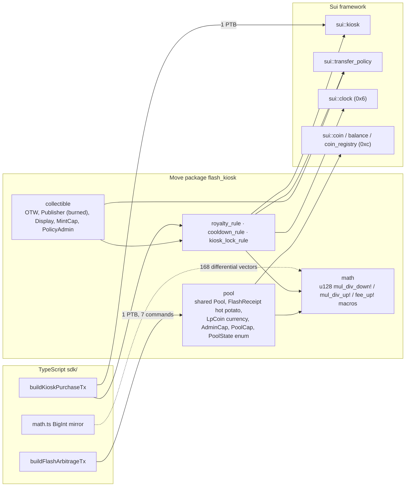
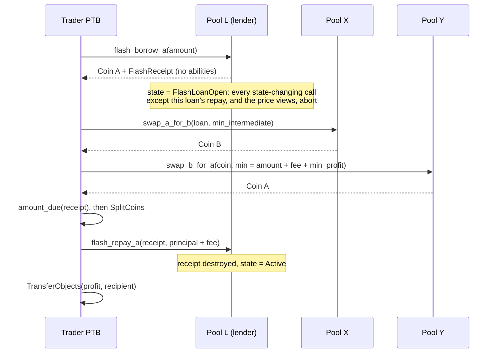

# Sui Move: Hot-Potato Flash-Loan AMM and a Policy-Enforced Kiosk Marketplace

A Sui Move 2024 package with two halves. The first is a constant-product pool whose flash loans are enforced by a receipt with **no abilities**. The second is a Kiosk marketplace whose `TransferPolicy` carries a royalty rule (bps with a floor), a from-scratch resale-cooldown rule (`sui::clock`) and a kiosk-lock rule. Admin is capability-based, shared objects are versioned, and two TypeScript programmable transaction blocks (PTBs) compose everything in single transactions.

[](https://github.com/monzon1985/blockchain/actions/workflows/08-sui-flashloan-kiosk.yml)
[](../../LICENSE)


> **Portfolio project.** Nothing here has been professionally audited or deployed with real funds. See [`docs/THREAT_MODEL.md`](docs/THREAT_MODEL.md).

## What's interesting here

- **The flash-loan guarantee is a type, not a balance check.** `FlashReceipt` has no `drop`, `copy`, `store` or `key`, so the only way to end a transaction that borrowed is `flash_repay_*` with exactly principal + fee on the same pool. **18 compile-fail fixture packages** try to break the type-level guarantees: 12 attack the receipt and the Kiosk `TransferRequest` (drop it, `let _ =` it, copy it, store it in an object or a dynamic field, transfer it, wrap it in a `drop` struct, launder it through a `T: drop` generic, forge it, destructure it, rewrite its fee), and 6 reach for objects and keys that must stay private (transfer a shared pool, forge the cooldown stamp's key, borrow an item's `UID`, use the wrapped policy cap, register a pool's LP coin from outside `pool`). [`scripts/compile-fail.mjs`](scripts/compile-fail.mjs) requires each one to fail `sui move build` with the exact diagnostic code and message, next to a positive control that must compile. On a real localnet, a PTB that borrows and never repays is rejected with `UnusedValueWithoutDrop` and leaves the pool untouched.
- **151 Move tests, 100.00 % instruction coverage of all 6 modules.** Every one of the 27 abort codes has an `expected_failure` test (88 in total). Six invariants are checked with ghost accounting after each of 1,688 seeded multi-actor operations (8 campaigns of 211: an 11-operation prologue that runs every operation kind, then 200 random ones, on pools seeded from barely above `MINIMUM_LIQUIDITY` up to 2^58), plus a `#[random_test]` campaign. A mutation smoke test plants **16 realistic bugs** (fee rounded down, lock removed, stale version accepted, cooldown off by one, Publisher kept, LP metadata cap kept, ...) and **all 16 are killed**.
- **No key can trap liquidity or freeze the marketplace.** Each pool registers its own LP coin in Sui's `CoinRegistry`, unregulated and with its metadata frozen, so no `DenyCapV2` can ever deny-list an LP. The `TransferPolicyCap` is wrapped in a `PolicyAdmin` that can tune the three rules within bounds (royalty ≤ 10 %, floor ≤ 1 SUI, cooldown ≤ 30 days) but can never add the rule nobody can satisfy.
- **A bit-exact TypeScript mirror.** A BigInt reference of the on-chain math generates **168 differential vectors** that a generated Move test replays through the real pool and royalty code, and that a TypeScript test checks against their defining inequalities. The headline arbitrage (borrow 10,000,000, pay a 30,000 fee, keep **9,088,862**) is reproduced to the unit by the Move test, by the TypeScript quote and by the PTB on a live localnet.
- **Versioning proven across a real package upgrade.** The localnet e2e suite publishes the package, upgrades it with `sui client test-upgrade` to a copy with `VERSION = 2`, and shows the full lifecycle on chain. Before `migrate`, v2 refuses the v1 pool with `EWrongVersion`. After the `AdminCap`-gated `migrate`, v1 is locked out for good, and kiosk purchases go through v2. 9 e2e tests on `sui start --force-regenesis` (free ports) run in CI, and gas is checked against a committed snapshot.

## Overview

On the EVM, a flash loan is a callback: the lender sends tokens, calls into the borrower, and checks its balance afterwards. Safety rests on that final runtime check and on reentrancy guards around it. Sui has no callbacks. A transaction is a PTB: a list of Move calls whose results flow into later calls. The lender cannot "check afterwards", because it does not run afterwards.

Move answers with the **hot potato**: a struct without abilities. The type system forces whoever receives it to hand it to a function of the defining module before the transaction ends, so `flash_borrow` returns the coins *and* a `FlashReceipt`, and only `flash_repay` (with the right pool, the right side and exactly principal + fee) can consume the receipt. A borrower who does not repay does not get a failed check. They get code that does not compile (inside Move) or a PTB that fails as a whole (on chain).

The same mechanism powers Sui Kiosk: `kiosk::purchase` returns the item together with a `TransferRequest`, and only `transfer_policy::confirm_request` (which demands one receipt per installed rule) can destroy it. Royalties stop being advisory, as they are with EIP-2981.

What makes it non-trivial:

- **A hot potato only guarantees consumption, not correctness.** The pool still has to lock itself while a loan is open. Otherwise the borrowed reserve could be traded against inside the same PTB, the Sui form of reentrancy, and views could leak mid-loan prices (read-only reentrancy).
- **Rules need state the request does not carry.** A cooldown has to remember the last sale per item, without turning every sale of the collection into a write to one shared object.
- **Upgrades do not delete old code.** Every published package version stays callable forever, so a fix only protects users once shared objects refuse the old version. Pools can be made to refuse it; transfer-policy rules cannot, and that limit is documented rather than hidden ([`docs/UPGRADES.md`](docs/UPGRADES.md#rules-and-upgrades)).
- **Rounding is an attack surface.** Every division in the package rounds in the protocol's favour, and that is tested differentially and by mutation.

## Architecture



The flash-arbitrage PTB, built by [`sdk/src/flash-arbitrage.ts`](sdk/src/flash-arbitrage.ts), is a single transaction:



| Component | Responsibility | Key external calls |
|---|---|---|
| [`sources/pool.move`](sources/pool.move) | `Pool<A, B, LP>`: swaps (30 bps to LPs), liquidity, flash loans with `FlashReceipt`, pause / fees / flash toggle through caps, `VERSION` gate and `migrate`; registers each pool's LP coin `LpCoin<LP>` | `coin_registry::new_currency`, `coin::take`, `balance::join`, `TreasuryCap::mint` / `burn`, `event::emit` |
| [`sources/math.move`](sources/math.move) | `u64` operands widened to `u128`; explicit `_down` / `_up` rounding as macros; integer square root; swap output | `std::u128::sqrt` |
| [`sources/collectible.move`](sources/collectible.move) | Demo NFT. `init` claims the `Publisher` from the OTW, creates `Display` and the **only** `TransferPolicy`, installs all three rules, shares it, burns the `Publisher` and wraps the policy cap in a bounded `PolicyAdmin` | `package::claim`, `display::new_with_fields`, `transfer_policy::new`, `package::burn_publisher` |
| [`sources/royalty_rule.move`](sources/royalty_rule.move) | `max(ceil(price × bps / 10_000), min_amount)` into the policy balance | `transfer_policy::add_to_balance`, `add_receipt` |
| [`sources/cooldown_rule.move`](sources/cooldown_rule.move) | Blocks resale for `cooldown_ms`; stamps a dynamic field on the item's `UID` under a key only this module can construct | `clock::timestamp_ms`, `dynamic_field::{add, borrow_mut}` |
| [`sources/kiosk_lock_rule.move`](sources/kiosk_lock_rule.move) | The bought item must end up *locked* in a kiosk, so it can never leave the policy | `kiosk::{has_item, is_locked}` |
| [`sdk/src/`](sdk/src) | PTB builders, BigInt mirror of the math (quotes, optimal borrow size, clamped to the lender's reserve), clever-error decoding | `@mysten/sui` `Transaction` |
| [`demo/coins/`](demo/coins) | Demo package for the e2e suite: two trade coins (each from its own OTW via `coin_registry`) and the three pools' LP marker types | `coin_registry::new_currency_with_otw` |

[`docs/OBJECTS.md`](docs/OBJECTS.md) inventories every object, key and hot potato the design touches (23 rows), and justifies the layout by contention: there is no global object on the swap path, the flash-loan lock is a field, and the cooldown stamp lives as a dynamic field *on the item* instead of in a shared table.

### Why the pool has a third type parameter, and who mints the LP coin

The LP coin of each pool is a real currency in Sui's `CoinRegistry`, so wallets and explorers see proper metadata. Move cannot mint a new coin *type* at runtime, so the type has to come from a parameter: `Pool<A, B, LP>`, whose LP coin is `Coin<LpCoin<LP>>`. `LP` is a **marker** type the creator picks, and `create_pool` registers `LpCoin<LP>` itself with `coin_registry::new_currency`. The registry accepts one currency per type, so **a marker backs exactly one pool**, and several pools can exist for the same pair. The arbitrage PTB uses that: it borrows from pool L and trades on pools X and Y.

The obvious alternative, taking the `TreasuryCap` of a currency the creator published from a one-time witness, lets a creator bring a *regulated* currency, keep its `DenyCapV2`, and later deny-list LPs (or pause the coin globally) so that their LP coins can no longer be passed to `remove_liquidity`. Checking `Currency::is_regulated` would not close that: a legacy regulated coin migrated into the registry reports an `Unknown` regulated state, which reads as "not regulated" while its deny cap still works ([`is_regulated_cannot_vouch_for_a_creator_supplied_currency`](tests/pool_tests.move#L105)). Registering the currency inside the pool closes it: only the initializer that never leaves `create_pool` could make it regulated, and it never does. The `MetadataCap` is deleted on the spot, so LP metadata is fixed too.

## Roles and trust assumptions

There are no address-based ACLs. Every privilege is an owned capability object.

| Capability | Minted by | Can | Cannot | If compromised |
|---|---|---|---|---|
| `AdminCap` | `pool::init`, once | pause / unpause any pool, set fees in `[1, 100]` bps, `migrate` pools | move reserves, mint LP, upgrade, block withdrawals | swaps, deposits and flash loans halted and fees raised to 1 %. **Withdrawals stay open**: `remove_liquidity` works while paused, and no capability can deny-list an LP coin. |
| `PoolCap` | `create_pool`, one per pool | toggle flash loans on *its* pool (`EWrongPoolCap` elsewhere) | anything else; it holds no key to the pool's LP coin | flash loans on that one pool switched on or off |
| LP coin keys (`TreasuryCap`, `MetadataCap`, `DenyCapV2` of `LpCoin<LP>`) | `create_pool` | nothing, because nobody holds them: the `TreasuryCap` is wrapped in the pool, the `MetadataCap` is deleted, and a `DenyCapV2` never exists | deny-list an LP, pause LP transfers, rewrite LP metadata, mint LP outside the pool | n/a |
| `UpgradeCap` | package publish | publish new package versions | nothing is out of reach under the `compatible` policy | **everything**: a new version can add a function to `pool` that moves reserves, or a `PolicyAdmin` function that changes the rule set. See [`docs/UPGRADES.md`](docs/UPGRADES.md#what-the-version-gate-does-and-what-it-does-not) |
| `PolicyAdmin` (wraps the `TransferPolicyCap<Collectible>`) | `collectible::init` | set the royalty (≤ 10 %, floor ≤ 1 SUI) and the cooldown (≤ 30 days), withdraw royalties | add or remove rules, move items or kiosk proceeds | royalties withdrawn, royalty raised to 10 % with a 1 SUI floor, resales delayed by up to 30 days. It cannot freeze items. **If lost, there is no recovery path**: royalties stay in the policy and parameters stay as they are. Hold it in a multisig. |
| `Display<Collectible>` | `collectible::init` | edit the fields wallets render for the type | touch items, rules or funds | rewrites the name, description, image or link shown for every item (a phishing vector) |
| `MintCap` | `collectible::init` | mint collectibles | anything on existing items | unlimited supply of new items |
| `KioskOwnerCap` | `kiosk::new`, per user | list, delist, withdraw proceeds of that kiosk | take a *locked* item out | that kiosk's listings and proceeds |
| `Publisher` (from the OTW) | `collectible::init` | create a `TransferPolicy` / `Display` | n/a | **burned in `init`**, so a second, rule-free policy can never exist |

Trusted: the Sui framework (`kiosk`, `transfer_policy`, `coin`, `coin_registry`, `clock`) and the validators. Not trusted: every trader, LP, pool creator, buyer and seller, who are assumed to control whole PTBs with arbitrary call order and arbitrary objects.

## Invariants and properties

Pool invariants, asserted after **every** transaction of the stateful campaigns in [`tests/invariant_tests.move`](tests/invariant_tests.move) ([`check_invariants`](tests/invariant_tests.move#L171), [`seeded_campaign`](tests/invariant_tests.move#L492)). Each campaign seeds a pool from one of three magnitudes (supply just above `MINIMUM_LIQUIDITY`, ordinary, near 2^58). Four actors then run swaps of up to 4× the input reserve, deposits of up to 3× the reserves, withdrawals, flash loans on both sides, fee changes, pauses, unpauses and flash-loan toggles. Every swap, deposit and withdrawal passes its exact expected output as the slippage minimum. A [prologue](tests/invariant_tests.move#L419) runs every operation kind and fails the campaign if any of them was skipped, so no campaign can hold vacuously; seeded campaigns must also see every kind again during their 200 random operations. Three more tests end a campaign with a swap, a deposit and a withdrawal that ask for one unit more than they can get, and require `ESlippage`.

1. **I1, LP share value never decreases.** `k / S²` (k = reserve_a × reserve_b, S = LP supply) is non-decreasing across every operation, compared exactly in `u256`. Rounding always favours the remaining LPs.
2. **I2, conservation.** Each reserve equals its seed plus every coin the test paid in minus every coin it received, tracked by ghost counters.
3. **I3, LP supply accounting.** Supply equals seed LP + minted − burned.
4. **I4, the floor never moves.** `MINIMUM_LIQUIDITY` (1,000 LP) stays locked in the pool, and supply and both reserves stay strictly positive (no first-depositor inflation reset).
5. **I5, no loan outlives its transaction.** Between transactions the pool is `Active` or `Paused`, never `FlashLoanOpen`.
6. **I6, k strictly grows.** Every swap and every flash loan strictly increases `k`, because fees round up to at least one unit.

Type-level and rule properties:

7. **P1, a receipt cannot be dropped, copied, stored, transferred, wrapped, forged or edited.** Enforced by the compiler: 12 fixtures in [`fixtures/compile-fail/`](fixtures/compile-fail) with exact diagnostics in [`expected.json`](fixtures/compile-fail/expected.json). Enforced by the PTB verifier: the e2e test *rejects a PTB that borrows and never repays*.
8. **P2, a receipt settles only its own loan.** Same pool id ([`repaying_to_another_pool_of_the_same_pair_aborts`](tests/flash_tests.move#L223)), same side, exactly principal + fee ([`repaying_principal_without_fee_aborts`](tests/flash_tests.move#L187)). A loan owes the fee quoted at borrow time: the receipt records it, and fees cannot change while it is open ([`a_fee_change_applies_from_the_next_loan`](tests/flash_tests.move#L90), [`changing_fees_during_the_loan_aborts`](tests/flash_tests.move#L370)).
9. **P3, a lending pool is locked mid-loan.** Every state-changing entry point except the matching repay aborts with `EFlashLoanOpen`: swaps, deposits, withdrawals, a second loan, `pause`, `unpause`, `set_fees`, `set_flash_loans_enabled` and `migrate`; so do `reserves()` and both quotes ([`swapping_on_the_lending_pool_during_the_loan_aborts`](tests/flash_tests.move#L278), [`reading_reserves_during_the_loan_aborts`](tests/flash_tests.move#L325), [`changing_fees_during_the_loan_aborts`](tests/flash_tests.move#L370) and its neighbours). Plain getters (fees, supply, version, flags) stay readable. Loans from *different* pools nest ([`loans_from_two_pools_can_be_nested`](tests/flash_tests.move#L435)).
10. **P4, every confirmed purchase paid the royalty, respected the cooldown and ended locked in a kiosk.** Skipping any rule aborts in `confirm_request` ([`skipping_the_royalty_aborts`](tests/kiosk_tests.move#L518), [`skipping_the_cooldown_aborts`](tests/kiosk_tests.move#L530), [`keeping_the_item_outside_a_kiosk_aborts`](tests/kiosk_tests.move#L545)). A resale 1 ms early aborts ([`resale_one_millisecond_before_the_cooldown_aborts`](tests/kiosk_tests.move#L336)), and an owner cannot restamp the item to dodge it ([`the_owner_cannot_restamp_an_item_inside_its_cooldown`](tests/kiosk_tests.move#L352)). The `PurchaseCap` path is policed too ([`the_exclusive_purchase_cap_path_is_policed_too`](tests/kiosk_tests.move#L596)).
11. **P5, one policy and one rule set.** `init` installs all three rules, burns the `Publisher` and wraps the policy cap in `PolicyAdmin` ([`init_installs_three_rules_and_burns_the_publisher`](tests/kiosk_tests.move#L134)). `PolicyAdmin` can move each parameter up to its bound and no further, and the policy still holds exactly the three rules afterwards ([`the_policy_admin_retunes_rules_up_to_their_bounds`](tests/kiosk_tests.move#L445) and the three `the_policy_admin_cannot_*` tests). This holds for this package version; an upgrade can add rule-changing functions ([`docs/UPGRADES.md`](docs/UPGRADES.md#rules-and-upgrades)).
12. **P6, stale objects refuse new code paths and old code refuses migrated objects.** Every gated entry point aborts on a stale pool ([`admin_tests::stale_pool_rejects_*`](tests/admin_tests.move#L224), 12 tests) until [`migrate`](tests/admin_tests.move#L201) runs. The e2e upgrade test shows both directions on chain.
13. **P7, the math.** `mul_div_up` is `floor` or `floor + 1`; `fee_up` is the smallest fee covering `amount × bps / 10_000`; a swap never drains the output reserve and never lowers `k`. Each property has 1,000 seeded cases plus a `#[random_test]` ([`tests/math_tests.move`](tests/math_tests.move#L130)).
14. **P8, LP coins are the pool's own and cannot be frozen.** `create_pool` registers an unregulated `Currency<LpCoin<LP>>` with its `MetadataCap` deleted ([`create_pool_registers_an_unregulated_lp_currency_with_frozen_metadata`](tests/pool_tests.move#L80); on chain, the e2e test *registers every LP coin itself*), a marker backs exactly one pool ([`a_marker_type_backs_exactly_one_pool`](tests/pool_tests.move#L137)), and no other module can register an LP coin (compile-fail `register-lp-currency`).

## Security considerations and threat model

The full threat model, with assets, actors, an attack table by OWASP Smart Contract Top 10 (2026) class and the test that shows each attack failing, is in [`docs/THREAT_MODEL.md`](docs/THREAT_MODEL.md). The project's twist is *where* each classic EVM attack dies:

| EVM-style attack | Usual Solidity defence | Here | Dies at | Evidence |
|---|---|---|---|---|
| Borrow and never repay | balance check after the callback | `FlashReceipt` has no abilities | **compile time** (Move) / PTB verifier | `drop-receipt`, `discard-receipt-with-underscore`, e2e `UnusedValueWithoutDrop` |
| Smuggle the debt out (store it, wrap it, launder it through generics) | n/a | abilities propagate through structs and generic bounds | **compile time** | `store-receipt-in-*`, `wrap-receipt-in-droppable-struct`, `generic-drop-escape`, `transfer-receipt` |
| Forge a zero-fee callback or edit the debt | access checks on the callback | struct packing and field writes are private to `pool` | **compile time** | `forge-receipt`, `destructure-receipt`, `rewrite-receipt-fee` |
| Reenter the pool with the borrowed reserve | `nonReentrant` | no callbacks exist; `PoolState::FlashLoanOpen` blocks the next PTB command | abort `EFlashLoanOpen` | flash_tests, e2e |
| Read-only reentrancy (price a loan off a drained pool) | guard on views | `reserves` and quotes abort mid-loan | abort `EFlashLoanOpen` | `reading_reserves_during_the_loan_aborts` |
| Repay another pool, the other coin, or less | balance-delta checks | receipt carries pool id, side, amount, fee | abort `EWrongPool` / `EWrongSide` / `ERepayAmount` | flash_tests |
| Donation / first-depositor share inflation | virtual shares, dead shares | reserves are `Balance` fields nobody can donate into; 1,000 LP locked | not possible / invariant I4 | `create_pool_mints_sqrt_k_and_locks_minimum_liquidity` |
| Blacklist LPs through a pausable / blocklisted share token | trust the token | the pool registers its own, unregulated LP coin | not possible / **compile time** | `create_pool_registers_an_unregulated_lp_currency_with_frozen_metadata`, `register-lp-currency` |
| Royalty bypass with a plain transfer | EIP-2981 is advisory | `TransferRequest` hot potato plus the kiosk-lock rule | abort in `confirm_request`, or **compile time** | `skipping_the_*`, `drop-transfer-request` |
| Owner key bricks every listed item (blocking hook) | timelocks on the owner | the policy cap is wrapped; only bounded parameter changes exist | **compile time** / bound aborts | `reach-policy-cap`, `the_policy_admin_cannot_*` |
| Old implementation still reachable after an upgrade | a proxy swaps the implementation | old packages stay callable; the pool `version` gate refuses them after `migrate` | abort `EWrongVersion` | admin_tests, e2e upgrade |

Known limitations (details in the threat model):

- **The `UpgradeCap` is all-powerful** under the `compatible` policy: an upgrade can add functions to `pool` that bypass the version gate. The gate retires old code after *honest* upgrades only. Mitigation is a multisig plus timelock, then hardening the policy ([`docs/UPGRADES.md`](docs/UPGRADES.md)).
- **Old transfer-policy rule code stays valid after an upgrade.** A rule is identified by its witness type, which every package version shares, so the version gate cannot cover the policy. A rule bug is retired only by swapping the rule's witness through a function a later upgrade adds to `PolicyAdmin`; the e2e suite shows a v1 purchase still succeeding after the upgrade ([`docs/UPGRADES.md`](docs/UPGRADES.md#rules-and-upgrades)).
- **Spot price is not an oracle.** There is no TWAP. Views abort during a loan, which closes the flash-loan variant of price manipulation only.
- **Selling a kiosk sells its contents.** `KioskOwnerCap` has `store`. Mysten's `personal_kiosk` rule addresses this and is not implemented.
- **`PolicyAdmin` and `Display<Collectible>` are single keys.** A compromised `PolicyAdmin` can take the royalties and push the parameters to their bounds; a lost one cannot be replaced. A compromised `Display` owner can make wallets show phishing links. Both belong in a multisig.
- **The `TransferPolicy` is a per-type hotspot.** Every purchase writes the royalty into its balance. That is deliberate (see [`docs/OBJECTS.md`](docs/OBJECTS.md#4-the-transfer-policy-is-a-deliberate-hotspot)).
- **Clock resolution.** `sui::clock` is consensus-commit time: monotonic, not millisecond-precise wall time.

## Design decisions and trade-offs

- **Hot potato over runtime checks.** The receipt makes "unpaid loan" a state that cannot be represented. The runtime checks that remain (pool id, side, exact amount) catch *wrong* repayments, not missing ones.
- **Lock as an enum field, not a guard object.** `PoolState { Active, Paused, FlashLoanOpen }` is a Move 2024 enum inside the pool. `assert_active` uses `match` to give each state its own abort code. No extra shared object, and the lock cannot outlive the transaction because its reset is tied to consuming the receipt. The lock covers the capability-gated calls too (`set_fees`, `set_flash_loans_enabled`, `unpause`, `migrate`): none could be exploited mid-loan, but "only the repay is accepted" is easier to audit as a literal rule than as a list of harmless exceptions, and it removes the case of a loan taken under one package version and repaid after a `migrate`.
- **Exact repayment (`==`), not `>=`.** Overpaying is rejected too ([`overpaying_is_rejected_too`](tests/flash_tests.move#L211)). The PTB reads `amount_due(&receipt)` on chain and splits exactly that, so clients can never disagree with the pool.
- **Fees round up, outputs round down, deposits pull rounded up.** Every rounding error accrues to LPs or the creator. Five of the 16 mutants are rounding flips, and all five are caught.
- **The pool registers its LP coin.** A creator-supplied currency would be one more party to trust, and a regulated one would let its issuer freeze LPs. The cost: the creator no longer chooses the LP coin's name (every LP coin is `FKLP`; wallets tell them apart by type), and `create_pool` writes Sui's global `CoinRegistry`, a contention point that pool creation hits but trading never does.
- **Per-pool config, no global registry of our own.** Pause, fees and version live in each pool, so no shared object sits on every swap. Pausing N pools costs N calls, which one PTB can batch ([`docs/OBJECTS.md`](docs/OBJECTS.md)).
- **Cooldown stamp on the item.** A shared `Table<ID, u64>` would serialise every sale of the collection. The stamp lives in a dynamic field of the item's `UID`, under a key type with no public constructor. The cost is a small per-type adapter (`collectible::prove_cooldown`), because a PTB cannot pass `&mut UID`.
- **Burn the `Publisher`, wrap the cap.** A buyer can settle a `TransferRequest` against *any* policy of the type, so a second, laxer policy would void the rules. Burning the `Publisher` after creating the only policy prevents that. A raw `TransferPolicyCap` could still add a rule nobody can satisfy and freeze every locked item, with no rescue policy possible, so the cap lives inside `PolicyAdmin`, which can only retune the three rules within bounds (the e2e suite shortens the cooldown through it) and withdraw royalties.
- **`compatible` upgrade policy, additive discipline by review.** The on-chain `additive` policy would freeze `VERSION` (changing a constant changes the normalized bytecode Sui compares), which would make `migrate` dead code ([`docs/UPGRADES.md`](docs/UPGRADES.md)).

## Testing

The local gate (from this directory). It runs the core of the CI `move` and `typescript` jobs with the same `--seed`, and ends by putting `Move.lock` back into canonical form, which a Windows build rewrites:

```bash
sui client -y envs > /dev/null    # first run only: creates a client config (active env: testnet, as in Move.lock)
sui move build && sui move test --coverage --seed 20260929 && node scripts/check-move-coverage.mjs --min 90 \
  && node scripts/compile-fail.mjs && node scripts/normalize-move-lock.mjs \
  && npm ci && npm run typecheck && npm run lint && npm test
```

CI also runs the lint build (`--lint --warnings-are-errors`), the demo package build, TypeScript coverage thresholds, `npm run vectors:check`, the mutation job and the localnet e2e job, and fails if a build re-pinned a lock file (`git diff --exit-code` after the normaliser).

| Suite | Where | Tests | What it shows |
|---|---|---|---|
| Move: flash loans | [`tests/flash_tests.move`](tests/flash_tests.move) | 28 | repay rules, fee rounding, lock on every entry point while open, nested loans, cross-pool arbitrage |
| Move: pool | [`tests/pool_tests.move`](tests/pool_tests.move) | 28 | creation checks, the pool-registered LP currency (and why vetting a creator-supplied one cannot work), swap formula, LP mint / burn rounding, slippage, events |
| Move: admin and versioning | [`tests/admin_tests.move`](tests/admin_tests.move) | 30 | pause, fee bounds, `PoolCap` scoping, 12 stale-version aborts, `migrate` |
| Move: kiosk marketplace | [`tests/kiosk_tests.move`](tests/kiosk_tests.move) | 32 | full purchase, royalty floor and rounding, cooldown edges and restamping, `PolicyAdmin` bounds, every rule skipped, forged receipts, `PurchaseCap` path |
| Move: math | [`tests/math_tests.move`](tests/math_tests.move) | 14 | edge cases, overflow proofs, 3 properties × 1,000 seeded cases, 3 `#[random_test]` |
| Move: invariants | [`tests/invariant_tests.move`](tests/invariant_tests.move) | 12 | 8 seeded campaigns (1,688 operations), 1 random campaign, 3 exact-slippage checks; invariants I1–I6 |
| Move: differential vectors | [`tests/vectors_tests.move`](tests/vectors_tests.move) | 7 | 168 BigInt-generated cases through the real code |
| **Move total** | `sui move test` | **151** | 88 `expected_failure`, covering all 27 abort codes |
| Compile-fail harness | [`scripts/compile-fail.mjs`](scripts/compile-fail.mjs) | 18 + 1 | 18 exploits rejected with the exact diagnostic, 1 positive control compiles |
| TS: PTB builders | [`sdk/test/`](sdk/test) | 26 | command-by-command shape, resolved inputs, offline BCS build, package id vs type origin, input validation |
| TS: math mirror | [`sdk/test/math.test.ts`](sdk/test/math.test.ts) | 34 | Move parity, properties, optimal borrow vs brute force (incl. lenders shallower than the opportunity), vector file vs defining inequalities |
| TS: errors, scripts, teardown | [`sdk/test/`](sdk/test) | 16 | clever-error decoding, coverage parser, lock-file normaliser, localnet process teardown |
| **TS unit total** | `npm test` | **76** | |
| Localnet e2e (CI) | [`sdk/e2e/localnet.e2e.test.ts`](sdk/e2e/localnet.e2e.test.ts) | 9 | LP currencies on chain, both PTBs, unpaid-loan rejection, mid-loan swap abort, cooldown, skipped rule, real upgrade + `migrate` + purchases after it, gas snapshot |
| Mutation smoke | [`scripts/mutation-smoke.mjs`](scripts/mutation-smoke.mjs) | 16 mutants | 16 / 16 killed |

**Coverage.** Move instruction coverage from `sui move coverage summary`, gated at ≥ 90 % by [`scripts/check-move-coverage.mjs`](scripts/check-move-coverage.mjs):

| Module | `math` | `pool` | `collectible` | `royalty_rule` | `cooldown_rule` | `kiosk_lock_rule` | **total** |
|---|---|---|---|---|---|---|---|
| Coverage | 100.00 % | 100.00 % | 100.00 % | 100.00 % | 100.00 % | 100.00 % | **100.00 %** |

TypeScript (`npm run coverage`, v8, `sdk/src/` only, thresholds 90 / 90 / 90 / 85 in [`vitest.config.ts`](vitest.config.ts)): **100 % lines, 99.47 % statements, 100 % functions, 99.12 % branches.**

**Randomised testing.** Every push and pull-request gate is deterministic (Standards §4). The many-case checks are seeded in Move itself (1,000 xorshift cases per math property, the 8 seeded invariant campaigns), and `--seed 20260929` pins every `#[random_test]` in the test step and in every run of the mutation smoke test. Sui CLI 1.80.1 cannot combine `--seed` with `--rand-num-iters`, so multi-iteration fuzzing, which draws fresh inputs by construction, runs in a separate job, `fuzz-fresh`, on a weekly schedule and on manual dispatch: 10,000 inputs per math property and 1,000 invariant campaigns. A failure prints the seed that replays it (`sui move test <name> --seed <seed>`).

**Differential vectors.** `test-vectors/amm-math.json` is generated by the BigInt mirror in `sdk/src/math.ts`. The differential test is [`tests/vectors_tests.move`](tests/vectors_tests.move), which replays every case through the Move code; `npm run vectors:check` only proves the files are current. The TypeScript test checks each vector against its defining inequalities (floor / ceiling bounds, "largest output that keeps k", a bisection square root), which share no code with `math.ts`.

Further checks, all in CI:

```bash
sui move build --lint --warnings-are-errors   # Sui linters, zero warnings
npm run lint                                  # ESLint strict-type-checked + Prettier, including the Move plugin for every .move file
npm run coverage                              # TypeScript coverage thresholds
npm run vectors:check                         # test-vectors/ and tests/vectors_tests.move are current
node scripts/mutation-smoke.mjs               # 16 planted bugs, each must fail its suite (seeded)
npm run e2e                                   # sui start --with-faucet --force-regenesis on free ports, gas checked
```

The localnet suite is a CI gate (ubuntu-latest), not a local one, because the stability of `sui start` on native Windows is not guaranteed. While building this project it did pass on Windows 11 too (9 / 9 tests, about 65 s).

## Gas

Measured by the e2e suite on localnet, in MIST, and committed in [`gas-snapshot.json`](gas-snapshot.json). CI fails if computation differs from the snapshot or storage drifts by more than 1 %; after an intended change, `UPDATE_GAS_SNAPSHOT=1 npm run e2e` rewrites it.

| Transaction | Computation | Storage | Storage rebate |
|---|---|---|---|
| Flash arbitrage PTB (7 commands, 3 shared pools) | 1,000,000 | 11,263,200 | 13,738,824 |
| Kiosk purchase PTB, opening a new kiosk | 1,000,000 | 17,951,200 | 18,651,996 |
| `pool::migrate` | 1,000,000 | 5,251,600 | 5,199,084 |

Computation is identical for all three: Sui charges computation in buckets, and all three fall in the same one. The storage columns cover every object the transaction rewrites, including the gas coin and any coins the SDK merges into it to pay for gas, so a rebate can exceed the storage charge; the rebate depends on that history and is recorded but not checked. Read the columns as indicative, not as a per-feature cost.

## Getting started

Prerequisites: [Sui CLI `mainnet-v1.80.1`](https://github.com/MystenLabs/sui/releases/tag/mainnet-v1.80.1), Node.js 24 with npm 11. No RPC endpoint, API key or funded account is needed.

```bash
cd projects/08-sui-flashloan-kiosk

sui client -y envs > /dev/null     # first run only: creates a client config (active env: testnet, as in Move.lock)
sui move build
sui move test --coverage --seed 20260929
node scripts/check-move-coverage.mjs --min 90
node scripts/compile-fail.mjs      # receipts, pools, stamps, caps and LP coins stay out of reach

npm ci
npm run typecheck
npm run lint
npm test

npm run e2e                        # optional local demo: boots a localnet, publishes, runs both PTBs and an upgrade
```

On Windows, the Sui CLI rewrites `Move.lock` on every build with backslash paths. Run `node scripts/normalize-move-lock.mjs` afterwards (the local gate above does); CI rejects non-canonical lock files.

## Project structure

```
08-sui-flashloan-kiosk/
├── Move.toml / Move.lock        # Move 2024 package, framework commit pinned
├── sources/                     # production Move: pool, math, collectible, three rules
├── tests/                       # test_scenario suites, invariants, generated vector tests
├── fixtures/
│   ├── compile-fail/            # 18 exploit packages + expected.json (diagnostic per fixture)
│   └── compile-pass/            # positive control
├── demo/coins/                  # demo coins and LP markers for the e2e suite (separate package)
├── sdk/
│   ├── src/                     # PTB builders, BigInt math mirror, error decoding
│   ├── test/                    # vitest unit tests
│   └── e2e/                     # localnet harness and end-to-end suite
├── scripts/                     # compile-fail, coverage gate, mutation smoke, vectors, lock normaliser
├── ci/install-sui/              # composite action: checksum-verified Sui CLI install for the workflow
├── test-vectors/amm-math.json   # 168 differential vectors
├── gas-snapshot.json            # localnet gas, checked by the e2e suite
└── docs/                        # THREAT_MODEL.md, OBJECTS.md, UPGRADES.md
```

## Scope notes and future work

- **`Pool<A, B, LP>` instead of `Pool<A, B>`, and the LP coin is not created from a one-time witness.** The spec sketches a two-parameter pool with an LP coin from a one-time witness. Move cannot mint a coin type at runtime, so the LP type is a third, marker parameter; and because a creator-supplied (OTW) currency can be regulated and used to freeze LPs, the pool registers its LP coin `LpCoin<LP>` itself through `coin_registry::new_currency` (see [the section above](#why-the-pool-has-a-third-type-parameter-and-who-mints-the-lp-coin)). The currency is still a full `CoinRegistry` currency with metadata.
- **Where the `Publisher` comes from.** The `Publisher` is claimed from the `collectible` module's one-time witness, used for `Display` and the transfer policy, then burned. The `pool` module needs no `Publisher`: its `AdminCap` is minted once in `init`.
- **Upgrade policy: `compatible`, with an additive-only discipline enforced by review, instead of the on-chain `additive` policy.** Bumping `VERSION` changes existing bytecode, which `additive` forbids, so the versioned-object pattern and `additive` cannot coexist; the hardening path to `additive`, `dep_only` and immutability is documented in [`docs/UPGRADES.md`](docs/UPGRADES.md).
- **Layout.** The Move tooling requires `sources/` and `tests/` (and a `Move.toml` at the package root), so the project uses those instead of Standards §2's `src/` and `test/`; helper scripts live in `scripts/`.
- **Coverage metric.** The Move numbers are *instruction* coverage as reported by `sui move coverage summary`; Move tooling does not report line coverage.
- **The e2e suite is CI-only as a gate.** See [Testing](#testing).
- **Fresh-seed fuzzing is scheduled, not part of the push / PR gate,** which is seeded (Standards §4). See [Testing](#testing).
- Future work: a TWAP oracle, the `personal_kiosk` rule, royalties paid to an address to shard the policy hotspot, a time-locked `PolicyAdmin`, formal specifications with the Sui Prover, and an event indexer.

## References

- *The Move Book*: [hot potato pattern](https://move-book.com/programmability/hot-potato-pattern), [one-time witness](https://move-book.com/programmability/one-time-witness), [Publisher](https://move-book.com/programmability/publisher), [enums and match](https://move-book.com/move-basics/enum-and-match).
- Mysten Labs, [`sui/examples/move/flash_lender`](https://github.com/MystenLabs/sui/tree/main/examples/move/flash_lender) and the [DeepBook v3](https://github.com/MystenLabs/deepbookv3) vault's flash loans (`FlashLoan` hot potato): the hot-potato receipt pattern this pool builds on, here extended with a pool lock, side and exact-amount checks, and versioning.
- Sui documentation: [Sui Kiosk](https://docs.sui.io/standards/kiosk), [upgrading packages and versioned shared objects](https://docs.sui.io/guides/developer/packages/upgrade), [custom upgrade policies](https://docs.sui.io/guides/developer/packages/custom-policies), [programmable transaction blocks](https://docs.sui.io/concepts/transactions/prog-txn-blocks), [gas](https://docs.sui.io/concepts/tokenomics/gas-in-sui).
- Sui framework [`sui::coin_registry`](https://github.com/MystenLabs/sui/blob/b0535f1f3a3310e71790e90d8ae4e8ca840c897e/crates/sui-framework/packages/sui-framework/sources/registries/coin_registry.move) at the pinned commit: `new_currency`, `make_regulated` and the regulated-state model that the LP design relies on.
- Mysten Labs [`kiosk` package](https://github.com/MystenLabs/apps/tree/main/kiosk): `royalty_rule`, `kiosk_lock_rule` and `personal_kiosk` are the reference designs for the rules here (rewritten from scratch).
- H. Adams, N. Zinsmeister, D. Robinson, [*Uniswap v2 Core*](https://uniswap.org/whitepaper.pdf) (2020): `MINIMUM_LIQUIDITY`, the reentrancy `lock`, `sqrt(k)` initial liquidity.
- [EIP-3156: Flash Loans](https://eips.ethereum.org/EIPS/eip-3156) and [EIP-2981: NFT Royalty Standard](https://eips.ethereum.org/EIPS/eip-2981), the EVM baselines contrasted above.
- [OWASP Smart Contract Top 10 (2026)](https://scs.owasp.org/sctop10/), used to classify the threat model.
