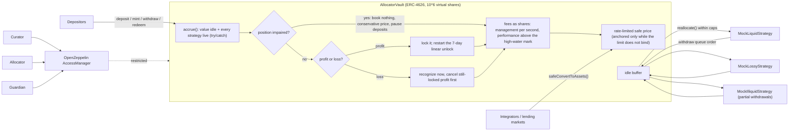

# Curated ERC-4626 Allocator Vault, Hardened Against Inflation and Harvest Sandwiches

A Morpho/Euler-style curated ERC-4626 meta-vault. It allocates one asset across capped strategies behind a
timelocked curator, takes fees only above a high-water mark, unlocks profit linearly, and socializes losses fairly.
Every economic attack comes with a proof of concept that profits against a naive vault and never profits against this
one (P&L <= 0, with the bound asserted).

[](https://github.com/monzon1985/blockchain/actions/workflows/09-erc4626-allocator-vault.yml)


> Technical demonstration. Nothing in this repository has been audited or deployed with real funds.

## What's interesting here

- **Four economic attacks, each run against a naive vault and against this one**, with the bound the defense achieves
  asserted in the test. Donation/inflation: the naive vault loses the victim's whole 1,000-token deposit to the
  attacker; here the attacker burns 4,999.998 tokens to cost the victim 0.0045. Harvest sandwich: +90.91 of a
  100-token harvest for the naive attacker, **0** here in the same block, and at most `yield x dt / 7 days x share`
  when holding, also while older profit is still unlocking. First-mover loss escape: 1,000 vs 500 tokens for early vs
  late withdrawers in the naive vault, **750 / 750** here, and **800 / 800** across a forced removal's write-off, even
  when the early withdrawer flash-deposits liquidity into the strategy to make it look redeemable.
  1-wei loop x1,000: **+1,499 wei** naive, **0** here.
- **One broken strategy cannot freeze the vault.** A strategy whose views revert (EIP-4626 lets a paused strategy do
  that) is counted at 0: every ERC-4626 view keeps answering, withdrawals keep working at the conservative price,
  deposits pause so nobody can buy the markdown, and the curator can force-remove it. Under-funding a transaction
  cannot fake a broken strategy (out-of-gas guard).
- **The a16z ERC-4626 property suite passes with `_delta_ = 0`**: 130 property tests (26 properties x 6-,
  8- and 18-decimal assets, funds in strategies, and a time-and-fees configuration where 8 days pass so profit has
  unlocked and both fees are minted inside every property). It found two real issues during development: a
  `maxRedeem` overflow (fixed) and the exact asset bound of the RAY price math (now documented and tested).
- **9 stateful invariants** (Foundry, 16,384 handler calls per CI run, 0 reverts) driven through pauses, forced
  removals, write-offs and re-listings, and **7 Medusa properties plus preview-equals-execution assertions** in the four
  ERC-4626 actions.
- **15 of 15 hand-written mutants killed**: remove any single defense (virtual shares, profit locking, the restart of
  the unlock, live loss recognition, the forced-removal markdown and its deallocation at announcement, the deposit
  pause and loss deferral while impaired,
  the out-of-gas guard, the rate limiter's anchor and clock, a reentrancy guard, withdraw or deposit rounding, the fee
  bound) and the test written for it fails (`scripts/mutation-check.sh`, run in CI; a mutant that does not compile
  aborts the check).
- **364 tests, 100 % line / statement / branch / function coverage** of `src/`, zero Slither
  (all Medium and High detectors on) and `forge lint` findings after triage. Hardening costs 29.8k gas per
  deposit on top of a plain OpenZeppelin vault, plus ~16.1k per listed strategy for live valuation.

## Overview

An allocator vault pools deposits of one asset and spreads them over several ERC-4626 strategies (lending markets,
other vaults). Getting the share price right is the whole game, and it is harder than it looks:

- The price must not be movable within a transaction, or anyone can inflate it against the next depositor
  (**donation / inflation attack**) or collect yield they never earned (**harvest sandwich**).
- It must reflect losses before anyone can exit, or informed holders leave at a stale price and the last ones pay
  (**first-mover loss escape**). That includes losses a curator is about to crystallize.
- Every conversion must round against the caller, or a loop of tiny operations drains the vault
  (**rounding extraction**).
- One misbehaving strategy must not take the rest of the vault down with it, and its trouble must not become an
  arbitrage for whoever deposits or withdraws at the right moment.
- Integrators that accept the shares as collateral need a price that cannot be pumped. In June 2025, Resupply lost
  about $9.6M when a donation to a nearly empty ERC-4626 vault inflated the price its lending market read
  ([analysis](https://ackee.xyz/blog/resupply-hack-analysis/)).
- Curation (which strategies, how much) must be powerful enough to be useful and slow enough that depositors can
  leave before a bad change lands.

This vault handles all of these in one place, and each defense is demonstrated by an attack that works without it.

## Architecture



| Component | Responsibility | Key external calls |
|---|---|---|
| [`AllocatorVault`](src/AllocatorVault.sol) | ERC-4626 accounting, accrual (profit lock, loss recognition, impairment, fees, high-water mark, safe price), idle buffer, withdraw queue, curation with a 3-day timelock | `strategy.balanceOf / previewRedeem / maxRedeem / maxWithdraw` through `try`/`catch` (valuation, liquidity), `strategy.deposit / withdraw / redeem` (allocation), `AccessManager.canCall` (roles) |
| [`VaultMath`](src/libraries/VaultMath.sol) | Pure math: linear unlock, unlock restart, management and performance fees, fee-share minting, RAY share price, price ceiling | Solady `FixedPointMathLib.fullMulDiv` (512-bit) |
| [`VaultRoles`](src/access/VaultRoles.sol) | Role ids and the selector-to-role wiring, shared by the deploy script and the tests | `AccessManager.labelRole / setTargetFunctionRole` |
| [`IAllocatorVault`](src/interfaces/IAllocatorVault.sol) | External API, events, custom errors (carrying the offending values wherever there are any) | - |
| In-repo strategies ([`test/mocks`](test/mocks)) | `MockLiquidStrategy`, `MockLossyStrategy` (can lose funds), `MockIlliquidStrategy` (lent-out assets are valued but not withdrawable), `MockPausableStrategy` (paused, broken or refusing withdrawals), `MockGasHeavyStrategy`, `MockFeeOnTransferERC20` (the fee-on-transfer asset variant, with a USDT-style fee switch) | - |
| [`NaiveAllocatorVault`](test/naive/NaiveAllocatorVault.sol) | Deliberately vulnerable, test-only: the textbook vault every PoC is run against | - |

**Flows.** Deposits land in the idle buffer. The allocator moves assets into strategies with `reallocate` (targets
per strategy, bounded by each cap). Withdrawals pay from idle first, then pull from strategies in withdraw-queue
order, up to each strategy's `maxWithdraw`, and revert with `InsufficientLiquidity` if that is not enough. Every
entry point first **accrues**: it values idle plus every strategy position live (`previewRedeem`), locks new profit,
recognizes any loss, mints fee shares and checkpoints the safe price. Views compute the same accrual without writing
it, so previews match execution exactly.

**Impaired positions.** A position is impaired when its strategy's views revert, or when a forced removal is pending
and part of the position is still in the strategy (announcing the removal redeems everything the strategy lets the
vault redeem; what is left counts as 0). In both cases it counts as 0, never at a liquidity figure the strategy
reports live, because a third party can raise that for one transaction. While any position is impaired the vault books
no profit or loss, prices every exit at the conservative `min(counted gross assets, booked gross assets - locked
profit)`, which is exactly where booking the markdown as a loss would leave it, and pauses deposits (`maxDeposit` = 0).
When the impairment ends, the position's value is back in the price at once and nothing is re-locked; if it never
ends, the forced removal books the write-off.

## Roles and trust assumptions

Roles are enforced by an OpenZeppelin `AccessManager` (`restricted` modifier). The timelocks live **inside the vault**,
so not even the AccessManager admin can bypass them.

| Role | Can | If compromised |
|---|---|---|
| AccessManager admin | Grant roles, map selectors, replace the vault's authority | Can make itself curator and allocator; bounded by the rows below, including the 3-day timelocks |
| Curator | Submit caps and new strategies (increases wait **3 days**; decreases are immediate), announce a forced removal (its write-off waits 3 days), remove a strategy, submit fees (increases wait 3 days; max 50 % performance, 5 %/year management), set the fee recipient | After a 3-day window the guardian did not veto: list a malicious strategy, raise caps and fees, crystallize a write-off. At once: redirect future fees; announce a forced removal of a zero-cap strategy, which redeems what it can, prices the rest in and pauses deposits (so the curator cannot buy the markdown either) |
| Allocator | `reallocate` within caps, reorder the withdraw queue | Concentrate funds in the riskiest listed strategy up to its cap; churn allocations (at most one strategy share of rounding per move). Cannot send funds anywhere but listed strategies |
| Guardian | Revoke pending caps, strategy additions, forced removals and fee increases; zero any cap instantly | Stall curation and new allocations. Cannot move funds; withdrawals keep working |
| Anyone | `accrue` (harvest), `acceptCap` / `acceptFees` once a timelock has elapsed | Nothing: accrual cannot move the price unfairly, and under-funding it cannot make a strategy look broken |

**Trust assumptions:** listed strategies are honest ERC-4626 vaults over the same asset (a strategy that over-reports
`previewRedeem` mis-prices the vault; that is what the timelock, the guardian and the caps are for); the guardian is
independent from the curator (the deploy script refuses the same address for both); the asset is a standard ERC-20
(fee-on-transfer and rebasing assets are refused) and the vault holds at most 2^186 (~1e56) base units of it, the
exact bound below which every RAY price fits in 256 bits ([`test/unit/AssetBound.t.sol`](test/unit/AssetBound.t.sol)).
The full threat model, mapped to the OWASP Smart Contract Top 10 (2026), is in
[docs/THREAT_MODEL.md](docs/THREAT_MODEL.md).

## Invariants and properties

Foundry invariants in [`test/invariant/AllocatorVaultInvariants.t.sol`](test/invariant/AllocatorVaultInvariants.t.sol),
driven by [`VaultHandler`](test/invariant/handlers/VaultHandler.sol) (deposits, mints, withdrawals, redemptions,
reallocations, strategy yield and losses, donations, lending/repaying in the illiquid strategy, a fourth strategy
pausing and resuming, forced removals and their revocation, removals with write-offs, re-listings, accruals, time),
with fees on and `fail_on_revert = true`. Every run ends with a deterministic probe that, from the run's final state,
ends any impairment, charges a day of fees and realizes a loss through the checked actions, and `afterInvariant`
asserts both paths ran. The same properties run in Medusa ([`AllocatorVaultMedusa`](test/medusa/AllocatorVaultMedusa.sol)).

| # | Property (plain English) | Foundry | Medusa |
|---|---|---|---|
| I1 | The assets all holders could redeem, rounding down, never exceed `totalAssets`. | `invariant_I1_sumOfRedeemableAssetsWithinTotalAssets` | `property_solvency` |
| I2 | The gross assets the vault counts never exceed idle plus each strategy's own valuation of the vault's shares (read from the strategy, not through the vault's code), and the locked profit is part of the booked value. The rest of the check (`totalAssets` + locked profit = gross, or <= booked while impaired) restates the accounting identity and only checks consistency. | `invariant_I2_totalAssetsBackedByRealAssets` | `property_totalAssetsBacked` |
| I3 | The share price never decreases except through an action that can lose value (a loss, a strategy pausing, a forced removal being announced); over a pure time step it can only fall by the management fee. Changes in a strategy's liquidity (lending out or repaying its cash) never lower it, removal pending or not. | `invariant_I3_sharePriceMonotoneApartFromLossesAndFees` | `property_sharePriceMonotoneApartFromLosses` |
| I4 | Fee shares minted by an accrual are worth at most the performance fee times the gain above the high-water mark, plus the management fee times assets times elapsed time; every fee share appears in an `Accrue` event. | `invariant_I4_feeSharesBoundedByHighWaterMarkGain` | `property_feeSharesBoundedByHighWaterMarkGain` |
| I5 | The high-water mark never decreases. | `invariant_I5_highWaterMarkNeverDecreases` | `property_highWaterMarkNeverDecreases` |
| I6 | An accrual writes exactly what `previewAccrual` predicted (views and execution agree), and an impaired accrual books nothing. | `invariant_I6_accrualMatchesPreview` | `property_accrualMatchesPreview` |
| I7 | No profit is scheduled to unlock more than 7 days ahead. | `invariant_I7_unlockScheduleBounded` | - |
| I8 | `safeSharePrice` is never above `sharePrice`. | `invariant_I8_safePriceNeverAboveSharePrice` | `property_safePriceNeverAboveSharePrice` |
| I9 | Every holder's `maxWithdraw` and `maxRedeem` actually execute (run under a state snapshot), and `maxWithdraw` is covered by liquidity summed independently in the test (idle plus each strategy's own `maxWithdraw`). | `invariant_I9_maxWithdrawAndMaxRedeemExecute` | asserted inside `withdraw` / `redeem` |

"Losses" in I3 include the rounding of moving assets through an ERC-4626 strategy, which can lose up to one strategy
share per move; the handler allows exactly that much slack and no more.

## Security considerations

### The four attack PoCs

Each file in [`test/attacks`](test/attacks) runs the attack against
[`NaiveAllocatorVault`](test/naive/NaiveAllocatorVault.sol) (the textbook design) and against `AllocatorVault`, and
asserts the bound. Numbers are from `forge test --match-path "test/attacks/*" -vv` (18-decimal asset, amounts in
tokens unless noted).

| Attack | Naive vault | AllocatorVault | Bound asserted |
|---|---|---|---|
| **Donation / inflation.** Attacker deposits 1 wei, donates, victim deposits 1,000 | Attacker **+1,000** (steals the deposit); victim -1,000 | Attacker waits out the 7-day unlock and still ends **-4,999.998** on a 10,000 donation; victim -0.0045. Same block: victim loses **0** | victim loss <= donation / 10^6; attacker loses > 49 % of the donation |
| **Harvest sandwich.** 10x flash deposit before the harvest, redeem after | Attacker **+90.91** of a 100 harvest | **0** in the same block; +0.5411 after holding 1 hour; with 10,000 of older profit one day from unlocked, the new 100 earns the attacker **-574.56** (the restart slows the older profit down) against a bound of +10.16 | P&L <= 0 same block; gain from the harvest <= yield x dt / 7 days x share, fuzzed with and without older locked profit at any phase |
| **First-mover loss escape.** Half the vault is in a strategy that loses 50 % | First out gets **1,000**, last gets **500** | Both get **750**. Across a forced removal of a strategy with 400 stuck: **800 / 800** (the write-off is priced in when announced), also when the early holder flash-deposits 400 into the strategy in the same transaction | same price for any amounts, loss and order (fuzzed); exit during the removal window = payout after the write-off |
| **1-wei deposit/withdraw x1,000** at a share price of 1.5 | Attacker **+1,499 wei** and 1,000 free shares | **0 wei**: never profits; 1,000 share units (worth less than a wei) stay in the vault | P&L <= 0; honest holders never lose |

The donation PoC also runs two OpenZeppelin `ERC4626` baselines to separate the effect of each defense: at
**offset 0** (1 virtual share) the victim is still wiped out but the attacker ends -500 on a 2,000 donation
(griefing, not theft); at **offset 6** alone the victim loses at most donation / 10^6. On top of that, the profit
lock means a donation does not move the price at all in the transaction it is made.

### Resupply-class risk: using the shares as collateral

`convertToAssets` of any ERC-4626 vault is manipulable when the supply is tiny: a donation to a nearly empty vault
multiplies the price. A lending market that trusts it can be drained, and a market that divides by it
(`1e36 / price`) can round the collateral requirement to zero, which is what happened to Resupply. This vault gives
integrators three layers:

1. **Donations do not move the price in the transaction** (they are profit, locked for 7 days).
2. **`safeSharePrice()` / `safeConvertToAssets()`** grow at most `maxSharePriceGrowthPerYear` (an immutable, at most
   100 %/year; 25 %/year in the tests), linearly from the last checkpoint at which the limit did not bind, and follow
   losses down immediately. While the limit binds the checkpoint stays put, so calling `accrue()` often cannot
   compound it (1.25x over a year with daily accruals, [`test_safePrice_frequentAccrualsDoNotCompoundTheLimit`](test/unit/RateLimiter.t.sol));
   while a position is impaired the limiter's clock stops, so no headroom builds up behind the conservative price. In
   [`test_safePrice_resupplyClassInflationIsBounded`](test/unit/RateLimiter.t.sol) an attacker owning a 1-wei position
   donates 1,000 tokens and waits out the unlock: `convertToAssets` of the position jumps above 400 tokens, while
   `safeConvertToAssets` stays at its pre-attack value.
3. Deposits that would mint zero shares revert (`ZeroShares`) instead of silently donating.

Integrators should still seed new vaults with a dead-share deposit, never divide by a vault price without a zero
check, and cap how fast they accept collateral value growth.

### Rounding directions

| Quantity | Direction | Why | Proven by |
|---|---|---|---|
| `deposit` / `previewDeposit` / `convertToShares` shares | down | A depositor never gets more shares than paid for | `testFuzz_previewDeposit_roundsDown` (6/8/18 dec.), a16z `prop_previewDeposit`, mutant 6 |
| `mint` / `previewMint` assets | up | A minter pays at least the full value | `testFuzz_previewMint_roundsUp`, `test_mint_pullsAssetsRoundedUp` |
| `withdraw` / `previewWithdraw` shares burned | up | A withdrawer burns at least the full value | `testFuzz_previewWithdraw_roundsUp`, `test_withdraw_burnsSharesRoundedUp`, `testFuzz_mintThenWithdraw_neverProfits`, mutant 1 |
| `redeem` / `previewRedeem` / `convertToAssets` assets | down | A redeemer never takes more than the shares are worth | `testFuzz_previewRedeem_roundsDown`, `test_redeem_paysAssetsRoundedDown` |
| `maxWithdraw`, `maxRedeem` | down, capped by liquidity | Always executable, never revert | `testFuzz_maxWithdrawAndMaxRedeem_areAlwaysExecutable`, invariant I9, `test_maxRedeem_doesNotRevertWithHugeLockedDonation` |
| Zero-share deposit | revert | Never take assets for nothing | `test_deposit_revertsWhenItWouldMintZeroShares` |
| Strategy position value | down (strategy's own `previewRedeem`; 0 for what is left while a forced removal is pending, the redeemable part having been redeemed when it was announced; 0 if its views revert) | Never over-state what the vault can recover, and never trust a live liquidity figure a flash deposit can move | invariant I2, `test/unit/Impairment.t.sol`, `test/unit/StrategyRemoval.t.sol` |
| Unlocked profit | down (the locked part rounds up) | `totalAssets` never runs ahead of the schedule | `test_profit_unlockRoundsTheLockedPartUp`, `testFuzz_lockedProfitAt_matchesCeilReference` |
| Unlock end when new profit arrives | latest: a full 7 days for everything still locked | No profit ever unlocks faster than over its own 7 days | `testFuzz_lockProfit_neverUnlocksAnyProfitFasterThanItsOwnPeriod`, `testFuzz_sandwich_hardened_boundHoldsWithProfitAlreadyLocked` |
| Management and performance fee assets | down | Against the fee recipient | `testFuzz_managementFeeAssets_roundsDown`, `test_performanceFee_*`, invariant I4 |
| Fee shares minted for a fee | down | The recipient never gets more than the fee | `testFuzz_feeShares_worthAtMostTheFee` |
| Share price (RAY) and safe-price ceiling | down | The mark and the collateral price are never over-stated | `testFuzz_sharePrice_matchesReference`, `testFuzz_priceCeiling_growsLinearlyFromCheckpoint`, invariant I8 |
| `safeConvertToAssets` | down | Never above `convertToAssets` | `test_safeConvertToAssets_neverExceedsConvertToAssets` |

The rounding fuzz tests compare every preview against OpenZeppelin's `Math.mulDiv` with an explicit rounding mode,
an independent implementation from the Solady `fullMulDiv` the vault uses.

### Other defenses

- **Read-only reentrancy.** Every state-changing entry point is `nonReentrant` (transient storage) and every price
  view is `nonReentrantView`: mid-withdrawal, shares are already burned while the assets still sit in a strategy,
  and a naive view would report an inflated price. [`test/unit/Reentrancy.t.sol`](test/unit/Reentrancy.t.sol) uses a
  hostile strategy that calls all 17 price views and 11 guarded entry points mid-call; each must revert with
  `ReentrancyGuardReentrantCall`, so dropping the guard from any single one fails the test.
- **Strategies that stop answering.** Valuation and liquidity views are called through `try`/`catch`; a failing
  position counts as 0 and impairs the vault (see Architecture). A strategy call that comes back with a quarter or
  less of the gas it was given reverts the whole transaction instead, because an out-of-gas failure can be forced by
  the caller and would otherwise fake an impairment
  ([`test_outOfGasInAStrategyIsNeverTreatedAsAFailingStrategy`](test/unit/Impairment.t.sol)).
- **Fee-on-transfer / rebasing assets** are refused on deposit (`AssetTransferMismatch`). If an asset turns a fee on
  later (USDT has a dormant fee switch), a withdrawal that needs strategy liquidity reverts with
  `StrategyUnderDelivered` instead of being topped up from other depositors' idle assets; the curator's removal then
  realizes the fee as a loss for everyone ([`test/unit/FeeOnTransfer.t.sol`](test/unit/FeeOnTransfer.t.sol)).
- **Strategy removal** first redeems everything the strategy lets it redeem. Writing off what is left (or a position
  the strategy cannot value at all) requires a forced removal that waited out its own 3-day timelock. Announcing the
  forced removal already redeems everything redeemable, and from then on the rest of the position counts as 0, so the
  write-off reaches the price at once, deposits pause, and holders who exit during the window get exactly what holders
  who stay get after it ([`test_remove_forcedRemovalWindowGivesNoFirstMoverEscape`](test/unit/StrategyRemoval.t.sol)).
  Counting the position at what the strategy says is redeemable *now* would not be enough: a holder could deposit
  flash-loaned liquidity into the strategy, exit at the pre-write-off price and take the liquidity back out in one
  transaction (1,000 vs 600 in a release-gate PoC, now
  [`test_remove_flashLiquidityCannotReopenTheFirstMoverEscape`](test/unit/StrategyRemoval.t.sol)). Revoking the
  removal restores the value at once; borrowers repaying during the window count once the funds are actually
  recovered (by the allocator, or by the removal itself). Re-listing a written-off strategy brings its value back as
  locked profit.
- **Timelocked state is fully evented.** Every pending cap or fee that is dropped (revoked by the guardian, or cleared
  by a cap decrease, `zeroCap`, a removal or a fee decrease) emits `RevokePendingCap` / `RevokePendingFees`, so
  monitors never see a pending change that no longer exists.

### Known limitations

Strategy honesty is assumed; losses a strategy has not reported yet are invisible; strategy rounding is socialized
(bounded); holders who leave during an unlock window forgo still-locked profit, and new profit restarts the 7-day line
for older profit (it unlocks more slowly when profit keeps arriving); withdrawals during an impairment pay the
conservative price (stayers keep the haircut if the markdown reverses; whatever part of it lifts the share price above
the high-water mark pays the performance fee, like any other gain above the mark), and repayments into a strategy whose
removal is pending only count once recovered; the transaction that announces a loss can be front-run like any loss event
(curators should use a private relay); a non-compliant strategy that reports liquidity it then refuses blocks the
withdrawals that reach it until the allocator reorders the queue; a strategy whose views burn all the gas they are given
(rather than reverting) cannot be told apart from an under-funded call, so it blocks the vault and cannot be removed;
fee-on-transfer assets are not supported; liquidity is only as good as the strategies' `maxWithdraw`.
Details in
[docs/THREAT_MODEL.md](docs/THREAT_MODEL.md#5-known-limitations). Static-analysis triage is in
[docs/STATIC_ANALYSIS.md](docs/STATIC_ANALYSIS.md).

## Design decisions and trade-offs

| Decision | Alternative | Why |
|---|---|---|
| Value strategies **live** on every entry point | Cache values and refresh on `harvest()` (cheaper) | A cache is exactly what enables the first-mover loss escape. Cost: ~16.1k gas per listed strategy per call, bounded by `MAX_STRATEGIES = 20` |
| Lock all profit and release it **linearly over 7 days**; new profit **restarts the 7-day line** for everything still locked (as in Yearn V2 and Euler Earn) | Instant profit; or a profit-weighted unlock end (Yearn V3) | Instant profit is what makes sandwiches and donation inflation work. A weighted end lets new profit unlock in a fraction of 7 days while older profit is still unlocking (a review PoC took ~5x the stated sandwich bound that way); restarting is the only single-line schedule under which no profit unlocks faster than over its own 7 days. Cost: older profit unlocks more slowly while profit keeps arriving (about 7 days of yield stays locked instead of 3.5), and a 1-wei donation can delay it, never redirect it |
| **Losses cancel still-locked profit first**, and the rest hits the price at once | Separate loss smoothing | Locked profit never reached the price, so cancelling it is fair to everyone; smoothing losses would reopen the first-mover escape |
| An **impaired position books nothing, prices exits conservatively and pauses deposits** | Revert (freezes the vault, idle funds included); count it at 0 and book the loss; a guardian emergency write-off | Reverting froze the whole vault behind one paused strategy. Booking the loss would re-lock the recovery as profit for 7 days, ratchet the safe price down for years, and let anyone deposit into the markdown before it reverses. A guardian write-off needs a human and gives the guardian a value-moving lever |
| A **forced removal redeems what it can when it is announced, and the rest counts as 0** while it is pending | Count the position in full until the removal executes; or count what the strategy reports as redeemable now (`maxRedeem`) | Counting in full made the public 3-day window a first-mover escape (1,000 vs 600 in the review PoC). Counting the live redeemable amount let a holder raise it for one transaction with a flash-loaned deposit into the strategy (1,000 vs 600 again). Cost: repayments during the window reach the price only once the funds are recovered |
| **Timelocks inside the vault** (pending caps, fees, removals), roles in `AccessManager` | Only AccessManager execution delays | An execution delay is a property of a role grant that the admin can change; in-vault timelocks bind every role, the admin included, and are visible on-chain as pending values |
| **Idle buffer; deposits are not auto-supplied** | Supply queue on deposit (MetaMorpho) | Cheaper deposits and no strategy calls on the deposit path; allocation is an explicit, capped allocator action |
| **High-water mark tracks the price even with a zero fee** | Update the mark only when a fee is charged | Turning the performance fee on later cannot charge fees on gains made while it was off |
| Fee shares minted with Morpho's formula `fee * (supply + 1e6) / (totalAssets + 1 - fee)` | Transfer assets | No liquidity needed to pay fees; the recipient's shares are worth exactly the fee, rounded down |
| **Refuse fee-on-transfer assets** | Credit the received amount | Crediting breaks ERC-4626 preview guarantees; refusing is safe and testable |
| `ZeroShares` revert on deposit, **no** zero-asset revert on redeem | Revert on both | A zero-share deposit only ever hurts the depositor. Reverting a zero-asset redeem would make `maxRedeem` over-report what is executable, which ERC-4626 forbids |
| Rate limiter is an **immutable** growth cap, anchored only while it does not bind | Governance-set; re-anchor on every accrual | One less parameter a compromised curator could loosen. Re-anchoring at the ceiling on every accrual compounded the cap (1.2839x a year with daily accruals at 25 %) |
| Solady `fullMulDiv` for all math | OpenZeppelin `Math.mulDiv` | Cheaper; differential-tested against OpenZeppelin in every rounding test |
| `optimizer_runs = 1_000` | `10_000` | 22,764 B runtime (1,812 B under EIP-170). At `10_000` the vault is 25,732 B, 1,156 B over the limit: it would not deploy |

## Testing

```bash
forge soldeer install                  # dependencies (Soldeer, locked)
forge fmt --check
forge build
forge build --sizes src               # production sizes (the test-only Medusa harness exceeds EIP-3860)
forge test                             # 364 tests
FOUNDRY_PROFILE=ci forge test          # the CI profile: fixed seed 0x09, 1,024 fuzz runs, 128 x 128 invariants
forge snapshot --check --match-contract GasBench
forge lint --deny warnings
forge coverage --fuzz-seed 0x09 --report summary --no-match-coverage "(test|script|dependencies)"
medusa fuzz --config medusa.json --timeout 300
slither . --config-file slither.config.json --fail-medium
bash scripts/mutation-check.sh         # 15 mutants, each must compile and be killed
bash script/local-demo.sh              # end to end on anvil (free port), outcomes asserted
```

| Suite | Path | Tests | What it covers |
|---|---|---:|---|
| Unit | `test/unit` | 167 | Every entry point's happy path and every revert path; fees, unlocking, removal, impairment (paused, broken and refusing strategies, the out-of-gas guard), rate limiter, reentrancy, fee-on-transfer, the asset bound, `VaultMath` (unit + differential fuzz), the deploy script and its input checks |
| Fuzz, 6 / 8 / 18 decimals | `test/fuzz` | 27 | Rounding of all four previews against OpenZeppelin `mulDiv`, no-profit round trips, `max*` always executable, linear unlock, equal loss scaling, on a randomized prior state with fees |
| Attack PoCs | `test/attacks` | 17 | The four attacks, naive vs hardened, plus OpenZeppelin baselines; three fuzz tests among them |
| a16z ERC-4626 properties | `test/erc4626` | 131 | 26 properties x (6, 8, 18 decimals, funds in strategies, time and fees), `_delta_ = 0`, plus one check that the time-and-fees configuration really has fees pending |
| Invariants | `test/invariant` | 1 campaign, 9 invariants | I1-I9 above |
| Medusa harness smoke and replay | `test/medusa` | 4 | The Medusa harness deploys and keeps its properties (and assertions) under Foundry; the call sequence Medusa shrank in CI is replayed call for call, with the removal's fee checked per accrual and a counterfactual without the exit |
| Gas | `test/gas` | 17 | Snapshot below |
| **Total** | | **364** | 168 of them property-based (fuzzed) |

- **Coverage** of `src/`: **100.00 % (479/479)** lines, **100.00 % (598/598)** statements, **100.00 % (95/95)** branches and
  **100.00 % (86/86)** functions.
- **Fuzz settings**: 256 runs locally, 1,024 in CI with fixed seed `0x09` (also used by the CI coverage and attack
  report steps, so a failure anywhere reproduces locally). Inputs are constrained with `bound()`; `vm.assume` appears
  inside the a16z suite (including keeping its time-and-fees configuration inside the documented asset bound and away
  from the fee recipient as a suite user) and in two fuzz tests that skip randomized states without enough strategy
  liquidity for a full exit.
- **Invariant settings**: 64 runs x 128 depth locally (8,192 calls), 128 x 128 in CI (16,384 calls),
  `fail_on_revert = true`, 0 reverts.
- **Medusa**: 7 property tests (I1-I6, I8), checked after every call, plus `assert`s inside the four ERC-4626 actions
  (each executes exactly at its preview, and a `withdraw` / `redeem` bounded by `maxWithdraw` / `maxRedeem` or a deposit
  allowed by `maxDeposit` never reverts). 4 workers, 300 s, random time gaps up to 2 days. Medusa cannot read event
  logs, so the fee property bounds each accrual from the vault state around it, at the totals that accrual priced at:
  every vault call the harness makes accrues first, except that `removeStrategy` accrues again after redeeming the
  position (realizing its write-off, or the deferred PnL of an impaired position that has been recovered); the harness
  accrues explicitly before it and checks the removal's fee at the post-removal totals. A sequence Medusa shrank in CI,
  where the bound had used the pre-removal totals, is replayed in `test/medusa/MedusaRegression.t.sol`. Medusa's summary
  lists every one of the harness's 16 actions as an "assertion test"; only those four contain assertions, the other 12
  cannot fail and are not counted here. Last local run: 0 failures, 329,560 calls, 3,181 branches (throughput varies by
  machine; see the CI log).
- **Mutation check**: removing each defense makes its own test fail (withdraw rounding -> fuzz, burned shares checked
  against the preview; doubled performance fee -> fee tests; no profit lock and a shortened (weighted) unlock ->
  sandwich PoCs; hidden loss -> first-mover PoC; offset 0 -> donation PoC; deposit rounding up -> 1-wei PoC; pending
  removal counted in full, and no deallocation when a removal is announced -> removal tests; deposits allowed or the markdown booked as a loss while impaired, and the
  limiter's clock running while impaired -> impairment tests; no out-of-gas guard -> gas guard test; re-anchoring at
  the ceiling -> rate-limiter tests; `totalAssets` without its reentrancy guard -> reentrancy test). A mutant that no
  longer compiles aborts the check instead of counting as killed.

## Gas

`forge snapshot --match-contract GasBench` (committed in `.gas-snapshot`, checked in CI). Every test makes one call
on a prepared state with fees on, pending unlock and pending fees, so each entry point runs a full accrual.

| Operation | 3 strategies listed | No strategy listed | OpenZeppelin ERC4626 (offset 6) |
|---|---:|---:|---:|
| `deposit` | 145,424 | 97,138 | 67,345 |
| `withdraw` (from idle) | 142,894 | 94,642 | 68,484 |
| `withdraw` pulling from 2 strategies | 183,919 | - | - |
| `mint` | 145,564 | - | - |
| `redeem` (all shares) | 147,774 | - | - |
| `accrue` (keeper harvest) | 107,163 | 58,929 | - |
| `reallocate` (2 moves) | 200,553 | - | - |
| `submitCap` (new strategy) | 79,087 | - | - |
| `zeroCap` (guardian) | 57,433 | - | - |
| `totalAssets` / `maxWithdraw` / `safeConvertToAssets` (views) | 78,320 / 96,830 / 81,585 | - | - |

Reading the table: the accrual machinery (profit lock, fees, high-water mark, safe-price checkpoint, events) costs
~29.8k gas per deposit over a plain OpenZeppelin vault, and live valuation (now through `try`/`catch`, with
the out-of-gas check) adds ~16.1k per listed strategy.

## Getting started

Prerequisites: [Foundry](https://getfoundry.sh) 1.8.3 (`foundryup -i v1.8.3`). Optional: Medusa 1.5.1 and
crytic-compile 0.4.2, Slither 0.11.6 (`uv tool install slither-analyzer==0.11.6`).

```bash
cd projects/09-erc4626-allocator-vault
forge soldeer install
forge build
forge test
bash script/local-demo.sh
```

The local demo starts anvil on a free port and uses real chain time (`evm_increaseTime`) between three phases:
deploy and submit caps; after 3 days accept the caps, allocate and let a strategy harvest 7,000 mUSD (all of it is
locked); after 3.5 more days half is unlocked, the safe price lags the share price, and 10 % of the position is
redeemed. Those outcomes are checked, not only printed: `LocalDemo.report()` reverts unless half the harvest (within
1 %) is still locked, the safe price is below the share price and the redemption pays exactly its preview, and the
shell driver re-reads `totalAssets`, `sharePrice` and `safeSharePrice` on-chain with `cast` and fails if they are out
of range. Deploying for real uses a keystore, never a raw key:

```bash
cp .env.example .env   # fill in ASSET, ADMIN, CURATOR, ALLOCATOR, GUARDIAN, FEE_RECIPIENT
forge script script/DeployAllocatorVault.s.sol --rpc-url <url> --account <keystore-name> --broadcast
```

The script refuses to broadcast if ADMIN, CURATOR, ALLOCATOR or GUARDIAN is zero (`.env.example` ships zeros as
placeholders; a zero ADMIN would leave the AccessManager without any administrator once the deployer renounces) or if
GUARDIAN equals CURATOR. It then wires every selector through `VaultRoles`, grants the roles, hands the AccessManager
admin role to `ADMIN` and renounces the deployer's (covered by `test/unit/DeployScript.t.sol`).

## Project structure

```
09-erc4626-allocator-vault/
├── src/
│   ├── AllocatorVault.sol            # the vault
│   ├── access/VaultRoles.sol         # role ids and selector wiring
│   ├── interfaces/IAllocatorVault.sol
│   └── libraries/VaultMath.sol       # unlock, fees, price, rate limiter
├── test/
│   ├── attacks/                      # 4 attack PoCs, naive vs hardened
│   ├── erc4626/                      # a16z property suite wiring (AGPL-3.0)
│   ├── fuzz/                         # 6/8/18-decimal fuzz tests
│   ├── gas/                          # GasBench
│   ├── invariant/                    # invariants + handler
│   ├── medusa/                       # Medusa harness + Foundry smoke test
│   ├── mocks/                        # strategies (incl. pausable and gas-heavy), assets, OZ baseline, hostile strategy
│   ├── naive/                        # NaiveAllocatorVault (deliberately vulnerable)
│   ├── unit/
│   └── utils/VaultFixture.sol
├── script/                           # keystore deploy, local demo (+ shell driver)
├── scripts/mutation-check.sh
├── docs/                             # THREAT_MODEL.md, STATIC_ANALYSIS.md
├── foundry.toml, soldeer.lock, medusa.json, slither.config.json, .gas-snapshot
```

## Scope notes and future work

- **Slither gate flag.** The spec's command uses `--fail-on medium`; Slither 0.11.6 rejects that flag (exit 2,
  "unrecognized arguments"), so the gate is the equivalent `--fail-medium` (the code also passes `--fail-low`). The
  spec's command should be corrected; nothing in the project depends on it.
- **"Offset 0" in the donation PoC.** With OpenZeppelin's virtual share, an offset of 0 already makes the classic
  attack unprofitable (the victim still loses; the attacker loses too). The PoC therefore shows theft against the
  classic no-virtual-share formula (the naive vault) and reports OpenZeppelin offset 0 and offset 6 separately.
- **Fee-on-transfer assets** are handled by refusing them, not by supporting them (see design decisions).
- **Strategies are mocks.** Real integrations (Morpho Blue markets, Aave, other ERC-4626 vaults) would each need an
  adapter review; the vault only assumes the ERC-4626 interface.
- Future work: a supply queue for automatic allocation, a public allocator with flow caps (as in Morpho), per-strategy
  loss tolerances, skipping (rather than reverting on) a strategy that refuses a withdrawal it reported as available,
  ERC-7540 asynchronous redemptions for illiquid strategies, and an ERC-7201 upgradeable variant.

## License

MIT (SPDX header in every source file). One exception:
[`test/erc4626/A16zPropertySuite.t.sol`](test/erc4626/A16zPropertySuite.t.sol) extends a16z's AGPL-3.0 property
suite and is therefore AGPL-3.0-only; nothing in `src/` depends on it.

## References

- [EIP-4626: Tokenized Vaults](https://eips.ethereum.org/EIPS/eip-4626)
- OpenZeppelin, [ERC-4626 inflation-attack analysis and virtual shares](https://docs.openzeppelin.com/contracts/5.x/erc4626),
  `ERC4626`, `AccessManager`, `ReentrancyGuardTransient` (Contracts 5.7.0)
- a16z, [ERC-4626 property tests](https://github.com/a16z/erc4626-tests) (used as-is)
- Morpho, [MetaMorpho / Morpho Vaults](https://github.com/morpho-org/metamorpho): curator / allocator / guardian roles,
  timelocked caps, forced market removal, fee-share formula
- Euler, [Euler Earn](https://github.com/euler-xyz/euler-earn): interest smearing restarted on every harvest, strategy
  emergency status
- Yearn, [V2 vaults](https://github.com/yearn/yearn-vaults) (locked profit restarted on every report) and
  [V3 vaults](https://github.com/yearn/yearn-vaults-v3) (profit-weighted unlock, losses absorbed by locked profit)
- Solady, [`FixedPointMathLib`](https://github.com/Vectorized/solady) (0.1.26)
- Resupply incident (June 2025): [Ackee Blockchain analysis](https://ackee.xyz/blog/resupply-hack-analysis/),
  [QuillAudits analysis](https://www.quillaudits.com/blog/hack-analysis/resupply-hack-analysis)
- [OWASP Smart Contract Top 10 (2026)](https://scs.owasp.org/sctop10/)
- Crytic, [Medusa](https://github.com/crytic/medusa) and [Slither](https://github.com/crytic/slither)
