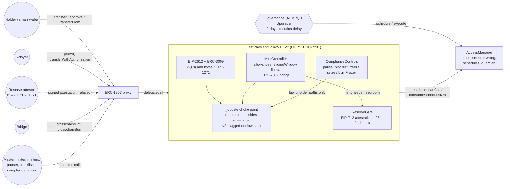

# Regulated Payment Stablecoin: GENIUS-Style Issuer Controls (Test Token)

A clearly labelled test payment stablecoin, the **Test Payment Dollar (tPD)**: UUPS-upgradeable with ERC-7201 storage, per-minter allowances and rolling 24 h limits, minting gated on EIP-712 reserve attestations, pause / blocklist / freeze, seizure and burning under a recorded lawful-order reference, and gasless EIP-2612, ERC-3009 and ERC-1271 payments, all wired through an OpenZeppelin AccessManager with 2-day governance delays.

[](https://github.com/monzon1985/blockchain/actions/workflows/10-regulated-payment-stablecoin.yml)
[](../../LICENSE)


> **Technical demonstration.** tPD is a test token for local chains only. It is not a stablecoin, is backed by nothing, is not affiliated with any issuer or brand, is not a compliant financial product under the GENIUS Act or any other regime, has never been deployed to a public network and has not been audited.

## What's interesting here

- **One stateful invariant proves that nothing moves to or from a frozen or blocklisted account** on any of the 11 value-moving paths (transfer, transferFrom, permit + transferFrom, both ERC-3009 flavours, mint, burn, bridge mint, bridge burn, seize, burnFrozen; ECDSA and ERC-1271 signatures), except through a lawful order, before and after a mid-run v1 to v2 upgrade through the real 2-day schedule ([I-1](#invariants); campaign statistics under [Testing](#testing)).
- **Seeded bugs get caught.** [`scripts/mutation-smoke.mjs`](scripts/mutation-smoke.mjs) re-injects 9 realistic bugs into a temporary copy of the project (never into `src/`). **9/9 are killed, each by every test named for it**; the bug introduced by the upgrade is caught by both I-1 and I-6. Medusa's assertion mode is armed as well: with the sender check removed from `_update`, Medusa reports failed `assert` postconditions within seconds.
- **Supply caps, each independently tested: three on minter issuance, two on bridge issuance.** Minters: per-minter allowance (USDC-style), per-minter rolling 24 h window (OpenZeppelin `RateLimiter.SlidingWindow`, checked against a naive reference model using the limits the test configured, never values read back from the token), and fresh EIP-712 reserve attestations (26 h max age, strictly increasing, bound to chain id and proxy). Bridges: per-bridge rolling windows plus the same reserve gate. [I-2](#invariants) (supply <= latest attested reserves, and no growth at all while a recorded shortfall is outstanding) holds across the 89 shortfall attestations injected in the example campaign.
- **164 Foundry tests, 23 Node tests; Medusa checks 5 properties plus `assert` postconditions in 17 of its 24 actions (243,492 calls in 300 s, 0 failures); 100 % line, branch and function coverage** of `src/` (280/280 lines, 98/98 branches, 65/65 functions; CI fails below 90 % lines or branches). Slither and `forge lint` report 0 findings after documented triage.
- **Upgrade and governance safety that is checked, not assumed.** The deployment always leaves ADMIN behind the 2-day delay, even when the deployer is governance. A storage-layout gate checks the 10 v1 namespaces append-only against the v1 baseline, plus v2's new namespace against the committed snapshot (37 members in total, OpenZeppelin's included). A post-deploy script reads the ERC-1967 slot and rebuilds the role graph from AccessManager events: it flags an unexpected implementation, extra or pending members, wrong or pending delays, guardian and selector changes, and every operation still scheduled (12 of its 16 tests seed a specific drift). A compliant transfer costs 50,750 gas vs 34,477 for a bare OpenZeppelin ERC-20.

## Overview

The GENIUS Act (the US federal framework for payment stablecoins, 2025) expects an issuer to be able to freeze, seize and burn tokens when legally ordered, to issue only against reserves, and to publish reserve attestations. Issuers such as Circle (USDC) and Paxos (USDP, PYUSD) implement variants of these controls. Each control is simple on its own; the hard part is that **every one of them must hold on every path that moves value**, including the gasless ones (EIP-2612, ERC-3009, ERC-1271 smart wallets), the bridge (ERC-7802) and the next implementation after an upgrade. One forgotten path (a `transferFrom` that does not check the spender, a relayed authorization that skips the freeze, a v2 hook that no longer calls the v1 checks) turns "frozen" into "slightly inconvenienced".

tPD addresses that by design and by testing:

1. **One choke point.** Every balance change goes through `_update`, which enforces the pause and the restriction of both sides. The only two paths that may debit a frozen account (`seize`, `burnFrozen`) call the ERC-20 base directly, require a frozen source, an unrestricted destination, a lawful-order reference and an unpaused token.
2. **Independent supply caps**: three on minter issuance (allowance, rolling 24 h limit, attested reserves) and two on bridge issuance (per-bridge rolling 24 h limit, attested reserves).
3. **Governance as data.** All permissions live in an AccessManager: the upgrade and every role-admin selector need a 2-day schedule, the pauser can cancel a pending upgrade, and a script re-derives the role graph, the proxy implementation and every pending operation after each deployment.
4. **Tests that attack the design**: unit tests per role and entry point, EIP-712 signature fuzzing (wrong domain, expiry, replay, fork, ERC-1271), handler-based invariants in Foundry and Medusa, an upgrade test with sentinels, a storage-layout gate and a mutation smoke test.

## Architecture



| Component | Responsibility | Key external calls |
|---|---|---|
| [`TestPaymentDollarV1`](src/TestPaymentDollarV1.sol) | ERC-20 (6 decimals), EIP-2612, ERC-3009 (random 32-byte nonces) with `bytes` overloads for ERC-1271, UUPS upgrade authorised by the AccessManager, the `_update` / `_approve` choke points; `version()` is the EIP-712 domain version, `implementationVersion()` the logic version | `SignatureChecker` (ERC-1271 `staticcall`), AccessManager |
| [`ComplianceControls`](src/modules/ComplianceControls.sol) | Pause, sanctions blocklist, lawful-order freezes, `seize` and `burnFrozen` with an order reference | AccessManager (`restricted`) |
| [`ReserveGate`](src/modules/ReserveGate.sol) | EIP-712 reserve attestations (permissionless relay, strictly newer, <= 26 h old), reserve headroom check on every supply increase, shortfall recording | `SignatureChecker` |
| [`MintController`](src/modules/MintController.sol) | USDC-style `configureMinter` / `removeMinter`, per-minter rolling 24 h `SlidingWindow`, governance ceiling, ERC-7802 bridge with its own per-bridge mint and burn windows (a blocklisted or frozen bridge is refused) | AccessManager (bridge check) |
| [`TestPaymentDollarV2`](src/TestPaymentDollarV2.sol) | Inherits v1 unchanged; adds a rolling 24 h outflow cap for accounts flagged by compliance, in a new namespace | none |
| [`StablecoinDeployment`](script/StablecoinDeployment.sol) | Single source of truth for deployment and wiring (ADMIN always ends behind the 2-day delay), used by the deploy script, every test fixture and the Medusa harness | AccessManager admin functions |
| [`RoleGraph`](script/RoleGraph.sol) + [`VerifyRoles.s.sol`](script/VerifyRoles.s.sol) | Post-deploy verification of the ERC-1967 implementation (recorded v1 or v2 address), members, current and pending execution delays, admins, guardians, grant delays, every selector mapping and every operation still scheduled, rebuilt from AccessManager events | `eth_getLogs`, AccessManager views, `vm.load` |

State lives in four project namespaces (`tpd.storage.Compliance`, `.Reserves`, `.Minting`, and v2's `.TransferCaps`) next to OpenZeppelin's own. Runtime sizes: v1 20,344 bytes, v2 21,581 bytes (EIP-170 limit 24,576).

## Roles and trust assumptions

| Role | Can | Delay | Compromised key can at most |
|---|---|---|---|
| ADMIN (governance) | grant / revoke roles, rewire selectors, set attestor, ceilings and bridge limits | 2 days | everything, after a public 2-day window |
| UPGRADER | `upgradeToAndCall` | 2 days (PAUSER can cancel) | replace the implementation, after 2 days unless cancelled |
| MASTER_MINTER | configure / remove minters (limits <= ceiling) | none | raise existing minters to the ceiling, or remove them |
| MINTER | mint within allowance, rolling limit and reserves; burn own balance | none | `min(allowance, daily limit, reserve headroom)` per 24 h |
| PAUSER | pause / unpause, cancel scheduled upgrades | none | halt transfers; unpause during an incident; cancel (veto) every scheduled upgrade; cannot move funds |
| BLOCKLISTER | blocklist / unblocklist | none | censor or release addresses; cannot move funds |
| COMPLIANCE_OFFICER | freeze, unfreeze, seize, burnFrozen (v2: flag accounts) | none | seize any holder's balance (pause stops it) |
| BRIDGE | ERC-7802 mint / burn within per-bridge rolling limits | none | mint / burn up to its limits per 24 h, until the bridge address is blocklisted or frozen (instant) |
| Reserve attestor (key) | sign attestations | n/a | inflate reserves (the allowance and rolling-limit caps still apply) or block issuance |

The full analysis, including worst-case issuance per 24 h and the hardening options, is in [docs/ROLE-COMPROMISE.md](docs/ROLE-COMPROMISE.md). Trust assumptions: the attestor reports honestly (the contract enforces freshness and binding, not truth), OpenZeppelin's AccessManager behaves as specified, and lawful orders come from a legitimate off-chain process.

## Invariants

Enforced by the Foundry handler ([`StablecoinHandler`](test/invariant/StablecoinHandler.sol), [`StablecoinInvariants`](test/invariant/StablecoinInvariants.t.sol)) and, for I-1, I-2, I-3, I-5 and I-6, again by the Medusa harness ([`StablecoinMedusaHarness`](test/medusa/StablecoinMedusaHarness.sol)), which drives the token through ERC-1271 smart accounts instead of EOAs.

1. **I-1 No freeze or blocklist bypass.** The balance of a frozen or blocklisted account never changes except through `seize` / `burnFrozen` (which only decrease it), and nothing is ever credited to such an account, on any entry point, before and after the mid-run upgrade. `invariant_restrictedBalancesOnlyMoveThroughLawfulOrders`, `property_restrictedBalancesOnlyMoveThroughLawfulOrders`.
2. **I-2 Supply never exceeds the latest attested reserves**, unless that attestation itself reported a shortfall; in that case supply has not grown since. `invariant_supplyBoundedByAttestedReserves`, `property_supplyBoundedByAttestedReserves`.
3. **I-3 Minter-allowance conservation.** Remaining allowance + minted since the last configuration = configured allowance; a removed minter has none. `invariant_minterAllowanceConservation`, `property_minterAllowanceConservation`.
4. **I-4 Rolling limits.** No 24 h window (per minter, per bridge direction, per flagged account in v2) ever exceeds its limit, checked against a reference log at every successful consumption. The limits are the ones the test configured (deployment config, the handler's own `configureMinter` inputs, v2's documented default), and one rate-limited call in four probes the edge of its window (exactly what the reference model says is left, or one unit more), so a token that installs a larger limit than configured fails it (mutant #9). `invariant_rollingLimitsRespected`, plus the differential fuzz test `testFuzz_rollingLimitMatchesReferenceModel`.
5. **I-5 Supply accounting.** Total supply = sum of balances = net of every mint and burn path. `invariant_supplyAccounting`, `property_supplyAccounting`.
6. **I-6 Nothing moves while paused**, lawful-order paths included. `invariant_nothingMovesWhilePaused`, `property_nothingMovesWhilePaused`.
7. **I-7 Upgrades preserve state.** Balances, permit nonces, allowances, restriction flags, minter allowances and the EIP-712 domain are identical before and after the mid-run upgrade, and the proxy points at the installed implementation. `invariant_upgradePreservesState`, plus the sentinel test `test_upgrade_preservesEverySentinel`.

## Security considerations

The threat model (assets, actors, trust assumptions, OWASP Smart Contract Top 10 2026 mapping, signature-specific threats and known limitations) is in [docs/THREAT_MODEL.md](docs/THREAT_MODEL.md); static-analysis triage is in [docs/STATIC_ANALYSIS.md](docs/STATIC_ANALYSIS.md). The most important limitations:

- **Instant seizure power.** COMPLIANCE_OFFICER can freeze and seize any balance immediately, because lawful-order regimes require it; the pause is the circuit breaker.
- **Containment of most roles is global or slow.** Instant tools are the pause (global), `removeMinter` (minters) and blocklist / freeze (any address, bridges included). Revoking any role, lowering a limit or replacing a key goes through ADMIN and waits 2 days; a compromised PAUSER can unpause during an incident.
- **Single ADMIN member** in the default wiring: only the scheduler can cancel a malicious admin operation. Production should add a second ADMIN (security council). `VerifyRoles` reports every pending operation, so a malicious schedule is visible for its whole 2-day window.
- **Attestor honesty** is assumed; an inflated attestation removes the reserve cap (minters keep their allowance and rolling limit, bridges their rolling limit).
- **Single-chain reserve accounting**: bridge mints are reserve-gated like minter mints, which is exact for one deployment only.

## Design decisions and trade-offs

- **AccessManager over AccessControl.** Permissions are data (selector -> role), delays are per member, scheduled operations are public and cancellable, and guardians exist. That gives the 2-day governance delay without a separate timelock contract. Cost: an external `canCall` on every restricted call.
- **"Contain instantly, change slowly."** Pausing, removing a minter, blocklisting and freezing (bridge addresses included) are instant. Everything that goes through ADMIN or UPGRADER waits 2 days, in both directions: granting and revoking roles, raising and lowering limits, changing the attestor, upgrading. Revocation is therefore not an instant containment tool; the instant tools above are (see [ROLE-COMPROMISE.md](docs/ROLE-COMPROMISE.md) for each role).
- **`SlidingWindow`, not `RefillingBucket`.** A token bucket with capacity C allows up to 2C inside 24 h (burst, then refill); the sliding window caps every 24 h interval at C. Minters get one limiter each (their limits differ); bridges share one limiter keyed per bridge address (same limits). History is never reset by reconfiguration.
- **ERC-3009 with random nonces.** OpenZeppelin 5.7 offers `ERC20TransferAuthorization` with keyed *sequential* nonces; ERC-3009 and USDC use *random* 32-byte nonces, so tPD builds on OpenZeppelin's `ERC3009` base and adds the `bytes` / ERC-1271 overloads itself.
- **Shortfalls are recorded, not rejected.** Refusing bad news would hide undercollateralisation; minting stops instead while burns and transfers continue.
- **Lawful orders bypass `_update` explicitly**, from exactly two call sites, instead of threading a "privileged" flag through the choke point. The v2 outflow cap therefore does not apply to seizures, by construction.
- **Pause stops seizures too.** The pause is the brake for a compromised compliance key; genuine orders can wait for an unpause.
- **Blocklist and freeze are separate lists** (sanctions screening vs. lawful orders, different teams and legal bases). Only frozen funds are seizable.
- **Revoking an allowance is always allowed.** `approve(spender, 0)` and zero-value permits work while paused, from a restricted owner and towards a restricted spender: they move no value and only shrink exposure, so holders can revoke during an incident pause instead of racing the spender at unpause. Any non-zero approval is refused in those states (tested in `test_revokingAllowance_alwaysPossible` and by a Medusa postcondition).
- **v2 inherits v1** and adds a new namespace; the EIP-712 version stays "1" so signatures made before the upgrade stay valid (tested). `version()` returns that EIP-712 version in every implementation, so a domain built from `name()` and `version()` (the USDC convention) always matches `eip712Domain()`; the logic version is `implementationVersion()` ("1", then "2"). `initializeV2` takes no argument, so a front-run initializer can only install the documented default.
- **ADMIN is always delayed.** `StablecoinDeployment.wire` ends by granting governance ADMIN with the 2-day delay; when the deployer is governance it re-grants its own membership with the delay (AccessManager applies an increase immediately), otherwise the deployer renounces. `initialize` rejects an authority without code, which would leave every restricted selector, upgrades included, unauthorisable.
- **No reentrancy guard.** There is no call into untrusted code with state pending (no hooks; ERC-1271 checks are `staticcall`s before any write); a guard would cost gas on every payment without closing a path.
- **6 decimals**, like most fiat-backed payment tokens.

## Testing

```bash
forge soldeer install
forge fmt --check && forge build && forge lint --deny warnings
node scripts/check-storage-layout.mjs                  # storage layout vs the v1 baseline (add --inspect to read it via forge inspect)
forge test                                             # FOUNDRY_PROFILE=ci for the fixed-seed CI settings
forge snapshot --check --match-contract GasBench
forge coverage --report lcov --no-match-coverage '(test|script)'
node scripts/check-coverage.mjs lcov.info --min-lines 90 --min-branches 90
medusa fuzz --config medusa.json --timeout 300
slither . --config-file slither.config.json --fail-medium
npm ci && npm test                                     # Node tooling tests
node scripts/mutation-smoke.mjs                        # 9 seeded bugs in a temp copy, CI profile unless FOUNDRY_PROFILE is set
bash scripts/demo.sh                                   # keystore-based end-to-end demo on anvil
```

| Suite | Files | Tests | What it covers |
|---|---|---|---|
| Unit | `test/unit/*.t.sol` | 135 | every role and entry point, happy path and every revert path; wiring and delays (deployer-is-governance included); v2; upgrade sentinels; ERC-7201 slots; role-graph verification (16 tests, 12 seeding a specific drift: extra, pending or missing members, wrong or pending delays, guardians, admins, grant delays, rewired selectors, closed target, foreign authority, attestor, unexpected implementation, pending operations) |
| Fuzz | `test/fuzz/*.t.sol` | 15 | EIP-712 signature fuzzing for permit, ERC-3009 (transfer / receive / cancel) and attestations: wrong domain field, expiry, validity windows, replay, chain id change after a fork, ERC-1271 signers; reserve gating; rolling-window differential test |
| Invariant | `test/invariant/` | 1 campaign, 7 invariants | I-1 to I-7 over 24 handler actions including a mid-run upgrade |
| Gas | `test/gas/GasBench.t.sol` | 13 | hot paths vs bare OpenZeppelin baselines, snapshot-checked in CI |
| Medusa | `test/medusa/` | 5 properties + `assert` postconditions in 17 of 24 actions | I-1, I-2, I-3, I-5, I-6 as properties, with ERC-1271 actors, a separate delayed governance account and random time jumps; the actions assert exact balance and supply deltas, no movement while paused or with a restricted party, mints within reserves and allowance, revocation always possible, minter configuration installed as requested, state preserved by the upgrade; `failOnArithmeticUnderflow` catches ghost-accounting underflows. The 300 s gate run executed 243,492 calls (2,433 sequences; throughput depends on machine load) with 0 failures |
| Node | `scripts/test/*.test.mjs` | 23 | coverage gate (including silently dropped files), storage-layout comparator, mutation harness (temp-copy workspace, CI profile, all expected tests must fail), invariant-statistics summary (duplicate final row dropped) |
| Mutation | `scripts/mutation-smoke.mjs` | 9 mutants | each must be killed by every test named for it |

**Coverage** (`forge coverage`, production code only): 100 % lines (280/280), 100 % branches (98/98), 100 % functions (65/65). CI requires at least 90 % lines and 90 % branches. The gate also fails if any `src/` file with code is missing from the report: the prescribed filter `'(test|script)'` silently drops any path containing "test" (for example `ReserveAttestation.sol`, which is why that module is called `ReserveGate`).

**Settings.** Default profile: 512 fuzz runs; invariants 64 runs x depth 128. CI profile (`FOUNDRY_PROFILE=ci`): 2,048 fuzz runs and 128 x 128 invariant calls with the fixed seed `0x10`; `fail_on_revert = true`, so the handler itself may never revert (every token-level failure is caught and counted). Medusa: 4 workers, 300 s, call sequences of 100, time jumps of up to 6 h, cheatcodes disabled; property mode (`property_` functions) and assertion mode (`assert` failures and arithmetic overflow / underflow panics in the harness) are both on.

**Determinism.** With the seed, the fuzz tests replay identical inputs on every run (checked by comparing two CI-profile runs). The invariant campaign does not: with Foundry 1.8.3, two CI-profile campaigns from the same seed explore different call sequences, even with `--invariant-workers 1`, while a minimal handler is reproduced exactly. The invariants have held on every campaign run so far; the statistics below describe one example campaign, and another run will show different numbers.

**Example campaign** (CI profile, 128 runs x 128 calls, 0 handler reverts, measured for this README): 2,516 successful value movements; 1,587 attempts touching a frozen or blocklisted account, every one refused; restricted balances moved only through the 88 lawful-order executions; 89 shortfall attestations recorded; 127 of 128 runs upgraded mid-run, with 1,935 successful movements after the upgrade. To measure a campaign: `rm -f demo-out/invariant-stats.csv`, then `FOUNDRY_PROFILE=ci TPD_INVARIANT_STATS=true forge test --match-contract StablecoinInvariants`, then `node scripts/invariant-stats.mjs`. Foundry calls `afterInvariant` once more after the last run, on that run's state; each line carries a run fingerprint and the summary drops the repeated line, so 129 lines summarise to 128 runs.

## Gas

Exact execution gas of each call (`vm.lastFrameGas`, excluding the 21,000 intrinsic cost), warm recipient, from `forge test --match-contract GasBench -vv`. Per-test totals are in [`.gas-snapshot`](.gas-snapshot) and checked in CI.

| Operation | tPD | Bare OpenZeppelin baseline | Delta |
|---|---:|---:|---:|
| `transfer` | 50,750 | 34,477 (`ERC20`) | +16,273 |
| `transferWithAuthorization` (v, r, s) | 88,189 | 65,903 (`ERC3009`) | +22,286 |
| `transferWithAuthorization` (bytes, EOA) | 91,379 | | |
| `transferWithAuthorization` (ERC-1271 wallet) | 94,443 | | |
| `receiveWithAuthorization` (bytes) | 91,391 | | |
| `transferFrom` (infinite allowance) | 58,159 | | |
| `permit` (bytes, EOA / ERC-1271) | 100,197 / 103,261 | | |
| `mint` (allowance + rolling window + reserve check) | 113,632 | | |
| `submitReserveAttestation` | 78,131 | | |
| v2 `transfer` from a flagged account | 101,954 | | |

The transfer overhead is the proxy `delegatecall` plus the cold reads of the pause flag and of the blocklist and freeze entries of both parties; the rolling-window checkpoint (a new storage slot) dominates the mint and flagged-transfer costs.

## Getting started

Prerequisites: [Foundry 1.8.3](https://getfoundry.sh) (forge, cast, anvil), Node.js 24. Optional, for the fuzzing and static-analysis gates: [Medusa 1.5.1](https://github.com/crytic/medusa/releases) (release binary); crytic-compile 0.4.2 and Slither 0.11.6 via `uv tool install` (uv 0.12, Python 3.12), for example `uv tool install slither-analyzer==0.11.6 --with crytic-compile==0.4.2` and `uv tool install crytic-compile==0.4.2`.

```bash
cd projects/10-regulated-payment-stablecoin
forge soldeer install          # OpenZeppelin 5.7.0 (+ upgradeable), forge-std 1.16.2, pinned in soldeer.lock
forge build
forge test
bash scripts/demo.sh           # local demo, see below
```

The demo starts anvil on a free port, creates an encrypted keystore per role (random password in a mode-600 file read with `--password-file`), deploys and wires everything with `Deploy.s.sol`, verifies the implementation and the role graph, has the attestor sign an EIP-712 reserve attestation with `cast wallet sign --data`, mints (one more unit is refused with `MinterRateLimitExceeded`), relays an ERC-3009 payment from alice to bob, freezes bob under a lawful order (his transfer is refused with `AccountFrozen`, 100 tPD are seized to a court custody address, the rest is burned), upgrades to v2 through the 2-day schedule (the early attempt is refused with `AccessManagerNotReady`), verifies again in v2 mode, and stops anvil. Each refusal is matched to its custom error, not just to "a revert". No private key or keystore password appears on a command line or in the repository.

## Project structure

```
projects/10-regulated-payment-stablecoin/
├── src/
│   ├── TestPaymentDollarV1.sol        # token: ERC-20, EIP-2612, ERC-3009, UUPS, choke points
│   ├── TestPaymentDollarV2.sol        # + rolling outflow cap for flagged accounts
│   ├── access/Roles.sol               # role ids and the governance delay
│   ├── interfaces/IPaymentStablecoinEvents.sol
│   └── modules/                       # ComplianceControls, ReserveGate, MintController
├── script/                            # StablecoinDeployment, Deploy, VerifyRoles, RoleGraph, UpgradeToV2
├── test/
│   ├── unit/ fuzz/ invariant/ gas/    # Foundry suites
│   ├── medusa/                        # Medusa property harness
│   ├── layout/                        # ERC-7201 namespace probes for the layout gate
│   ├── mocks/ utils/
├── scripts/                           # coverage gate, layout gate, mutation smoke, demo, stats (+ tests)
├── storage-layout/                    # v1 baseline and current snapshot
├── docs/                              # THREAT_MODEL, ROLE-COMPROMISE, STATIC_ANALYSIS
├── foundry.toml  medusa.json  slither.config.json  soldeer.lock  package.json
└── .gas-snapshot
```

## Scope notes and future work

- **Demo scope.** Local chains only; the "reserves" are numbers signed by a test key. Cross-chain supply accounting (a global attestation across bridged deployments) is out of scope; bridge mints are gated on this deployment's attestation.
- **Spec deviation: the reserves invariant.** The spec asks for "supply never exceeds the latest attested reserves". That cannot hold as written, because a shortfall attestation (reserves below supply) is recorded on purpose (hiding bad news would be worse): right after it, supply exceeds the latest attested reserves by construction. I-2 is the strongest form that is true: supply <= the latest attested reserves whenever supply has grown since that attestation, and no supply growth at all while a recorded shortfall is outstanding.
- **Verification is strict about pending work.** `VerifyRoles` reports every operation still scheduled on the AccessManager as a problem, so it fails during a legitimate in-flight upgrade (by design: each pending operation is printed with its selector, target and scheduler for review). It recognises the upgraded proxy by the v2 implementation recorded in `demo-out/upgrade.json`.
- **Tooling adaptations.** Slither 0.11.6 has no `--fail-on <level>` flag, so the gate runs `--fail-medium` (the documented equivalent; `fail_on` is also set in `slither.config.json`). The storage-layout gate reads the same `storageLayout` output that `forge inspect <contract> storageLayout` prints from the build artifacts (`extra_output = ["storageLayout"]`) instead of running 13 separate `forge inspect` processes; `--inspect` runs the per-contract `forge inspect` path, both produce identical snapshots, and CI runs both. The v1 baseline was recorded from the v1 namespaces in this repository, since v1 was never released separately. Foundry 1.8.3 does not reproduce this project's invariant call sequences from the fixed seed (see Testing, Determinism), so CI asserts the properties on a fresh exploration each run and the README reports one example campaign. Slither cleans `out/` and rebuilds without `test/`, so after a local Slither run `forge build` is needed before the storage-layout gate.
- **`ERC20TransferAuthorization` not used.** Its keyed sequential nonces contradict ERC-3009's random nonces; the OpenZeppelin `ERC3009` base is used with SignatureChecker overloads added in the token.
- **Future work.** A second ADMIN member (security council) in the default wiring; an optional delayed COMPLIANCE_OFFICER with PAUSER as guardian; instant shrink-only powers (for example a PAUSER-callable `suspendBridge` or lower-only limit setters) so that more incidents can be contained without the global pause; symbolic proofs of the `_update` restriction logic with Halmos; per-chain reserve allocations for a multi-chain deployment.

## References

- GENIUS Act, S.1582, 119th Congress (2025): *Guiding and Establishing National Innovation for U.S. Stablecoins Act*.
- Circle, [stablecoin-evm (FiatToken)](https://github.com/circlefin/stablecoin-evm): master minter / `configureMinter` allowances, blacklisting, and the `bytes`-signature EIP-2612 / ERC-3009 overloads for ERC-1271 wallets that tPD mirrors.
- Paxos, [paxos-token-contracts](https://github.com/paxosglobal/paxos-token-contracts): asset-protection role with freeze and wipe of frozen addresses, prior art for `burnFrozen`.
- [EIP-712](https://eips.ethereum.org/EIPS/eip-712), [EIP-2612](https://eips.ethereum.org/EIPS/eip-2612), [ERC-3009](https://eips.ethereum.org/EIPS/eip-3009), [ERC-1271](https://eips.ethereum.org/EIPS/eip-1271), [ERC-1967](https://eips.ethereum.org/EIPS/eip-1967), [ERC-1822](https://eips.ethereum.org/EIPS/eip-1822), [ERC-7201](https://eips.ethereum.org/EIPS/eip-7201), [ERC-7802](https://eips.ethereum.org/EIPS/eip-7802).
- OpenZeppelin Contracts 5.7: `AccessManager`, `RateLimiter`, `ERC3009`, `ERC20Bridgeable`, `UUPSUpgradeable`, `SignatureChecker`.
- Chainlink Proof of Reserve and its "secure mint" pattern, which inspired gating issuance on attested reserves.
- [OWASP Smart Contract Top 10 (2026)](https://scs.owasp.org/sctop10/).
- Trail of Bits, [Medusa](https://github.com/crytic/medusa) and [Slither](https://github.com/crytic/slither).
