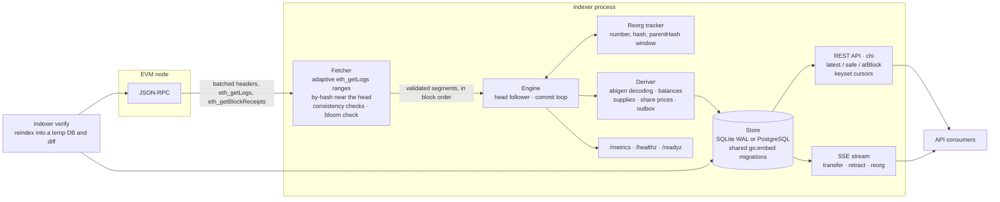

# Reorg-Safe EVM Event Indexer and Query API in Go

A Go service that backfills and live-tails EVM logs, detects reorgs from the parent-hash chain,
rolls back orphaned data in one transaction, and serves REST plus a Server-Sent Events stream with
explicit `retract` events. One differential property is the specification: once caught up, the
incrementally maintained database equals a from-scratch reindex of the canonical chain.

[](https://github.com/monzon1985/blockchain/actions/workflows/11-go-reorg-safe-indexer.yml)
[](../../LICENSE)


> Technical demonstration. Nothing in this repository has been audited, and it is not run in
> production by anyone.

## What's interesting here

- **Incremental database == fresh reindex: 0 differences** across 8,205 random reorgs, 2,822
  restarts, 24 SIGKILLs and injected RPC faults (in-memory chain, faulty node, anvil; SQLite and
  PostgreSQL). The breakdown per setting is under [Testing](#testing).
- **Consumers can undo reorgs too.** Every rollback appends one `retract` event per removed
  record, newest first, carrying the exact object published earlier, in the same transaction as
  the rollback. An SSE client that applies `transfer` and undoes `retract` ends with exactly the
  stored transfers: 61,804 retractions in the in-memory scenarios, 788 over HTTP against the real
  binary across 139 reconnects after crashes (`Last-Event-ID`).
- **Whole-block log loss is detected and repaired.** Behind a provider that drops every log of
  one block from each `eth_getLogs` answer, `indexer verify` proves the loss against a reindex
  (exit code 1), and `--bloom-check` (re-read by block hash every range-mode block whose bloom
  matches but that came back empty) makes the database exact. A block that loses only some of its
  logs passes that check; `indexer verify` against an independent endpoint catches it (tested
  too, see [limitations](#security-considerations-and-threat-model)).
- **Fuzzed state machine**: `FuzzReorgStateMachine` checks that every rollback names the true
  common ancestor and depth, or reports "beyond the window" exactly when no retained header
  proves the fork point (244,744 executions in 60 s locally, 6 workers); `FuzzDecodeLog` (516,396
  in 60 s) checks that only canonical ABI encodings decode.
- **91.6 % Go statement coverage** (unit, anvil integration and PostgreSQL suites merged, 90 %
  enforced in CI); 90 test and fuzz functions and 237 subtests in the default `go test ./...`.
  A cold backfill from an in-memory chain into SQLite ran at 736 to 845 blocks/s (5,791 to 6,649
  logs/s) across three benchmark runs on a shared laptop CPU.

## Overview

An indexer turns logs into tables an application can query: transfers, balances, vault share
prices. The hard part is not decoding logs, it is that **the chain an indexer has seen is not
final**. Blocks near the head get replaced (reorgs); a node can answer two consecutive calls from
two different forks; providers cap, time out, truncate and occasionally return incomplete but
well-formed answers; the process gets killed between two writes. An indexer that only appends
eventually serves balances that never existed, and its API consumers act on them.

This indexer treats the chain as a sequence of blocks identified by hash. It stores the last
headers as (number, hash, parentHash), detects forks by walking the new chain back by parent hash
to the common ancestor, and undoes everything above it (rows, balance deltas, share prices) in one
transaction that also moves the checkpoint and appends the retractions consumers need. The REST API
offers a `latest` view and a `safe` view (blocks with `--confirmations` confirmations) and
historical balances, all paginated without silent truncation.

Correctness is stated as one differential property and tested on fake chains, under injected RPC
faults, on anvil with real reorgs and crashes, and across storage backends. `indexer verify`
applies the same check to a live database.

## Architecture



| Component | Package | Responsibility | Key external calls |
|---|---|---|---|
| Chain client | `internal/chain` | Header subset with node-reported hashes, batched header reads, per-call timeouts, error classification (provider "too many results" variants, rate limits, timeouts, unknown blocks, permanent JSON-RPC codes), retry policy | `eth_chainId`, `eth_getBlockByNumber` (batched), `eth_getBlockByHash`, `eth_getLogs`, `eth_getBlockReceipts`, `eth_call` (a vault's `asset()` at start-up, for `--vault 0xVAULT`) |
| Fetcher | `internal/fetch` | Segments from `from..to`: adaptive span planner, bounded concurrency with ordered emission, range mode below the confirmation depth and by-hash mode above it, receipt fallback, four consistency checks, optional bloom check | the chain client |
| Reorg tracker | `internal/reorg` | Pure fork-choice bookkeeping: classifies headers, finds the common ancestor by parent hash, rewinds; no I/O except a header-by-hash callback | none |
| Decoder | `internal/decode` | Typed decoding of `Transfer`, `Deposit`, `Withdraw` with the abigen v2 bindings, accepting only canonical ABI encodings | none |
| Engine and deriver | `internal/indexer` | Sync loop, commit and rollback transactions, balances, supplies, share-price history, outbox, metrics, configuration fingerprint | the store, the fetcher |
| Store | `internal/store/...` | Transactional primitives on `database/sql`; SQLite (modernc, pure Go) and PostgreSQL (pgx) dialects; conformance suite; backend-independent snapshots and diff | SQLite / PostgreSQL |
| API | `internal/api` | REST endpoints, SSE stream, health and readiness, Prometheus handler | the store |
| CLI | `internal/app`, `cmd/indexer` | `index`, `serve`, `verify`; flags with `INDEXER_*` environment fallbacks; slog JSON logs; graceful shutdown | all of the above |
| Fault injector (tests) | `internal/rpcfault` | `http.RoundTripper` and reverse proxy injecting latency, hangs, 5xx, JSON-RPC errors, truncated bodies, provider limits, silently dropped blocks and silently dropped single logs, from one seeded generator | the node |
| Fixtures | `contracts/` | `FixtureToken` (ERC-20 with `batchTransfer`), `FixtureVault` (OpenZeppelin ERC-4626); traffic generators for the tests | none |

Design notes, including the exact transaction contents and the SSE protocol, are in
[docs/design.md](docs/design.md).

### API

| Endpoint | Description |
|---|---|
| `GET /v1/status` | Chain id, backend, tip, node head, safe head, reorg count and last reorg, outbox bounds, readiness, watched contracts |
| `GET /v1/transfers` | Transfers; filters `token`, `address` (from or to), `from`, `to`, `fromBlock`, `toBlock`; `view=latest\|safe`; `limit` (1-1,000), `cursor` |
| `GET /v1/tokens/{token}/balances` | Holders of a token in address order; `holder`, `view`, `atBlock`, `limit`, `cursor` |
| `GET /v1/accounts/{address}/balances` | Every non-zero balance of one account; `view`, `atBlock` |
| `GET /v1/vaults/{vault}/events` | ERC-4626 deposits and withdrawals; `fromBlock`, `toBlock`, `view`, `limit`, `cursor` |
| `GET /v1/vaults/{vault}/share-prices` | Share-price history (total assets, total supply, price in WAD); same parameters |
| `GET /v1/stream` | Server-Sent Events: `transfer`, `vault_event`, `share_price`, `retract`, `reorg`; resume with `Last-Event-ID` or `?after=N` |
| `GET /healthz`, `/readyz`, `/metrics` | Liveness (database ping), readiness (indexed, lag at most `--max-lag`, a sync within `--stale-after`), Prometheus |

Every list response is `{data, page: {limit, hasMore, nextCursor}, meta: {view, tip, safeHead,
chainHead, atBlock}}`, read in one snapshot. Amounts are decimal strings (uint256 does not fit a
JSON number). Errors are `{"error": {"code", "message"}}` with stable codes (`invalid_limit`,
`cursor_mismatch`, `block_not_safe`, `events_pruned`, ...).

## Roles and trust assumptions

The indexer holds no keys and moves no funds; it is trusted by its consumers to report the chain
correctly.

| Actor | Trusted for | Not trusted for |
|---|---|---|
| JSON-RPC provider | Blocks that consensus produced, honest header hashes | Consistency between calls, completeness of `eth_getLogs`, limits, timeliness, well-formed bodies |
| API clients | Nothing | Query parameters, cursors, stream positions, connection counts |
| Operator | Configuration, one indexer per database, reacting to a halt (`ErrBeyondWindow`, `ErrTipConflict`) | Not modelled as an adversary |

`FixtureToken` has one privileged role, its `Ownable2Step` owner, which can mint without limit: a
compromised owner inflates the supply of a test token. The fixtures exist only to produce traffic
on local chains.

## Invariants and properties

1. **Incremental equals reindex.** Once the indexer has caught up with the node, its six data
   tables and tip equal those of a from-scratch reindex of the canonical chain.
   [`TestIncrementalEqualsReindex`](internal/indexer/property_test.go),
   [`TestConcurrentFaultyNode`](internal/indexer/property_test.go),
   [`TestDifferentialAnvil`](integration/differential_test.go),
   [`TestEngineMatchesSQLiteReindex`](internal/store/postgres/postgres_test.go) (PostgreSQL vs SQLite),
   `indexer verify` (in the anvil runs and [`TestServeVerifyAndGracefulShutdown`](internal/app/app_test.go)).
2. **Derived state equals the source of truth.** Balances, supplies, vault events and share prices
   equal an independent oracle that recomputes them from all canonical logs
   ([`oracleSnapshot`](internal/indexer/helpers_test.go)), and on anvil every balance, supply and
   `totalAssets()` equals `eth_call` at the tip ([`checkOnChain`](integration/differential_test.go)).
3. **Retractions are complete and exact.** A consumer applying `transfer` and undoing `retract`
   events ends with exactly the stored transfers; each `retract` carries the byte-identical object
   that was published, newest first.
   [`TestRetractionOrderAndPayloads`](internal/indexer/engine_test.go), consumers in
   [`property_test.go`](internal/indexer/property_test.go) and
   [`sse_test.go`](integration/sse_test.go).
4. **Fork detection is exact.** Every rollback names the true common ancestor and depth. Reorgs
   up to `--reorg-window` blocks deep are rolled back (at exactly that depth the ancestor is the
   parent of the oldest retained header, which stores its hash); a deeper fork is reported (and
   halts the engine) exactly when no retained header proves its fork point.
   [`FuzzReorgStateMachine`](internal/reorg/tracker_test.go),
   [`TestFindAncestorAtTheWindowDepth`](internal/reorg/tracker_test.go),
   [`TestReorgExactlyAsDeepAsTheWindow`](internal/indexer/engine_test.go),
   [`TestReorgBeyondWindowHaltsRun`](internal/indexer/engine_test.go).
5. **Only consistent segments are committed.** Headers linked by parent hash, logs matching their
   header's hash and bloom, unique and ordered.
   [`TestFetchRejectsInconsistentAnswers`](internal/fetch/fetch_test.go).
6. **Atomic progress.** The checkpoint moves only together with the data and the outbox, by
   compare-and-swap; a second writer stops, while a write of the engine's own that committed
   although it reported an error is recognised and resumed from.
   [`storetest`](internal/store/storetest/storetest.go) (`CheckpointCAS`, `Atomicity`),
   [`TestSecondWriterHaltsOnCheckpointConflict`](internal/indexer/engine_test.go),
   [`TestAmbiguousCommitIsNotMistakenForASecondWriter`](internal/indexer/engine_test.go).
7. **Idempotent application.** Derived rows are keyed on (blockHash, logIndex) and their deltas
   apply only when the row is created. [`storetest`](internal/store/storetest/storetest.go) (`IdempotentInserts`).
8. **Gap-free stream.** Outbox sequence numbers are contiguous (an aborted transaction consumes
   none), and a streamed event belongs to a durable commit (SQLite `synchronous=FULL`), so a power
   cut cannot reassign its number; a pruned position is a `410` or a `reset`, never a silent gap.
   [`storetest`](internal/store/storetest/storetest.go) (`Outbox`),
   [`TestStreamPositionErrorsAndReset`](internal/api/api_test.go).
9. **No silent truncation.** Paging through any filter with any page size returns exactly the
   matching rows; limits above 1,000 are rejected.
   [`TestTransfersPaginationIsCompleteForEveryFilter`](internal/api/api_test.go),
   [`TestRequestValidation`](internal/api/api_test.go).
10. **Historical balances are exact.** Balances in the safe view and at `?atBlock=N` equal a
    replay of the stored transfers up to that block, for every page size and every account (the
    zero address included, which holds nothing), and still answer on a token with more holders
    touched above the block than SQLite accepts bound variables in one statement.
    [`TestBalancesMatchAReplayOfTransfers`](internal/api/api_test.go),
    [`TestHistoricalBalancesOfABusyToken`](internal/api/api_test.go).
11. **Canonical decoding only.** Whatever decodes re-encodes to the identical log.
    [`FuzzDecodeLog`](internal/decode/decode_test.go).
12. **Resume, never re-read.** A restarted indexer continues from the checkpoint and never fetches
    an indexed block again. [`TestRunStopsGracefullyAndResumesFromTheCheckpoint`](internal/indexer/engine_test.go).

## Security considerations and threat model

The full threat model, with 14 threats mapped to mitigations and tests, is in
[docs/threat-model.md](docs/threat-model.md). In short:

- **Node inconsistency** (reorgs between calls, load-balanced replicas): segment consistency
  checks, by-hash log reads near the head, parent-hash fork detection.
- **Provider data loss and limits**: adaptive range splitting, receipt fallback, retries that skip
  permanent errors, backoff (never splitting) on rate limits, persistent inconsistency reported as
  a sync error rather than retried silently, `--bloom-check` for whole-block omissions, and
  `indexer verify` against an independent endpoint for everything else.
- **Crashes**: one transaction per commit and rollback, including the checkpoint and the outbox,
  durable before it is acknowledged; resume needs no repair step; a commit whose acknowledgement
  was lost is recognised as the engine's own.
- **Operator mistakes**: a configuration fingerprint guards the database; a second writer stops on
  a checkpoint conflict; a reorg beyond the window halts instead of guessing.
- **API input**: strict parsing, parameterised SQL, cursors bound to their query, no clamping.

Known limitations: the indexer trusts node-reported hashes (no consensus verification); the HTTP
API has no authentication or rate limiting (run it behind a proxy); `?atBlock=` costs
O(transfers above the block); the safe view is depth-based rather than the consensus `safe` or
`finalized` tags; a node whose head drops below the indexed tip is treated as lagging (see
[design §3](docs/design.md#a-head-below-the-tip)); balances derive from `Transfer` events, so
tokens that rebase are reported as anomalies (`indexer_balance_anomalies_total`), not fixed;
SQLite databases must be files (`:memory:` is rejected).

`--bloom-check` covers **whole-block omissions in range mode only**: it re-reads, from the same
provider, the blocks that came back with no logs at all. A block that lost some but not all of
its logs, logs missing from the by-hash answers near the head, and a provider that drops the same
logs from the re-read are not detected; only `indexer verify` against an independent endpoint
finds them ([`TestBloomCheckMissesPartialLossVerifyCatchesIt`](internal/app/app_test.go)). It also
costs more than it looks: it matches the watched addresses against the header bloom, and on a busy
chain a block's 2048-bit bloom is mostly saturated, so most blocks match and the check adds about
one sequential `eth_getLogs(blockHash)` call per block.

## Design decisions and trade-offs

- **Blocks are identified by hash, rows are keyed by hash.** Numbers change meaning across forks;
  hashes do not. Fork detection walks parent hashes, never numbers, so a reorg that happens while
  the ancestor is being searched cannot mislead it.
- **Domain logic above a small store interface.** Backends implement inserts, deletes, a
  compare-and-swap and queries; balance arithmetic, rollback reversal and the outbox live in the
  engine. That is what makes SQLite and PostgreSQL produce identical snapshots.
- **A transactional outbox for the stream.** Events commit with the data, so a crash cannot
  publish data without its event or a retraction without its rollback, and SSE resumption is a
  simple `seq > N` query. The price is write amplification: one outbox row per published record.
- **Two fetch modes.** Range `eth_getLogs` is efficient but can mix forks near the head; by-hash
  queries (EIP-234) are fork-consistent but cost one call per block. Range below the confirmation
  depth, by hash inside it.
- **Every header is read during backfill.** Linkage is checked across the whole history, which
  costs one batched call per 100 blocks (`--header-batch`). A finalized-checkpoint mode that skips
  interior headers would be faster and slightly weaker.
- **Stored balances are the latest view only.** Writes stay O(transfers); safe and historical
  balances subtract the deltas above the requested block at read time. A per-block balance history
  would make old `atBlock` reads O(1) at the cost of storage.
- **Reject, do not clamp.** A `limit` of 5,000 is a 400. An `atBlock` the view cannot see is a
  400. A pruned stream position is a 410. Clients never get less than they asked for without being
  told.
- **Wait on a head below the tip.** A lagging replica and a rolled-back node look the same;
  rolling back on the first would retract and re-publish canonical data. The first conflicting
  block triggers the rollback.
- **Halt on what cannot be fixed by retrying, report what retrying does not fix.** A reorg beyond
  the window and a second writer stop the process with an explicit error instead of looping. A
  fault that may clear but has not after 10 quick retries (answers that stay inconsistent, a
  missing RPC method) becomes a counted sync error with backoff, visible in `/readyz`, instead of
  a silent re-fetch loop.
- **Pure-Go SQLite.** modernc.org/sqlite keeps `CGO_ENABLED=0` builds and cross-compilation;
  PostgreSQL is there for multi-process deployments and runs the same migrations.
- **Faults injected at the HTTP layer.** The fault injector is an `http.RoundTripper`, so tests
  exercise the real JSON-RPC client, batching and error classification, and it doubles as a proxy
  in front of anvil for the unmodified binary.

## Testing

```bash
# fixtures and static analysis (from contracts/)
forge soldeer install && forge fmt --check && forge build && forge lint
FOUNDRY_PROFILE=ci forge test            # fuzz 4,096 runs with a fixed seed (plain `forge test`: 1,024)
slither . --config-file slither.config.json
# bindings, modules, vet, unit and property tests (from the project root)
go generate ./... && git diff --exit-code -- internal/bindings
go mod tidy -diff && go mod verify
CGO_ENABLED=0 go vet ./...
CGO_ENABLED=0 go test -count=1 ./...
INDEXER_PROP_SEEDS=400 INDEXER_FAULT_SEEDS=20 go test -v -run 'TestIncrementalEqualsReindex|TestConcurrentFaultyNode' ./internal/indexer/ | grep TOTAL
# anvil integration (spawns anvil on port 0 and the indexer binary)
CGO_ENABLED=0 go test -count=1 -tags integration -timeout 15m ./integration/...
INDEXER_IT_ROUNDS=4 go test -v -tags integration -run TestDifferentialAnvil ./integration/ | grep TOTAL   # more rounds
# PostgreSQL adapter: against a server, or a throwaway local cluster (needs initdb/pg_ctl;
# on Debian/Ubuntu set PG_BIN=/usr/lib/postgresql/<major>/bin)
INDEXER_TEST_POSTGRES_DSN=postgres://... go test -tags postgres ./internal/store/postgres/...
bash script/test-postgres.sh
# fuzzing
go test ./internal/reorg -run '^$' -fuzz=FuzzReorgStateMachine -fuzztime=60s
go test ./internal/decode -run '^$' -fuzz=FuzzDecodeLog -fuzztime=60s
# merged coverage (unit + integration [+ PostgreSQL]), minimum 90 %
bash script/coverage.sh
go test -run '^$' -bench BenchmarkBackfill -benchtime 3x ./internal/indexer/
```

**Static analysis.** `forge lint` reports nothing. Slither reports one finding, `naming-convention`
on `FixtureToken.DECIMALS`: Slither wants mixedCase for variables, while `forge lint` requires
SCREAMING_SNAKE_CASE for immutables. The Foundry convention wins, and the finding is suppressed on
that line only (`// slither-disable-next-line naming-convention`, with the reason next to it);
`slither.config.json` excludes no detector. CI runs Slither 0.11.6 with crytic-compile 0.4.2.

| Suite | Location | Count | Settings |
|---|---|---|---|
| Foundry unit and fuzz | `contracts/test/Fixtures.t.sol` | 11 unit + 1 fuzz | every revert path of the fixtures; fuzz 1,024 runs (4,096 with a fixed seed in the `ci` profile) |
| Property: incremental == reindex == oracle | `internal/indexer/property_test.go` | 40 seeds × 70 ops (400 in CI) | random blocks, reorgs of depth 1-12 (shorter, equal, longer forks), restarts, partial syncs, SSE consumer |
| Property under concurrent RPC faults | same file | 6 seeds × 60 ops (20 in CI) | engine running while the chain mines and reorgs; 3 % 5xx, 3 % JSON-RPC errors, 3 % truncated bodies, 1 % hangs, ≤ 2 ms latency, 12-log result cap, 10 % dropped blocks with the bloom check on |
| Engine unit tests | `internal/indexer/engine_test.go` | 16 + benchmark | lagging head, retraction order and payloads, fingerprint, configuration defaults, corrupt databases (3), window halt, a reorg exactly as deep as the window, second writer, an ambiguous commit and rollback, graceful stop and resume without re-reading, `StopAt`, pruning, anomalies, safe head, error kinds, persistent faults reported as sync errors (2) |
| Reorg tracker | `internal/reorg` | 5 tests (+ 9 table cases) + `FuzzReorgStateMachine` | fork exactly as deep as the window and one deeper; fuzz: 244,744 executions / 60 s locally (6 workers); 4 seed inputs |
| Fetcher | `internal/fetch` | 13 (+ 20 cases) | provider caps, range caps, timeouts, rate limits retried without splitting, receipts fallback, a missing `eth_getBlockReceipts` (2 modes), bloom skipping, bloom check, retries, 10 inconsistency cases, ordered concurrent streaming (≤ 4 in flight), errors and cancellation |
| Chain client | `internal/chain` | 6 (+ 38 cases) | 24-case error classification (rate limits, "Method not found" vs unknown blocks), retry policy, RPC client against a JSON-RPC server, 8 malformed-node answers, timeouts |
| Decoder | `internal/decode` | 4 (+ 15 cases) + `FuzzDecodeLog` | ERC-721 look-alikes, dirty topics, short and trailing data; fuzz 516,396 executions / 60 s (6 workers) |
| Store conformance | `internal/store/storetest` via `sqlite` (and `postgres`) | 13 scenarios | CAS, atomicity, idempotence, pagination at every page size, outbox, uint256 max |
| SQLite specifics | `internal/store/sqlite` | 9 (+ 6 corrupt-row cases) | WAL and `synchronous=FULL`, in-memory databases rejected, migrations idempotent, concurrent open, closed-transaction handles |
| PostgreSQL | `internal/store/postgres` (`-tags postgres`) | 4 (conformance, concurrent migrations, unreachable server, cross-backend differential with 3 seeds) | CI: `postgres:17.11` service; locally: `script/test-postgres.sh` |
| API contract | `internal/api` | 12 (+ 44 cases) | pagination completeness, 35 validation cases, balances vs replay in 6 views (zero address included), a token with 33,000 holders touched above `atBlock`, vault endpoints, health and readiness, SSE replay, resume, live follow, 410, reset, heartbeats, shutdown |
| CLI | `internal/app` | 6 (+ 20 cases) | serve, index, `serve --readonly`, verify OK / MISMATCH / STALE / other chain, a partial log loss that `--bloom-check` misses and verify catches, in-memory database rejected, graceful shutdown, environment variables |
| Fault injector, metrics, model, tools | `internal/rpcfault`, `metrics`, `model`, `tools` | 14 | every fault type (single dropped logs included), seed determinism, proxy, SPDX headers on the generated bindings |
| Anvil integration | `integration/` (`-tags integration`) | 3 (+ 1 POSIX-only) | real anvil (`--port 0 --no-mining`), the real binary; differential: 2 rounds × 160 ops by default (6 in CI) with reorgs up to depth 8, SIGKILL crashes with the chain moving while the indexer is down, proxy faults; deterministic reorg; silent log loss; SIGTERM shutdown (Linux CI) |
| Race detector | CI only (needs cgo) | `internal/...` (`-short`), the integration suite with `-race` builds of the binary, PostgreSQL tests | `-gcflags=all=-d=checkptr=0` because modernc.org/sqlite's transpiled C trips checkptr |

**Coverage.** 91.6 % of Go statements in the production packages (`cmd/` and `internal/*`
except the generated bindings and the test-support packages `fakechain`, `rpcfault`, `storetest`
and `tools`, which no production code imports), with the unit, anvil integration and PostgreSQL
suites merged (`bash script/coverage.sh`; CI runs the suites in separate jobs, fails the merge
below 90 % and keeps the merged profile as an artifact). Per package: api 93.8, app 92.9, chain
96.8, decode 96.3, fetch 98.4, indexer 89.6, metrics 100, model 100, reorg 96.5, store 97.1,
sqlstore 82.1, postgres 75.0, sqlite 92.1 (a few points lower in runs where `TestConcurrentOpen`
does not hit the `SQLITE_BUSY` retry), cmd/indexer 0 (signal wiring around `app.Main`). Most of
the remainder is `if err != nil` after database calls that only fail when the database does.

The totals below are printed by the tests themselves as `TOTAL ...` lines (run them with `-v`);
CI runs the same suites deeper (400 and 20 seeds, 6 anvil rounds) and keeps their logs as
artifacts of every run.

**Deep property run** (`INDEXER_PROP_SEEDS=400 INDEXER_FAULT_SEEDS=20`, as in CI, 67 s locally):
400 scenarios with 8,086 reorgs, 2,822 restarts and 61,804 transfer retractions applied by the
consumer, ending on chains of 32,719 blocks in total and 146,678 compared rows (these numbers are
deterministic); 20 concurrent faulty-node scenarios with 3,975 requests, 123 HTTP 503s, 91
JSON-RPC errors, 128 truncated bodies, 40 hung calls, 185 provider limit errors and 69 silently
dropped blocks (these depend on goroutine scheduling). 0 differences.

**Anvil differential totals** from four local rounds (`INDEXER_IT_ROUNDS=4`, seeds 1-4): 703
blocks, 964 transactions, 119 `anvil_reorg` calls (84 of them hit indexed data; the rest landed
while the indexer was down or before it caught up), 24 SIGKILL crashes, and through the proxy
3,260 requests with 71 HTTP 503s, 38 JSON-RPC errors, 81 truncated bodies, 95 provider limit
errors, 8 hung calls and 13 silently dropped blocks. Every round ended with `indexer verify`
reporting OK, the in-test diff empty, every balance, supply and `totalAssets()` equal to
`eth_call`, and the SSE consumer holding exactly the stored transfers (788 retractions applied,
139 reconnects). The seeds fix the block, transaction, `anvil_reorg` and crash counts; the
reorgs that hit indexed data, the proxy faults and the SSE counts depend on timing and vary from
run to run (another four-round run: 79 reorgs hit indexed data, 653 retractions, 215 reconnects).

## Gas

Not applicable: the contracts are test fixtures that generate traffic and are never deployed.
They are compiled without CBOR metadata (`bytecode_hash = "none"`, `cbor_metadata = false`) so the
bytecode embedded in the Go bindings is identical on every machine, which is what lets CI fail on
`git diff -- internal/bindings`.

## Getting started

Prerequisites: Go 1.27, Foundry 1.8.3 (`forge`, `anvil`, `cast`), bash and curl (and `jq` for a
prettier demo). Nothing needs an RPC endpoint or an API key.

```bash
cd projects/11-go-reorg-safe-indexer
(cd contracts && forge soldeer install && forge build && forge test)
go test ./...
bash script/demo.sh   # anvil on a free port, fixtures, indexer, a reorg, the retraction, verify
```

Running against a node:

```bash
go build -o indexer ./cmd/indexer
./indexer serve --rpc-url "$RPC_URL" --db indexer.db \
  --token 0xTOKEN --vault 0xVAULT --start-block 19000000 --confirmations 12 --listen 127.0.0.1:8080
curl -s 127.0.0.1:8080/v1/status
curl -s '127.0.0.1:8080/v1/transfers?token=0xTOKEN&limit=100'
curl -N  '127.0.0.1:8080/v1/stream?after=0'
./indexer verify --rpc-url "$OTHER_RPC_URL" --db indexer.db   # diff against a reindex
```

`--vault 0xVAULT` reads `asset()` on chain; `0xVAULT=0xASSET` skips the call. Every flag has an
`INDEXER_*` environment variable (`--rpc-url` is `INDEXER_RPC_URL`). `--db postgres://...` selects
PostgreSQL. `indexer index` indexes and serves only `/healthz`, `/readyz` and `/metrics`, and
`indexer serve --readonly` serves the API from a database another process indexes.

| Flag | Default | Meaning |
|---|---|---|
| `--db` | indexer.db | SQLite file (in-memory databases are rejected) or a `postgres://` URL |
| `--confirmations` | 12 | depth of the safe view; blocks inside it are read by hash |
| `--reorg-window` | 1024 | headers retained; the deepest reorg handled automatically (a deeper one halts) |
| `--poll-interval` | 2s | head polling once caught up |
| `--initial-range`, `--max-range` | 100, 2000 | adaptive `eth_getLogs` span |
| `--concurrency` | 4 | segments fetched in parallel during backfill |
| `--bloom-check` | off | re-read range-mode blocks whose bloom matches but which came back empty (whole-block omissions only; about one extra call per block on busy chains, see the limitations) |
| `--event-retention` | 100000 | outbox events kept for SSE resumption |
| `--max-lag`, `--stale-after` | 10, 1m | readiness thresholds |

Prometheus metrics include `indexer_head_lag_blocks`, `indexer_blocks_per_second`,
`indexer_reorg_depth_blocks` (histogram), `indexer_deep_reorgs_total`,
`indexer_rpc_errors_total{method,kind}`, `indexer_sync_errors_total{kind}`, `indexer_getlogs_range_splits_total`,
`indexer_retractions_total{type}` and `indexer_sse_clients`. Logs are slog JSON.

## Project structure

```
11-go-reorg-safe-indexer/
├── cmd/indexer/              # main: signal handling around internal/app
├── contracts/                # Foundry project: FixtureToken, FixtureVault, tests, Slither config
├── docs/
│   ├── design.md             # algorithms, transaction contents, SSE protocol, query semantics
│   └── threat-model.md
├── integration/              # anvil tests (-tags integration): differential, reorg, data loss, SIGTERM
├── internal/
│   ├── api/                  # chi router, handlers, cursors, SSE
│   ├── app/                  # CLI: index, serve, verify; flags and environment
│   ├── bindings/             # abigen v2 output + normalised ABI/bytecode (go generate)
│   ├── chain/                # node interface, JSON-RPC client, error classification, retries
│   ├── decode/               # strict typed decoding with the bindings
│   ├── fakechain/            # in-memory chain + JSON-RPC server + traffic generator (tests)
│   ├── fetch/                # adaptive, consistent, concurrent segment fetching
│   ├── indexer/              # engine, deriver; property tests and benchmark
│   ├── metrics/              # Prometheus collectors on a private registry
│   ├── model/                # records shared by the store, the API and the stream
│   ├── reorg/                # fork-choice tracker and its fuzz target
│   ├── rpcfault/             # fault-injecting RoundTripper and proxy (tests only)
│   ├── store/                # interface, snapshots and diff; sqlstore/, sqlite/, postgres/, storetest/
│   └── tools/                # forgeartifact (Foundry artifact -> abigen inputs, SPDX headers), freeport
└── script/
    ├── coverage.sh           # merged coverage with a minimum
    ├── demo.sh               # local end-to-end demo (CI smoke test)
    └── test-postgres.sh      # PostgreSQL tests against a throwaway cluster
```

## Scope notes and future work

- **Implemented as specified**, with these notes: the PostgreSQL adapter uses pgx through
  `database/sql` (so both backends share one SQL implementation) rather than `pgxpool`; the "safe"
  view is depth-based; `?atBlock=` historical balances were added to the balance endpoints as
  their block filter.
- **Decoding is standard-event based.** The bindings come from the fixtures, but `Transfer`,
  `Deposit` and `Withdraw` are the ERC-20 and ERC-4626 events, so any token and any vault that emit
  them canonically can be indexed. Share prices use the vault's asset balance as total assets
  (see the [threat model's known limitations](docs/threat-model.md#known-limitations)).
- **Generated bindings** (`internal/bindings/fixture_*.go`) carry the SPDX header on their
  third line, after abigen's `// Code generated ... DO NOT EDIT.` comment: the last
  `go:generate` step adds it, so regenerating stays byte-identical.
- **The race detector runs in CI only**: it needs cgo, and this project builds with
  `CGO_ENABLED=0` locally. The SIGTERM test is POSIX-only and runs in CI; the in-process CLI tests
  cover the same cancellation path on every OS.
- **Future work**: a paranoid bloom-check mode that compares per-block log counts with
  `eth_getBlockReceipts` (would catch partial omissions); follow the consensus `safe` and
  `finalized` tags; `eth_subscribe("newHeads")`
  over WebSocket instead of polling; a finalized-checkpoint backfill that skips interior headers; a
  per-block balance history for O(1) `atBlock`; COPY-based bulk backfill on PostgreSQL;
  authentication and rate limiting for the API; several chains per process.

## References

- [EIP-234](https://eips.ethereum.org/EIPS/eip-234): `blockHash` filter for `eth_getLogs`, the basis of fork-consistent log reads.
- [EIP-1474](https://eips.ethereum.org/EIPS/eip-1474): JSON-RPC error codes (`-32005` limit exceeded).
- [EIP-20](https://eips.ethereum.org/EIPS/eip-20) and [EIP-4626](https://eips.ethereum.org/EIPS/eip-4626): the indexed events.
- [Ethereum execution API specification](https://github.com/ethereum/execution-apis) (`eth_getLogs`, `eth_getBlockReceipts`).
- [go-ethereum](https://github.com/ethereum/go-ethereum): `rpc`, `ethclient`, abigen v2.
- [OpenZeppelin Contracts 5](https://github.com/OpenZeppelin/openzeppelin-contracts): ERC-20, ERC-4626 (decimals offset against inflation attacks), `Ownable2Step`.
- [Foundry](https://github.com/foundry-rs/foundry): `anvil_reorg`, the reorg primitive the integration tests rely on.
- Prior art on reorg handling in indexers: [The Graph's graph-node](https://github.com/graphprotocol/graph-node) (block pointers and reverts), [Ponder](https://github.com/ponder-sh/ponder) (realtime sync and reorg reconciliation), [Shovel by Index Supply](https://github.com/indexsupply/shovel) (a Go indexer on PostgreSQL).
- Transactional outbox pattern: Chris Richardson, [microservices.io](https://microservices.io/patterns/data/transactional-outbox.html).
- Server-Sent Events: [WHATWG HTML Living Standard](https://html.spec.whatwg.org/multipage/server-sent-events.html) (`Last-Event-ID`, `retry`).
- Keyset pagination: Markus Winand, [Use The Index, Luke](https://use-the-index-luke.com/no-offset).
- [modernc.org/sqlite](https://gitlab.com/cznic/sqlite), [pgx](https://github.com/jackc/pgx), [chi](https://github.com/go-chi/chi), [Prometheus Go client](https://github.com/prometheus/client_golang).
