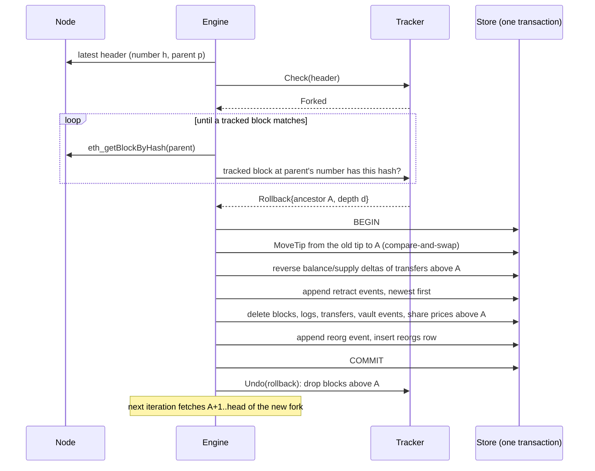

# Design notes

This document explains how the indexer keeps its database equal to the canonical chain while
the chain, the node and the process itself misbehave. The README summarises it; this is the long
form, with the exact rules each component follows.

## 1. The correctness property

> After any sequence of blocks, reorgs of any depth, restarts and RPC faults, once the indexer
> has caught up with the node, its database is identical, row for row, to a database built from
> scratch from the canonical chain.

"Identical" is checked mechanically: `store.Snapshot` renders the six data tables (`logs`,
`transfers`, `vault_events`, `share_prices`, `balances`, `supplies`) and the tip in a
backend-independent form, and `store.Diff` compares two snapshots row by row. Bookkeeping tables
(headers, checkpoint, outbox, reorg log) are excluded on purpose: an incremental run legitimately
has a reorg log and pruned headers that a reindex does not.

Every other design decision below exists to make that property hold, or to make a violation
visible (`indexer verify`).

## 2. Data model

| Table | Key | Written by | Notes |
|---|---|---|---|
| `checkpoint` | single row | every commit and rollback | tip (number, hash), node head, next outbox sequence; moved by compare-and-swap |
| `blocks` | `number` (hash unique) | commit, rollback | the last `--reorg-window` headers: (number, hash, parentHash, time) |
| `logs` | `(block_hash, log_index)` | commit | every log of a watched contract, decoded or not |
| `transfers` | `(block_hash, log_index)` | commit | decoded ERC-20 `Transfer` |
| `vault_events` | `(block_hash, log_index)` | commit | decoded ERC-4626 `Deposit` / `Withdraw` |
| `share_prices` | `(block_hash, vault)` | commit | one point per block in which a vault's total assets or supply changed |
| `balances`, `supplies` | `(token, holder)`, `token` | commit, rollback | the latest view only; zero rows are deleted |
| `events` | `seq` | commit, rollback | the transactional outbox behind `/v1/stream` |
| `reorgs` | `id` | rollback | one row per rollback (old tip, ancestor, new head, depth) |

Keys include the block **hash**, not only the number: two forks of the same block produce
different rows, so a row can never silently survive a reorg under the same key. Addresses and
hashes are lower-case hex; uint256 values are base-10 `TEXT`, and all arithmetic is done in Go
with `math/big` (neither SQLite nor PostgreSQL has a native uint256).

## 3. The sync loop

`indexer.Engine.SyncOnce` is one iteration:

1. Read the node head (`eth_getBlockByNumber("latest")`).
2. Classify it against the reorg tracker (`reorg.Tracker.Check`), an in-memory mirror of the
   stored headers:

   | Verdict | Meaning | Action |
   |---|---|---|
   | `Extends` / `Ahead` | the head is the next block, or above it | fetch and commit up to the head |
   | `Known` | the head is a block the indexer already holds | idle (in sync, or the node lags) |
   | `Forked` | the head contradicts a stored block | find the common ancestor, roll back |
   | `Untracked` | the head is below the retained window or the start block | idle |

3. Fetch `next..head` with `fetch.Fetcher.Stream`, which yields validated segments **in block
   order**, and commit each segment in its own transaction. If a segment's first header does not
   link to the stored tip (a reorg happened while fetching), the stream stops and the engine rolls
   back from that header.

The loop never trusts block numbers to identify blocks: forks are found by walking the new chain
backwards **by parent hash** (`Tracker.FindAncestor`), and every log is matched to its header by
hash.

### A head below the tip

A node whose head is an ancestor of the indexed tip is either lagging (a replica behind a load
balancer, a restarted node) or has rolled back without producing a new block yet. The two are
indistinguishable from the outside. The engine treats both as lagging and waits: rolling back on a
stale replica would retract canonical data and re-publish it a second later. The first block that
contradicts the indexed chain triggers the rollback (`TestHeadBelowTipIsTreatedAsLagging`). The
property is therefore asserted once the indexer has caught up, which the property tests make
explicit by growing the chain past every block it ever had before comparing.

## 4. Fetching: two modes and four consistency checks

`fetch.Fetcher.Fetch(from, to, mode)` returns a segment only if all of these hold:

1. its headers are contiguous and linked by parent hash;
2. every log's `blockHash` is the hash of the header at the log's number;
3. every log's emitter is in that header's logs bloom (blooms have no false negatives);
4. logs are unique and ordered by (block, logIndex).

Otherwise it returns `ErrInconsistent` (the node answered from two forks, typically a reorg
between two requests, or a load balancer mixing nodes), and the engine retries the iteration
after a short pause. A reorg in progress resolves within an iteration or two. An inconsistency
that persists for 10 iterations in a row (a provider that ignores the address filter, a chain
whose header blooms miss logs) is reported like any other failure:
`indexer_sync_errors_total{kind="inconsistent"}`, `lastError` in `/readyz`, a warning, and
exponential backoff (`TestPersistentFaultsSurfaceAsSyncErrors`).

Errors are classified before they are retried (`internal/chain`). Timeouts, HTTP failures,
truncated bodies and most JSON-RPC errors are retried with backoff. Permanent JSON-RPC errors
(`-32601` method not found, `-32602` invalid params, a reverted call) are not, and they are never
mistaken for an orphaned block: "unknown block" is recognised by its specific wordings ("unknown
block", "header not found", "block not found"), never by a bare "not found", which would match
"Method not found". Rate limits (HTTP 429, and the `-32005` "request rate"/"request count"/
"capacity" errors some providers send) are backed off from and never split: splitting a range
in answer to a throttle would multiply the requests.

**Range mode** (blocks deeper than `--confirmations`): one `eth_getLogs` over a block range, sized
by `fetch.Planner`, which halves the span on a "too many results" error (any of the provider
messages listed in `chain.IsRangeTooLarge`, or JSON-RPC `-32005` that is not a rate limit) or a
timeout, and doubles it
after a success at or above half the span. A single block that is still too large is read from
`eth_getBlockReceipts` and filtered locally. Segments are fetched with bounded concurrency
(`--concurrency`) but emitted strictly in order, so commits stay sequential.

**Hash mode** (the last `--confirmations` blocks, where reorgs happen): one `eth_getLogs` per block
by `blockHash` (EIP-234), which is fork-consistent by construction: a log of another fork cannot
be returned for that hash. Blocks whose bloom rules out every watched contract are skipped. An
all-zero bloom carries no information (empty blocks, and some chains never fill it), so it is
always queried.

**Bloom check** (`--bloom-check`): a provider can return a well-formed but incomplete range
answer. With the check on, every range-mode block whose bloom admits a watched contract but that
came back **without any logs** is re-read by hash, from the same provider.
`TestSilentLogLossIsDetectedAndPrevented` runs the real binary behind a proxy that drops every
log of one block from every range answer: without the check `indexer verify` reports the loss
(exit code 1); with it the database is exact. That is the whole guarantee: whole-block omissions
in range mode are detected and repaired. It does not cover:

- **partial omissions**: a block that lost one of several logs still has logs in the answer, so
  it is not re-read (`TestBloomCheckMissesPartialLossVerifyCatchesIt`: the check misses it,
  `indexer verify` against an honest endpoint reports the difference);
- **by-hash answers** near the head, which are not re-checked;
- **a provider that also drops the logs from the by-hash re-read**: the re-read goes to the same
  endpoint.

Only `indexer verify` against an independent endpoint catches those. The check also has a cost:
it tests the watched contract addresses against the header bloom, and on a busy chain a block's
2048-bit bloom is mostly saturated (thousands of address and topic insertions, 3 bits each), so
most blocks without watched logs still match. There, `--bloom-check` turns a range query into
roughly one extra `eth_getLogs(blockHash)` call per block, issued one after another.

## 5. Commit and rollback transactions

A **commit** of a segment runs, in one transaction:

1. `MoveTip(expected = tracker tip, next = last header)`: a compare-and-swap on the single
   checkpoint row. If another writer moved it, the transaction fails with `ErrTipConflict` and the
   engine stops (one indexer per database). One conflict is not another writer: a transaction
   that committed although `Update` reported an error (an ambiguous COMMIT, for example a
   PostgreSQL connection that drops during the commit) leaves the engine's tracker one write
   behind the database. The engine remembers the tip of every write whose outcome it does not
   know; when the next write conflicts and the stored tip is exactly that tip, it reloads the
   tracker from the database and carries on. Any other stored tip still halts it
   (`TestAmbiguousCommitIsNotMistakenForASecondWriter`).
2. For each header: insert it, insert its logs, decode them, insert transfers and vault events
   with `ON CONFLICT DO NOTHING` keyed on `(blockHash, logIndex)`, and apply balance and supply
   deltas **only for rows the insert actually created**, so applying a block twice changes
   nothing. Share-price points are written for every vault whose total assets (the asset balance
   held by the vault, which includes donations) or share supply changed.
3. Append one outbox event per published record (`transfer`, `vault_event`, `share_price`).
4. Prune headers below the reorg window and outbox events beyond the retention.

A **rollback** to ancestor `A` runs, in one transaction:

1. `MoveTip(expected = old tip, next = A)`.
2. Read every transfer, vault event and share price above `A`, reverse each transfer's balance
   and supply delta, and append one `retract` event per record, **newest first** (share prices
   before the logs of their block), each carrying the exact object that was published.
3. Delete headers, logs and derived rows above `A`. If `A` is the parent of the oldest retained
   header (a reorg exactly as deep as the window, see §6), its header is stored again, so the
   checkpoint keeps pointing at a stored header.
4. Append a `reorg` event and a `reorgs` row.

Because the checkpoint, the data and the outbox move together, a crash at any instant leaves
either the state before or the state after the transaction. There is no repair step on start-up:
the engine restores the tracker from the stored headers and continues.

## 6. Reorg depth and the window

The tracker keeps the last `--reorg-window` headers (W, 1,024 by default), and with them every
reorg up to W blocks deep is resolved: the deepest common ancestor still provable is the parent
of the oldest retained header, whose hash that header stores. In that case (a fork that replaces
every retained header) the ancestor's header is fetched by hash and stored again with the
rollback (`TestReorgExactlyAsDeepAsTheWindow`, `TestFindAncestorAtTheWindowDepth`). A fork whose
common ancestor is deeper cannot be resolved safely, because the indexer no longer knows which of
its blocks are still canonical. The engine stops with `reorg.ErrBeyondWindow` instead of guessing;
the operator runs `indexer verify` and reindexes. A reorg deeper than `--confirmations` is handled
normally but counted in `indexer_deep_reorgs_total` and logged at error level, because it
retracted data that the safe view had already served.

`FuzzReorgStateMachine` drives the tracker against a ground-truth chain through random
extensions, reorgs (shorter, equal and longer forks), rollbacks, restarts from persisted headers
and syncs with random chunk sizes. Every rollback must name the true common ancestor and depth, and
`ErrBeyondWindow` must be reported exactly when the fork point is below the parent of the oldest
retained header.

## 7. The SSE protocol

`GET /v1/stream` serves the outbox as Server-Sent Events. Each message has `id` (the outbox
sequence number), `event` (`transfer`, `vault_event`, `share_price`, `retract`, `reorg`) and
`data` (JSON). Rules a consumer can rely on:

- Sequence numbers are contiguous: a rolled-back transaction does not consume any, and a crash
  cannot lose an event that was committed. An event is only streamed once its transaction has
  committed, and a committed transaction is durable: SQLite runs with `synchronous=FULL` (§9) and
  PostgreSQL with its default `synchronous_commit=on` (the adapter does not override the server's
  setting: a server or role configured with `synchronous_commit=off` gives this guarantee up
  when the database server crashes). Without that, a power cut could drop the last commits
  after a client had received their events, and the restarted indexer would assign
  the same sequence numbers to other events.
- Undoing every `retract` in arrival order, while applying every `transfer`, leaves exactly the
  stored transfers (asserted by consumers in the property tests and against the real binary).
- Resume with `Last-Event-ID` (sent automatically by browsers) or `?after=N`; `?after=0` replays
  every retained event; no position means "from now on".
- A position older than the retention gets `410 Gone` before streaming, or a `reset` event during
  it, telling the client to resync from the REST endpoints. A silent gap is impossible.

The stream is woken by in-process commits, and also polls, so `indexer serve --readonly` can
follow a database written by a separate `indexer index` process.

## 8. Query semantics

- **Views.** `latest` sees every indexed block. `safe` sees blocks with at least
  `--confirmations` confirmations (`min(tip, nodeHead - confirmations)`).
- **Historical balances.** Stored balances are the latest view. Balances at the safe head or at
  `?atBlock=N` are the latest balances minus the net change of the transfers above that block.
  Only holders touched above it can differ, so a page needs at most `limit + |touched| + 1` rows
  of the latest ordering. The touched holders are looked up in batches of 1,000 (SQLite accepts
  at most 32,766 bound variables per statement), so a busy token answers instead of failing
  (`TestHistoricalBalancesOfABusyToken`, 33,000 holders). The cost is proportional to the
  transfers above the requested block. The zero address never holds a balance, in any view.
  `atBlock` above the tip, or above the safe head in the safe view, is a 400, never a silently
  older answer.
- **Pagination.** Keyset cursors on (block, logIndex) or holder address, opaque base64 JSON bound
  to the endpoint and to a hash of the filters: replaying a cursor with other filters is a 400.
  Limits above 1,000 are rejected, not clamped. Every page and its metadata (tip, safe head) come
  from one read transaction.

## 9. Storage backends

`internal/store/sqlstore` implements the store on `database/sql` with SQL both engines accept
(`$n` placeholders, `ON CONFLICT`, `BIGINT`/`TEXT`). The backends only supply a driver, a DSN and
transaction options:

- **SQLite** (modernc.org/sqlite, pure Go, so `CGO_ENABLED=0` builds work): WAL journal, so the
  API reads while the indexer writes; `BEGIN IMMEDIATE` for writers; `synchronous=FULL`, so an
  acknowledged commit survives a power cut. `NORMAL` would be enough for the data (the checkpoint
  moves with it, so a lost commit is simply re-fetched) but not for the SSE stream (§7); with one
  transaction per segment the extra fsync is cheap. Opening a fresh file retries `SQLITE_BUSY` for
  up to 30 s, because two processes racing to switch it to WAL get `SQLITE_BUSY` without the busy
  handler being consulted (found by `TestConcurrentOpen`). In-memory databases (`:memory:`,
  `mode=memory`) are rejected: every pooled connection would be its own empty database.
- **PostgreSQL** (pgx through `database/sql`): reads at `REPEATABLE READ` so a page and its
  metadata share a snapshot; writes at `READ COMMITTED`, serialised by the checkpoint row lock that
  the compare-and-swap takes; migrations serialised by an advisory lock.

The same conformance suite (`internal/store/storetest`) runs against both, and
`TestEngineMatchesSQLiteReindex` indexes a fake chain with reorgs and restarts into PostgreSQL and
diffs it against a SQLite reindex.

## 10. Verification

`indexer verify` snapshots the database, reindexes the same chain from scratch up to the
snapshot's tip into a temporary SQLite database (configuration taken from the database's
fingerprint, never from flags), and diffs. Exit codes: 0 identical, 1 differences (the first
`--max-diffs` are printed, the count is exact), 2 error, 3 stale (the database tip is no longer
canonical: a reorg the indexer has not processed yet; run it again).
