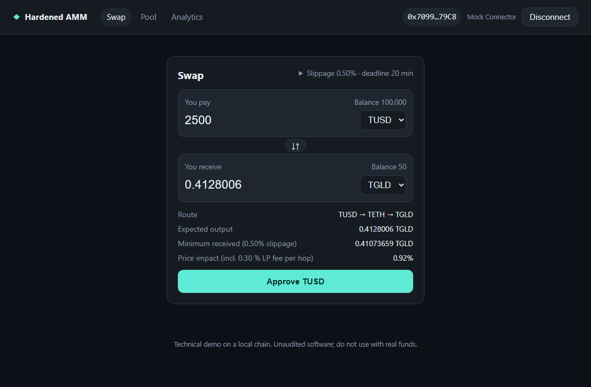
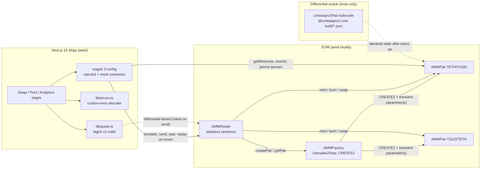
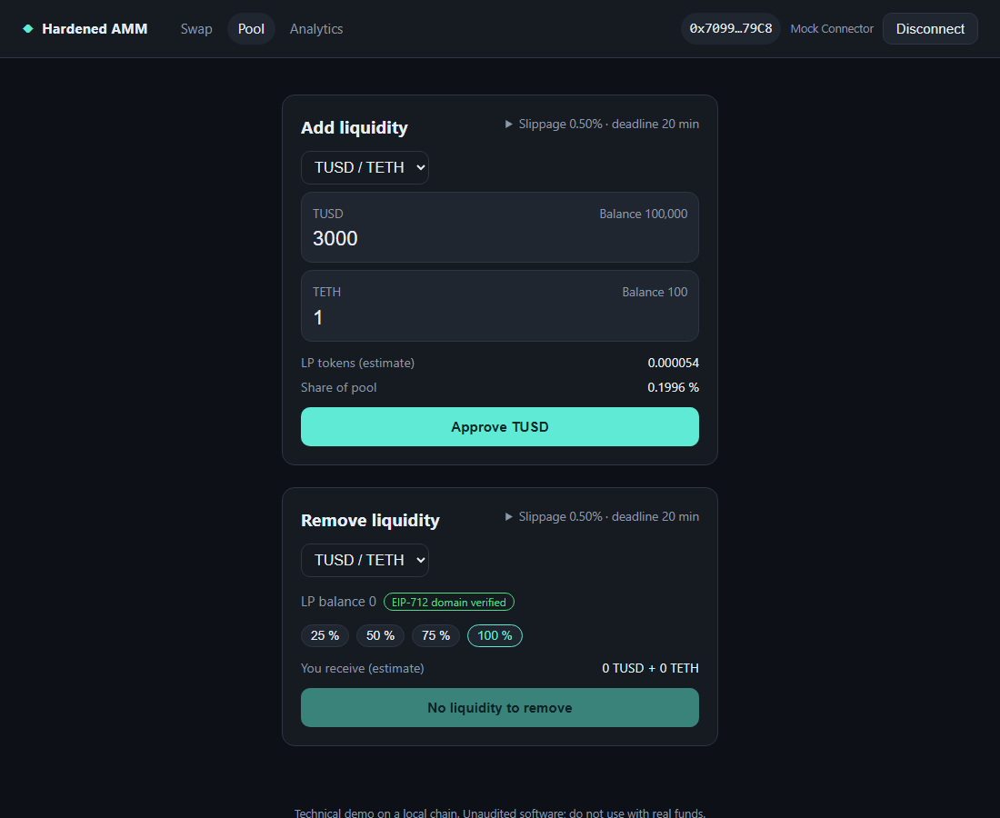

# Hardened Constant-Product AMM + Next.js 16 Swap dApp

A Uniswap-v2-class AMM rebuilt to a hardening checklist and differentially fuzzed against the canonical
`UniswapV2Pair` bytecode, with a Next.js 16 + wagmi 3 swap and liquidity dApp that Playwright drives against a real
anvil chain.

[](https://github.com/monzon1985/blockchain/actions/workflows/12-hardened-amm-dapp.yml)
[](#license)


> Technical demonstration. Not audited, not deployed, no real funds.



## What's interesting here

- **The canonical pair's own bytecode is the test oracle.** The differential suite loads `UniswapV2Factory` from the
  `@uniswap/v2-core@1.0.1` npm build artifacts (`vm.readFile` + `vm.parseJson`), proves the pair bytecode hashes to
  the mainnet init-code hash `0x96e8…845f`, deploys the factory with `CREATE` (it then creates the canonical pair
  itself) and drives both pairs with identical `mint` / `burn` / `swap` / `skim` / `sync` / donation / LP-transfer /
  time-warp (including the 2^32 timestamp wrap) / protocol-fee sequences. Outcome, return values, reserves, both
  TWAP accumulators, `kLast`, LP supply, every LP balance and every token balance must be **identical**: 9 stateless
  differential fuzz tests plus a stateful differential invariant (8,192 handler calls locally, 25,600 in CI). Every
  intentional difference is listed in [`docs/DEVIATIONS.md`](docs/DEVIATIONS.md) (9 pair/factory deviations,
  6 router deviations).
- **Hardened and cheaper.** A transient-storage (EIP-1153) lock, exposed through `isLocked()` and enforced inside
  `getReserves()`, kills read-only reentrancy: in
  [`ReadOnlyReentrancy.t.sol`](contracts/test/unit/ReadOnlyReentrancy.t.sol) the canonical pair hands a
  mid-`burn` oracle an LP price **more than 9x** too high, and the hardened pair reverts. Measured on cold storage next
  to the canonical bytecode, the hardened pair is still **6.6 % cheaper per swap, 7.6 % per mint, 7.5 % per burn and
  15.2 % per `createPair`** (partly from the newer compiler; see [Gas](#gas)); `getReserves()` pays 166 gas for the
  lock check.
- **100 % line, statement, branch and function coverage of `src/`** (295/295 lines, 113/113 branches) from
  **146 Foundry tests**: unit tests for every revert path, 7 fuzz tests, a weird-token matrix (fee-on-transfer,
  rebasing, USDT-style missing return value, `false`-returning, 6/18/24 decimals), and **9 stateful invariants**
  driven by 13 handler actions that each `assert` their exact effect (a swap delivers exactly the router's quote, a
  burn pays exactly the pro-rata share) and fail on any revert outside their list of expected errors. The same
  harness runs under **Medusa**: 22 tests (the 9 invariants as properties, the 13 actions in assertion mode), about
  194,000 calls in its 300 s time box on a 16-core dev machine (the count varies with the machine and its load),
  0 failures.
- **The UI cannot show a price the chain won't honour.** The TypeScript quote library is bit-for-bit the Solidity
  math, including 0.8 checked arithmetic (an input the router rejects with `Panic(0x11)` is an error, not a quote)
  and the pair's 112-bit reserve ceiling. It is differential-tested against the deployed router on anvil: 600 seeded
  `getAmountsOut` / `getAmountsIn` routes (identical amounts or the same custom error), 150 more with inputs up to
  2^256 - 1 (the library overflows exactly where the router panics), 30 executed swaps where the quote settles to the
  wei and one wei past it reverts, and LP estimates equal to what the pair mints. Playwright then checks the number
  rendered in the browser against `router.getAmountsOut` to the wei.
- **A real-chain end-to-end loop.** 49 vitest tests (8 fast-check properties at 500 runs each, plus anvil-backed
  hook, differential and gas suites; a wallet that switches to another chain is blocked before anything is signed)
  and **6 Playwright specs** on `next build && next start` against a fresh anvil: swap, two-hop exact-output, add
  liquidity, remove with an EIP-2612 permit (one transaction, no approval), analytics from events, and a front-run
  swap that reverts on-chain and is decoded into a "price moved beyond your slippage tolerance" toast.

## Overview

Uniswap v2 is one of the most forked contract systems in DeFi, and forks regularly add bugs the original did not
have or keep the ones it has. The common failure modes are well known: a reentrancy lock that integrators cannot
see (read-only reentrancy), a first depositor who inflates the LP share price, rounding that favours the trader,
fee-on-transfer or rebasing tokens that desynchronise reserves, stale or unbounded router transactions, and a
frontend whose quote is computed with floats and does not match what the contracts execute.

"Rewrite it in Solidity 0.8 and add a few checks" is easy. Showing that the rewrite still behaves **exactly** like
the original everywhere it is supposed to is not, and neither is showing that the dApp on top of it quotes what the
chain will settle. This project does both:

1. **Contracts.** `AMMFactory`, `AMMPair` and `AMMRouter` in Solidity 0.8.37 with custom errors, an EIP-1153
   reentrancy lock, immutable tokens (no `initialize`), a Solady ERC-20 LP token with EIP-2612, a correctly rounded
   `sqrt`, the `MINIMUM_LIQUIDITY` lock, and TWAP accumulators whose intentional overflow is confined to an
   explicit, commented `unchecked` block.
2. **Proof of equivalence.** The canonical `UniswapV2Pair` bytecode, not a re-implementation of it, is the oracle.
   Equality is required on every observable, so a single rounding difference anywhere fails the suite.
3. **The dApp.** A Next.js 16 app-router UI with a custom wagmi 3 connect flow, exact `bigint` quote math shared
   with the tests, permit-based liquidity removal, event-sourced pool analytics, and custom errors decoded into
   messages a trader can act on.

## Architecture



| Component | Responsibility | Key external calls |
|---|---|---|
| [`AMMPair`](contracts/src/AMMPair.sol) | Constant-product pool and LP token (Solady ERC-20 + EIP-2612). `mint`, `burn`, `swap` (with validated flash-swap callback), `skim`, `sync`, TWAP accumulators, protocol-fee mint. | `IERC20.balanceOf` / `safeTransfer` on its two tokens; `IAMMFactory.feeTo`; `IAMMCallee.ammSwapCall` (flash swaps only, lock held). |
| [`AMMFactory`](contracts/src/AMMFactory.sol) | Permissionless `CREATE2` pair deployment with sorted tokens; passes the tokens to the pair constructor through transient storage; owner sets the protocol-fee recipient. | `new AMMPair{salt}()`. |
| [`AMMRouter`](contracts/src/AMMRouter.sol) | Stateless periphery: add / remove liquidity (also with permit and fee-on-transfer support), exact-in and exact-out multi-hop swaps, fee-on-transfer swaps, quote views. Every entry point has a deadline and a slippage bound. | `safeTransferFrom` (user to pair), `IAMMPair.mint` / `burn` / `swap` / `getReserves`, `IERC20Permit.permit`, `IAMMFactory.createPair`. |
| [`AMMLibrary`](contracts/src/libraries/AMMLibrary.sol) | `getAmountOut` / `getAmountIn` / `quote` (bit-for-bit v2), `CREATE2` pair derivation, chained multi-hop quotes. | `IAMMPair.getReserves`. |
| [`web/src/lib/quote.ts`](web/src/lib/quote.ts) | The same math in `bigint`, plus price impact, `minOut` / `maxIn`, LP mint and burn estimates. | None (pure). |
| [`web/src/lib/errors.ts`](web/src/lib/errors.ts) | Decodes every custom error of router, pair, factory, Solady ERC-20, SafeERC20 and the OZ guard into an actionable message. | None (pure). |
| [`web/src/hooks/useTransaction.ts`](web/src/hooks/useTransaction.ts) | Simulate, sign, send, wait; if the transaction was mined but reverted, replay it at the mined block to recover the custom error for the toast. Every write carries the deployment's `chainId`, so a wallet on another network is refused before signing. | `simulateContract`, `estimateContractGas`, `writeContract`, `waitForTransactionReceipt`. |
| [`web/src/hooks/useNetworkGuard.ts`](web/src/hooks/useNetworkGuard.ts) | Compares the chain the wallet reports (`useConnection().chainId`) with the deployment's; the connect button offers a switch and every swap, liquidity and permit action is disabled until they match. | None (wagmi state). |
| [`contracts/script/DeployLocal.s.sol`](contracts/script/DeployLocal.s.sol) | Local demo: protocol, three tokens (6 / 18 / 24 decimals), two seeded pools (so TUSD to TGLD is two hops), demo balances, JSON manifest for the dApp. | Factory, router, tokens. |
| [`web/scripts/dev.mjs`](web/scripts/dev.mjs), [`e2e-chain.mjs`](web/scripts/e2e-chain.mjs) | Boot anvil on a free port, run the forge deploy script, write the manifest, start `next dev` (or `next build && next start` for Playwright). | `anvil`, `forge script`, `next`. |

## Roles and trust assumptions

| Role | Can | Cannot | If compromised |
|---|---|---|---|
| `AMMFactory.owner` (`Ownable2Step`) | `setFeeTo(address)`: switch the protocol fee (1/6 of LP fee growth) on, off, or to another recipient. | Pause, upgrade, touch reserves, mint or burn LP, change swap math. | The protocol fee (at most 0.05 % of volume, only while switched on) is redirected. LP principal is unaffected. |
| Pairs and router | Nothing privileged: no admin functions, no upgradability. | | |

The router holds no funds and no state between transactions (invariant I-7), so it can only spend approvals users
gave it. Tokens are untrusted; the weird behaviours that are handled are listed in the
[threat model](docs/THREAT_MODEL.md), together with what is out of scope (tokens that can move holder balances
arbitrarily).

## Invariants and properties

Stateful invariants run in the Foundry suite ([`AMMInvariant.t.sol`](contracts/test/invariant/AMMInvariant.t.sol),
handler [`AMMSystem.sol`](contracts/test/invariant/AMMSystem.sol): three tokens with 18 / 6 / 24 decimals, the three
pairs between them, the router, three actors and a flash borrower; 13 actions including flash swaps, fee-on-transfer
paths, donations, `skim`, `sync`, time warps and protocol-fee toggles) **and** under Medusa
([`AMMMedusa.sol`](contracts/test/medusa/AMMMedusa.sol): the same system, with the invariants as `property_*`
functions and the actions as assertion tests).

| # | Property (plain English) | Enforced by |
|---|---|---|
| I-1 | `k = reserve0 * reserve1` never decreases, except on burn. | `invariant_kNeverDecreasesExceptOnBurn` / `property_kNeverDecreasesExceptOnBurn` |
| I-2 | The LP supply only drops on burn. | `invariant_lpSupplyOnlyDropsOnBurn` / `property_lpSupplyOnlyDropsOnBurn` |
| I-3 | Reserves never exceed the pair's actual token balances. | `invariant_reservesNeverExceedBalances` / `property_reservesNeverExceedBalances` |
| I-4 | A round-trip swap (A to B to A through the same pair) never returns more than was put in. | `invariant_roundTripSwapsNeverProfit` / `property_roundTripSwapsNeverProfit` |
| I-5 | `sqrt(k)` per LP share never decreases, except for the dilution of the protocol-fee mint. | `invariant_lpShareValueNeverDecreases` / `property_lpShareValueNeverDecreases` |
| I-6 | `MINIMUM_LIQUIDITY` stays locked at `address(0)` in every pair, forever. | `invariant_minimumLiquidityLockedForever` / `property_minimumLiquidityLockedForever` |
| I-7 | The router holds no tokens and no LP tokens between transactions. | `invariant_routerHoldsNothing` / `property_routerHoldsNothing` |
| I-8 | LP `totalSupply` equals the sum of all holder balances. | `invariant_lpSupplyEqualsSumOfHolders` / `property_lpSupplyEqualsSumOfHolders` |
| I-9 | The transient reentrancy lock is never left held after a transaction. | `invariant_lockReleasedBetweenTransactions` / `property_lockReleasedBetweenTransactions` |
| DP-1 | For any sequence of mint, burn, swap, skim, sync, donations, LP transfers, time warps (including the 2^32 wrap) and fee toggles, the hardened pair and the canonical bytecode agree on success/failure, return values and every observable listed above. | [`invariant_hardenedPairMatchesCanonicalBytecode`](contracts/test/differential/CanonicalDifferentialInvariant.t.sol) |
| DP-2 | `getAmountOut` is exactly the canonical k-check boundary: the quote is accepted by both pairs and one more wei is rejected by both. | [`testFuzz_diff_getAmountOutIsTheExactKBoundary`](contracts/test/differential/CanonicalDifferential.t.sol) |
| DP-3 | The TypeScript quote equals the on-chain router quote (or fails with the same custom error, `Panic(0x11)` included) for every seeded route and size, up to 2^256 - 1. | [`test/quote.anvil.test.ts`](web/test/quote.anvil.test.ts) |

I-1 to I-9 are stateful invariants; DP-1 to DP-3 are differential properties (the `D-` labels in
[`DEVIATIONS.md`](docs/DEVIATIONS.md) are intentional deviations, a different list).

The handler checks itself, so a green campaign cannot be a vacuous one:

- **Postconditions.** Every successful action `assert`s its exact effect: a swap delivers exactly
  `router.getAmountsOut` / `getAmountsIn` (the fee-on-transfer path: exactly the output priced on what each pair
  holds), a deposit mints exactly the pair's LP formula, a burn pays exactly the pro-rata share of the balances, a
  flash swap costs the borrower exactly its repayment, `skim` and `sync` leave the pair in sync.
- **Only expected reverts are swallowed.** A reverting router or pair call is ignored only if its error is on that
  action's list (dust that rounds to a zero output, an exact output above the reserve, an empty withdrawal, ...). Any
  other revert is re-raised, and `fail_on_revert = true` fails the campaign; under Medusa it is an assertion failure.
- **Non-vacuity.** `afterInvariant` requires every run that attempted 8 or more swaps, exact-output swaps or burns
  to have executed at least one of each (`checkNotVacuous`), so a regression that made every swap revert with an
  "expected" error still fails. (Measured with the fixed seed: about 90 % of swaps, 80 % of exact-output swaps and
  96 % of burns succeed.)

[`AMMHarness.t.sol`](contracts/test/invariant/AMMHarness.t.sol) proves each guard with a broken router simulated
through `vm.mockCall` / `vm.mockCallRevert`, for the Foundry handler and the Medusa harness. A manual mutation run
shows why the postconditions matter: with `AMMPair.burn` paying 1 wei less, all nine invariants still hold (the pool
only gains), but Medusa fails the `removeLiquidity` and `removeLiquiditySupportingFeeOnTransfer` assertion tests.

## Security considerations

The full threat model (assets, actors, attack surface mapped to the OWASP Smart Contract Top 10, trust assumptions
and known limitations) is in [`docs/THREAT_MODEL.md`](docs/THREAT_MODEL.md). The short version:

- **Reentrancy, including read-only**: every state-changing pair function holds an EIP-1153 lock;
  `getReserves()` is `nonReentrantView`, and `isLocked()` lets integrators check explicitly.
- **Flash swaps** require the receiver to be a contract that returns
  `keccak256("IAMMCallee.ammSwapCall")`; `k` is enforced after the callback.
- **Inflation attack**: 1,000 LP units are locked at `address(0)` on the first deposit.
- **Rounding** always favours the pool: `getAmountOut` rounds down, `getAmountIn` rounds up (floor + 1), `burn`
  rounds down; the k check charges the fee on the input side in 256-bit arithmetic.
- **Weird tokens**: `SafeERC20` everywhere, input amounts measured as balance deltas, fee-on-transfer swaps and
  removals check slippage on what the recipient received, rebases reconciled through `skim` / `sync`.
- **MEV**: every router entry point takes a deadline and a slippage bound; the dApp derives both from its settings.
- **Wrong network**: the dApp compares the chain the wallet reports with the deployment's chain, blocks swaps,
  liquidity and permits until they match, and pins every write to the deployment's chain id.
- **Permit front-running**: `removeLiquidityWithPermit` survives a front-run permit when the allowance is already in
  place. The dApp only signs if the EIP-712 domain it rebuilds equals the pair's on-chain `DOMAIN_SEPARATOR`.
- **Static analysis**: Slither 0.11.6 reports 0 findings on `src/` (each suppression is inline with its
  justification); `forge lint` is clean with three project-wide exclusions justified in `foundry.toml`.

**Known limitations.** Spot price is manipulable within a block (use the TWAP accumulators); positive rebases are
skimmable by anyone until `sync`; fee-on-transfer tokens need the `SupportingFeeOnTransferTokens` functions; LP
permits are ECDSA-only (EIP-2612), so contract wallets use `approve` + `removeLiquidity`. Nothing here has been
professionally audited.

## Design decisions and trade-offs

- **Bytecode oracle, not a port.** Porting `UniswapV2Pair` to 0.8 inside the test suite would test the port. Loading
  the 2020 artifacts and checking their hash against the mainnet init-code hash means the reference cannot drift.
- **Immutable tokens via transient constructor parameters.** The factory writes `(token0, token1)` to transient
  storage, the pair constructor reads them back. No `initialize` to misuse, two cold `SLOAD`s saved per call, and the
  init code (so the `CREATE2` address formula) stays independent of the tokens. The cost: a different init-code hash,
  exposed as `PAIR_INIT_CODE_HASH` so integrators never hard-code it.
- **Transient lock as a public API.** Making `getReserves()` revert while locked is a deliberate behaviour change
  (deviation D-1 in [`DEVIATIONS.md`](docs/DEVIATIONS.md)): an integrator that reads reserves inside a callback now fails loudly
  instead of reading a stale price. It costs 166 gas per `getReserves()` call.
- **Solady ERC-20 for the LP token.** Cheaper transfers and permit than OpenZeppelin's, with Permit2's implicit
  infinite allowance switched off so allowance semantics match the canonical pair. Token transfers to and from the
  pair still go through OpenZeppelin `SafeERC20`.
- **No ETH entry points in the router.** Removing `*ETH*` functions removes every payable path (ETH cannot get
  stuck) at the cost of requiring users to wrap ETH first.
- **Permit made front-run-tolerant.** A bare `permit` call reverts if someone submitted the signature first; the
  router accepts that case if the allowance already covers the removal.
- **Runtime-configured dApp.** The Next.js server reads the RPC URL and deployment manifest per request, so one
  `next build` works against any anvil port and any fresh deployment, which is what lets Playwright run on a random
  port.
- **Exact quotes, no floats.** Every amount in the UI is a `bigint` in base units; formatting never rounds up.
- **Mined-but-reverted transactions are replayed.** Receipts carry no revert data, so the dApp re-simulates the same
  call at the block that mined it to recover the custom error (this is how the front-run slippage toast is decoded).
- **Gas margin.** Writes are sent with the estimate plus 20 %. The first trade of a block also writes the pair's TWAP
  accumulators, which an estimate taken in the previous trade's block does not see:
  [`gas.anvil.test.ts`](web/test/gas.anvil.test.ts) mines blocks by hand and shows the bare estimate running out of
  gas inside the pair's `swap`, and the same transaction succeeding with the margin.

### Deviations from the repository standards

- **No reentrancy guard on the router** (standards section 3 asks for `ReentrancyGuardTransient` where external
  calls meet state). The router keeps no state and never custodies tokens: users pay pairs directly and outputs go
  straight to the recipient, so a reentrant call can only spend the reentering caller's own approvals. The pairs,
  which hold the funds, carry the transient lock; invariant I-7 (the router holds nothing) checks the premise.
- **`web/src/generated.ts` has no SPDX header** (section 10). It is the verbatim output of `@wagmi/cli`, which CI
  regenerates and compares (`npm run wagmi:check`), so a hand-added header would make that check fail. It is covered
  by the `web/` MIT license.
- **Medusa is time-boxed and unseeded** (section 4 asks for fixed seeds in CI). The campaign runs for 300 s with
  Medusa's own random seed, so the call count and the sequences it explores vary between runs and machines; a
  failure prints the shrunk call sequence that reproduces it. The Foundry suites that gate the same nine invariants,
  and the fast-check properties, use fixed seeds.
- **License.** The contracts are GPL-3.0-or-later, not MIT, because they derive from Uniswap v2 (see
  [License](#license)).

## Testing

### Commands

```bash
cd contracts
npm ci                                   # canonical Uniswap v2-core build artifacts (the differential oracle)
forge soldeer install                    # forge-std 1.16.2, OpenZeppelin 5.7.0, Solady 0.1.26 (soldeer.lock)
forge fmt --check && forge build && forge lint
forge test                               # also compares GasBench with snapshots/; FOUNDRY_PROFILE=ci for deeper campaigns
forge snapshot --check --match-contract GasBench
forge coverage --gas-snapshot-check false --gas-snapshot-emit false --report summary --no-match-coverage "(test|script|dependencies)"
medusa fuzz --config medusa.json --timeout 300
FOUNDRY_PROFILE=slither slither . --config-file slither.config.json

cd ../web
npm ci && npx playwright install chromium   # on Linux: npx playwright install --with-deps chromium
npm run typecheck && npm run lint
npm test                                 # vitest: unit + anvil-backed differential, hook and gas tests
npm run build
npm run test:e2e                         # Playwright: fresh anvil + next build && next start
```

Coverage builds without the optimizer, so it must neither check nor rewrite the committed gas snapshots (the two
`--gas-snapshot-*` flags). After an intended gas change, re-record with
`forge test --match-contract GasBench --gas-snapshot-check false` and `forge snapshot --match-contract GasBench`.

Everything runs offline: no RPC endpoints, no API keys, no forks. Every server (anvil, `next dev`,
`next start`) binds a port the OS reports as free.

### Suites

| Suite | Location | Tests | What it covers |
|---|---|---|---|
| Pair unit | [`test/unit/AMMPair.t.sol`](contracts/test/unit/AMMPair.t.sol) | 25 | Metadata, EIP-712 domain, permit, first and subsequent mints, burn, swaps at the exact quote, every revert, skim, sync, 112-bit ceiling, TWAP (incl. 2106 wrap and 2^256 wrap), protocol fee. |
| Flash swaps and reentrancy | [`test/unit/AMMPairFlashSwap.t.sol`](contracts/test/unit/AMMPairFlashSwap.t.sol) | 12 | Repaid / underpaid flash swaps, magic value, code check, callee authentication, reentry into every entry point and into `getReserves()`. |
| Router unit | [`test/unit/AMMRouter.t.sol`](contracts/test/unit/AMMRouter.t.sol) | 38 | Liquidity (optimal amounts, minimums, deadline, recipient), permit (exact, max, front-run, bad signature, expired), exact-in / exact-out / fee-on-transfer swaps over 1 and 2 hops, invalid paths, quote helpers, statelessness. |
| Factory unit | [`test/unit/AMMFactory.t.sol`](contracts/test/unit/AMMFactory.t.sol) | 11 | `CREATE2` address, sorted immutable tokens, every revert, fee setter, two-step ownership. |
| Read-only reentrancy | [`test/unit/ReadOnlyReentrancy.t.sol`](contracts/test/unit/ReadOnlyReentrancy.t.sol) | 2 | The same attack against the canonical bytecode (leaks a >9x LP price) and the hardened pair (reverts). |
| Weird tokens | [`test/weird/WeirdTokens.t.sol`](contracts/test/weird/WeirdTokens.t.sol) | 13 | Fee-on-transfer (as input, output, intermediate hop, removal), rebasing up and down, USDT-style, `false`-returning, 6/18/24-decimal fuzzed lifecycle, 24-decimal reserve ceiling. |
| Fuzz | [`test/fuzz/AMMFuzz.t.sol`](contracts/test/fuzz/AMMFuzz.t.sol) | 7 | First mint = floor(sqrt) - 1000, `getAmountOut` is the largest accepted output, `getAmountIn` round trip, round trips never profit, add/remove never returns more, multi-hop = chained hops, exact-out delivers exactly. |
| Differential (stateless) | [`test/differential/CanonicalDifferential.t.sol`](contracts/test/differential/CanonicalDifferential.t.sol) | 12 | Oracle authenticity (2), 9 fuzzed differential scenarios, harness sanity (1). |
| Differential (stateful) | [`test/differential/CanonicalDifferentialInvariant.t.sol`](contracts/test/differential/CanonicalDifferentialInvariant.t.sol) | 1 | DP-1 over 11 handler actions. |
| Invariants | [`test/invariant/AMMInvariant.t.sol`](contracts/test/invariant/AMMInvariant.t.sol) | 1 suite, 9 invariants | I-1 to I-9 over 13 self-checking handler actions, plus the non-vacuity guard after every run. |
| Harness self-tests | [`test/invariant/AMMHarness.t.sol`](contracts/test/invariant/AMMHarness.t.sol) | 11 | A broken router (mocked) is caught: unexpected reverts re-raised (Foundry) or turned into assertion failures (Medusa), wrong deliveries, payouts and mints fail the postconditions, an all-reverting run fails the non-vacuity guard; real actions pass. |
| Gas bench | [`test/gas/GasBench.t.sol`](contracts/test/gas/GasBench.t.sol) | 13 | Every user-facing operation, core pair operations next to the canonical bytecode. |
| **Foundry total** | | **146** | 13 suites, 0 skipped. |
| Medusa | [`test/medusa/AMMMedusa.sol`](contracts/test/medusa/AMMMedusa.sol) | 22 | 9 `property_*` + the 13 handler actions in assertion mode (view functions are not counted); 300 s, 4 workers, time-boxed: 194,138 calls and 1,939 sequences in the last local run (the count varies by machine), 0 failures. |
| Quote library | [`web/test/quote.test.ts`](web/test/quote.test.ts) | 13 | Known vectors, error parity with `AMMLibrary` (including where 256-bit checked arithmetic overflows and the 112-bit reserve ceiling), 8 fast-check properties (500 runs, fixed seed) with the pair's k check and the unbounded formula as oracles. |
| Web library | [`web/test/lib.test.ts`](web/test/lib.test.ts) | 16 | Input and slippage parsing, formatting, manifest validation (CREATE2 check), routing, error decoding (every protocol error has a message; panics; wrong network), analytics aggregation. |
| Settings panel | [`web/test/settings.test.tsx`](web/test/settings.test.tsx) | 3 | A cleared custom slippage returns to the default preset (never 0 %), invalid input is ignored, presets clear the field. |
| Quote vs chain | [`web/test/quote.anvil.test.ts`](web/test/quote.anvil.test.ts) | 8 | Manifest = chain, 300 + 300 seeded quotes vs the router, 150 quotes up to 2^256 - 1 (41 overflow on both sides), 30 executed swaps (to the wei, one wei past reverts), LP estimates, the reserve ceiling. |
| Hooks on anvil | [`web/test/hooks.anvil.test.tsx`](web/test/hooks.anvil.test.tsx) | 6 | `usePools`, `useSwapQuote` (exact-in two-hop, exact-out), quote errors, `useTransaction` with a decoded slippage revert, a wallet that switches to chain 1 (buttons disabled, nothing sent, switch back). |
| Gas margin on anvil | [`web/test/gas.anvil.test.ts`](web/test/gas.anvil.test.ts) | 3 | The bare estimate runs out of gas on the first trade of a new block; the same transaction with the 20 % margin succeeds. |
| **vitest total** | | **49** | 6 files. |
| End-to-end | [`web/e2e/amm.spec.ts`](web/e2e/amm.spec.ts) | 6 | Swap (UI quote = router quote), two-hop exact-out, add liquidity, remove with permit, front-run slippage revert decoded in the toast, analytics. |

### Coverage

`forge coverage --gas-snapshot-check false --gas-snapshot-emit false --report summary --no-match-coverage "(test|script|dependencies)"`:

| File | Lines | Statements | Branches | Functions |
|---|---|---|---|---|
| `src/AMMFactory.sol` | 100 % (25/25) | 100 % (21/21) | 100 % (10/10) | 100 % (5/5) |
| `src/AMMPair.sol` | 100 % (113/113) | 100 % (145/145) | 100 % (36/36) | 100 % (14/14) |
| `src/AMMRouter.sol` | 100 % (113/113) | 100 % (132/132) | 100 % (45/45) | 100 % (21/21) |
| `src/libraries/AMMLibrary.sol` | 100 % (44/44) | 100 % (55/55) | 100 % (22/22) | 100 % (8/8) |
| **Total** | **100 % (295/295)** | **100 % (353/353)** | **100 % (113/113)** | **100 % (48/48)** |

CI fails if line or branch coverage of `src/` drops below 100 %.

### Fuzz and invariant settings

| Profile | Fuzz runs | Invariant runs x depth | Seed |
|---|---|---|---|
| `default` (local) | 1,000 | 128 x 64 (8,192 calls per invariant suite) | `0x12a33` |
| `ci` | 5,000 | 256 x 100 (25,600 calls per invariant suite) | `0x12a33` |
| Medusa | | 4 workers, sequences of 100 calls, 300 s time box | Medusa's own (unseeded) |
| fast-check | 500 per property | | `0x12a33` |

## Gas

Measured with `vm.snapshotGasLastFrame` in [`GasBench`](contracts/test/gas/GasBench.t.sol), each call isolated in its
own transaction (cold storage, as for a real user), same tokens and reserves for both pairs. Committed in
[`contracts/snapshots/`](contracts/snapshots) and [`.gas-snapshot`](contracts/.gas-snapshot). `foundry.toml` sets
`gas_snapshot_check = true`, so every `forge test` (any profile) compares the named snapshots with what it measures
and fails on a difference instead of rewriting the files; CI also runs `forge snapshot --check` and ends with
`git diff --exit-code` on both.

| Operation | Canonical `UniswapV2Pair` | Hardened `AMMPair` | Delta |
|---|---:|---:|---:|
| `swap` | 107,266 | 100,236 | -7,030 (-6.6 %) |
| `mint` | 115,061 | 106,358 | -8,703 (-7.6 %) |
| `burn` | 135,330 | 125,146 | -10,184 (-7.5 %) |
| `sync` | 90,302 | 83,930 | -6,372 (-7.1 %) |
| `getReserves` | 2,504 | 2,670 | +166 (+6.6 %) |
| `createPair` (factory) | 2,507,014 | 2,125,880 | -381,134 (-15.2 %) |

The canonical bytecode was compiled with solc 0.5.16 in 2020, so part of the gap is the compiler (0.8.37, custom
errors, 1,000,000 optimizer runs); the rest is design: immutable `factory` / `token0` / `token1` instead of storage
reads, and an EIP-1153 lock instead of an `SSTORE`-based one. `getReserves()` is the one operation that gets more
expensive, by the lock check.

Router entry points (frame gas, cold):

| Operation | Gas |
|---|---:|
| `swapExactTokensForTokens`, 1 hop | 125,668 |
| `swapExactTokensForTokens`, 2 hops | 209,041 |
| `swapTokensForExactTokens`, 1 hop | 126,185 |
| `swapExactTokensForTokensSupportingFeeOnTransferTokens`, 1 hop | 126,304 |
| `addLiquidity` (existing pair) | 144,476 |
| `removeLiquidity` | 143,495 |
| `removeLiquidityWithPermit` | 174,923 |

## Getting started

### Prerequisites

| Tool | Version | Needed for |
|---|---|---|
| Foundry (`forge`, `anvil`) | 1.8.3 | Contracts, local chain, deploy script |
| Node.js / npm | 24 / 11 | Differential oracle artifacts, dApp, vitest, Playwright |
| Medusa + crytic-compile | 1.5.1 / 0.4.2 | Optional: stateful fuzzing |
| Slither | 0.11.6 | Optional: static analysis |

### Install, build, test

See [Commands](#commands). On a fresh clone, `contracts/` needs `npm ci` and `forge soldeer install` before the
first build; `web/` needs `npm ci` and `npx playwright install chromium`. On Linux use
`npx playwright install --with-deps chromium`, which also installs the system libraries Chromium needs (CI does).

### Local demo

```bash
cd contracts && npm ci && forge soldeer install && forge build
cd ../web && npm ci
node scripts/dev.mjs        # or: npm run dev
```

`dev.mjs` starts anvil on a free port, runs `script/DeployLocal.s.sol` (factory, router, TUSD / TETH / TGLD with
6 / 18 / 24 decimals, a TETH/TUSD and a TGLD/TETH pool, demo balances for anvil accounts #1 to #3), writes
`web/deployments/local.json` and starts `next dev` on another free port. Open the printed URL and choose
**Anvil test account** (wagmi's mock connector bound to anvil's unlocked account #1) or an injected wallet pointed
at the printed RPC URL. Ctrl+C stops everything it started.

The Next.js server reads its configuration per request from the environment (set by `dev.mjs` and
`e2e-chain.mjs`; no secrets involved; see [`web/.env.example`](web/.env.example)):

| Variable | Meaning |
|---|---|
| `AMM_RPC_URL` | JSON-RPC endpoint of the chain (anvil's free port). |
| `AMM_DEPLOYMENT_FILE` | Deployment manifest written by `DeployLocal.s.sol` (default `deployments/local.json`). |
| `AMM_ENABLE_MOCK_CONNECTOR` | `1` enables wagmi's mock connector. Local chains only. |
| `AMM_MOCK_ACCOUNTS` | Comma-separated unlocked anvil accounts the mock connector exposes. |



For a real network, `script/Deploy.s.sol` deploys the factory and router with a Foundry keystore
(`--account <name>`), never a raw key. It has not been used on any public network.

## Project structure

```
12-hardened-amm-dapp/
├── contracts/
│   ├── src/
│   │   ├── AMMFactory.sol            # CREATE2 pairs, Ownable2Step fee setter
│   │   ├── AMMPair.sol               # pool + Solady LP token, transient lock, TWAP
│   │   ├── AMMRouter.sol             # stateless periphery
│   │   ├── interfaces/               # IAMMPair, IAMMFactory, IAMMRouter, IAMMCallee
│   │   └── libraries/AMMLibrary.sol  # v2 quote math, CREATE2 derivation
│   ├── LICENSE                       # GPL-3.0 (the contracts derive from Uniswap v2)
│   ├── test/
│   │   ├── unit/                     # pair, flash swaps, router, factory, read-only reentrancy
│   │   ├── fuzz/                     # stateless properties
│   │   ├── weird/                    # weird-token matrix
│   │   ├── differential/             # canonical bytecode oracle (stateless + stateful)
│   │   ├── invariant/                # shared system, Foundry invariants, harness self-tests
│   │   ├── medusa/                   # Medusa harness over the same system
│   │   ├── gas/                      # GasBench
│   │   └── mocks/ utils/             # weird tokens, callees, canonical loader
│   ├── script/                       # Deploy (keystore) and DeployLocal (anvil demo + manifest)
│   ├── snapshots/  .gas-snapshot     # committed gas numbers
│   ├── foundry.toml  soldeer.lock  medusa.json  slither.config.json
│   └── package.json                  # @uniswap/v2-core@1.0.1 (oracle artifacts only)
├── web/
│   ├── src/app/                      # Next.js app router: swap, pool, analytics, health route
│   ├── src/components/               # connect UI, swap and liquidity cards, analytics, toasts, settings
│   ├── src/hooks/                    # pools, swap quote, token state, network guard, transaction lifecycle
│   ├── src/lib/                      # quote math, routing, errors, manifest, runtime config, wagmi config
│   ├── src/generated.ts              # @wagmi/cli Foundry plugin output (ABIs + hooks)
│   ├── scripts/                      # dev.mjs, e2e-chain.mjs, shared chain orchestration
│   ├── test/                         # vitest (unit + anvil)
│   └── e2e/                          # Playwright
└── docs/
    ├── DEVIATIONS.md                 # every intentional difference from Uniswap v2
    ├── THREAT_MODEL.md
    └── img/
```

## Scope notes and future work

- **Router is not in the bytecode oracle.** The canonical router lives in `v2-periphery` (Solidity 0.6.6, with WETH
  entry points this router deliberately does not have). Its math is instead checked against the canonical pair's k
  check (DP-2), and its behaviour by unit, fuzz and invariant tests.
- **Wallets.** The connect UI offers injected wallets (EIP-6963 discovery) and, for local development and tests only,
  wagmi's mock connector. WalletConnect is not included because it needs a hosted project ID, which conflicts with
  the offline, key-free test setup.
- **Analytics** are rebuilt from `eth_getLogs` since the deployment block. That is right for a local chain; a public
  deployment would need an indexer for long ranges.
- **ERC-1271.** LP permits follow EIP-2612 (ECDSA), as in the canonical pair, so smart-contract wallets remove
  liquidity with `approve` + `removeLiquidity`. This departs from the repository standard's ERC-1271 recommendation
  in favour of byte-level parity with v2 permits.
- **Not deployed** to any public network; there is no TVL, no users and no audit.
- Future work: a TWAP consumer library with tests across the accumulator wrap; Halmos proofs of the
  `getAmountOut` / `getAmountIn` boundary for all inputs; a differential suite against the `v2-periphery` router
  bytecode for the functions both routers share.

## License

The Solidity code in [`contracts/`](contracts) is **GPL-3.0-or-later**: `AMMPair`, `AMMFactory`, `AMMRouter`,
`AMMLibrary` and their interfaces follow the structure, identifiers and algorithms of Uniswap's
[`v2-core`](https://github.com/Uniswap/v2-core) and [`v2-periphery`](https://github.com/Uniswap/v2-periphery), which
are published under GPL-3.0-or-later, so they are a derivative work and carry that license. Each derived file names
its original in its header. The tests and scripts in `contracts/` are GPL-3.0-or-later as well, so the whole
directory has one license; the text is in [`contracts/LICENSE`](contracts/LICENSE). This is the exception the
repository standard allows (section 10: MIT unless a dependency's license requires otherwise).

The dApp in [`web/`](web) is **MIT**. It contains no Uniswap code and talks to the contracts only through their ABIs.

## References

- H. Adams, N. Zinsmeister, D. Robinson, [*Uniswap v2 Core*](https://uniswap.org/whitepaper.pdf) (2020), and the
  [`Uniswap/v2-core`](https://github.com/Uniswap/v2-core) / [`v2-periphery`](https://github.com/Uniswap/v2-periphery)
  code this project derives from and is measured against (GPL-3.0-or-later; the npm `@uniswap/v2-core@1.0.1`
  artifacts are the test oracle).
- RareSkills, [*Uniswap V2 Book*](https://www.rareskills.io/uniswap-v2-book): the hardening checklist this design
  follows (reentrancy, inflation, rounding, TWAP overflow, fee-on-transfer).
- ChainSecurity, [*Curve LP Oracle Manipulation: Post Mortem*](https://www.chainsecurity.com/blog/curve-lp-oracle-manipulation-post-mortem)
  (2022): the read-only reentrancy class reproduced in `ReadOnlyReentrancy.t.sol`.
- [EIP-1153](https://eips.ethereum.org/EIPS/eip-1153) (transient storage), [EIP-2612](https://eips.ethereum.org/EIPS/eip-2612)
  (permit), [EIP-712](https://eips.ethereum.org/EIPS/eip-712), [EIP-6963](https://eips.ethereum.org/EIPS/eip-6963).
- [`d-xo/weird-erc20`](https://github.com/d-xo/weird-erc20): the catalogue the weird-token matrix draws from.
- OpenZeppelin Contracts 5.7 (`ReentrancyGuardTransient`, `SafeERC20`, `Ownable2Step`) and Solady 0.1.26 (`ERC20`,
  `FixedPointMathLib`).
- Trail of Bits [Medusa](https://github.com/crytic/medusa) and [Slither](https://github.com/crytic/slither);
  [Foundry](https://github.com/foundry-rs/foundry); [wagmi](https://wagmi.sh) and [viem](https://viem.sh);
  [Next.js](https://nextjs.org); [Playwright](https://playwright.dev); [fast-check](https://fast-check.dev).
- [OWASP Smart Contract Top 10 (2026)](https://scs.owasp.org/sctop10/).
