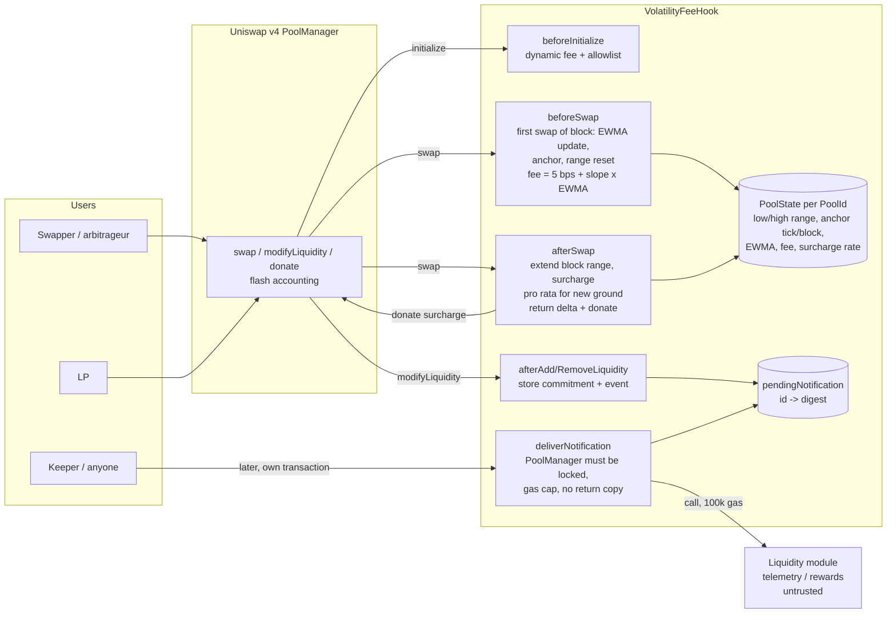

# Uniswap v4 Volatility-Aware Dynamic-Fee Hook with LVR Recapture

A Uniswap v4 hook that prices every swap from an in-hook EWMA of per-block tick volatility (clamped to 5-100 bps, no
external oracle) and donates a top-of-block surcharge back to in-range LPs. Trail of Bits' seven hook failure patterns
are encoded as invariants and adversarial tests.

[](https://github.com/monzon1985/blockchain/actions/workflows/13-v4-volatility-fee-hook.yml)


> Technical demonstration. Not audited, not deployed, no real funds.

## What's interesting here

- **The Trail of Bits checklist as an executable suite.** Each of the seven failure patterns from
  ["Building secure Uniswap v4 hooks"](https://blog.trailofbits.com/2026/07/30/building-secure-uniswap-v4-hooks/)
  has its own tests (16 in `TrailOfBitsPatterns.t.sol`), backed by 5 permission-bit tests, 16 hostile-module exit
  tests and 18 adversarial tests. **175 Foundry test functions (20 fuzz tests, 10 stateful invariants), 100% line and
  branch coverage** of `src/` (168/168 lines, 33/33 branches), and **17 of 17 committed mutants killed**,
  reproducible with `bash script/mutants.sh` (patches in [`test/mutants/`](test/mutants)).
- **Exits cannot depend on the module, by construction.** The optional reward/telemetry module never runs inside a
  swap, an addition or an exit: liquidity callbacks only store a keccak256 commitment and emit the notification, and
  anyone delivers it later through `deliverNotification`, which refuses to run while the PoolManager is unlocked. An
  earlier in-unlock try/catch sandbox was shown by an external review to be bypassable (a module took 1 wei and paid
  another party's debt with `settleFor`, leaving the PoolManager's open-delta count unchanged and an LP's multi-action
  exit unsettled); that attack is now a regression test that passes. An exit costs exactly the same gas whatever the
  module does.
- **A surcharge that splitting cannot game (at constant liquidity).** Each block keeps the price range its swaps
  have reached. A swap pays only for the part of its move that leaves the range, pro-rated in the coordinate in which
  its currency is linear (sqrt(P) for token1, 1/sqrt(P) for token0). A dust swap first does not shield the arbitrage
  behind it, and a swap that crosses the block's opening price pays the same, within 1 wei, as the same trade split
  at that price. The review's cliff (0 or 0.5% of the whole trade depending on 2 ticks of end price) is gone, and a
  pool-level fuzz test checks that splitting a swap at any price, in either direction, changes the total surcharge by
  at most 1 wei. The pro rata assumes the in-range liquidity is constant along the swap; where it is much thinner on
  one side of the block's opening price, a trader can still undercut the surcharge deliberately (in a measured case
  the trader keeps 88% of it; see known limitation 5).
- **Rounding checked across repeated operations, which was the Bunni lesson.** 1,096 exact reference vectors
  (integer/rational arithmetic and mpmath at 120 digits) test both the rounding *direction* and an *analytic error
  bound*, including 42 sequences of 50 EWMA updates (worst drift 41 wei, never above the exact value) and 268
  range-extension surcharges (never below the exact value, never more than 1 wei above).
- **An honest GBM replay.** Four seeded regimes are replayed through a static 30 bps pool and three hook
  configurations, and the reports are pinned byte for byte in `test/fixtures/replay/`. In this model a static 30 bps
  pool matches or beats every hook configuration on LP fees, and beats all of them on LP P&L vs HODL, in all four
  regimes. The default curve averages 11.2-17.3 bps, so arbitrageurs extract more from it than from the static pool in
  3 of 4 regimes. What the surcharge does show is partial LVR recapture relative to the same fee curve without it:
  21-30% less arbitrage profit in the normal, stressed and regime-switch regimes (see [Testing](#testing)).

## Overview

Constant-function AMMs lose money to arbitrageurs every time the external price moves: the pool trades at a stale
price, and the first transaction in the next block captures the difference. This is loss-versus-rebalancing (LVR;
Milionis, Moallemi, Roughgarden and Zhang, 2022). Two levers help LPs. A fee that scales with volatility makes
arbitrage pay more when LVR is high. A surcharge on the trades that realize the stale-price gap hands part of that
value back to LPs.

Uniswap v4 hooks make both possible, but they are easy to get wrong. A hook sits inside the PoolManager's
flash-accounting loop, so a sign error, a rounding direction, a missing permission bit or a reverting side module
either leaks value while still satisfying the PoolManager's settlement check or bricks the pool. The work here is
split between the mechanism and making each of those failure modes a test.

**Mechanism.**

1. On the first swap of every block, `beforeSwap` reads the pool's current tick (the previous block's close). The
   absolute move since the previous anchor (the opening tick of the last block that traded) becomes one EWMA sample,
   the current tick becomes the new anchor, and the block's price range collapses to the current price. Blocks
   without swaps count as zero-move samples, decayed in O(log k). The block's LP fee, `5 bps + slope * EWMA` clamped
   to 100 bps, is returned with `OVERRIDE_FEE_FLAG` for every swap in that block.
2. `afterSwap` extends the block's price range [low, high] to the post-swap price and charges a volatility-scaled
   surcharge on the part of the swap's unspecified amount that corresponds to the move beyond the previous range (the
   whole amount for the block's first swap, nothing for a swap that stays inside the range). The hook takes it as an
   `afterSwapReturnDelta` and donates it to the in-range LPs in the same callback, so it never holds funds.
3. `beforeInitialize` accepts only dynamic-fee pools with owner-allowlisted currencies. `afterAddLiquidity` and
   `afterRemoveLiquidity` commit a notification for the optional module to a queue; `deliverNotification` hands it to
   the module later, outside any unlock.

## Architecture



| Component | Responsibility | Key external calls |
|---|---|---|
| `src/VolatilityFeeHook.sol` | Callbacks, per-pool oracle and range state, surcharge, notification queue and delivery, admin (`Ownable2Step`) | `PoolManager.extsload` (via `StateLibrary.getSlot0` / `getLiquidity`), `PoolManager.donate`, `PoolManager.exttload` (lock check at delivery), module `onLiquidityModified` (only from `deliverNotification`) |
| `src/libraries/VolatilityMath.sol` | Pure fixed-point math: decay `(1-a)^k`, EWMA update, fee and surcharge curves, pro-rated range surcharge | none |
| `src/modules/LiquidityTelemetry.sol` | Reference module: per-pool liquidity counters, callable only by the hook | none |
| `src/interfaces/*` | `IVolatilityFeeHook` (types, events, errors), `ILiquidityModule` | none |
| `BaseHook`, `HookMiner` (v4-periphery 1.0.3) | `onlyPoolManager` gating, permission validation at construction, CREATE2 salt mining | |
| `IHookEvents` (OpenZeppelin uniswap-hooks 1.1.1) | Standard `HookFee` event for indexers | |

Per-pool state lives in two storage slots: the low edge of the block's range with the EWMA (`uint88`, enough for the
largest possible tick move) and the registered flag; and the high edge, anchor tick and block, fee and surcharge rate
(`uint16` each, at most 10,000 pips), which is all a same-block swap reads. The pre-swap price reaches `afterSwap`
through an EIP-1153 transient slot keyed by `PoolId`, namespaced ERC-7201 style. Queued notifications are one
`bytes32` commitment each, deleted on delivery.

## Roles and trust assumptions

| Role | Can do | If compromised |
|---|---|---|
| Owner (`Ownable2Step`) | Allowlist currencies for **new** pools; set or clear the liquidity module; transfer or renounce ownership | Can allowlist a bad token for future pools. Can set a module, which raises the cost of every liquidity operation in every pool, existing ones included and with immediate effect, by a fixed ~33k gas (queueing one notification: 175,937 -> 208,572 gas for a removal), whatever the module does. Cannot make a module run during a swap, an addition or an exit, cannot impose a gas floor on LPs, and cannot touch funds, fees, swaps or exits. |
| Liquidity module | Receives delivered notifications | Wastes at most 100,000 gas of whoever delivers to it, inside that deliverer's transaction and while the PoolManager is locked (all accounting calls revert there). Nothing it does can affect a swap, an addition, an exit or another user's transaction. |
| Keeper (anyone) | Delivers queued notifications | Nothing: only committed notifications, only once, only outside an unlock, only with the module's full gas budget. |
| PoolManager | Calls the hook, holds all funds | Trusted (unmodified Uniswap v4-core). |

The fee curve (`alphaWad`, `feeSlopePips`, `surchargeSlopePips`, `maxSurchargePips`) is immutable and there is no
proxy. Allowlisted tokens are assumed to be standard ERC-20s (no fee-on-transfer, no rebasing). Full threat model:
[`docs/threat-model.md`](docs/threat-model.md).

## Invariants and properties

Stateful invariants run over random sequences of swaps (exact in/out, both directions, settled in ERC-20 or in
ERC-6909 claims), same-transaction round trips, liquidity additions and removals (plain, or inside a multi-action
unlock that also swaps in another pool), donations, claim redemptions, block production (including jumps of up to
100,000 blocks), module swaps between none, telemetry, reverting, gas-guzzling, delta-leaking, count-neutral,
nested-swap and sync-hijacking modules, and notification deliveries
([`VolatilityFeeInvariants.t.sol`](test/invariant/VolatilityFeeInvariants.t.sol), handler
[`VolatilityFeeHandler.sol`](test/invariant/VolatilityFeeHandler.sol)).

1. **I-1 The hook holds no value**: no ERC-20, no ETH, no ERC-6909 claims, at any time.
   `invariant_I1_hookHoldsNoValue`
2. **I-2 Every surcharge is donated**: the sum of `HookFee` amounts equals the sum of PoolManager `Donate` amounts
   from the hook. `invariant_I2_surchargesFullyDonated`
3. **I-3 No output without a matching charge**: whether a swap settles in ERC-20 or in ERC-6909 claims, the trader's
   balance change equals the PoolManager's swap delta minus exactly the surcharge (and the other settlement kind does
   not move), and a surcharge never exceeds the amount it is charged on. `invariant_I3_swapAccountingReconciles`
4. **I-4 A round trip cannot create value**: selling and buying back in the same transaction never leaves a trader
   with at least as much of both tokens and more of one. `invariant_I4_roundTripsNeverProfit`
5. **I-5 Fees stay in bounds**: every applied LP fee is within [5, 100] bps, and the surcharge rate stays within its
   cap. `invariant_I5_feesWithinBounds`
6. **I-6 One fee per block**: the oracle updates at most once per block, so every swap in a block pays the same fee
   (the fee in the PoolManager's `Swap` event). `invariant_I6_feeConstantWithinBlock`
7. **I-7 The EWMA is bounded by what it has seen**: it never exceeds the largest per-block tick move observed.
   `invariant_I7_ewmaBoundedByLargestSample`
8. **I-8 The PoolManager stays solvent, and everyone can leave**: after every call, each currency's ERC-20 balance
   covers every open position's claim (principal at the current price plus uncollected fees, computed from
   PoolManager state without withdrawing) plus every ERC-6909 claim, and claims redeem one for one
   (`invariant_I8_poolManagerSolvent`). At the end of every run every LP exits in full and receives exactly that
   computed claim, every claim holder redeems, the static pool's LP is paid its computed claim, and every pending
   notification can be delivered (`afterInvariant`). Removals and deliveries never revert: `fail_on_revert = true`.
9. **I-9 The block's price range brackets the price**: in a surcharged block the price never leaves [low, high], no
   swap pays more than the full rate on its unspecified amount, and the swap that opens a surcharged block is always
   charged when it moves an amount and leaves liquidity in range. `invariant_I9_blockPriceRange`
10. **I-10 Notifications are queued and delivered once**: every liquidity change made while a module is set is
    queued (the hook's counter equals the events observed), and a delivered notification can never be delivered again.
    `invariant_I10_notificationsQueuedAndDeliveredOnce`
11. **Hook deltas reconcile with PoolManager deltas**: inside the unlock, right after every swap, the hook's
    `currencyDelta` is zero in both currencies. `BatchSwapRouter._assertHookSettled` and the Medusa harness's
    `unlockCallback`

A per-run check asserts that the run made swaps; `test_handlerReachesEveryPath` drives the handler through a scripted
sequence and requires every ghost counter (claim-settled swaps, surcharged swaps, charged block openings, round trips,
plain and multi-action exits, donations, redemptions, successful and failed deliveries) to be non-zero, so none of the
properties above can be vacuous for lack of a path.

The Medusa harness ([`test/medusa/VolatilityFeeMedusa.sol`](test/medusa/VolatilityFeeMedusa.sol)) drives its own
sequences of swaps (ERC-20 and claim-settled), round trips, liquidity changes, donations, redemptions, block jumps,
module swaps and deliveries, and checks 5 `property_*` functions plus in-line assertions. Its fee properties use the
fee the PoolManager actually *applied*, measured from the fee growth credited to every position during each
exact-input swap (at least 1e15 of input, where one pip is 1e9 wei against a few wei of rounding): it must equal what
`quoteFees` announced, lie in [5, 100] bps and be the same for every swap in a block. It also checks I-7 against the
largest sample the harness observed, the price range bracket (I-9), solvency (I-8), that every removal and every
delivery succeeds, and that no notification can be delivered twice.

## Security considerations

### Trail of Bits' seven hook failure patterns

| # | Pattern | How this hook handles it | Tests |
|---|---|---|---|
| 1 | Anyone can call your hook | `onlyPoolManager` on all 10 callbacks (periphery `BaseHook`); admin is `onlyOwner`; delivery is permissionless but only accepts committed notifications | `testFuzz_ToB1_callbacksRejectEveryoneButThePoolManager`, `testFuzz_ToB1_adminAndDeliveryRejectOutsiders` |
| 2 | Treating any pool as legitimate | `beforeInitialize` requires `DYNAMIC_FEE_FLAG` and allowlisted currencies; all state keyed by `PoolId` | `test_ToB2_attackerPoolCannotTouchLegitimatePoolState`, `test_ToB2_unvettedPoolKeysAreRejected` |
| 3 | Custom accounting leaks value | Charge equals donation within one callback; the hook holds nothing; rounding favours LPs; repeated and split operations tested | `testFuzz_ToB3_everyChargeMatchesItsDonation`, `testFuzz_ToB3_roundTripInOneTransactionCannotCreateValue`, `test_ToB3_fiftyTinySwapsCannotUndercutOneSwap`, `testFuzz_ToB3_splittingASwapCannotUndercutTheSurcharge`, `test_ToB3_fiftyLiquidityCyclesCannotExtractValue` |
| 4 | Right logic, wrong hook | Sample, anchor and range reset in `beforeSwap` (pre-swap = block open); surcharge from the realized delta and donated to post-swap liquidity in `afterSwap` | `test_ToB4_firstSwapCannotPriceItsOwnFee`, `test_ToB4_donationReachesPostSwapLiquidityOnly` |
| 5 | Address bits are part of the API | HookMiner-mined address; all 14 bits compared with `getHookPermissions()` and with the callbacks that are actually implemented | `test_ToB5_*` and [`HookPermissions.t.sol`](test/unit/HookPermissions.t.sol), including a reproduction of the missing-`afterSwapReturnDelta` bug class that bricks every surcharged swap |
| 6 | Hook failures can block pool actions | Module never runs during pool actions (queue + delivery outside the unlock); surcharge skipped when no liquidity is in range; overflow-free math at extreme ticks | `test_ToB6_*`, [`ExitAlwaysWorks.t.sol`](test/security/ExitAlwaysWorks.t.sol) |
| 7 | State can change during a callback sequence | Transient hand-off keyed by `PoolId` and cleared after use; no hook state written after an external call | `test_ToB7_interleavedPoolsInOneUnlock`, `test_ToB7_moduleCannotMutatePoolStateMidExit` |

### Why the module never runs inside an unlock

The first version of this hook called the module from `afterRemoveLiquidity` inside a try/catch self-call sandbox:
a gas cap, no return-data copy, and a comparison of the PoolManager's open-delta count and `sync` checkpoint before and
after the call. An external review broke it. The delta count is global, so a module can take 1 wei (count +1) and pay
off *another* party's open debt with `sync`, a transfer and `settleFor` (count -1, sync cleared): the three words match,
the sandbox lets the module through, and the LP's whole transaction reverts with `CurrencyNotSettled` whenever the
exit shares its unlock with another open delta, as in PositionManager-style batches. The checks cannot be made
airtight from inside the unlock: native-ETH debts can be settled without `sync`, and the reserves word can be restored
by syncing a token with a chosen balance.

So the module no longer runs there at all. `afterAddLiquidity` and `afterRemoveLiquidity` store
`keccak256(abi.encode(module, notification))` under a sequence number and emit the notification; this can only fail by
running out of gas. `deliverNotification(id, module, notification)` is permissionless and:

- reverts with `PoolManagerUnlocked` if the PoolManager is unlocked, so a module can never touch anyone's flash
  accounting (with the PoolManager locked, `take`, `settle`, `mint`, `burn`, `swap` and `modifyLiquidity` all revert);
- accepts only data matching the stored commitment and deletes it before the call, so each notification is delivered
  at most once, to the module that was active when it was queued;
- requires `gasleft() >= 100,000 * 64/63 + 15,000`, so a keeper cannot starve the module on purpose (otherwise the
  notification stays pending);
- calls the module with a 100,000-gas cap and zero-length output (a codeless address succeeds as a no-op, a return bomb
  costs nothing to the caller), and records the outcome in `LiquidityNotificationDelivered(id, module, success)`
  instead of propagating a failure.

This deviates from the original requirement of a try/catch *in `afterRemoveLiquidity`*; the try/catch semantics now
live in `deliverNotification`, which is where they can be made to hold.

Further detail, including known limitations (JIT capture of donations, an oracle that only sees its own pool,
warm-up at the 5 bps floor, the constant-liquidity assumption of the pro rata, L1-style `block.number`, asynchronous
notifications), is in [`docs/threat-model.md`](docs/threat-model.md). Static-analysis triage is in
[`docs/static-analysis.md`](docs/static-analysis.md): Slither 0 findings, `forge lint` 0 warnings, every suppression
justified inline.

## Design decisions and trade-offs

**Rounding-direction table.**

| Quantity | Direction | Why | Error bound (checked) |
|---|---|---|---|
| Decay factor `(1-a)^k` | down | Never overstate stale volatility | < 2^bitlen(k) wei; worst observed 953 wei over 210 vectors, 187 exact |
| EWMA update | down | A contraction: errors never compound, and a quiet pool decays to exactly 0. Rounding up would stick at `e` whenever `a*e < 1` wei (`test_updateEwma_roundDownReachesZero_roundUpWouldStick`) | 0 for one block; else `2 + e1*2^bitlen(k-1)/1e18` wei; worst observed 78,048,871 wei with inputs up to 1.77e24 (ticks x 1e18) |
| 50 repeated updates | down | Drift stays one-directional and below the sum of per-step bounds | Worst observed 41 wei |
| LP fee from EWMA | up | Charged to the swapper | exact (88 vectors) |
| Surcharge rate | up | Charged to the swapper | exact (198 vectors) |
| Surcharge amount | up, never above the base amount | Charged to the swapper; `ceil(x*r) <= x` for `r <= 100%` | exact (110 vectors) |
| Range-extension surcharge | up at every step, capped at the whole-swap charge | Charged to the swapper; the cap absorbs the one-unit overshoot that rounding the token0 share twice can produce (`test_proRatedSurcharge_cappedAtTheWholeSwapCharge`) | `ceil(exact) <= got <= ceil(exact) + 1` (268 vectors; all 268 equal `ceil(exact)`) |
| Donation | exact | The hook keeps nothing | invariant I-2 |

**High-water range surcharge, pro-rated, not "first swap only".** The literal first-swap-per-block rule is bypassed by
a dust swap (in the same transaction, or in a bundle), which is cheap for a searcher. The first version here charged a
swap in full whenever it ended further from the block's opening price than it started; a review showed that rule has a
cliff for swaps that cross the opening price (0 when ending just inside the earlier move on the other side, 0.5% of
the whole trade one tick further), so splitting at the opening price could halve the charge or remove it. Now each
block keeps [low, high], the range of prices its swaps have reached, and a swap is charged only for the part of its
move beyond that range: `surcharge = ceil(amount * rate * share)`, where the share is the new ground's fraction of the
move measured in sqrt(P) for a token1 amount and in 1/sqrt(P) for a token0 amount, because those are the coordinates
in which each amount is linear at constant liquidity. The consequences:

- With constant in-range liquidity the charge is split-invariant: splitting a swap at any price changes the total by
  at most 1 wei of rounding (`testFuzz_ToB3_splittingASwapCannotUndercutTheSurcharge`), 50 small swaps never pay less
  than one large one (`test_ToB3_fiftyTinySwapsCannotUndercutOneSwap`), and the charge is continuous in the end price
  (`test_surcharge_crossingSwapPaysTheSameAsTheSplitTrade`).
- With liquidity that changes inside the swapped range, the pro rata is off by at most the ratio of the largest to the
  smallest in-range liquidity along the swap (measured in
  `test_surcharge_steppedLiquidityDeviationIsBoundedByTheLiquidityRatio`). That ratio can be large, and a trader can
  exploit it on purpose: if liquidity is thin on one side of the block's opening price and thick on the other, pushing
  the price through the thin side first is cheap and turns that side into range the block has already covered, so the
  arbitrage swap that follows is charged on only a small share of its thick new ground. In
  `test_surcharge_knownLimitation_thinSideDetourUndercutsTheArbitrage` (1,000x thicker liquidity above the opening
  price) the detour cuts the surcharge paid by 93%, and the trader keeps 88% of the surcharge after the detour's extra
  LP fees. The attack needs that liquidity profile, pays LP fees on the detour, and can at most remove the surcharge,
  never touch LP principal. Charging the exact beyond-the-edge amount would need a second tick walk; using the post-swap liquidity
  instead would let a trader end one tick into a thin region to shrink the charge.
- Ground the block already covered is free: moving back inside the range, or pushing forward again over it, pays no
  surcharge. Retail flow that trades beyond the range in the arbitrage's direction after it pays like the arbitrage.

**Sample = open-to-close move of each block.** The hook reads the tick once per block, before the block's first swap,
so each sample is the net move over the previous active block. Intra-block round trips (sandwiches) leave no trace,
and a trade cannot influence its own block's fee.

**Immutable fee curve, mutable allowlist.** Pool fee parameters cannot be changed by an admin (no governance risk
for LPs). The allowlist has to stay editable, and it only affects future pools.

**No reentrancy guard.** Callbacks are reachable only from the PoolManager and make no untrusted call; state is
written before any external call; the only untrusted call (the module, at delivery) is the last action after the
commitment is deleted. A `ReentrancyGuardTransient` would also block legitimate flows, such as a module that opens
its own unlock at delivery to flash-borrow and repay (`test_exit_flashRepayModule_isAllowed`).

**Periphery `BaseHook` plus OpenZeppelin extras, not `BaseOverrideFee`.** The external callbacks in v4-periphery's
`BaseHook` are not `virtual`, so a subclass cannot drop `onlyPoolManager` by accident. OpenZeppelin's uniswap-hooks
provides `IHookEvents` (`HookFee`) and `CurrencySettler` (used by the test routers). Its `BaseOverrideFee` (built on
OpenZeppelin's own `BaseHook`) calls a per-swap `_getFee` from `beforeSwap` and gates dynamic fees in
`afterInitialize`; this hook needs a fee cached once per block, the allowlist gate in `beforeInitialize`, and an
`afterSwap` return delta, so almost all of it would be overridden. `BaseDynamicFee` stores the fee in the pool through
`updateDynamicLPFee` and relies on a `poke` to refresh it, whereas here the first swap of each block recomputes it
without a keeper.

## Testing

```bash
forge soldeer install                          # locked dependencies (soldeer.lock)
forge fmt --check && forge build && forge lint
forge test                                     # 175 test functions, reported as 166 tests (default profile)
FOUNDRY_PROFILE=ci forge test                  # deeper fuzz / invariant campaigns (CI)
forge snapshot --check --match-contract GasBench
forge coverage --report summary --report lcov --no-match-coverage "(test|script|dependencies)"  # CI: 100% required
medusa fuzz --config medusa.json --timeout 300
slither . --config-file slither.config.json
bash script/mutants.sh                         # every committed mutant must be killed (CI: manual dispatch)
uv sync --project sim --locked
uv run --project sim python sim/gen_vectors.py --check
uv run --project sim python sim/gen_paths.py --check
uv run --project sim ruff check sim && uv run --project sim ruff format --check sim
uv run --project sim pytest sim -q
```

CI runs exactly these gates. The coverage step fails unless every line and every branch of `src/` is covered. The
GBM replay reports are regenerated only with `REPLAY_REPORT_UPDATE=true forge test --match-contract GbmReplayTest`;
otherwise the tests fail if a single character of a report changes.

| Suite | File | Tests |
|---|---|---|
| Hook unit tests (every happy path and revert path) | `test/unit/VolatilityFeeHook.t.sol` | 54 |
| Math unit and bounded fuzz | `test/unit/VolatilityMath.t.sol` | 23 (12 fuzz) |
| Differential vs exact vectors | `test/unit/VolatilityMathDifferential.t.sol` | 7 (1,096 vectors) |
| Permission bits vs implementation | `test/unit/HookPermissions.t.sol` | 5 |
| Deployment script (checked overrides) | `test/unit/DeployScript.t.sol` | 1 |
| Trail of Bits patterns | `test/security/TrailOfBitsPatterns.t.sol` | 16 (5 fuzz) |
| Exit always works (hostile modules, multi-action exits) | `test/security/ExitAlwaysWorks.t.sol` | 16 (1 fuzz) |
| Adversarial (keys, tokens, nested unlocks, extremes, many swaps) | `test/security/Adversarial.t.sol` | 18 (2 fuzz) |
| Stateful invariants | `test/invariant/VolatilityFeeInvariants.t.sol` | 10 invariants + exit/solvency check + 1 coverage test |
| GBM replay (pinned reports) | `test/replay/GbmReplay.t.sol` | 6 |
| Gas benchmark | `test/gas/GasBench.t.sol` | 17 |
| Medusa harness smoke run under Foundry | `test/medusa/MedusaHarnessSmoke.t.sol` | 1 |
| Python: bound proofs by emulation, path statistics (numpy) | `sim/tests/` | 21 |

**Settings.** Default profile: 512 fuzz runs; invariants 64 runs x depth 64 (4,096 calls, 0 reverts); seed
`0x1313`. CI profile: 4,096 fuzz runs; invariants 256 x 100 (25,600 calls, 0 reverts), same fixed seed. Medusa: 4
workers, 300 s, sequences of 100 calls; one local run made 57,439 calls and covered 3,027 branches, and all 19
tests (5 properties, 14 assertion-checked entry points) passed.

**Coverage** (`forge coverage`, production code only): 100.00% lines (168/168), 100.00% statements (214/214),
100.00% branches (33/33), 100.00% functions (28/28). CI fails below 100% of lines or branches.

**Mutation check** (`bash script/mutants.sh`). Each patch in [`test/mutants/`](test/mutants) is applied to a scratch
copy of the project and every suite except the GBM replay and the invariant campaign must fail on it. Result of the
last run:

| Mutant | What it breaks | Failing tests | Caught by (first three, alphabetical) |
|---|---|---:|---|
| M01 | afterSwap still donates the surcharge but returns a zero delta (the hook is left owing it) | 50 | `testFuzz_ToB3_everyChargeMatchesItsDonation`, `testFuzz_ToB3_roundTripInOneTransactionCannotCreateValue`, `testFuzz_ToB3_splittingASwapCannotUndercutTheSurcharge` |
| M02 | deliverNotification no longer requires the PoolManager to be locked | 1 | `test_deliver_revertsWhileThePoolManagerIsUnlocked` |
| M03 | the surcharge is donated even when the swap left no liquidity in range | 2 | `test_extremeAmounts_drainingSwapsDoNotRevert`, `test_surcharge_skippedWhenSwapLeavesNoLiquidityInRange` |
| M04 | delivery no longer requires the module's full gas budget (a keeper can starve the module on purpose) | 1 | `test_deliver_neverStarvesTheModule` |
| M05 | beforeInitialize accepts static-fee pool keys | 2 | `test_ToB2_unvettedPoolKeysAreRejected`, `test_initialize_revertsForStaticFee` |
| M06 | a swap that leaves the block's range pays on its whole amount (the reviewed crossing cliff) | 5 | `testFuzz_ToB3_splittingASwapCannotUndercutTheSurcharge`, `test_surcharge_crossingSwapPaysTheSameAsTheSplitTrade`, `test_surcharge_currency0IsProRatedInInverseSqrtPrice` |
| M07 | only the block's first price-moving swap is surcharged (the dust-first bypass) | 7 | `test_ToB3_fiftyTinySwapsCannotUndercutOneSwap`, `test_harness_scriptedSequenceKeepsProperties`, `test_surcharge_crossingSwapPaysTheSameAsTheSplitTrade` |
| M08 | the block's range is never extended, so ground already paid for is charged again | 5 | `test_harness_scriptedSequenceKeepsProperties`, `test_quoteFees_matchesNextSwap`, `test_surcharge_onlyForNewGround` |
| M09 | a currency0 amount is pro-rated by sqrt-price distance instead of 1/sqrt-price distance | 5 | `testFuzz_ToB3_splittingASwapCannotUndercutTheSurcharge`, `testFuzz_proRatedSurcharge_bounded`, `test_differential_proRatedSurcharge` |
| M10 | the EWMA update rounds up | 3 | `test_differential_ewmaUpdate`, `test_differential_repeatedUpdates50`, `test_updateEwma_roundDownReachesZero_roundUpWouldStick` |
| M11 | the LP fee rounds down | 3 | `test_differential_lpFee`, `test_lpFee_clampAndCeil`, `test_updateEwma_roundDownReachesZero_roundUpWouldStick` |
| M12 | the surcharge amount rounds down | 9 | `testFuzz_proRatedSurcharge_splittingIsAdditiveAtConstantLiquidity`, `testFuzz_surchargeAmount_neverExceedsAmount`, `testFuzz_surchargeAmount_splittingNeverPaysLess` |
| M13 | the allowlist check skips currency1 | 3 | `test_feeOnTransfer_rejectedUnlessAllowlisted`, `test_initialize_revertsForNonAllowlistedCurrency1`, `test_rebasing_rejectedUnlessAllowlisted` |
| M14 | the oracle re-samples on every swap instead of once per block | 12 | `testFuzz_ToB3_splittingASwapCannotUndercutTheSurcharge`, `test_ToB3_fiftyTinySwapsCannotUndercutOneSwap`, `test_ToB7_interleavedPoolsInOneUnlock` |
| M15 | swaps after the first in a block are charged the 5 bps floor instead of the block's fee | 5 | `test_ToB3_fiftyTinySwapsCannotUndercutOneSwap`, `test_fee_constantWithinBlock`, `test_harness_scriptedSequenceKeepsProperties` |
| M16 | a delivered notification is not consumed and can be delivered again | 14 | `test_deliver_failureIsReportedAndConsumed`, `test_exit_claimMintModule`, `test_exit_danglingDeltaModule` |
| M17 | the surcharge is computed on the specified side instead of the unspecified side | 51 | `testFuzz_ToB3_everyChargeMatchesItsDonation`, `testFuzz_ToB3_roundTripInOneTransactionCannotCreateValue`, `testFuzz_ToB3_splittingASwapCannotUndercutTheSurcharge` |

The Medusa fee properties are checked the same way: `MEDUSA_TIMEOUT=180 bash script/mutants.sh M15` runs Medusa on
the mutant, and both `property_feeConstantWithinBlock` and `property_feeWithinBounds` fail (an earlier standalone run
shrank the counterexample to three calls: a round trip, a new block, a round trip), because they compare the fee the
PoolManager applied with the announced one rather than reading the hook's stored fee.

**GBM replay** (`forge test --match-contract GbmReplayTest -vv`). There are 400 blocks per regime; sigma is 1.5, 4
and 10 bps per block, plus a 1.5 -> 12 -> 1.5 switch. Paths are generated by `sim/gen_paths.py` with a SHA-256
counter RNG and mpmath, so they are byte-identical on every platform. The pool holds 1,000e18 liquidity in +/-6,000
ticks (about 260 of each token). Per block, the arbitrageur trades first and moves the price to the edge of its
no-arbitrage band (LP fee plus surcharge); noise traders arrive with 60% probability, twice per block, trade 0.05
tokens (median, log-normal), and trade only if their marginal fee (the LP fee, plus the surcharge when the price sits
on the block's range edge in their direction) is within a tolerance drawn uniformly from 5 to 60 bps. Amounts are in
token1 (1.0000 = one token); the rows below are copied from `test/fixtures/replay/*.txt`, which the tests pin:

| Regime | Venue | LP fees | LP P&L vs HODL | Arbitrage profit | Avg LP fee | Noise trades | Surcharged arbs |
|---|---|---|---|---|---|---|---|
| calm | static 30 bps | 0.0569 | 0.0561 | 0.0000 | 3000 pips | 260 | 0 |
|  | hook default | 0.0477 | 0.0456 | 0.0003 | 1122 pips | 414 | 37 |
|  | hook, no surcharge | 0.0408 | 0.0387 | 0.0004 | 1149 pips | 429 | 0 |
|  | hook, steep | 0.0550 | 0.0530 | 0.0000 | 1968 pips | 309 | 9 |
| normal | static 30 bps | 0.0785 | 0.0779 | 0.0021 | 3000 pips | 272 | 0 |
|  | hook default | 0.0617 | 0.0612 | 0.0019 | 1225 pips | 436 | 59 |
|  | hook, no surcharge | 0.0588 | 0.0582 | 0.0027 | 1319 pips | 459 | 0 |
|  | hook, steep | 0.0746 | 0.0742 | 0.0016 | 2177 pips | 323 | 41 |
| stressed | static 30 bps | 0.1306 | -0.0954 | 0.0161 | 3000 pips | 260 | 0 |
|  | hook default | 0.1306 | -0.0973 | 0.0206 | 1728 pips | 319 | 98 |
|  | hook, no surcharge | 0.1287 | -0.0992 | 0.0261 | 1934 pips | 350 | 0 |
|  | hook, steep | 0.1188 | -0.1087 | 0.0127 | 2851 pips | 207 | 54 |
| regime switch | static 30 bps | 0.0684 | 0.0697 | 0.0024 | 3000 pips | 270 | 0 |
|  | hook default | 0.0656 | 0.0658 | 0.0043 | 1282 pips | 390 | 68 |
|  | hook, no surcharge | 0.0662 | 0.0662 | 0.0057 | 1401 pips | 412 | 0 |
|  | hook, steep | 0.0620 | 0.0625 | 0.0016 | 2104 pips | 296 | 23 |

"Default" is 5 bps/tick with a 2.5 bps/tick surcharge; "steep" is 15 bps/tick with a 5 bps/tick surcharge (caps
100 bps and 50 bps). What the numbers do and do not show:

- **The fee tracks volatility.** In the regime-switch path, with arbitrage only, the average fee goes from 6.3 bps
  (calm) to 13.3 bps (stressed) and back to 5.6 bps (`test_replay_feeFollowsRegimeSwitch`).
- **The static 30 bps pool wins for LPs in this model.** It matches or beats every hook configuration on LP fees in
  all four regimes (the default curve ties it in the stressed regime and earns 16%, 21% and 4% less in the calm,
  normal and regime-switch paths), and it beats every hook configuration on LP P&L vs HODL in all four regimes.
- **Arbitrageurs extract more from the default curve than from the static pool** in 3 of 4 regimes (calm 0.0003 vs
  0.0000, stressed 0.0206 vs 0.0161, regime switch 0.0043 vs 0.0024; normal 0.0019 vs 0.0021), because it averages
  only 11.2-17.3 bps. The steep curve extracts less than the static pool in 3 of 4 regimes but earns LPs less.
- **The surcharge gives partial LVR recapture relative to the same fee curve without it.** Arbitrage profit falls 30%
  (normal), 21% (stressed) and 25% (regime switch); in the calm regime it is below 0.0005 either way. The tests assert
  that the surcharge lowers arbitrage profit in every regime.
- **Why.** The pool's own oracle under-reads external volatility because its price only moves when the arbitrage band
  is crossed, and noise demand here is fee-elastic. Results depend on the noise model and on the parameters; the
  replay is a tool for exploring them, not evidence that the hook is better for LPs.

## Gas

From `.gas-snapshot`, whole-test gas for one call on prepared state (`forge snapshot --match-contract GasBench`):

| Operation | Static 30 bps pool | Hook pool | Delta |
|---|---:|---:|---:|
| Swap, first of a block, surcharged (oracle update + range reset + fee + donate) | 148,244 | 194,603 | +46,359 |
| Swap, first of a block, quiet (oracle update + fee) | 148,244 | 177,218 | +28,974 |
| Swap, same block, beyond the range (fee + range update + surcharge) | 131,160 | 167,987 | +36,827 |
| Swap, same block, inside the range (fee only) | 131,160 | 145,793 | +14,633 |
| Swap, same block, quiet pool (cached fee only) | 129,928 | 142,638 | +12,710 |
| Add liquidity | 242,203 | 249,636 | +7,433 |
| Add liquidity, module set (queue one notification) | 242,203 | 282,272 | +40,069 |
| Remove liquidity | 168,425 | 175,937 | +7,512 |
| Remove liquidity, telemetry module (queue only) | 168,425 | 208,572 | +40,147 |
| Remove liquidity, gas-guzzling module (queue only) | 168,425 | 208,616 | +40,191 |
| Deliver a notification to the telemetry module (keeper) | | 92,270 | |
| Deliver a notification to a gas-guzzling module (keeper, worst case) | | 165,656 | |

The 44 gas between the two module rows is test-contract overhead: `test_exit_gasDoesNotDependOnTheModule` measures
identical exit gas for counting, reverting, gas-guzzling and return-bomb modules. The quiet first-of-block row pays for
resetting the block's range in both storage slots even when the EWMA does not change. The PoolManager in tests is
v4-core compiled with this project's settings (legacy pipeline, 1,000,000 runs), not the canonical via-IR build, so
absolute numbers differ from mainnet; the deltas are the hook's cost.

## Getting started

Prerequisites: Foundry 1.8.3, Python 3.12 with uv 0.12, Medusa 1.5.1 and crytic-compile 0.4.2 (fuzzing), and
Slither 0.11.6 (static analysis).

```bash
cd projects/13-v4-volatility-fee-hook
forge soldeer install
forge build
forge test
bash script/local-demo.sh   # anvil on a free port, deploy, deliver a notification, trade across blocks
```

The local demo starts anvil with `--port 0`, deploys a PoolManager, two tokens, the routers, the telemetry module and
the hook (salt mined with HookMiner against the CREATE2 deployer) using anvil's unlocked default account, adds
liquidity, delivers the queued notification in its own transaction, sends four swaps in four blocks, and prints
`getPoolState`, `quoteFees`, the queue and the telemetry counters. One run printed an EWMA of 4.459 ticks, a 27.30 bps
fee, an 11.15 bps surcharge rate, notification 0 delivered, and one addition of 1,000e18 liquidity recorded by the
module. Deployment to a real network is keystore-based:

```bash
POOL_MANAGER=0x... HOOK_OWNER=0x... \
  forge script script/DeployVolatilityFeeHook.s.sol --rpc-url <url> --account <keystore-name> --broadcast
```

The optional overrides `ALPHA_WAD`, `FEE_SLOPE_PIPS`, `SURCHARGE_SLOPE_PIPS` and `MAX_SURCHARGE_PIPS` are narrowed with
`SafeCast`, so an out-of-range value reverts instead of wrapping into a different (immutable) curve. A keeper that
delivers notifications must give the transaction enough gas for the hook's check (~117,000 at that point):
`eth_estimateGas` finds it, `forge script` needs `--gas-estimate-multiplier` above its default.

## Project structure

```
13-v4-volatility-fee-hook/
├── src/
│   ├── VolatilityFeeHook.sol            # the hook
│   ├── libraries/VolatilityMath.sol     # EWMA, decay, fee, surcharge and pro-rata math
│   ├── modules/LiquidityTelemetry.sol   # reference liquidity module
│   └── interfaces/                      # IVolatilityFeeHook, ILiquidityModule
├── test/
│   ├── unit/                            # hook, math, differential, permission bits, deploy script
│   ├── security/                        # Trail of Bits patterns, exit-always-works, adversarial
│   ├── invariant/                       # handler + 10 invariants + exit/solvency check
│   ├── replay/                          # GBM replay report
│   ├── gas/                             # GasBench (.gas-snapshot)
│   ├── medusa/                          # Medusa harness + Foundry smoke run
│   ├── mutants/                         # committed mutants (unified diffs against src/)
│   ├── utils/                           # fixture, routers, position claims, hostile modules, odd tokens
│   └── fixtures/                        # vectors.json, gbm_paths.json, replay/*.txt (generated, committed)
├── sim/                                 # uv project: mpmath/numpy generators and pytest
├── script/                              # HookMiner deployment, local anvil demo, mutation runner
├── docs/                                # threat model, static-analysis triage
├── foundry.toml, soldeer.lock, medusa.json, slither.config.json, .gas-snapshot, .env.example
```

## Scope notes and future work

- **Deviations from the engineering standards.**
  - *solc 0.8.26 / cancun instead of 0.8.37 / osaka*: v4-core pins 0.8.26 and relies on transient storage (cancun);
    the hook is compiled with the same compiler as the PoolManager it is tested against.
  - *Legacy pipeline (`via_ir = false`)*: `forge coverage` instruments an unoptimized, non-IR build, so the hook must
    compile without via-IR anyway; building everything on the legacy pipeline keeps one pipeline for tests, gas
    snapshots and coverage. Consequences: the PoolManager built this way is 26,934 bytes, over EIP-170's 24,576
    (tests do not enforce the limit; the local demo runs anvil with `--code-size-limit` and `forge script` with
    `--disable-code-size-limit`); stack-depth limits shaped a few functions; and custom errors are raised with
    `if (...) revert Error(...)`, because 0.8.26 supports `require(bool, Error)` only under via-IR.
  - *No `ReentrancyGuardTransient`*: justified under "No reentrancy guard" above.
- **Deviations from the original requirements.** The surcharge is not literally "first swap per block" (see the
  design section), and the module is not called with try/catch inside `afterRemoveLiquidity` but queued and delivered
  outside the unlock (see "Why the module never runs inside an unlock").
- **Dependencies through Soldeer, not git submodules.** The monorepo forbids submodules, so the Uniswap and
  OpenZeppelin repositories are Soldeer git dependencies pinned by commit in `soldeer.lock`. The verification command
  `git submodule update --init --recursive` is therefore `forge soldeer install`.
- **v4-core commit.** OpenZeppelin uniswap-hooks 1.1.1 and v4-periphery 1.0.3 import `types/PoolOperation.sol`,
  which is absent at the `v4.0.0` tag. The project pins v4-core to `d153b048` (npm `@uniswap/v4-core` 1.0.2), the
  exact commit uniswap-hooks 1.1.1 builds against. Its `src/` differs from `v4.0.0` only by moving `SwapParams` and
  `ModifyLiquidityParams` into `PoolOperation.sol` (and by test contracts).
- **Future work.** Directional fees in the style of Alex Nezlobin's proposal (raise the fee in the direction of the
  last block's move); vesting donations over a few blocks against JIT capture; an exact beyond-the-edge amount for
  swaps that cross initialized ticks; a per-pool or timelocked module setting; a walk-forward fit of the slope and
  alpha on historical data, and routing-aware noise demand, since the replay shows the fee curve matters more than the
  mechanism.

## Prior art

- **Volatility-driven fees.** Trader Joe's Liquidity Book adds a variable fee driven by a volatility accumulator of
  the bins crossed, decayed over time; Algebra's adaptive fee derives the fee from the pool's own volatility and
  volume measured by its built-in oracle. This hook keeps a per-block EWMA of tick moves inside a v4 hook, fixes the
  fee for the whole block before its first swap, and needs no oracle contract.
- **Recapturing top-of-block value for LPs.** Sorella's Angstrom runs an auction for the right to trade first in each
  block, through an off-chain node network, and pays the proceeds to LPs; Robinson and White's "Priority Is All You
  Need" proposes MEV taxes, charged as a function of a transaction's priority fee on chains with competitive priority
  ordering; the am-AMM (Adams, Moallemi, Reynolds and Robinson), used by Bunni v2, auctions the right to set the fee
  and capture arbitrage. This hook uses no auction and no priority-fee signal: it scales a surcharge on the new ground
  a block's trades cover, which is simpler and chain-agnostic but recaptures only part of the value (see the replay).

## References

- Uniswap Labs, [v4-core](https://github.com/Uniswap/v4-core) and [v4-periphery](https://github.com/Uniswap/v4-periphery) (`BaseHook`, `HookMiner`), and [v4 dynamic fees](https://docs.uniswap.org/contracts/v4/concepts/dynamic-fees).
- OpenZeppelin, [uniswap-hooks](https://github.com/OpenZeppelin/uniswap-hooks) (`IHookEvents`, `CurrencySettler`; `BaseOverrideFee` and `BaseDynamicFee` considered) and [openzeppelin-contracts 5.7](https://github.com/OpenZeppelin/openzeppelin-contracts) (`Ownable2Step`, `TransientSlot`, `SlotDerivation`, `SafeCast`, `Math`).
- Trail of Bits, [Building secure Uniswap v4 hooks](https://blog.trailofbits.com/2026/07/30/building-secure-uniswap-v4-hooks/) (July 2026): the seven failure patterns, the Bunni rounding exploit and the Angstrom permission-bit finding used as test cases here.
- J. Milionis, C. Moallemi, T. Roughgarden, A. L. Zhang, [Automated Market Making and Loss-Versus-Rebalancing](https://arxiv.org/abs/2208.06046) (2022).
- J. Milionis, C. Moallemi, T. Roughgarden, [Automated Market Making and Arbitrage Profits in the Presence of Fees](https://arxiv.org/abs/2305.14604) (2023).
- A. Nezlobin's directional-fee idea, as summarized in Fenbushi Capital, [Ending LPs' Losing Game](https://fenbushi.vc/2024/01/20/ending-lps-losing-game-exploring-the-loss-versus-rebalancing-lvr-problem-and-its-solutions/) (2024).
- Trader Joe, [Joe v2 Liquidity Book whitepaper](https://github.com/traderjoe-xyz/LB-Whitepaper) (variable fee and volatility accumulator).
- Algebra, [Algebra concentrated-liquidity AMM](https://github.com/cryptoalgebra/Algebra) (adaptive fee).
- Sorella Labs, [Angstrom](https://github.com/SorellaLabs/angstrom).
- D. Robinson, D. White, [Priority Is All You Need](https://www.paradigm.xyz/2024/06/priority-is-all-you-need) (Paradigm, 2024).
- A. Adams, C. C. Moallemi, S. Reynolds, D. Robinson, [am-AMM: An Auction-Managed Automated Market Maker](https://arxiv.org/abs/2403.03367) (2024).
- Nomad, [ExcessivelySafeCall](https://github.com/nomad-xyz/ExcessivelySafeCall): prior art for calls that refuse to copy return data.
- OWASP, [Smart Contract Top 10 (2026)](https://scs.owasp.org/sctop10/).
- EIP-1153 (transient storage), EIP-150 (63/64 gas forwarding), EIP-170 (code size), ERC-6909 (claims), ERC-7201 (namespaced storage).
- Crytic, [Medusa](https://github.com/crytic/medusa) and [Slither](https://github.com/crytic/slither); Foundry and Soldeer.
