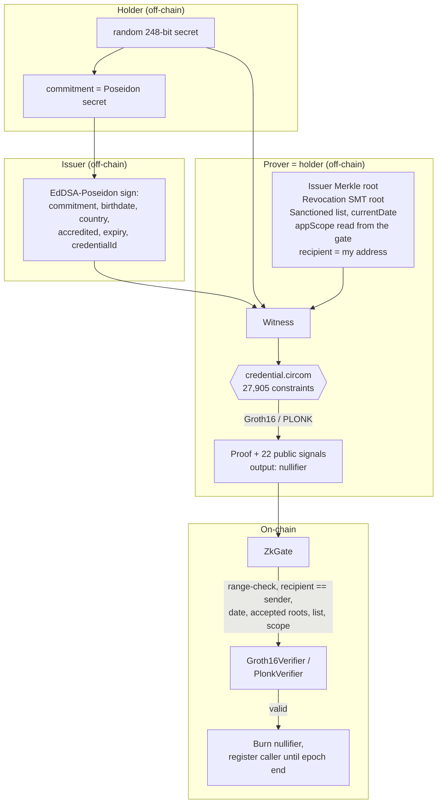

# ZK KYC Credential Gate, with an under-constrained circuit bug zoo

[](https://github.com/monzon1985/blockchain/actions/workflows/14-zk-kyc-credential-gate.yml)
[](#license)


Prove, in zero knowledge, that you hold an **unrevoked** credential from a
**trusted issuer** attesting **age ≥ 18** and a **non-sanctioned country**, and
reveal nothing but a per-gate, per-epoch nullifier. A Solidity gate verifies a
**Groth16 _or_ PLONK** proof that is bound to the submitting address, validates
every public input, burns the scoped nullifier and admits the caller to a
sample allowlist for the current epoch.

The twist: the circuit ships with **its own adversarial audit**. Three classic
**under-constrained** bugs each come with a *forged proof that verifies
on-chain* against its own flawed verifier, a fourth entry shows a fully
constrained circuit that proves the *wrong statement*, and negative-witness
tests show the production circuit rejects every one of them.

> ⚠️ **Technical demonstration only.** This is not a compliant KYC/AML product,
> is **not audited**, holds no funds, and uses a deterministic, publicly
> derivable (insecure) dev trusted setup. See [Scope notes](#scope-notes-and-future-work).

## What's interesting here

- **A soundness bug zoo with working exploits.** Three under-constrained
  circuits, each with a **real forged Groth16 proof that registers at a gate
  wired to its flawed verifier**: an unconstrained nullifier (forged by
  patching the `.wtns` with `@iden3/binfileutils`), a field-wrapped birthdate,
  and a **non-boolean Merkle selector that lets a self-generated issuer key
  pass the trusted-issuer check** against the real root. `npm run zoo` runs
  **19 checks**, including a like-for-like `snarkjs wtns check` differential:
  the same patch (the nullifier, witness index 1) passes the flawed r1cs and
  fails the production r1cs, while both unpatched witnesses pass.
- **A soundness gap inside circomlib itself, found and closed.** circomlib's
  `SMTVerifier` never constrains `isOld0` to a bit; with a non-boolean value a
  **revoked** credential rebuilds its own leaf and "proves" non-revocation
  against the *current* revocation root (during review this produced a Groth16
  proof that verified against the pre-fix production keys).
  `RevocationNonMembership` now adds
  `isOld0 * (isOld0 - 1) === 0`, and a differential test shows the raw
  circomlib gadget accepting the forgery while the guarded one rejects it.
- **Front-running-proof, address-bound, expiring registrations.** The proof
  binds `recipient = msg.sender` (a mempool copy reverts), the scope is
  `keccak256(chainid, gate address, actionId, epoch) mod r` (a clone gate
  cannot replay it), and registrations lapse every 30-day epoch so revocation
  reaches existing members. Verified on a live anvil chain by `npm run demo`.
- **Reproducible trusted setup.** The dev ceremony is beacon-only, so a fresh
  clone regenerates the **byte-identical** ptau, zkeys and verifiers;
  `npm run setup:dev -- --check` fails CI otherwise (provenance in
  [`contracts/generated/PROVENANCE.json`](contracts/generated/PROVENANCE.json)).
- **Two proof systems, one 22-signal ABI.** Groth16 verify **328,509 gas**,
  PLONK verify **276,635 gas**; end-to-end registration **479,338 / 435,263
  gas**. Committing the sanctioned list to one element would cut Groth16
  verification to **228,804 gas** (measured baseline, −30%).
- **131 tests + 19 zoo checks, 99.34% line coverage of the gate.** 56
  circom/mocha tests and 75 Foundry tests (78 functions: 50 unit/integration,
  9 fuzz properties + 1 baseline, 4 stateful invariants run as one campaign
  over 2,048 calls, 9 zoo, 5 gas benchmarks); every invariant mutation-tested.

## Overview

KYC/compliance gating usually means handing an identity document to every
dApp. This project shows the privacy-preserving alternative: a **trusted
issuer** signs a credential once, over a commitment to a secret only the
holder knows, and the holder later proves *properties* of it (adult,
non-sanctioned, unexpired, unrevoked, from a trusted issuer) in zero
knowledge, linkable to an application only through a per-gate, per-epoch
nullifier that not even the issuer can compute.

The hard part is **soundness**. A ZK circuit is only as good as its
constraints; the defining ZK-audit bug is the *under-constrained signal*, where
a witness value is computed but never pinned by a constraint, so a prover can
substitute anything. This repo makes that concrete: it builds the attacks,
proves they pass a real verifier, and proves the fixed circuit stops them.

## Architecture



| Component | Responsibility | Key external calls |
|---|---|---|
| `circuits/lib/credential_lib.circom` | Reusable gadgets, each sound on its own (age, sanctions, expiry, Merkle inclusion, nullifier, revocation). | circomlib `Poseidon`, `EdDSAPoseidonVerifier`, `SMTVerifier`, comparators. |
| `circuits/lib/credential_core.circom`, `circuits/main/credential.circom` | The production statement `CredentialGate(8, 20, 16)`, including the recipient binding. | — |
| `circuits/zoo/*.circom` | Three under-constrained variants and one domain-separation variant. | — |
| `circuits/bench/baseline_committed_list.circom` | 7-public-signal circuit used only as a gas baseline. | — |
| `src/lib` (TypeScript) | Holder secrets, issuer policy and signing, Merkle and SMT witnesses, scope derivation, proving, witness patching, zoo attack builders. | circomlibjs, snarkjs, `@iden3/binfileutils`, viem. |
| `src/cli` | `holder`, `issuer`, `world` (governor view) and `prover` CLIs. | — |
| `contracts/src/ZkGate.sol` | Validates public inputs, verifies, burns the nullifier, keeps root histories with grace windows, epoch-scoped allowlist, role-gated governance. | `IGroth16Verifier`, `IPlonkVerifier` (staticcall). |
| `contracts/generated/*` | snarkjs verifiers (production Groth16 + PLONK, 4 zoo, 1 baseline) and `PROVENANCE.json`. | bn254 precompiles. |
| `contracts/script/Deploy.s.sol`, `scripts/demo-anvil.mjs` | Keystore-signed deployment and the local end-to-end demo. | forge, cast, anvil. |

## Roles and trust assumptions

| Role | Held by | A compromised role can… |
|---|---|---|
| `DEFAULT_ADMIN_ROLE` | Deployer | Grant/revoke the roles below. |
| `GOVERNOR_ROLE` | Deployer | Publish or invalidate issuer/revocation roots, replace the sanctioned list, deregister accounts. The strongest privileged role (could trust a rogue issuer root or empty the list). |
| `DATE_ORACLE_ROLE` | Deployer | Move `currentDate` forward to any real calendar date (it cannot go backwards or leave `[19000101, 99991231]`). |

Provers and mempool observers are fully untrusted. Issuers in the tree are
semi-trusted: they sign the holder's commitment and never see the secret, the
circuit rejects field-wrapped values, and the issuer CLI refuses malformed
fields; **one-person-one-registration relies on each issuer signing one
commitment per vetted person.** See [`docs/THREAT_MODEL.md`](docs/THREAT_MODEL.md).

## Invariants / properties

1. **A nullifier is accepted at most once.** No registration ever succeeds
   with an already-burned nullifier, and the on-chain burn set equals the
   model's. → [`invariant_NoNullifierAcceptedTwice`](contracts/test/ZkGateInvariant.t.sol)
   (handler replays nullifiers from a 6-element pool; deleting the replay
   check makes it fail).
2. **Registration count equals burned nullifiers** (and successful
   registrations). → [`invariant_RegistrationCountEqualsBurnedNullifiers`](contracts/test/ZkGateInvariant.t.sol)
3. **The allowlist follows the epoch model**: an account is registered iff it
   registered in the current epoch and was not deregistered since. →
   [`invariant_AllowlistMatchesEpochModel`](contracts/test/ZkGateInvariant.t.sol)
4. **Only predicted reverts**: a fresh registration never fails; a replay
   fails with exactly `NullifierAlreadyUsed`. →
   [`invariant_OnlyPredictedReverts`](contracts/test/ZkGateInvariant.t.sol)
5. **Public-input binding**: a proof is accepted only if it is bound to the
   caller, its date, roots (accepted, not stale, not invalidated), full
   sanctioned list and scope (this gate, this epoch) match, and every signal
   is `< r`. → `ZkGate._validatePublicInputs`, fuzzed in
   [`ZkGateFuzzTest`](contracts/test/ZkGateFuzz.t.sol).
6. **Circuit soundness (adversarial)**: the production circuit rejects every
   zoo attack that its flawed twin accepts, failing inside the template that
   carries the fix. → [`test/zoo.test.ts`](test/zoo.test.ts), [`scripts/zoo.ts`](scripts/zoo.ts).

## Security considerations

Summarised here; full version, with OWASP SC Top 10 (2026) mapping, in
[`docs/THREAT_MODEL.md`](docs/THREAT_MODEL.md).

- **Front-running** (SC02): the proof binds `recipient`, and the gate
  requires `recipient == uint160(msg.sender)`; a copied proof reverts and the
  holder's nullifier is untouched.
- **Under-constrained signals** (SC05/SC09): the zoo demonstrates three
  canonical failures and the fixes; circomspect gates the production circuits
  and fails closed (self-test on a known-bad circuit).
- **Proof malleability**: the gate derives nothing from proof bytes; `appScope`
  comes only from chain data and the nullifier is a constrained output.
- **Library gadgets are not trusted blindly** (SC05): circomlib's
  `SMTVerifier` leaves `isOld0` unconstrained, which lets a revoked credential
  forge an exclusion proof against the current root. `RevocationNonMembership`
  constrains it to a bit; `test/subcircuits.test.ts` and
  `test/credential.test.ts` pin the regression.
- **Stale and compromised roots**: a superseded root is accepted only within
  its grace period (issuer default 1 day, revocation default 1 hour, both
  ≤ 30 days, 0 = latest only), and the governor can invalidate any root
  immediately. The 30-deep ring buffers bound storage.
- **Registrations are not forever**: they lapse at the end of the epoch, so
  revocation, expiry and sanctions changes reach existing members within one
  epoch; `deregister` acts immediately.
- **Reentrancy** (SC08): verification is a `staticcall`; `register*` is
  `nonReentrant` and checks-effects-interactions.
- **Known limitations**: insecure dev trusted setup; trusted governance and
  date oracle; Sybil resistance depends on the issuer; the revocation tree
  must contain the sentinel id `1` (an empty SMT has root 0, which the gate
  rejects); exact date and epoch matching invalidates in-flight proofs at
  updates; the allowlisted address is public.

## Design decisions and trade-offs

- **`appScope = keccak256(abi.encode(chainid, address(this), actionId, epoch)) mod r`.**
  Binding the gate's address is not circular: the prover reads `appScope()`
  from the deployed gate. The committed Foundry fixtures are proven for fixed
  addresses and the tests deploy there with `deployCodeTo`.
- **Epoch-scoped registrations** instead of a TTL: a TTL alone cannot be
  renewed (the nullifier is burned), while a per-epoch scope gives each epoch
  a fresh nullifier and makes renewal re-check revocation and expiry.
- **Recipient binding with a dummy quadratic constraint** (`recipient²`), the
  Semaphore pattern; snarkjs would bind an unused public input anyway, but the
  explicit constraint does not rely on that. It costs one constraint and one
  circomspect triage entry.
- **Grace windows instead of "latest root only"**: a short window avoids
  invalidating every in-flight proof on each root update; set it to 0 for
  strictness. Exact date matching was kept (see the threat model for why a
  "previous date" grace was rejected).
- **16 sanctioned entries as public inputs.** This costs 16 of the 22 public
  signals and ~100k gas per Groth16 verification (see the baseline row in
  [Gas](#gas)); committing the list to one element is listed as future work.
- **Two proof systems.** Groth16 is smaller and needs a per-circuit phase 2;
  PLONK reuses the universal SRS. Both use the same 22-signal ABI.
- **Beacon-only deterministic ceremony** for reproducibility, at the explicit
  cost of security (documented, never for production).

**Deviations from the original spec:** (1) the zoo has a fourth entry; the
spec's third bug ("nullifier not bound to `appScope`") is fully constrained,
so it is kept but relabelled as a domain-separation flaw with honest proofs,
and a genuinely under-constrained Merkle-selector bug became #3; (2) the gate
adds a `recipient` public input (22 signals, not 21), epochs, grace windows,
root invalidation and deregistration, all of which the spec did not ask for;
(3) the dev ceremony uses a beacon instead of `contribute(entropy)`, because
snarkjs mixes OS randomness into `contribute`.

## Testing

All commands run offline against local artifacts (no RPC, no keys).

```bash
npm ci
npm run typecheck && npm run lint
npm run circuits:build           # production + 4 zoo + gas-baseline circuits
npm run setup:dev                # deterministic ceremony; add `-- --check` to compare with the committed verifiers
npm test                         # circom_tester + mocha
npm run zoo                      # forged proofs + wtns-check differential
npm run lint:circuits            # circomspect, fail-closed, triage in circuits/circomspect-triage.json
npm run fixtures -- --check      # verify the committed proof fixtures against the regenerated keys
cd contracts
forge soldeer install
forge fmt --check && forge build
FORGE_SNAPSHOT_CHECK=true forge test   # without the variable, forge rewrites snapshots/GasBench.json
forge snapshot --check --match-contract GasBench
forge lint src/ && slither . --fail-high
cd .. && npm run demo            # local anvil end-to-end (free port, killed by PID)
```

| Suite | Command | Count | Notes |
|---|---|---|---|
| Sub-circuits | `npm test` | 16 | age boundary (exactly 18), range guards incl. field-wrapped `currentDate` in `NotExpired`, expiry, sanctions (first and last slot), Merkle incl. non-boolean selector, nullifier; SMT exclusion differential (raw circomlib `SMTVerifier` accepts a non-boolean-`isOld0` forgery for a revoked id, `RevocationNonMembership` rejects it). |
| Credential circuit | `npm test` | 15 | valid + signal layout; underage, sanctioned, expired, bad signature, secret that does not open the commitment, untrusted issuer, wrong revocation root; both SMT exclusion paths (`isOld0` 0 and 1); 3 forged exclusion proofs for a revoked id (stale siblings, empty branch, non-boolean `isOld0` against the current root); 1 JS-helper test. Every negative test asserts the failing template. |
| Prove & verify e2e | `npm test` | 2 | Groth16 **and** PLONK prove → verify; tampered date, nullifier and recipient rejected. |
| Bug zoo (circuit) | `npm test` | 4 | each flawed circuit accepts its attack; production rejects it in the fixing template. |
| Library + CLI + lint gate | `npm test` | 19 | issuer policy, holder secrets, scope derivation, forgery arithmetic, `.wtns` patching; CLI safety rails; circomspect triage loader and fail-closed runner. |
| Bug zoo (e2e) | `npm run zoo` | 19 checks | forged proofs verify on flawed keys; like-for-like `wtns check` differential with controls. |
| Fixture check | `npm run fixtures -- --check` | 8 files / 9 proofs | committed proofs verify against the regenerated vkeys; public signals and calldata re-derived and compared. |
| Gate unit/integration | `forge test` | 50 | valid, replay, front-running, clone-gate replay, every validation error, tampered Groth16/PLONK proofs, epochs, deregistration, grace windows, invalidation, eviction, date validation, every access-control and constructor revert. |
| Public-input fuzz | `forge test` | 10 | 9 fuzz properties (nullifier, out-of-field, recipient, date, both roots, every sanctioned slot, scope, other epochs) + 1 baseline; `bound` only, no `vm.assume`. |
| Invariants | `forge test` | 1 campaign | 4 invariants; handler with replays, epoch warps and deregistrations. |
| Zoo on-chain | `forge test` | 9 | each zoo proof verifies on its flawed verifier and registers at a gate wired to it; production key rejects them. |
| Gas benchmarks | `forge test` | 5 | named call snapshots (`snapshots/GasBench.json`) + `.gas-snapshot`. |
| Local demo | `npm run demo` | 1 flow | deploy, prove, front-run rejected, register, replay rejected. |

Foundry reports **75 tests** (78 test functions; the 4 invariants run as one
campaign). Mocha: **56 tests**.

**Coverage:** `src/ZkGate.sol` **99.34% lines (150/151)**, 98.87% statements
(175/177), 93.94% branches (31/33), 100% functions (32/32), from
`forge coverage --ir-minimum --no-match-contract GasBench` (excluding
GasBench keeps coverage's unoptimised gas numbers out of
`snapshots/GasBench.json`, which a coverage run would otherwise rewrite). The
one uncovered line is the constructor's
`GracePeriodTooLong` revert for the revocation grace period.
`test_ConstructorRejectsLongGracePeriods` does reach it: coverage counts the
`if` on the line before it, and the test's exact
`expectRevert(GracePeriodTooLong(30 days + 1))` passes. The instrumentation
just does not count that constructor revert line.

**Fuzz / invariant settings:** 256 runs locally, 512 in CI with seed `0x1400`
(`FOUNDRY_PROFILE=ci`). Invariants: 64 runs × 32 depth (2,048 calls) locally,
128 × 48 (6,144 calls) in CI.

**Mutation checks** (run by hand on a scratch copy of `contracts/`): deleting
the nullifier replay check fails `invariant_NoNullifierAcceptedTwice` and
`invariant_RegistrationCountEqualsBurnedNullifiers`; making registrations
never lapse fails `invariant_AllowlistMatchesEpochModel`; a spurious revert in
`_consume` fails `invariant_OnlyPredictedReverts`; deleting the recipient
check fails the front-running unit and fuzz tests; disabling the grace-window
check fails the stale-root tests.

**Static analysis:** Slither 0.11.6 `--fail-high` reports 0 results after the
inline triage listed in the threat model; `forge lint src/` is clean;
circomspect 0.9.0 has one justified suppression.

## Gas

From `vm.snapshotGasLastFrame` in [`GasBench`](contracts/test/GasBench.t.sol)
(exactly the external call; committed in
[`contracts/snapshots/GasBench.json`](contracts/snapshots/GasBench.json) and
checked in CI), confirmed by `forge test --gas-report` for the verifiers:

| Operation | Public signals | Gas |
|---|---|---|
| Groth16 `verifyProof` | 22 | 328,509 |
| PLONK `verifyProof` | 22 | 276,635 |
| `registerWithGroth16` (validate + verify + burn + register) | 22 | 479,338 |
| `registerWithPlonk` | 22 | 435,263 |
| **Baseline:** Groth16 `verifyProof` with the sanctioned list committed to one element | 7 | 228,804 |

Groth16 verification costs a fixed pairing check plus one `ecMul` + `ecAdd`
per public signal, so it is cheaper than PLONK only when there are few public
inputs; here 16 of the 22 signals are the sanctioned list, and committing that
list (the baseline, measured on a 7-signal verifier from
`circuits/bench/`) would save 99,705 gas per verification (−30%). The
whole-test numbers in `contracts/.gas-snapshot` also include fixture parsing
and are a regression guard only.

**Prover benchmark** (`npm run bench`; single run on the 16-core dev box while
other jobs were running, so treat times as indicative):

| System | R1CS constraints | Proving time | Proof size | Verify gas |
|---|---|---|---|---|
| Groth16 | 27,905 | 2.96 s | 256 B (8 × 32) | 328,509 |
| PLONK | 27,905 (46,963 PLONK gates) | 66.6 s | 768 B (24 × 32) | 276,635 |

Production circuit: 17,286 non-linear + 10,619 linear constraints, 27,941
wires, 22 public signals (704 B of calldata).

## Getting started

**Prerequisites:** Circom `2.2.3` on `PATH`, Node `24`, Foundry `1.8.3`,
circomspect `0.9.0` (`cargo install circomspect --version 0.9.0 --locked`;
needs VS 2022 Build Tools on Windows), Slither `0.11.6` (`uv tool install
slither-analyzer==0.11.6`) for static analysis.

Then run the commands in [Testing](#testing). The first `npm run setup:dev`
builds the `2^16` Powers of Tau and the per-circuit keys: **about 17-21
minutes on a 16-core machine** (measured cold runs; most of it the phase-1
`preparePhase2`, the per-circuit keys alone take about 5 minutes), cached under
`build/` afterwards and reused only if the r1cs and ptau hashes still match.

**Local demo** (`npm run demo`) runs the whole flow against anvil on a free
port: holder commitment, issuer signature, governor roots, keystore-signed
deployment (`contracts/script/Deploy.s.sol`), proving against the live
`appScope()`, a rejected front-run, registration with `cast send`, and a
rejected replay. Manually:

```bash
node src/cli/holder.ts commit --out holder.json                 # prints only the commitment
node src/cli/issuer.ts keygen --out issuer.json                 # seed stays in the file
node src/cli/issuer.ts sign --key-file issuer.json --commitment <c> \
     --birthdate 19900215 --country 724 --accredited 1 --expiry 20391231 --cid 424242 --out cred.json
node src/cli/world.ts init --issuer-key-file issuer.json --date <YYYYMMDD> --out world.json
# deploy with the printed roots (ZKG_ISSUER_ROOT, ZKG_REVOCATION_ROOT, ZKG_CURRENT_DATE, ZKG_SANCTIONED):
#   forge script script/Deploy.s.sol --rpc-url <rpc> --broadcast --account <keystore> --sender <addr>
node src/cli/prover.ts --credential cred.json --secret-file holder.json --world world.json \
     --scope "$(cast call <gate> 'appScope()(uint256)')" --recipient <addr> --system groth16 --out proof.json
# proof.json contains `cast.signature` and `cast.args` for `cast send <gate> ...`
```

## Project structure

```
14-zk-kyc-credential-gate/
├── circuits/
│   ├── lib/             credential_lib.circom, credential_core.circom
│   ├── main/            credential.circom (production)
│   ├── zoo/             nullifier_unconstrained | age_no_rangecheck | merkle_selector_nonboolean | nullifier_no_scope
│   ├── bench/           baseline_committed_list.circom (gas baseline only)
│   ├── CIRCOMSPECT.md   triage policy
│   └── circomspect-triage.json
├── scripts/             build-circuits, setup-dev, zoo, fixtures, lint-circuits, bench, demo-anvil (+ config)
├── src/
│   ├── lib/             crypto, field, holder, issuer, merkle, revocation, world, inputs, prove,
│   │                    witness_patch, zoo_attacks, scenario, files
│   └── cli/             holder, issuer, world, prover
├── test/                *.test.ts (circom_tester + mocha) + test circuits
├── contracts/
│   ├── src/             ZkGate.sol, interfaces/IVerifiers.sol
│   ├── generated/       snarkjs verifiers + PROVENANCE.json
│   ├── script/          Deploy.s.sol
│   ├── snapshots/       GasBench.json (named gas snapshots)
│   └── test/            ZkGate, ZkGateFuzz, ZkGateInvariant, Zoo, GasBench + fixtures/
└── docs/                THREAT_MODEL.md
```

## Scope notes and future work

- **Not audited, not for production, no real funds.** Regulated-domain demo.
- **Insecure trusted setup by design** (public beacon) so CI is reproducible.
  A real deployment needs a proper multi-party ceremony.
- **Future work:** commit the sanctioned list to one field element (the
  measured baseline saves ~100k gas per Groth16 verification); decentralise or
  time-lock governance and the date oracle; derive `currentDate` from
  `block.timestamp` on-chain; recursive aggregation for batch registration; a
  real issuer revocation service.

## License

Project code is **MIT** (SPDX header in every source file). Two parts inherit
**GPL-3.0** from their upstream sources, as the engineering standards require
us to state:

- `contracts/generated/*.sol` are rendered from the
  [snarkjs](https://github.com/iden3/snarkjs) verifier templates and carry
  their `GPL-3.0` SPDX header.
- The circuits include [circomlib](https://github.com/iden3/circomlib)
  templates (GPL-3.0), so the compiled circuits, the proving/verification keys
  and the verifiers derived from them are GPL-3.0 as well. snarkjs and
  circomlibjs, used by the tooling, are GPL-3.0 too.

## Dependency advisories

`npm audit` reports 22 advisories (14 low, 3 moderate, 5 high, 0 critical);
19 of them are in production dependencies. Triage:

- `bfj` → `jsonpath` → `underscore` (high): pulled in by snarkjs for streaming
  large JSON exports; this project never feeds them untrusted input.
- `ws` (high), `elliptic` and the `@ethersproject/*` chain (low/moderate):
  pulled in by `circomlibjs`, which bundles ethers v5 for contract-deployment
  helpers this project does not use; no network or signing path reaches them.
- `serialize-javascript`, `diff` (via `mocha`): dev-only test tooling.

CI runs `npm audit --omit=dev --audit-level=critical` so a critical advisory
in a production dependency fails the build.

## References

- **iden3 / Polygon ID** credential model (issuer-signed claims, issuer
  trees, sparse-Merkle revocation), which this design follows:
  <https://docs.iden3.io/> and <https://github.com/iden3>.
- iden3 **circomlib** (EdDSA-Poseidon, Poseidon, SMTVerifier, comparators) and
  **circomlibjs**: <https://github.com/iden3/circomlib>.
- **snarkjs** (Groth16 + PLONK, Solidity verifiers): <https://github.com/iden3/snarkjs>.
- Groth16, *On the Size of Pairing-based Non-interactive Arguments* (2016);
  PLONK, Gabizon, Williamson and Ciobotaru (2019).
- **Semaphore** for the scope/nullifier pattern and the signal-square
  binding: <https://semaphore.pse.dev/>.
- Trail of Bits **circomspect**: <https://github.com/trailofbits/circomspect>.
- 0xPARC **ZK Bug Tracker** for the taxonomy of ZK vulnerabilities:
  <https://github.com/0xPARC/zk-bug-tracker>.
- [OWASP Smart Contract Top 10 (2026)](https://scs.owasp.org/sctop10/).

All third-party code and ideas above are credited to their authors; no
affiliation or endorsement is implied.
