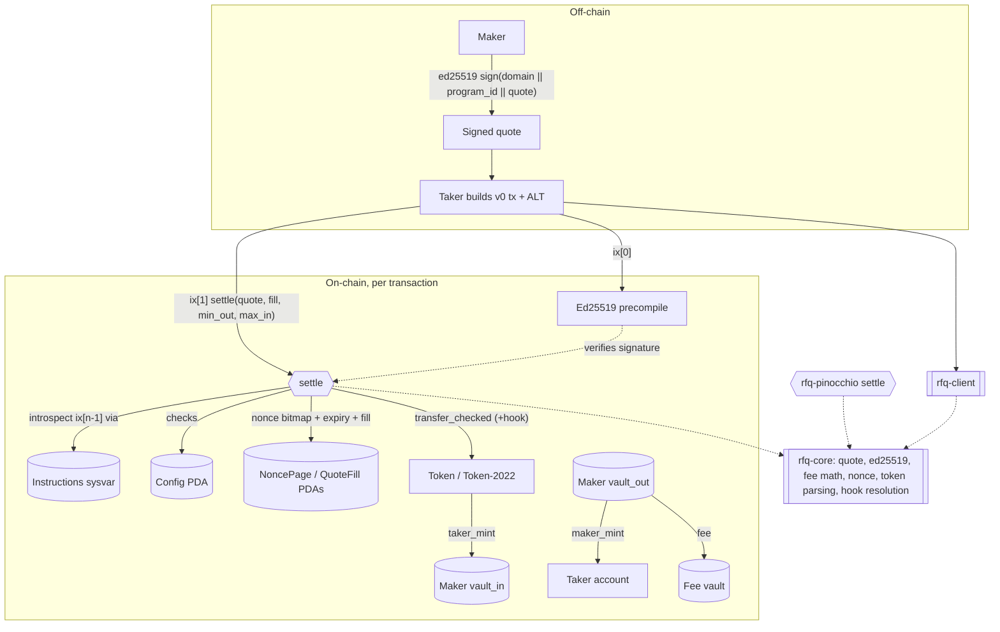

# Solana RFQ Settlement with Token-2022 Extensions (Anchor + Pinocchio)

Atomic settlement of maker-signed RFQ quotes on Solana. The program verifies an
ed25519 signature by **introspecting the instructions sysvar**, settles across
**Token-2022 transfer-fee and transfer-hook mints**, and ships the settle hot
path twice — once in idiomatic **Anchor 1.2** and once in zero-copy
**Pinocchio** — with the same checks in the same order, and a compute-unit
table pinned by a test.

[](https://github.com/monzon1985/blockchain/actions/workflows/15-solana-rfq-token2022.yml)
[](../../LICENSE)


> **Technical demonstration.** Nothing here has been audited or deployed with
> real funds. See [`docs/THREAT_MODEL.md`](docs/THREAT_MODEL.md).

## What's interesting here

- **A working ed25519-introspection exploit, then the fix — on both
  programs.** `settle_naive_v1` only checks that *some* ed25519 instruction
  exists; with the attacker's own signature over the attacker's own bytes, a
  test sells the maker's **entire 1,000,000-unit inventory for 1 unit** of the
  taker mint. `settle` (v2) verifies the *preceding* ed25519 instruction,
  requires exactly one signature with all three offsets inline
  (`instruction_index == u16::MAX`) and matches the maker's registered signer
  over the domain-separated quote, and rejects the forgery — in the same
  binary. The vulnerable instruction exists only in opt-in `naive-v1` builds
  that live at **their own program ids**; production builds answer
  `InstructionFallbackNotFound` and every build refuses to run at any address
  but its own ([`exploit.rs`](tests/integration-tests/tests/exploit.rs)).
- **The same hot path in two runtimes, equivalent check for check.** The
  Pinocchio `settle` reproduces the validation order Anchor generates
  (deserialisation → `init_if_needed` → duplicate-mutable check → field
  constraints → handler). 12 single faults and **all 66 pairs of them** fail
  with the identical `InstructionError` on both programs, and every negative,
  exploit, flow and Token-2022 test runs against both
  ([`equivalence.rs`](tests/integration-tests/tests/equivalence.rs)).
- **Pinocchio: 21,263 CU vs Anchor: 36,037 CU (−41.0%)** for one fee-bearing
  full fill on a shared Mollusk fixture — each number pinned within ±5% by
  [`bench.rs`](tests/cu-bench/tests/bench.rs), which also compares the two
  programs' resulting accounts and the `Settled` events they actually logged.
- **Token-2022 done properly.** Transfer-fee mints are settled gross-vs-net so
  the maker nets the quoted price, with `min_out`/`max_in` slippage bounds;
  transfer-hook mints resolve their `ExtraAccountMetaList` on chain. A hooked
  settlement is 1,412 bytes as a legacy transaction (over the 1,232-byte packet
  limit) and **797 bytes as a v0 transaction over an address lookup table**
  built by the client; the test harness refuses to send any oversized legacy
  transaction. The fee math, the token-account parser and the hook resolver
  are differentially tested against `spl-token-2022` and
  `spl-tlv-account-resolution`.
- **118 tests, offline, deterministic in CI**; 98.5% line coverage of the
  host crates (`rfq-core`, `rfq-client`).

## Overview

An RFQ (request-for-quote) venue lets professional makers stream firm,
off-chain-signed quotes that takers settle on chain. The problem is
non-trivial on Solana for three reasons this project tackles head-on:

1. **Programs can't verify ed25519 signatures directly.** They rely on the
   ed25519 *precompile* and then introspect its instruction through the
   instructions sysvar. Doing that introspection incompletely is a classic,
   repeatedly-shipped vulnerability — the program must bind the *program id*,
   the *signer*, the *exact message* and the *offsets*.
2. **Token-2022 breaks naive transfer accounting.** A transfer-fee mint credits
   the recipient *less* than the amount sent, and a transfer-hook mint requires
   a set of extra accounts derived from on-chain state. A settlement engine
   that ignores either one short-changes the maker or simply fails.
3. **Compute budget matters.** The idiomatic framework path is convenient but
   heavy; a maker-facing venue cares about the marginal CU of settlement. This
   project quantifies the difference by shipping the path both ways.

## Architecture



| Component | Responsibility | Key external calls |
|---|---|---|
| `crates/rfq-core` | `no_std`, alloc-free, `unsafe`-free protocol logic: quote encoding, ed25519 & instructions-sysvar introspection, transfer-fee math, nonce bitmap, Token-2022 parsing, transfer-hook account resolution, shared account layouts and error codes | none (pure) |
| `programs/rfq` (Anchor 1.2) | the full protocol: config/admin, maker registry, PDA vaults (`init_vault`/`deposit`/`withdraw`), fee vaults, nonce pages, `settle`, `close_quote_fill` (18 instructions; `settle_naive_v1` only in the `naive-v1` build) | System, SPL Token, Token-2022, ed25519 (via sysvar), transfer hooks |
| `programs/rfq-pinocchio` | zero-copy re-implementation of `settle` (settle-only, see Scope notes) | System, SPL Token / Token-2022, transfer hooks |
| `programs/test-hook` | in-repo allowlist transfer hook for tests (allow-list keyed on the *destination owner*, plus a writable counter) | System |
| `crates/rfq-client` | PDAs, instruction builders, quote signing, hook resolution, settlement planning, and **v0 transactions with an Address Lookup Table** | — |
| `tests/integration-tests` | LiteSVM: flows, custody, exploit, Token-2022, negatives, equivalence — settle-path tests on both programs | loads the `.so` files |
| `tests/cu-bench` | Mollusk CU benchmark + equivalence on a shared fixture | loads the production `.so` files |

## Roles and trust assumptions

| Role | A compromise can | It cannot |
|---|---|---|
| **Program upgrade authority** (BPF upgradeable loader) | **everything**: deploy new code that signs as every vault-authority PDA and the config PDA, i.e. move all maker inventory and all fees | — (fully trusted). In production use a multisig with a timelock, or make the program immutable with `solana program set-upgrade-authority --final`. It is a different key from the admin as soon as `propose_admin`/`accept_admin` runs. |
| **Admin** (`config.admin`, in-program) | pause settlement, set the fee ≤ 10% (takers are protected by `min_out`), withdraw *accrued fees only*, transfer admin (two-step) | move maker inventory (vaults belong to a different PDA; `withdraw_fees` only accepts accounts owned by the config PDA) |
| **Maker owner** | fund/withdraw its own vaults (also while paused), rotate its quote signer, cancel quotes, deactivate | touch other makers' vaults or the fee vault |
| **Quote signer** (may be a hot key) | sign *any* quote — any nonce, any expiry, any price — e.g. the maker's whole inventory for 1 unit, **until the maker reacts** (rotate the signer, `bump_min_nonce`, cancel mask or deactivate) | outlive that reaction: a rotation, cancellation or deactivation applies to every unsettled quote it covers. There is no per-quote or per-period size cap (future work). |
| **Taker** | settle any valid quote it is entitled to | forge or replay a quote; pass substituted programs or accounts |

Full analysis in [`docs/THREAT_MODEL.md`](docs/THREAT_MODEL.md).

## Invariants / properties

Each is checked by the linked tests (integration tests run on **both**
programs unless they exercise an Anchor-only instruction).

1. **Signature authenticity.** `settle` accepts only when the immediately
   preceding instruction is an ed25519 verification with exactly one
   signature, fully inline, over the maker's registered signer and the exact
   quote message for this program id. *(`ed25519.rs` `strict_verification`,
   `total_on_garbage`; `exploit.rs` `v2_rejects_*`,
   `the_strict_settle_in_the_same_binary_rejects_the_forgery`.)*
2. **The naive check is exploitable — only in the opt-in build.**
   *(`exploit.rs` `naive_v1_lets_a_forged_quote_drain_the_maker`,
   `production_builds_do_not_contain_settle_naive_v1`,
   `a_build_refuses_to_run_at_any_address_but_its_own`.)*
3. **Value conservation.** The maker-mint leaving the vault equals
   `taker_gross_out + protocol_fee = fill`; the taker never receives more than
   is sent to it. *(`math.rs` `successful_fills_conserve_value`;
   `settle_flows.rs` `full_fill_moves_exact_amounts_and_cannot_be_replayed`.)*
4. **The maker is never underpaid.** Pro-rata pricing rounds up, splitting a
   quote never nets the maker less than filling it whole, and transfer fees on
   `taker_mint` are grossed up. *(`math.rs` `splitting_never_underpays_the_maker`;
   `transfer_fee.rs` `gross_for_net_is_sufficient_and_minimal`;
   `settle_flows.rs` `partial_fills_accumulate_and_close_on_completion`.)*
5. **Replay protection.** A completed quote's nonce bit is persisted before
   any CPI; the same signed quote cannot settle twice (re-sent with a fresh
   blockhash, so the runtime's duplicate check cannot be what stops it);
   cancelled nonces cannot settle; an open tracker binds later fills to
   `sha256(message)`. *(`nonce.rs` `bitmap_is_a_set`; `settle_flows.rs`
   `full_fill_moves_exact_amounts_and_cannot_be_replayed`,
   `a_tracker_is_bound_to_its_quote_hash`; `negatives.rs`
   `bumped_min_nonce_and_cancel_mask_kill_quotes`.)*
6. **Slippage bounds are tight.** *(`math.rs` `slippage_thresholds_are_tight`;
   `token2022.rs` `transfer_fee_mint_is_grossed_up_for_the_maker`.)*
7. **Anchor ≡ Pinocchio.** Same `Settled` event and balances, and the same
   `InstructionError` for every single fault and every pair of faults in the
   fault table. *(`equivalence.rs`; `cu-bench` `bench.rs` compares the logged
   events and resulting accounts.)*
8. **Token-2022 fidelity.** `rfq-core`'s fee math, mint/account parsing and
   hook resolution equal the canonical SPL implementations, errors included.
   *(`transfer_fee.rs` `matches_token_2022`; `token.rs`
   `parse_errors_match_token_2022`; `hook/tests.rs` `resolution_matches_canonical`.)*
9. **No account substitution.** Substituted token/system programs, fake PDAs
   (random or non-canonical address), wrong owners, wrong account types,
   duplicate mutable accounts and missing `mut` are rejected — the substituted
   token program before any CPI. *(`negatives.rs`.)*
10. **Custody separation.** The admin cannot move maker inventory; a maker
    cannot touch another maker's vaults; withdrawals work while paused; the
    initializer cannot be front-run. *(`custody.rs`.)*
11. **Tracker rent always returns to its payer**, and a pre-funded tracker
    address cannot block a quote. *(`settle_flows.rs`
    `completion_by_another_taker_leaves_the_rent_to_its_payer`,
    `a_pre_funded_tracker_address_cannot_block_a_quote`; `custody.rs`
    `dead_quote_trackers_are_closed_to_their_payer`.)*

## Security considerations and threat model

Named against the [OWASP Smart Contract Top 10 (2026)](https://scs.owasp.org/sctop10/)
in [`docs/THREAT_MODEL.md`](docs/THREAT_MODEL.md):

- **SC01:2026 Access Control** — ed25519-introspection forgery, unprotected
  initializer, admin/maker custody separation, substituted token program
  (a PDA-signed CPI to an arbitrary program);
- **SC05:2026 Lack of Input Validation** — ed25519 offsets/count/pubkey
  checks, account owner / seeds / type / mutability / duplicate checks;
- **SC02:2026 Business Logic** — replay and cancellation, partial-fill
  binding, tracker-rent handling, the pre-funded-tracker denial of service;
- **SC06:2026 Unchecked External Calls** — transfer-hook programs (untrusted
  code reached through Token-2022) and the token-program id;
- **SC07:2026 Arithmetic Errors / SC09:2026 Integer Overflow and Underflow** —
  checked `u128` math, rounding in the maker's favour;
- **SC08:2026 Reentrancy** — the runtime's reentrancy ban, plus state
  persisted before every CPI;
- **SC10:2026 Proxy and Upgradeability** — the upgrade authority is fully
  trusted; exploit builds live at separate ids.

**Nothing here has been professionally audited.**

## Design decisions and trade-offs

- **`no_std`, allocation-free, `unsafe`-free core.** Every rule that both
  programs and the client must agree on lives in `rfq-core` and runs
  identically on the host (where it is property- and differentially-tested)
  and in SBF.
- **Byte-identical account layouts.** `Config`/`Maker`/`NoncePage`/`QuoteFill`
  are fixed-size. A `const` assertion fails the build if an Anchor struct's
  *size* drifts from its `rfq-core` layout, and
  `programs/rfq/src/state.rs` `borsh_layout_matches_core_offsets` serialises
  every account with a distinct sentinel per field and checks every offset the
  Pinocchio program reads (so a swap of two same-size fields is caught too).
- **Check-for-check equivalence, not just same results.** The Pinocchio handler
  mirrors Anchor's generated validation phases, including stored-bump PDA
  checks via `create_program_address` and Anchor's `init_if_needed` path for a
  pre-funded address — which is what the pairwise fault test pins.
- **Pinocchio is settle-only.** Account-lifecycle instructions exist only in
  the Anchor program; the Pinocchio crate re-implements the hot path the CU
  comparison is about. It owner-checks and derives PDAs against its *own*
  program id, so it is not deployable on its own (see Scope notes).
- **v0 transactions + Address Lookup Table.** A hooked settlement touches 17
  fixed accounts plus the hook extras and carries a 320-byte ed25519
  instruction: 1,412 bytes as a legacy transaction, 797 as v0 + ALT
  (`rfq-client::tx`). A plain settlement is 1,215 bytes as a legacy
  transaction; paid by a relayer (one extra signer) it is 1,311 bytes, over
  the limit, which is why the harness checks every transaction.
- **Nonce bitmaps plus a transient per-quote tracker.** One bit of rent per
  quote and a 256-quote bulk cancel. A per-quote `QuoteFill` exists only while
  a quote is partially filled; on a one-shot fill it is created and closed in
  the same transaction (both CU figures include that create + close). Its rent
  always goes back to the taker that paid it: immediately when that taker
  completes the quote, otherwise through the permissionless `close_quote_fill`
  once the quote is dead (completed, cancelled, below `min_nonce` or expired).
- **Exploit artefact isolation.** `naive-v1` is off by default and moves the
  program to a separate id; both programs reject execution at any address but
  their declared id (`DeclaredProgramIdMismatch`, as Anchor does).
- **Bounded hook resolution.** The allocation-free resolver accepts at most 12
  extra metas per hook; the Anchor program enforces the same bound in front of
  the canonical helper, so the two programs accept exactly the same mints.

## Testing

Fresh-clone-to-green, fully offline. The native gates run on any platform; the
SBF build and the LiteSVM/Mollusk suites need the Agave 4.3 `cargo-build-sbf`
(they run in CI, and locally on Linux, or on Windows with the OpenSSL note
below).

```bash
# Native gates
cargo fmt --all --check
cargo fmt --manifest-path tests/cu-bench/Cargo.toml --check
cargo clippy --locked --workspace --all-targets -- -D warnings
cargo clippy --locked --workspace --all-targets --features rfq/naive-v1,rfq-pinocchio/naive-v1 -- -D warnings
cargo clippy --locked --manifest-path tests/cu-bench/Cargo.toml --all-targets -- -D warnings
PROPTEST_RNG_SEED=15 cargo test --locked -p rfq-core -p rfq-client -p rfq -p rfq-pinocchio -p test-hook

# SBF builds: production, plus the opt-in exploit builds (separate program ids)
cargo build-sbf --manifest-path programs/rfq/Cargo.toml -- --locked     # CI also runs `anchor build -p rfq`
cargo build-sbf --manifest-path programs/rfq-pinocchio/Cargo.toml -- --locked
cargo build-sbf --manifest-path programs/test-hook/Cargo.toml -- --locked
cargo build-sbf --manifest-path programs/rfq/Cargo.toml --features naive-v1 --sbf-out-dir target/deploy/naive -- --locked
cargo build-sbf --manifest-path programs/rfq-pinocchio/Cargo.toml --features naive-v1 --sbf-out-dir target/deploy/naive -- --locked

# LiteSVM + Mollusk suites, coverage
cargo test --locked -p integration-tests
cargo test --locked --manifest-path tests/cu-bench/Cargo.toml -- --nocapture
PROPTEST_RNG_SEED=15 cargo llvm-cov --locked -p rfq-core -p rfq-client -p integration-tests \
  --summary-only --ignore-filename-regex 'integration-tests'
```

| Suite | Kind | Count | Notes |
|---|---|---|---|
| `rfq-core` | unit + property | 60 | 25 property tests; fee math (4,096 cases), hook resolution (1,024 + 768 cases) and token parsing are **differential** vs SPL |
| `rfq-client` | unit | 6 | instruction/PDA/signing shape |
| `rfq` (Anchor crate) | unit | 4 | error-code ABI vs `rfq-core` and Anchor, borsh layout offsets, args encoding |
| `test-hook` | unit | 1 | hook account configuration |
| `integration-tests` | LiteSVM | 45 | `negatives` 13, `custody` 8, `exploit` 7, `settle_flows` 7, `token2022` 5, `equivalence` 5 (incl. 12 faults + 66 fault pairs on both programs) |
| `cu-bench` | Mollusk | 2 | pinned CU table + state/event equivalence |
| **Total** | | **118** | |

**Coverage.** 98.5% of lines (2,126 lines, 32 missed) in `rfq-core` +
`rfq-client`, measured with `cargo-llvm-cov` over the unit, property and
LiteSVM suites; CI fails below 90%. The two SBF programs run inside LiteSVM
and cannot be instrumented by `llvm-cov`; they are covered by the
both-programs negative matrix instead. As a one-off check, removing any of the
Pinocchio program's token-program check, duplicate-account check, writable
check or pre-funded-tracker path makes the suite fail.

**Determinism.** CI sets `PROPTEST_RNG_SEED=15`; with it the hook
differential reports the same `310 resolved, 714 rejected` split on every run.
LiteSVM fixtures use random keys but every assertion is key-independent.

## Compute units

Measured by Mollusk on the shared settle fixture (plain SPL mints, one full
fill, 0.30% protocol fee: ed25519 verification, tracker create + close, three
`transfer_checked` CPIs, event), pinned by
[`tests/cu-bench/tests/bench.rs`](tests/cu-bench/tests/bench.rs):

| Implementation | Compute units (pinned ±5%) |
|---|---|
| Anchor 1.2 (`rfq.so`) | **36,037** |
| Pinocchio (`rfq_pinocchio.so`) | **21,263** |
| **Delta** | **−14,774 (−41.0%)** |

Provenance: `.so` files built by Agave 4.3.0 `cargo-build-sbf` (platform-tools
v1.57), executed by Mollusk 0.15.1, which links the **Agave 4.2.2** program
runtime (`solana-program-runtime = "=4.2.2"`); the ed25519 precompile accounts
for 0 CU there. Numbers are specific to that toolchain: a bump that moves either
one by more than 5% fails the test. As a cross-check on the **Agave 4.3**
runtime, `equivalence.rs` `one_shot_fill_compute_units_on_litesvm` runs the
same kind of fill on LiteSVM 0.17 and asserts Pinocchio is cheaper; over four
runs it measured Anchor 36,037–37,537 and Pinocchio 18,263–19,763 CU (random
keys change the PDA bump searches, so it is not pinned).

Binary sizes are **not** a framework comparison: `rfq.so` (502,784 bytes) is
the full 18-instruction Anchor program, `rfq_pinocchio.so` (65,176 bytes)
implements `settle` only.

## Getting started

Prerequisites: Rust **1.98.1** (the CI pin; the LiteSVM suite needs ≥ 1.97.1
because LiteSVM 0.17 links the Agave 4.3 runtime crates, while `rfq-core`, the
client and the programs build with ≥ 1.89, and the SBF programs are compiled
by the platform-tools rustc 1.95 that ships with Agave). For the on-chain
suites: Agave/Solana 4.3 (`cargo-build-sbf`); for `anchor build`, Anchor CLI
1.2.0. See the [CI workflow](../../.github/workflows/15-solana-rfq-token2022.yml)
for exact versions and install steps.

```bash
git clone https://github.com/monzon1985/blockchain
cd blockchain/projects/15-solana-rfq-token2022
cargo test --locked -p rfq-core   # ~1-2 s of test time after a first build of a few minutes
```

A local end-to-end settlement (maker registers, creates and funds PDA vaults,
signs a quote; a taker settles; the maker withdraws) is
`custody.rs` `maker_custody_round_trip_through_pda_vaults`, against an
in-process LiteSVM — read it as the runnable demo.

## Project structure

```
15-solana-rfq-token2022/
├── crates/
│   ├── rfq-core/     # no_std protocol logic (quote, ed25519, math, nonce, token, hook, layouts)
│   └── rfq-client/   # PDAs, instruction builders, signing, hooks, v0 + ALT transactions
├── programs/
│   ├── rfq/          # Anchor 1.2 program (full instruction set)
│   ├── rfq-pinocchio/# zero-copy settle re-implementation
│   └── test-hook/    # in-repo allowlist transfer hook (tests only)
├── tests/
│   ├── integration-tests/  # LiteSVM: flows, custody, token2022, exploit, negatives, equivalence
│   └── cu-bench/           # Mollusk CU benchmark + equivalence (own workspace/lockfile)
├── docs/THREAT_MODEL.md
├── Anchor.toml
└── Cargo.toml        # workspace (cu-bench excluded — see below)
```

Size: about 4.1k lines of production Rust (non-blank, non-comment, excluding
in-file `#[cfg(test)]` modules) across `crates/` and `programs/`, and about
5.4k lines of tests (in-file test modules plus `hook/tests.rs` and `tests/`),
counted with:

```bash
awk 'FNR==1{t=0} /^#\[cfg\(test\)\]/{t=1} NF && $1 !~ /^\/\// {if (t) x++; else p++} END {print p, x}' \
  $(find crates programs -name '*.rs' -path '*/src/*' ! -name tests.rs)
awk 'NF && $1 !~ /^\/\//' crates/rfq-core/src/hook/tests.rs $(find tests -name '*.rs' -not -path '*/target/*') | wc -l
```

## Scope notes and future work

- **`tests/cu-bench` is a separate workspace** with its own `Cargo.lock`:
  Mollusk 0.15 links the Agave **4.2** runtime while LiteSVM 0.17 requires
  Agave **4.3**, and one lockfile cannot hold both semver-incompatible sets.
  It is therefore run with `--manifest-path tests/cu-bench/Cargo.toml`, not
  `-p cu-bench`.
- **The Pinocchio program is not deployable on its own.** It shares the Anchor
  program's byte-identical layouts and instruction ABI, but owner-checks and
  derives PDAs against its own program id (it never reads the Anchor
  program's accounts) and has no instructions to create its config, maker
  registry or nonce pages; the harnesses seed those accounts directly.
  Porting the lifecycle instructions is straightforward future work.
- **Windows / OpenSSL.** LiteSVM's and Mollusk's `precompiles` feature pulls
  `agave-precompiles`, whose vendored OpenSSL build needs a native Windows
  Perl. On Windows, point the build at a prebuilt OpenSSL
  (`OPENSSL_NO_VENDOR=1 OPENSSL_DIR=…`, with its DLLs on `PATH`); CI on
  `ubuntu-latest` builds normally. The `rfq-core`/`rfq-client` gates need none
  of this.
- **Other Token-2022 extensions are enforced by the token program, not
  priced by the quote.** Pausable or NonTransferable mints, CpiGuard or
  MemoTransfer on the accounts involved, or a frozen DefaultAccountState make
  settlement fail; a PermanentDelegate on a mint lets a third party claw back
  what a counterparty received. Makers should allowlist the mints they quote.
- **Quote-signer blast radius.** A leaked hot signing key can sell the whole
  inventory until the maker rotates it; per-quote maximum sizes or per-slot
  notional caps enforced on chain are future work.
- **CI.** The `anchor build` step (and the workflow as a whole) runs on
  GitHub Actions; locally the same production `rfq.so` is built with
  `cargo build-sbf`, and the IDL generation path was checked with
  `cargo test -p rfq --features idl-build __anchor_private_print_idl` under the
  environment `anchor build` sets (`ANCHOR_IDL_BUILD_RESOLUTION=FALSE`, lint on).
  IDL account resolution is disabled in `Anchor.toml`: the nonce-page seeds
  call `nonce::page_index(..)`, which Anchor's resolution codegen cannot
  express, so clients derive PDAs with `rfq-client::pda`.

## References

- Solana docs, [Programs](https://solana.com/docs/core/programs) (the Ed25519
  precompile) and the [`solana-ed25519-program`](https://docs.rs/solana-ed25519-program/latest/solana_ed25519_program/)
  instruction layout; the instructions sysvar:
  [Agave docs](https://docs.anza.xyz/runtime/sysvars) and
  [`solana-instructions-sysvar`](https://docs.rs/solana-instructions-sysvar/latest/solana_instructions_sysvar/).
- The Wormhole bridge exploit (February 2022), the best-known incident of
  this class — signature verification that trusted an unverified
  instructions-sysvar account: [CertiK analysis](https://www.certik.com/resources/blog/wormhole-bridge-exploit-incident-analysis),
  [rekt.news](https://rekt.news/wormhole-rekt/). Both programs here check the
  instructions-sysvar account's address before reading it.
- [`spl-token-2022`](https://github.com/solana-program/token-2022) — transfer-fee
  and transfer-hook extensions (the differential oracle for the fee math and
  account parsing).
- [`spl-transfer-hook-interface`](https://github.com/solana-program/transfer-hook)
  and [`spl-tlv-account-resolution`](https://github.com/solana-program/libraries)
  — the canonical `ExtraAccountMetaList` resolution that `rfq-core::hook` is
  ported from (Apache-2.0, see License).
- [Pinocchio](https://github.com/anza-xyz/pinocchio) and
  [Mollusk](https://github.com/anza-xyz/mollusk) (Anza), and
  [LiteSVM](https://github.com/LiteSVM/litesvm).
- [Anchor](https://github.com/solana-foundation/anchor) 1.2.
- [OWASP Smart Contract Top 10 (2026)](https://scs.owasp.org/sctop10/).

## License

MIT — see the SPDX header in every source file and [`LICENSE`](../../LICENSE).
One exception: `crates/rfq-core/src/hook.rs` is a modified port of code from
`spl-transfer-hook-interface` and `spl-tlv-account-resolution`
(Copyright Anza Maintainers, Apache License 2.0); that file is
`MIT AND Apache-2.0`, carries the upstream attribution and a description of
the changes, and the `rfq-core` crate declares `license = "MIT AND Apache-2.0"`.
