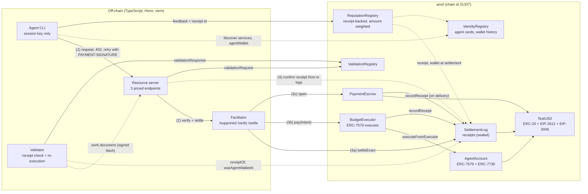
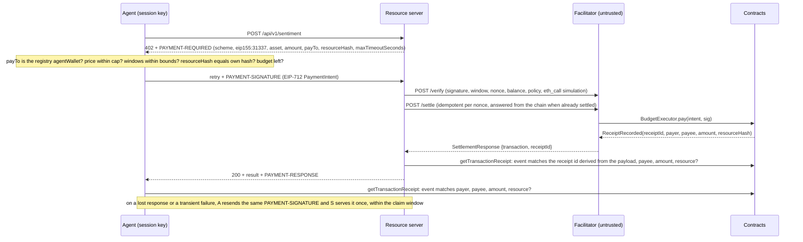

# Local x402 Pay-per-Call Marketplace with Budget-Bounded Agent Accounts and ERC-8004 Reputation

A fully local x402 v2 stack: a resource server that answers `402`, a self-hosted facilitator that settles EIP-3009 payments on anvil, an agent whose ERC-7579 smart account can spend only through an on-chain budget module, and ERC-8004-style registries in which reputation counts only feedback backed by a settled payment receipt.

[](https://github.com/monzon1985/blockchain/actions/workflows/16-x402-agent-payments.yml)


> Technical demonstration. TestUSD is a local test token with no value that refuses to deploy on any chain other than 31337. Nothing here has been audited or deployed with real funds.

## What's interesting here

- **The facilitator is untrusted, and tested that way.** For each of the three schemes, a facilitator that changes the amount, the payee or the resource is reverted by the deployed contracts on anvil (for `exact`, the tampered transactions are also mined and shown to revert; for `escrow`, a second escrow deployment cannot take the funds either). A facilitator that lies about a settlement (an unrelated transaction, its own reverted redirect, or another settlement of the same nonce) is caught because the resource server and the agent read the transaction receipt themselves. A payment that settled but whose response was lost is not lost: retrying the same signature gets the call served, once.
- **One unmodified EIP-3009 signature binds amount, payee *and* resource.** The nonce is `H(tag, resourceHash, salt)` with its 64 sequence bits cleared, which fits OpenZeppelin 5.7's keyed `ERC20TransferAuthorization`. `settleExact` costs **153,502 gas** against **69,088** for a bare `transferWithAuthorization`; the difference pays for the resource check, a 3-slot on-chain receipt and the balance-delta check.
- **Agent spending is bounded on-chain by an exact sliding window.** `BudgetExecutor` keeps a ring buffer plus a running sum, amortised O(1): measured as standalone transactions on a long-lived account, a payment costs **194,813 gas** with 4 live entries and **194,982** with one expiring. The invariant "spend in any window ≤ budget" holds over 128 × 64 random call sequences locally (256 × 128 in CI, fixed seed) that mix payments, time jumps, replays and tampered intents.
- **Receipt-backed ERC-8004 reputation that the rated agent cannot censor.** Feedback must reference a `SettlementLog` receipt in which the author paid the agent's wallet *as it stood when the payment settled* (the identity registry checkpoints every wallet change, and a wallet serves one agent at a time), one feedback per receipt. Summaries weight every review by the amount of its receipt, so a dust payment buys a dust-weight review. For the agent's smart account, the owner signs feedback as an ERC-7739 nested typed-data signature, verified through ERC-1271, and anyone can relay it.
- **Test counts:** 177 Foundry tests (164 unit and fuzz, 10 gas benchmarks, 3 invariant suites with 11 invariants) cover **100 %** of the lines (479/479) and of the branches (157/157) in `contracts/src`. 189 vitest tests (148 unit, 41 e2e on anvil) cover **96.21 %** of the lines in the TypeScript.

## Overview

[x402](https://github.com/coinbase/x402) revives HTTP `402 Payment Required`: the server answers with payment requirements, the client retries with a signed payment, and a facilitator verifies and settles it. Two things make this hard to do well for autonomous agents:

1. **Who can the client trust?** In canonical x402 `exact`, the payer's EIP-3009 signature already fixes the payee and the amount, so a facilitator cannot redirect funds. It does not fix which resource was bought (the nonce is random), and clients take the facilitator's word that settlement happened. This project adds a resource commitment to the nonce, confirms every settlement from the transaction logs on both ends, and bounds smart-account spending on-chain.
2. **How much can an agent spend?** Giving an LLM-driven process a funded key is a blank cheque. Here the agent only holds a session key registered in an ERC-7579 executor module. The module enforces a per-call cap, a rolling-window budget, a rate limit, a payee allowlist and an expiry, on-chain, whatever the agent's code does.

Settled payments then feed ERC-8004 identity, reputation and validation registries. Reputation weights each review by what its author paid the agent. Validation ties a server's record of a call to its on-chain receipt and re-executes the paid request, so a validator can check that the server delivered what it was paid for.

## Architecture





| Component | Responsibility | Key external calls |
|---|---|---|
| [`TestUSD`](contracts/src/token/TestUSD.sol) | Local 6-decimal token: EIP-2612 permits, EIP-3009 with keyed nonces (key 0 reserved for permits), supply cap, chain-id guard | none |
| [`SettlementLog`](contracts/src/settlement/SettlementLog.sol) | `exact` settlement router, receipt registry, frozen recorder set | `TestUSD.transferWithAuthorization` |
| [`ResourceBinding`](contracts/src/settlement/ResourceBinding.sol) | Nonce commitments to resource (and escrow terms) | none |
| [`BudgetExecutor`](contracts/src/modules/BudgetExecutor.sol) | Session-key intents, cap, sliding-window budget, rate limit, allowlist, expiry | `AgentAccount.executeFromExecutor`, `SettlementLog.recordReceipt` |
| [`AgentAccount`](contracts/src/account/AgentAccount.sol) / [`Factory`](contracts/src/account/AgentAccountFactory.sol) | OZ `AccountERC7579` + `SignerECDSA` + `ERC7739`; delegatecall disabled; CREATE2 salt binds the policy, which nothing can make undeployable | `BudgetExecutor.onInstall` |
| [`PaymentEscrow`](contracts/src/escrow/PaymentEscrow.sol) | Delayed fulfilment: open, deliver (hash), refund after deadline | `TestUSD.receiveWithAuthorization`, `SettlementLog.recordReceipt` |
| [`IdentityRegistry`](contracts/src/registry/IdentityRegistry.sol) | ERC-721 agent cards (`data:` URIs), metadata, verified `agentWallet` with checkpointed history, one agent per wallet | `SignatureChecker` (EOA or ERC-1271) |
| [`ReputationRegistry`](contracts/src/registry/ReputationRegistry.sol) | Receipt-backed feedback checked against the wallet at settlement, relayed feedback by signature, amount-weighted summaries on a [-100, 100] scale | `SettlementLog.receiptOf`, `IdentityRegistry.wasAgentWalletAt` |
| [`ValidationRegistry`](contracts/src/registry/ValidationRegistry.sol) | Validation requests by the agent owner keyed by (agent, request hash), 0-100 responses by the named validator | `IdentityRegistry` |
| [`src/facilitator`](src/facilitator) | x402 facilitator: parsing, verification, simulation, idempotent settlement that checks the terms of an existing one | viem `simulateContract`, `writeContract` |
| [`src/server`](src/server) | Resource server, 402 challenges, independent settlement confirmation with retries, claim window for retried payments, escrow delivery worker, access-controlled results and work documents | facilitator HTTP, viem |
| [`src/agent`](src/agent) | Discovery, client-side acceptance policy, payment builders, retries with the same signature, receipts, ERC-7739 feedback | resource server HTTP, viem |
| [`src/validator`](src/validator) | Ties work documents to receipts, re-executes deterministic services, scores; isolates hostile requests (origin-restricted, bounded fetch, block cursor) | resource server HTTP, `SettlementLog`, `IdentityRegistry`, `ValidationRegistry` |
| [`src/policy`](src/policy) | PII filter (zod + regex) and the agent's acceptance rules | none |

Wire formats of the three schemes, retries and validation documents are in [docs/SCHEMES.md](docs/SCHEMES.md).

## Roles and trust assumptions

| Role | Held by | Powers | If compromised |
|---|---|---|---|
| TestUSD owner | Deployer | `mint` up to the 10^15 tUSD cap | Inflates a worthless local token; cannot touch receipts, escrows or budgets. |
| SettlementLog owner | Deployer, **until `seal()` in the same deploy broadcast** | Add or remove recorders | Before sealing, could add a recorder that forges receipts (and so reputation). After sealing: no powers, ownership is renounced. `DeployScriptTest` and the e2e suite assert `isSealed() && owner() == 0` on the deployed log. |
| Account owner (principal) | Human EOA | `execute`, install and uninstall modules, change the budget policy | Full control of that account's funds, as with any wallet. |
| Session key | Agent process | Sign `PaymentIntent`s | Can spend at most the per-call cap, the window budget and the rate limit, only to allowlisted payees, until expiry or revocation. It cannot install modules or call `execute`. |
| Facilitator relayer | Facilitator | Submit settlements, pay gas | Liveness only: it can refuse service, but it cannot change or fake a payment (see threat model T1-T3, T25). |
| Service operator | ERC-8004 agent owner | Update the card, set the wallet (with the wallet's signature, and only a wallet that serves no other agent), request validations | Can point the agent to another wallet it controls; agents read the wallet from the registry for every call. Cannot void earlier receipts: feedback is checked against the wallet at settlement. |
| Treasury (`payTo` / `agentWallet`) | Service | Deliver escrows | Could release escrows with a wrong delivery hash. Reputation and validation surface it; see known limitations. |
| Validator | Independent | Respond to requests that name it | Can post false scores; readers choose which validators count (`getSummary` filter). |

## Invariants and properties

Stateful, handler-based invariant suites with ghost variables ([`contracts/test/invariant`](contracts/test/invariant)):

| # | Property (plain English) | Test |
|---|---|---|
| I1 | For every time *t*, the budget-exec payments with timestamps in `(t - period, t]` sum to at most `periodBudget`. | [`invariant_SpendInAnyWindowWithinBudget`](contracts/test/invariant/BudgetWindow.invariant.t.sol) |
| I2 | No such window contains more than `maxPaymentsPerPeriod` payments. | [`invariant_PaymentsInAnyWindowWithinRateLimit`](contracts/test/invariant/BudgetWindow.invariant.t.sol) |
| I3 | The module's own window accounting (`windowState`) equals a ghost recomputation at every step. | [`invariant_WindowStateMatchesGhost`](contracts/test/invariant/BudgetWindow.invariant.t.sol) |
| I4 | The account lost exactly the sum of successful payments, all of it to allowlisted payees, with one receipt per payment. | [`invariant_ConservationAndReceipts`](contracts/test/invariant/BudgetWindow.invariant.t.sol) |
| I5 | Replayed nonces, tampered amounts, over-cap amounts and non-allowlisted payees never succeed. | [`invariant_NoUnauthorizedSpend`](contracts/test/invariant/BudgetWindow.invariant.t.sol) |
| I6 | The escrow's token balance equals `totalEscrowed`, which equals the sum of open escrows. | [`invariant_EscrowBalanceEqualsOpenEscrows`](contracts/test/invariant/Escrow.invariant.t.sol) |
| I7 | Value is conserved between payers, payee and escrow; the payee received exactly the released escrows, with one receipt per release. | [`invariant_ConservationAndReceipts`](contracts/test/invariant/Escrow.invariant.t.sol) |
| I8 | Every escrow ends in exactly one terminal state; delivery succeeds exactly until the deadline and refund exactly after it. | [`invariant_StatusMatchesModel`](contracts/test/invariant/Escrow.invariant.t.sol) |
| I9 | Every stored feedback is backed by a distinct receipt in which its author paid the agent's wallet as it stood at settlement, and weighs that receipt's amount, while the owner keeps rotating the wallet. | [`invariant_FeedbackBackedByDistinctPaidReceipts`](contracts/test/invariant/Reputation.invariant.t.sol) |
| I10 | The agent's wallets received exactly the settled amounts, with one receipt per settlement. | [`invariant_ReceiptsMatchPayments`](contracts/test/invariant/Reputation.invariant.t.sol) |
| I11 | Feedback without a receipt, with someone else's receipt, reusing a receipt, or from the owner or wallet is never accepted, and an author's own unused receipt is never refused, whatever the wallet rotations. | [`invariant_NoUnbackedOrSelfFeedback`](contracts/test/invariant/Reputation.invariant.t.sol) |

Fuzzed properties: any resource other than the signed one is rejected whatever salt the relayer claims (`testFuzz_RevertWhen_ResourceDiffers`); settlement moves exactly the signed value (`testFuzz_SettleExact`); resource-bound nonces always have a zero sequence (`testFuzz_ExactNonceLayout`); a session signature never authorizes another amount or resource (`testFuzz_SignatureBindsIntent`); the per-call cap holds for every amount (`testFuzz_PerCallCap`); escrow delivery and refund meet exactly at the deadline (`testFuzz_DeadlineBoundary`); reputation summaries are exactly the receipt-weighted mean and stay between the extremes (`testFuzz_SummaryBounds`); validation scores above 100 are rejected (`testFuzz_ResponseRange`); a token nonce is a 192-bit key plus a 64-bit sequence, used once, without touching the permit counter (`testFuzz_NonceKeyLayout`); key 0 is refused for every sequence (`testFuzz_RevertWhen_ReservedKeyZero`); minting stops exactly at the supply cap (`testFuzz_SupplyCapBoundary`); a cancelled authorization can never be used (`testFuzz_CancelledAuthorizationCannotBeUsed`); a wallet consent works until its deadline, once, and only from the wallet (`testFuzz_SetAgentWalletBinding`); a transfer clears the wallet but keeps its history (`testFuzz_TransferClearsWalletKeepsHistory`).

## Security considerations and threat model

The full threat model (assets, actors, 26 threats with mitigations and the tests that show them) is in [docs/THREAT_MODEL.md](docs/THREAT_MODEL.md). Static-analysis triage is in [docs/STATIC_ANALYSIS.md](docs/STATIC_ANALYSIS.md). Slither reports 0 untriaged findings and `forge lint --deny warnings` passes.

Main defences: signatures bind every economic field (EIP-3009 plus a resource commitment in the nonce; EIP-712 `PaymentIntent`). Receipts are confirmed from transaction logs, never from the facilitator's word, against the receipt id the server derives from the payload. Delegatecall is disabled on the agent account. The CREATE2 salt commits to the policy. The recorder set is sealed and ownership renounced. Feedback is checked against the wallet in force at settlement and weighted by the paid amount. Validation documents are tied to their on-chain receipt. Balance-delta checks run after every transfer (fee-on-transfer tokens are tested). `ReentrancyGuardTransient` protects every function that moves tokens. Free text is PII-filtered before it is logged or written on-chain, and raw request data is served only to the validator named on-chain.

Known limitations (details in the threat model):

1. Anyone can submit an `exact` authorization straight to the token. The payee is still paid exactly what was signed, but no receipt exists, so the call is not served. Canonical x402 facilitators share this exposure; the escrow scheme avoids it with `receiveWithAuthorization`.
2. Reviews are weighted by what their author paid, but an owner can still pay its own service through an unrelated wallet (wash trading) and get the money back.
3. A dust receipt still backs one feedback entry and is counted in `count`; only its weight is negligible.
4. Escrow release relies on the payee's delivery hash. There is no on-chain dispute; reputation and validation are the recourse.
5. The rolling-window guarantee is stated for periods in which the account does not change its own limits.
6. The server's consumed-receipt set is in memory. After a restart, a payment served just before it can be claimed once more until its claim window (default 600 s) closes; on-chain nonce checks still prevent any double settlement.
7. A wallet set and replaced within a single second is not matched by the wallet history, and an operator needs one wallet per agent.
8. Each answered validation request costs the validator a transaction (the requester pays a comparable amount). Documents are fetched only from the agent's registered endpoint, but a hostile registrant picks that endpoint, so it can still aim a few bounded GETs at a host of its choosing (no private-address filter on a 127.0.0.1-only stack).
9. If an escrow's `202` response is lost, so is its access token: a retry with the same signature gets `payment_already_used`, and the payer cannot read the delivered result from the server (the delivery hash stays on-chain, and an undelivered escrow is still refunded).

## Design decisions and trade-offs

- **Resource commitment in the nonce instead of a second signature.** It keeps the standard EIP-3009 `TransferWithAuthorization` type (wallet-friendly, x402-compatible shape) and adds one field, `resourceSalt`. The cost: a standard x402 client that draws a fully random nonce is refused (`invalid_resource_binding`), and OZ's keyed nonces also require a zero sequence.
- **`ERC20TransferAuthorization` (keyed nonces) instead of the draft `ERC3009` (random-nonce map).** The spec asked for it, and it accepts `bytes` signatures, so ERC-1271 payers work. Key 0 would alias the ERC-2612 permit counter, so TestUSD rejects it (`TestUSDReservedNonceKey`).
- **Exact sliding window instead of fixed epochs or a token bucket.** Fixed epochs allow up to 2× the budget across an epoch boundary, and a token bucket allows about 2× over one period. The ring buffer gives the exact property at amortised O(1) cost, and caps the number of payments per window as a side effect (at most 32).
- **No expiry check at install.** The factory's salt commits to the whole policy, `validUntil` included. Checking the expiry in `onInstall` would make a funded counterfactual address undeployable once the session expired; instead an expired session installs and simply cannot spend until the owner rotates it.
- **Full receipts on-chain (3 slots) instead of a hash commitment.** A commitment would save about 44k gas per settlement but would force the reputation registry and every verifier to carry receipts in calldata. On a local demo, clarity wins; the measured overhead is in the gas table.
- **Wallet history instead of the current wallet.** Checking feedback against the current wallet let the rated owner void every earlier receipt by rotating it. Checkpointing every change (one storage slot per change) makes `register` about 45k gas dearer, but a receipt stays usable for good. Allowing one agent per wallet is what makes a receipt identify a single agent.
- **Amount-weighted summaries on a fixed scale.** A plain mean let a 1-base-unit receipt buy a full-weight review with any `int128` value. Weighting by the receipt amount and fixing the scale to [-100, 100] makes a review count in proportion to what its author paid; the price is a deviation from ERC-8004's free-form values.
- **Seal-then-renounce instead of constructor wiring.** The recorders need the log's address and the log needs theirs. Predicting CREATE addresses works but is brittle. `seal()` in the same broadcast is explicit and can be checked on-chain.
- **Owner may call `execute` directly.** The local stack has no ERC-4337 bundler. The principal already controls the account, so this adds no power. The session key is still limited to the executor path.
- **Pay-then-serve with a claim window.** The server settles and confirms before doing the work, so it never works for free; invalid inputs are rejected with `400` before any payment is requested. Because a failure after settlement would otherwise leave the payer charged, the same signature can be resent and is served once if its settlement is recent (default 600 s). The window also bounds how long consumed receipts must be remembered.
- **Deterministic services.** Sentiment, keywords and Merkle reports have no clock, randomness or LLM, so a validator can re-execute a call and compare canonical JSON byte for byte.

## Testing

```bash
# Contracts
cd contracts
forge soldeer install && forge fmt --check && forge build
FORGE_SNAPSHOT_CHECK=true forge test                     # unit, fuzz, invariants; gas suite checked against snapshots/x402.json
FOUNDRY_PROFILE=ci FORGE_SNAPSHOT_CHECK=true forge test  # what CI runs: 5,000 fuzz runs, 256 x 128 invariant runs, fixed seed
forge snapshot --match-path "test/gas/*" --check         # .gas-snapshot
forge lint src script --deny warnings
slither . --config-file slither.config.json              # runs `forge clean`: build again before the TypeScript e2e suite
forge coverage --report summary --no-match-coverage "(test|script|dependencies)/" --no-match-path "test/gas/*"

# TypeScript (needs a `forge build` in contracts/)
cd ..
npm ci && npm run abis:check && npm run typecheck && npm run lint
npm test && npm run e2e   # unit suite, then the e2e suite on anvil
npm run coverage          # unit + e2e in one run with v8 coverage and 90 % thresholds (the CI gate)
```

Without `FORGE_SNAPSHOT_CHECK=true`, `forge test` rewrites `snapshots/x402.json` instead of checking it. Coverage leaves the gas suite out because instrumented gas would overwrite the snapshot with inflated numbers.

| Suite | Location | Tests |
|---|---|---|
| Solidity unit and fuzz | `contracts/test/unit` | 164 (14 of them fuzz) |
| Solidity gas benchmarks | `contracts/test/gas` | 10 |
| Solidity invariants | `contracts/test/invariant` | 3 suites, 11 invariants |
| TypeScript unit (codecs, resource hashing, PII, policy, verifier, facilitator, settlement writer, validator, services) | `test/` | 148 |
| End-to-end on anvil (demo, 402 flow, adversarial facilitator, replay, recovery of unserved payments, validation, hostile validation requests, state expiry, differential, deployment) | `e2e/` | 41 |

Coverage: `forge coverage` reports **100.00 %** lines (479/479), statements (492/492), branches (157/157) and functions (111/111) for `contracts/src`. One branch (`SettlementLog.setRecorder` after sealing) is unreachable through the public API because sealing renounces ownership; a test harness that restores an owner covers it as defense in depth. `npm run coverage` reports **96.21 %** lines (1120/1164), 94.1 % statements (1246/1324), 87.2 % branches (627/719) and 97.59 % functions (243/249) for `src/` (unit and e2e together; the unit project alone does not reach the agent and server code).

Fuzz and invariant settings: the default profile runs 1,000 fuzz runs and 128 × 64 invariant runs. The `ci` profile (`FOUNDRY_PROFILE=ci`) runs 5,000 fuzz runs and 256 × 128 invariant runs with the fixed seed `0x5eed16`, which also seeds the invariant campaigns (checked: two CI-profile runs of the escrow campaign produced identical per-selector call counts).

Differential tests: the e2e suite checks that the TypeScript mirrors of `exactNonce`, `escrowNonce`, `receiptIdFor` (for all three recorders), `escrowIdFor`, the `PaymentIntent` EIP-712 digest and the `SetAgentWallet` digest equal the contracts' own view functions on 24 inputs derived from a fixed seed, so a failure reproduces exactly.

## Gas

Execution gas of the measured call frame (`vm.snapshotGasLastFrame`, which excludes the 21,000 intrinsic cost, calldata and the callee's cold-account surcharge), from [`contracts/snapshots/x402.json`](contracts/snapshots/x402.json). The suite runs in Foundry's isolation mode (`isolate = true`, pinned in `foundry.toml`): every top-level call in a test is its own transaction with a fresh access set, so each figure is the cost of that call as a standalone transaction, with cold storage. The "steady state" figures come after 32 earlier payments in separate transactions, so every ring slot already holds a value; they are not warmed up by those payments. CI checks both this file and [`.gas-snapshot`](contracts/.gas-snapshot).

| Operation | Gas | Note |
|---|---:|---|
| Baseline: `TestUSD.transferWithAuthorization` | 69,088 | Bare EIP-3009, no receipt |
| `SettlementLog.settleExact` | 153,502 | +84,414 over baseline: resource check, 3-slot receipt, balance-delta check |
| `BudgetExecutor.pay`, first payment of an account | 209,315 | Its ring-buffer slot goes from zero to non-zero |
| `BudgetExecutor.pay`, steady state, 1 entry expires | 194,982 | Slots already non-zero |
| `BudgetExecutor.pay`, steady state, 4 live entries | 194,813 | Cost does not grow with live entries |
| `BudgetExecutor.pay`, 5 entries expire at once | 203,257 | Expiry is paid once per entry (amortised) |
| `PaymentEscrow.open` | 191,104 | `receiveWithAuthorization` + escrow record |
| `PaymentEscrow.deliver` | 149,918 | Includes receipt recording |
| `PaymentEscrow.refund` | 43,227 | |
| `AgentAccountFactory.createAccount` | 321,021 | Clone + init + policy install |
| `IdentityRegistry.register` | 186,659 | Includes the first wallet checkpoint and the wallet-to-agent index |
| `ReputationRegistry.giveFeedback` | 249,771 | Receipt checks, wallet-history lookup, stored tags and weight |

## Getting started

Prerequisites: Foundry 1.8.3 (`forge`, `anvil` on `PATH`), Node.js 24 with npm 11. For the Slither gate only: Python 3.12 and uv, then `uv tool install --python 3.12 slither-analyzer==0.11.6 --with crytic-compile==0.4.2`. No RPC endpoints, API keys or Docker needed.

```bash
cd projects/16-x402-agent-payments/contracts
forge soldeer install
forge build
FORGE_SNAPSHOT_CHECK=true forge test

cd ..
npm ci
npm run demo                               # boots everything on random ports and runs the agent
npm run demo -- --verbose                  # also prints every PII-filtered JSON log line
npm run demo -- --receipts receipts/demo.jsonl  # appends the agent's receipts as JSON lines (gitignored)
```

Example transcript (addresses and ports change on every run):

```text
anvil        http://127.0.0.1:50823 (pid 51688)
facilitator  http://127.0.0.1:61414
server       http://127.0.0.1:61415  (agent #1, payTo 0x0De1A03dC27df63cB3758bad3606DeaA3Eb82d21)
smart acct   0x0e103E75a6Eb905d8014647B7731c2573b4a4e0d  budget 0.1 tUSD / 3600s

1. discovered "local-text-analytics" at http://127.0.0.1:61415
2. exact call   0.025 tUSD  tx 0x8961dba01ffccc313185ecb6f86ca42f2f1aba6db27f02d90f772b1b9d7cdd80
3. budget-exec  10 calls, 0.1 tUSD spent, stopped: budget_exhausted (window 0.1 tUSD / 0.1 tUSD)
4. feedback     1 receipt-backed entry, average 92
5. validation   re-execution score 100/100
6. escrow       delivered, result hash matches chain: true
7. escrow       refunded after outage, payer made whole: true
   receipts logged (PII-filtered): 13
```

The demo generates every private key at start-up and keeps it in memory. Contracts are deployed by `forge script ... --unlocked --sender <anvil account>`, so no key appears on a command line. anvil binds to port 0 and the stack reads the chosen port back; it is stopped by PID.

## Project structure

```
projects/16-x402-agent-payments/
├── contracts/                 Foundry project (Soldeer deps, soldeer.lock)
│   ├── src/token/             TestUSD
│   ├── src/settlement/        SettlementLog, ResourceBinding
│   ├── src/modules/           BudgetExecutor (ERC-7579 executor)
│   ├── src/account/           AgentAccount, AgentAccountFactory
│   ├── src/escrow/            PaymentEscrow
│   ├── src/registry/          Identity, Reputation, Validation registries
│   ├── script/Deploy.s.sol    Deploy + wire + seal, writes deployments/<name>.json
│   ├── test/unit, test/invariant, test/gas, test/utils
│   ├── .gas-snapshot, snapshots/x402.json
│   └── foundry.toml, slither.config.json
├── src/
│   ├── x402/                  v2 types (zod), header codec, resource hashing and nonce binding
│   ├── facilitator/           verification + idempotent settlement + Hono app
│   ├── server/                resource server + deterministic services
│   ├── agent/                 discovery, payment builders, scripted agent
│   ├── validator/             receipt-bound re-execution validator, document access
│   ├── policy/                PII filter, client acceptance policy
│   ├── chain/                 generated ABIs, reader/writer, settlement confirmation
│   └── demo/                  anvil + forge script orchestration, scenario, CLI
├── test/                      vitest unit suite
├── e2e/                       vitest e2e suite (anvil)
├── scripts/gen-abis.ts        ABI generation (checked in CI)
└── docs/                      THREAT_MODEL.md, STATIC_ANALYSIS.md, SCHEMES.md
```

## Scope notes and future work

- **Local only by design.** The stack runs one chain id (31337), one settlement asset, and in-memory keys. There is no key management, persistence or production deployment path.
- **x402 interoperability.** The envelope, headers, facilitator API and the `exact` field names follow x402 v2. The `exact` payload adds `resourceSalt` and requires a resource-bound nonce, so a stock x402 client needs that one change. `budget-exec` and `escrow` are extension schemes defined here ([docs/SCHEMES.md](docs/SCHEMES.md)).
- **ERC-8004 deviations** (the ERC is a draft): `giveFeedback` takes a struct with a mandatory `receiptId`. Feedback values must lie in [-100, 100] once normalized to 18 decimals, and `getSummary` returns the receipt-amount-weighted mean. A wallet serves one agent at a time, so a registrant that already serves an agent starts a new one without a wallet. The `SetAgentWallet` EIP-712 struct is defined here because the draft does not fix one. Validations are keyed by `(agentId, requestHash)`, so `validationResponse` and `getValidationStatus` take the agent id. Validation requests cannot name the agent's owner as validator.
- **No LLM.** The agent is a deterministic script, as the spec requires. The on-chain budget is what would bound an LLM-driven agent.
- **No ERC-4337 bundler.** `AgentAccount` validates owner-signed UserOperations (unit-tested), but locally the owner administers the account with direct calls.
- **Future work:** an `exact` variant routed through `receiveWithAuthorization` to close limitation 1; a persistent consumed-receipt store (closes limitation 6); a dispute window for escrows; a requester filter for validators; Permit2 / `upto` schemes.

## References

- x402 v2: [specification](https://github.com/coinbase/x402/blob/main/specs/x402-specification-v2.md), [HTTP transport](https://github.com/coinbase/x402/blob/main/specs/transports-v2/http.md), [`exact` EVM scheme](https://github.com/coinbase/x402/blob/main/specs/schemes/exact/scheme_exact_evm.md) (Coinbase and contributors).
- [ERC-8004: Trustless Agents](https://eips.ethereum.org/EIPS/eip-8004): identity, reputation and validation registries, agent registration files.
- [EIP-3009: Transfer With Authorization](https://eips.ethereum.org/EIPS/eip-3009), [EIP-2612](https://eips.ethereum.org/EIPS/eip-2612), [EIP-712](https://eips.ethereum.org/EIPS/eip-712), [EIP-191](https://eips.ethereum.org/EIPS/eip-191).
- [ERC-7579: Minimal Modular Smart Accounts](https://eips.ethereum.org/EIPS/eip-7579), [ERC-4337](https://eips.ethereum.org/EIPS/eip-4337), [ERC-1271](https://eips.ethereum.org/EIPS/eip-1271), [ERC-7739: Readable Typed Signatures for Smart Accounts](https://eips.ethereum.org/EIPS/eip-7739).
- [OpenZeppelin Contracts 5.7](https://github.com/OpenZeppelin/openzeppelin-contracts): `Account`, `AccountERC7579`, `ERC7739`, `SignerECDSA`, `ERC20TransferAuthorization`, `SignatureChecker`, `Clones`, `Checkpoints`.
- [viem](https://viem.sh) including its experimental ERC-7739 helpers; [Hono](https://hono.dev); [zod](https://zod.dev).
- [OWASP Smart Contract Top 10 (2026)](https://scs.owasp.org/sctop10/) for threat naming.
