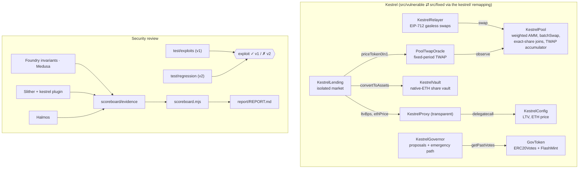

# Audit Lab — Kestrel: Vulnerable-by-Design Protocol, Exploit PoCs, Custom Detectors and a Report

> A mini DeFi protocol seeded with **12 bugs** modelled on public incidents (2022–2025) and the
> OWASP Smart Contract Top 10 (2026). Every bug is closed three ways — an exploit that succeeds on
> v1 and fails on v2, a minimal tagged fix, and a property that fails on v1 and holds on v2 — and a
> blind scoreboard, derived from stored tool output, measures which bug classes each tool catches.

[](https://github.com/monzon1985/blockchain/actions/workflows/17-seeded-bug-audit-lab.yml)


## What's interesting here

- **12 bugs, each closed three ways, machine-checked.** 15 exploit PoCs pass on the vulnerable
  build and fail on the fixed one; 22 attack regressions pass on the fixed build and fail on the
  vulnerable one; every bug has a property (Foundry invariant, Medusa property or Halmos check)
  that fails on v1 and holds on v2. `scripts/scoreboard.mjs --check` verifies all of it from the
  stored evidence in [`scoreboard/evidence/`](scoreboard/evidence).
- **A blind, evidence-backed scoreboard.** The stateful harness is written from the specification
  (random actors, random batch layouts with duplicates, contract wallets, a generic flash borrower),
  not from the bug list. A tool is credited only when its signal fires on v1, not on v2, and is
  traced to the bug (result below).
- **Minimal, verifiable fixes.** The two trees differ only in 32 tagged regions (97 changed lines);
  [`report/diffs/`](report/diffs) holds one patch per finding and CI proves that applying them in
  order to `src/vulnerable` reproduces `src/fixed` byte for byte.
- **Three custom Slither detectors** (Python plugin, run by CI on the protocol): 7/7 pytest cases on
  labelled fixtures with adversarial negatives, plus measured precision on the protocol itself.
- **Coverage 100 % of lines and 99.6 % of branches** of the production tree, every reachable
  custom-error revert path tested with its exact selector.

**Scoreboard.** <!-- BEGIN:scoreboard-summary -->
**12/12** seeded bugs were surfaced by at least one tool on the vulnerable build without hints (Foundry inv. 12, Medusa 12, Halmos 3, Slither (std) 2, Slither (custom) 2). Static analysis alone (standard + custom Slither detectors) surfaced **4/12**; the other 8 needed a property written from the specification and a stateful or symbolic tool to falsify it. All 12 are closed by an exploit that passes on v1 and fails on v2 and by attack regressions that pass on v2 and fail on v1.
<!-- END:scoreboard-summary -->

## Overview

**Kestrel** is an original protocol: a two-asset weighted AMM with batch swaps and exact-share
joins, a native-ETH share vault, an isolated lending market priced by a TWAP oracle, token-weighted
governance with an emergency path, an EIP-712 gasless-swap relayer, and a transparent proxy in front
of the lending risk parameters. <!-- BEGIN:nsloc-summary -->
956 nSLOC in the vulnerable tree, 984 in the fixed tree, plus 171 nSLOC of shared code (counted by `scripts/report.mjs`).
<!-- END:nsloc-summary -->

It ships twice — `src/vulnerable/` (v1) and `src/fixed/` (v2) — behind a `kestrel/` remapping, so
one test runs against either tree by switching the Foundry profile. Everything that is not a seeded
bug is identical in both trees and written to production standard; the vulnerable tree carries no
hints (no `BUG` comments), so it can be audited blind.

The point is the loop — exploit, fix, property — and the judgement about which bug classes a
scanner catches, which need a property written from the specification, and which need both.

## Architecture



| Component | Responsibility | Key external calls |
|---|---|---|
| `KestrelPool` | Weighted swaps, batch swaps, proportional and exact-share joins, LP rewards, native-sponsored swap, price accumulator | `SafeERC20` transfers; ETH refund and fee withdrawal |
| `KestrelVault` | ETH deposits ↔ kETH shares; dead shares on first deposit; yield accrual | ETH transfer on withdraw/redeem |
| `KestrelLending` | Supply/borrow against ERC-20 or vault-share collateral | `oracle.priceToken0In1`, `vault.convertToAssets`, `config.ltvBps`/`ethPrice` |
| `KestrelGovernor` | Snapshot proposals; emergency execution on durable supermajority stake | `token.getPastVotes`; arbitrary `target.call` (quorum-gated) |
| `KestrelRelayer` | Verify EIP-712 (ECDSA or ERC-1271) swap requests, pull funds, route to the pool | `SignatureChecker`, `pool.swap` |
| `KestrelProxy` → `KestrelConfig` | Transparent proxy (EIP-1967 slots) in front of the risk parameters | `delegatecall` |
| `PoolTwapOracle` | Fixed-period TWAP with maximum window and maximum age | `pool.observe` |
| `GovToken` | ERC20Votes + ERC20FlashMint + ERC20Permit | — |

## Roles and trust assumptions

| Role | Power | If compromised |
|---|---|---|
| Pool owner (`Ownable2Step`) | Set the LP reward rate; withdraw collected native fees | Can mis-set emissions (bounded by the funded reserve) and take the fees; cannot touch reserves or LP shares |
| Risk owner (config, two-step) | Set LTV (≤ 90 %) and the ETH reference price | Can set an extreme ETH price and let borrowers drain lending liquidity: the price is a trusted input |
| Proxy admin | Upgrade the config implementation | Full control of the risk parameters |
| GovToken owner (`Ownable`) | Mint governance tokens (used to seed fixtures and demos) | Can mint a 66.66 % stake, hold it for the 50-block lookback and move the treasury through the emergency path; a deployment would renounce this role or hand it to governance |
| Governance holders | Pass proposals; a 66.66 % holder of 50+ blocks can act at once | A durable supermajority can move the treasury (by design, no timelock — see the threat model) |
| Keeper (anyone) | Advance the TWAP oracle once per period | Cannot change a published price; inactivity only makes reads stale (fail closed) |
| Relayer (anyone) | Submit signed swaps | Cannot forge or replay authorizations; only pays gas |
| Users | Permissionless trading, vault and lending | Isolated market, no cross-collateral contagion |

## Invariants and properties

Stateful invariants, written from the specification, in
[`test/invariant/KestrelInvariants.t.sol`](test/invariant/KestrelInvariants.t.sol) and checked
against the spec-only handler [`KestrelHandler`](test/invariant/KestrelHandler.sol). Medusa checks the
same rules as `property_*` functions in [`test/medusa/KestrelMedusaHarness.sol`](test/medusa/KestrelMedusaHarness.sol).
All hold on v2; the "v1" column is what the blind run recorded.

| # | Rule (plain English) | Test | v1 |
|---|---|---|---|
| INV-01 | Each pool's recorded reserves never exceed its token balances | `invariant_poolSolvency` | fails |
| INV-02 | A batch step never pays more than a single swap of the same input (fee parity) | `invariant_batchMatchesSingleSwap` | fails |
| INV-03 | Repeated tiny batch swaps never extract more than the single-swap quote (rounding favors the pool) | `invariant_poolRoundingFavorsPool` | fails |
| INV-04 | Every join pays at least its pro-rata share of each reserve | `invariant_joinsPayProRata` | fails |
| INV-05 | The pool's ETH equals its uncollected native fees | `invariant_nativeFeeAccounting` | fails |
| INV-06 | Owner-only pool actions (emissions, fee withdrawal) succeed only for the owner | `invariant_privilegedActionsOwnerOnly` | fails |
| INV-07 | The reward reserve is always held by the pool | `invariant_rewardReserveBacked` | holds |
| INV-08 | The vault's accounted assets never exceed its ETH | `invariant_vaultSolvency` | holds |
| INV-09 | The vault share price never decreases | `invariant_sharePriceMonotonic` | fails |
| INV-10 | Repeated dust withdrawals never pay more than the burned shares are worth | `invariant_vaultRoundingFavorsVault` | fails |
| INV-11 | An integrator reading the share price during an ETH callback sees the price before or after, never a third | `invariant_integratorsSeeConsistentPrice` | fails |
| INV-12 | A swap cannot change a position's collateral valuation within the same block | `invariant_valuationIgnoresSameBlockSwaps` | fails |
| INV-13 | Stake that exists only inside a flash loan never moves the treasury | `invariant_treasuryNeedsDurableStake` | fails |
| INV-14 | A signed relay request executes at most once, on one chain | `invariant_signaturesSingleUse` | fails |
| INV-15 | Only the owner changes risk parameters, only the pending owner accepts, the config initializes once | `invariant_configChangesAuthorized` | fails |
| INV-16 | Only the proxy admin upgrades the proxy | `invariant_onlyAdminUpgrades` | holds |

Halmos properties on the real contracts ([`test/halmos/FixedProperties.t.sol`](test/halmos/FixedProperties.t.sol)):
vault rounding always favors the vault (withdraw, deposit, redeem); a flash-minted balance can never
pass the emergency quorum and a vote counts the snapshot weight; a checked shift reported as safe
is lossless. The bounds are stated in the file: symbolic 64-bit vault amounts at concrete
non-integer share prices whose divisor is a power of two (general 256-bit division times out in
yices and z3), loans up to 2^128, every `n` and all 256 shift amounts.

## Security considerations and threat model

The twelve seeded bugs are documented in [`report/REPORT.md`](report/REPORT.md) (8 High, 2 Medium,
2 Low), together with four issues found while re-reviewing the first round of fixes, six
informational notes and three gas notes.

- **Assets.** Pool reserves and LP rewards; vault ETH; lending liquidity; the governor treasury; the
  users' token allowances to the relayer; the risk parameters.
- **Actors.** Traders, LPs, depositors, borrowers, lenders, keepers, relayers, governance holders,
  the pool owner, the risk owner, the proxy admin; adversaries with flash loans, short-term loans of
  governance tokens, contract wallets without `receive`, and integrators that call back.
- **Attack surface.** Every external entry point; ETH callbacks from the vault and the pool; the
  ERC-3156 flash mint; signatures (replay, cross-chain, ERC-1271); the AMM spot price; proxy storage.
- **Mitigations (v2).** TWAP pricing with period, window and age bounds; checkpointed emergency
  votes 50 blocks in the past; duplicate-asset rejection; checked refunds; rounding toward the
  protocol everywhere; CEI plus read-only-reentrancy guards on price views; a lossless checked
  shift; EIP-1967 proxy slots; EIP-712 domain with chain id and per-user nonces; dead shares and a
  `minShares` bound against vault inflation; `nonReentrant` on every state-changing entry point.
- **Known limitations.** No liquidations; the ETH price is a trusted, owner-set parameter; the
  emergency path has no timelock or veto (a durable 66.66 % stakeholder can act at once); the oracle
  needs a keeper and fails closed when stale (debt-free accounts are unaffected); the risk config
  keeps a pre-ERC-7201 layout on purpose (see Deviations). `src/vulnerable/` is insecure by design:
  do not reuse it. Nothing here is audited or deployed with real funds; "Kestrel" is fictional.

## Design decisions and trade-offs

- **Two trees, one remapping, separate builds.** `kestrel/` resolves to `src/vulnerable/` or
  `src/fixed/` per profile, and each profile has its own `out/`, `cache/` and fuzz-failure
  directory, so a profile switch can never re-run the other tree's bytecode.
- **Fix tags instead of git tags.** Both trees live in one commit, so `v1-vulnerable` /
  `v2-fixed` git tags would point at identical content. Each fix is a region tagged `[SCxx]` in
  `src/fixed`; `scripts/fixdiffs.mjs` extracts one patch per finding and proves they compose.
- **Specification-first properties.** The handler knows the protocol's rules and generic actor
  types, not the bug sites; the scoreboard therefore measures what spec-level properties plus each
  tool catch. It was written by the same author who seeded the bugs — a truly blind measurement
  would need a third party.
- **Fixed-period TWAP.** Consumers read the stored average of the last completed window, so the
  permissionless `update()` cannot shrink a window or freeze the market, and an over-long window is
  discarded rather than averaged over stale history.
- **Durable emergency stake.** The emergency quorum uses checkpoints 50 blocks old, which defeats
  flash mints and one-block loans; holding 2/3 of the supply for 50 blocks is the stated trust bound.
- **Verification-friendly math.** `mulDivDown/Up` take a plain-arithmetic path when both factors
  fit in 128 bits (exact, cheaper, linear for SMT) and Solady's 512-bit routine otherwise; a fuzzed
  differential test proves both agree with Solady.

## Testing

```bash
cd projects/17-seeded-bug-audit-lab
forge soldeer install
forge fmt --check
FOUNDRY_PROFILE=fixed forge build
FOUNDRY_PROFILE=fixed forge lint src/fixed src/shared --deny warnings        # production + shared code
FOUNDRY_PROFILE=vulnerable forge test --match-path 'test/exploits/*'        # 15 exploits pass on v1
export FORGE_SNAPSHOT_CHECK=true                                             # compare gas snapshots, never rewrite
FOUNDRY_PROFILE=fixed      forge test --no-match-path 'test/exploits/*'      # 126 tests pass on v2
FOUNDRY_PROFILE=vulnerable forge test --match-path 'test/gas/*'              # v1 gas baseline
FOUNDRY_PROFILE=fixed medusa fuzz --config medusa.json --timeout 300 --corpus-dir medusa-corpus/fixed
FOUNDRY_PROFILE=fixed halmos --match-contract FixedProperties --forge-build-out out/fixed
bash scripts/slither-gate.sh                                                # std + kestrel-* detectors (src/fixed + src/shared); every finding triaged
(cd detectors && uv sync --locked && uv run ruff check . && uv run ruff format --check . && uv run pytest)
node scripts/fixdiffs.mjs --check && node scripts/report.mjs --check && node scripts/scoreboard.mjs --check
```

The blind run regenerates every piece of scoreboard evidence on both builds from a clean state
(`out/`, `cache/`, persisted counterexamples and corpus removed first):

```bash
bash scripts/blind-run.sh                   # all tools incl. Medusa (180 s per build), then the scoreboard
bash scripts/blind-run.sh --deterministic   # Foundry, Halmos and Slither only (CI diffs this against the commit)
```

| Suite | Location | Count | Settings |
|---|---|---:|---|
| Exploit PoCs (v1) | `test/exploits/` | 15 tests, 12 bugs | vulnerable profile; assert attacker profit or a broken rule |
| Attack regressions (v2) | `test/regression/SC*`, `Replay*` | 22 + 1 control | fixed profile; the same attack fails, selector-exact; the control passes on both |
| Review regressions (v2) | `test/regression/Review_*` | 6 tests | oracle liveness, vault inflation |
| Unit | `test/unit/` | 83 tests | every reachable revert path, exact selectors |
| Invariants | `test/invariant/` | 16 invariants, 1 campaign | 128 runs × depth 64 = 8,192 calls; seed `0x4b65737472656c`; 1 worker |
| Gas bench | `test/gas/` | 13 tests | snapshots per profile in `gas/` |
| Medusa | `test/medusa/` | 16 properties | 300 s × 4 workers (gate); 180 s per build (blind run) |
| Halmos | `test/halmos/` | 7 properties | `halmos.toml`: loop 256, 300 s assertion timeout |
| Detectors (pytest) | `detectors/tests/` | 7 tests | hermetic solc 0.8.37 compile of labelled fixtures |

Fuzz tests use 256 runs with the same pinned seed. **Coverage** (fixed tree, `forge coverage`,
CI-enforced ≥ 90 % lines): **100 % of lines (596/596), 99.6 % of branches (225/226)**.

## Detectors

Three custom Slither detectors in [`detectors/`](detectors), registered as the `kestrel` plugin, so
`uv run --project detectors slither .` runs them next to the standard detectors:

| Argument | Flags | Protocol result |
|---|---|---|
| `kestrel-spot-price-collateral` | a valuation function (collateral, price, health, …) that consumes, through an external call, a price one transaction can move (reserves/spot, `balanceOf`, an ERC-4626 share price); one hit per source | v1: `collateralValue ← spotPrice0In1` (SC03) and `← convertToAssets`; v2: `← convertToAssets` only (triaged, accepted risk) |
| `kestrel-unchecked-callback` | an external, state-changing arbitrary call whose guard is missing or derived from a flash-loanable balance (`balanceOf`, `totalSupply`, `getVotes`) rather than storage, checkpoints or caller identity | v1: `emergencyExecute` (SC04); v2: none |
| `kestrel-div-before-mul-loop` | a division whose result is multiplied later inside a loop | no hits on either tree |

pytest asserts precision = recall = 1.0 on labelled fixtures that include adversarial negatives (a
TWAP-priced valuation named like a price, a stored-quorum gate, a checkpoint gate). On the protocol
itself the precision is lower and reported honestly in
[`scoreboard/DETECTION_TABLE.md`](scoreboard/DETECTION_TABLE.md).

## Gas

<!-- BEGIN:gas -->
| Operation (fix it pays for) | v1 gas | v2 gas | Δ | Δ % |
| --- | ---: | ---: | ---: | ---: |
| `KestrelGovernor.emergencyExecute [SC04]` | 67,760 | 73,231 | +5,471 | +8.1% |
| `KestrelLending.borrow [SC03]` | 128,534 | 128,055 | -479 | -0.4% |
| `KestrelPool.addLiquidityExactShares [SC09]` | 143,989 | 144,108 | +119 | +0.1% |
| `KestrelPool.batchSwap (2 assets, 1 step) [SC02 SC05 SC07a]` | 107,862 | 108,867 | +1,005 | +0.9% |
| `KestrelPool.setRewardRate (owner) [SC01]` | 52,061 | 54,224 | +2,163 | +4.2% |
| `KestrelPool.swap` | 101,867 | 101,868 | +1 | +0.0% |
| `KestrelPool.swapWithNativeSponsor (with refund) [SC06]` | 132,490 | 132,518 | +28 | +0.0% |
| `KestrelProxy -> KestrelConfig.ethPrice [SC10]` | 9,520 | 9,550 | +30 | +0.3% |
| `KestrelRelayer.relaySwap [REPLAY]` | 150,302 | 168,496 | +18,194 | +12.1% |
| `KestrelVault.convertToAssets [SC08]` | 4,915 | 5,064 | +149 | +3.0% |
| `KestrelVault.deposit` | 59,767 | 59,854 | +87 | +0.1% |
| `KestrelVault.redeem [SC08]` | 49,854 | 49,944 | +90 | +0.2% |
| `KestrelVault.withdraw [SC07b]` | 49,827 | 50,076 | +249 | +0.5% |

Measured by `test/gas/GasBench.t.sol` with `vm.snapshotGasLastCall` under each profile; snapshots committed in `gas/vulnerable/` and `gas/fixed/` and checked in CI with `FORGE_SNAPSHOT_CHECK=true`.
<!-- END:gas -->

The baseline is the vulnerable tree: the Δ column is what each fix costs. The duplicate-asset scan
(SC05) and the fee (SC02) make `batchSwap` slightly dearer; the per-user nonce SSTORE dominates
`relaySwap` (REPLAY); the checkpoint lookup costs `emergencyExecute` a few thousand gas (SC04).

## Getting started

Prerequisites: Foundry `1.8.3`, Node `24`, Python `3.12` + `uv 0.12`, and for the analysis gates
Medusa `1.5.1` with crytic-compile `0.4.2` (`uv tool install crytic-compile==0.4.2`), Halmos `0.3.3`
(`uv tool install halmos==0.3.3`; on Windows it needs the VS 2022 C++ build tools). Slither `0.11.6`
is pinned inside the detectors project. The detector tests compile with solc `0.8.37` through
solc-select (`uv run --project detectors solc-select install 0.8.37` once).

```bash
git clone https://github.com/monzon1985/blockchain
cd blockchain/projects/17-seeded-bug-audit-lab
forge soldeer install                      # fetches the pinned dependencies (network)
FOUNDRY_PROFILE=fixed forge build          # everything after this runs offline on local EVMs
FOUNDRY_PROFILE=fixed forge test --no-match-path 'test/exploits/*'
```

Local demo — the same attack against both builds:

```bash
FOUNDRY_PROFILE=vulnerable forge test --match-test test_exploit_spotPumpBorrowsTheMarket -vvv   # PASS: market drained
FOUNDRY_PROFILE=fixed      forge test --match-test test_exploit_spotPumpBorrowsTheMarket -vvv   # FAIL: Undercollateralized
cat report/diffs/SC03.diff                                                                       # the whole fix
```

## Project structure

```
17-seeded-bug-audit-lab/
├── src/vulnerable/       # v1: the 12 seeded bugs, no hints in the source
├── src/fixed/            # v2: one [SCxx]-tagged fix per bug, nothing else differs
├── src/shared/           # GovToken, KestrelConfig, PoolTwapOracle, interfaces (both trees)
├── test/attacks/         # one attack contract per finding
├── test/exploits/        # PoCs (pass on v1)
├── test/regression/      # the same attacks (pass on v2, fail on v1) + review regressions
├── test/invariant/       # spec-only system, actors, handler, 16 invariants
├── test/medusa/          # Medusa harness over the same handler
├── test/halmos/          # symbolic properties on the real contracts
├── test/unit/ test/gas/  # revert paths; gas bench
├── test/helpers/         # mocks, precision amplifier, fixed-tree error selectors
├── detectors/            # kestrel Slither plugin + pytest (uv project)
├── scoreboard/           # detection.json (attribution), evidence/, DETECTION_TABLE.md
├── report/               # REPORT.md, diffs/<BUG>.diff
├── gas/                  # committed gas snapshots per profile
├── scripts/              # blind-run.sh, slither-gate.sh, evidence, scoreboard, fixdiffs, report, slither-triage
└── foundry.toml · medusa.json · halmos.toml · slither.config.json · slither.triage.json
```

## Deviations from the Engineering Standards

- **Two trees and no git tags (spec deviation).** See Design decisions; `report/diffs/` replaces
  the `v1-vulnerable`/`v2-fixed` tags.
- **`src/vulnerable/` is insecure and emits a compiler warning (9302, the ignored refund call of
  SC06).** It is never linted or deployed; all gates for production code run on `src/fixed`.
- **`KestrelConfig` uses a sequential, pre-ERC-7201 layout with an OpenZeppelin-3.x-style
  initializer and its own two-step owner**, instead of namespaced storage and OpenZeppelin access
  control. That layout is safe behind an EIP-1967 proxy and is
  exactly what a proxy storage collision (SC10) breaks; namespaced storage would make the bug class
  unreachable. The implementation locks its initializer in the constructor.
- **`GovToken` uses single-step `Ownable`** (not `Ownable2Step`) for a mint that only seeds
  fixtures and demos; the role is listed under Roles, and a deployment would renounce it.
- **The vault is ERC-4626-shaped, not ERC-4626.** The asset is native ETH (ERC-4626 requires an
  ERC-20) and the ETH callback is what makes SC08 reachable; `withdraw`/`redeem` take no `owner`.
- **Halmos bounds** (above) and **Medusa has no RNG seed** in 1.5.1: its evidence is a recorded run
  with a stated budget, and CI keeps the corpus as an artifact.
- **Coverage tooling miscounts one proxy branch** (the assembly `return` in `ifAdmin` ends the frame
  before the counter): 225/226 branches rather than 226/226.

## Scope notes and future work

- Collateral and debt tokens are 18-decimal; the SC07a rounding bug is shown on a dedicated fee-free
  6-decimal pool so the fee cannot mask it.
- A production market would need liquidations, a live ETH oracle with its own staleness checks, a
  timelock or guardian on the emergency path, and a keeper incentive for the TWAP.
- The scoreboard would be more meaningful with properties written by someone who never saw the bug
  list.

## References

- [OWASP Smart Contract Top 10 (2026)](https://scs.owasp.org/sctop10/).
- Incidents the bugs are modelled on: Beanstalk (2022) flash-loan governance; Audius (2022) proxy
  storage collision and re-initialization; Curve (2022) and Sentiment (2023) read-only reentrancy;
  Cetus (2025) `checked_shlw` overflow; Bunni (2025) withdrawal rounding; Balancer v2 (2025) batch
  swap upscale/downscale rounding.
- EIP-712, EIP-1967, ERC-1271, ERC-3156, ERC-4626, ERC-5805; Uniswap v2 TWAP oracle design.
- Report structure adapted from public [Cyfrin](https://github.com/Cyfrin/cyfrin-audit-reports) and
  Spearbit reports; weighted-pool math after Balancer v2.

## License

MIT — SPDX headers in every source file.
