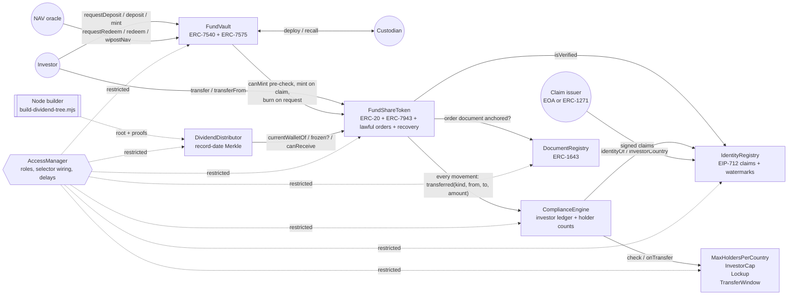

# Tokenized T-Bill Fund: ERC-3643-Style Compliance with ERC-7540 Async Subscriptions (Demo)

A demo tokenized money-market fund, never a real offering: a permissioned share token with claims-based identity and modular compliance, the ERC-7943 enforcement surface, an ERC-7540 / ERC-7575 asynchronous subscription and redemption vault settled at epoch NAV, lost-wallet recovery, and record-date Merkle dividends.

[](https://github.com/monzon1985/blockchain/actions/workflows/18-rwa-tbill-fund.yml)
[](../../LICENSE)


> **Technical demonstration.** This is not a compliant financial product, not an offer of securities, and has not been audited. Identity claims, NAVs and investors in this repository are synthetic.

## What's interesting here

- **No code path skips compliance, and a stateful invariant proves it against an independent model.** Transfers, `transferFrom`, 7540 claims (mints), redemption requests (burns), forced transfers and lost-wallet recoveries all funnel into one `_checkedUpdate` choke point. The invariant handler judges every movement with its *own* model of eligibility (its copy of wallet bindings, claim expiries, retired wallets and the trading window), never with the token's `canSend` / `canReceive`, and a probe module that learns about movements only through the engine mirrors every balance across 64 x 128-call campaigns ([I-1, I-2, I-6](#invariants)). Seven bugs re-injected by hand are each caught ([below](#invariants)).
- **Exact per-country holder counts, the classic ERC-3643 bookkeeping bug fixed.** Holders are counted per investor identity with wallet -> identity and identity -> country snapshots taken on entry. The fuzzer rebinds wallets, changes jurisdictions, freezes, recovers and fully exits; re-injecting the "decrement the *current* country" bug is caught.
- **Separation of duties that holds when one role is compromised.** A forced transfer needs a lawful-order record that the fund administrator issued for one (from, to, maximum amount, expiry) and that each execution consumes; a recovery needs a successor wallet that the compliance officer, not the transfer agent, bound to the holder's identity. Claim removals cannot be undone by relaying an older signed claim, and back-to-back epochs can no longer walk the NAV more than 2 % away from the anchor of its 24 h window.
- **Epoch settlement that rounding cannot game.** Forward pricing, a 24 h staleness limit, a per-epoch and per-24 h circuit breaker, floors in favour of the fund, and claims that depend only on their own request. Fuzzed over NAVs from 0.001 to 1000 assets per share: claims are order-independent, and over 5-epoch sequences with P&L the holders who stay are never diluted ([V-5](#invariants)).
- **350 Foundry test functions** (forge prints 340: the 12 invariants are grouped per suite) + 12 Node tests + a Medusa harness with 7 properties and `assert`-based checks in 10 of its 19 actions; **100 % line / branch / function coverage** of `src/` (901/901 lines, 291/291 branches, 165/165 functions); zero `forge lint` and Slither findings after documented triage. A compliant share transfer costs 153,217 gas vs 64,159 for a plain ERC-20 transfer in the same harness.

## Overview

Tokenized money-market funds have to reconcile two things that pull in opposite directions:

1. **Permissioned ownership.** Only verified, eligible investors may hold shares; jurisdictions have holder caps; regulators can order freezes and seizures; lost keys must be recoverable without breaking the register.
2. **Asynchronous, NAV-based dealing.** Subscriptions and redemptions are not instant swaps: they are requests that settle at a NAV struck after a cutoff, and cash moves in and out of off-chain custody.

Each half is well understood alone (ERC-3643 for the first, ERC-7540 for the second). Combining them is where the bugs live: a vault that mints on claim is a transfer path that must pass compliance; a subscription accepted today can be refused by a holder cap at claim time; a burn on redemption must respect freezes and lockups; a forced transfer must bypass freezes but never recipient eligibility; a recovered wallet must lose its vault claims as well as its shares; holder counts must stay exact when wallets move between identities or countries; and rounding at settlement must not let one investor take value from another. This project implements the full stack and tests exactly those seams.

## Architecture



| Component | Responsibility | Key external calls |
|---|---|---|
| [`IdentityRegistry`](src/identity/IdentityRegistry.sol) | Wallet -> identity binding (compliance officer); EIP-712 claims (KYC, accreditation, jurisdiction) from trusted issuers, with expiry, one-time digests, issuer revocation, and a per-(identity, topic) issuance watermark that survives removal and revocation. | `SignatureChecker` (EOA + ERC-1271) |
| [`ComplianceEngine`](src/compliance/ComplianceEngine.sol) | Single choke point: builds a `TransferContext`, runs every module, keeps the per-identity ledger and snapshot-based holder counts. | registry, modules, `token.balanceOf` |
| [Modules](src/compliance/modules/) | `MaxHoldersPerCountry` (+ fund-wide cap), `InvestorCap` (per-identity concentration), `Lockup` (holding period on new shares), `TransferWindow` (UTC weekdays / hours for secondary trades). | engine views |
| [`FundShareToken`](src/token/FundShareToken.sol) | ERC-20 with the ERC-7943 surface (`canSend`, `canReceive`, `canTransfer`, partial freezes, forced transfers), lawful orders (issued by the fund administrator, consumed by the transfer agent), 2-day lost-wallet recovery with veto and cooldown, `canMint` pre-check, ERC-7575 `vault(asset)`. | engine, registry, document registry |
| [`FundVault`](src/vault/FundVault.sol) | ERC-7540 async deposits and redemptions with operators, ERC-7575 entry point, epochs with forward pricing, per-epoch and per-24 h NAV circuit breaker, subscription admission check, conversion of unclaimable subscriptions, custody moves and write-downs, lazy per-controller settlement, claims that follow recoveries. | share token, settlement asset |
| [`DividendDistributor`](src/dividends/DividendDistributor.sol) | Funded record-date distributions verified by Merkle proofs; pays the current wallet (after recoveries), escrows frozen holders. | share token, payout asset |
| [`DocumentRegistry`](src/documents/DocumentRegistry.sol) | ERC-1643 documents plus permanent hash anchoring (proof of existence survives replacement). | — |
| [`FundDeployment`](script/FundDeployment.sol) | Deploys and wires everything, and hands governance over behind AccessManager delays; used by the deployment script, every test fixture and the Medusa harness. | AccessManager |

### Lifecycle of an epoch

1. **Open.** `requestDeposit` checks the controller's whole unminted position against every compliance module (at the lowest NAV the circuit breaker allows) and locks cash in the vault; `requestRedeem` burns shares through compliance (eligibility, freeze, lockup).
2. **Close.** `closeEpoch` stamps the cutoff; new requests go to the next epoch.
3. **Price.** The oracle posts a NAV observed *strictly after* the cutoff, within +/- 2 % of the last settlement NAV and within +/- 2 % of the NAV that anchors the current 24 h window (`navBounds()` returns the accepted range).
4. **Settle.** `settleEpoch` (NAV at most 24 h old) converts deposits at `floor(assets / nav)` and reserves `floor(shares * nav)` for redemptions; it reverts unless the vault holds every pending deposit plus every reserved redemption.
5. **Claim.** The controller's current wallet (the controller itself, or the last successor after a recovery) or its operators claim with `deposit` / `mint` (mint through compliance) or `redeem` / `withdraw` (paid only to eligible wallets); nobody claims while a recovery of that wallet is pending. A settled subscription that compliance refuses to mint (its country filled up meanwhile) becomes a redemption of the open epoch with `convertUnclaimableDeposit`. Per-epoch rounding dust returns to the fund once every request of the epoch has been folded.

## Roles and trust assumptions

Roles are AccessManager roles; the selector-by-selector wiring is asserted in [`RolesTest`](test/unit/Roles.t.sol), and the hand-over delays in [`DeploymentTest`](test/unit/Deployment.t.sol).

| Role | Can | If compromised |
|---|---|---|
| `ADMIN` (0, governance) | Grant roles, wire selectors, bind the token, reference-less ERC-7943 `forcedTransfer`, `setVault`, `setCustodian`, `writeDownCustody`, `resetNavReference`, close targets. | Everything. `script/Deploy.s.sol` hands it to `FUND_GOVERNANCE` behind an execution delay (default 2 days), with delayed role grants and selector re-wiring (default 2 days each); the delay also applies to closing a target. |
| `FUND_ADMIN` (1) | Close / settle epochs, deploy idle cash to and recall it from the custodian, anchor documents, issue and revoke lawful orders, fund dividends. | Could settle at the oracle's latest NAV, issue orders, publish a wrong dividend root (bounded by what it funds). Cannot post NAV, execute a forced transfer, or change the custodian. |
| `TRANSFER_AGENT` (2) | Execute lawful orders (forced transfers), initiate / cancel / execute recoveries. | Moves shares only as far as `FUND_ADMIN`'s orders allow (parties, amount and expiry fixed, consumed on use), and recovers only to wallets the compliance officer bound to the same identity, behind a 2-day veto window and a 7-day cooldown after any veto or cancel. Optional execution delay (`TRANSFER_AGENT_EXECUTION_DELAY`). |
| `NAV_ORACLE` (3) | Post NAV. | Prices move at most 2 % per epoch and per 24 h window; cannot settle. Colluding with `FUND_ADMIN` it could still walk the NAV 2 % a day: keep them on separate keys. |
| `COMPLIANCE_OFFICER` (4) | Bind wallets to identities, trusted issuers, required topics, claim removal, modules and their limits, freezes. | Could trust a rogue issuer, bind wallets, freeze anyone or plug a blocking module; cannot move shares or cash; modules cannot re-enter a movement. Stealing through a recovery needs the transfer agent too, and the holder can veto. |
| `VAULT` (5) | Held only by the vault contract: `mint`, `burnForRedemption`. | Both still pass through compliance. |

Trust assumptions (details in [docs/THREAT_MODEL.md](docs/THREAT_MODEL.md)): honest NAV oracle within the band, custodian returns deployed assets (losses are written down by governance), claim issuers attest truthfully, the dividend root matches record-date balances, compliance modules are reviewed before being plugged in, and the settlement asset is a plain ERC-20 with the share's decimals (enforced by the vault constructor).

## Invariants

Enforced by handler-based Foundry invariant suites (64 runs x 128 calls each). The Medusa harness checks a subset of paths (no trading window, custody moves or subscription conversions; single-leaf dividends), with assertion-mode checks for I-1 and properties for I-2, I-3, I-4, I-6, V-1, V-2 and V-3.

| # | Property (plain English) | Enforced by |
|---|---|---|
| I-1 | **No path skips compliance.** Judged by an independent model, every successful movement — transfer, `transferFrom`, 7540 claim, redemption request, forced transfer, recovery — had an eligible recipient; user-initiated debits had an eligible, unfrozen, unlocked sender; transfers happened inside the trading window and `canTransfer` agreed with the outcome; lawful orders were never executed beyond their amount; a recovered (retired) wallet never claimed its old vault requests; a removed claim was never revived by a claim signed before the removal; dividends reached only eligible, unfrozen wallets or went to escrow, never twice and never above the leaf amount. | [`invariant_noMovementViolatesCompliance`](test/invariant/ComplianceInvariants.t.sol); Medusa: `assert`s in the movement actions of [`FundMedusaHarness`](test/medusa/FundMedusaHarness.sol) |
| I-2 | **The engine saw every movement.** A probe module fed only by the engine mirrors every wallet balance and the total supply. | [`invariant_engineSawEveryMovement`](test/invariant/ComplianceInvariants.t.sol), [`property_engineSawEveryMovement`](test/medusa/FundMedusaHarness.sol) |
| I-3 | **Per-country holder counts are exact.** Recounted from an independent ghost ledger they equal the engine's counters, across partial transfers, freezes, forced transfers, recoveries, jurisdiction changes and wallet rebinding. | [`invariant_holderCountsExact`](test/invariant/ComplianceInvariants.t.sol), [`property_holderCountsExact`](test/medusa/FundMedusaHarness.sol) |
| I-4 | **The investor ledger matches balances.** Each identity's aggregate equals the sum of its wallets' balances; every holding wallet has an identity snapshot. | [`invariant_investorLedgerMatchesBalances`](test/invariant/ComplianceInvariants.t.sol), [`property_investorLedgerMatches`](test/medusa/FundMedusaHarness.sol) |
| I-5 | **Dividends are solvent.** The distributor holds every unclaimed entitlement plus all escrow (multi-leaf distributions, over-claim attempts included). | [`invariant_dividendsSolvent`](test/invariant/ComplianceInvariants.t.sol) |
| I-6 | **Eligibility is what the rules say.** For every wallet, the token's `canSend` / `canReceive` equal the independent model: bound to an identity, every required claim unexpired and not removed, not retired, no pending recovery. | [`invariant_eligibilityMatchesIndependentModel`](test/invariant/ComplianceInvariants.t.sol), [`property_eligibilityMatchesModel`](test/medusa/FundMedusaHarness.sol) |
| V-1 | **Σ pending requests <= vault assets.** Pending deposits plus reserved redemptions are always held by the vault. | [`invariant_pendingAndReservedAreBacked`](test/invariant/VaultInvariants.t.sol), [`property_vaultSolvent`](test/medusa/FundMedusaHarness.sol) |
| V-2 | **Request bookkeeping is exact.** Global pending totals equal the sum over controllers; global claimable totals cover every controller (requests booked for other controllers, operator claims and third-party receivers included). | [`invariant_requestBookkeeping`](test/invariant/VaultInvariants.t.sol), [`property_requestBookkeeping`](test/medusa/FundMedusaHarness.sol) |
| V-3 | **Assets are conserved across epochs.** Vault balance = deposits + recalls (+ liquidity top-ups in Medusa) − payouts − deployments, exactly. | [`invariant_assetConservation`](test/invariant/VaultInvariants.t.sol), [`property_assetConservation`](test/medusa/FundMedusaHarness.sol) |
| V-4 | **Rounding is bounded and one-directional.** Dust returned to the fund is at most one base unit (of shares for deposits, of assets for redemptions) per request. | [`invariant_roundingDustBounded`](test/invariant/VaultInvariants.t.sol) |
| V-5 | **Remaining holders are never diluted.** With fund P&L tracking the NAV, the fund's own assets cover outstanding shares at the reference NAV after every settlement and claim. | [`invariant_remainingHoldersNotDiluted`](test/invariant/VaultInvariants.t.sol), [`testFuzz_settlementNeverDilutesRemainingHolders`](test/fuzz/EpochRounding.t.sol) |
| V-6 | **Shares are conserved.** Every share minted by a claim is still held, burned in a pending request, or burned in a settled redemption. | [`invariant_shareConservation`](test/invariant/VaultInvariants.t.sol) |

The vault suite runs with `fail-on-revert = true`: every handler action (requests for oneself or another controller, all four claim functions by the controller or an operator, to any receiver, closes, NAV moves with P&L, custody moves, settlements) must succeed. The compliance suite cannot (most of its attempts are meant to be refused), so deterministic smoke tests ([`ComplianceHandlerSmokeTest`, `VaultHandlerSmokeTest`](test/invariant)) drive every handler path once with admissible inputs and require it to succeed: a regression that made a path always revert would otherwise silently empty the campaign.

**The invariants have teeth.** Each bug below was injected into a scratch copy of the project (never into the committed code) and the whole Foundry suite was run against it:

| Injected bug | Caught by |
|---|---|
| Eligibility ignores claims: any wallet bound to an identity counts as eligible, even with its KYC removed (`_isEligible` checks `identityOf != 0` instead of `isVerified`) | I-6, I-1, the handler smoke test, 6 unit tests |
| `forcedTransfer` updates balances directly instead of going through `_checkedUpdate` | I-1, I-2, I-3, I-4, 4 unit tests |
| Holder exit decrements the investor's *current* registry country instead of the snapshot | I-3, 1 unit test |
| Redemption assets rounded up (`Ceil`) instead of down when folding | The vault campaign (folding a request underflows the epoch reserve, which `fail-on-revert` reports against all 6 vault invariants), 3 rounding fuzz tests, 2 unit tests |
| A lawful order is never used up (the executed amount is not deducted) | I-1 ("lawful order executed beyond its amount"), I-3, I-4, the handler smoke test, 3 unit tests |
| A claim removal leaves the old watermark, so a claim signed before the removal revives the identity | I-1 ("removed claim revived"), I-6, the handler smoke test, 1 fuzz test, 3 unit tests |
| A retired wallet (and its operators) keeps its vault claim rights after a recovery | I-1 ("retired wallet claimed a subscription"), 2 unit tests |

## Security considerations

Full threat model: [docs/THREAT_MODEL.md](docs/THREAT_MODEL.md) (assets, actors, trust assumptions, attack surface mapped to the OWASP Smart Contract Top 10 (2026), compromised and colluding roles, the stolen-key fallback, known limitations). Static-analysis triage: [docs/STATIC_ANALYSIS.md](docs/STATIC_ANALYSIS.md).

Highlights:

- **Forced transfers bypass freezes, never recipient eligibility** (ERC-7943 allows skipping `canReceive`; this implementation does not), and recipient-side modules (holder caps, investor cap) still apply. The transfer agent can only execute a lawful-order record issued by the fund administrator for a specific debited account, credited account, maximum amount and expiry, pointing at an anchored ERC-1643 document; executions consume the amount and order ids are single-use. The reference-less 7943 entry point is governance-only.
- **Recovery** requires a successor wallet that the compliance officer bound to the same identity, verified at initiation *and* at execution; it locks the lost wallet during a 2-day timelock (the lost wallet can veto: proof the key is not lost), a veto or cancel starts a 7-day cooldown, and execution moves balance, frozen amount and lockup together and retires the old wallet forever. Vault claims and dividend payouts follow the succession chain; the retired wallet and its operators lose their claim rights. A stolen (not lost) key is handled with a freeze, an unbinding and a lawful order ([threat model](docs/THREAT_MODEL.md#recovery-when-the-key-is-stolen-rather-than-lost)).
- **Claims**: EIP-712 domain binding (chain id, registry address), issuer inside the signed struct (no cross-account ERC-1271 replay), one-time digests, an issuance watermark per (identity, topic) that only moves forward (so a removal or revocation cannot be undone by an older signed claim), expiry, issuer revocation (also pre-emptive), trusted-issuer removal invalidates all of that issuer's claims instantly.
- **Reentrancy**: transient-storage guards on every vault and distributor entry point that moves assets and on the token's choke point (a module that re-enters is rejected: `test_moduleCannotReenterAMovement`).
- **Known limitations**: no ERC-7887 cancellation of pending requests (a settled subscription that compliance refuses can only be converted into a redemption), a conservative subscription pre-check near an investor cap, trusted dividend root, a > 2 % NAV move per epoch or per 24 h halts settlement until governance resets the reference, ~2.4x the gas of a plain ERC-20 transfer. Not audited.

## Design decisions and trade-offs

| Decision | Why | Cost |
|---|---|---|
| Claims stored in the registry, not ONCHAINID contracts | One registry read path, cheap verification (1 slot per topic on the hot path), EOA and ERC-1271 issuers. | Less portable identity across issuers' ecosystems than ONCHAINID. |
| Issuance watermark per (identity, topic), packed with `issuedAt` | Removal and revocation stick without a list of outstanding signatures; costs no extra slot. | An older claim can no longer replace an expired newer one: issuers re-sign. |
| Holder counts per identity, with snapshots | Fixes drift when a jurisdiction claim or wallet binding changes while holding; an investor with several wallets counts once. | An extra snapshot slot per wallet and per identity (+~90k gas when a new investor enters). |
| Burn on redemption request, mint on deposit claim | The vault never holds shares, so it needs no compliance exemption and every claim is a compliance event (the twist). | Cancelling a redemption would have to re-mint (not implemented). |
| Compliance pre-check at subscription request, conversion at claim | Cash is never accepted for shares compliance would refuse; when a cap fills up later the investor still gets out at the next NAV. | ~60k extra gas per request; the estimate uses the lowest NAV the breaker allows, so it is conservative near a cap. |
| `requestId = 0`, two slots per controller indexed by epoch parity | Allowed by ERC-7540; at most one closed-unsettled epoch plus the open one exist, so two slots suffice and settled slots fold lazily. | Only one epoch may await settlement at a time. |
| Forward pricing with a strict cutoff | Nobody can subscribe or redeem after the price is known. | Settlement needs a NAV observation after every close. |
| NAV band against the previous settlement **and** a 24 h window anchor | Limits a compromised oracle (or oracle + fund administrator) to 2 % per epoch and per day, however short the epochs; fails safe. | Genuine large moves need a governance transaction. |
| Floor everywhere, dust to the fund, per-request entitlements | Claim order cannot move value between investors (fuzzed). | A deposit loses less than one share (`nav / 1e18` asset units), a redemption less than one asset unit. |
| Lawful-order records issued by `FUND_ADMIN`, executed by `TRANSFER_AGENT` | Two-role rule for seizures; the order fixes parties, amount and expiry and is consumed, with the document hash in the event trail. | One extra transaction per order. |
| Wallet binding by `COMPLIANCE_OFFICER`, recovery by `TRANSFER_AGENT` | No single role can both point a successor at an identity and move a position to it. | Onboarding is a compliance-officer task. |
| Recovery implemented in the token (not via AccessManager delays) | Identity checks at both ends, a veto by the lost wallet, a cooldown, frozen-amount and lockup migration, retirement, rich events. | More token code (10.8 KB runtime, well under the 24 KB limit). |
| Frozen holder => whole dividend escrowed | Conservative and simple: no record-date freeze snapshot needed. | A partially frozen holder waits for the whole entitlement. |
| Modules as separate contracts with a `stateful` flag | Pluggable via AccessManager; stateless modules are never called back. | ~2.6k gas per cold module call. |
| No proxies | Immutable code, no ERC-7201 storage to get wrong; configuration changes go through roles. | Redeploy to change logic. |

## Testing

```bash
forge soldeer install
forge fmt --check && forge build && forge lint --deny warnings
forge test                                  # 350 test functions (340 reported: invariants grouped per suite)
FOUNDRY_PROFILE=ci forge test               # CI: 1024 fuzz runs, fixed seed 0x18
forge snapshot --check --match-contract GasBench
forge coverage --report lcov --no-match-coverage '(test|script)'
node scripts/check-coverage.mjs lcov.info --min-branches 90 --min-lines 90
medusa fuzz --config medusa.json --timeout 300
npm ci && npm test                          # Node builder + coverage gate tests
slither . --config-file slither.config.json # CI
bash scripts/demo.sh                        # local anvil end-to-end demo (asserts every step)
```

| Suite | Files | Tests |
|---|---|---|
| Unit (every revert path, every role, regression test per review finding, deployment hand-over) | [`test/unit`](test/unit) | 299 |
| Fuzz: claim signatures (replay, expiry, wrong issuer, tampering, cross-chain, removal watermark), epoch rounding over NAVs 0.001-1000, freezes | [`test/fuzz`](test/fuzz) | 16 |
| Invariant (handler-based, ghost ledgers, independent eligibility model) + handler smoke tests | [`test/invariant`](test/invariant) | 12 invariants in 2 suites + 2 smoke tests |
| Differential (Node builder vs Solidity port vs `MerkleProof`, fixtures with 1, 3, 4, 5 and 7 leaves, plus a port fuzz) | [`test/differential`](test/differential) | 6 |
| Gas benchmarks | [`test/gas`](test/gas) | 15 |
| **Foundry total** | | **350** (forge reports 340) |
| Node (`node:test`): dividend builder (every fixture reproducible), coverage gate | [`scripts/test`](scripts/test) | 12 |
| Medusa: properties + assertion-mode actions | [`test/medusa`](test/medusa) | 7 properties, `assert`s in 10 of 19 actions |

Coverage of `src/` (`forge coverage`, gate enforced at 90 % lines and branches): **100 % lines (901/901), 100 % branches (291/291), 100 % functions (165/165)**.

Fuzz / invariant settings: 256 fuzz runs locally, 1024 with a fixed seed in CI; invariants 64 runs x 128 calls; Medusa 4 workers, 100-call sequences, 300 s, which is tens to hundreds of thousands of calls depending on the machine (in the last local run all 7 properties and all 19 assertion-mode actions passed). ERC-165 ids are asserted against the specs: `0x3edbb4c4` (ERC-7943), `0xf815c03d` (ERC-7575 share), `0x2f0a18c5` (ERC-7575 vault), `0xe3bc4e65` / `0xce3bbe50` / `0x620ee8e4` (ERC-7540 operator / deposit / redeem).

## Gas

From [`.gas-snapshot`](.gas-snapshot) (`test/gas/GasBench.t.sol`, one operation per test, `vm.prank` overhead included in every row; full production wiring: 3 required claim topics, 4 modules).

| Operation | Gas |
|---|---:|
| Baseline: plain OpenZeppelin ERC-20 `transfer` (settlement asset) | 64,159 |
| Share `transfer` between existing holders | 153,217 |
| Share `transfer` to a new holder (new identity snapshot and country count) | 244,110 |
| Share `transferFrom` | 158,078 |
| `canTransfer` (view) | 108,557 |
| `IdentityRegistry.isVerified` (view) | 22,902 |
| `addClaim` (EIP-712 signature) | 106,586 |
| `requestDeposit` (with the compliance pre-check) | 195,596 |
| `deposit` claim (mint through compliance) | 283,056 |
| `requestRedeem` (burn through compliance) | 224,433 |
| `redeem` claim | 123,347 |
| `settleEpoch` | 132,323 |
| `forcedTransfer` executing a lawful order | 163,076 |
| `initiateRecovery` | 132,296 |
| Dividend `claim` | 117,668 |

Compliance overhead on a secondary transfer is about 89k gas over a plain ERC-20 transfer: two eligibility checks (3 claims each), four module calls, the investor ledger and the transient reentrancy guard (~0.5k). The subscription pre-check adds about 60k to `requestDeposit` (a full module check of the estimated mint), and following the succession chain adds about 4-5k to every claim.

## Getting started

Prerequisites: Foundry 1.8.3, Node 24; optionally Medusa 1.5.1 with crytic-compile 0.4.2, and Slither 0.11.6.

```bash
cd projects/18-rwa-tbill-fund
forge soldeer install      # OpenZeppelin 5.7.0 + forge-std 1.16.2, pinned in soldeer.lock
npm ci                     # @openzeppelin/merkle-tree 1.0.8, pinned in package-lock.json
forge build && forge test
```

**Local demo** (`scripts/demo.sh`): starts anvil on a free port, deploys with unlocked default anvil accounts (no keys anywhere), onboards two investors through an ERC-1271 claim issuer, subscribes, settles at NAV 1.00, waits out the lockup, trades, redeems at NAV 1.001, enforces a lawful order, recovers a lost wallet after the 2-day timelock, then snapshots record-date balances with `cast`, builds the dividend tree with the Node builder and pays it out on chain. Every step `require`s its expected outcome, so a regression fails the demo (it runs in CI). Real output:

```
==> deploy
  deployed share 0x5FC8d32690cc91D4c39d9d3abcBD16989F875707, vault 0x0165878A594ca255338adfa4d48449f69242Eb8F; epoch 1 closed with 150,000 USDC of requests
==> settle
  alice shares 100000000000, bob shares 50000000000
==> trade
  holders US=1 DE=1
==> finish
  bob redeemed 20,000 shares for 20020000000 USDC base units
  bob shares 40000000000, bob USDC 20020000000
  fund AUM at NAV 1.001: 130130000000
==> enforce
  order enforced: bob 35000000000, alice 95000000000 shares
  recovery of alice to 0x15d34AAf54267DB7D7c367839AAf71A00a2C6A65 pending
==> recover
  recovered 95000000000 shares to 0x15d34AAf54267DB7D7c367839AAf71A00a2C6A65
==> record-date snapshot (cast) -> Node dividend builder
  root 0x882f8f4d30c3d8d4e37a3754ca2a22051b4e182158ed0df81720c46c850a0f84: 2 claims, 999999999 allocated
==> dividend
  dividend 730769230 USDC base units paid to 0x15d34AAf54267DB7D7c367839AAf71A00a2C6A65
  dividend 269230769 USDC base units paid to 0x3C44CdDdB6a900fa2b585dd299e03d12FA4293BC
```

**Deployment** (keystore-based; the script never reads a private key; share decimals are read from the asset):

```bash
FUND_ASSET=0x... FUND_ADMIN=0x... TRANSFER_AGENT=0x... NAV_ORACLE=0x... COMPLIANCE_OFFICER=0x... \
FUND_GOVERNANCE=0x... \
forge script script/Deploy.s.sol --rpc-url "$RPC_URL" --account deployer --sender 0x... --broadcast
```

Optional AccessManager delays, in seconds: `GOVERNANCE_EXECUTION_DELAY` (default 2 days, on the governance ADMIN grant), `ROLE_GRANT_DELAY` (default 2 days, for new members of every operational role), `TARGET_ADMIN_DELAY` (default 2 days, for re-wiring or closing any fund contract) and `TRANSFER_AGENT_EXECUTION_DELAY` (default 0). Grant and target-admin delays take effect after AccessManager's 5-day minimum setback.

**Dividends**: snapshot record-date balances into a JSON file, then

```bash
node scripts/build-dividend-tree.mjs holders.json tree.json   # root, per-holder amounts and proofs
```

Fund `allocatedAmount` with `DividendDistributor.createDistribution(root, allocatedAmount, recordDate)`; anyone can then call `claim(id, account, amount, proof)`. The demo does exactly this against chain state.

## Project structure

```
projects/18-rwa-tbill-fund/
├── src/
│   ├── access/FundRoles.sol                 # AccessManager role ids
│   ├── compliance/ComplianceEngine.sol      # choke point, investor ledger, holder counts
│   ├── compliance/modules/                  # MaxHoldersPerCountry, InvestorCap, Lockup, TransferWindow
│   ├── dividends/DividendDistributor.sol    # record-date Merkle distributions + escrow
│   ├── documents/DocumentRegistry.sol       # ERC-1643 + hash anchoring
│   ├── identity/IdentityRegistry.sol        # EIP-712 claims, trusted issuers, issuance watermarks
│   ├── interfaces/                          # ERC-7943, ERC-7540, ERC-7575, ERC-1643, internal
│   ├── token/FundShareToken.sol             # ERC-20 + ERC-7943 + lawful orders + recovery
│   └── vault/FundVault.sol                  # ERC-7540 / ERC-7575 epochs and NAV
├── test/
│   ├── unit/ fuzz/ invariant/ differential/ gas/ medusa/
│   ├── fixtures/                            # dividend holder snapshots and builder outputs (1, 3, 4, 5, 7 leaves)
│   ├── mocks/ utils/                        # ERC-1271 issuer, probe module, Solidity Merkle port
├── script/                                  # FundDeployment library, Deploy, DemoLocal, mocks/MockUSDC (demo asset)
├── scripts/                                 # check-coverage.mjs, build-dividend-tree.mjs, demo.sh, node tests
├── docs/                                    # THREAT_MODEL.md, STATIC_ANALYSIS.md
├── foundry.toml  soldeer.lock  remappings.txt  medusa.json  slither.config.json
└── package.json  package-lock.json  .gas-snapshot
```

## Scope notes and future work

- **ERC-7943 naming.** The spec for this project mentions `canTransfer/canTransact`; the current ERC-7943 text splits `canTransact` into `canSend` / `canReceive` (interface id `0x3edbb4c4`). Both are provided: the ERC functions plus a `canTransact` alias for the earlier draft.
- **Not implemented**: ERC-7887 cancellation of pending requests, multiple assets per share (ERC-7575 multi-entry), on-chain record-date checkpoints to verify dividend roots trustlessly, ONCHAINID interoperability, a holiday calendar for the transfer window, a guardian role for instant emergency closing under governance delays, upgradeable deployment, formal verification (Halmos) of the rounding lemmas.
- **Dividends are cash** (settlement asset), not reinvested shares; the "compliance" of a dividend claim is therefore payee eligibility plus freeze escrow rather than a share movement.
- Medusa's own lcov output is only meaningful with CBOR metadata in the bytecode, which is why `foundry.toml` keeps the compiler default.

## References

- [ERC-3643](https://eips.ethereum.org/EIPS/eip-3643) T-REX permissioned tokens (Tokeny and the ERC-3643 Association): identity registry, modular compliance, recovery and freezes that this design reworks.
- [ERC-7943](https://eips.ethereum.org/EIPS/eip-7943) uRWA: enforcement surface and reference implementation (whose forced transfer bypasses the token's `_update`; this project deliberately does not).
- [ERC-7540](https://eips.ethereum.org/EIPS/eip-7540) asynchronous vaults, [ERC-7887](https://eips.ethereum.org/EIPS/eip-7887) request cancellation and [ERC-7575](https://eips.ethereum.org/EIPS/eip-7575) multi-asset / external-share vaults; [ERC-4626](https://eips.ethereum.org/EIPS/eip-4626). Centrifuge's liquidity pools were the prior art for 7540-based fund dealing.
- [ERC-1643](https://github.com/ethereum/EIPs/issues/1643) document management (ERC-1400 family), [EIP-712](https://eips.ethereum.org/EIPS/eip-712), [ERC-1271](https://eips.ethereum.org/EIPS/eip-1271), [ERC-165](https://eips.ethereum.org/EIPS/eip-165).
- [OpenZeppelin Contracts 5.7](https://github.com/OpenZeppelin/openzeppelin-contracts) (AccessManager, ERC20, MerkleProof, SignatureChecker, ReentrancyGuardTransient, SafeCast) and [@openzeppelin/merkle-tree](https://github.com/OpenZeppelin/merkle-tree).
- [OWASP Smart Contract Top 10 (2026)](https://scs.owasp.org/sctop10/); [Medusa](https://github.com/crytic/medusa) and [Slither](https://github.com/crytic/slither) by Trail of Bits; [Foundry](https://github.com/foundry-rs/foundry).
