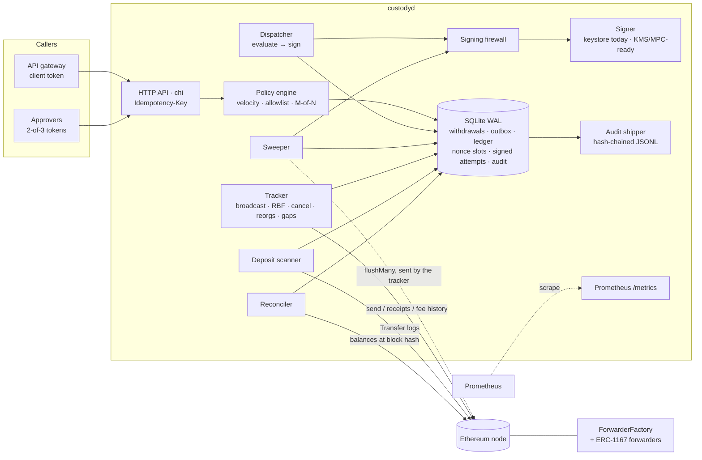
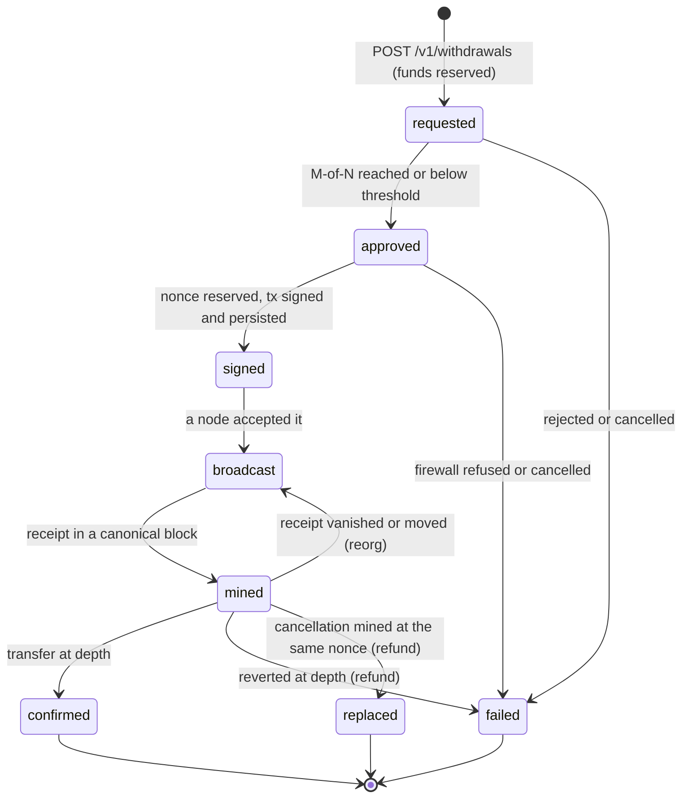

# Custodial Withdrawal and Deposit Engine in Go

An exchange-style hot-wallet service: an idempotent withdrawal API, a policy engine, a nonce
manager with replace-by-fee, reorg-aware confirmations, CREATE2 deposit forwarders swept in
batches, and a double-entry ledger that reconciles against chain state. It is crash-tested by
killing the real binary at every step of the withdrawal state machine.

[](https://github.com/monzon1985/blockchain/actions/workflows/19-go-custody-withdrawal-engine.yml)
[](../../LICENSE)


> **Technical demonstration.** Custody is a regulated activity. This repository shows how the
> engineering problems are solved. It is not a licensed custody product, it has not been audited,
> and it has never held real funds.

## What's interesting here

- **7/7 failpoints on the real binary**: `custodyd` is killed at every step of the withdrawal
  state machine and restarted while clients retry; exactly one on-chain transfer per withdrawal.
- **1,811 faulted runs, all converging**: each of the 1,659 database operations of a full
  workload is made to fail once, and each COMMIT is also made to succeed while reporting failure.
- **300 random crash and fault schedules, 0 violations**: 9,036 withdrawals, 1,545 crashes and
  1,902 reorg events (484 head regressions, 431 shorter forks), checked against chain ground
  truth, deposits included.
- **13/13 mutants caught**: a mutation check re-introduces, one at a time, the bugs found in
  review and a few classic ones (a refund outside its transaction, fees rounded down); each must
  fail the test written for it.
- **−73 % gas per deposit address**: 12,736 gas per forwarder in a batch sweep of 50, against
  46,486 for a sweep of one (anvil receipts).

Details are in [Testing](#testing) and [Design decisions](#design-decisions-and-trade-offs).

## Overview

A custodial exchange sends thousands of withdrawals from a hot wallet it controls. Every one of
them has to leave the wallet **exactly once**, even though:

- the API caller times out and retries, the process can crash between any two steps, and the
  node forgets transactions (restarts, eviction, `dropTransaction`);
- fees move, so a transaction can sit unmined until it is replaced at the same nonce, and any
  replacement can race the original;
- blocks get reorganised, so a "mined" transfer can disappear or move to another block;
- one nonce that is allocated and never used freezes every later withdrawal;
- deposits land in per-user addresses that must be credited only once they are final, and swept
  into the hot wallet cheaply;
- the books must always match the chain, and every operator action must be auditable.

The engine answers these with a small number of rules applied everywhere: **write-ahead**
(nothing is broadcast that is not already committed), **one nonce per business object** (every
replacement and cancellation of a withdrawal shares its nonce, so at most one can ever be mined),
**the transactional outbox** (a state change and the intent of its side effect commit together),
**idempotent ledger entries** (every entry has a unique reference), and **reconciliation against
the chain at exact block hashes**.

## Architecture



The scanner records and credits deposits; the sweeper creates sweeps and reserves their nonces
(the tracker sends them, like every other transaction); the reconciler reads the ledger and writes
its reports and audit events.

The withdrawal state machine (`internal/withdrawal/state.go`, pinned by `TestTransitionTable`):



Failpoints, in order: `after_request_commit`, `after_approve`, `before_sign`, `after_sign`,
`after_broadcast`, `after_bump_broadcast`, `before_confirm`.

| Component | Package | Responsibility | Key external calls |
|---|---|---|---|
| HTTP API | `internal/api` | Auth (hashed bearer tokens), idempotent create, approvals, cancel, allowlists, deposit addresses, balances, reconciliation report | none |
| Withdrawal service and dispatcher | `internal/withdrawal` | Persisted state machine, fund reservation and refunds, outbox intents `evaluate` and `sign` | none (estimation goes through the transaction manager) |
| Policy engine | `internal/policy` | Rolling 24 h velocity, allowlists with cool-down, per-transaction maximum, M-of-N approvals | none |
| Transaction manager | `internal/txmgr` | Gas estimation before any nonce is reserved, nonce slots (lowest free nonce), write-ahead attempts, broadcast, receipts, reorg reversal, RBF, cancellation, release of abandoned reservations, gap filling, drift detection | `eth_estimateGas`, `eth_sendRawTransaction`, `eth_getTransactionReceipt`, `eth_getTransactionByHash`, `eth_getBlockByNumber`, `eth_getTransactionCount` |
| Fees | `internal/fees` | EIP-1559 suggestion from `eth_feeHistory`, ≥ 12.5 % bumps (rounded up) with a cap | `eth_feeHistory` |
| Signer and firewall | `internal/signer` | `LocalKeystoreSigner` (keystore v3) behind a `Signer` interface ready for KMS or MPC backends; per-purpose policy re-checked at signing time | none |
| Ledger | `internal/ledger` | Double-entry postings, idempotent entries, reversals, an incremental invariant checker (one read snapshot per check, rolling re-verification of old postings) | none |
| Deposits | `internal/deposit` | CREATE2 derivation, reorg-aware `Transfer` log scanning, crediting at depth, `flushMany` sweeps | `eth_getLogs`, `eth_getBlockByNumber` |
| Reconciler | `internal/recon` | On-chain balances at the tracker's block hash against `hot_wallet + in_flight` | `eth_getBalance`, `eth_call` (EIP-1898 block hash) |
| Audit | `internal/audit` | Events written in the same transaction as the change, shipped to a hash-chained JSONL file, verifiable against the database | none |
| Contracts | `contracts/src` | `ForwarderFactory` (Ownable2Step, CREATE2 clones, batch flush), `DepositForwarder` (stateless, pays an immutable destination) | ERC-20 `balanceOf` and `transfer` |

## Roles and trust assumptions

| Role | Holds | Can | A compromise can |
|---|---|---|---|
| Hot-wallet key | Keystore file and password file; memory of `custodyd` | Sign any transaction | Drain the hot wallet. This is the unavoidable hot-wallet risk; limit exposure by keeping only operating liquidity hot |
| Factory owner (the hot wallet) | Same key | `deploy`, `flushMany`, `flushNativeMany`, transfer ownership in two steps | Sweep deposits **into the hot wallet**, nothing else: forwarders pay only the immutable `DESTINATION`. It cannot renounce ownership (that would strand deposits) |
| API client (gateway) | Bearer token (config stores SHA-256) | Create withdrawals for any account, manage any account's allowlist, read balances | Add destinations to any account and, after the 24 h cool-down, withdraw up to each account's 24 h velocity limit in amounts below the approval threshold (larger ones still need 2-of-3 approvers). Every allowlist change is audited and counted (`custody_allowlist_changes_total`) so a burst can be alerted on within the cool-down; see T19 in the threat model |
| Approver (×3, M = 2) | Bearer token | Approve or reject large withdrawals, cancel any non-final withdrawal | One approver alone cannot release a large withdrawal. Approvers can cancel: a denial of service that costs some gas, never customer funds |
| Ethereum node | none | Report chain state, accept transactions | Hide or delay data: receipts are checked against canonical block hashes, credits wait for depth, reconciliation reports any disagreement |

The engine assumes it is the only user of the hot-wallet key; see the [threat model](docs/threat-model.md).

## Invariants and properties

Engine (checked against chain ground truth, not only against the database):

1. **Exactly once.** A confirmed withdrawal has exactly one `Transfer(hot → destination, amount)`
   on the canonical chain; failed and replaced withdrawals have none.
   [`sim_test.go` P1](internal/app/sim_test.go), [`chaos_test.go`](integration/chaos_test.go), [`storage_faults_test.go`](internal/app/storage_faults_test.go), every anvil test.
2. **Debits equal credits.** Every ledger entry balances per asset, the trial balance is zero, and
   the cached balances equal the sum of the postings.
   [`TestPropertyDebitsEqualCredits`, `FuzzValidate`, `TestCheckDetectsTampering`](internal/ledger/ledger_test.go), [`TestCheckerDetectsTampering`](internal/ledger/check_test.go); the incremental checker runs inside every reconciliation.
3. **Reconciliation to the wei.** At every block the tracker fully processed, for ETH and every
   token: on-chain hot-wallet balance = ledger `hot_wallet` + ledger `in_flight`, where
   `in_flight` is the signed (usually negative) effect of transactions mined but not yet final.
   No reconciliation reports a mismatch because of a write that happened concurrently.
   `CheckInvariants` in [`testenv`](internal/testenv/testenv.go) (every simulation seed and the withdrawal scenarios), `checkReconciled` in [`engine_test.go`](integration/engine_test.go), chaos; under concurrent load: [`TestReconciliationUnderConcurrentWrites`, `TestServeUnderConcurrentLoad`](internal/app/concurrency_test.go).
4. **No overdraft.** A customer account can never reach a debit balance; the ledger rejects the entry.
   [`TestPostRejectsCustomerOverdraft`](internal/ledger/ledger_test.go).
5. **Signed means decided by the chain.** Once a withdrawal is signed, every path to a terminal
   state passes through `mined`: the engine never refunds a withdrawal whose transaction might be
   on the network. [`TestSafetyProperties`](internal/withdrawal/state_test.go); the simulator checks every recorded transition is an edge (P3).
6. **Contiguous nonces.** No nonce gap survives quiescence; a nonce released before signing is
   the next one reused, and no reservation is held by a step that will never sign it.
   [`TestScenarioNonceGapIsFilled`, `TestScenarioSigningRefusedReleasesNonce`](internal/app/scenario_test.go), [`TestScenarioCrashBeforeSignThenLiquidityDrop`, `TestScenarioReservationDoesNotDeadlockSweeps`, `TestScenarioAbandonedFillerReservationIsReclaimed`, `TestScenarioStaleReservationIsReclaimed`, `TestScenarioReservationReclaimedWhileSigning`](internal/app/scenario_liveness_test.go), chaos.
7. **Replacement rule.** A replacement raises both fee fields by ≥ 12.5 % (rounded up), to at
   least the market suggestion, and never above the cap. [`FuzzBump`](internal/fees/fees_test.go) (asserts the rounded-up bound), [`TestAnvilFeeSpikeReplaceByFee`](integration/engine_test.go) (both fields, against anvil's pool).
8. **Idempotency.** A repeated key replays the stored response (`Idempotent-Replayed: true`); the
   same key with a different body is a 422; no retry ever creates a second withdrawal.
   [`api_test.go`](internal/api/api_test.go), [`TestSimIdempotentReplay`](internal/app/app_test.go), `TestServeUnderConcurrentLoad`, `TestChaos/after_request_commit`, the devnet demo.
9. **Velocity.** Allowed withdrawals inside any 24 h window never exceed the limit.
   [`TestPropertyVelocityWindow`](internal/policy/policy_test.go).
10. **Customer balances.** At quiescence each customer's balance equals credited deposits minus
    confirmed withdrawals; `withdrawals_pending` and `in_flight` are zero. Simulator P4 and P5.
11. **Complete, tamper-evident audit.** The JSONL log holds exactly the database's events, in
    order, and its hash chain verifies. Simulator P6 and [`TestAnvilServeGracefulShutdown`](integration/engine_test.go) (both with `audit-verify -db`), [`audit_test.go`](internal/audit/audit_test.go).
12. **Storage failures are survivable.** If any single database operation fails (BEGIN, a
    statement or COMMIT), or a COMMIT succeeds but reports failure, every error surfaces as that
    one failure (an engine loop error or an HTTP 500, never a wrong answer), and after client
    retries the system converges with properties 1, 3, 6, 8, 10, 11 and 14 intact.
    [`TestStorageFaultInjection`](internal/app/storage_faults_test.go).
13. **Reorgs deeper than the confirmation depth are flagged, never absorbed.** A credited deposit
    or a finalized withdrawal that leaves the canonical chain raises `custody_deep_reorgs_total`
    and an audit event once; nothing already reported to a customer is rewritten automatically.
    [`TestScenarioDeepReorgIsFlagged`, `TestScenarioDeepReorgOfAFinalizedWithdrawalIsFlagged`](internal/app/scenario_test.go), [`TestScenarioReorgDeeperThanTheScannerWindow`](internal/app/scenario_liveness_test.go).
14. **Deposits match the chain.** Every canonical `Transfer` to a registered deposit address that
    is at the confirmation depth is credited exactly once, with its canonical block hash and
    amount; nothing else is credited; nothing at that depth is still pending. This holds through
    reorgs shallower than the confirmation depth, including a shorter fork that also replaces
    blocks below its new head. Simulator P7 (`CheckDeposits` in [`testenv`](internal/testenv/testenv.go)), [`scenario_liveness_test.go`](internal/app/scenario_liveness_test.go).

Contracts ([`ForwarderFactory.invariant.t.sol`](contracts/test/ForwarderFactory.invariant.t.sol)):

- **F1** Tokens are conserved: hot wallet + all forwarders = everything deposited (`invariant_tokenConservation`).
- **F2** The hot wallet receives tokens only through `flushMany`, which reports exactly what it moved (`invariant_hotWalletEqualsReportedFlushes`).
- **F3** Native currency is conserved the same way (`invariant_nativeConservation`).
- **F4** No caller other than the owner, through the factory, ever moves funds (`invariant_noUnauthorizedFlush`).
- **F5** Every deployed forwarder sits at its predicted address, is a 45-byte ERC-1167 clone, and points at this factory and destination (`invariant_deployedForwardersAreGenuine`).
- **F6** Go and Solidity derive identical CREATE2 addresses: `cast create2` vectors ([`addresses_test.go`](internal/deposit/addresses_test.go)), a byte-by-byte Go fuzz, a Solidity fuzz against OpenZeppelin, and 64 ids against the deployed factory ([`TestAnvilCreate2Differential`](integration/engine_test.go)).

## Security considerations and threat model

The full threat model (assets, actors, 20 threats with their mitigations and tests, OWASP SC
Top 10 mapping, limitations) is in [`docs/threat-model.md`](docs/threat-model.md). In short:

- **Crash and storage-failure safety** come from write-ahead persistence of signed transactions,
  one nonce per withdrawal, and one transaction per state change and its side-effect intent,
  not from careful ordering in any one code path. The tracker is the only component that
  broadcasts, and it only broadcasts rows that are already committed. Nothing external happens
  inside a database transaction, and every later step is idempotent, so a failed or ambiguous
  COMMIT is retried safely.
- **No reservation outlives its use.** A transfer is estimated before a nonce is reserved, so a
  liquidity shortfall never holds one; a retry that finds the reservation of an interrupted run
  and can no longer estimate releases it; an abandoned gap-filler reservation is released on the
  next tracker round; any other reservation left unsigned for 5 minutes is released as a safety
  net. Each release is audited and counted.
- **Reorgs**: inclusion is booked to `in_flight` under an epoch-numbered reference and reversed
  exactly when the receipt disappears or changes block hash. Credits and finality wait for
  `confirmations` blocks (12 by default). A head that moves backwards (a shorter fork, or a load
  balancer answering from a node that is behind) reverts vanished inclusions and rewinds the
  deposit scanner to the highest block it knows that is still canonical, not merely to the new
  head, because a shorter fork can also replace blocks below its head. Reorgs deeper than the
  confirmation depth are detected on both sides, deposits by the scanner and finalized
  withdrawals by the tracker (the chain's nonce falls to a nonce it had finalized), and flagged
  for a human (`custody_deep_reorgs_total`, audit event), never silently rewritten.
- **The signing firewall** re-validates every transaction just before it is signed: chain ID,
  EIP-1559 type, fee cap, zero ETH value, strictly canonical ERC-20 `transfer` calldata to the
  configured token, per-transaction maximum, an active allowlist entry, and `flushMany` as the
  only call a sweep may make (33 table cases). A bug upstream cannot make the key sign an
  arbitrary transaction, and if a pending withdrawal's destination leaves the allowlist, its next
  fee bump becomes a cancellation.
- **No internal details in API errors.** A 500 carries a generic message and the request id; the
  error itself goes to the log. The unauthenticated `/readyz` only names the dependency that is
  down: a node transport error can contain the RPC URL, and hosted providers put the API key in it.
- **Account-takeover defences**: a 24 h cool-down on new destinations, rolling velocity limits,
  2-of-3 approvals above a threshold, and hashed tokens (validated as 64 hex digits at start-up)
  compared as bytes in constant time.
- **Audit**: the shipper refuses to append to a log that does not verify or does not end at a
  database event, and only repairs a torn final line. `custodyd audit-verify -db` checks that the
  file holds exactly the database's events, which also catches lines cut from the end and a chain
  recomputed after an edit (the chain alone is not keyed).
- **Contracts**: forwarders hold no storage and can pay only the immutable hot wallet; only the
  factory can call them; only the owner can call the factory; `SafeERC20` handles USDT-style and
  `false`-returning tokens; ownership transfers in two steps and cannot be renounced.
- **Static analysis**: Slither 0.11.6 reports 0 findings with [`slither.config.json`](contracts/slither.config.json).
  Triage: `naming-convention` is excluded because the Solidity style guide's UPPER_CASE for
  immutables is used on purpose. `calls-loop` and `reentrancy-events` on the two batch functions
  are suppressed inline with a justification: batching external calls is their purpose, only the
  owner can call them, and a reentrant token cannot reach any mutable state. `forge lint` findings
  are triaged the same way, with inline `forge-lint: disable-next-line` comments.

**Known limitations**: a single in-memory hot key (the `Signer` interface is the extension point
for KMS, HSM or MPC); exclusive use of the key is assumed; ERC-20 customer assets only, with ETH
as the gas asset (native-ETH deposits can be recovered with `flushNativeMany`, never credited);
no fee-on-transfer tokens; L2 data fees are not booked; SQLite single-writer throughput; a stolen
gateway token is bounded per account, not wallet-wide (T19); the audit log is anchored to the
database only (T14).

## Design decisions and trade-offs

- **SQLite with one connection and `BEGIN IMMEDIATE`.** Every check-then-write (velocity limit,
  idempotency key, lowest-free nonce) becomes a critical section without locks in the
  application, and `synchronous=FULL` makes "committed before broadcast" survive power loss. The
  cost is single-writer throughput. That is fine for a hot wallet (withdrawals per second, not
  thousands). A Postgres port would use row locks on the same schema. No RPC call is ever made
  inside a transaction, and reads that must agree with each other share one read-only
  transaction (one WAL snapshot).
- **Nonce slots, lowest-free allocation.** One row per nonce in use. A reservation that never
  produced a signature is deleted, and the next allocation reuses it, so the sequence stays
  contiguous. A gap that survives anyway (released below a broadcast transaction) is filled with
  a zero-value self-send after `gap_grace_blocks`. A reserved nonce is not a gap, which is why
  reservations must never be left behind (see Security).
- **Book at inclusion, finalize at depth.** Mined but not final effects go to `in_flight`; at
  depth they move to `hot_wallet`. That makes the reconciliation identity exact at any processed
  block, which is stronger than "eventually consistent". Inclusion references carry an epoch, so
  a block that is reorged out and later becomes canonical again gets a fresh entry.
- **Incremental ledger verification.** Re-reading every posting at every reconciliation held the
  only database connection for a time that grew with the ledger, and reading the postings and the
  cached balances in two statements reported a write that landed in between as a mismatch. The
  checker now folds in only the entries posted since its last run, compares within one read
  snapshot, and re-verifies at most 5,000 old entries per run, so an edit to an old posting is
  still reported within two passes.
- **The scanner remembers enough to find a fork.** It keeps the hash of every scan range's end,
  of every block that held a deposit, and one anchor below its window that pruning never removes,
  and searches all of them (and the blocks of recorded deposits) for the highest one still
  canonical. Without the anchor, one scan covering more blocks than the window left nothing to
  rewind to.
- **Only the next-in-line transaction is bumped** (or one priced below the market). The first
  version bumped every stuck transaction, and the simulator showed that one stuck nonce escalated
  every transaction queued behind it by 12.5 % per bump until all of them hit the cap.
- **Bugs found while building it, each pinned by a regression test.** The simulator and scenario
  tests caught three that unit tests had not: (1) cancellation and gap-filler self-sends have no
  calldata, and `nil` was stored as SQL `NULL` into a `NOT NULL` column, so cancels never
  persisted and the queue froze; (2) the fee escalation described above; (3) the tracker bumped a
  transaction in the same round it first broadcast it, because it read the bump timer from a
  stale in-memory row. Code review found (4) a persisted replacement that could not be sent
  stopped the tracker from noticing that the original had been mined
  (`TestScenarioUnsendableReplacementDoesNotBlockInclusion`) and (5) 500 responses and the
  unauthenticated `/readyz` echoed internal error strings, including RPC URLs that carry API keys
  (`TestReadinessAndInternalErrorsDoNotLeakDetails`). (6) A reorg deeper than the confirmation
  depth that removed a finalized withdrawal was visible only as a stalled nonce queue
  (`TestScenarioDeepReorgOfAFinalizedWithdrawalIsFlagged`). An external review then found six
  more; the first three were out of the simulator's reach at the time, because it drove the
  loops one after another, never ran more than 3 confirmations, and compared customer balances
  with the engine's own deposit table: (7) a shorter fork that also replaced blocks below its
  head left a pending deposit from the abandoned fork that stalled every later credit; (8) a
  crash after a nonce was reserved, followed by a liquidity drop, froze the hot wallet, sweeps
  included; (9) reconciliation reported false mismatches whenever the API wrote concurrently;
  (10) a sweep that moved nothing claimed deposits made later in its own block; (11) the audit
  shipper replaced the file's history after a corrupt middle line; (12) a token hash written in
  upper-case hex loaded fine and then never authenticated. Extending the simulator to chain
  ground truth for deposits (P7) and 6 confirmations then found (13) the missing scanner anchor
  described above, and fixing (8) exposed (14) gap-filler reservations that nothing would ever
  release. The [mutation check](internal/tools/mutationcheck/main.go) re-introduces (7) to (14),
  plus a refund moved outside its transaction, fees rounded down, a discarded signature that
  ends its signing intent and a disabled reservation safety net (13 mutants), and requires each
  to fail its test.
- **Failpoints panic.** A panic on a loop goroutine kills the process. `net/http` recovers
  handler panics, so on the HTTP path the recoverer re-raises a failpoint crash as `os.Exit(2)`,
  the same exit status as an unrecovered panic.
- **Stateless ERC-1167 forwarders with an immutable destination** (after BitGo's forwarder
  design) rather than upgradeable or re-targetable ones. Rotating the hot wallet needs a new
  factory and new deposit addresses, but a compromised owner cannot redirect deposits. Clones are
  deployed lazily by the first sweep that needs them; on anvil that first sweep of a single
  forwarder costs 42,796 gas more than a later one (89,282 against 46,486).
- **abigen v2 bindings, `Pack`/`Unpack` only.** The engine builds and signs its own EIP-1559
  transactions (nonce, fees, write-ahead), so the bindings are used for ABI encoding and for
  deploying in tests. Contracts compile without CBOR metadata, so the bytecode embedded in the
  bindings is identical on every machine and CI can check `go generate` output byte for byte
  (the generator also prepends the SPDX header abigen cannot emit).
- **Two chains for testing.** The in-memory simulator makes hundreds of randomized crash
  schedules affordable (about a second per seed). anvil proves the same code against a real
  node's error strings, pool eviction, receipts and `anvil_reorg`.
- **The reorg guarantee is measured from the highest head ever seen.** Two shallow head
  regressions with no block in between add up to a deep reorg. The simulator bounds each event
  by the lag already accumulated, so every schedule stays inside the guarantee, and runs one seed
  in three at 6 confirmations so reorgs and shorter forks up to 5 blocks deep are exercised;
  deeper cases are covered by the two deep-reorg scenarios.
- **Storage faults are injected below `database/sql`.** `store.Options.WrapConn` interposes on the
  SQLite connection (through `sqlite.NewConnector`, so no global driver registration) and the
  test-only `faultdb` package numbers every BEGIN, statement and COMMIT. Production passes no
  wrapper and runs the same code path. The workload checks itself: its reference run must reach a
  fee bump, a cancellation, a reorged inclusion, a sweep, an approval, an allowlist removal and a
  counterfactual deposit, and the first draft of the workload failed that check.

## Testing

```bash
# contracts (from contracts/)
forge soldeer install && forge fmt --check && forge build && forge test
# Go (from the project root)
go generate ./... && git diff --exit-code -- internal/bindings
CGO_ENABLED=0 go vet ./...
CGO_ENABLED=0 go test -count=1 ./...                                      # unit, property, scenarios, concurrent loops, simulation, storage faults (every 4th op)
CGO_ENABLED=0 go test -count=1 -tags integration -timeout 20m ./integration/...  # anvil + chaos
CUSTODY_SIM_SEEDS=300 go test -run TestSimulation ./internal/app/         # deeper simulation
CUSTODY_SIM_SEED=17 go test -run TestSimulation -v ./internal/app/        # replay one seed exactly
CUSTODY_FAULT_STRIDE=1 go test -run TestStorageFaultInjection ./internal/app/  # fail every database operation
go test -run '^$' -fuzz '^FuzzBump$' -fuzztime 30s ./internal/fees       # fuzz a target
go run ./internal/tools/mutationcheck                                     # re-introduce each fixed bug in a copy; its test must fail
bash script/coverage.sh                                                   # unit + integration coverage, merged, minimum 90 %
```

| Suite | Location | Count | Settings |
|---|---|---|---|
| Foundry unit | `contracts/test/ForwarderFactory.t.sol` | 29 | every revert path, events, USDT-style and `false`-returning tokens, native recovery, two-step ownership |
| Foundry fuzz | same file | 5 | 1,024 runs (2,048 for the address differential); CI profile: 4,096 runs, fixed seed |
| Foundry invariants | `ForwarderFactory.invariant.t.sol` | 5 invariants, 1 handler | 256 runs × depth 64 = 16,384 calls, `fail_on_revert`; CI: 256 × 128 = 32,768 calls, fixed seed |
| Foundry gas | `ForwarderFactory.gas.t.sol` | 6 | `.gas-snapshot` and `snapshots/sweep.json`, both checked in CI |
| Go unit, property, table | `internal/*` | 54 functions (+ table subtests: 33 firewall, 15 policy, 5 + 4 ledger-tampering cases, 5 damaged audit logs, …) | property tests use seeded PCG streams |
| Go native fuzz | ledger, fees, chain, deposit | 4 targets | 30 s each in CI |
| Scenario tests (simulator) | `internal/app/scenario_test.go`, `scenario_liveness_test.go` | 32 | fee spike, drop, 2 reorg kinds, head moving backwards, a shorter fork replacing blocks below its head, a reorg right after a long scan range, a reorg deeper than the scanner's window, a stale pending deposit, cancel before and after broadcast, unsendable replacement, allowlist removal, firewall refusal, nonce gap, a crash before signing followed by a liquidity drop (with and without sweeps), abandoned and stale reservations, a reservation reclaimed while signing, nonce drift, fee cap, liquidity race, batch sweep, a sweep that moved nothing, reverted sweep, orphaned deposit, deep reorg of a deposit and of a finalized withdrawal, reconciliation of a tampered ledger and of a stale head, M-of-N, policy rejections |
| Concurrent loops | `internal/app/concurrency_test.go` | 2 | `App.Serve` (HTTP API and every loop as goroutines) under HTTP load against a chain mining every 3 ms, then every simulator property; 200 forced reconciliations during concurrent writes, none may report a mismatch |
| Storage fault injection | `internal/app/storage_faults_test.go` | 1,811 faulted runs | every one of the 1,659 operations failed (202 BEGIN, 50 of them read-only transactions; 554 exec, 751 query, 152 COMMIT), every COMMIT also made ambiguous; `go test ./...` runs every 4th operation, `-short` every 16th, CI all of them |
| Model-based simulation | `internal/app/sim_test.go` | 40 seeds × 220 steps (300 in CI) | crash armed at a random failpoint in ~4 % of steps, ~3 % of sends and ~2 % of reads fail transiently; reorg events are plain reorgs, head regressions, or a reorg followed by a shorter fork; one seed in three at 6 confirmations, one in four with 50 tUSD of hot-wallet liquidity; 7 global properties |
| Engine happy path, replay, start-up | `internal/app` | 3 (start-up covers 4 misconfigurations) | wrong chain, factory paying or owned by someone else, not a factory |
| HTTP API | `internal/api` | 6 | auth matrix, idempotency headers, 14 malformed-input cases (rejections replay too), full lifecycle over HTTP, error bodies without internal details |
| CLI | `internal/cli` | 4 | every subcommand and its error paths, `audit-verify -db` |
| Anvil integration | `integration/engine_test.go` | 10 | real anvil, `--no-mining`, port 0 |
| Chaos (real binary) | `integration/chaos_test.go` | 7 (one per failpoint) | crash, restart, retry, assert chain and DB |
| Mutation check | `internal/tools/mutationcheck` | 13 mutants | each re-introduces a bug fixed here (or a classic one) in a temporary copy, and its test must fail; the seeded "refund in a follow-up transaction" bug fails 10 of the faulted runs |
| Race detector | CI only (needs cgo) | `internal/...` in `-short` mode; the integration suite, and the chaos runs against a `-race` build of `custodyd` | the loops run concurrently in `TestServeUnderConcurrentLoad`, `TestReconciliationUnderConcurrentWrites`, `TestCheckerUnderConcurrentPosts`, the audit shipper test, `TestAnvilServeGracefulShutdown` and the chaos runs; everything else drives them one after another. checkptr is disabled (`-gcflags=all=-d=checkptr=0`) because modernc.org/sqlite's transpiled C trips it |

Simulation totals from the last 300-seed run (all seeds passed every property; 100 at 6
confirmations, 75 with low hot-wallet liquidity): 9,148 withdrawal requests, of which 112
were refused by policy and 9,036 created (7,868 confirmed, 979 failed, 189
replaced); 11,739 idempotent replays; 1,545 crashes (`after_request_commit` 327,
`after_approve` 271, `before_sign` 245, `after_sign` 226, `after_broadcast` 203,
`after_bump_broadcast` 67, `before_confirm` 206); 987 reorgs, 484 head regressions and
431 reorgs followed by a shorter fork; 509 dropped transactions; 1,888 fee spikes; 1,291 fee
bumps; 1,286 accepted cancellation requests; 304 failed sends and 3,361 failed reads injected.

**Coverage.** Contracts: **100 %** of lines, statements, branches and functions in `src/`
(`forge coverage`, enforced in CI). Go statements across all production packages (`internal/*`
except generated bindings and test support, plus `cmd/`): **90.0 %** with the unit,
concurrency, simulation and storage-fault suites, and **91.0 %** once the anvil integration
tests are merged in (`bash script/coverage.sh`, which CI runs as two jobs and a merge that fails
below 90 %). Most of the remainder is error handling for RPC failures that neither chain produces
at that point, and `failpoint.Die`, which only runs in the crashing subprocess.

## Gas

`flushMany` on anvil, receipt `gasUsed` (includes the 21k intrinsic cost; from `TestAnvilBatchSweepGas`):

| Sweep | Total gas | Per deposit address | vs one sweep per address |
|---|---:|---:|---:|
| 1 forwarder, first sweep (deploys the clone) | 89,282 | 89,282 | baseline |
| 10 forwarders, first sweep | 568,031 | 56,803 | −36 % |
| 50 forwarders, first sweep | 2,695,821 | 53,916 | −40 % |
| 1 forwarder, already deployed | 46,486 | 46,486 | baseline |
| 50 forwarders, already deployed | 636,817 | 12,736 | −73 % |

Foundry (`snapshots/sweep.json`): in Foundry 1.8.3 `vm.snapshotGasLastFrame` reports what a
receipt would for the call, 21,000 intrinsic gas and calldata included (a no-op call measures
21,183). With the test's hot wallet already holding tokens, as the engine's does on anvil, the
figures match the anvil receipts within 36 gas (the salts, and so the calldata, differ): cold ×1
89,282 · ×10 568,043 · ×50 2,695,857; warm ×1 46,486 · ×10 150,467 · ×50 636,846. Before the
fixture funded the hot wallet, every cold figure was 17,100 higher: the sweep's first credit was a
zero-to-nonzero SSTORE (20,000 gas instead of 2,900). `.gas-snapshot` records the six gas tests
end to end and is checked with `forge snapshot --check`.

## Getting started

Prerequisites: Go 1.27, Foundry 1.8.3 (`forge`, `anvil`, `cast`), bash and curl for the demo.
Nothing needs an RPC endpoint or API key: everything runs against a local anvil.

```bash
cd projects/19-go-custody-withdrawal-engine
(cd contracts && forge soldeer install && forge build && forge test)
CGO_ENABLED=0 go build -o bin/custodyd ./cmd/custodyd
bash script/devnet.sh            # full local demo, add --keep to leave it running
```

`script/devnet.sh` starts anvil on a free port, deploys the token and the factory from anvil's
unlocked dev account (the script never handles a private key), creates a scrypt-encrypted hot
wallet with `custodyd keystore-new`, generates API tokens, starts `custodyd`, and then runs a
customer deposit to a counterfactual address, a withdrawal sent twice with the same
`Idempotency-Key` (it checks the replay header and that the retry returns the same withdrawal),
reconciliation and `custodyd audit-verify -db`. Every step is asserted, so CI uses it as an
end-to-end smoke test.

Running it yourself: copy [`custody.example.json`](custody.example.json), set the RPC URL, token
and factory addresses, create the keystore (`custodyd keystore-new -out … -password-file …`), and
replace each placeholder `token_sha256` (digests nothing hashes to) with the hash of a real
bearer token: `echo -n "$TOKEN" | custodyd hash-token`. The factory must be deployed with the hot
wallet as both destination and owner; the engine refuses to start otherwise, and it also
cross-checks its CREATE2 derivation against the contract at start-up. To check the audit log,
run `custodyd audit-verify -file audit.jsonl -db custody.db` (the database is opened read-only;
with custodyd running, events from the last ship interval may not be in the file yet).

| Endpoint | Auth | Purpose |
|---|---|---|
| `POST /v1/withdrawals` | client, `Idempotency-Key` required | create (201), replay (`Idempotent-Replayed: true`), 422 with a policy reason code |
| `GET /v1/withdrawals/{id}` | client or approver | state, nonce, tx hash, approvals |
| `POST /v1/withdrawals/{id}/approvals` | approver | `{"decision":"approve"\|"reject"}` |
| `POST /v1/withdrawals/{id}/cancel` | approver | fail before signing, or race a same-nonce self-send after |
| `GET, POST, DELETE /v1/accounts/{id}/allowlist[/{address}]` | client | destinations with a cool-down |
| `POST, GET /v1/accounts/{id}/deposit-address` | client | EIP-55 CREATE2 address, registered for scanning |
| `GET /v1/accounts/{id}/balances`, `/deposits`, `/withdrawals` | client | read models |
| `GET /v1/reconciliation` | client or approver | last report per asset, with deltas |
| `GET /metrics`, `/healthz`, `/readyz` | none | Prometheus, liveness, readiness (node and DB) |

## Project structure

```
19-go-custody-withdrawal-engine/
├── cmd/custodyd/            # main: signal handling around internal/cli
├── contracts/               # Foundry project (Soldeer deps, fmt, lint, Slither config)
│   ├── src/                 # ForwarderFactory.sol, DepositForwarder.sol
│   ├── test/                # unit, fuzz, invariant, gas; mocks/ (TestToken, USDT-style tokens)
│   ├── snapshots/sweep.json # per-frame gas snapshot
│   └── .gas-snapshot
├── internal/
│   ├── api/                 # chi router, auth, handlers
│   ├── app/                 # wiring, loops, Serve; simulation, scenario, concurrency and start-up tests
│   ├── audit/               # audit events, the hash-chained JSONL shipper, verification against the database
│   ├── bindings/            # abigen v2 output + extracted ABI/bytecode (go generate)
│   ├── chain/               # node interface, JSON-RPC client, send-error classification, ERC-20 codec
│   ├── chainsim/            # deterministic in-memory chain for the simulator
│   ├── cli/                 # serve, hash-token, keystore-new, audit-verify
│   ├── clock/ config/ metrics/ store/ failpoint/
│   ├── deposit/             # CREATE2 derivation, scanner, sweeper
│   ├── fees/                # eth_feeHistory estimator, replace-by-fee
│   ├── ledger/              # double-entry ledger and its incremental checker
│   ├── policy/              # velocity, allowlists, approvals, token auth
│   ├── recon/               # reconciliation
│   ├── signer/              # Signer interface, keystore signer, signing firewall
│   ├── testenv/             # shared simulator harness for tests; faultdb/ injects storage failures
│   ├── tools/               # forgeartifact (Foundry artifact -> abigen inputs), mutationcheck
│   ├── txmgr/               # nonce slots, attempts, tracker, gaps, reservation release
│   └── withdrawal/          # state machine, service, dispatcher
├── integration/             # anvil and chaos tests (-tags integration)
├── script/devnet.sh         # local end-to-end demo (CI smoke test)
├── script/coverage.sh       # merged Go coverage with a minimum
├── docs/threat-model.md
└── custody.example.json
```

## Scope notes and future work

- **Implemented as specified**, with these deliberate choices: customer assets are ERC-20 (the
  spec's Transfer-log deposits); ETH is the house gas asset; the ledger adds
  `withdrawals_pending`, `forwarders` and `treasury` to the specified `user:<id>`, `hot_wallet`,
  `in_flight` and `fees`, so reservations, unswept deposits and opening capital are explicit.
  The state machine adds one state to the specified ones, `mined` (a receipt in a canonical
  block, not yet at depth), so that a reorg has an explicit state to return from
  (`mined → broadcast`) instead of rewriting `confirmed`.
- **Reconciliation sign convention (a deviation in notation, not in meaning).** The spec writes
  the identity as `on-chain == ledger hot_wallet − in_flight`, with `in_flight` as an outflow. Here
  `in_flight` is a ledger account with a signed, debit-positive balance: the net effect of mined
  but not yet final transactions, usually negative because what is in flight is leaving the
  wallet. The identity is therefore written and computed as `on-chain == hot_wallet + in_flight`
  everywhere (code, API fields `ledger_in_flight` and `expected`, this README, the threat model,
  the demo). Defining `in_flight` as "mined but not final" is what makes it exact rather than
  approximate.
- `go test -race` runs in CI only (it needs cgo; the local gates use `CGO_ENABLED=0`).
- Reorgs deeper than the confirmation depth are **detected, not repaired**: a confirmed
  withdrawal or credited deposit that leaves the chain needs an operator's decision, because the
  customer has already been told.
- Future work: KMS and MPC `Signer` backends; Postgres storage for multiple engine replicas with
  one signer lease per key; per-asset hot/cold rebalancing; a wallet-wide per-asset 24 h cap and
  approver or 2FA confirmation of allowlist additions (T19); audit checkpoints in a separate
  trust domain (T14); sanctions and travel-rule hooks in the policy engine; EIP-7702 and
  smart-account hot wallets; L2 data-fee accounting.

## References

- [EIP-1559](https://eips.ethereum.org/EIPS/eip-1559) (fee market), [EIP-1014](https://eips.ethereum.org/EIPS/eip-1014) (CREATE2), [ERC-1167](https://eips.ethereum.org/EIPS/eip-1167) (minimal proxy), [EIP-1898](https://eips.ethereum.org/EIPS/eip-1898) (block hash parameter), [EIP-55](https://eips.ethereum.org/EIPS/eip-55) (checksums), [ERC-20](https://eips.ethereum.org/EIPS/eip-20).
- IETF HTTPAPI, [The Idempotency-Key HTTP Header Field](https://datatracker.ietf.org/doc/draft-ietf-httpapi-idempotency-key-header/) (draft); Brandur Leach, *Implementing Stripe-like Idempotency Keys in Postgres* (2017).
- Chris Richardson, [Transactional outbox pattern](https://microservices.io/patterns/data/transactional-outbox.html).
- BitGo [eth-multisig-v4](https://github.com/BitGo/eth-multisig-v4) forwarder contracts, prior art for flushing deposit forwarders.
- OpenZeppelin Contracts 5.7 `Clones`, `SafeERC20`, `Ownable2Step`.
- go-ethereum's txpool replacement rule (`PriceBump`, 10 % by default) and `eth_feeHistory`.
- Deterministic simulation testing: Will Wilson, *Testing Distributed Systems w/ Deterministic Simulation* (FoundationDB, Strange Loop 2014); TigerBeetle's VOPR.
- Named failpoints: etcd's `gofail` and PingCAP's `failpoint`.
- Storage fault injection: SQLite's own I/O-error and out-of-memory tests, described in
  [How SQLite Is Tested](https://www.sqlite.org/testing.html); applied here one layer up, at the
  `database/sql` driver.
- Mutation testing as a check on a test suite: Jia and Harman, *An Analysis and Survey of the
  Development of Mutation Testing* (IEEE TSE, 2011).
- Web3 Secret Storage Definition (keystore v3).
