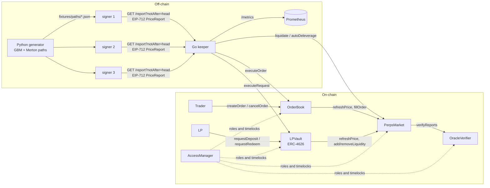

# Oracle-Based Perpetuals Engine with a Go Keeper and Signer Network

A GMX-v2-style isolated perpetuals market. Keepers settle two-step orders with EIP-712 median price reports from a
3-signer set. The market has velocity funding, utilisation borrow fees, quadratic price impact, liquidations and
auto-deleveraging, and LP solvency is fuzzed along GBM and jump-diffusion price paths.

[](https://github.com/monzon1985/blockchain/actions/workflows/20-oracle-perps-engine.yml)
[](../../LICENSE)


> Technical demonstration. Nothing here has been audited, deployed with real funds or used by anyone. Derivatives
> are a regulated activity; this code is not a compliant financial product.

## What's interesting here

- **Economic properties are fuzzed, and the fuzzing is mutation-tested.** 9 stateful invariants hold over 8,192
  Foundry calls per campaign (25,600 in CI) and a 20,000-call Medusa campaign that skips up to a week between
  keeper actions. The solvency invariant accrues funding and borrow fees, closes every position and redeems every
  LP share after each call, and checks every payout against an independent model of the capped PnL, fees, impact
  and payout backstop. Seven mutants of the settlement code (double profit, flipped funding sign, no profit cap,
  half borrow fee, a loosened impact cap and two backstop variants) all fail that invariant.
- **The payout model found two real bugs.** The per-settlement payout backstop cut gains correctly but also
  overwrote debts: a haircut winner's funding owed (found by the Foundry campaign) and a haircut loser's realised
  loss (found by Medusa after 42 days without a keeper). Both are fixed, and the Medusa sequence is committed as a
  regression test (DESIGN.md §7, §10).
- **Latency arbitrage is closed everywhere a price is read.** Orders, LP deposits and redemptions (an asynchronous
  ERC-4626 vault) settle only with reports **strictly newer** than the request; liquidations and ADL need reports
  newer than the position's last update. Out-of-gas settlements revert the keeper transaction instead of cancelling
  the request: gas sweeps of 551 limits (order fill) and 351 limits (LP redemption) show every outcome is either
  "settled" or "still pending".
- **A Go keeper network runs the exchange, not a script.** It keeps settling with one faulty signer out of three
  (nine fault types tested, from a skewed clock to an echoed report), asks signers for reports dated at the chain
  head (nodes simulate against it), verifies ERC-1271 contract signers, and replaces transactions that are never
  mined. An integration test spawns anvil (1 s blocks), 3 signer processes and the keeper process, and settles an
  LP deposit, 5 orders (including a take-profit), a liquidation, ADL and a full LP exit in about two minutes.
- **169 Foundry tests, 100 % line and 93.0 % branch coverage** of `src/`, 43 Go test functions
  (109 cases with subtests and fuzz seeds), 23 pytest tests, and a deterministic replay of 6 Python-generated paths
  whose LP PnL, funding, liquidation and ADL figures are pinned by assertions.

## Overview

A perpetual future lets traders hold leveraged long or short exposure without expiry. In an oracle-priced design
(GMX v2, Synthetix perps) there is no order book of counterparties: LPs deposit into a pool that takes the other
side of every trade, trades fill at an oracle price, and fees, funding and price impact compensate LPs for the risk.

That design is hard to get right for three reasons:

1. **The pool must stay solvent under any price path.** Trader profits, funding credits and bad debt all hit the
   pool, and the order in which positions close changes what each one can be paid.
2. **An oracle price is public before it is on-chain.** Anyone who can act on a price they have already seen
   (a trader, an LP, or a keeper) can extract value from everyone else.
3. **Fees must not be gameable.** Price impact paid on the way in must never be recoverable on the way out.

This project implements the full stack (market, order book, async LP vault, oracle verifier, Go keeper and
signers, and a Python path generator) and treats those three properties as the test plan.

## Architecture



| Component | Responsibility | Key external calls |
|---|---|---|
| `PerpsMarket` | Positions, pool accounting, funding/borrow accrual, price impact and its distribution to LPs, liquidation, ADL, LP pool value | `OracleVerifier.verifyReports`, collateral `SafeERC20` transfers |
| `OrderBook` | Two-step orders (market, limit, take-profit, stop-loss), escrow, keeper settlement with try/catch | `PerpsMarket.refreshPrice`, `PerpsMarket.fillOrder` |
| `LPVault` | ERC-4626 share token priced at pool value; asynchronous deposits and redemptions | `PerpsMarket.refreshPrice`, `addLiquidity`, `removeLiquidity`, `poolValue` |
| `OracleVerifier` | EIP-712 report verification, quorum, median, 50 bps spread, 60 s age, timelocked signer rotation | `SignatureChecker` (ECDSA or ERC-1271) |
| `PerpMath` | PnL, quadratic impact, closed-form funding integral, borrow rate | — |
| `keeper/cmd/signer` | Serves signed reports of a deterministic path over HTTP, dated at `min(now, notAfter)`; can sign for an ERC-1271 wallet | — |
| `keeper/cmd/keeper` | Discovers orders, requests and positions; filters and aggregates reports exactly as the verifier will judge them; submits settlements, liquidations, ADL; replaces stuck transactions | JSON-RPC (`eth_call` of `verifyReports` and `isValidSignature`), signer HTTP |
| `sim/perps_sim` | Seeded GBM and Merton jump-diffusion paths, byte-reproducible across OSes | — |

`PerpsMarket` deploys `OrderBook` and `LPVault` in its constructor, so every cross-component address is immutable.
See [docs/DESIGN.md](docs/DESIGN.md) for the arithmetic.

## Roles and trust assumptions

| Role (AccessManager) | Functions | Delay | A compromised holder can… |
|---|---|---|---|
| `KEEPER` | `executeOrder`, `executeRequest`, `liquidate`, `autoDeleverage` | none | delay or censor settlement; pick which profitable position on a net-profitable side to deleverage; choose among valid batches within the 60 s window. It cannot use a price older than a request, raise the PnL-to-pool factor through ADL, or force cancellations by under-supplying gas |
| `RISK_ADMIN` | `setRiskParams` | 1 day | change parameters within hard bounds after a public delay: fees ≤ 1 %, ordered margins and PnL factors, `positiveImpact ≤ negativeImpact`, and ceilings of about 10x the defaults on borrow (≤ 500 % APR), funding (≤ 1 %/h, velocity ≤ 30 %/day²), negative impact (≤ $5,000 per $1M of skew), minimum execution fee (≤ $10) and minimum collateral (≤ $1,000) |
| `ORACLE_ADMIN` | `setSigners`, `setReportLimits` | 1 day | rotate to a malicious signer set, visible a day in advance |
| `GUARDIAN` | `setPaused` | none | block new increase orders and deposits (never closes, cancels, liquidations or redemptions) |
| AccessManager admin (`GOVERNOR`) | role grants, function remaps, authority changes | 1 day | everything above, but only through operations scheduled a day ahead: the admin role itself carries the 1-day execution delay, so it cannot grant itself `ORACLE_ADMIN` and rotate signers in the next block (`test_admin_cannotRotateSignersInLessThanADay`). Production would set `GOVERNOR` to a multisig |
| Oracle signers | sign reports off-chain | — | one of three: nothing beyond ±50 bps, and the keeper drops its report whatever the fault; two of three: arbitrary prices (the core oracle assumption) |

## Invariants

Each is checked after every call of the Foundry campaign
([`PerpsInvariants.t.sol`](contracts/test/invariant/PerpsInvariants.t.sol)) and as a Medusa property
([`PerpsMedusa.sol`](contracts/test/medusa/PerpsMedusa.sol)), with the handler in
[`PerpsHandler.sol`](contracts/test/invariant/PerpsHandler.sol).

1. **Solvency, with correct payouts.** After accruing funding, borrow fees and the impact-pool distribution to now,
   every open position can be closed at the current price, each close pays exactly what an independent model of
   the capped PnL, funding, fees, impact, payout backstop and zero floor predicts (and forfeits exactly the predicted
   haircut), and all LP shares can then be redeemed from what is left. The handler performs the closes for real and
   reverts (`invariant_I1_solvency_closeAllThenRedeemAll`).
2. **Token conservation.** Each custody contract holds exactly the sum of its buckets: market = pool + impact
   pool + collateral, order book = escrow, vault = escrowed assets and shares (`invariant_I2_tokenConservation`).
3. **Open interest equals the sum of positions**, for USD size, index tokens, collateral and both entry-index sums
   (`invariant_I3_openInterestEqualsSumOfPositions`).
4. **Counter bookkeeping.** `poolAmount` and `impactPoolAmount` reconcile exactly with the cumulative flow
   counters, including the impact pool handed to LPs (`invariant_I4_feeConservation_counters`). This catches a
   settlement path that forgets a counter; I1 and I5 are the economic checks.
5. **Fee conservation, external.** Tokens that traders and LPs moved across the system boundary reconcile with
   positions, escrows, pools and keeper income (`invariant_I5_feeConservation_externalFlows`).
6. **No free round trips.** Opening and closing in the same block at the same oracle price never returns the
   collateral, whatever the skew and impact pool (`invariant_I6_noFreeRoundTrips`,
   `testFuzz_roundTrip_sameBlockIsNeverProfitable`, `testFuzz_roundTrip_splitExitIsNeverProfitable`).
7. **No latency arbitrage.** No order is ever filled with reports that do not postdate it (`invariant_I7_noStaleFills`,
   `testFuzz_latency_reportsBeforeOrderAlwaysRejected`).
8. **Monotonic indices and caps.** Borrow indices never decrease; open interest never exceeds the hard caps, which
   the campaigns set to $1.2M per side so that they, and not only the reserve cap, bind
   (`invariant_I8_monotonicIndicesAndCaps`).
9. **ADL lowers the PnL-to-pool factor.** Every successful auto-deleverage leaves the factor strictly lower
   (`invariant_I9_adlLowersPnlFactor`); the market also enforces it.

## Security considerations

The full threat model, with OWASP Smart Contract Top 10 (2026) classes, is in
[docs/THREAT_MODEL.md](docs/THREAT_MODEL.md). In short:

- **Signer compromise (SC03)** is bounded by the median and the 50 bps spread. Replay is rejected across chains,
  deployments and markets, and bounded in time by the 60 s report age and the rule that reports must be strictly
  newer than the request they settle.
- **One faulty signer cannot halt settlement.** The keeper checks each report against the verifier's rules at the
  latest block (membership, market, a timestamp no later than the head and fresh enough for inclusion, `v ∈ {27,
  28}` and low `s`, ERC-1271 through `eth_call`), keeps one report per signer, and submits the best in-band batch
  that the deployed verifier accepts in an `eth_call`.
- **Keeper censorship, delay or outage.** Owners recover escrow after `orderTimeout`. A keeper outage can create
  bad debt; the payout backstop keeps the pool solvent, and LPs absorb the loss. A transaction that is never mined
  is replaced with the same nonce and higher fees instead of stalling the keeper.
- **Oracle latency arbitrage (SC03).** Every price-dependent action is two-step with strictly newer reports,
  including LP entry and exit.
- **Price-impact manipulation (SC02).** Impact is a potential function of the squared imbalance with
  `positive ≤ negative` factors, so closed loops cannot earn impact. A symmetric impact cap would reintroduce a
  split-exit exploit and is deliberately absent. Negative impact that is never paid back flows to the LPs: each
  accrual moves `min(dt, 7 days) / 7 days` of the impact pool into the LP pool.
- **Governance.** Risk parameters have hard ceilings, and every governance path, the AccessManager admin's included,
  takes a public 1-day delay.
- **Static analysis.** Slither and the `forge build --deny warnings` lint gate report nothing untriaged; see
  [docs/STATIC_ANALYSIS.md](docs/STATIC_ANALYSIS.md).

**Known limitations:** pending fees and uncollectible losses count in LP pricing until realised; funding credits
are fronted by the pool; ADL ranking is done off-chain by keepers (the market only guarantees the factor falls);
deeply underwater liquidations pay no keeper reward; collateral must be a plain 18-decimal ERC-20.

## Design decisions and trade-offs

| Decision | Why | Cost |
|---|---|---|
| Three contracts (market, order book, async vault) instead of one | The single-contract market was 29.9 KB; the split gives a 23.8 KB market under EIP-170 without via-IR, and clean custody boundaries | Two extra external calls per settlement |
| Asynchronous LP entry (ERC-7540 style) with synchronous ERC-4626 functions disabled (`max*` = 0) | A synchronous deposit priced at the last on-chain price is a free option for anyone watching the off-chain price | LP deposits need a keeper round trip |
| Owner cancellation only after `orderTimeout`, for every order type | An order cancellable at will is a free option on the next report | Slower cancellation of resting orders |
| `PriceReport` carries no nonce and no deadline (deviation from the repository standard §3) | Reports are price observations, not authorisations: many requests may legitimately settle with the same report. Freshness comes from the 60 s maximum age and from requiring reports strictly newer than the request | Within 60 s one batch can settle several requests created before it |
| Single signed funding index with the pool as counterparty (Synthetix perps v2) | O(1) aggregate funding in pool value | Receivers are paid before payers settle; bounded by the backstop |
| Pro-rata profit cap plus a per-settlement payout backstop that cuts only gains | The cap alone cannot bound within-side netting or funding fronted for defaulted payers (found by Medusa) | Extreme settlements can be haircut; recorded in `MarketStats.haircuts` |
| Impact settled in collateral, not in execution price | Keeps `sizeInTokens = size / price` exact and the round-trip argument simple | Diverges from GMX v2's price-adjusted fills |
| Positive impact capped by the impact pool; negative impact uncapped; the pool decays to LPs (each accrual moves `min(dt, 7 days) / 7 days` of it) | Any magnitude cap breaks path independence (DESIGN.md §3); without the decay half of all negative impact would be stranded | Very large skew-increasing orders pay steep impact; ~8k gas per settlement while the impact pool is non-empty |
| Keeper-ranked ADL (GMX-style) with on-chain threshold, sizing and a "factor must fall" check | An on-chain "most profitable" check needs an unbounded scan | Ranking fairness among eligible positions trusts the keeper |
| PnL-to-pool factor measured against `poolAmount` | Pool value already nets trader PnL, so a factor over it would be circular; GMX v2 also uses the pool value without PnL | The spec's "45 % of pool value" is read as GMX's pool value without PnL (DESIGN.md §7) |
| Keepers ask signers for reports dated at the latest block (`notAfter`) | Nodes simulate against the head, whose timestamp lags wall time; a report dated "now" is from the verifier's future | Signers must honour backdating up to 60 s (refused beyond) |
| Solady `fullMulDiv` in `PerpMath` | 512-bit intermediates for fewer gas than OZ `Math.mulDiv` | One more dependency |
| Metadata-free bytecode (`cbor_metadata = false`) | Go bindings embed bytecode; they must regenerate byte-for-byte on Linux CI | No on-chain metadata hash |

## Testing

```bash
cd contracts && forge soldeer install && forge fmt --check && forge build --deny warnings && forge test
forge snapshot --check --match-contract GasBench
medusa fuzz --config medusa.json --timeout 600
cd ../sim && uv sync && uv run pytest && uv run python -m perps_sim.gen_paths --check
cd ../keeper && go generate ./... && CGO_ENABLED=0 go vet ./... && CGO_ENABLED=0 go test -count=1 ./...
CGO_ENABLED=0 go test -count=1 -tags integration -timeout 15m ./integration/...
```

CI additionally runs `forge coverage --no-match-contract GasBench` (fails below 90 % lines), the Foundry suite
under the CI profile, Slither, `ruff`, `gofmt`, 30 s of native fuzzing per Go fuzz target, `go test -race`, and a
check that `go generate` reproduces the committed bindings. `vm.snapshotGas*` values are compared with
`snapshots/GasBench.json` rather than rewritten (`gas_snapshot_check = true`); regenerate them deliberately with
`FORGE_SNAPSHOT_CHECK=false forge test --mc GasBench`.

| Suite | Kind | Tests |
|---|---|---|
| `OracleVerifier.t.sol` | unit + fuzz (replay, stale, duplicate, too few, spread, ERC-1271, malleability, timelocked rotation) | 33 |
| `PerpMath.t.sol` | unit + bounded fuzz (PnL rounding, impact round trips and closed loops, funding additivity) | 18 |
| `PerpsMarket.t.sol` | exact-arithmetic mechanics (fees, impact and its distribution, decreases, triggers, caps, governance bounds, pause, ADL with side netting, every `InsufficientCollateral` site) | 36 |
| `PerpsMarketRisk.t.sol` | funding, borrow, liquidation, bad debt, ADL, payout backstop (incl. the two backstop regressions) | 18 |
| `OrderBook.t.sol` | order lifecycle, latency guard, out-of-gas sweep (551 gas limits) | 13 |
| `LPVault.t.sol` | async ERC-4626 flows, slippage, free liquidity, inflation attempt, out-of-gas sweep (351 gas limits) | 15 |
| `EconomicFuzz.t.sol` | same-block and split-exit round trips, latency, liquidation vs view | 4 |
| `MedusaRegressions.t.sol` | Medusa counterexamples replayed call for call | 1 |
| `PerpsInvariants.t.sol` | 9 stateful invariants, 15 handler actions | 1 suite / 9 invariants |
| `Replay.t.sol` | deterministic replay of the 6 fixture paths, with pinned summaries | 7 |
| `GasBench.t.sol` | gas benchmarks | 14 |
| `Deploy.t.sol` | deployment script, governance timelocks, parity with `test/fixtures/deployment.json` | 9 |
| **Foundry total** | | **169** |
| Medusa `PerpsMedusa` | 9 properties, 15 actions, ≤ 7-day timestamp jumps | 20,000-call campaign |
| Go (`internal/...`) | EIP-712 differential vs geth `apitypes`, aggregation and fallbacks, signer HTTP (incl. `notAfter`), retry, keystores, deployment parity, in-process engine on geth's simulated backend with signer clocks ahead of the head (faulty signers, ERC-1271 signer, lost transactions), 2 native fuzz targets | 43 functions / 109 cases |
| Go integration | anvil (1 s blocks) + 3 signer processes + keeper process | 1 (~2 min) |
| pytest (`sim/`) | statistics, golden values, Poisson/polar samplers, fixture check | 23 |

**Coverage** (`forge coverage`, production code only, GasBench excluded): 100.00 % lines (674/674), 99.74 %
statements (773/775), 93.01 % branches (213/229), 100 % functions (96/96).

**Fuzz and invariant settings.** Default profile: 1,000 fuzz runs; invariants 128 runs × depth 64 (8,192 calls),
`fail_on_revert = true`, seed `0x5eed`. CI profile: 5,000 runs; 256 × 100 (25,600 calls). Medusa: 4 workers,
20,000 calls, sequences of 60, block timestamp jumps up to 604,800 s. The campaigns use hard open-interest caps of
$1.2M per side (`InvariantParams`), every other parameter at its default.

**Mutation check of the stateful suite.** Each mutant below was applied to a copy of `src/` and
`forge test --mc PerpsInvariantTest` (default profile) was run; every one fails invariant I1. The two ADL and
impact-distribution mutants are killed by unit and replay tests instead.

| Mutant (in `PerpsMarket`) | Killed by |
|---|---|
| Every profit paid twice (`_settle`) | I1 (payout model) |
| Funding sign flipped (`_pendingFees`) | I1 |
| Pro-rata profit cap removed (`_capProfit`) | I1 |
| Borrow fee halved (`_pendingFees`) | I1 |
| Positive impact allowed up to twice the impact pool (`_cappedImpact`) | I1 |
| Backstop overwrites funding owed | I1 |
| Backstop overwrites a realised loss | I1 |
| ADL factor check removed | `test_revert_adl_winnerOnNetLosingSideWouldRaiseFactor` |
| Impact-pool distribution removed | `ReplayTest` (dust and pinned summaries) |

On the Go side, removing each keeper defence (the `notAfter` request, the order guard, the time window, signer
deduplication, the net-profitable-side ADL filter, transaction replacement, ERC-1271 verification) makes its
regression test fail.

**Replay over the Python fixtures** (1-day paths at 5-minute steps; a scripted whale, momentum trader,
contrarian and a scalper using take-profit/stop-loss orders, plus a second LP; output of `forge test --mc
ReplayTest -vv`, and each row is pinned by an assertion). After the last step every position closes, a week passes
so the impact pool reaches the LPs, and both LPs redeem everything; the market then holds at most 2 wei.

| Path | Move | LP PnL | Funding paid / received | Liquidations | ADL | Bad debt | Max PnL factor after keeper | Impact pool to LPs |
|---|---|---|---|---|---|---|---|---|
| `gbm_calm` | −2.56 % | +0.99 % | $10 / $9 | 0 | 0 | $0 | 0.47 % | $190 |
| `gbm_volatile` | −1.51 % | +0.80 % | $117 / $114 | 0 | 0 | $0 | 2.57 % | $851 |
| `gbm_rally` | +11.74 % | −5.46 % | $63 / $58 | 0 | 0 | $0 | 7.06 % | $400 |
| `gbm_selloff` | −15.07 % | +5.55 % | $212 / $98 | 1 | 0 | $0 | 1.76 % | $294 |
| `merton_crash` | −12.47 % | +5.14 % | $319 / $47 | 1 | 0 | $603 | 1.71 % | $372 |
| `merton_squeeze` | +89.55 % | −51.43 % | $507 / $117 | 3 | 1 | $28,818 | 40.29 % | $228 |

Custody conservation holds at each of the 288 steps of every path.

## Gas

`vm.snapshotGasLastFrame` values from [`snapshots/GasBench.json`](contracts/snapshots/GasBench.json) (measured
call only; `.gas-snapshot` guards the test-level totals and the JSON is compared, not rewritten, in CI):

| Operation | Gas |
|---|---|
| `oracle.verifyReports` (2 signatures) | 32,513 |
| `oracle.verifyReports` (3 signatures) | 45,142 |
| `orderBook.createOrder` (market increase) | 185,041 |
| `orderBook.executeOrder` (open position) | 354,954 |
| `orderBook.executeOrder` (increase, settles fees) | 300,874 |
| `orderBook.executeOrder` (take-profit) | 324,300 |
| `orderBook.executeOrder` (full close) | 326,074 |
| `orderBook.executeOrder` (fill fails, order cancelled) | 385,090 |
| `orderBook.cancelOrder` | 74,577 |
| `market.liquidate` | 349,051 |
| `market.autoDeleverage` | 311,484 |
| `vault.requestDeposit` | 160,015 |
| `vault.executeRequest` (deposit) | 278,476 |
| `vault.executeRequest` (redeem) | 281,278 |

Baselines: each extra signature costs 12,629 gas (2 → 3 reports), so oracle verification is 13 % of opening a
position. Handing the impact pool to the LPs at each accrual (one more storage bucket, a counter and an event)
raised the settlement benchmarks by 7.9k to 13k gas while the impact pool is non-empty: open position 347,089 →
354,954, auto-deleverage 298,792 → 311,484. A failed fill costs 30k more than a successful open, because the whole
fill runs before the revert is caught and the escrow is refunded; keepers are still paid. The cumulative flow
counters that back invariants I4/I5 are packed two per slot (8 slots for 16 counters).

## Getting started

**Prerequisites:** Foundry 1.8.3, Medusa 1.5.1 with crytic-compile 0.4.2, Go 1.27, Python 3.12 with uv ≥ 0.12,
and (optionally) Slither 0.11.6.

```bash
# contracts
cd contracts
forge soldeer install
forge build
forge test                                  # 169 tests
forge test --mc ReplayTest -vv              # replay table above

# path generator
cd ../sim
uv sync
uv run python -m perps_sim.gen_paths        # rewrites contracts/test/fixtures/paths/*.json

# keeper and signers (bindings are regenerated from contracts/out); binaries land in keeper/bin/ (git-ignored)
cd ../keeper
go generate ./...
CGO_ENABLED=0 go build -o bin/ ./cmd/...
```

**Local demo.** The integration test is the demo: it starts anvil on a free port, deploys everything with fresh
keys, writes encrypted keystores, launches three signers and the keeper, and narrates the session.

```bash
cd keeper
go test -count=1 -tags integration -timeout 15m -v ./integration/...
```

**Running the pieces by hand** (from `keeper/`, after the build above; every port is chosen at runtime). This
sequence was run end to end, and the keeper settled an LP deposit through it.

```bash
# 1. Encrypted keystores (omit --unsafe-password to be prompted instead).
mkdir -p ks && printf 'demo-password' > ks/pw
for n in deployer keeper s1 s2 s3; do cast wallet new ks "$n" --unsafe-password demo-password; done
addr() { cast wallet address --keystore "ks/$1" --password-file ks/pw; }

# 2. A local chain mining a block every second, on a free port.
anvil --port 0 --block-time 1 > anvil.log 2>&1 &
sleep 2; RPC=http://$(grep -oE 'Listening on [0-9.]+:[0-9]+' anvil.log | awk '{print $3}')
for n in deployer keeper; do cast rpc anvil_setBalance "$(addr $n)" 0x3635C9ADC5DEA00000 --rpc-url "$RPC"; done

# 3. Deploy (a MockUSD collateral is created on chain 31337); note the printed oracle and market addresses.
(cd ../contracts && SIGNERS="$(addr s1),$(addr s2),$(addr s3)" KEEPERS="$(addr keeper)" \
  forge script script/Deploy.s.sol --rpc-url "$RPC" --keystore ../keeper/ks/deployer \
  --password-file ../keeper/ks/pw --broadcast)
ORACLE=0x...; MARKET=0x...

# 4. Three signers on the same path and the same start time, then the keeper.
START=$(date +%s)
for i in 1 2 3; do
  bin/signer -keystore ks/s$i -password-file ks/pw -path ../contracts/test/fixtures/paths/gbm_calm.json \
    -verifier "$ORACLE" -start "$START" -listen 127.0.0.1:0 -addr-file s$i.addr &
done
sleep 2
bin/keeper -rpc "$RPC" -market "$MARKET" -signers "http://$(cat s1.addr),http://$(cat s2.addr),http://$(cat s3.addr)" \
  -keystore ks/keeper -password-file ks/pw -metrics-listen 127.0.0.1:0 -metrics-addr-file keeper.addr &
```

Keys are only read from encrypted keystores (`-keystore` + `-password-file`). All signers of a set need the same
`-start`, or each anchors the path at its own start time and they quote different steps. Other flags: the signer's
`-account` (sign for an ERC-1271 wallet) and `-max-backdate`, and the keeper's `-freshness-margin`,
`-receipt-timeout` and `-max-replacements`; `-h` lists them all. Stop the background processes by PID when done.

## Project structure

```
contracts/
  src/                    PerpsMarket, OrderBook, LPVault, OracleVerifier, libraries/PerpMath, interfaces/
  script/                 PerpsDeployment (shared deployment library), Deploy.s.sol (keystore-based)
  test/unit/              unit and bounded-fuzz suites, deployment and governance tests
  test/fuzz/              economic fuzz properties, Medusa regressions
  test/invariant/         PerpsHandler (shared with Medusa) and the invariant suite
  test/medusa/            PerpsMedusa harness
  test/replay/            fixture replay
  test/mocks/             MockUSD, MockERC1271Signer (also bound in Go)
  test/fixtures/paths/    Python-generated price paths (committed, checked in CI)
  test/fixtures/deployment.json  deployment configuration both deployers are checked against
  medusa.json, slither.config.json, foundry.toml, soldeer.lock, .gas-snapshot, snapshots/
keeper/
  cmd/signer, cmd/keeper  service binaries
  internal/report         EIP-712 reports, verification, deduplication, median/spread candidate batches
  internal/keeper         engine (discovery, report filtering, settlement, liquidation, ADL, replacements, metrics)
  internal/signer         signer HTTP service
  internal/pricepath      fixture loading and time-to-step mapping
  internal/deploy         Go mirror of PerpsDeployment
  internal/bindings       abigen bindings (generated, committed)
  internal/{retry,keys,service,tools/abiextract}
  integration/            anvil + processes end-to-end test (build tag `integration`)
sim/
  perps_sim/              GBM and Merton models, fixture writer and checker
  tests/
docs/                     DESIGN.md, THREAT_MODEL.md, STATIC_ANALYSIS.md
```

## Scope notes and future work

- **Single isolated market, stable collateral only.** No cross-margin, no multi-asset pools, no swap-based
  collateral. The collateral must have 18 decimals (6-decimal stables need a scaling adapter).
- **Impact is settled in collateral**, not by adjusting the execution price as GMX v2 does; no impact on
  liquidations and ADL.
- **ADL candidates are ranked off-chain.** An on-chain verifiable ranking (e.g. a sorted structure or a Merkle
  commitment of PnL ranks) is future work.
- **Keeper decentralisation.** Execution is permissioned to limit report optionality; a permissionless mode would
  need a commit/reveal or latest-report rule.
- **Signers serve a deterministic path**, not live market data; wiring them to exchange feeds is outside the scope
  of a reproducible test.
- **Pending fees and losses in LP pricing** are not haircut for collectability (same as GMX v2).

## References

- GMX v2 synthetics: position model (`sizeInUsd`/`sizeInTokens`), two-step orders, quadratic price impact with
  separate positive/negative factors and position impact pool distribution, pnl-to-pool caps and ADL.
  <https://github.com/gmx-io/gmx-synthetics>
- Synthetix Perps v2 / v3: funding-rate velocity model and the pool as counterparty to the skew.
  <https://sips.synthetix.io/sips/sip-279/>
- EIP-712 typed structured data hashing and signing. <https://eips.ethereum.org/EIPS/eip-712>
- ERC-4626 tokenized vaults and ERC-7540 asynchronous vaults. <https://eips.ethereum.org/EIPS/eip-4626>,
  <https://eips.ethereum.org/EIPS/eip-7540>
- ERC-1271 contract signatures; EIP-1559 fee replacement; EIP-170 / EIP-3860 code and initcode size limits;
  EIP-7825 transaction gas cap.
- OpenZeppelin Contracts 5.7 (AccessManager, EIP712, SignatureChecker, ERC4626, ReentrancyGuardTransient,
  SafeCast); Solady 0.1.26 (FixedPointMathLib).
- Pull-oracle signed reports in production systems: Chainlink Data Streams, Pyth, Chaos Labs Edge.
- R. C. Merton, *Option pricing when underlying stock returns are discontinuous*, J. Financial Economics, 1976
  (jump-diffusion); G. Marsaglia and T. A. Bray, *A convenient method for generating normal variables*, SIAM
  Review, 1964 (polar method).
- Trail of Bits Medusa and Slither; OWASP Smart Contract Top 10 (2026). <https://scs.owasp.org/sctop10/>

## License

MIT, see the repository [LICENSE](../../LICENSE).
