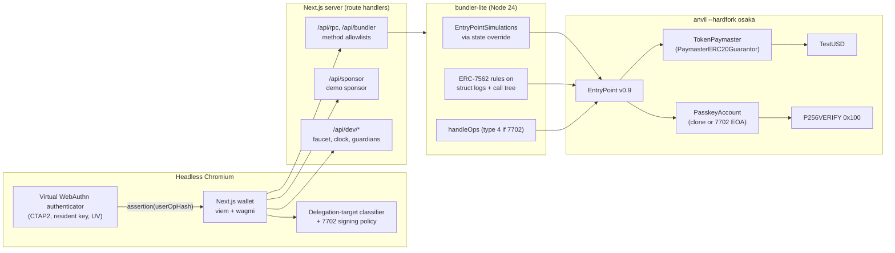

# Passkey-First Smart Account: EIP-7702 + ERC-4337 v0.9 + P-256, with a Next.js Wallet

A WebAuthn passkey account that works both as an EIP-7702 delegate for an existing EOA and as an ERC-4337 v0.9 account,
with guardian recovery, an ERC-20 paymaster and a minimal local bundler. Its Next.js wallet is tested end to end through
Chromium's virtual WebAuthn authenticator.

[](https://github.com/monzon1985/blockchain/actions/workflows/21-passkey-smart-account.yml)

-363636.svg)


> Technical demonstration. Nothing in this repository has been audited or deployed with real funds; TestUSD is a
> valueless local test token.

## What's interesting here

- **Passkeys tested end to end, offline and headless.** Two Playwright tests drive real WebAuthn ceremonies (CTAP2
  virtual authenticator over CDP, resident keys, user verification) through the wallet, bundler-lite, EntryPoint v0.9
  and the EIP-7951 P-256 precompile on `anvil --hardfork osaka`: gasless deployment, a batch whose gas is paid in an
  ERC-20, 2-of-3 guardians, an owner veto, a timelocked recovery, a delegation to a sweeper refused before signing, and a
  gas-less EIP-7702 upgrade. No hosted bundler, no device.
- **A freeze that moves no value.** A frozen account validates no user operation at all, the veto included, so a thief
  holding the passkey cannot even spend the balance as gas; the owner vetoes through a relayed signature instead. Each
  guardian freezes once per recovery epoch, so one compromised guardian cannot lock the account forever. Both are
  stateful invariants (INV-6, INV-10) with an attacker action that submits vetoes with extreme gas values.
- **P-256 on both paths, measured.** `validateUserOp` with a WebAuthn assertion costs **59,029 gas** through the EIP-7951
  precompile versus **300,530 gas** through OpenZeppelin's pure-Solidity fallback (5.1x). The 164 unit, hazard and
  storage-rule tests also pass on a Prague EVM, where the precompile does not exist.
- **A bundler that enforces ERC-7562 on real traces.** bundler-lite simulates with EntryPointSimulations through a state
  override, applies the opcode rules (OP-011/012/031/041/061/062) to `debug_traceCall` struct logs, the EntryPoint
  access rules (OP-052/053/054) to the call tree, and rejects operations outside their validity window (-32503).
  Validation storage rules are proven separately in Foundry with `vm.startStateDiffRecording`.
- **A pre-signing sweeper check for 7702 authorizations.** A path-sensitive bytecode classifier that reads caller checks
  (EOA itself, trusted EntryPoint, hardcoded third party, storage) flags **12/12** drainer fixtures, open and
  attacker-owned executors, beacon proxies, value forwarding and `msg.sender` drains included, with **0/8** benign
  contracts rated `malicious`. The wallet refuses anything not rated `safe`: 12/12 drainers and 1/8 benign contracts.
- **171 Foundry tests plus 10 stateful invariants** in 2 campaigns (8 fuzz tests, 1,024 fuzz runs in CI), **95.45%**
  line coverage of `src/` (CI gate: 90%), **123** vitest tests (20 of them integration tests against anvil).

## Overview

Passkeys (WebAuthn P-256 credentials) are the most usable key a wallet can offer: synced by the platform, phishing
resistant, no seed phrase. Using them on Ethereum raises five problems that this project solves together:

1. **Verification cost.** P-256 in the EVM costs ~300k gas in Solidity. Osaka's EIP-7951 precompile at `0x100` brings
   it to ~6.9k for the curve operation. The account uses the precompile when present and falls back otherwise.
2. **Two deployment models.** New users get a counterfactual ERC-4337 account (CREATE2 clone); existing users keep
   their address by delegating their EOA with EIP-7702. One implementation serves both, which makes the 7702 hazards
   (initialization, storage layout, replay) first-class design constraints rather than afterthoughts.
3. **Gas.** A fresh passkey account has no ETH. The paymaster charges gas in an ERC-20 and, for the very first
   operation, fronts the cost under a sponsor's signature carried in the EntryPoint v0.9 `paymasterSignature` field,
   so the approval can ride inside that same operation.
4. **Loss of the device.** Guardians (2-of-3 by default) can replace the passkey after a 48-hour timelock, the owner can
   veto, and any guardian can freeze the account for 7 days.
5. **Testing it honestly.** Browsers, authenticators, bundlers and precompiles are all involved. Everything here runs
   locally: a virtual authenticator, anvil (osaka), EntryPoint v0.9 built from source, and a bundler written for this
   repository.

## Architecture



| Component | Responsibility | Key external calls |
|---|---|---|
| `contracts/src/PasskeyAccount.sol` | OZ `Account` + ERC-7821 batch executor. Signers: WebAuthn passkey (EIP-7951, OZ fallback) and, in 7702 mode, the EOA key (`SignerEIP7702`). ERC-1271 via ERC-7739. Guardians, recovery, freeze, relayed veto. ERC-7201 storage. | P-256 precompile `0x100`, SHA-256 `0x02`, arbitrary calls in `execute` |
| `contracts/src/PasskeyAccountFactory.sol` | CREATE2 clones; salt commits to all init params; initializes in the same call | `Clones.cloneDeterministic`, `initialize` |
| `contracts/src/TokenPaymaster.sol` | OZ 5.7 `PaymasterERC20Guarantor`: user-funded mode, sponsor-guaranteed first op, postOp bounds, deposit/stake admin | TestUSD `transferFrom`/`transfer`, EntryPoint stake manager |
| `contracts/src/TestUSD.sol` | 6-decimal test token with an owner faucet | - |
| `bundler/src/bundler.ts` | `eth_sendUserOperation`, `eth_estimateUserOperationGas`, `eth_getUserOperationReceipt`, `eth_getUserOperationByHash`, `eth_supportedEntryPoints`, `eth_chainId`; validity windows (-32503) | `eth_call`/`debug_traceCall` with overrides, `handleOps` |
| `bundler/src/validation/opcodeRules.ts` | Frame attribution, ERC-7562 opcode rules on struct logs, EntryPoint access rules on the call tree | - |
| `bundler/src/classifier/` | Disassembler + bounded path-sensitive abstract interpreter; flags sweeper patterns, reads caller guards | - (pure; shared with the wallet) |
| `bundler/src/policy/authorization.ts` | Wallet rule: never chainId 0, only the connected chain, only `safe` targets | - |
| `web/` | Next.js 16 wallet: create passkeys, deploy or 7702-upgrade, ERC-20-paid batches, guardians, recovery | `/api/*` route handlers |
| `web/scripts/e2e-chain.mjs` | Starts anvil (osaka) on a random port, deploys EntryPoint v0.9 and the contracts, starts bundler-lite | - |

## Roles and trust assumptions

| Role | Can | Cannot | If compromised |
|---|---|---|---|
| Owner: passkey (and EOA key in 7702 mode) | Execute, rotate the passkey, manage guardians, veto recoveries (relayed while frozen), freeze | Move any value while frozen, gas included | Funds at risk until a guardian freezes; then a stalemate (the thief vetoes, guardians re-freeze), not a theft. In 7702 mode the EOA key stays the root. |
| Guardians (EOA or ERC-1271), as a threshold | Approve a recovery to a passkey of their choice; after 48 h anyone executes it | Skip the 48 h timelock, override a veto | **Account takeover unless the owner vetoes within 48 h** (the owner must watch `RecoveryScheduled`). |
| A single guardian | Freeze for 7 days, once per recovery epoch | Recover alone, move funds, re-freeze in the same epoch | Liveness griefing: at most 7 days per compromised guardian and epoch; the owner then removes it. |
| Paymaster owner (`Ownable2Step`) | Price within [1, 10^7] TUSD/ETH, sponsor key, deposit/stake, token withdrawals | Touch user accounts | Paymaster funds and pricing |
| Sponsor key | Authorize guaranteed first operations (EIP-712, v0.9 paymaster signature) | Spend user funds | Paymaster fronts gas for arbitrary ops, bounded by its float and deposit |
| Bundler | Order and submit validated operations | Forge signatures or change operations | DoS only |

Guardians are therefore trusted for custody as a threshold, and the owner's veto is the only check on them. The full
model (assets, attack surface, mitigations, accepted limitations) is in [docs/threat-model.md](docs/threat-model.md).

## Invariants and properties

Stateful invariants (handler-based, ghost variables), in `contracts/test/invariant/`. Both campaigns run with
`fail_on_revert = true`: handlers pre-filter their inputs and catch only the failures they expect and count.

1. **INV-1** Funds leave the account only through operations signed by the passkey that is current at that moment:
   [`invariant_OnlyAuthorizedSignersMoveFunds`](contracts/test/invariant/AccountInvariants.t.sol).
2. **INV-2** No forged, replayed or wrong-signer operation, and no direct call or relayed veto from a stranger, is ever
   accepted: [`invariant_NoUnauthorizedExecution`](contracts/test/invariant/AccountInvariants.t.sol).
3. **INV-3** The on-chain passkey always equals the one the authorized history (rotations, executed recoveries)
   installed: [`invariant_SignerOnlyChangesThroughAuthorizedPaths`](contracts/test/invariant/AccountInvariants.t.sol).
4. **INV-4** A recovery never executes before `threshold` approvals plus 48 hours (measured independently by the
   handler): [`invariant_RecoveryTimelockRespected`](contracts/test/invariant/AccountInvariants.t.sol).
5. **INV-5** An owner veto, as a user operation or relayed, always leaves no recovery scheduled:
   [`invariant_VetoAlwaysClearsRecovery`](contracts/test/invariant/AccountInvariants.t.sol).
6. **INV-6** While frozen, no user operation executes (the veto included, whatever its gas values) and the account's ETH,
   balance plus EntryPoint deposit, never decreases:
   [`invariant_FreezeBlocksEveryOperationAndEveryWei`](contracts/test/invariant/AccountInvariants.t.sol).
7. **INV-7** The paymaster's EntryPoint deposit equals deposits minus withdrawals minus the `actualGasCost` of every
   operation it paid for, summed from `UserOperationEvent`:
   [`invariant_DepositAccounting`](contracts/test/invariant/PaymasterInvariants.t.sol).
8. **INV-8** Never under-collateralized: after every user-funded operation (griefing ones included) and every repaid
   guaranteed one, the tokens the paymaster actually kept are worth at least the operation's ETH gas cost at the price
   in force: [`invariant_NeverUndercharged`](contracts/test/invariant/PaymasterInvariants.t.sol).
9. **INV-9** The token float moves only through the charges the paymaster reports in `UserOperationSponsored` (zero for a
   guaranteed operation the sender did not repay) and admin withdrawals, and postOp never reverts:
   [`invariant_TokenConservation`](contracts/test/invariant/PaymasterInvariants.t.sol).
10. **INV-10** A guardian freezes at most once per recovery epoch:
   [`invariant_GuardianFreezesOncePerEpoch`](contracts/test/invariant/AccountInvariants.t.sol).

The paymaster ghosts come from events and from the handler's own actions, never from the balances the invariants check.
A mutation that leaks 1,000 TUSD in every postOp fails INV-8 and INV-9, and one that withdraws 1 gwei from the deposit
in postOp fails INV-7; restoring the old veto exemption fails INV-6, and removing the freeze rate limit fails INV-10.

EIP-7702 hazards ([`test/hazards/Eip7702Hazards.t.sol`](contracts/test/hazards/Eip7702Hazards.t.sol)). Each check is
written once and run twice: it passes on the fix and fails, with the hazard's own message, on a deliberately
vulnerable baseline. For H01, H02 and H05 the fix side is `PasskeyAccount` itself. The H03 and H04 pairs are protocol
demonstrations, so their fixes are tested where they live:

| # | Hazard | Fix in this repository | Where the fix is tested | Baseline that fails |
|---|---|---|---|---|
| H01 | Initialization front-running (the signed authorization is public; an attacker bundles it with `initialize`) | `initialize` only from self, the EntryPoint (EOA-signed op) or the factory; `initializeWithSig` needs the EOA's EIP-712 signature | `test_Hazard01_InitFrontRunning` | `NaiveInitAccount` (first caller wins) |
| H02 | Storage collision when re-delegating A → B | ERC-7201 namespace `passkeysa.account.v1`, no shared `Initializable` slot | `test_Hazard02_StorageCollisionOnRedelegation` | `PlainOwnerAccountB` reads A's session key as its owner |
| H03 | chainId-0 authorization replayed on another chain where the same address holds other code | Wallet policy and bundler never accept chainId 0; init signatures are chain-bound | `units.test.ts` policy tests, bundler integration (-32602), `test_Hazard03_InitSignatureIsChainBound` | Demonstration: a chainId-0 authorization delegates to a sweeper |
| H04 | `tx.origin == msg.sender` no longer means "no code" | No ORIGIN opcode in any production contract | `test_Hazard04_NoTxOriginInProductionBytecode` (bytecode scan) | `OriginGuardedVault`; the vault pair itself is a demonstration |
| H05 | ERC-1271 replay across accounts that share a passkey | ERC-7739 nested typed data / personal sign | `test_Hazard05_Erc7739ReplayAcrossAccounts` | `NaiveErc1271Account` accepts the same signature on two accounts |

ERC-7562 storage rules ([`test/erc7562/ValidationStorageRules.t.sol`](contracts/test/erc7562/ValidationStorageRules.t.sol)):
account validation touches only account storage (STO-010), factory deployment only the new sender (STO-022), the
paymaster only its own storage and token slots associated with the sender or itself (STO-031/032). The guaranteed mode
fronts the prefund from the paymaster's own float precisely so that it stays inside these rules.

## Security considerations

- **WebAuthn verification** checks `type == "webauthn.get"`, the challenge (the v0.9 EIP-712 user operation hash), UP,
  UV, BE/BS consistency, low-s and, on top of OpenZeppelin's library, the **RP id hash** stored with the passkey
  (`test_WebAuthn_WrongRpId`). The `clientDataJSON` origin is **not** checked: any origin the browser lets use the RP id,
  subdomains included, produces valid assertions (`test_WebAuthn_OriginIsNotChecked_SameRpIdFromAnotherOriginIsAccepted`).
- **A freeze stops all value movement.** A frozen account returns `validAfter = frozenUntil` for every operation, so the
  EntryPoint rejects it before any gas is paid; no `block.timestamp` is read in validation (ERC-7562 OP-011). The veto
  is not exempt: gas goes to a beneficiary the submitter picks, so an exempt veto let a thief convert the balance into
  gas (`test_Freeze_StolenPasskeyCannotSpendEthAsVetoGas`). The owner vetoes with `cancelRecoveryWithSig`, a signature
  over the current recovery epoch that anyone relays and pays for.
- **postOp griefing.** The worst case (including the EntryPoint's 10% unused-postOp-gas penalty, priced by OpenZeppelin
  5.7) is pulled before execution; `paymasterPostOpGasLimit` must lie in [60,000, 200,000]; draining the balance or
  revoking the allowance mid-operation does not hurt the paymaster (`test_Griefing_*`, INV-8).
- **7702 key supremacy.** In 7702 mode the EOA key can always send plain transactions or re-delegate. A freeze protects
  against a stolen passkey, not a stolen EOA key.
- **Compatibility consequence.** After the upgrade, verifiers that switch to ERC-1271 when an address has code
  (OpenZeppelin 5.7 `SignatureChecker`, Permit2) no longer accept raw EOA signatures; wallets must use the ERC-7739
  envelope (`test_Eip7702_EoaSignerThroughErc7739`).
- **Static analysis.** Slither 0.11.6 reports 0 results with all 102 detectors and `--fail-low`; `forge lint` is clean with
  `--deny warnings`, and `deny = "warnings"` fails the build on any compiler warning. Neither tool has a global
  exclusion: every accepted finding is suppressed inline at its site and listed in
  [docs/static-analysis.md](docs/static-analysis.md).
- Known limitations are listed in the [threat model](docs/threat-model.md#known-limitations-accepted).

## Design decisions and trade-offs

- **One implementation, two modes.** The same bytecode is the clone target and the 7702 delegate. The EntryPoint is an
  immutable constructor argument, so local deployments (EntryPoint compiled from source, non-canonical address) and
  production ones use the same code.
- **ERC-7201 everywhere, and no OpenZeppelin `Initializable`.** `Initializable` keeps its flag in a namespace shared by
  every OpenZeppelin-based implementation, which is itself a re-delegation collision. The account keeps its own flag.
- **rpIdHash binding instead of an origin string.** Browsers already scope assertions to the RP id; storing the full
  origin would break on localhost ports and cost a string comparison per validation. The price is that every
  subdomain of the RP id is trusted (see the threat model).
- **Explicit signature type byte** (`0x00` WebAuthn, `0x01` EOA) rather than length-based dispatch.
- **Frozen means no user operation at all.** The first version exempted the veto from the freeze; because gas payment is
  value, a thief could spend the balance through that exemption. The relayed veto costs the account nothing, at the
  price of needing someone to relay it during a freeze.
- **Owner veto dominates recovery, and guardians are trusted as a threshold.** A thief with the passkey can stall a
  recovery (each veto restores every guardian's freeze, so the account stays frozen), while a threshold of guardians
  wins if the owner does not veto within 48 h. One freeze per guardian per epoch keeps a single compromised guardian
  from locking the owner out forever.
- **Self-funded guarantees.** OpenZeppelin's guarantor pattern pulls the prefund from the guarantor; making the
  paymaster its own guarantor (authorized by an off-chain sponsor signature in the v0.9 `paymasterSignature`) keeps
  validation inside ERC-7562 storage rules.
- **Clones, not UUPS.** Accounts are not upgradeable; migrating means deploying a new account (or, in 7702 mode,
  re-delegating). Less code in the security path.
- **bundler-lite scope.** One operation per bundle, no reputation, no p2p mempool; it requires a staked paymaster instead
  of replaying storage rules (those are proven in Foundry). EntryPoint access (OP-052/053/054) is judged on the
  `callTracer` tree, where the callee selector and the calling entity are known. Gas is estimated from `callTracer`
  frames of `simulateHandleOp`; `preVerificationGas` prices signatures as all non-zero bytes.
- **Classifier trust model.** Code reachable only by the EOA itself (`CALLER == ADDRESS`) or by an EntryPoint (the
  canonical ones plus the one the wallet passes) counts as owner-controlled; a caller check against a hardcoded third
  party is treated as that party owning the EOA. Because the EntryPoint path is only sound if `validateUserOp` verifies
  something, a `validateUserOp` that reaches no signature primitive is itself a critical finding.
- **Measuring the fallback.** On an Osaka EVM the precompile always answers first, so `GasBench` measures the
  pure-Solidity path with a harness that swaps only the final P-256 call (`test/gas/WebAuthnSolidityP256.sol`, a
  one-line change of OpenZeppelin's library). CI additionally runs the suites on a Prague EVM for the real fallback.
- **Shared, dependency-free TypeScript.** The classifier, signing policy and WebAuthn byte helpers live once in
  `bundler/src/` and are imported by the wallet (`turbopack.root` is the project directory).

## Testing

```bash
cd contracts
forge soldeer install && forge fmt --check && forge build && forge lint src --deny warnings
FORGE_SNAPSHOT_CHECK=true forge test                            # fails if a snapshots/*.json gas baseline drifts
forge snapshot --check --match-contract GasBench
FOUNDRY_PROFILE=ci FORGE_SNAPSHOT_CHECK=true forge test         # 1,024 fuzz runs, fixed seed, 128x96 invariants
FOUNDRY_EVM_VERSION=prague FOUNDRY_OUT=out-prague FOUNDRY_CACHE_PATH=cache-prague \
  forge test --no-match-contract "GasBench|Invariants"           # no P-256 precompile
FOUNDRY_PROFILE=coverage forge coverage --ir-minimum --report summary --report lcov \
  --no-match-coverage "(test|script|dependencies)/"              # this profile never writes gas baselines
slither . --config-file slither.config.json --fail-low        # note: runs `forge clean` first; rebuild afterwards

cd ../bundler && npm ci && npm run typecheck && npm run lint && npm test
cd ../web && npm ci && npx playwright install chromium && npm run typecheck && npm run lint && npm run build && npm run test:e2e
```

Only an optimized build may write the `vm.snapshotGasLastFrame` baselines: the `coverage` profile disables snapshot
emission, and CI runs `forge test` with `FORGE_SNAPSHOT_CHECK=true` and then checks that coverage left
`snapshots/` and `.gas-snapshot` untouched.

| Suite | Tool | Tests | What it covers |
|---|---|---|---|
| `unit/PasskeyAccountInit.t.sol` | Foundry | 20 | Every init path and revert, 7702 `initCode` marker path, ERC-7201 slot |
| `unit/PasskeyAccountValidation.t.sol` | Foundry | 32 | WebAuthn fixtures (valid, wrong challenge, wrong RP id, origin not checked, high-s, no UV, no UP, BS without BE, wrong type), EOA signer, `execute` authorization, 3 fuzz |
| `unit/PasskeyAccountRecovery.t.sol` | Foundry | 48 | Guardians (last-guardian removal), 2-of-3 recovery, timelock, veto (user operation and relayed), EIP-712 and ERC-1271 guardian approvals, freeze (rate limit, gas-drain regressions), 2 fuzz |
| `unit/PasskeyAccountErc1271.t.sol` | Foundry | 8 | ERC-7739 typed data and personal sign, both signers, 1 fuzz |
| `unit/PasskeyAccountFactory.t.sol` | Foundry | 7 | Counterfactual addresses, idempotence, rogue clones, 1 fuzz |
| `unit/TokenPaymaster.t.sol` | Foundry | 28 | Both modes, bounds, griefing, penalty, admin, stake lifecycle, 1 fuzz |
| `unit/DeployScript.t.sol` | Foundry | 1 | Keystore deployment script wiring |
| `hazards/Eip7702Hazards.t.sol` | Foundry | 15 | H01-H05 on the fix and on vulnerable baselines, production bytecode scan for ORIGIN |
| `erc7562/ValidationStorageRules.t.sol` | Foundry | 5 | STO-010/022/031/032 via state-diff recording |
| `gas/GasBench.t.sol` | Foundry | 7 | Gas table below (snapshot-checked) |
| `invariant/AccountInvariants.t.sol` | Foundry | 7 invariants, 1 campaign | INV-1..6, INV-10 |
| `invariant/PaymasterInvariants.t.sol` | Foundry | 3 invariants, 1 campaign | INV-7..9 |
| **Foundry total** | | **171 tests + 10 invariants in 2 campaigns** | `forge test` reports each campaign as one test: **173 passed** |
| `bundler.integration.test.ts` | vitest + anvil | 20 | JSON-RPC surface, guaranteed deploy, ERC-20-paid batch, 7702 upgrade, rejections (-32507, -32602, -32502 for OP-011/054/061, -32503 for a frozen account and an expired guarantee), classifier on deployed code, viem `createBundlerClient` compatibility |
| `classifier.test.ts` | vitest | 46 | 20-contract corpus with both confusion matrices, caller-guard semantics on hand-assembled code, edge cases, disassembler |
| `opcodeRules.test.ts` | vitest | 29 | Each opcode rule on synthetic struct logs, EntryPoint access rules on synthetic call trees |
| `units.test.ts` | vitest | 28 | RPC parsing, 7702 marker, calldata gas, validity windows, WebAuthn helpers, signing policy |
| **vitest total** | | **123** | |
| `e2e/wallet.spec.ts` | Playwright | 2 | Full passkey lifecycle; 7702 upgrade, with an attempted delegation to the demo sweeper refused on the signing path |

Totals from the last runs: `forge test` 173 passed (171 tests + 2 invariant campaigns), vitest 123 passed, Playwright
2 passed. The CI profile runs 1,024 fuzz runs per fuzz test (seed `0x2121`) and 128 runs x 96 calls per invariant
campaign (12,288 calls each, 0 reverts); the default profile uses 256 and 64x64 (4,096 calls each, 0 reverts). Under a
Prague EVM (no precompile) the 164 non-benchmark, non-invariant tests pass.

Coverage of `src/` (`FOUNDRY_PROFILE=coverage forge coverage --ir-minimum`; CI fails below 90% lines):

| File | Lines | Statements | Functions |
|---|---|---|---|
| `PasskeyAccount.sol` | 94.18% (178/189) | 94.81% (201/212) | 100% (44/44) |
| `PasskeyAccountFactory.sol` | 100% (13/13) | 100% (12/12) | 100% (4/4) |
| `TokenPaymaster.sol` | 98.25% (56/57) | 98.36% (60/61) | 100% (16/16) |
| `TestUSD.sol` | 100% (5/5) | 100% (2/2) | 100% (3/3) |
| **Total** | **95.45% (252/264)** | **95.82% (275/287)** | **100% (67/67)** |

The lines reported as missed are call sites inside functions the unit tests do exercise (for example the
`_requireNotFrozen()` call in `rotatePasskey`, asserted by `test_Freeze_ByGuardianBlocksOwnerOps`, or
`_bumpRecoveryEpoch()` in `cancelRecoveryWithSig`), which points at IR-minimum source maps. Branch coverage (27.63%) is
not reported as a quality signal for the same reason; the revert paths are covered by explicit `vm.expectRevert` tests
instead.

Delegation-target classifier on the 20-fixture corpus (`bundler/test/classifier.test.ts`, contracts compiled by
`forge build`; artifacts carry zeroed immutables, so an immutable EntryPoint check reads as `CALLER == 0`, which no
caller can satisfy):

| Contract | Label | Verdict | Finding |
|---|---|---|---|
| SweeperReceiveForward | malicious | malicious | SELFBALANCE to a hardcoded address from `receive` |
| SweeperStorageRecipient | malicious | malicious | SELFBALANCE to a recipient read from storage |
| SweeperSelfdestruct | malicious | malicious | SELFDESTRUCT to a hardcoded beneficiary |
| SweeperTokenDrain | malicious | malicious | ERC-20 `transfer` of a hardcoded token to a hardcoded address |
| SweeperWithDecoyExecutor | malicious | malicious | Incoming ETH forwarded from `receive`, behind a legitimate-looking executor |
| SweeperDelegatecall | malicious | malicious | DELEGATECALL to hardcoded logic |
| SweeperToCaller | malicious | malicious | SELFBALANCE sent to `msg.sender`, unguarded |
| OpenExecutor | malicious | malicious | Unguarded call with a caller-chosen target and value |
| AttackerOwnedExecutor | malicious | malicious | Execution guarded by `msg.sender ==` a hardcoded third party |
| BeaconProxyDelegate | malicious | malicious | DELEGATECALL to logic read from a hardcoded, repointable beacon |
| ForwardValueToStorage | malicious | malicious | Incoming ETH forwarded to a recipient set by the first caller |
| UnverifiedUserOpAccount | malicious | malicious | `validateUserOp` accepts every operation (no signature primitive) |
| PasskeyAccount | benign | safe | - |
| Simple7702Account (eth-infinitism) | benign | safe | - |
| TestUSD | benign | safe | - |
| MinimalBatchExecutor | benign | safe | - |
| ColdStorageForwarder | benign | review | Hardcoded payout, but behind `msg.sender == address(this)` |
| EmptyEoaMimic | benign | safe | - |
| RefundToSender | benign | safe | - |
| EcdsaEntryPointAccount | benign | safe | - |

Two views of the same run:

- **Verdict** (flagged = `malicious`): TP 12, FP 0, TN 8, FN 0.
- **Signing policy** (refused = anything not `safe`, which is what the wallet enforces): 12/12 drainers refused and
  1/8 benign contracts refused (ColdStorageForwarder, rated `review`).

This is a small, self-made corpus; it measures the patterns the classifier targets, not real-world recall. On the
devnet the wallet passes its EntryPoint (compiled from source, non-canonical address) as a trusted caller; without it,
the deployed `PasskeyAccount` reads as an executor controlled by an unknown hardcoded address and is refused
(`bundler.integration.test.ts`).

## Gas

`forge snapshot --match-contract GasBench` (totals in [`.gas-snapshot`](contracts/.gas-snapshot)) and isolated call costs
from `vm.snapshotGasLastFrame` ([`snapshots/`](contracts/snapshots)); CI checks both:

| Operation | Gas |
|---|---|
| `validateUserOp`, WebAuthn, EIP-7951 precompile | 59,029 |
| `validateUserOp`, WebAuthn, pure-Solidity P-256 (OpenZeppelin fallback) | 300,530 |
| `validateUserOp`, 7702 EOA signer (ECDSA) | 32,463 |
| Baseline: eth-infinitism `Simple7702Account.validateUserOp` (ECDSA) | 31,470 |
| `handleOps`: batch of 2 ERC-20 transfers, gas paid in TestUSD (user-funded paymaster) | 250,564 |
| `handleOps`: deploy + approve, sponsor-guaranteed first op | 393,384 |
| `handleOps`: 7702 `initialize`, EOA-signed | 242,145 |

The precompile path is 5.1x cheaper than the Solidity fallback. The EOA-signer path costs 993 gas (3.2%) more than the
reference 7702 account while adding a freeze check (one storage read) and signature-type dispatch.

Runtime sizes (`forge build --sizes`): PasskeyAccount 20,528 B, TokenPaymaster 9,121 B, TestUSD 4,122 B,
PasskeyAccountFactory 1,160 B.

## Getting started

Prerequisites: Foundry 1.8.3 (`forge`, `anvil`), Node.js 24 with npm 11. Optional: Slither 0.11.6.

```bash
cd contracts && forge soldeer install && forge build     # artifacts used by the bundler, the devnet and the wallet
cd ../bundler && npm ci && npm test                      # starts its own anvil instances on random ports
cd ../web && npm ci && npx playwright install chromium
npm run build && npm run test:e2e                        # devnet + next start on random ports, virtual authenticator
npm run demo                                             # devnet + next dev; prints the URL to open
```

`npm run demo` (or `npm run e2e:chain` for the devnet alone) starts anvil with `--hardfork osaka`, deploys EntryPoint
v0.9, the factory, TestUSD, the paymaster (staked and funded) and a demo sweeper, and starts bundler-lite. The wallet
then walks through: create a passkey, faucet, gasless deployment, an ERC-20-paid batch, guardians, recovery with veto and
fast-forwarded timelock, and a 7702 upgrade of a fresh EOA (after refusing to delegate it to the demo sweeper). The dev
routes (`/api/dev/*`, `/api/sponsor`) and the sweeper button exist only when `WALLET_DEV_TOOLS=1`. The e2e setup writes
the devnet and Next.js logs to `web/.e2e/chain.log` and `web/.e2e/next.log`.

Deploying elsewhere: `forge script script/Deploy.s.sol --rpc-url <url> --account <keystore> --sender <address> --broadcast`
(keystore only; `ENTRY_POINT`, `ADMIN`, `TOKEN_PER_NATIVE` from the environment).

## Project structure

```
21-passkey-smart-account/
├── contracts/                      Foundry root (Soldeer: forge-std 1.16.2, OZ 5.7.0, account-abstraction v0.9.0)
│   ├── src/                        PasskeyAccount, PasskeyAccountFactory, TokenPaymaster, TestUSD, IPasskeyAccount
│   ├── test/
│   │   ├── unit/                   init, validation (WebAuthn fixtures), recovery, ERC-1271, factory, paymaster
│   │   ├── hazards/                H01-H05 + vulnerable baselines
│   │   ├── erc7562/                storage rules via state-diff recording
│   │   ├── invariant/              handlers + 10 invariants
│   │   ├── gas/                    GasBench + pure-Solidity P-256 harness
│   │   └── fixtures/               classifier corpus, ERC-7562 violators for bundler tests
│   ├── script/                     Deploy.s.sol (keystore), DevnetArtifacts.sol
│   ├── .gas-snapshot, snapshots/   gas baselines
│   └── slither.config.json         path filters only (suppressions are inline)
├── bundler/                        bundler-lite + classifier + 7702 policy (TypeScript, Node 24, no build step)
│   ├── src/                        bundler, server, simulation, userop, validation/, classifier/, policy/, devnet/
│   └── test/                       unit, opcode rules, classifier corpus, anvil integration
├── web/                            Next.js 16 wallet (wagmi 3, viem 2.57)
│   ├── app/, components/, lib/     UI, route handlers, WebAuthn and user-operation code
│   ├── e2e/                        Playwright global setup + tests
│   └── scripts/                    e2e-chain.mjs (devnet), demo.mjs
└── docs/                           threat-model.md, static-analysis.md
```

## Scope notes and future work

Scope notes (where the implementation differs from a literal reading of the spec, and why):

- **"Wrong origin" fixture.** OpenZeppelin's WebAuthn deliberately skips origin and RP id checks. The account binds the
  **RP id hash** and does not check the origin string, so the rejection tests are named for what they prove
  (`test_WebAuthn_WrongRpId`, `test_WebAuthn_WrongRpIdEvenWithTheRightOrigin`), and a third test documents that a
  foreign origin with the right RP id is accepted.
- **`SignerP256` is not inherited.** Its keys live in plain slots 0 and 1, which would reintroduce hazard H02. The account
  uses OpenZeppelin's `WebAuthn` and `P256` libraries directly with ERC-7201 storage (`SignerEIP7702`, `ERC7739`,
  `Account`, `ERC7821` and `PaymasterERC20Guarantor` are used as-is).
- **"Fails before its fix".** Each hazard check is run against a vulnerable baseline contract and must fail with the
  hazard message (`vm.expectRevert`), instead of reverting the production code to an unsafe version. For H03 and H04 the
  pair demonstrates the protocol hazard; the project's fix is tested separately (see the hazard table).
- **Pure-Solidity P-256 in `GasBench`** is measured through a harness (one-line change of OpenZeppelin's library),
  because an Osaka EVM cannot disable the precompile; the Prague CI run exercises the real fallback.
- **EntryPoint v0.9 is compiled from source** with solc 0.8.37, so it lives at a non-canonical address on the devnet;
  the wallet tells the classifier to trust it.
- **bundler-lite** enforces the opcode rules, the EntryPoint access rules and validity windows listed above, but not
  the storage rules or reputation; it only accepts staked paymasters.
- **Versions.** React is pinned to 19.2 as specified (19.3 exists). The wallet uses ESLint 9.39 because
  `eslint-config-next` 16.3's plugins do not support ESLint 10 yet (npm marks 9.x as deprecated); bundler-lite has no
  such constraint and uses ESLint 10.11 with typescript-eslint 8.71 (strict, type-checked).

Future work: ERC-7579 modules (session keys, spending limits), several passkeys per account, an oracle-priced
paymaster, bundling several operations per transaction with reputation tracking, storage-rule enforcement in
bundler-lite, a relayer for the frozen-account veto in the wallet, and fuzzing the classifier against mutated sweeper
bytecode.

## Prior art

- [Coinbase Smart Wallet](https://github.com/coinbase/smart-wallet): an ERC-4337 account with WebAuthn passkey owners,
  whose `webauthn-sol` verifier OpenZeppelin's WebAuthn library credits. This project keeps a single passkey per
  account and adds guardian recovery, a freeze and an EIP-7702 mode.
- [Safe passkey module](https://github.com/safe-global/safe-modules) (`modules/passkey`): passkeys as ERC-1271 signer
  contracts of a Safe. Here the passkey is verified inside the account itself, with the RP id hash stored next to the
  key.
- [Porto](https://github.com/ithacaxyz/porto) (Ithaca): an EIP-7702 account that delegates an existing EOA to
  passkey-controlled code. Same starting idea; this project adds ERC-7201 storage against re-delegation collisions, an
  EOA-signed initialization path and named tests for each 7702 hazard.
- [eth-infinitism bundler](https://github.com/eth-infinitism/bundler): the reference bundler's tracing validation of
  ERC-7562 rules is what bundler-lite mirrors in reduced form (struct-log opcode rules, call-tree EntryPoint access,
  validity windows).
- Public post-Pectra research on EIP-7702 sweeper delegations (for example Wintermute's analysis of the "CrimeEnjoyor"
  sweeper family, 2025): the classifier corpus reproduces those drainer patterns in their simplest form.

## References

- [EIP-7702: Set Code for EOAs](https://eips.ethereum.org/EIPS/eip-7702) (security considerations inspired H01-H04)
- [ERC-4337: Account Abstraction](https://eips.ethereum.org/EIPS/eip-4337), [ERC-7562: validation rules](https://eips.ethereum.org/EIPS/eip-7562), [ERC-7769: JSON-RPC for ERC-4337](https://eips.ethereum.org/EIPS/eip-7769)
- [EIP-7951: secp256r1 precompile](https://eips.ethereum.org/EIPS/eip-7951) and its predecessor [RIP-7212](https://github.com/ethereum/RIPs/blob/master/RIPS/rip-7212.md)
- [ERC-7739: readable typed signatures for smart accounts](https://eips.ethereum.org/EIPS/eip-7739), [ERC-7821: minimal batch executor](https://eips.ethereum.org/EIPS/eip-7821), [ERC-7201: namespaced storage](https://eips.ethereum.org/EIPS/eip-7201)
- [W3C Web Authentication Level 2](https://www.w3.org/TR/webauthn-2/), [Chrome DevTools Protocol WebAuthn domain](https://chromedevtools.github.io/devtools-protocol/tot/WebAuthn/)
- [eth-infinitism/account-abstraction v0.9.0](https://github.com/eth-infinitism/account-abstraction) (EntryPoint, EntryPointSimulations, SenderCreator, Simple7702Account; GPL-3.0, used unmodified as a dependency)
- [OpenZeppelin Contracts 5.7](https://github.com/OpenZeppelin/openzeppelin-contracts) (Account, ERC7821, ERC7739, SignerEIP7702, WebAuthn, P256, PaymasterERC20Guarantor), whose WebAuthn and P-256 code credits [daimo-eth/p256-verifier](https://github.com/daimo-eth/p256-verifier) and [base/webauthn-sol](https://github.com/base/webauthn-sol)
- [viem](https://viem.sh) account-abstraction utilities (user operation hashing and packing for v0.9, EIP-7702 authorizations)

Licensed MIT (see the repository [LICENSE](../../LICENSE)). The EntryPoint dependency is GPL-3.0 and is not modified or
redistributed as part of this project's sources.
