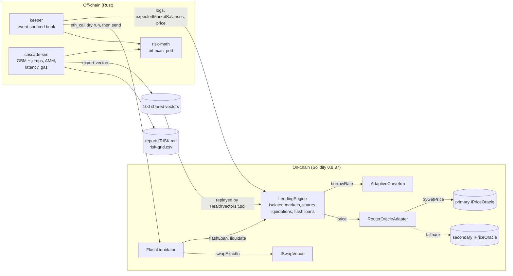

# Isolated-Market Lending Engine with a Rust Liquidation Keeper and Cascade Risk Simulator

A lending singleton adapted from Morpho Blue, with reverse-Dutch liquidations whose closeouts cannot be griefed and
never tax suppliers on a position that still covers its debt, per-market bad-debt socialization and flash loans. A Rust
keeper liquidates it on anvil through flash loans, and an agent-based simulator turns the contract's own arithmetic
into an LLTV x bonus-cap risk grid.

[](https://github.com/monzon1985/blockchain/actions/workflows/22-isolated-lending-engine.yml)
%20%2B%20MIT-blue.svg)


> Technical demonstration. Nothing in this repository has been audited or deployed with real funds. The Solidity
> engine is adapted from Morpho Blue and is GPL-2.0-or-later; see [License](#license).

## What's interesting here

- **Closeouts that cannot be griefed and never tax suppliers above water.** A liquidation request at or above the
  position's size (`type(uint256).max`) closes it at whatever size it has when mined, so a 1-wei deposit or a
  1-share repayment sent in front of it no longer makes it revert. While the collateral still covers the debt, a
  closeout repays the whole debt and the bonus is capped at the borrower's equity, so suppliers lose nothing on a
  position that is not under water, even when the borrower liquidates themselves with a flash loan. Both are
  enforced by a stateful invariant (11), fuzz tests and Rust proptests, and each reviewer PoC is a regression test
  that fails on the previous engine.
- **The simulator's liquidation math is checked bit for bit against the contract.** `cascade-sim export-vectors`
  writes 100 liquidation scenarios (random share prices, collateral from 1 wei to 1e27, prices spanning 30 orders of
  magnitude; 17 under-water closeouts, 10 closeouts capped at the borrower's equity, 5 `type(uint256).max` requests,
  51 repay-denominated calls) with expectations computed by the Rust `risk-math` crate. `HealthVectors.t.sol`
  replays all **100/100** on a freshly deployed engine and matches the health factor, bonus, seized and repaid
  amounts, bad debt, post-state and the exact revert data. The vectors cover the liquidation state transition only,
  not interest accrual, the IRM or the oracle path.
- **11 stateful invariants** over three markets that share tokens across roles, driven by price shocks from -60 % to
  +30 %, time jumps, all eight asset/share conversions, liquidations in five modes and flash loans whose callbacks
  act on the markets. Every run is asserted to liquidate at least once. Lock release is checked inside the
  transaction that took the lock (a mutant that leaks only `withdraw`'s lock fails invariant 10). The same harness
  runs under Foundry (128 runs x 80 calls locally, 256 x 80 with a fixed seed in CI) and Medusa. Line coverage of
  `src/` is **100 %** (477/477 lines; branches 173/174).
- **An evidence-backed parameter recommendation, with its uncertainty.** 26 valid (LLTV, bonus cap) cells x 400
  paths x 7,200 blocks (GBM with downward jumps, an AMM that liquidations sell into, liquidator latency and gas)
  recommend **LLTV 86 % with a 2 % bonus cap**: p99 bad debt 0.000 % (bootstrap 95 % interval 0.000-0.171 %), and
  the same cell on 4 of 5 seeds. The optimum is inside the grid: at LLTV 86 % a 0.5 % cap never pays for pool fees
  and gas (no liquidation ever happens; p99 2.2 %) and a 15 % cap lifts p99 to 11.7 %. See
  [`reports/RISK.md`](reports/RISK.md).
- **A keeper validated end to end, including what it must not do.** On anvil at a 30 gwei base fee it replays events
  into a confirmation-depth position book, plans closes with `risk-math`, dry-runs each with `eth_call` and executes
  **5 flash-loan-funded liquidations** through two crashes (3 full repayments, 1 closeout capped at equity, 1
  under-water closeout), while skipping a dust position as unprofitable and a whale whose collateral the venue cannot
  absorb, without stopping the candidates behind them. Net profit is about 3,090 loan tokens for about 1.03M gas
  (1,016,385 and 1,040,582 gas in the last two local runs; gas and the last decimals vary with block timestamps).
  A second test pauses mining: both transactions time out, the tick still completes, and the book catches up once
  blocks are mined.

## Overview

Pooled lending protocols share one risk bucket: a bad oracle or a crashing collateral asset can leave bad debt that
every lender pays for. Isolated markets fix the blast radius. Each market is the hash of
`(loanToken, collateralToken, oracle, irm, lltv)`, anyone can create one from governance-allowlisted IRMs and LLTVs,
and its losses stay with the suppliers who chose it.

What makes it non-trivial is the liquidation mechanism and its failure modes:

- **Rounding.** Share accounting with a 1e6 virtual offset has to round against the caller in all eight conversions,
  or small repeated operations drain the pool.
- **Reverse-Dutch bonus and the health guard.** `bonus = min(maxBonus, slope * (1 - health))` pays liquidators little
  near the threshold and more as the position deteriorates. Whenever collateral no longer covers
  `debt * (1 + bonus)`, *any* partial liquidation lowers the health factor, and the engine enforces "a liquidation
  may not lower health", so in that region only a close of the whole position is valid.
- **Closing without griefing or overcharging.** A close request (anything at least the position's size) is priced on
  the state at execution, in three regimes: collateral covers debt plus bonus (repay everything, the borrower keeps
  the rest); collateral covers the debt only (repay everything for all the collateral, bonus capped at the borrower's
  equity, no supplier loss); collateral is worth less than the debt (seize everything at the scheduled bonus and
  write the shortfall off against that market's suppliers in the same transaction, so no zombie positions remain).
- **Choosing the parameters.** A low cap does not pay for pool slippage and gas, so positions drift under water before
  anyone acts; a high cap reaches the closeout region sooner and pays liquidators more of an under-water position's
  collateral. That trade-off is quantified by simulation, with the contract's exact integer math.

## Architecture



| Component | Responsibility | Key external calls |
|---|---|---|
| [`LendingEngine`](src/LendingEngine.sol) | Markets, supply/borrow shares, collateral, reverse-Dutch liquidations with the health guard, close requests, equity-capped closeouts and bad-debt write-off, fee-free flash loans, EIP-712 manager authorization, per-market transient lock | `IIrm.borrowRate`, `IOracle.price`, ERC-20 transfers, callbacks |
| [`LiquidationMath`](src/libraries/LiquidationMath.sol), [`SharesMathLib`](src/libraries/SharesMathLib.sol), [`MathLib`](src/libraries/MathLib.sol) | Health factor, bonus schedule, equity cap, seize/repay conversions, virtual-share conversions, Taylor accrual | Solady `fullMulDiv` |
| [`AdaptiveCurveIrm`](src/irm/AdaptiveCurveIrm.sol) | Rate curve (x0.25 to x4 around a 90 % target) whose level adapts exponentially, averaged with Simpson's rule | Solady `expWad` |
| [`RouterOracleAdapter`](src/oracles/RouterOracleAdapter.sol) | Collateral/loan price from two `IPriceOracle` sources: primary, then secondary, then primary TWAP; halts on sequencer outages | `IPriceOracle.tryGetPrice` |
| [`FlashLiquidator`](src/periphery/FlashLiquidator.sol) | Owner-only flash-loan-funded liquidation with a profit floor | `flashLoan`, `liquidate`, `ISwapVenue.swapExactIn` |
| [`risk-math`](keeper/crates/risk-math) | Bit-exact Rust port of the liquidation arithmetic and of `liquidate`'s state transition and revert order | none |
| [`keeper`](keeper/crates/keeper) | Confirmation-depth event-sourced position book, close planning, dry run, execution with per-candidate failure handling and receipt timeouts, profit-after-gas report | alloy providers, `eth_getLogs`, `eth_call` |
| [`cascade-sim`](keeper/crates/cascade-sim) | Agent-based sweep of LLTV x bonus cap with bootstrap intervals and seed stability, report rendering, vector export | none |

## Roles and trust assumptions

| Role | Powers | If compromised |
|---|---|---|
| Governance (`Ownable2Step` owner) | Allowlist IRMs; allowlist an LLTV with its immutable bonus schedule; set a market fee up to 25 % of interest; set the fee recipient | Can steer *new* markets to a malicious IRM or schedule and take up to 25 % of future interest on existing markets. Cannot move funds, pause, or change an existing market's oracle, IRM, LLTV or schedule |
| Market creator | Picks the oracle, which the market trusts completely | A bad oracle drains that market only |
| Position manager (authorized via `setAuthorization[WithSig]`) | Withdraw, borrow and withdraw collateral for the authorizer | Can drain the authorizer's positions |
| `FlashLiquidator` owner (keeper key) | Start liquidations, rescue tokens | Loses the keeper's profits; cannot touch the engine's funds |

The full threat model (assets, actors, attack surface by OWASP SC 2026 class, mitigations, limitations) is in
[`docs/THREAT_MODEL.md`](docs/THREAT_MODEL.md).

## Invariants and properties

Stateful invariants 1-11 are `property_*` functions of [`LendingSystem`](test/invariant/LendingSystem.sol), which is
both the Foundry handler (wrapped by [`LendingInvariants.t.sol`](test/invariant/LendingInvariants.t.sol)) and,
unchanged, the Medusa target [`LendingProperties`](test/medusa/LendingProperties.sol).
[`LendingSystemSmoke.t.sol`](test/invariant/LendingSystemSmoke.t.sol) shows the handler reaches every liquidation
outcome, all eight conversions and both flash-loan callback actions.

| # | Property (plain English) | Enforced by |
|---|---|---|
| 1 | Borrow shares add up to the total, and total borrow equals the borrowers' debts within rounding: `sum(toAssetsDown) <= totalBorrowAssets <= sum(toAssetsUp) + virtual-share claim` | [`invariant_borrowSharesTimesIndexEqualsTotalBorrow`](test/invariant/LendingInvariants.t.sol) |
| 2 | Supply shares (including the fee recipient's) add up, and suppliers' claims never exceed total supply | [`invariant_supplySharesAddUp`](test/invariant/LendingInvariants.t.sol) |
| 3 | No market lends more than it holds | [`invariant_borrowsCoveredBySupply`](test/invariant/LendingInvariants.t.sol) |
| 4 | For every token, the engine holds all idle liquidity plus all collateral it owes, across roles and markets | [`invariant_engineIsSolvent`](test/invariant/LendingInvariants.t.sol) |
| 5 | A position without collateral has no debt (no zombie positions) | [`invariant_noZombiePositions`](test/invariant/LendingInvariants.t.sol) |
| 6 | A liquidation never lowers the health factor except when it realizes bad debt | [`invariant_liquidationNeverLowersHealth`](test/invariant/LendingInvariants.t.sol), [`testFuzz_liquidationNeverLowersHealthUnlessBadDebt`](test/fuzz/LiquidationFuzz.t.sol), Rust proptest [`liquidation_never_lowers_health_unless_bad_debt`](keeper/crates/risk-math/tests/properties.rs) |
| 7 | Bad debt is realized only by a closeout that exhausts the collateral | [`invariant_badDebtOnlyOnCloseout`](test/invariant/LendingInvariants.t.sol) |
| 8 | Markets are isolated: no action (bad debt, shocks, accrual, flash loans) changes another market | [`invariant_marketsAreIsolated`](test/invariant/LendingInvariants.t.sol), [`test_liquidate_badDebtStaysInItsMarket`](test/unit/Liquidation.t.sol) |
| 9 | Supply share value never decreases except through bad debt | [`invariant_supplyShareValueMonotonic`](test/invariant/LendingInvariants.t.sol) |
| 10 | Every operation releases its market lock before its transaction continues (checked inside the transaction, where transient storage is still live) | [`invariant_locksReleasedWithinTransaction`](test/invariant/LendingInvariants.t.sol), [`test_everyLockingEntryPointReleasesItsLockWithinTheTransaction`](test/unit/FlashLoanReentrancy.t.sol) |
| 11 | Suppliers lose nothing to the liquidation of a position whose collateral still covers its debt | [`invariant_noSupplierLossWhileCollateralCoversDebt`](test/invariant/LendingInvariants.t.sol), [`testFuzz_noSupplierLossWhileCollateralCoversDebt`](test/fuzz/LiquidationFuzz.t.sol), Rust proptest [`no_supplier_loss_while_collateral_covers_debt`](keeper/crates/risk-math/tests/properties.rs), [`test_liquidate_selfLiquidationCannotShiftLossToSuppliers`](test/unit/Liquidation.t.sol) |
| 12 | The bonus never exceeds its cap, is zero for healthy positions, and is non-decreasing in the health deficit | Halmos [`LiquidationBonusSymbolic`](test/halmos/LiquidationBonusSymbolic.t.sol) (cap for every input; monotonicity for the 1x slope), [`testFuzz_bonusMonotonicInDeficit`](test/fuzz/LiquidationFuzz.t.sol), Rust proptest [`bonus_monotonic`](keeper/crates/risk-math/tests/properties.rs) |
| 13 | Liveness: every unhealthy position can be closed in one call, denominated on either side | [`testFuzz_unhealthyPositionCanAlwaysBeClosed`](test/fuzz/LiquidationFuzz.t.sol), Rust proptest [`unhealthy_positions_can_always_be_closed`](keeper/crates/risk-math/tests/properties.rs) |
| 14 | A dust deposit or dust repayment sent in front of a close request cannot make it revert | [`testFuzz_dustFrontRunCannotBlockClose`](test/fuzz/LiquidationFuzz.t.sol), Rust proptest [`close_requests_cannot_be_blocked_by_dust`](keeper/crates/risk-math/tests/properties.rs), [`test_liquidate_dustDepositCannotBlockClose`](test/unit/Liquidation.t.sol), [`test_liquidate_repayFrontRunCannotBlockFullRepay`](test/unit/Liquidation.t.sol) |
| 15 | While collateral covers debt plus bonus, partial liquidations are never blocked and raise health; once it does not, every partial liquidation is rejected, and no partial may exhaust the collateral | [`testFuzz_partialLiquidationImprovesSolventPosition`](test/fuzz/LiquidationFuzz.t.sol), [`testFuzz_partialLiquidationRejectedForInsolventPosition`](test/fuzz/LiquidationFuzz.t.sol), [`test_liquidate_partialCannotExhaustCollateral`](test/unit/Liquidation.t.sol) |
| 16 | Every asset/share conversion is the floor or the ceiling of the right quotient, in the protocol's favor | Halmos [`SharesMathSymbolic`](test/halmos/SharesMathSymbolic.t.sol) (3 proofs, see the method below), [`SharesMathFuzz`](test/fuzz/SharesMathFuzz.t.sol) |
| 17 | Rust `risk-math` and the Solidity engine produce identical liquidation outcomes | [`HealthVectors.t.sol`](test/vectors/HealthVectors.t.sol) (100 vectors), Rust [`shared_vectors.rs`](keeper/crates/risk-math/tests/shared_vectors.rs) |

## Security considerations

- **Reentrancy.** Every market entry point takes a per-market lock in transient storage (EIP-1153, slot derived
  ERC-7201 style). Callbacks (`onSupply`, `onRepay`, `onSupplyCollateral`, `onLiquidate`) run under the lock, so
  re-entering the same market reverts with `MarketLocked` (tested for 8 entry points), while other markets stay
  usable. Flash loans are deliberately not market-bound, which is what makes flash-loan-funded liquidation possible.
  The lock is a composability choice, not a gas one: it costs 489 gas over no guard, against 545 for OpenZeppelin's
  `ReentrancyGuardTransient`, which would forbid `flashLoan -> liquidate` (see Gas).
- **Testing the lock needs care.** EIP-1153 clears transient storage at the end of a transaction, and Foundry 1.8
  runs tests in isolation mode, where every call the test (or an invariant handler) makes is its own transaction. A
  `isMarketLocked` check after the call returns can never fail. The unit test and the invariant therefore read the
  lock inside the same call that took it, and a mutant that forgets one `_unlock` fails both.
- **Liquidation griefing and self-liquidation.** Collateral can be supplied and debt repaid on behalf of anyone, so a
  liquidation sized to the exact amounts seen off-chain can be turned into a rejected partial by a dust deposit. A
  close request (`type(uint256).max` on either side, or anything at least the position's size) cannot: it is priced
  on the state at execution. The keeper and `FlashLiquidator` orders use it. A closeout of a position whose
  collateral covers its debt repays the whole debt and caps the bonus at the borrower's equity, so a borrower cannot
  close their own position for less than they owe.
- **Oracle failures.** The adapter treats `STALE`, `ZERO`, `NEGATIVE`, `OUT_OF_BOUNDS`, `DEVIATION` and zero prices as
  unusable and falls back to the secondary source, then to the primary's TWAP. That includes the router's soft-mode
  `DEVIATION` quote: when two feeds disagree, an independent source is a better liquidation price than either side.
  `SEQUENCER_DOWN` and `GRACE_PERIOD` halt pricing outright: a second source on the same L2 is just as unreachable
  for users, and the grace period exists so borrowers can top up first. The engine additionally rejects a zero price
  in `liquidate` (it would otherwise let collateral be seized for free).
- **Signatures.** EIP-712 with nonce, deadline and chain id; ERC-1271 wallets via `SignatureChecker`; tested for
  replay, expiry, wrong chain, tampering and bad 1271 signatures.
- **Liquidity.** `withdraw` and `borrow` revert rather than leave `totalBorrowAssets > totalSupplyAssets`.

### Static analysis triage

Slither 0.11.6 runs with `--fail-medium` and reports no medium or high finding (36 low and informational
results in the final run). Findings suppressed inline (each with a justification in the code):

| Detector | Where | Why it is not a bug |
|---|---|---|
| `reentrancy-no-eth` | Engine entry points, `_accrueInterest` | The IRM call precedes the accrual writes by necessity; it runs under the market lock and the IRM is allowlisted. Slither cannot model the transient lock |
| `incorrect-equality` | `_accrueInterest`, `healthFactor`, IRM `_borrowRate` | Sentinel checks (`elapsed == 0`, `debt == 0`, "never updated"), not balance equalities |
| `unused-return` | `createMarket` | The IRM is called only to initialize its state; no time has elapsed, so there is no rate to apply |
| `reentrancy-balance` | `FlashLiquidator.liquidate` | The balance delta across the flash loan *is* the profit; only the owner can call and the callback only accepts the engine while in flight |

Remaining low and informational findings are accepted as-is: `reentrancy-benign` and `reentrancy-events` (same
lock argument), `timestamp` (accrual and deadlines), `assembly` (the one memory-safe block in `MarketParamsLib.id`), and
`naming-convention` (immutables are `SCREAMING_CASE` by project convention). `forge lint` is clean on `src/` with
`reentrancy-events` and `block-timestamp` excluded for the reasons written in [`foundry.toml`](foundry.toml).

### Known limitations

- No close factor: a solvent position can be repaid in full in one liquidation (the borrower keeps the excess
  collateral). The reverse-Dutch schedule, not a close factor, limits what near-threshold borrowers pay.
- Under water, a closeout pays the scheduled bonus and suppliers fund it through bad debt, the usual incentive for
  realizing a deficit (a borrower may collect it by liquidating their own under-water position). At the boundary
  where collateral value equals debt the incentive jumps from about zero (equity-capped) to the scheduled bonus, so a
  liquidator may prefer to wait for a small position to slip under water. Low caps keep that jump small.
- Only close requests are front-run-proof; a liquidation sized to exact observed amounts can still be turned into a
  rejected partial by a dust deposit.
- Fee-on-transfer and rebasing tokens are not supported.
- Governance is a single `Ownable2Step` key; production would add a timelock and a multisig.

## Design decisions and trade-offs

| Decision | Alternative | Why |
|---|---|---|
| Health guard (`healthAfter >= healthBefore` unless the position is closed) | Allow any partial liquidation (Morpho Blue) | Makes invariant 6 a protocol rule and forbids zombie positions. Liveness is preserved (property 13) |
| Requests at or above the position's size close it | Revert on oversized requests | A closeout sized on observed amounts could be blocked forever by 1-wei deposits (the borrower holds a free option on a price recovery while bad debt grows) |
| Closeout bonus capped at the borrower's equity while collateral covers the debt | Always pay the scheduled bonus (the previous design); or zero bonus under water | Suppliers take a loss only on a position that is actually under water. Under water the scheduled bonus is kept, because a zero incentive would leave deficits unrealized and let the first withdrawers escape them |
| Bonus schedule bound to the LLTV at allowlisting, immutable | Global or per-market mutable bonus | Markets stay immutable; governance cannot change an existing market's liquidation terms |
| `lltv * (1 + maxBonus) < 1` required by `enableLltv` | No check | A max-bonus liquidation of a position at the threshold must leave it solvent |
| Per-market transient lock | Global `ReentrancyGuardTransient` | Composability: a global guard would forbid `flashLoan -> liquidate`, the keeper's core path. Gas is not the reason (489 vs 545) |
| 512-bit `fullMulDiv` for price math, checked 256-bit `mulDiv` for shares | 256-bit everywhere | Prices are 1e36-scaled and would overflow; share math stays SMT-friendly and reverts on overflow |
| Third-order Taylor accrual | Exact `expWad` | Never reverts on a long-idle market (polynomial growth); underestimates by 3 % at 100 % APR over a year |
| Simpson's rule for the IRM's average rate | Trapezoid | Error below 0.1 % for an idle week at maximum adaptation speed (tested against the closed form) |
| Secondary spot price ranks above the primary's TWAP | TWAP first | A TWAP lags a crash, delaying liquidations and growing bad debt |
| Keeper bindings declared inline | Generated from `out/` | The crate builds without Foundry; the e2e test checks every selector against the compiled ABI |
| Keeper book with a confirmation depth and a rebuilt tip | Apply every log once, at the head | A reorg of the unconfirmed blocks cannot leave stale events, and a chunk that fails part-way is never double-applied |
| Simulator RNG and transcendental functions in pure Rust (`xoshiro256**`, `libm`) | `rand` + `std` float functions | Platform libms differ in the last ulp; the golden report must match byte for byte on Windows and Linux |
| f64 pre-filter before exact pricing in the simulator | Price every candidate exactly | Low caps leave positions liquidatable-but-unprofitable for thousands of blocks; the filter skips only candidates whose estimated profit is below -1 loan unit and never near the "collateral value = debt" boundary. A proptest checks that it never changes the chosen liquidation, and the quick grid is byte-identical with and without it |

## Testing

```bash
# Solidity
forge soldeer install
forge fmt --check && forge build
forge lint src
forge test                                          # unit, fuzz, invariants, vectors, gas benches
forge snapshot --check --match-contract GasBench
forge coverage --report summary --report lcov --no-match-coverage "(test|script|dependencies)" \
  && awk -F: '/^LF:/{lf+=$2} /^LH:/{lh+=$2} END{pct=100*lh/lf; printf "src line coverage: %.2f%%\n", pct; exit (pct<90)}' lcov.info
medusa fuzz --config medusa.json --timeout 600
halmos --match-contract SharesMathSymbolic
halmos --match-contract LiquidationBonusSymbolic
slither . --config-file slither.config.json --fail-medium

# Rust (the anvil-e2e feature runs `forge build` from build.rs to embed fresh artifacts)
cd keeper
cargo fmt --all --check
cargo clippy --locked --workspace --all-targets -- -D warnings
cargo clippy --locked -p keeper --all-targets --features anvil-e2e -- -D warnings
cargo test --locked --workspace                      # CI pins PROPTEST_RNG_SEED=2222
cargo test --locked -p keeper --features anvil-e2e -- --test-threads=1 --nocapture
cargo run --locked --release -p cascade-sim -- --quick --check     # determinism + golden file
cargo run --locked --release -p cascade-sim -- export-vectors --check
cargo run --locked --release -p cascade-sim -- --check             # committed full reports (about 7 min on 4 threads)
```

| Suite | Count | Notes |
|---|---|---|
| Foundry unit (`test/unit`) | 153 | Happy path and every revert path of the engine, IRM, adapter, liquidator and deploy script; a regression test for each reviewer PoC (dust front-run, repay front-run, band closeout, self-liquidation); the in-transaction lock probe |
| Foundry fuzz (`test/fuzz`) | 15 | `bound()`-constrained, on markets with a second borrower and accrued interest (debt share prices are not the round 1e-6 of a fresh market); 512 runs locally, 1,024 with seed `0x2222` in CI |
| Foundry invariants (`test/invariant`) | 11 invariants + 3 smoke tests | 128 runs x 80 calls locally (10,240 calls, 0 reverts); 256 x 80 with a fixed seed in CI (20,480 calls, 0 reverts); every run is asserted to liquidate at least once |
| Rust-generated vectors (`test/vectors`) | 6 tests replaying 100 vectors | Plus a storage-layout check of the `vm.store` helper |
| Gas benches (`test/gas`) | 32 | 14 on each IRM plus 4 reentrancy baselines, checked against `.gas-snapshot` |
| Medusa | 11 properties | Same harness as the invariants; final local run: 100,646 calls over 600 s (4 workers, 2,778 branches covered), 0 failures. CI also requires all 11 properties to be reported as passed |
| Halmos | 5 proofs | 3 share-math proofs (assuming Euclidean division), 2 bonus-schedule proofs (no assumptions) |
| `risk-math` | 29 | 19 unit, 7 proptest properties (2,000 cases each), 3 shared-vector parity tests |
| `keeper` | 10 + 3 e2e | Book replay and all-or-nothing chunk staging, close planning (with a proptest), bindings; behind `anvil-e2e`: the two-crash run with skips, the stuck-transaction run, and an ABI drift check against the compiled artifacts |
| `cascade-sim` | 22 | RNG pinned to a reference implementation, path calibration, AMM, bootstrap interval, thread-count independence, pruning equivalence (3,000-case proptest), vector generation |

**Coverage** (`forge coverage`, `src/` only): 100.00 % lines (477/477), 100.00 % statements (531/531), 99.43 %
branches (173/174; the uncovered one is in `RouterOracleAdapter`), 100.00 % functions (77/77). CI fails below 90 % lines.

**How the Halmos proofs work.** SMT solvers cannot bit-blast symbolic 256-bit division (even `q * d <= n` over 16-bit
inputs times out with both yices and z3), so each share-math proof states two arithmetic facts as explicit
assumptions (Euclidean division and distributivity, both true for every non-reverting input) and lets Halmos check the
rest over uninterpreted multiplication and division. What that establishes is narrower than "all inputs": the proofs
confirm that each conversion function is the floor or the ceiling of the correct quotient, assuming Euclidean
division; the rounding property then follows from the assumption. They are still not vacuous: making `toSharesDown`
round up yields a concrete counterexample in about 7 s. The bonus proofs need no assumption (the only division is by
the constant 1e18): the cap holds for every health factor, cap and slope, and monotonicity is proved for the 1x slope;
for 2x, 4x, 20x or a symbolic slope each query times out at 5-10 minutes, so monotonicity for other slopes rests on
fuzzing. In the final local run the proofs took 0.3 s, 8.6 s and 20.6 s (share math) and 0.2 s and 1.8 s
(bonus). `halmos.toml` raises the per-query solver timeout
to 10 minutes so slower CI runners do not time out, and `foundry.toml` emits the AST and storage layout on every build
(in a local run where Slither had just rebuilt `out/`, Halmos otherwise loaded AST-less artifacts and found no tests).

## Gas

`forge snapshot --match-contract GasBench`: warm market, one day of interest pending; figures include the test's call
overhead. `GasBench` runs on the fixture's constant-rate mock IRM (a view function returning a number), which isolates
the engine's own cost; `GasBenchAdaptiveIrm` runs the same calls on a market with the `AdaptiveCurveIrm` that
deployments use, whose accrual adds two `expWad` calls, Simpson's rule, a storage write and an event (about 11.3k gas
per accruing call).

| Operation | Mock IRM (`GasBench`) | `AdaptiveCurveIrm` (`GasBenchAdaptiveIrm`) |
|---|---|---|
| `supply` | 101,176 | 112,431 |
| `withdraw` | 99,881 | 111,136 |
| `supplyCollateral` (no accrual) | 75,165 | 75,175 |
| `withdrawCollateral` | 106,464 | 117,643 |
| `borrow` | 108,741 | 119,929 |
| `repay` | 101,904 | 113,159 |
| `liquidate` (partial, health guard evaluated) | 185,682 | 196,959 |
| `liquidate` (closeout, bonus capped at equity) | 170,048 | 181,325 |
| `liquidate` (under-water closeout with bad-debt write-off) | 174,512 | 185,701 |
| `FlashLiquidator.liquidate` (flash loan + liquidate + swap) | 278,595 | 287,564 |
| `flashLoan` (borrow and repay 500 tokens, no accrual) | 99,212 | 99,234 |
| `accrueInterest` | 66,765 | 78,042 |
| `createMarket` (the adaptive IRM initializes its state) | 190,852 | 215,410 |
| `healthFactor` (view) | 48,129 | 54,695 |

Reentrancy baselines, same warm storage write in four harnesses: no guard 31,655; the engine's per-market transient
lock 32,144 (+489); OpenZeppelin `ReentrancyGuardTransient` 32,200 (+545); OpenZeppelin `ReentrancyGuard` (storage)
34,115 (+2,460).

## Getting started

Prerequisites: Foundry 1.8.3 (`forge`, `anvil`), Rust 1.98.1 (pinned in `keeper/rust-toolchain.toml`), and for the
analysis gates Medusa 1.5.1, Halmos 0.3.3, Slither 0.11.6 and crytic-compile 0.4.2 (Medusa calls the
`crytic-compile` binary, and `uv tool` exposes only the named package's executables):

```bash
uv tool install halmos==0.3.3
uv tool install slither-analyzer==0.11.6
uv tool install crytic-compile==0.4.2
```

On Windows, Rust's MSVC toolchain and Halmos need the Visual Studio 2022 C++ Build Tools.

```bash
forge soldeer install && forge build && forge test
cd keeper && cargo test --workspace
```

**Local demo.** The anvil end-to-end tests are the demo: they deploy everything, open seven positions, crash the price
twice and print the keeper's execution reports, then pause mining to show a stuck transaction being handled.

```bash
cd keeper && cargo test -p keeper --features anvil-e2e -- --test-threads=1 --nocapture
```

**Keeper CLI** against any node (the signer always comes from an encrypted keystore):

```bash
cargo run -p keeper -- scan --rpc-url http://127.0.0.1:<port> --engine <addr> --market-id <id>
KEEPER_KEYSTORE_PASSWORD=... cargo run -p keeper -- run --rpc-url ... --engine ... --liquidator ... \
  --venue ... --market-id ... --keystore ./keeper.json --eth-price-in-loan 2000000000000000000000 \
  --min-net-profit 1000000000000000000 --confirmations 3 --receipt-timeout-secs 60
```

**Deployment** (keystore-based; ownership is offered to `OWNER` through Ownable2Step):

```bash
OWNER=<multisig> forge script script/Deploy.s.sol --rpc-url <url> --account <keystore> --sender <addr> --broadcast
```

**Risk sweep**: `cd keeper && cargo run --release -p cascade-sim` regenerates `reports/` (about 7 minutes on 4 threads locally: 84 s for the grid, 320 s for the four
stability seeds).

## Project structure

```
src/
  LendingEngine.sol            markets, shares, liquidations, flash loans, authorization (GPL-2.0-or-later)
  interfaces/                  ILendingEngine (types, events, errors), callbacks, IIrm, IOracle, IPriceOracle (vendored)
  libraries/                   LiquidationMath, SharesMathLib, MathLib, MarketParamsLib
  irm/AdaptiveCurveIrm.sol
  oracles/RouterOracleAdapter.sol
  periphery/FlashLiquidator.sol, ISwapVenue.sol
test/
  unit/ fuzz/ invariant/ medusa/ halmos/ vectors/ gas/ mocks/ utils/
script/Deploy.s.sol
keeper/                        Cargo workspace
  crates/risk-math/            bit-exact arithmetic port + shared vector schema
  crates/keeper/               event-sourced keeper (lib + CLI) and the anvil e2e tests
  crates/cascade-sim/          simulator, report renderer, vector exporter
reports/                       RISK.md, risk-grid.csv, risk-grid.quick.csv (golden)
docs/THREAT_MODEL.md
LICENSE-GPL-2.0.txt            license of the Morpho-derived Solidity files
```

## Scope notes and future work

- **Oracle router.** `IPriceOracle` is vendored from project 01's interface specification, and the adapter is tested
  against a scriptable mock of it, not against the router itself (each project is self-contained).
- **Swap venue.** Tests and the anvil demo sell collateral through `MockSwapVenue`, which prices at the oracle minus a
  fixed spread. The keeper sends `minAmountOut = 0` and relies on its on-chain profit floor (estimated gas plus the
  configured minimum); a production keeper would route through a DEX aggregator and bound slippage explicitly.
- **Halmos.** The share-math proofs confirm each conversion is the floor or ceiling of the correct quotient, assuming
  Euclidean division (and distributivity); they add less than "every `uint128` input" would suggest over the fuzz
  suite. Bonus monotonicity is proved for the 1x slope only and fuzzed (Foundry and proptest) for arbitrary slopes;
  the twist's "borrow shares x index == total borrow" and "a liquidation never lowers health" are fuzzed and
  enforced as stateful invariants, not proved symbolically.
- **Parity, not proof.** `risk-math` is checked against the engine on 100 shared vectors plus proptests, which is
  differential testing of the liquidation transition, not a proof of equivalence; accrual, the IRM and the oracle
  path are outside the vectors (the simulator does not model them).
- **Math library.** The spec lists OpenZeppelin `Math`; the engine uses its own checked `MathLib` (adapted from Morpho
  Blue) for share math, so every rounding direction is explicit and SMT-friendly, and Solady's `fullMulDiv` for
  1e36-scaled price math. From OpenZeppelin's math utilities only `SafeCast` is used.
- **Simulator.** A stress calibration, not a forecast: passive borrowers, one pool with constant depth, no oracle lag,
  no interest over the one-day horizon, one competitive liquidator population. The grid is coarse (six caps, five
  LLTVs) and p99 over 400 paths rests on a handful of paths, which is why RISK.md reports bootstrap intervals and a
  five-seed stability check. The committed reports are reproducible from the seeds, and CI re-derives them.
- **Keeper.** One market per process, HTTP polling, public mempool (no private order flow or bundle submission),
  reorgs deeper than the confirmation depth are not handled.
- **Slither flag.** The specified `--fail-on medium` does not exist in Slither 0.11.6; the equivalent `--fail-medium`
  is used (the spec text itself needs that correction).
- Future work: a close factor as a governance-bounded market parameter, oracle-lag and depth-shock scenarios in the
  simulator, and a websocket-driven multi-market keeper.

## License

The Solidity engine is **GPL-2.0-or-later** because it is adapted from
[Morpho Blue](https://github.com/morpho-org/morpho-blue) by Morpho Labs, which is published under that license. The
derived files carry `SPDX-License-Identifier: GPL-2.0-or-later` and a header naming the original file and what was
changed: `src/LendingEngine.sol`, `src/interfaces/ILendingEngine.sol`, `src/interfaces/IIrm.sol`,
`src/interfaces/IOracle.sol`, `src/interfaces/ILendingCallbacks.sol`, `src/libraries/MathLib.sol`,
`src/libraries/SharesMathLib.sol` and `src/libraries/MarketParamsLib.sol`. The license text is in
[`LICENSE-GPL-2.0.txt`](LICENSE-GPL-2.0.txt).

Everything else is original and **MIT** (standards section 10 allows the exception): `LiquidationMath`, the
`AdaptiveCurveIrm` (its curve shape and parameter values follow Morpho's AdaptiveCurveIrm; the code, the Simpson's-rule
averaging and the exponent clamp are independent), `RouterOracleAdapter`, `FlashLiquidator`, the tests, the deployment
script and the whole Rust workspace (`risk-math` reproduces the same formulas in Rust, which bit-exact parity
requires). A build or distribution that includes the engine is covered by the GPL as a whole.

## References

- Morpho Labs, *Morpho Blue* whitepaper and code. This engine adapts Morpho Blue's core accounting: share math with
  virtual shares, Taylor accrual, market-id derivation and the entry-point shapes (see [License](#license)). Original
  here: the health guard, the reverse-Dutch schedule bound to the LLTV, the closeout rules (close requests,
  equity-capped bonus, same-transaction bad-debt write-off), the per-market transient lock, the Simpson's-rule IRM
  (whose curve follows Morpho's AdaptiveCurveIrm), the oracle adapter, the flash liquidator, the keeper and the
  simulator.
- Euler Finance, *Euler v2* liquidations: discount proportional to the health deficit (reverse Dutch auction) and debt
  socialization.
- Aave, v3.3 *deficit* handling: writing off residual debt when collateral runs out.
- D. Perez, S. Werner, J. Xu, B. Livshits, *Liquidations: DeFi on a Knife-edge* (FC 2021).
- K. Qin, L. Zhou, P. Gamito, P. Jovanovic, A. Gervais, *An Empirical Study of DeFi Liquidations* (IMC 2021).
- R. Merton, *Option pricing when underlying stock returns are discontinuous* (1976), for the jump-diffusion paths.
- B. Efron, R. Tibshirani, *An Introduction to the Bootstrap* (1993), for the percentile intervals.
- D. Blackman, S. Vigna, *Scrambled linear pseudorandom number generators* (xoshiro256**).
- Solady `FixedPointMathLib` (`expWad` credited to Remco Bloemen), OpenZeppelin Contracts 5.7.
- EIP-712, ERC-1271, EIP-1153 (transient storage), ERC-7201 (namespaced slots).
- a16z Halmos; Trail of Bits Medusa and Slither; the alloy Rust stack.
