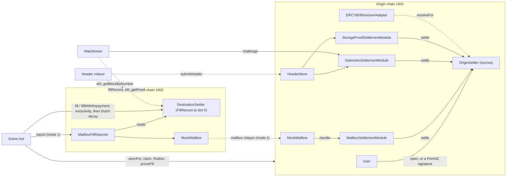

# Two-Chain ERC-7683 Intents: Solver Bot and Progressively Trust-Minimized Settlement

A two-chain ERC-7683 intent system. Users escrow on the origin chain (Permit2 witness or plain `open`); solvers fill on the destination chain through an exclusivity window and then a linear Dutch decay; a TypeScript solver bot runs the whole loop across two local anvil chains. Solvers are repaid through one of three pluggable settlement modes: a mock mailbox, a bonded optimistic claim with fraud proofs, or an on-chain Merkle-Patricia storage proof of the fill record against a relayed destination header.

[](https://github.com/monzon1985/blockchain/actions/workflows/23-erc7683-intents-settlement.yml)


## What's interesting here

- **Settlement becomes progressively trust-minimized, ending in an on-chain storage proof.** Mode 3 verifies `state root -> account -> FillRecord slot` from `eth_getProof` output against a relayed header, with OpenZeppelin 5.7's `BlockHeader` and `TrieProof`. On real anvil proofs, `proveFill` costs **296,201 gas** including repayment. Only one storage slot is proven because `orderId` commits to the fill payload's hash; the two-slot alternative measures **242,214 vs 189,801 gas (-52,413, -21.6%)** for verification alone.
- **The optimistic mode's fraud proofs prove absence, and cannot be squatted.** OpenZeppelin's `TrieProof` only proves inclusion, so a 143-line [`MerklePatriciaExclusion`](src/libraries/MerklePatriciaExclusion.sol) verifier proves "this order was never filled", both for the record slot and for the settler account itself (a header from before the settler existed). It is checked differentially against OZ over random tries, fuzzed with tampered proofs, and verified on anvil's own exclusion proofs. Claims are keyed by `(order, filler, fill time)`, so a false claim can never occupy the real filler's claim.
- **"Solver paid but user not filled" is fuzzed in every mode, with the payee observed, not assumed.** There are **8 cross-chain invariants**, stateful over both chains in one EVM (`vm.chainId` switching), with all three modes live, adversarial and squatting claimants, forged mailbox reports, forged or tampered proofs, double and late fills, and an always-online honest watcher. Where escrowed tokens went is read from balance changes of every address in the system. They run in Foundry (**128 runs x 96 calls, `fail_on_revert`**) and in Medusa (**300 s**, 20 checks including real `assert` post-conditions in every action). **9 committed mutants** of security-critical checks are all killed, in CI.
- **A solver that survives `kill -9` and flaky RPCs.** Every transaction gets its nonce from a `node:sqlite` journal and is journaled before it is broadcast; each tick re-sends every unmined journaled transaction in nonce order before signing anything new. The two-anvil e2e kills the solver right after journaling and right after broadcasting, including with two active orders; each time the journaled fill is the one that lands (**exactly one fill per order**), the other order takes the next nonce, and every order is repaid. **10 e2e scenarios** and **74 unit tests**, including the Solver, relayers and watchtower on fake chains with injected faults; **95.67% line coverage** of the solver.
- **ERC-7683 v1 mapped onto the May 2026 resolver-centric redesign.** [`ERC7683ResolverAdapter`](src/adapters/ERC7683ResolverAdapter.sol) returns steps, variables, payments and named assumptions for each mode. A generic interpreter in the tests executes them on both chains and gets repaid in all three modes. The **9 places where the two drafts disagree** are documented in [`docs/spec-drift.md`](docs/spec-drift.md).

## Overview

An intent is an order that says what the user wants ("1,000 IN on chain 1001 for at least 990 OUT on chain 1002"), not how to do it. A solver pays the user on the destination chain from its own inventory, then gets the user's escrow on the origin chain. The engineering problem is the second half: **the origin chain cannot see the destination chain**, so something has to convince it that the user was paid. Every intent protocol makes a trust choice here, usually a messaging bridge or an optimistic oracle, and every mistake in it is a way to pay a solver who never filled.

This project makes that choice pluggable per order and implements three points on the trust spectrum:

1. **Mailbox**: a messaging layer relays "order X was filled by F". Trusts the relayer set completely (mocked here by a single permissioned role).
2. **Optimistic**: anyone asserts the fill with a bond; after a challenge window it pays out unless someone proves it false with a storage proof. Trusts one honest, live watcher.
3. **Storage proof**: the filler proves the destination settler's storage holds its fill record, against a destination header relayed to the origin. Trusts only the header relayer; everything below the header is verified on-chain.

All three also trust the AccessManager admin, which is slowed down by an execution delay and relayer grant delays (see [Roles and trust assumptions](#roles-and-trust-assumptions)).

The L1 fundamentals of the portfolio's [`05-mpt-state-proofs-go`](../05-mpt-state-proofs-go) project (state trie, account RLP, secure-trie storage keys) are here verified inside the EVM.

## Architecture



| Component | Responsibility | Key external calls |
|---|---|---|
| [`OriginSettler`](src/OriginSettler.sol) | ERC-7683 `open`, `openFor`, `resolve`, `resolveFor`; escrow; releases it exactly once, to the filler (`settle`, only from the order's module) or to the user (`refund` after `fillDeadline + REFUND_GRACE`, while no claim is pending) | Permit2 `permitWitnessTransferFrom`; module `destinationSettler`, `hasPendingClaim`; SafeERC20 |
| [`DestinationSettler`](src/DestinationSettler.sol) | ERC-7683 `fill`; recomputes `orderId` from `originData`; exclusivity then Dutch decay; write-once `FillRecord{filler, filledAt, fillHash}` at a pinned slot | SafeERC20 `transferFrom` (solver to user) |
| [`MailboxFillReporter`](src/settlement/mailbox/MailboxFillReporter.sol) / [`MailboxSettlementModule`](src/settlement/mailbox/MailboxSettlementModule.sol) / [`MockMailbox`](src/settlement/mailbox/MockMailbox.sol) | Mode 1: report a fill record through the mailbox; accept reports only from the configured reporter | `dispatch`, `process`, `handle`, `settle` |
| [`OptimisticSettlementModule`](src/settlement/optimistic/OptimisticSettlementModule.sol) | Mode 2: bonded claims keyed by `(orderId, filler, filledAt)`, any number per order; challenge by storage proof (inclusion of a different record, exclusion of the slot, or exclusion of the settler account); finalize after the window, or void if another claim already repaid | HeaderStore, OriginSettler, bond token |
| [`StorageProofSettlementModule`](src/settlement/proof/StorageProofSettlementModule.sol) | Mode 3: `proveFill` against a stored header | HeaderStore, OriginSettler |
| [`HeaderStore`](src/settlement/proof/HeaderStore.sol) | Destination headers from a permissioned relayer; immutable once stored; permissionless ancestor import through `parentHash` | OpenZeppelin `BlockHeader` |
| [`FillProofLib`](src/libraries/FillProofLib.sol), [`MerklePatriciaExclusion`](src/libraries/MerklePatriciaExclusion.sol) | Account and slot inclusion (OpenZeppelin `TrieProof`), slot and account exclusion | none |
| [`ERC7683ResolverAdapter`](src/adapters/ERC7683ResolverAdapter.sol) | v1 orders through the resolver-centric draft | `OriginSettler.resolveFor` |
| [`solver/`](solver/src) | Solver with its transaction journal, header relayer, mailbox relayer, watchtower (TypeScript, viem, node:sqlite) | JSON-RPC to both chains |

**Order identity.** `originData = abi.encode(Intent)`, `fillHash = keccak256(originData)`, `orderId = keccak256(abi.encode(originChainId, originSettler, fillHash))`. The destination recomputes `orderId` from the payload it is paid against, so a fill can only be recorded under the id of the exact order it paid for; the origin re-checks any claimed `fillHash` against `orderId`.

## Roles and trust assumptions

| Role | Can | If compromised |
|---|---|---|
| Origin AccessManager admin (`ADMIN`, a timelock or multisig, with an execution delay) | Enable modules for new orders; register destination settlers and routes (write-once per chain); grant roles; re-point functions to roles | Configuration cannot directly redirect an existing escrow, but an admin who grants itself a relayer role can forge repayment for **every open order, in all three modes**: the admin key is part of the trust base of all three. `script/Deploy.s.sol` hands the role to `ADMIN` with an execution delay (every admin operation is scheduled publicly first) and gives the relayer roles a grant delay; this protects users only if the delay is longer than the longest order lifetime plus `REFUND_GRACE`. |
| Header relayer | `HeaderStore.submitHeader` | Forged headers could prove non-existent fills (mode 3) or disprove honest claims (mode 2). Stored headers cannot be rewritten. |
| Mailbox relayer | `MockMailbox.process` on the origin | Could forge mode-1 reports. |
| Watchers | Anyone | Mode 2 needs at least one honest, live watcher per challenge window. |
| DestinationSettler | No owner, no privileged function | n/a |

The full threat model (assets, per-mode trust, OWASP Smart Contract Top 10 (2026) mapping, scenarios including the two attacks found in review, limitations) is in [`docs/threat-model.md`](docs/threat-model.md).

## Invariants

Enforced by [`CrossChainInvariants`](test/invariant/CrossChainInvariants.t.sol) (Foundry) and [`IntentMedusaHarness`](test/medusa/IntentMedusaHarness.sol) (Medusa), over both chains at once, with all three settlement modes live. Both harnesses run every action inside an `observed` wrapper that snapshots the input-token balance of every address in the system (all actors, all contracts) and attributes each escrow release to the address that actually received the tokens.

1. **Solver repaid implies user filled.** Every repaid escrow went, as observed from balances, to exactly the repayment address recorded by a real fill of that order on the destination chain, for exactly the escrowed amount, and no other balance moved. `invariant_solverRepaidImpliesUserFilled`, `property_solverRepaidImpliesUserFilled`
2. **Refunded implies solver not repaid.** An escrow closes at most once, by repayment or by refund, never both; a refund went (observed) to the order's user. `invariant_refundedImpliesNotRepaid`, `property_refundedImpliesNotRepaid`
3. **Escrowed == outstanding + repaid + refunded**, and the escrow balance equals the sum of open orders exactly. `invariant_escrowConservation`, `property_escrowConservation`
4. **Every fill delivered at least the user's floor** (`outputEndAmount`). `invariant_userReceivesAtLeastFloor`, `property_userReceivesAtLeastFloor`
5. **Fill records are write-once.** `invariant_fillRecordsAreWriteOnce`, `property_fillRecordsAreWriteOnce`
6. **One bond per pending claim** in the optimistic module, whatever the number of claims per order. `invariant_bondsAreBacked`, `property_bondsAreBacked`
7. **No attack succeeded**: forged mailbox reports, forged or tampered storage proofs, double fills and late fills all revert, and no escrow is paid twice. `invariant_noAttackSucceeded`, `property_noAttackSucceeded`
8. **A false claim cannot take the real filler's repayment away**: an order whose real fill was claimed is never refunded, however many false claims (including the user's own squatting claims) surround it. `invariant_honestClaimIsNeverRefunded`, `property_honestClaimIsNeverRefunded`

The per-mode fuzz suite [`SolverPaidUserNotFilled`](test/fuzz/SolverPaidUserNotFilled.t.sol) attacks each mode directly: arbitrary senders and payloads through the mailbox, and the trusted reporter over a mix of filled and unfilled orders; arbitrary false claims (unfilled order, wrong filler, wrong time) next to the honest one, each disproven by the watcher; tampered and swapped proofs, which must be rejected by the proof verifiers themselves.

## Security considerations

- The optimistic mode is only as safe as its liveness assumptions: a false claim finalizes if no watcher challenges it within the window (`test_trustAssumption_unchallengedFraudFinalizes` documents this). The invariant suites model the assumption explicitly: the watcher runs before every time step.
- Claims are keyed by `(orderId, filler, filledAt)`. A pending claim blocks the refund, so a griefer can delay a refund by one window per bond it is willing to lose, but no false claim can block, replace or outlive the real filler's claim. Fraud proofs work against any stored header after the claimed fill time, including imported ancestors from before the settler was deployed (account exclusion), and the watchtower proves against the newest header first.
- The AccessManager admin is part of the trust base of all three modes; see [Roles and trust assumptions](#roles-and-trust-assumptions) for the delays that make an abuse visible in time, and their limit.
- Headers must be finalized before they are relayed; reorgs are not handled.
- `require(cond, Error(args))` evaluates `args` even when `cond` holds (verified with a probe on solc 0.8.37), so hot paths whose error arguments allocate or copy use `if (!cond) revert Error(args)` instead.
- Fee-on-transfer tokens are rejected at open (exact balance delta); rebasing tokens and tokens that blocklist a party are unsupported.
- Static analysis: `forge lint src --deny warnings` and Slither report **0 findings**; every suppression is justified in [`docs/static-analysis.md`](docs/static-analysis.md).
- Nothing in this repository has been audited. It is a technical demonstration with production-grade engineering, not a deployed system.

## Design decisions and trade-offs

- **Self-authenticating fill payloads.** Recomputing `orderId` on the destination costs one keccak and removes a class of attacks: nobody can occupy an order's fill slot with a cheaper payload, and the settlement layer never has to check what was delivered. IntentFuzz treats "the fill matches the deposit" as an off-chain settlement exposure; here it holds by construction.
- **Prove one slot, not two.** The FillRecord's second word (`fillHash`) needs no proof: the claimed `fillHash` must hash to `orderId`, and only a fill of that exact payload can write the record. That saves one storage proof (52,413 gas measured).
- **Settlement module fixed per order.** The user (or the frontend) chooses the trust model when opening; solvers price it. The admin can only enable or disable modules for future orders, and registries are write-once, so configuration cannot directly redirect an open order's escrow. The admin can still become a relayer and forge repayment, which is why it sits behind an execution delay (see Roles).
- **Claims keyed by assertion, not by order.** One claim slot per order let a user squat it with false claims until its refund opened. With the key `(orderId, filler, filledAt)`, any number of different assertions can be pending; two equal assertions would pay the same filler, so only those collide. A claim that survives after another one repaid the order is voided (bond back, nothing paid).
- **Fraud proofs at any block after the claimed fill time.** Fill records are write-once and fills stop at the deadline, so the record at any later block is final. That includes blocks before the settler existed: an account exclusion proof counts as "not filled". The exclusion walk of the account proof only runs when the storage proof is an empty-trie proof (what `eth_getProof` returns for an absent account: no node, or the single node `0x80` on anvil), so the common challenge stays at 270,839 gas.
- **Permissioned header relayer, immutable headers.** A light client was out of scope. The trusted surface is kept small: stored headers cannot be replaced, and ancestors are imported without trust through `parentHash`.
- **Escrow packed into three slots** (`uint96` amount, `uint64` destination chain), with both ranges validated at open.
- **Two compilers.** Permit2 keeps its exact `pragma solidity 0.8.17` and the via-IR / 1M-runs settings of the canonical deployment through `compilation_restrictions`; our code is pinned to `=0.8.37`. This replaces a global `solc_version` (see Scope notes).
- **EIP-712 through Permit2's domain.** Gasless orders are signed as a Permit2 `PermitWitnessTransferFrom` whose witness is the full order; `IntentOrderData` only contributes the witness typehash, so no OpenZeppelin `EIP712` domain of our own is needed (the spec's stack lists OZ EIP712; it is deliberately not used).
- **Solver prices time, not just price.** Because the owed output only decays, the solver computes in closed form the earliest second at which an order clears its costs (gas on both chains, capital cost over the mode's settlement delay, a premium per trust model) and sleeps until then instead of polling.
- **Crash safety by journaling signed transactions and their nonces**, not by idempotent re-execution: the same raw transaction, same nonce and same hash is re-sent after a restart, so a side effect cannot happen twice, and a journaled transaction keeps its nonce even if it was never broadcast. Gas limits are signed with headroom, because a journaled transaction may execute later than it was signed.

## Testing

The spec's local verification chain:

```bash
cd projects/23-erc7683-intents-settlement
forge soldeer install
forge fmt --check && forge build && forge test
forge snapshot --check --match-contract GasBench
medusa fuzz --config medusa.json --timeout 300
cd solver && npm ci && npm run typecheck && npm test && npm run e2e
```

**Full CI gate locally.** CI additionally runs the commands below; running them too means a green local run is a green CI run. Slither and Medusa need their own installs (see Getting started) and are optional locally.

```bash
cd projects/23-erc7683-intents-settlement
forge lint src --deny warnings --report-unused-suppressions
FOUNDRY_PROFILE=ci FORGE_SNAPSHOT_CHECK=true forge test          # CI's deep, fixed-seed campaign
forge coverage --report summary --no-match-coverage "(test|script|dependencies)/" --no-match-contract GasBench   # >= 90% lines
bash test/mutants/run.sh                                          # every mutant must be killed
slither . --config-file slither.config.json                       # optional locally: 0 results
medusa fuzz --config medusa.json --timeout 300                    # optional locally: 20 checks
medusa fuzz --config medusa.reach.json --timeout 300              # optional, not in CI: reachability maxima
cd solver
npm run gen-abi && git diff --exit-code -- src/abi.ts             # generated ABIs up to date
npm run lint                                                      # strictTypeChecked eslint
npm run coverage                                                  # unit + e2e, >= 90% lines of solver/src
npm run demo                                                      # exits non-zero if a mode is not repaid
npm run capture-proofs && (cd .. && ANVIL_FIXTURE=test/fixtures/anvil-proofs.capture.json forge test --match-contract AnvilStorageProofTest)
```

CI also checks that every source file carries an SPDX header.

| Suite | Where | Tests |
|---|---|---|
| Unit (every revert path) | `test/unit/` | 155 (10 of them fuzz) |
| Per-mode "solver paid but user not filled" fuzz | `test/fuzz/` | 7 fuzz |
| Stateful cross-chain invariants | `test/invariant/` | 8 invariants, 13 handler actions |
| anvil `eth_getProof` fixtures (valid, tampered, byte-for-byte builder differential, replay at captured addresses) | `test/fixtures/` | 14 |
| Deployment scripts (deploy, wire, settle one order, admin handover and delays) | `test/script/` | 4 |
| Gas benchmarks | `test/gas/` | 14 |
| **Foundry total** | | **195** (177 unit, fixture, script and gas tests, 17 fuzz, 1 invariant suite) |
| Medusa | `test/medusa/` | 8 properties + 12 actions with `assert` post-conditions (assertion mode); 6 `optimize_*` reachability counters (`medusa.reach.json`) |
| Mutation smoke test | `test/mutants/` | 9 mutants, all killed |
| vitest unit: Solver, journal, relayers and watchtower on fake chains, pricing, decay, state machine, encodings, header RLP | `solver/test/` | 74 |
| vitest e2e on two anvil chains | `solver/e2e/` | 10 |

- **Fuzz settings**: 256 runs locally, 1,000 in CI (`FOUNDRY_PROFILE=ci`, seed `0x7683`). **Invariants**: 64 runs x 64 calls locally, 128 x 96 in CI, `fail_on_revert = true`; under the CI profile all 195 tests pass in 95 s (12,288 invariant calls, 0 reverts).
- **Medusa** (`medusa fuzz --config medusa.json --timeout 300`, 4 workers): 52,501 calls in 873 sequences at the last progress line (4 min 56 s), **20/20 checks passed**: the 8 properties, and 12 assertion-mode actions whose `assert` post-conditions check that every escrow release moved exactly the escrowed amount to exactly the recorded filler (or the user), that nothing else moved, and that forged reports, forged proofs, double fills and squatters' refund attempts change no escrow. **Reachability** is measured separately by six `optimize_*` counters: `medusa fuzz --config medusa.reach.json --timeout 300` turns optimization mode on (without shrinking) and reports their maxima. In one run (39,964 calls, 26/26 checks passed) the best single sequences reached 10 successful challenges, 4 mailbox deliveries, 2 optimistic finalizations, 4 storage-proof repayments and 4 refunds; `optimize_voidedClaims` stays at 0 by construction, because the harness's watcher disproves every false claim before its window ends (voiding is covered by `test_finalize_voidsClaimAfterAnotherClaimRepaid`). That run needed about 30 more minutes after the 300 s campaign on the development machine to print an execution trace per maximum, which is why it is not part of CI.
- **e2e scenarios** (`npm run e2e`): gasless happy path through the mailbox; proof repayment; optimistic repayment; fraudulent claim slashed; fraud proofs after an attacker imports pre-deployment ancestors (a `filledAt = 0` claim, proven both against the newest header and against block 1 with anvil's account exclusion proof); claim squatting by the user; late-fill refund; two single-order crashes (after journaling, after broadcasting); a crash with two active orders.
- **Differential tests**: EIP-712 hashing against Foundry's native `eip712HashStruct` / `eip712HashTypedData`; the exclusion verifier against OpenZeppelin's inclusion verifier; the reference trie builder against anvil; `DutchDecay` against a full-precision reference; TypeScript encodings against order ids, slots and headers captured from anvil.
- **Coverage** of `src/` (`forge coverage --no-match-coverage "(test|script|dependencies)/" --no-match-contract GasBench`, default profile): **99.82% lines (563/564), 99.69% statements (649/651), 98.88% branches (177/179), 100% functions (89/89)**. The one uncovered line is the fail-safe return after the exclusion walker's `while (true)` loop, which cannot be reached. CI fails below 90% lines. Gas benchmarks are excluded because coverage builds without the optimizer and would rewrite `snapshots/GasBench.json`.
- **Solver coverage** (`npm run coverage`: unit and e2e, V8): **95.67% lines (575/601), 92.76% statements (628/677), 84.48% branches (305/361), 94.07% functions (127/135)** of `solver/src`, excluding the generated `abi.ts` and the CLI shim `main.ts` (run by the e2e as a child process, which V8 coverage does not follow). CI fails below 90% lines.
- **Mutation smoke test** (`bash test/mutants/run.sh`, also a CI job): each patch in [`test/mutants/`](test/mutants) breaks one check, and `forge test` (without the gas benchmarks) must fail. Output of the last run (`mutants: 9, killed: 9, survived: 0`); M7 used to pass all 7 invariants, which is why INV-1 now observes balances:

| Mutant | Killed by (failing tests per suite) |
|---|---|
| M1 double fill allowed (`AlreadyFilled` check removed) | CrossChainInvariants (1), DestinationSettlerTest (1), ResolverAdapterTest (1) |
| M2 mailbox module trusts any sender | SolverPaidUserNotFilled (1), CrossChainInvariants (1), MailboxSettlementTest (1) |
| M3 refund ignores pending claims | CrossChainInvariants (1), OptimisticSettlementTest (2), OriginSettlerTest (1) |
| M4 challenge condition inverted | AnvilStorageProofTest (3), SolverPaidUserNotFilled (2), CrossChainInvariants (1), OptimisticSettlementTest (10) |
| M5 `settle` callable by any module | OriginSettlerTest (1) (no invariant action calls `settle` directly) |
| M6 exclusion accepts a truncated path | AnvilStorageProofTest (1), MerklePatriciaExclusionTest (1), OptimisticSettlementTest (1) |
| M7 `settle` pays the user instead of the filler (the payee mutant of the review) | AnvilStorageProofTest (1), SolverPaidUserNotFilled (2), **CrossChainInvariants (1)**, DeployScriptTest (1), MailboxSettlementTest (1), OptimisticSettlementTest (7), OriginSettlerTest (2), ResolverAdapterTest (4), StorageProofSettlementTest (1) |
| M8 one claim slot per order (the squatting design of the review) | SolverPaidUserNotFilled (1), DeployScriptTest (1), OptimisticSettlementTest (7) |
| M9 any account proof counts as "account absent" | OptimisticSettlementTest (2) |

## Gas

Execution gas of the measured call frame (no 21k intrinsic cost, no calldata), from [`snapshots/GasBench.json`](snapshots/GasBench.json), with cold storage (state is created in `setUp`). Proof operations use the real anvil proofs from the committed fixture. `.gas-snapshot` holds whole-test gas and is checked in CI with `forge snapshot --check`; the proof benchmarks parse the fixture in `setUp`, so it tracks the operations, not JSON reads.

| Operation | Chain | Gas |
|---|---|---:|
| `open` (on-chain order, ERC-20 approval) | origin | 180,364 |
| `openFor` (gasless, Permit2 witness transfer) | origin | 200,918 |
| `fill` (start amount) | destination | 91,893 |
| `fillWithRepayment` (during Dutch decay) | destination | 96,593 |
| Mode 1: `report` | destination | 49,910 |
| Mode 1: mailbox delivery + settle | origin | 116,743 |
| Mode 2: `claim` with bond | origin | 134,005 |
| Mode 2: `finalize` + settle + bond refund | origin | 101,892 |
| Mode 2: `challenge` with an exclusion proof | origin | 270,839 |
| Mode 3: `proveFill` + settle | origin | 296,201 |
| `submitHeader` (relayer, anvil header) | origin | 157,566 |
| `refund` | origin | 65,380 |

Baselines:

| Comparison | Gas | Delta |
|---|---:|---|
| Verify account + 1 record slot (mode 3's design) vs + 2 slots | 189,801 vs 242,214 | -52,413 (-21.6%) |
| `openFor` via Permit2 vs `open` with a prior approval | 200,918 vs 180,364 | +20,554, but the user signs instead of sending two transactions |
| Solver-paid settlement: mode 1 vs mode 2 vs mode 3 | 49,910 vs 235,897 vs 296,201 | mode 1 shifts cost and trust to the messaging layer (116,743 for delivery); mode 2 is claim + finalize; mode 3 also needs a relayed header (157,566, shared by every fill proven against it) |

Proof costs grow with trie depth; anvil's tries are shallow, and mainnet account proofs are several nodes longer.

## Getting started

Prerequisites: Foundry 1.8.3, Node 24 with npm 11. Optional: Medusa 1.5.1 with crytic-compile 0.4.2, Slither 0.11.6.

```bash
cd projects/23-erc7683-intents-settlement
forge soldeer install          # forge-std 1.16.2, OpenZeppelin 5.7.0, Permit2 and solmate (git sources, pinned)
forge build
forge test
cd solver
npm ci
npm run demo                   # one order per mode plus a slashed fraudulent claim, on two fresh anvils
```

`npm run demo` prints each order's path through the solver's state machine and exits non-zero if something fails, for example:

```
[optimistic] order 0xe5402e56..: solver repaid 1000 IN on 1001
  solver journal: DISCOVERED > FILL_SIGNED > FILL_SENT > FILLED > SETTLE_SENT > AWAITING_REPAYMENT > SETTLE_SENT > SETTLED
[fraud] attacker claimed unfilled order 0xee920920..; watchtower verdict: challenged
  watcher bond balance: 50 BOND, escrow status: 1 (1 = still open, refundable after the deadline)

demo OK: every mode repaid in full, the fraudulent claim was challenged
```

Other commands:

| Command | What it does |
|---|---|
| `npm run capture-proofs` | Runs the system on two anvils and captures `eth_getProof` output (header, account proof, two inclusion proofs, one exclusion proof) into the git-ignored scratch file `test/fixtures/anvil-proofs.capture.json`; verify it with `ANVIL_FIXTURE=test/fixtures/anvil-proofs.capture.json forge test --match-contract AnvilStorageProofTest`. |
| `npm run capture-proofs -- --update-committed` | Replaces the committed `test/fixtures/anvil-proofs.json`. **Warning:** every capture has fresh keys, addresses and timestamps, so this changes every gas number measured on the fixture; regenerate both snapshots afterwards (`forge test --match-contract GasBench` with `FORGE_SNAPSHOT_CHECK` unset, then `forge snapshot --match-contract GasBench`) and update the gas table, or `forge snapshot --check` and CI fail. |
| `npm run gen-abi` | Regenerates `solver/src/abi.ts` from `out/` (CI checks it is up to date) |
| `npm run coverage` | Unit and e2e tests with V8 line coverage of `solver/src` (report in `solver/coverage/`) |
| `bash test/mutants/run.sh [filter]` | The mutation smoke test, on a scratch copy of the project |
| `cp config.example.json config.local.json`, then `node --env-file=../.env src/main.ts --config config.local.json --role solver` | Runs one actor (`solver`, `header-relayer`, `mailbox-relayer`, `watchtower`) against real endpoints. Keys come from `SOLVER_PRIVATE_KEY`, `RELAYER_PRIVATE_KEY`, `WATCHER_PRIVATE_KEY`; Node does not read `.env` by itself, so pass `--env-file` (see `.env.example`) or export them. `config.json`, `config.local.json` and `*.local.json` are git-ignored because RPC URLs often embed provider API keys. |
| `forge script script/Deploy.s.sol:DeployDestination` / `DeployOrigin` / `ConfigureDestination` | Keystore-based deployment (`--account <name> --sender <address> --broadcast`), configured by environment variables; the last step on each chain hands `ADMIN_ROLE` to `ADMIN` with `ADMIN_EXECUTION_DELAY` and sets `RELAYER_GRANT_DELAY` |

## Project structure

```
src/
  OriginSettler.sol, DestinationSettler.sol
  erc7683/                      IERC7683.sol (v1 draft), IERC7683Resolver.sol (resolver-centric draft)
  interfaces/                   IEscrowSettler, IMailbox, ISettlementModule
  libraries/                    IntentLib, DutchDecay, FillProofLib, MerklePatriciaExclusion
  settlement/mailbox/           MockMailbox, MailboxFillReporter, MailboxSettlementModule
  settlement/optimistic/        OptimisticSettlementModule
  settlement/proof/             HeaderStore, DestinationRegistry, StorageProofSettlementModule
  adapters/                     ERC7683ResolverAdapter
test/
  unit/ fuzz/ invariant/ medusa/ fixtures/ gas/ script/
  mutants/                      M1..M9 patches and run.sh
  utils/                        two-chain fixture, reference trie builder, header builder, anvil fixture loader
script/Deploy.s.sol             DeployDestination, DeployOrigin, ConfigureDestination (admin handover, delays)
solver/
  src/                          solver, journal (nonces), store (node:sqlite), tx, pricing, decay, relayers,
                                watchtower, proofs, header RLP, orders, actors + main (CLI)
  test/                         vitest unit tests, fake JSON-RPC chains (fakechain.ts, fakeworld.ts)
  e2e/                          two-anvil e2e, crash-solver.ts (test-only crash-injection entry point)
  scripts/                      localnet, actions, capture-proofs, demo, gen-abi
docs/                           threat-model.md, spec-drift.md, static-analysis.md
```

## Scope notes and future work

- **Mailbox**: a mock with one permissioned relayer role, standing in for a real messaging layer (the module and reporter would not change).
- **Headers**: a permissioned relayer, not a light client. Next steps would be a sync-committee light client, or `BLOCKHASH` / EIP-2935 / EIP-4788 when origin and destination share a settlement layer. No reorg handling.
- **Orders**: one ERC-20 in, one ERC-20 out, one destination; no native ETH, no multi-leg orders, no resource-lock (fill-first) flow. Order lifetimes are not capped on-chain, so the admin delays protect only orders shorter than the delay minus `REFUND_GRACE`.
- **Solver**: static token and native prices from its config; a single account per chain; no mempool or MEV protection; no fee bumping (a journaled transaction the node rejects outright stops that chain's queue until an operator steps in); the gasless order feed is a directory of signed JSON orders.
- **Medusa harness** opens orders on-chain only (Medusa's cheatcode set is smaller); the Permit2 path is covered by the Foundry suites.
- **Resolver adapter** resolves gasless orders; see [`docs/spec-drift.md`](docs/spec-drift.md) for what the draft cannot express.
- **Toolchain deviation**: `foundry.toml` pins compilers per path with `compilation_restrictions` instead of a global `solc_version`, because Permit2's exact `0.8.17` pragma cannot compile under a global 0.8.37 pin.
- **Fixture capture** is not deterministic (fresh keys and wall-clock timestamps), so CI verifies a fresh capture on-chain rather than diffing it against the committed fixture.
- **IntentFuzz naming**: IntentFuzz's taxonomy has six on-chain classes (AC, FRP, DRP, OCB, DCB, TB) and treats "the fill matches the deposit" as an out-of-scope settlement exposure; this project's "solver paid but user not filled" suite targets exactly that exposure. Of the six classes, five are covered by unit tests and one (AC, "fill execution gated on single stored authority") is not applicable, because fills are permissionless by design (see the threat model).

## References

- [ERC-7683: Cross Chain Intents](https://eips.ethereum.org/EIPS/eip-7683): the v1 draft implemented here ([ethereum/ERCs@5635555](https://github.com/ethereum/ERCs/blob/563555549226f2222de2ec3b405945c8f5d6c2b2/ERCS/erc-7683.md)) and the resolver-centric redesign ([ethereum/ERCs@96d110f](https://github.com/ethereum/ERCs/blob/96d110fbbe7042b061064833edaf8fa2cf5db195/ERCS/erc-7683.md)), by Francisco Giordano, Mark Toda, Matt Rice, Nick Pai and co-authors.
- [ERC-7930: Interoperable Addresses](https://eips.ethereum.org/EIPS/eip-7930), via OpenZeppelin's `InteroperableAddress`.
- [Permit2](https://github.com/Uniswap/permit2) (Uniswap Labs): signature transfers with witnesses.
- [UniswapX](https://github.com/Uniswap/UniswapX): the exclusivity-then-decay pricing model.
- [Across](https://github.com/across-protocol/contracts) and the [Open Intents Framework](https://github.com/openintentsframework): ERC-7683 in production, and the separation of output settlement from oracles that inspired the pluggable modules.
- [UMA Optimistic Oracle](https://docs.uma.xyz/): bonded assertions with a challenge window.
- [EIP-1186](https://eips.ethereum.org/EIPS/eip-1186) (`eth_getProof`), the [Ethereum Yellow Paper](https://ethereum.github.io/yellowpaper/paper.pdf) (Merkle-Patricia tries, block headers), [EIP-712](https://eips.ethereum.org/EIPS/eip-712), [ERC-1271](https://eips.ethereum.org/EIPS/eip-1271).
- [OpenZeppelin Contracts 5.7](https://github.com/OpenZeppelin/openzeppelin-contracts): `TrieProof` (itself based on Optimism's `MerkleTrie`), `BlockHeader`, `RLP`, `AccessManager`, `ReentrancyGuardTransient`.
- A. Augusto, C. Ferreira Torres, A. Vasconcelos, M. Correia, [IntentFuzz: A Protocol-Aware Fuzzer for Automated Invariant Violation Detection in Intent-Based Cross-Chain Bridges](https://arxiv.org/abs/2609.13004), arXiv:2609.13004, 2026.
- [Hyperlane Mailbox](https://docs.hyperlane.xyz/): the dispatch/process/handle interface mirrored by the mock.
- [OWASP Smart Contract Top 10 (2026)](https://scs.owasp.org/sctop10/); [Medusa](https://github.com/crytic/medusa) and [Slither](https://github.com/crytic/slither) (Trail of Bits).
