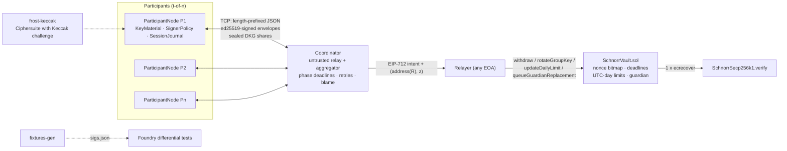
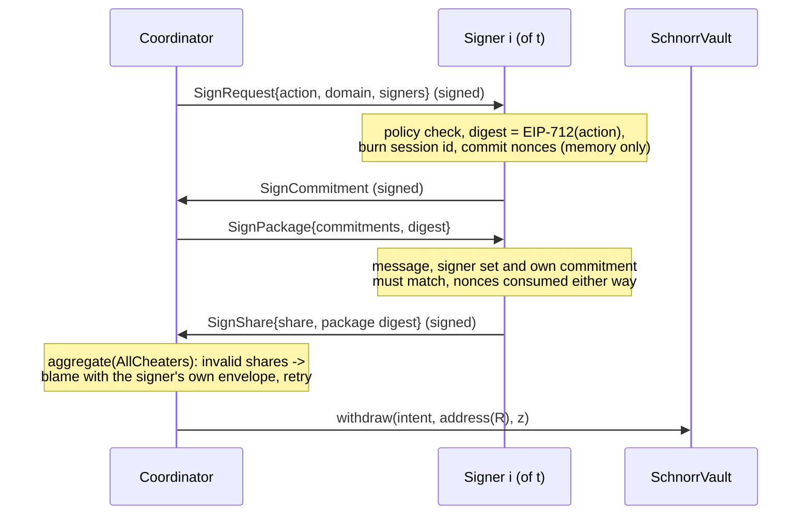

# FROST Threshold-Signature Custody: Rust Signers and On-Chain Schnorr Verification

A t-of-n threshold custody system: Rust signers run a Pedersen DKG and two-round FROST
signing over secp256k1 with a Keccak challenge, talking over authenticated local TCP, and
a Solidity vault verifies the aggregate Schnorr signature with a single `ecrecover`.

[](https://github.com/monzon1985/blockchain/actions/workflows/24-frost-threshold-custody.yml)
[](../../LICENSE)


> Technical demonstration. Not audited, not deployed, no real funds. Not a qualified-custody
> or otherwise compliant custody product.

## What's interesting here

- **One `ecrecover` verifies any t-of-n group signature: 9,107 gas with the group key read
  from storage** (as the vault does; 4,954 with the key in calldata), versus 19,865 gas for an
  OpenZeppelin-ECDSA 3-of-5 multisig check that also reads its signer set from storage, and
  constant in `t` and `n`. The signature is 52 bytes packed (`address(R) ‖ z`, 64 bytes
  ABI-encoded) instead of 3 × 65 = 195.
- **Cross-language differential testing.** `fixtures-gen` runs a real DKG and real FROST
  signing in Rust and emits 13 library cases plus a vault scenario of 11 withdrawal intents, a
  key rotation, a limit change and a guardian change (valid, tampered `R`, tampered `z`, wrong
  message, foreign group, replayed nonce, expired, over limit, stale key after rotation).
  Foundry replays all of them and checks that alloy's EIP-712 digests equal the contract's byte
  for byte; `fixtures-gen --check` fails CI on drift.
- **The coordinator relays and aggregates but cannot take the key.** A dealer reveals a
  disputed DKG share only against the complainant's own signed complaint, and a session with a
  reveal never commits; signers rotate the vault only to a group they hold a share of, at no
  lower threshold; an optional operator approval key takes authorisation away from the
  coordinator as well. Each attack (share harvesting, rotation to a coordinator key, forged
  blame) is replayed by a regression test.
- **Identifiable aborts with verifiable blame.** All 12 fault classes (invalid proof of knowledge,
  malformed commitment, equivocation, inconsistent broadcast, missing or invalid DKG share, false
  complaint, withheld reveal, inconsistent result, invalid signature share, silence, refusal) are
  forced by tests. Every provable blame carries the culprit's own ed25519-signed messages; for the
  six cryptographic faults `Blame::verify` proves the fault from that evidence alone, and honest
  refusals, per-recipient reveals, replayed start messages or non-members cannot be turned into
  such proofs. Chaos tests drop, delay, corrupt and rewrite messages over real TCP.
- **A custom `frost-core` 3.0 ciphersuite** that passes the Zcash Foundation's generic
  conformance suite (16 tests: DKG, refresh, repair, batch verification) and a bit-exact Rust
  model of the Solidity verifier, including an emulation of the `ecrecover` precompile.
- **125 Rust tests** (proptest, networked, multi-process, adversarial coordinator, anvil
  end-to-end) and **71 Foundry tests** with 8 stateful invariants over 16,384 calls per invariant
  campaign plus an end-of-run liveness proof; **100 % line coverage** of the contracts and
  **92.7 %** of the Rust crates, both gated at 90 % in CI.

## Overview

Custody products (Fireblocks, BitGo, Coinbase) split a key so that no single machine can move
funds. Doing this with threshold Schnorr (FROST, RFC 9591) instead of a multisig contract gives
one ordinary signature for any quorum, but three problems remain:

1. **On-chain verification.** The EVM has no Schnorr precompile. Implementing `z·G = R + e·P`
   in Solidity costs hundreds of thousands of gas.
2. **Dishonest participants.** A DKG or signing session can be sabotaged by any participant, and
   a coordinator that relays messages can equivocate or try to frame someone. Aborts must name
   the culprit with evidence, not with the coordinator's word.
3. **Custody hygiene.** Nonce reuse leaks a share; signers must not blind-sign hashes; stolen
   shares must be made useless (refresh) and lost shares recovered (repair).

This project solves (1) with a custom ciphersuite whose challenge is
`e = keccak256(address(R) ‖ parity(P) ‖ P.x ‖ m) mod n`, which lets the vault verify with one
`ecrecover`; (2) with origin-signed envelopes, sealed shares and evidence-carrying complaints;
and (3) with a signer node that computes EIP-712 digests itself, burns session identifiers,
never persists nonces, and supports proactive refresh and share repair.

## Architecture





| Component | Responsibility | Key external calls |
|---|---|---|
| [`crates/frost-keccak`](crates/frost-keccak) | `Secp256K1Keccak256` ciphersuite: reuses the RFC 9591 secp256k1 group, overrides only the challenge; rejects group keys with `P.x >= n` in `post_dkg`; EVM encoding and a bit-exact model of the Solidity verifier | `frost_core::Ciphersuite`, `frost-secp256k1` group, `k256` |
| [`crates/custody-protocol`](crates/custody-protocol) | Sans-IO state machines: DKG/refresh (participant + coordinator), signing, repair, blame; roster, signed envelopes, sealed boxes, EIP-712 intents, signer policy and operator approvals, bounded session tables; in-memory network with fault injection | `frost_core::keys::{dkg, refresh, repairable}`, `ed25519-dalek`, `x25519-dalek`, `chacha20poly1305`, `alloy-sol-types` |
| [`crates/custody-net`](crates/custody-net) | tokio coordinator and participant services, handshake, framing, `frost-custody` CLI (in-process demo or one process per party from a roster file) | `tokio::net` |
| [`crates/fixtures-gen`](crates/fixtures-gen) | Deterministic Rust-signed fixtures for Foundry, `--check` for drift | `custody_protocol::local` |
| [`crates/e2e`](crates/e2e) | DKG → sign → settle on anvil → rotate → stale key rejected | `alloy` 2.5, `anvil` |
| [`contracts/src/SchnorrSecp256k1.sol`](contracts/src/SchnorrSecp256k1.sol) | Schnorr verification with one `ecrecover` | precompile `0x01` |
| [`contracts/src/SchnorrVault.sol`](contracts/src/SchnorrVault.sol) | Custody vault executing group-signed EIP-712 intents | OZ `EIP712`, `Ownable2Step`, `Pausable`, `ReentrancyGuardTransient`, `SafeERC20`, `Address` |

### The ecrecover trick

`ecrecover(h, v, r, s)` returns `address(r⁻¹·(s·R' − h·G))` where `R'` has x-coordinate `r`.
With `r = P.x`, `v = 27 + parity(P)`, `s = −e·P.x` and `h = −z·P.x` (all mod `n`) it returns
`address(z·G − e·P)`, which equals the signature's `address(R)` exactly when
`z·G = R + e·P`. This is why the challenge hashes `address(R)` rather than `R`.

## Roles and trust assumptions

| Role | Powers | If compromised |
|---|---|---|
| Group key (any `t` of `n` participants) | Withdraw within limits, rotate the key (with the new key's proof of possession), change limits (increases wait 2 days), replace the guardian (waits 2 days) | Outside the safety model. The controls bound the damage and buy time: at most the daily limit per token per UTC day; raises and a guardian takeover wait 2 days, during which the guardian can pause withdrawals and cancel raises; if the honest group rotates first, everything the thief queued is void |
| Up to `t-1` participants | None on their own | Nothing: shares reveal nothing, refresh makes them useless |
| Coordinator | Liveness; chooses which actions are requested, unless the signers require an operator approval | Can stall sessions and, without an approver, get any action signed that the signers' policy and the vault's limits allow. Cannot read or harvest shares, rotate the vault to a key the signers do not hold, lower the threshold, forge messages or frame participants |
| Operator approver (optional) | Signs off each action (ed25519 over the EIP-712 digest) | Nothing alone: holds no share; together with the coordinator, the case above |
| Guardian (`Ownable2Step` owner) | `pause`, `unpause`, `cancelDailyLimitIncrease` | Can freeze withdrawals and cancel raises; cannot move funds; cannot block its own replacement by the group (2-day time lock); cannot be renounced |
| Relayer | Submits signed intents | Nothing beyond gas griefing its own transactions |

The detailed threat model is in [docs/THREAT-MODEL.md](docs/THREAT-MODEL.md).

## Invariants and properties

On-chain, stateful (handler-based, ghost variables): [`test/invariant/VaultInvariants.t.sol`](contracts/test/invariant/VaultInvariants.t.sol)

- I1. **Daily cap.** Withdrawals of a token during a UTC day never exceed the highest limit in effect that day, and `spentToday` equals the independent model. `invariant_dailyCapNeverExceeded`
- I2. **Conservation.** Vault balance = initial + deposits − withdrawals, for ETH and the ERC-20. `invariant_assetsAreConserved`
- I3. **Single-use nonces.** Every executed intent burned its nonce; no replay ever succeeds. `invariant_noncesAreSingleUse`
- I4. **Only the current key authorises.** Keys retired by rotation never authorise again; the epoch counts rotations. `invariant_onlyCurrentKeyAuthorises`
- I5. **Time-locked raises.** Limits follow the model: decreases immediate, increases never before `LIMIT_INCREASE_DELAY`. `invariant_limitIncreasesAreTimeLocked`
- I6. **Pause.** Nothing leaves the vault while paused. `invariant_pauseBlocksWithdrawals`
- I7. **Queued changes wait and die with their key.** The guardian changes only through its own two-step transfer or a group replacement that waited `GUARDIAN_CHANGE_DELAY`; nothing queued under a retired key ever takes effect. `invariant_queuedChangesRespectDelayAndEpoch`
- I8. **Valid actions succeed.** Every call the model says is valid (fresh nonce, current key, in limit, unpaused, mature, unexpired) succeeds, so the handler's `try/catch` cannot hide a regression that makes intents revert. `invariant_validActionsSucceed`

After every run, `afterInvariant` checks that the run executed signed actions and, on a state
snapshot, that the vault it left behind still works: the guardian unpauses, a fresh in-limit
withdrawal pays out, a rotation succeeds, the retired key is rejected and the new key accepted.

Protocol properties. P1–P4 and P6 are proptests in [`crates/custody-protocol/tests/properties.rs`](crates/custody-protocol/tests/properties.rs), P5 in [`crates/frost-keccak/tests/evm_verifier.rs`](crates/frost-keccak/tests/evm_verifier.rs), P7 in [`crates/frost-keccak/tests/rfc9591_vectors.rs`](crates/frost-keccak/tests/rfc9591_vectors.rs); P8 and P9 are unit tests in [`signing.rs`](crates/custody-protocol/tests/signing.rs) and [`adversarial.rs`](crates/custody-protocol/tests/adversarial.rs).

- P1. **Any t-subset signs**, for random `2 <= t <= n <= 5` and random signer sets, and the result verifies in frost-core and in the EVM model. `any_t_subset_signs`
- P2. **Fewer than t cannot sign**: `t-1` real shares, re-labelled as a threshold-`(t-1)` set so that every parameter check passes, produce shares that frost-core's aggregation rejects, and the hand-assembled `(R, z)` fails both frost-core and the EVM model. `fewer_than_t_signers_cannot_sign` (plus the interpolation sanity check `fewer_than_t_shares_cannot_recover_the_key`)
- P3. **Refresh preserves the group key** and changes every share; refreshed shares still sign. `refresh_preserves_the_group_key`
- P4. **Repair restores exactly the lost share** from any `t` helpers. `repair_restores_the_lost_share`
- P5. **The two verifiers agree**: frost-core and the ecrecover model accept every valid signature and reject every tampering (`R`, `z`, message, key parity, zero or out-of-range fields). `valid_threshold_signatures_verify_on_both_paths`, `tampered_signatures_are_rejected_by_both_paths`
- P6. **Sealed boxes** open only with the recipient's key and the exact context; **envelopes** reject any modified byte or re-attribution. `sealed_boxes_are_bound_to_key_context_and_content`, `envelopes_are_authenticated`
- P7. **The custom suite differs from RFC 9591 only in the context string** (and the challenge): the project's own `H1/H3/H4/H5/HDKG/HID` under the RFC context equal `frost-secp256k1`'s on random inputs and reproduce the vectors' nonces and binding factors. `project_hashes_differ_from_rfc9591_only_in_the_context_string`
- P8. **No nonce reuse**: one commitment per session, one share per commitment, and a package for another message consumes the nonces without producing a share. `signer_never_reuses_nonces`
- P9. **A malicious coordinator gets no key material and cannot redirect the vault**: unsolicited reveal requests are refused, a session with a reveal never commits, rotations to keys the signers do not hold (or at a lower threshold) are refused, and with an approver nothing is signed without its approval. `adversarial::*`

## Security considerations

Summary of [docs/THREAT-MODEL.md](docs/THREAT-MODEL.md):

- **DKG complaints are evidence, not accusations.** Each share travels as a dealer-signed statement
  inside a sealed box. A recipient that finds the share invalid reveals the statement; anyone can
  check the dealer's signature and the Feldman equation. A forged or unfounded complaint blames the
  complainant. An unopenable box triggers a reveal request that must carry the complainant's own
  signed complaint; the dealer reveals only that share, and the session can then never commit. A
  dealer that stays silent is blamed, and a valid reveal ends in a recorded, unattributed dispute.
- **The coordinator cannot equivocate undetected.** Participants echo a digest of the round-one set,
  commit only against a certificate of `n` identical signed results, derive signing digests themselves
  and bind each signature share to the package it signed. Every session id is burned in the node's
  journal before its first answer, so replayed start messages are refused.
- **Signers decide what they sign.** The signer policy pins the vault and chain and can cap amounts
  and limits, allowlist recipients and guardians, and require an operator's ed25519 approval of the
  exact EIP-712 digest. A key rotation is only signed towards a group the signer holds a committed
  share of, at no lower threshold.
- **Nonce reuse** is prevented by burning session identifiers before commitments leave the signer
  (optionally in an fsynced journal), keeping nonces only in memory and consuming them on first use.
- **Bounded resources.** Nodes hold at most 64 in-flight sessions of each kind and expire them after
  10 minutes (secrets zeroised); frames are capped at 4 KiB before authentication and 4 MiB after;
  pending handshakes are capped; the coordinator never blocks on a participant that stops reading.
- **On-chain:** EIP-712 domain binding, unordered nonces, inclusive deadlines, canonical `z < n`,
  `0 < P.x < n`, reentrancy guard, SafeERC20, per-UTC-day limits, time-locked raises and guardian
  replacement, proof of possession on rotation, permanent key retirement, rotation voiding every
  change queued under the retired key, and the consumed nonce in every group-signed event. Slither
  0.11.6 reports no findings after the triaged `timestamp` detector (justification in
  [`contracts/slither.config.json`](contracts/slither.config.json)); `forge lint --deny warnings`
  passes with two rules triaged in [`contracts/foundry.toml`](contracts/foundry.toml) and eight
  justified inline suppressions.
- **Known limitations:** shares are not persisted at all (process memory only); without an approver
  key the coordinator's operator decides which in-policy actions are signed; equivocation evidence
  across node restarts needs the persisted journal; the DKG is not robust to dropouts (it aborts
  and restarts without the named parties); the coordinator is a liveness single point of failure; a
  bad repair sigma cannot be attributed; fixed UTC-day windows allow up to twice the limit around
  midnight. The `address(R)` challenge binds `R` through 160 bits (see T10).

## Design decisions and trade-offs

| Decision | Why | Cost |
|---|---|---|
| Replace only the challenge; keep RFC 9591 hashes for `H1/H3/H4/H5/HDKG/HID` under the context string `FROST-secp256k1-KECCAK256-v1` | The RFC vectors validate the upstream group, scalar and signing code; the project's own hash helpers take the context string as a parameter and are proven equal to the standard suite's under the RFC context (P7); transcripts are domain-separated from the standard suite | Not interoperable with plain `FROST(secp256k1, SHA-256)` signers |
| Challenge over `address(R)` | 52-byte signatures, one `ecrecover`, no curve arithmetic in Solidity | Binding to `R` through a 160-bit value (T10) |
| Reject `P.x >= n` in `post_dkg` | `ecrecover` requires `r < n`; failing at keygen (probability 2⁻¹²⁸) beats an unusable vault | none in practice |
| Untrusted coordinator, origin-signed envelopes, sealed shares | Blame is verifiable by third parties; the relay never sees secrets | Signature and seal on every message |
| Reveal only against the complainant's signed complaint; a revealed session never commits | Without the evidence rule a coordinator could collect `n-1` points of every polynomial and interpolate the key | A dispute always costs a DKG restart |
| Rotation rule enforced by the signers, not an on-chain rotation time lock | Rotation is the incident response to a leaked key and must be fast; signers only rotate to a group they hold, at no lower threshold, so a coordinator cannot redirect it | A rotation the honest group signs takes effect at once |
| Optional operator approval (ed25519 over the EIP-712 digest) | Takes authorisation away from the coordinator without adding a signing key or share | One more key and message per action; off by default in the demos |
| Signers receive structured intents, not hashes | No blind signing; per-signer policy (pinned vault and chain, amount and limit caps, recipient and guardian allowlists, rotation opt-out, approver) | Signers must understand every action type |
| Sans-IO state machines | The same code runs in the deterministic in-memory network (tests, fixtures) and over TCP | A small driver per transport |
| Unordered nonce bitmap shared by all intent types | Intents can be signed in parallel and executed in any order | Revocation relies on short deadlines |
| Fixed UTC-day windows | One packed slot per token, exact invariant | Up to 2× limit across midnight; OZ 5.7 `RateLimiter.SlidingWindow` is the alternative |
| Guardian can pause but never move funds; the group replaces it only after 2 days | Incident response without adding a fund-moving key; a stolen group key cannot silence the guardian first | A rogue guardian can freeze withdrawals for up to 2 days after the group queues its replacement |
| Queued changes carry the key epoch | A rotation away from a leaked key discards the thief's queued raises and guardian takeover without iterating storage | 64 bits in each queued slot |
| `frost-core` 3.0.0 instead of 2.x | Current release: cheater detection returns **all** culprits, `min_signers` stored in `PublicKeyPackage` (refresh safety), typed repair API | Deviates from the original spec text (see Scope notes) |

## Testing

```bash
# from projects/24-frost-threshold-custody
cargo fmt --all --check
cargo clippy --workspace --all-targets -- -D warnings
cargo test --workspace
cargo run -p fixtures-gen -- --check
cd contracts && forge soldeer install && forge fmt --check && forge build \
  && forge lint --deny warnings \
  && FORGE_SNAPSHOT_CHECK=true forge test --match-contract GasBench \
  && forge snapshot --check --match-contract GasBench && forge test && cd ..
cargo test -p e2e --features anvil -- --test-threads=1
```

CI additionally runs every cargo command with `--locked`, `cargo llvm-cov --fail-under-lines 90`,
`forge coverage` with a 90 % line gate, Slither (`slither . --config-file slither.config.json` in
`contracts/`) and the CLI demo. `foundry.toml` sets `gas_snapshot_emit = false`, so neither tests
nor coverage can rewrite `snapshots/GasBench.json`; regenerate it on purpose with
`FORGE_SNAPSHOT_EMIT=true forge test --match-contract GasBench`.

| Suite | Location | Tests | What it covers |
|---|---|---|---|
| RFC 9591 vectors | `crates/frost-keccak/tests/rfc9591_vectors.rs` | 5 (1 proptest × 256) | Standard suite, every intermediate value (nonces, binding factors, shares, signature); the project's hash helpers under the RFC context (P7) |
| frost-core conformance | `crates/frost-keccak/tests/frost_core_conformance.rs` | 16 | ZF generic suite run against the custom ciphersuite |
| EVM verifier model | `crates/frost-keccak/tests/evm_verifier.rs` | 10 (3 proptest × 64) | Known answer vs `cast keccak`, ecrecover emulation, differential frost-core vs EVM model |
| DKG and refresh | `crates/custody-protocol/tests/dkg.rs` | 18 | Every complaint path, commit certificate, refresh, eviction |
| Signing, repair | `crates/custody-protocol/tests/signing.rs` | 18 | Identifiable aborts, retries, nonce reuse (P8), policy, stolen pre-refresh share, repair |
| Adversarial coordinator | `crates/custody-protocol/tests/adversarial.rs` | 4 | Share harvesting via reveal requests, poisoned sessions, rotation to a coordinator key or a weaker group, operator approvals (P9) |
| Blame verification | `crates/custody-protocol/tests/blame.rs` | 7 | Evidence bound to session, mode, party and signing package; framing with honest refusals, reveals, replayed starts and non-members rejected |
| Validation | `crates/custody-protocol/tests/validation.rs` | 9 | Parameter checks, silent parties in every phase, unexpected messages, bounded and expiring sessions, every message type in a transcript |
| Properties | `crates/custody-protocol/tests/properties.rs` | 7 (5 × 32, 2 × 256 cases) | P1–P4, P6 |
| Encodings | `crates/custody-protocol/tests/wire.rs` | 8 | EIP-712 type strings, roster and key files, policy rules and policy file format |
| Unit | `custody-protocol` `sessions.rs`, `custody-net` `coordinator.rs` | 2 | Session table capacity and expiry; dispatch never blocks on a stalled participant |
| Network chaos | `crates/custody-net/tests/network.rs` | 8 | Full lifecycle over TCP; drop, delay, corrupt, Byzantine rewrite, disconnect |
| Handshake and service limits | `crates/custody-net/tests/handshake.rs` | 9 | Impersonation, stale challenge, fake coordinator, frame limits before and after authentication, pending-handshake cap and task reaping, session expiry in the participant service |
| Multi-process | `crates/custody-net/tests/multiprocess.rs` | 1 | Coordinator + 3 participant OS processes from a roster file, starting from a stale address file |
| Fixtures | `crates/fixtures-gen/tests/determinism.rs` | 2 | Determinism, recorded verdicts match the Rust model |
| End-to-end | `crates/e2e/tests/anvil.rs` (`--features anvil`) | 1 | DKG → sign → settle on anvil → rotate → stale key rejected |
| Vault unit | `contracts/test/SchnorrVault.t.sol` | 48 | Every external function, every revert |
| Library | `contracts/test/SchnorrSecp256k1.t.sol` | 9 (4 fuzz) | Known answer, malformed inputs, fuzzed keys/messages/tampering |
| Rate-limit fuzz | `contracts/test/RateLimit.fuzz.t.sol` | 3 | Reference model of the daily limit and the time lock |
| Differential | `contracts/test/RustFixtures.t.sol` | 2 | Rust-generated signatures and digests |
| Invariants | `contracts/test/invariant/VaultInvariants.t.sol` | 8 invariants + `afterInvariant` | 256 runs × depth 64 = 16,384 calls per campaign, every invariant checked after each call |
| Gas | `contracts/test/GasBench.t.sol` | 7 | Snapshot-checked in CI |
| Deploy script | `contracts/test/DeployScript.t.sol` | 1 | Environment wiring |

Totals: **124** Rust tests in `cargo test --workspace` plus **1** anvil end-to-end test;
**71** Foundry tests (the invariant suite counts as one test with eight invariants).

**Coverage.** Contracts (`forge coverage`, production sources): **100 % lines (140/140)**,
99.32 % statements (146/147), 98.00 % branches (49/50), 100 % functions (31/31). The uncovered
branch is `ePx == 0` in `SchnorrSecp256k1.verify`, which needs a Keccak output equal to 0 mod n.
Rust (`cargo llvm-cov`, every crate except `fixtures-gen`, `e2e` and test files, including the CLI
exercised by the multi-process test): **92.71 % lines (4,453/4,803)**, 92.44 % functions and
about 90.1 % regions (the region figure moves by a few hundredths between runs because the
networked tests are timing-dependent).

**Fuzz and invariant settings.** Default profile: 1,024 fuzz runs, 256 invariant runs × depth 64.
CI profile (`FOUNDRY_PROFILE=ci`): 4,096 fuzz runs with fixed seed `0x2424`, 512 × 128 invariant
calls. Proptest seeds are fixed in CI with `PROPTEST_RNG_SEED=24`.

## Gas

Callee-frame gas from `vm.snapshotGasLastFrame` ([`contracts/snapshots/GasBench.json`](contracts/snapshots/GasBench.json));
per-test totals are pinned in [`contracts/.gas-snapshot`](contracts/.gas-snapshot).

| Operation | Gas |
|---|---:|
| `SchnorrSecp256k1.verify`, group key read from storage (2 cold slots, as in the vault) | **9,107** |
| `SchnorrSecp256k1.verify`, group key passed in calldata | 4,954 |
| Baseline: 3-of-5 multisig, three OZ `ECDSA.recover` + membership (3 cold `SLOAD`s) | 19,865 |
| `withdraw` ETH (first withdrawal of the day, fresh nonce word) | 96,442 |
| `withdraw` ERC-20 | 102,945 |
| `rotateGroupKey` (two Schnorr verifications, key retirement) | 96,390 |
| `updateDailyLimit` (decrease) | 65,585 |

The like-for-like comparison is the first row against the baseline: both read their keys from
storage (about 4,200 gas for the Schnorr key's two cold slots, 6,300 for the baseline's three
signer lookups), so one aggregate Schnorr signature is about 2.2× cheaper than three ECDSA
signatures, and the gap grows with the quorum: the Schnorr path is constant for any `t`, while the
baseline adds about 6,600 gas and 65 bytes of calldata per signature. The withdrawal figures are
dominated by the two zero-to-non-zero storage writes (nonce word and daily usage), not by
signature verification.

## Getting started

Prerequisites: Rust 1.98.1 (on Windows the MSVC toolchain with the VS 2022 C++ build tools),
Foundry 1.8.3 (`forge`, `anvil` on `PATH`). No RPC endpoints, API keys or forks.

```bash
cd projects/24-frost-threshold-custody
cargo build --workspace
(cd contracts && forge soldeer install && forge build)
cargo test --workspace
(cd contracts && forge test)
cargo test -p e2e --features anvil -- --test-threads=1
```

Local demo (coordinator and five participants on loopback TCP, OS-assigned port):

```bash
cargo run -p custody-net --bin frost-custody -- demo --participants 5 --threshold 3
```

It runs a DKG, threshold-signs one withdrawal and prints the group key, the EIP-712 digest and
the `(rAddr, z)` signature. This is a demonstration, not something to submit on-chain: the
signature is bound to the `--vault`/`--chain-id` domain (a placeholder vault on chain 31337 by
default), and the key shares exist only in the process's memory, so the group is gone when it
exits. The same flow with one OS process per party, from a static roster:

```bash
cargo run -p custody-net --bin frost-custody -- roster --participants 3 --out ./keys
rm -f keys/coordinator.addr   # optional: the coordinator also replaces a stale file
# one terminal per participant
cargo run -p custody-net --bin frost-custody -- participant --roster keys/roster.json \
  --key keys/participant-1.key.json --addr-file keys/coordinator.addr
cargo run -p custody-net --bin frost-custody -- participant --roster keys/roster.json \
  --key keys/participant-2.key.json --addr-file keys/coordinator.addr
cargo run -p custody-net --bin frost-custody -- participant --roster keys/roster.json \
  --key keys/participant-3.key.json --addr-file keys/coordinator.addr
# and the coordinator
cargo run -p custody-net --bin frost-custody -- coordinator --roster keys/roster.json \
  --key keys/coordinator.key.json --threshold 2 --addr-file keys/coordinator.addr
```

Participants wait up to 60 s (`--wait-secs`) for a reachable coordinator, re-reading the address
file after every failed attempt; the coordinator waits up to 60 s (`--connect-timeout-secs`) for
every participant and deletes the address file when it exits. `keys/` holds demo secrets and is
git-ignored.

**Deploying.** [`contracts/script/DeploySchnorrVault.s.sol`](contracts/script/DeploySchnorrVault.s.sol)
(Foundry keystore via `--account`, never a raw key) is a template, exercised by
`DeployScriptTest`. Only use it for a group whose key packages are persisted somewhere and whose
signers are pinned to the deployed vault's address and chain id: a vault deployed for a key the
CLI printed could never withdraw, rotate or replace its guardian, and deposits would be locked for
good. The complete deploy → fund → withdraw → rotate flow runs in the anvil end-to-end test, which
predicts the vault address before the DKG so the signers can pin it.

## Project structure

```
24-frost-threshold-custody/
├── Cargo.toml / Cargo.lock / rust-toolchain.toml / clippy.toml / rustfmt.toml / .gitignore
├── crates/
│   ├── frost-keccak/        # custom ciphersuite + EVM model; RFC 9591 vectors, ZF conformance
│   ├── custody-protocol/    # keygen, signing, repair, blame, envelopes, sealed boxes, intents, policy
│   ├── custody-net/         # tokio services, handshake, framing, frost-custody CLI
│   ├── fixtures-gen/        # writes contracts/test/fixtures/sigs.json (--check for drift)
│   └── e2e/                 # anvil end-to-end test (feature "anvil")
├── contracts/
│   ├── foundry.toml / soldeer.lock / slither.config.json / .gas-snapshot
│   ├── src/                 # SchnorrSecp256k1.sol, SchnorrVault.sol, ISchnorrVault.sol
│   ├── script/              # DeploySchnorrVault.s.sol (keystore-based)
│   ├── snapshots/           # per-call gas (vm.snapshotGasLastFrame)
│   └── test/                # unit, fuzz, invariants, Rust differential fixtures, gas
└── docs/THREAT-MODEL.md
```

## Scope notes and future work

- **frost-core 3.0.0 instead of 2.x.** The spec named frost-core 2.x; 3.0.0 is the current release
  and brings `CheaterDetection::AllCheaters`, the threshold stored in `PublicKeyPackage` (which the
  refresh functions validate) and a typed repair API. The custom ciphersuite uses the `internals`
  feature to build a `Challenge`, as the ZF `frost-secp256k1-tr` crate does.
- **RFC 9591 vectors** validate the upstream group, scalar and signing code through the standard
  `FROST(secp256k1, SHA-256)` suite, and the project's own hash helpers under the RFC context (P7).
  The custom suite has no official vectors, so it is covered by the ZF conformance suite, a
  `cast keccak` known answer and the Solidity differential tests.
- **Transport** uses ed25519-signed envelopes and X25519/ChaCha20-Poly1305 sealed boxes rather than
  TLS or Noise, so that messages stay attributable after relaying. Non-secret messages are not encrypted.
- **Not implemented:** persisted (and sealed) storage of shares (encrypted key-package files, HSM,
  enclave, OS key store) and a CLI `sign` command against a deployed vault, a robust DKG that
  tolerates dropouts, ROAST-style asynchronous signing, a rolling-window rate limit, and deployment
  beyond a local machine. The approver is available in the library and the services
  (`sign_approved`, `sign_with_retry_approved`) but not exposed as a CLI flag.

## References

- C. Komlo, I. Goldberg, *FROST: Flexible Round-Optimized Schnorr Threshold Signatures*, SAC 2020.
- RFC 9591, *The Flexible Round-Optimized Schnorr Threshold (FROST) Protocol for Two-Round Schnorr Signatures* (test vectors in `crates/frost-keccak/tests/vectors`).
- Zcash Foundation, [`frost-core`, `frost-secp256k1`, `frost-secp256k1-tr`](https://github.com/ZcashFoundation/frost): the FROST implementation, generic conformance tests and the custom-ciphersuite pattern this project builds on.
- T. Pedersen, *A Threshold Cryptosystem without a Trusted Party*, EUROCRYPT 1991; R. Gennaro, S. Jarecki, H. Krawczyk, T. Rabin, *Secure Distributed Key Generation for Discrete-Log Based Cryptosystems*, EUROCRYPT 1999, and *Secure Applications of Pedersen's Distributed Key Generation Protocol*, CT-RSA 2003.
- A. Herzberg, S. Jarecki, H. Krawczyk, M. Yung, *Proactive Secret Sharing, or: How to Cope with Perpetual Leakage*, CRYPTO 1995.
- T. M. Laing, D. R. Stinson, *A Survey and Refinement of Repairable Threshold Schemes*, ePrint 2017/1155.
- V. Buterin, *You can kinda abuse ECRECOVER to do ECMUL in secp256k1 today*, ethresear.ch, 2018; Chainlink `SchnorrSECP256K1.sol`; `noot/schnorr-verify`: the ecrecover-based Schnorr verification this vault adapts to FROST's `z = k + e·x` convention.
- EIP-712 (typed structured data), EIP-155 (chain id); Uniswap Permit2 (unordered nonce bitmaps).
- OpenZeppelin Contracts 5.7 (`EIP712`, `Ownable2Step`, `Pausable`, `ReentrancyGuardTransient`, `SafeERC20`, `RateLimiter`).
- T. Ruffing, V. Ronge, E. Jin, J. Schneider-Bensch, D. Schröder, *ROAST: Robust Asynchronous Schnorr Threshold Signatures*, CCS 2022 (future work).
