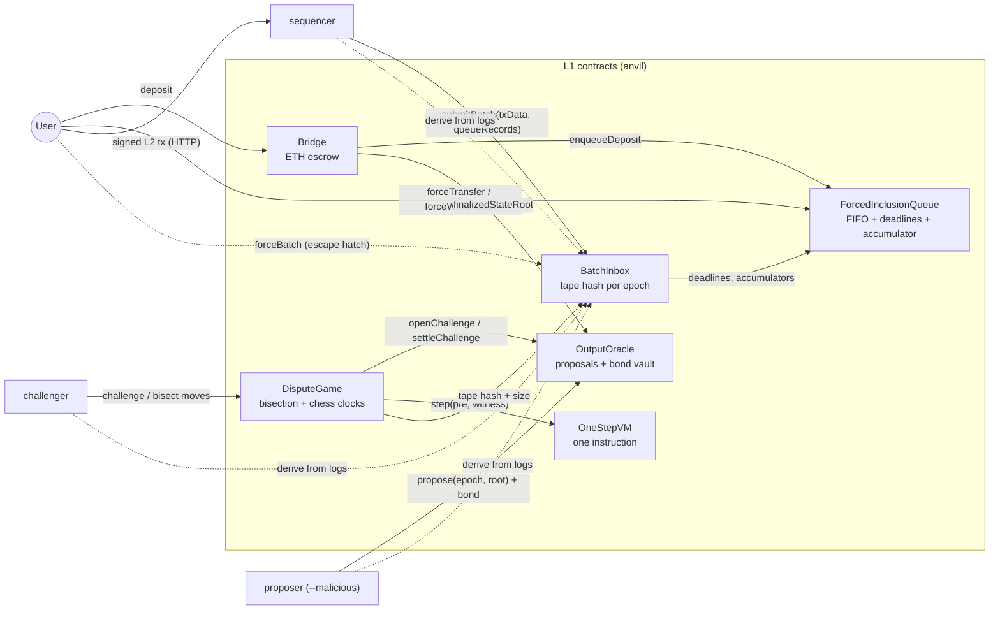

# Minimal Optimistic Rollup: Rust Node, Interactive Bisection, One-Step VM and Forced Inclusion

A working optimistic rollup for ETH transfers. A Rust sequencer, proposer and challenger run against six L1 contracts
on anvil: a calldata batch inbox, bonded output roots, a chess-clocked bisection game that narrows a dispute down to one
instruction executed by a Solidity stack VM, a forced-inclusion queue, and Merkle-proof withdrawals.

[](https://github.com/monzon1985/blockchain/actions/workflows/25-optimistic-rollup-bisection.yml)


> Technical demonstration. Nothing in this repository has been audited or deployed with real funds.

## What's interesting here

- **The Rust VM and the Solidity one-step verifier are differential-fuzzed against each other inside revm.** The
  compiled `OneStepVM` is loaded from `contracts/out` into an in-memory EVM; 256 random programs × up to 48 steps, every
  step of 12 random STF batches, and all **11,832 steps of the largest batch the inbox accepts** produce identical
  post-states in Rust and Solidity. A property test mutates each witness component (every scalar field, a random
  element of each array, a random bit of the sibling bitmap, truncations, the tape) and checks that no forged witness
  ever yields a different post-state (it reverts or is irrelevant).
- **A full fraud proof runs end to end on anvil.** A `--malicious` proposer mints 1,000 ETH to itself half-way
  through an epoch and defends the claim with a self-consistent fake trace. The challenger re-derives the epoch from
  L1 logs, plays 16 bisection rounds (34 L1 moves) and lands exactly on the forged step (step 33, the midpoint of the
  epoch's trace); `OneStepVM` executes that single instruction, the proposer's 1 ETH bond is slashed (0.9 ETH to the
  challenger, 0.1 ETH burned) and an honest proposer takes over.
- **Stage-1-style censorship resistance that is enforced on L1, not by convention.** `BatchInbox` refuses any batch
  that leaves out a queue message more than 10 L1 blocks old, and anyone can post a queue-only `forceBatch`. The e2e
  suite runs a censoring sequencer and shows the user's forced transfer landing anyway.
- **The state-transition function is a 327-instruction program for a 24-opcode stack VM** (signature checks via an
  `ECRECOVER` opcode that mirrors the precompile, a 256-level sparse Merkle tree via `SLOAD`/`SSTORE`). A native Rust
  STF is kept as a second, independent implementation and property-tested against it.
- **Tested at every layer:** 97 Foundry unit, fuzz and baseline tests plus 6 stateful invariants (bond conservation,
  burn = 10% of forfeits, games end within 2D + 2 moves and 2 × clock), **100% line / 98.2% branch coverage** of
  `src/`; 90 Rust unit/property/differential tests, 9 end-to-end scenarios on anvil and the README demo driven through
  the real binaries, together **94.4% line coverage** of the Rust crates. Slither reports 0 findings with every
  security detector enabled (known sites triaged inline).

## Overview

An optimistic rollup posts its transactions to L1 and lets anyone claim the resulting state. Claims are accepted
after a challenge window unless someone proves them wrong. Proving a whole epoch wrong on L1 is far too expensive, so
the two parties **bisect** the execution trace: they agree on the state at step 0, disagree on the final state, and
halve the disputed range until one instruction separates an agreed state from a disputed one. L1 then executes just
that instruction.

Doing this soundly needs:

1. a state-transition function whose execution can be **committed step by step** (here: a stack VM whose full state
   hashes to one word after every instruction);
2. an **on-chain interpreter for exactly one instruction** that accepts a Merkle-proven pre-state, and that agrees with
   the off-chain interpreter on every instruction, including every error case (here: differential fuzzing in revm);
3. an L1 commitment to the **exact input** of each epoch, so step 0 is objective (here: the inbox hashes
   `[queueCount] ++ queueRecords ++ txData` itself);
4. **liveness guarantees**: chess clocks so no party can stall forever, bonds so honest parties are paid for playing,
   and forced inclusion so the sequencer cannot censor deposits and exits.

## Architecture



| Component | Responsibility | Key external calls |
|---|---|---|
| [`ForcedInclusionQueue`](contracts/src/ForcedInclusionQueue.sol) | FIFO of L1-originated messages (deposits, forced transfers/withdrawals) with a hash-chain accumulator and a 10-block inclusion deadline | none |
| [`BatchInbox`](contracts/src/BatchInbox.sol) | Accepts sequencer batches and permissionless forced batches; checks the queue range against the accumulator, refuses batches that skip overdue messages, stores `keccak256(tape)` and its size per epoch | `QUEUE` (views) |
| [`OutputOracle`](contracts/src/OutputOracle.sol) | Bonded proposals, one canonical chain of epochs; finalization after the window; truncation on invalidation; holds every bond and pays credits (pull) | `INBOX.batchCount` |
| [`DisputeGame`](contracts/src/DisputeGame.sol) | Two-party bisection over `2^16`-step traces, chess clocks, timeouts, settlement | `ORACLE`, `INBOX.batch`, `VM.stepHash` |
| [`OneStepVM`](contracts/src/OneStepVM.sol) | Executes one VM instruction from a committed machine plus a witness (OZ Merkle proof for code, stack hash chain, SMT proof, tape) | `ecrecover` precompile |
| [`Bridge`](contracts/src/Bridge.sol) | Escrows deposits; pays withdrawals proven by SMT proof against a finalized state root | `QUEUE`, `ORACLE` |
| [`rollup-vm`](crates/vm) | Interpreter, per-step commitment, witness generation, SMT, assembler | - |
| [`rollup-stf`](crates/stf) | Tape format, the STF program, native reference STF, padded traces, fault injection | - |
| [`rollup-l1`](crates/l1) | `sol!` bindings, artifact loading, deployment | L1 RPC |
| [`rollup-diff`](crates/diff) | Runs the compiled `OneStepVM` in revm for differential tests | revm |
| [`rollup-node`](crates/node) | Derivation from L1 logs (two full states kept, the rest rebuilt on demand); `sequencer` (HTTP API, nonce-checked mempool), `proposer`, `challenger`, `rollup-cli` binaries; checks the deployment descriptor against L1 at start-up | L1 RPC |
| [`e2e`](crates/e2e) | anvil + deployment + services harness and the scenarios | anvil |
| [`rollup-economics`](crates/economics) | Bond sizing and delay-attack model ([`docs/ECONOMICS.md`](docs/ECONOMICS.md)) | - |

The full VM and STF specification is in [`docs/VM_SPEC.md`](docs/VM_SPEC.md).

### Lifecycle of an epoch

1. Users deposit through `Bridge` (enqueued) or send signed transactions to the sequencer's HTTP API.
2. The sequencer posts `submitBatch(txData, queueRecords)`; the inbox checks the queue range, enforces deadlines and
   stores `keccak256([Q] ++ queueRecords ++ txData)` as the epoch's input commitment.
3. Every node derives the epoch from `MessageEnqueued` and `BatchAppended` logs and executes the VM program on it.
4. A proposer bonds 1 ETH on `stateRoot(epoch)`. During the window, any challenger that derives a different root
   opens a game (0.5 ETH). Step 0 is computed on L1; the defender reveals its final (halted) machine; 16 rounds of
   midpoint/choice follow; `OneStepVM` executes the last disputed instruction.
5. After the window, with no open game, the output finalizes and withdrawals against its state root become payable.

## Roles and trust assumptions

| Role | Holder | What a compromised or malicious holder can do |
|---|---|---|
| Inbox owner (`Ownable2Step`) | deployer | Install a censoring or absent sequencer. Cannot touch funds or outputs; forced inclusion keeps messages flowing. |
| Sequencer | one address | Order and censor L2 transactions; delay queue messages by at most 10 L1 blocks. Cannot mint or forge transactions. |
| Proposer | anyone with a bond | Claim a wrong root and lose the bond; delay finalization (see [ECONOMICS](docs/ECONOMICS.md)). |
| Challenger | anyone with a bond | Dispute a correct output and lose 90% of the bond to the defender (10% burned). |

No contract is upgradeable. Safety relies on **one honest challenger** watching every epoch and moving within its
clock, on L1 including dispute transactions in time, and on L1 logs being available. Details:
[`docs/THREAT_MODEL.md`](docs/THREAT_MODEL.md).

## Invariants and properties

Stateful invariants (Foundry, handler-based, [`test/invariant`](contracts/test/invariant)):

1. **I1 Vault backing**: the oracle's ETH balance equals locked bonds + unclaimed credit + burned amount.
   ([`invariant_I1_vaultIsFullyBacked`](contracts/test/invariant/Protocol.invariant.t.sol))
2. **I2 Bond conservation**: every wei bonded is either still held by the oracle or was paid out by a claim; the game
   contract never holds ETH. ([`invariant_I2_bondConservation`](contracts/test/invariant/Protocol.invariant.t.sol))
3. **I3 Burn**: the burned amount is exactly 10% of every forfeited bond.
   ([`invariant_I3_burnIsTenPercentOfForfeits`](contracts/test/invariant/Protocol.invariant.t.sol))
4. **I4 Bounded moves**: a game never takes more than `2 · MAX_DEPTH + 2` moves.
   ([`invariant_I4_movesBoundedByDepth`](contracts/test/invariant/Protocol.invariant.t.sol))
5. **I5 Termination**: every open game can be timed out by `createdAt + 2 · CLOCK` (chess clocks), and the disputed
   range never exceeds `2^MAX_DEPTH`. ([`invariant_I5_gameTerminatesWithinTwoClocks`](contracts/test/invariant/Protocol.invariant.t.sol))
6. **I6 Finality**: finalized epochs form a contiguous prefix below the canonical head and stay finalized.
   ([`invariant_I6_finalizedPrefix`](contracts/test/invariant/Protocol.invariant.t.sol))

Properties (Rust `proptest`, Foundry fuzz):

7. **Rust VM = Solidity VM** on every instruction, full post-state equality, including error semantics and `ecrecover`
   edge cases. ([`random_programs_agree_step_by_step`](crates/diff/tests/differential.rs),
   [`stf_program_traces_agree_on_every_step`](crates/diff/tests/differential.rs),
   [`ecrecover_matches_the_precompile`](crates/diff/tests/differential.rs))
8. **Witness soundness**: tampering with any witness component (scalar fields, any array element, any bitmap bit,
   truncated arrays, the tape) makes the verifier revert or leaves the post-state unchanged.
   ([`tampered_witnesses_never_change_the_post_state`](crates/diff/tests/differential.rs))
9. **VM program = native STF** on random batches and on arbitrary garbage tapes, and the program always halts.
   ([`vm_program_matches_native_stf`, `arbitrary_tapes_halt_and_agree`](crates/stf/src/tests.rs))
10. **Value conservation**: deposits = Σ balances + Σ withdrawals. ([`value_is_conserved`](crates/stf/src/tests.rs))
11. **SMT**: incremental roots equal a from-scratch recomputation; proofs verify for members and non-members and bind
    the value; insertion order is irrelevant. ([`smt.rs` tests](crates/vm/src/smt.rs))
12. **Bisection converges to the faulty step**, and whatever a dishonest party plays, the honest party wins.
    ([`fault_diverges_exactly_where_injected_and_bisection_finds_it`](crates/stf/src/tests.rs),
    [`testFuzz_honestChallengerAlwaysWins`, `testFuzz_honestDefenderAlwaysWins`](contracts/test/DisputeGame.t.sol))

## Security considerations

The threat model ([`docs/THREAT_MODEL.md`](docs/THREAT_MODEL.md)) lists 21 threats with their mitigation and the test
that covers each, classified with the OWASP Smart Contract Top 10 (2026). Highlights:

- **Reentrancy (SC08)**: payouts are pull-based; `claimCredit` and `finalizeWithdrawal` use `ReentrancyGuardTransient`
  and set state before `Address.sendValue`; both are tested with re-entering receivers.
- **Input validation (SC05)**: the sequencer cannot mint (deposit kinds are only honoured inside the queue section,
  whose length the inbox writes), cannot forge transactions (ECDSA + nonces + chain-specific domain), and cannot
  forge one-step witnesses (every field is bound to a committed root).
- **Access control (SC01, SC10)**: no proxies; the only owner can rotate the sequencer and nothing else.
- **Slither**: 0 findings. Only two informational classes are excluded project-wide in
  [`contracts/slither.config.json`](contracts/slither.config.json): `naming-convention` (SCREAMING_SNAKE immutables,
  as `forge lint` requires) and `cyclomatic-complexity` (the VM's opcode dispatch). `reentrancy-benign`,
  `reentrancy-events`, `incorrect-equality`, `timestamp` and `assembly` stay enabled; their known sites (trusted
  protocol-internal calls, accumulator equality, clock comparisons, one commented assembly block) are suppressed
  inline next to a justification, listed in the threat model's
  [static analysis triage](docs/THREAT_MODEL.md#static-analysis-triage). `forge lint -D warnings` is clean.
- **Node robustness**: every service tick runs independent stages, so a proposer whose bonds are locked keeps
  finalizing and collecting them; bonds are recovered after a restart from L1 logs; memory is bounded by the
  unfinalized window, not by history; the sequencer refuses stale or far-future nonces and unspendable recipients.

Known limitations (also in the threat model): the defender is always the proposer (an offline honest proposer can
lose its output on time); delay attacks against the head epoch are linear in the attacker's budget in this 1-vs-1
design; forced messages have no enqueue fee; L2 signatures are over raw digests, and their domain binds only the L2
chain id and carries no deadline (see Scope notes).

## Design decisions and trade-offs

| Decision | Why | Cost |
|---|---|---|
| Input tape committed by a flat `keccak256`, not a Merkle root | Batch submission (the hot path) costs one hash over calldata: 31,325 gas vs 146,711 for a Merkle root over the largest tape (see Gas) | The `INPUT` witness carries the whole tape: 537,060 gas for the worst 24.6 KB tape, paid only in disputes |
| Hash-chained stack | Revealing the top `k` words costs `k` hashes whatever the depth | `DUP`/`SWAP` reach limited to 15 |
| SMT with `H(0, 0) = 0` and bitmap-compressed proofs | Proofs carry only non-empty siblings (0-2 in practice instead of 256); one proof serves inclusion, absence and update | 256 hash steps per verification (~60-80k gas) |
| OpenZeppelin `MerkleProof` for the program | Audited primitive; leaves are double-hashed and bound to their `pc` | Sorted-pair trees need pc-bound leaves to be position-safe |
| Traces padded to `2^16` steps with the halted fixed point | Parties never need to agree on the trace length | 16 rounds even for short epochs (worst case uses 11,832 steps) |
| `ECRECOVER` opcode mirroring the precompile exactly (full-word `v`, high-`s` accepted) | Signature checks are part of the proven STF | Raw-digest signing (no EIP-191/712) |
| Forced-inclusion rule enforced by `BatchInbox` + permissionless `forceBatch` | "Any output omitting an overdue message is invalid" holds by construction: the committed tape contains it | 32 queue messages per batch; backlogs drain one batch at a time |
| One canonical proposal per epoch, truncation on invalidation, orphan refunds | Simple and gas-cheap; disputes need an agreed parent | Delay attacks are linear in budget ([ECONOMICS](docs/ECONOMICS.md)) |
| All bonds in `OutputOracle`, pull payments, 10% burn locked forever | One place to audit conservation (I1-I3); burn defeats self-dealing | Two-step claim for winners |
| Services as library tasks; binaries are thin wrappers | e2e scenarios run exactly the production code paths, in-process and fast | Binary wiring (keys, descriptor, API bind) is covered by one separate test that drives the real binaries |
| Two full L2 states in memory (head and latest finalized); others rebuilt by native replay | Memory is bounded by the unfinalized window, not by history | A dispute deep in the window replays up to a window's worth of tapes once (then its trace is cached) |
| Calldata mirrored in `BatchAppended` | Derivation needs only `eth_getLogs`, even if a batch arrives through a contract | Extra log gas per batch |

## Testing

```bash
cd contracts && forge soldeer install && forge fmt --check && forge build && forge test && cd ..
cargo fmt --all --check && cargo clippy --locked --workspace --all-targets -- -D warnings && cargo test --locked --workspace
cargo test --locked -p e2e --features anvil -- --test-threads=1              # spawns anvil
cargo test --locked -p rollup-node --features anvil --test binaries_e2e      # spawns anvil and the real binaries
```

CI additionally runs these gates (same commands, from `contracts/` for the forge ones):

```bash
FOUNDRY_PROFILE=ci forge test                                               # 1,000 fuzz runs, 128 x 128 invariants, fixed seed
forge lint -D warnings
forge snapshot --check --no-match-test "testFuzz_|invariant_"
forge coverage --report summary --no-match-coverage "(test|script|dependencies)"
forge test --gas-report --no-match-test "invariant_"                        # published in the job summary
slither . --config-file slither.config.json                                 # needs Slither 0.11.6 (e.g. `uv tool install slither-analyzer==0.11.6`)
cargo clippy --locked -p e2e -p rollup-node --features e2e/anvil,rollup-node/anvil --all-targets -- -D warnings
cargo test --locked -q -p rollup-diff --test differential worst_case_batch_step_gas -- --nocapture
cargo llvm-cov --locked --workspace --features e2e/anvil,rollup-node/anvil --summary-only --fail-under-lines 92 \
  --ignore-filename-regex '(src[/\\]bin[/\\]|src[/\\]main\.rs|e2e[/\\])' -- --test-threads=1   # cargo-llvm-cov 0.9.1, llvm-tools, anvil
```

| Suite | Where | Count | Notes |
|---|---|---|---|
| Solidity unit + revert paths | `contracts/test/*.t.sol` | 79 | every custom error is exercised; re-entrancy on payouts tested with the same and another withdrawal id |
| Solidity fuzz | `contracts/test/*.t.sol` | 10 | 256 runs locally, 1,000 in CI (seed `0x2525`) |
| Solidity invariants | `contracts/test/invariant` | 6 invariants | one shared campaign, 64 × 64 locally, 128 × 128 in CI (16,384 calls, 0 reverts, `fail_on_revert = true`) |
| Deployment script | `contracts/test/Deploy.t.sol` | 5 | wiring, env parsing, depth bounds, empty genesis |
| Gas baseline | `contracts/test/TapeCommitmentBaseline.t.sol` | 3 | flat vs Merkle tape commitment (see Gas) |
| Rust VM (unit + proptest) | `crates/vm` | 37 | SMT vs naive recomputation, witness consistency, assembler |
| Rust STF (unit + proptest) | `crates/stf` | 19 | VM program vs native STF, totality, conservation, bisection, worst case vs `Deploy.s.sol` |
| Rust-vs-Solidity differential (revm) | `crates/diff` | 7 | random programs, ecrecover, tampered witnesses (512 cases), full STF traces, worst-case batch gas |
| Node: derivation, mempool, keystore | `crates/node` (lib) | 9 | state retention and pruning, nonce ordering and admission, keystore decryption |
| Bindings / API / CLI / economics | `crates/l1`, `crates/node/tests`, `crates/economics` | 18 | every declared selector and event topic vs the compiled ABI, HTTP API over a real socket, binaries' start-up checks, delay model |
| End to end on anvil | `crates/e2e` | 9 | honest run (incl. replayed transaction refused), fraud slashed, two timeout losses, censorship defeated, withdrawals, underfunded proposer, restarted proposer, stale descriptor |
| README demo with the real binaries | `crates/node/tests/binaries_e2e.rs` | 1 | `rollup-cli deploy --keystore`, sequencer, challenger and a malicious proposer as child processes |

**Coverage**: `forge coverage` reports 100.00% lines (467/467), 100.00% statements (567/567), 98.18% branches
(162/165) and 100.00% functions (76/76) of `contracts/src`. `cargo llvm-cov`, running every test above including the
two anvil suites, reports 94.37% lines (2,914/3,088), 92.20% functions and 94.16% regions of the Rust crates (the
binaries' `main` functions and the e2e harness are not counted; measured locally on Windows). Without the anvil
suites the services' game-playing code (`proposer.rs`, `challenger.rs`, `games.rs`) is not exercised at all, which
is why CI runs them under coverage. CI fails below 92% lines.

**Determinism**: Foundry's CI profile fixes the fuzz seed; CI sets `PROPTEST_RNG_SEED`.

## Gas

From `forge test --gas-report` (max unless noted) and the revm measurements in `crates/diff`
(`worst_case_batch_step_gas`). CI regenerates both and publishes them in the job summary; the committed
[`.gas-snapshot`](contracts/.gas-snapshot) is the per-test baseline, and CI fails on any drift
(`forge snapshot --check`).

| Operation | Gas |
|---|---|
| `BatchInbox.submitBatch`, fuzzed batches up to 32 + 64 records (median / max observed; varies with the fuzz seed) | 190,451 / 440,248 |
| `Bridge.deposit` (median) | 84,150 |
| `ForcedInclusionQueue.forceTransfer` (median) | 79,168 |
| `OutputOracle.propose` | 168,799 |
| `DisputeGame.challenge` | 248,036 |
| `DisputeGame.commitEnd` / `bisect` / `choose` | 81,555 / 65,754 / 54,536 |
| `DisputeGame.step` (tiny program, Foundry) | 307,051 |
| One-step proof, real STF, whole tx (revm): ALU ops / `SLOAD` / `SSTORE` / `INPUT` over a 24.6 KB tape | ~46k / 126,819 / 208,087 / 537,060 |
| `OutputOracle.finalize` | 89,616 |
| `Bridge.finalizeWithdrawal` (median; the max, 202,158, includes a re-entering recipient's nested call) | 151,015 |

A full depth-16 dispute therefore costs the two parties roughly 2.3-2.8M gas in total (challenge + 34 moves), borne
by the loser's bond (see [ECONOMICS](docs/ECONOMICS.md) for sizing).

**Baseline: how the tape is committed.** The inbox commits each epoch's tape with one flat `keccak256`; the
alternative is a Merkle root over the tape's words, which would shrink the rare `INPUT` witness. Measured on the
largest tape the inbox accepts (769 words, 24,608 bytes) by
[`TapeCommitmentBaseline.t.sol`](contracts/test/TapeCommitmentBaseline.t.sol) (`forge test --match-contract
TapeCommitmentBaseline -vv`; the Merkle version is written in assembly, so it is a lower bound):

| Cost | Flat `keccak256` (this design) | Merkle root over words |
|---|---|---|
| Commitment, paid on every batch (call with the tape as calldata) | 31,325 | 146,711 |
| `INPUT` witness check, paid only in a dispute (computation) | 31,454 over 24,608 B of witness | 8,740 over 320 B (10 siblings) |
| `INPUT` one-step proof, whole transaction (revm) | 537,060 | not implemented |

The flat design saves about 115,000 gas on every batch and pays for it only in the rare dispute that reaches an
`INPUT` step, where most of the 537,060 is the calldata of the 24.6 KB witness.

## Getting started

Prerequisites: Foundry 1.8.3 (`forge`, `anvil`), Rust 1.98 (stable), and on Windows the MSVC build tools.

```bash
# build and test
cd contracts && forge soldeer install && forge build && forge test && cd ..
cargo test --locked --workspace
cargo test --locked -p e2e --features anvil -- --test-threads=1
cargo test --locked -p rollup-node --features anvil --test binaries_e2e

# inspect the state-transition program
cargo run -p rollup-node --bin rollup-cli -- program --disassemble | head -40
```

### Local demo: a fraud proof on your machine

```bash
anvil --port 0                          # the OS picks a free port; note the "Listening on 127.0.0.1:<port>" line
cargo build --release -p rollup-node
export ROLLUP_RPC_URL=http://127.0.0.1:<anvil port> ROLLUP_DEPLOYMENT=deployment.json   # deploy writes it here
# anvil's well-known dev keys (accounts 0, 1, 3, 4, 5); never use keys that hold real funds
export DEPLOYER_KEY=0x... SEQUENCER_KEY=0x... CHALLENGER_KEY=0x... PROPOSER_KEY=0x... USER_KEY=0x...

./target/release/rollup-cli deploy --sequencer <address of account 1>
./target/release/sequencer &            # prints "sequencer API listening addr=127.0.0.1:<port>"
./target/release/challenger &
./target/release/rollup-cli deposit --to <your address> --amount 3000000000000000000
./target/release/rollup-cli send --sequencer-url http://127.0.0.1:<port> --kind transfer --to <address> --amount 1000000000000000000
./target/release/proposer --malicious --max-proposals 1 &
# challenger log: "invalid output detected; challenging" ... "executed one-step proof on L1 step=..."
```

Every service checks the descriptor against the deployed contracts (`CODE_ROOT`, `CODE_SIZE`, `MAX_DEPTH`, empty
genesis) before it starts. Other user actions: `rollup-cli force-transfer`, `force-batch` (escape hatch once a queue
message is overdue) and `finalize-withdrawal --sequencer-url http://127.0.0.1:<port> --epoch <finalized epoch> --id
<withdrawal id>` (proof served by the sequencer at `GET /withdrawal/{epoch}/{id}`; for an epoch whose state was
pruned it is served against the latest finalized epoch, which the bridge accepts equally).

**Keystores instead of raw keys.** Every binary takes `--keystore <file>` (the encrypted JSON format of
`cast wallet import`) with the password in `ROLLUP_KEYSTORE_PASSWORD` (or the variable named by `--password-env`),
e.g. `rollup-cli deploy --keystore ~/.foundry/keystores/deployer --sequencer <address>`, which also writes the
descriptor the services need. The Foundry script is an alternative for the contracts alone:
`forge script script/Deploy.s.sol --rpc-url $RPC --account deployer --broadcast` with `SEQUENCER`, `CODE_ROOT` and
`CODE_SIZE` from `rollup-cli program` (and optionally `MAX_DEPTH` in 14..40); it writes no descriptor.

## Project structure

```
25-optimistic-rollup-bisection/
├── contracts/                  Foundry project (Soldeer: OpenZeppelin 5.7.0, forge-std 1.16.2)
│   ├── src/                    ForcedInclusionQueue, BatchInbox, OutputOracle, DisputeGame, OneStepVM, Bridge, lib/
│   ├── test/                   unit, fuzz, invariant (handler) suites and witness builders
│   ├── script/Deploy.s.sol     keystore-based deployment with precomputed addresses
│   └── slither.config.json     Slither config (triage is inline; see docs/THREAT_MODEL.md)
├── crates/
│   ├── vm/                     interpreter, commitments, witnesses, SMT, assembler
│   ├── stf/                    tape, STF program, native STF, traces, fault injection
│   ├── l1/                     sol! bindings, artifacts, deployment
│   ├── diff/                   revm harness + Rust-vs-Solidity differential tests
│   ├── node/                   derivation, sequencer + HTTP API, proposer, challenger, rollup-cli (+ binaries e2e)
│   ├── economics/              bond sizing / delay model
│   └── e2e/                    anvil harness and scenarios (feature `anvil`)
└── docs/                       VM_SPEC, THREAT_MODEL, ECONOMICS
```

## Scope notes and future work

- **Permissionless defence and bounded delay.** The defender is always the proposer and proposals form a single chain,
  so delay attacks are linear in budget. The natural next step is a BoLD-style all-vs-all tournament; the economics
  are modelled in [`docs/ECONOMICS.md`](docs/ECONOMICS.md) but not implemented.
- **A token-transfer VM, not an EVM.** The STF moves ETH only; there are no L2 contracts.
- **Raw-digest signatures.** A `HASH` over two words cannot express EIP-191/712 prefixes; a production VM would add an
  opcode for it.
- **Signature domain and deadline (deviation from the repository standard).** The signed digest's domain is
  `H("MiniRollup.L2Transaction.v1", l2ChainId)`: it binds no contract address and transactions carry no deadline. Two
  deployments with the same L2 chain id therefore accept each other's signatures (every `rollup-cli deploy` defaults
  to 901; pass a distinct `--l2-chain-id`), and a signed transaction stays valid until its nonce is used. Binding the
  inbox address would make the program's code root deployment-specific, and a deadline needs a ninth record word plus
  an L1 time source in the tape; both are format changes left for future work.
- **Raw keys on devnets (deviation).** For anvil's well-known keys, services also accept a raw hex key from an
  environment variable (never from the command line). `--keystore` is the path for anything that holds value.
- **Calldata, not blobs,** for data availability; the tape witness is O(tape) in the rare `INPUT` step.
- **e2e scenarios run the services in-process** (the same library code the binaries call); the binaries are driven
  end to end by one test (`binaries_e2e`: the fraud demo above). Graceful shutdown on Ctrl-C is not tested (the test
  stops the children by process handle).
- **Node memory** is bounded by the unfinalized window (two full states plus each unfinalized epoch's tape); a
  production node would use a persistent, structurally shared state tree so rebuilding a disputed pre-state is free.
- **Derivation follows the latest L1 head** without reorg handling (fine on anvil; production derives from finalized
  L1 blocks).
- **Rust coverage** counts the library code; the binaries' `main` functions (thin wrappers, driven end to end by
  `binaries_e2e`) are not counted, since their long-running children are stopped by process kill and never flush
  profile data.

## References

- H. Kalodner, S. Goldfeder, X. Chen, S. M. Weinberg, E. W. Felten, *Arbitrum: Scalable, private smart contracts*,
  USENIX Security 2018: interactive bisection with one-step proofs.
- J. Teutsch, C. Reitwießner, *A scalable verification solution for blockchains* (Truebit), 2017: the verification
  game.
- Offchain Labs, *BoLD: Fast and Cheap Dispute Resolution*, 2024, and the Arbitrum Nitro one-step prover: bounded
  delay, delayed-inbox force inclusion, reading inbox data inside a one-step proof.
- Optimism, OP Stack specifications: derivation, deposits and the forced inclusion window, the legacy
  `L2OutputOracle`, and Cannon (MIPS one-step VM) with its fault dispute game.
- L2BEAT, *Stages framework*: forced inclusion as a Stage 1 requirement.
- R. Dahlberg, T. Pulls, R. Peeters, *Efficient Sparse Merkle Trees*, 2016: empty-subtree compression.
- OpenZeppelin Contracts 5.7 (`MerkleProof`, `Hashes`, `ReentrancyGuardTransient`, `Ownable2Step`, `Address`).
- revm, alloy, Foundry, Soldeer: the toolchain this project is built on.
